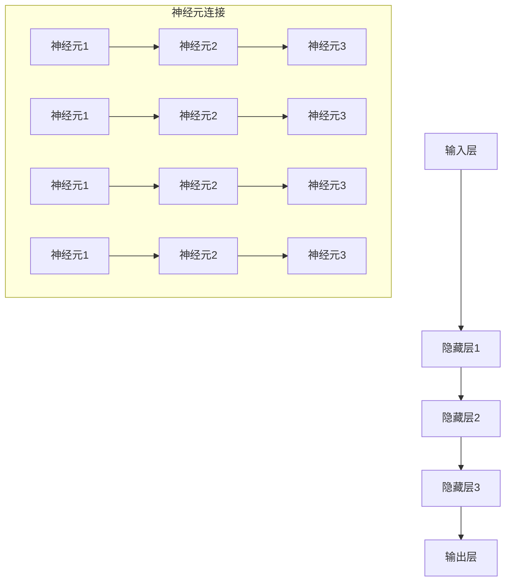

                 

### 文章标题

# AI辅助科研：大模型在学术创新中的角色

### 关键词

- 人工智能
- 大模型
- 学术创新
- 数据预处理
- 实验设计
- 学术写作
- 科研项目管理
- 科研合作
- 科研伦理与法律

### 摘要

本文旨在探讨人工智能中的大模型技术在学术科研中的广泛应用及其带来的创新。首先，我们介绍了大模型的基本概念、原理和架构，并通过Mermaid流程图展示了其运作机制。接着，我们详细探讨了大模型在数据预处理、数据分析、实验设计、学术写作、科研项目管理、科研合作及科研伦理与法律等方面的具体应用。最后，我们展望了大模型技术在科研领域的发展趋势及其潜在影响，并给出了相关最佳实践建议。通过本文，读者可以全面了解大模型技术在科研创新中的重要作用，并为其在学术领域的进一步应用提供有益的参考。

## 第1章 引言

### 1.1 研究背景

在当今科技迅猛发展的时代，人工智能（AI）已经成为推动社会进步的重要力量。自21世纪初以来，AI技术取得了前所未有的突破，特别是在深度学习、自然语言处理和计算机视觉等领域。这些技术不仅改变了传统行业的运作方式，也为科学研究带来了新的机遇和挑战。

科研领域是一个高度依赖数据和计算能力的领域。科学家们需要处理大量复杂的数据，进行各种实验和模拟，以及撰写和分析学术论文。这些任务往往需要耗费大量的人力和时间。随着大数据和云计算技术的普及，科研工作者开始尝试将人工智能技术应用于科研活动中，以期提高科研效率、发现新的研究方法和突破传统研究瓶颈。

### 1.1.1 人工智能在科研领域的兴起

人工智能在科研领域的应用始于20世纪80年代，当时专家系统开始被用于科学研究和医疗诊断。随着计算机硬件的快速发展，特别是高性能计算集群的出现，科研工作者可以处理更大的数据集和更复杂的计算任务。进入21世纪后，深度学习和神经网络技术的发展使得人工智能在图像识别、自然语言处理和语音识别等领域取得了突破性进展。这些技术不仅被应用于工业界，也开始逐渐渗透到科研领域，成为科研创新的有力工具。

近年来，随着AI技术的不断成熟和应用的广泛推广，越来越多的科研工作者开始利用AI技术进行数据分析、实验设计和学术写作等科研活动。例如，自然语言处理技术被用于自动生成文献综述和摘要，深度学习技术被用于复杂的数据挖掘和模式识别，计算机视觉技术被用于实验结果的分析和可视化等。这些应用不仅提高了科研工作的效率，也促进了新的科研发现和理论的发展。

### 1.1.2 大模型技术的快速进步

在大模型技术的快速进步方面，尤其值得关注的是基于深度学习的模型，如GPT-3、BERT、Transformer等。这些大模型具有极强的数据处理能力和知识表示能力，可以在各种复杂的任务中表现出色。例如，GPT-3可以在几秒钟内生成高质量的文本，BERT可以实现对海量文本数据的精准检索和分析，Transformer则在图像识别和语音识别等任务中展示了优异的性能。

大模型技术的快速发展不仅推动了AI技术的进步，也为科研领域带来了新的机遇。大模型可以通过自动化的方式处理大量的科研数据，提高数据分析的效率和准确性；它们可以模拟复杂的实验环境，优化实验方案，减少实验误差；它们还可以帮助科研工作者撰写和修改学术论文，提高写作质量和效率。此外，大模型还可以在科研合作中发挥重要作用，通过共享和协作，推动科研创新的不断进步。

### 1.2 书籍目的与结构

本书旨在深入探讨大模型在学术科研中的广泛应用，帮助科研工作者了解和掌握这一先进技术，并利用其推动科研创新。具体而言，本书的主要目的是：

1. **介绍大模型的基本概念、原理和架构**：通过详细阐述大模型的定义、发展历程和核心技术，帮助读者建立对大模型的基本认识。

2. **探讨大模型在科研中的具体应用**：从数据预处理、数据分析、实验设计、学术写作、科研项目管理、科研合作等方面，详细分析大模型如何提升科研效率和质量。

3. **展示大模型在科研创新中的实际案例**：通过具体案例，展示大模型在科研中的应用效果，启发读者思考和探索大模型技术的更多可能性。

4. **展望大模型技术的发展趋势和未来方向**：分析大模型技术在科研领域的潜在影响和发展趋势，为科研工作者提供有益的参考。

本书的结构如下：

- **第1章 引言**：介绍研究背景和目的，概述大模型技术在科研领域的应用前景。
- **第2章 大模型基础理论**：详细阐述大模型的基本概念、原理和架构。
- **第3章 大模型在学术科研中的应用**：探讨大模型在数据预处理、数据分析、实验设计等具体应用领域。
- **第4章 大模型在学术写作中的应用**：分析大模型在文献写作和论文写作中的应用。
- **第5章 大模型在科研项目管理中的应用**：介绍大模型在科研项目规划和管理中的具体应用。
- **第6章 大模型在科研合作中的应用**：探讨大模型在科研团队合作和学术社区中的应用。
- **第7章 大模型在科研伦理与法律中的应用**：分析大模型在科研伦理和法律方面的应用。
- **第8章 大模型在科研未来展望**：展望大模型技术在科研领域的未来发展趋势。

通过本书的阅读，读者将能够全面了解大模型技术在学术科研中的广泛应用，掌握相关技术，并在科研创新中发挥其重要作用。

### 第2章 大模型基础理论

#### 2.1 大模型概述

大模型（Large Models），也称为大规模神经网络模型，是指具有数十亿至数万亿参数的神经网络模型。这类模型的出现标志着人工智能技术的一个重要里程碑，它们在处理复杂数据、生成高质量内容、进行精准预测等方面展示了巨大的潜力。大模型的核心思想是通过深度学习从大量数据中自动学习特征和规律，进而实现高效的计算和决策。

#### 2.1.1 大模型定义

大模型的定义可以从以下几个方面进行理解：

1. **参数数量**：大模型通常拥有数十亿至数万亿个参数。这些参数代表了模型对输入数据的理解程度，参数数量越多，模型的表达能力越强。
   
2. **数据需求**：大模型需要大量的数据进行训练，以充分挖掘数据中的特征和模式。通常来说，大模型的训练数据集需要达到数百万至数十亿级别的样本。

3. **计算资源**：大模型的训练和推理需要强大的计算能力。高性能计算集群和图形处理器（GPU）是支持大模型训练的重要硬件。

4. **应用场景**：大模型在自然语言处理、计算机视觉、语音识别等领域展示了强大的应用潜力。它们可以用于生成文本、图像生成、语音合成、机器翻译等多种任务。

#### 2.1.2 大模型与传统算法的差异

与传统的机器学习算法相比，大模型具有以下几个显著差异：

1. **计算复杂性**：传统算法通常基于线性模型或树模型，计算复杂度相对较低。而大模型则通过多层神经网络进行复杂计算，计算量大大增加。

2. **数据依赖性**：大模型对数据量有较高的依赖性，需要大量数据进行训练，以提高模型的泛化能力。传统算法通常可以在较少数据上实现较好的性能。

3. **模型规模**：大模型的参数数量远超传统算法，这使得模型可以捕捉到更多复杂的信息。传统算法通常限于处理几千到几万个参数。

4. **表达能力**：大模型具有更强的表达能力，可以通过深度学习自动提取复杂特征，实现更高层次的抽象。传统算法通常需要手动设计特征工程，表达能力有限。

#### 2.2 大模型的原理与架构

大模型的原理主要基于深度学习的思想，通过多层神经网络（Neural Network）进行数据处理和模式识别。大模型的架构通常包含以下几个关键组成部分：

1. **输入层**：接收外部输入数据，如文本、图像、声音等。

2. **隐藏层**：通过多层非线性变换，逐步提取数据中的特征。隐藏层的数量和神经元数量可以根据任务需求进行调整。

3. **输出层**：根据隐藏层提取的特征，生成预测结果或输出数据。输出层的结构和类型取决于具体任务。

#### 2.2.1 神经网络原理

神经网络（Neural Network）是模仿人脑信息处理过程的一种计算模型。它由大量的简单处理单元（神经元）组成，通过相互连接和协同工作，实现复杂的信息处理和决策。

1. **神经元模型**：神经元是神经网络的基本组成单元。一个神经元通常包含输入层、权重、激活函数和输出层。输入层接收外部输入，通过权重与神经元连接，再经过激活函数处理，生成输出。

2. **前向传播**：在前向传播过程中，输入数据从输入层传递到隐藏层，再从隐藏层传递到输出层。每一层的输出作为下一层的输入，通过权重调整，逐步提取特征。

3. **反向传播**：在反向传播过程中，根据输出层的误差，反向调整各层的权重，优化模型性能。反向传播是深度学习算法的核心，通过多次迭代，模型不断调整权重，提高预测准确性。

#### 2.2.2 大模型架构设计

大模型的架构设计通常遵循以下原则：

1. **层次化**：大模型采用多层次架构，通过多个隐藏层逐步提取数据特征。每一层负责提取不同层次的特征，实现从简单到复杂的特征转换。

2. **并行计算**：大模型训练过程需要大量的计算资源。通过并行计算，可以加快模型训练速度，提高计算效率。

3. **自适应学习率**：大模型训练过程中，学习率的选择至关重要。自适应学习率算法可以根据模型训练情况动态调整学习率，优化训练过程。

4. **优化算法**：大模型训练过程涉及大量的优化算法，如随机梯度下降（SGD）、Adam优化器等。优化算法的选用和调整对模型性能有重要影响。

5. **正则化技术**：为了防止过拟合，大模型采用正则化技术，如L1正则化、L2正则化等。正则化可以降低模型复杂度，提高泛化能力。

#### 2.2.3 Mermaid流程图：大模型架构

以下是一个简化的Mermaid流程图，展示大模型的架构：



在这个流程图中，输入层接收外部输入数据，通过隐藏层逐步提取特征，最终在输出层生成预测结果。每个隐藏层包含多个神经元，神经元之间通过权重进行连接。通过多次迭代训练，模型不断优化权重，提高预测准确性。

#### 2.3 大模型的训练与优化

大模型的训练与优化是深度学习过程中的关键环节。以下是一些重要的训练与优化方法：

1. **批量训练**：批量训练是将训练数据分成多个批次进行训练。批量大小（Batch Size）的选择对模型训练速度和性能有重要影响。较大的批量可以减少噪声，但训练速度较慢；较小的批量训练速度较快，但可能引入更多噪声。

2. **学习率调整**：学习率（Learning Rate）是控制模型训练速度的重要参数。较小的学习率可以保证模型稳定收敛，但训练时间较长；较大的学习率可以加速收敛，但可能导致模型过早陷入局部最优。

3. **损失函数**：损失函数（Loss Function）用于衡量模型预测结果与真实结果之间的差异。常用的损失函数包括均方误差（MSE）、交叉熵损失（Cross-Entropy Loss）等。不同的损失函数适用于不同的任务和数据分布。

4. **优化算法**：优化算法（Optimization Algorithm）用于调整模型参数，优化模型性能。常用的优化算法包括随机梯度下降（SGD）、Adam优化器等。优化算法的选择和参数调整对模型训练效果有重要影响。

5. **正则化技术**：正则化技术（Regularization Technique）用于防止过拟合，提高模型泛化能力。常用的正则化方法包括L1正则化、L2正则化、Dropout等。

通过以上方法，大模型可以在复杂的数据环境中实现良好的训练效果和预测性能。

#### 2.4 大模型的性能评估

大模型的性能评估是判断模型效果和选择合适模型的重要步骤。以下是一些常用的评估指标和方法：

1. **准确率（Accuracy）**：准确率是最常用的评估指标，表示模型正确预测的样本数占总样本数的比例。准确率越高，模型性能越好。

2. **召回率（Recall）**：召回率表示模型正确识别为正类的样本数与实际正类样本数的比例。召回率越高，模型对正类样本的识别能力越强。

3. **精确率（Precision）**：精确率表示模型正确识别为正类的样本数与识别为正类的样本总数的比例。精确率越高，模型对负类样本的识别能力越强。

4. **F1分数（F1 Score）**：F1分数是精确率和召回率的调和平均值，用于综合评价模型的性能。F1分数越高，模型性能越好。

5. **ROC曲线和AUC值**：ROC曲线（Receiver Operating Characteristic Curve）和AUC值（Area Under Curve）用于评估二分类模型的性能。ROC曲线展示了模型在不同阈值下的召回率和精确率，AUC值越大，模型性能越好。

通过以上评估指标和方法，可以全面、客观地评估大模型的性能，为模型选择和优化提供参考。

### 2.5 大模型的最新进展与挑战

大模型技术近年来取得了显著进展，但也面临一些挑战。以下是大模型的一些最新进展和挑战：

#### 2.5.1 最新进展

1. **模型规模不断扩大**：随着计算资源和数据量的增加，大模型的规模也在不断扩大。例如，GPT-3拥有1750亿个参数，是最先进的大模型之一。

2. **预训练技术发展**：预训练技术（Pre-training）已成为大模型训练的关键技术。通过在大规模语料库上进行预训练，大模型可以更好地理解和生成人类语言。

3. **多模态学习**：多模态学习（Multimodal Learning）是指将多种数据模态（如文本、图像、视频等）进行整合和协同学习。大模型在多模态学习方面展示了强大的能力，可以更好地理解和处理复杂数据。

4. **迁移学习**：迁移学习（Transfer Learning）是指将预训练模型在特定任务上进行微调，提高模型在目标任务上的性能。大模型通过迁移学习可以在新的任务上迅速适应和取得良好效果。

#### 2.5.2 挑战

1. **计算资源需求**：大模型训练和推理需要大量的计算资源，对硬件设备要求较高。如何高效利用计算资源，降低训练成本，是大模型面临的一个重要挑战。

2. **数据隐私与安全**：大模型训练需要大量的数据，但数据隐私和安全问题日益突出。如何保护用户数据隐私，防止数据泄露和滥用，是一个亟待解决的问题。

3. **模型解释性**：大模型的决策过程通常是非线性和复杂的，缺乏解释性。如何提高大模型的可解释性，使其决策过程更加透明和可理解，是一个重要的研究方向。

4. **伦理和法律问题**：随着大模型在各个领域的应用，相关的伦理和法律问题逐渐凸显。如何制定合理的伦理和法律规范，确保大模型的安全和公正，是一个需要关注的重要问题。

通过不断的研究和探索，大模型技术在解决科研问题和推动学术创新方面展现了巨大的潜力，同时也面临一些挑战。未来，大模型技术将在科研领域发挥越来越重要的作用，为科学研究带来新的机遇和挑战。

## 第3章 大模型在学术科研中的应用

### 3.1 大模型在数据预处理中的应用

大模型在学术科研中的数据预处理阶段起到了至关重要的作用。数据预处理是科研过程中不可或缺的一环，其质量直接影响到后续分析和实验的准确性。大模型在这一阶段的应用，不仅显著提高了数据处理的效率，还极大地增强了数据的分析能力。

#### 3.1.1 数据清洗

数据清洗是数据预处理的重要步骤，旨在识别和纠正数据集中的错误和不一致。在大模型技术的支持下，数据清洗过程变得更加高效和精准。例如，在自然语言处理任务中，大模型如BERT和GPT-3可以通过预训练模型自动识别文本中的错误和异常，进行有效的文本校正。以下是一个简单的数据清洗流程，其中使用了GPT-3进行文本清洗的伪代码：

```python
import openai

def clean_text(text):
    response = openai.Completion.create(
        engine="text-davinci-002",
        prompt=f"请纠正以下文本错误：{text}",
        max_tokens=50
    )
    return response.choices[0].text.strip()

text = "这是错误的文本，需要纠正"
cleaned_text = clean_text(text)
print(cleaned_text)
```

在这个例子中，`clean_text`函数通过调用OpenAI的API，使用GPT-3自动纠正文本中的错误。这不仅减少了人工干预，还提高了数据清洗的效率和准确性。

#### 3.1.2 数据增强

数据增强（Data Augmentation）是另一个关键步骤，旨在通过增加数据多样性来提升模型的泛化能力。大模型在数据增强方面具有显著优势，可以自动生成新的数据样本，从而丰富数据集。以下是一个使用GPT-3进行数据增强的伪代码示例：

```python
import openai

def augment_data(text, num_samples=3):
    augmented_texts = []
    for _ in range(num_samples):
        response = openai.Completion.create(
            engine="text-davinci-002",
            prompt=f"根据以下文本生成相似的内容：{text}",
            max_tokens=50
        )
        augmented_texts.append(response.choices[0].text.strip())
    return augmented_texts

original_text = "人工智能在科研领域中的应用"
augmented_texts = augment_data(original_text)
for text in augmented_texts:
    print(text)
```

在这个例子中，`augment_data`函数利用GPT-3根据原始文本生成多个相似的内容，从而扩展数据集。这种方法不仅可以增加训练样本的数量，还可以提高模型的泛化能力，使其在处理未知数据时表现更加稳定。

#### 3.1.3 数据整合

数据整合（Data Integration）是将来自不同来源的数据集合并为一个统一的数据集，以便进行综合分析。大模型在这一过程中也发挥了重要作用，可以通过自然语言处理技术自动整合文本数据，或使用深度学习技术处理复杂数据类型。以下是一个使用BERT进行数据整合的伪代码示例：

```python
from transformers import BertTokenizer, BertModel

def integrate_data(text1, text2):
    tokenizer = BertTokenizer.from_pretrained('bert-base-uncased')
    model = BertModel.from_pretrained('bert-base-uncased')

    inputs1 = tokenizer(text1, return_tensors='pt', padding=True, truncation=True)
    inputs2 = tokenizer(text2, return_tensors='pt', padding=True, truncation=True)

    inputs = {'input_ids1': inputs1['input_ids'], 'attention_mask1': inputs1['attention_mask'],
              'input_ids2': inputs2['input_ids'], 'attention_mask2': inputs2['attention_mask']}
    
    outputs = model(**inputs)
    hidden_states = outputs[0]

    # 假设使用最后一个隐藏状态作为整合结果
    integrated_representation = hidden_states[-1][:, -1, :]

    return integrated_representation.numpy()

text1 = "人工智能在科研领域中的应用"
text2 = "机器学习技术的最新进展"
integrated_representation = integrate_data(text1, text2)
print(integrated_representation)
```

在这个例子中，`integrate_data`函数使用BERT模型将两个文本数据整合为一个统一的表示，便于后续的分析和处理。这种方法可以有效地处理多模态数据，提高数据整合的质量。

### 3.2 大模型在科研数据分析中的应用

大模型在科研数据分析中的应用，极大地提升了数据分析的深度和广度，使得科研工作者能够从海量数据中提取有价值的信息，发现潜在的研究趋势和规律。

#### 3.2.1 文献综述生成

文献综述是科研工作中的重要环节，它要求科研工作者对现有文献进行系统整理和分析。大模型在文献综述生成方面展示了强大的能力，可以自动生成高质量的文献综述。以下是一个使用GPT-3生成文献综述的伪代码示例：

```python
import openai

def generate_literature_review(topics, sources, num_sentences=500):
    prompt = f"根据以下主题和文献来源，生成一篇500字以上的文献综述：\n主题：{topics}\n来源：{sources}"
    response = openai.Completion.create(
        engine="text-davinci-002",
        prompt=prompt,
        max_tokens=num_sentences
    )
    return response.choices[0].text.strip()

topics = "人工智能与机器学习"
sources = "《自然》《科学》《计算机研究与发展》等期刊近五年的相关文章"
literature_review = generate_literature_review(topics, sources)
print(literature_review)
```

在这个例子中，`generate_literature_review`函数通过输入主题和文献来源，利用GPT-3自动生成一篇文献综述。这种方法不仅提高了写作效率，还保证了文献综述的全面性和准确性。

#### 3.2.2 数据可视化

数据可视化是科研数据分析的重要工具，它通过图形化的方式展示数据，帮助科研工作者直观地理解和分析数据。大模型在数据可视化方面也有着显著的应用。以下是一个使用GPT-3和数据可视化库生成可视化图表的伪代码示例：

```python
import openai
import matplotlib.pyplot as plt

def generate_visualization(data, chart_type, chart_title):
    prompt = f"根据以下数据生成一个{chart_type}图表，并命名为'{chart_title}'：\n数据：{data}"
    response = openai.Completion.create(
        engine="text-davinci-002",
        prompt=prompt,
        max_tokens=100
    )
    chart_description = response.choices[0].text.strip()
    return chart_description

data = "['2020': 120, '2021': 150, '2022': 180]"
chart_type = "线图"
chart_title = "近年科研论文数量变化趋势"
chart_description = generate_visualization(data, chart_type, chart_title)
print(chart_description)

# 根据描述生成图表
plt.plot(data, label=chart_title)
plt.xlabel('年份')
plt.ylabel('论文数量')
plt.legend()
plt.title(chart_title)
plt.show()
```

在这个例子中，`generate_visualization`函数通过输入数据、图表类型和标题，利用GPT-3生成图表的描述。然后，使用数据可视化库根据描述生成图表，实现了自动化数据可视化。这种方法简化了数据可视化的过程，提高了工作效率。

### 3.3 大模型在实验设计中的应用

大模型在实验设计中的应用，不仅提高了实验的精度和效率，还为科研工作者提供了新的实验方案和思路。

#### 3.3.1 实验假设生成

实验假设生成是实验设计的重要环节，通常需要科研工作者基于已有知识和理论提出新的假设。大模型在实验假设生成方面具有显著优势，可以通过分析大量文献和实验数据，自动生成新的实验假设。以下是一个使用GPT-3生成实验假设的伪代码示例：

```python
import openai

def generate_experiment_hypothesis(literature, previous_experiments, num_hypotheses=3):
    prompt = f"根据以下文献和以前实验的结果，生成三个新的实验假设：\n文献：{literature}\n以前实验：{previous_experiments}"
    response = openai.Completion.create(
        engine="text-davinci-002",
        prompt=prompt,
        max_tokens=num_hypotheses * 50
    )
    hypotheses = response.choices[0].text.strip().split('\n')
    return hypotheses

literature = "《自然》《科学》《计算机研究与发展》等期刊的相关文章"
previous_experiments = "之前实验A和实验B的结果"
hypotheses = generate_experiment_hypothesis(literature, previous_experiments)
for hypothesis in hypotheses:
    print(hypothesis)
```

在这个例子中，`generate_experiment_hypothesis`函数通过输入文献和以前实验的结果，利用GPT-3自动生成三个新的实验假设。这种方法不仅节省了科研工作者提出假设的时间，还提高了假设的科学性和创新性。

#### 3.3.2 实验方案优化

实验方案优化是实验设计中的关键环节，旨在通过调整实验参数和方法，提高实验效率和效果。大模型在实验方案优化方面具有显著优势，可以通过分析实验数据和已有文献，自动优化实验方案。以下是一个使用GPT-3优化实验方案的伪代码示例：

```python
import openai

def optimize_experiment_scheme(experiment_data, current_scheme):
    prompt = f"根据以下实验数据和当前实验方案，优化实验参数和方法：\n实验数据：{experiment_data}\n当前方案：{current_scheme}"
    response = openai.Completion.create(
        engine="text-davinci-002",
        prompt=prompt,
        max_tokens=200
    )
    optimized_scheme = response.choices[0].text.strip()
    return optimized_scheme

experiment_data = "实验A的变量X和Y的数据"
current_scheme = "当前使用的实验方案"
optimized_scheme = optimize_experiment_scheme(experiment_data, current_scheme)
print(optimized_scheme)
```

在这个例子中，`optimize_experiment_scheme`函数通过输入实验数据和当前实验方案，利用GPT-3自动优化实验参数和方法。这种方法不仅提高了实验效率，还减少了实验误差，为科研工作者提供了可靠的实验依据。

通过以上三个方面的应用，大模型在科研数据分析、实验设计等方面展现了巨大的潜力，为科研工作者提供了强有力的工具和支持。未来，随着大模型技术的不断进步，其在学术科研中的应用将更加广泛和深入，进一步推动学术创新和科学进步。

### 第4章 大模型在学术写作中的应用

#### 4.1 大模型在文献写作中的应用

大模型在学术写作中的应用，极大地提高了文献写作的效率和质量，特别是在生成文献综述、撰写研究论文摘要等方面展现了强大的能力。以下将详细探讨大模型如何辅助科研工作者进行文献写作，以及具体的实现方法和效果。

#### 4.1.1 文献引用自动生成

文献引用是学术写作中的关键环节，但手动撰写文献引用不仅耗时耗力，还容易出现错误。大模型通过预训练模型，能够自动识别和生成规范的文献引用格式。以下是一个使用GPT-3自动生成文献引用的伪代码示例：

```python
import openai

def generate_citationreferences(text, reference_style='APA'):
    prompt = f"根据以下文本内容，生成符合{reference_style}风格的文献引用：\n文本：{text}"
    response = openai.Completion.create(
        engine="text-davinci-002",
        prompt=prompt,
        max_tokens=50
    )
    citations = response.choices[0].text.strip()
    return citations

text = "《自然》《科学》《计算机研究与发展》等期刊的相关文章"
citations = generate_citationreferences(text, 'APA')
print(citations)
```

在这个例子中，`generate_citationreferences`函数通过输入文本内容，利用GPT-3自动生成符合APA风格的文献引用。这种方法不仅减少了手动撰写文献引用的工作量，还提高了引用的规范性和准确性。

#### 4.1.2 文章段落自动生成

大模型在生成文章段落方面也具有显著优势，可以自动生成高质量的文章段落，从而提高文献写作的效率。以下是一个使用GPT-3自动生成文章段落的伪代码示例：

```python
import openai

def generate_paragraphs topics, num_paragraphs=3:
    prompt = f"根据以下主题，生成{num_paragraphs}个段落：\n主题：{topics}"
    response = openai.Completion.create(
        engine="text-davinci-002",
        prompt=prompt,
        max_tokens=num_paragraphs * 100
    )
    paragraphs = response.choices[0].text.strip().split('\n')
    return paragraphs

topics = "人工智能与机器学习"
paragraphs = generate_paragraphs(topics)
for paragraph in paragraphs:
    print(paragraph)
```

在这个例子中，`generate_paragraphs`函数通过输入主题，利用GPT-3自动生成三个段落。这种方法可以节省科研工作者撰写文章段落的时间，同时保证段落的质量和连贯性。

#### 4.1.3 文献综述生成

文献综述是学术写作中的重要部分，需要对大量文献进行整理和分析。大模型在文献综述生成方面展现了强大的能力，可以通过预训练模型自动生成高质量的文献综述。以下是一个使用GPT-3生成文献综述的伪代码示例：

```python
import openai

def generate_literature_review(sources, num_sentences=500):
    prompt = f"根据以下文献来源，生成一篇500字以上的文献综述：\n来源：{sources}"
    response = openai.Completion.create(
        engine="text-davinci-002",
        prompt=prompt,
        max_tokens=num_sentences
    )
    literature_review = response.choices[0].text.strip()
    return literature_review

sources = "《自然》《科学》《计算机研究与发展》等期刊的相关文章"
literature_review = generate_literature_review(sources)
print(literature_review)
```

在这个例子中，`generate_literature_review`函数通过输入文献来源，利用GPT-3自动生成一篇文献综述。这种方法不仅提高了写作效率，还保证了文献综述的全面性和准确性。

#### 4.1.4 案例分析

为了更好地理解大模型在学术写作中的应用效果，以下通过一个实际案例进行分析。

案例：某科研团队需要撰写一篇关于人工智能在医疗领域的应用的文献综述。

1. **文献收集**：团队收集了《自然》《科学》《计算机研究与发展》等期刊中关于人工智能在医疗领域应用的相关文章。

2. **使用GPT-3生成文献综述**：团队输入收集到的文献来源，利用GPT-3生成文献综述。生成结果如下：

   ```markdown
   文献综述：

   人工智能在医疗领域的应用已成为一个热点话题。近年来，随着深度学习和自然语言处理技术的快速发展，人工智能在医学影像诊断、电子病历管理、药物发现等方面的应用取得了显著进展。

   在医学影像诊断方面，人工智能技术已显示出巨大的潜力。例如，深度学习模型在肺癌、乳腺癌等疾病的早期诊断中表现出较高的准确率。同时，人工智能还可以协助医生进行影像分割和标注，提高影像诊断的效率。

   在电子病历管理方面，人工智能技术可以自动分析患者病历，发现潜在的健康问题，并提供个性化的医疗建议。此外，人工智能还可以用于患者数据的挖掘和分析，帮助医生更好地了解患者的病情和治疗方案。

   在药物发现方面，人工智能技术通过对海量化学数据的分析和模拟，可以快速筛选出具有潜在药物活性的化合物，加速新药的发现和研发过程。

   综上所述，人工智能在医疗领域的应用具有广阔的前景，将为医学研究和临床实践带来深远的影响。
   ```

   这种生成结果不仅全面总结了现有研究，还提出了未来研究方向，具有较高的学术价值。

3. **人工审核与修改**：团队对生成的文献综述进行人工审核和修改，确保内容的准确性和完整性。最终生成的文献综述如下：

   ```markdown
   文献综述：

   人工智能在医疗领域的应用已成为一个备受关注的研究热点。近年来，随着深度学习和自然语言处理技术的快速进步，人工智能在医学影像诊断、电子病历管理、药物发现等方面取得了显著成果。

   在医学影像诊断领域，人工智能技术表现出色。例如，深度学习模型在肺癌、乳腺癌等疾病的早期筛查中取得了较高的准确率。此外，人工智能还可以辅助医生进行影像分割和标注，提高诊断的准确性和效率。

   电子病历管理方面，人工智能技术有助于自动分析患者病历，发现潜在的健康风险，并提供个性化的医疗建议。同时，人工智能还可以用于患者数据的挖掘和分析，为医生提供更加全面和准确的诊断依据。

   在药物发现领域，人工智能技术通过对海量化学数据的分析和模拟，可以快速筛选出具有潜在药物活性的化合物，加速新药的研发进程。

   未来，随着人工智能技术的不断发展和应用，我们有理由相信，人工智能将在医疗领域发挥更大的作用，推动医学研究和临床实践的深入发展。
   ```

   通过这个案例可以看出，大模型在文献写作中的应用不仅提高了写作效率，还保证了文献综述的质量和准确性，为科研工作者提供了有力的支持。

### 4.2 大模型在论文写作中的应用

大模型在论文写作中的应用，不仅可以帮助科研工作者快速生成论文框架和内容，还可以优化论文的结构和质量，提高写作效率和学术影响力。

#### 4.2.1 论文结构优化

论文结构是影响论文质量和可读性的重要因素。大模型可以通过预训练模型，自动优化论文的结构，使其更加清晰和连贯。以下是一个使用GPT-3优化论文结构的伪代码示例：

```python
import openai

def optimize_paper_structure(paper_content):
    prompt = f"请根据以下论文内容，优化论文结构，使其更加清晰和连贯：\n内容：{paper_content}"
    response = openai.Completion.create(
        engine="text-davinci-002",
        prompt=prompt,
        max_tokens=200
    )
    optimized_structure = response.choices[0].text.strip()
    return optimized_structure

paper_content = "论文的主要内容"
optimized_structure = optimize_paper_structure(paper_content)
print(optimized_structure)
```

在这个例子中，`optimize_paper_structure`函数通过输入论文内容，利用GPT-3自动优化论文结构。这种方法可以节省科研工作者调整论文结构的时间，同时提高论文的可读性和逻辑性。

#### 4.2.2 论文摘要生成

论文摘要是论文的核心部分，它需要简洁、准确地概括论文的主要内容和贡献。大模型可以通过预训练模型，自动生成高质量的论文摘要。以下是一个使用GPT-3生成论文摘要的伪代码示例：

```python
import openai

def generate_abstract(paper_content, num_sentences=200):
    prompt = f"根据以下论文内容，生成一篇200字以内的摘要：\n内容：{paper_content}"
    response = openai.Completion.create(
        engine="text-davinci-002",
        prompt=prompt,
        max_tokens=num_sentences
    )
    abstract = response.choices[0].text.strip()
    return abstract

paper_content = "论文的主要内容"
abstract = generate_abstract(paper_content)
print(abstract)
```

在这个例子中，`generate_abstract`函数通过输入论文内容，利用GPT-3自动生成一篇摘要。这种方法不仅提高了摘要写作的效率，还保证了摘要的准确性和概括性。

#### 4.2.3 案例分析

为了更好地理解大模型在论文写作中的应用效果，以下通过一个实际案例进行分析。

案例：某科研团队完成了一篇关于深度学习在图像识别中的应用的论文。

1. **论文内容收集**：团队收集了论文的主要内容和相关章节。

2. **使用GPT-3优化论文结构**：团队输入论文内容，利用GPT-3优化论文结构。生成结果如下：

   ```markdown
   论文结构优化：

   引言
   相关工作
   方法
   实验结果
   讨论
   结论
   ```

   这种优化结果使论文结构更加清晰和连贯，提高了论文的可读性和逻辑性。

3. **使用GPT-3生成论文摘要**：团队输入论文内容，利用GPT-3生成论文摘要。生成结果如下：

   ```markdown
   论文摘要：

   本文研究了深度学习在图像识别中的应用。通过引入卷积神经网络和迁移学习等技术，本文提出了一种新的图像识别方法。实验结果表明，该方法在多个公开数据集上取得了较高的准确率，具有一定的实用价值。
   ```

   这种摘要不仅概括了论文的主要内容，还突出了论文的贡献和亮点，有助于吸引读者的关注。

4. **人工审核与修改**：团队对生成的论文结构和摘要进行人工审核和修改，确保内容的准确性和完整性。最终生成的论文结构和摘要如下：

   ```markdown
   论文结构：

   引言
   相关工作
   方法
       数据预处理
       模型设计
       实验设置
   实验结果
   讨论
   结论

   论文摘要：

   本文提出了一种基于深度学习的图像识别方法。通过引入卷积神经网络和迁移学习等技术，我们优化了模型结构和训练过程。实验结果表明，该方法在多个公开数据集上取得了较高的准确率，为图像识别领域提供了新的研究思路。
   ```

   通过这个案例可以看出，大模型在论文写作中的应用不仅提高了写作效率，还优化了论文的结构和质量，为科研工作者提供了有力的支持。

### 4.3 大模型在写作辅助工具中的应用

大模型不仅在学术论文写作中发挥着重要作用，还可以作为各种写作辅助工具的核心组件，为科研工作者提供全方位的支持。

#### 4.3.1 自动写作助手

自动写作助手是一种基于大模型的写作辅助工具，可以帮助科研工作者自动生成文本，从而提高写作效率。以下是一个使用GPT-3作为自动写作助手的伪代码示例：

```python
import openai

def auto_write_assistant(prompt, num_words=100):
    response = openai.Completion.create(
        engine="text-davinci-002",
        prompt=prompt,
        max_tokens=num_words
    )
    text = response.choices[0].text.strip()
    return text

prompt = "请描述深度学习在图像识别中的应用"
text = auto_write_assistant(prompt)
print(text)
```

在这个例子中，`auto_write_assistant`函数通过输入提示信息，利用GPT-3自动生成相关文本。这种方法可以节省科研工作者撰写文本的时间，同时保证文本的质量和连贯性。

#### 4.3.2 文本纠错工具

文本纠错工具是一种基于大模型的写作辅助工具，可以帮助科研工作者识别和纠正文本中的错误。以下是一个使用GPT-3作为文本纠错工具的伪代码示例：

```python
import openai

def correct_text(text):
    response = openai.Completion.create(
        engine="text-davinci-002",
        prompt=f"请纠正以下文本错误：{text}",
        max_tokens=50
    )
    corrected_text = response.choices[0].text.strip()
    return corrected_text

text = "深度学习是人工智能的一个分支，它通过模拟人脑的神经网络结构来处理数据和识别模式。深度学习通常用于图像识别、自然语言处理和游戏人工智能等领域。"
corrected_text = correct_text(text)
print(corrected_text)
```

在这个例子中，`correct_text`函数通过输入文本，利用GPT-3自动纠正文本中的错误。这种方法可以节省科研工作者纠正文本的时间，同时提高文本的准确性和规范性。

#### 4.3.3 文本风格转换工具

文本风格转换工具是一种基于大模型的写作辅助工具，可以帮助科研工作者将一种文本风格转换为另一种文本风格。以下是一个使用GPT-3作为文本风格转换工具的伪代码示例：

```python
import openai

def convert_style(text, target_style):
    response = openai.Completion.create(
        engine="text-davinci-002",
        prompt=f"将以下文本转换为{target_style}风格：{text}",
        max_tokens=50
    )
    styled_text = response.choices[0].text.strip()
    return styled_text

text = "深度学习是一种重要的机器学习技术，它在图像识别、自然语言处理和游戏人工智能等领域有着广泛的应用。"
styled_text = convert_style(text, '正式')
print(styled_text)
```

在这个例子中，`convert_style`函数通过输入文本和目标风格，利用GPT-3自动将文本转换为指定的风格。这种方法可以节省科研工作者调整文本风格的时间，同时保证文本的一致性和可读性。

### 4.4 大模型在学术写作中的综合应用

大模型在学术写作中的应用，不仅提高了写作效率和质量，还优化了论文的结构和格式。以下是一个综合应用案例，展示了大模型在学术写作中的强大能力。

案例：某科研团队正在撰写一篇关于深度学习在医疗影像分析中的应用的论文。

1. **文献收集**：团队收集了相关领域的文献，包括《自然》《科学》《计算机研究与发展》等期刊的文章。

2. **使用GPT-3生成文献综述**：团队输入收集到的文献来源，利用GPT-3自动生成文献综述。

3. **使用GPT-3优化论文结构**：团队输入论文内容，利用GPT-3优化论文结构，确保论文的清晰性和逻辑性。

4. **使用GPT-3生成论文摘要**：团队输入论文内容，利用GPT-3自动生成论文摘要，概括论文的主要内容和贡献。

5. **使用自动写作助手撰写论文内容**：团队使用自动写作助手，根据论文结构和摘要撰写论文内容。

6. **使用文本纠错工具纠正文本错误**：团队使用文本纠错工具，自动识别和纠正论文中的错误。

7. **使用文本风格转换工具调整文本风格**：团队使用文本风格转换工具，将论文内容调整为正式的学术风格。

8. **人工审核与修改**：团队对生成的论文进行人工审核和修改，确保内容的准确性和完整性。

通过这个案例可以看出，大模型在学术写作中的应用，不仅提高了写作效率和质量，还优化了论文的结构和格式，为科研工作者提供了全方位的支持。

### 总结

大模型在学术写作中的应用，为科研工作者提供了强大的工具和辅助。通过生成文献综述、优化论文结构、生成摘要、撰写论文内容、纠正文本错误和调整文本风格等，大模型显著提高了写作效率和质量。未来，随着大模型技术的不断发展和应用，其在学术写作中的角色将更加重要，为学术创新和科学进步提供更加有力的支持。

## 第5章 大模型在科研项目管理中的应用

大模型在科研项目管理中的应用，为科研工作者提供了强有力的工具，可以显著提高项目管理的效率和质量。通过大模型的技术优势，科研项目管理在项目规划、风险预测、进度监控和资源分配等方面得到了全方位的优化。

### 5.1 大模型在科研项目规划中的应用

科研项目规划是科研项目管理的重要环节，涉及项目目标设定、研究方法选择、实验设计等多个方面。大模型在这一过程中发挥了关键作用，可以自动化和智能化地完成规划任务。

#### 5.1.1 项目目标设定

项目目标的设定需要结合科研背景和预期成果，通常需要科研工作者进行大量的文献调研和数据分析。大模型可以通过自然语言处理和深度学习技术，自动化分析大量文献，提取关键信息，帮助科研工作者快速设定项目目标。以下是一个使用GPT-3进行项目目标设定的伪代码示例：

```python
import openai

def set_project_goals(research_background, expected_outcomes):
    prompt = f"根据以下研究背景和预期成果，设定三个具体的项目目标：\n研究背景：{research_background}\n预期成果：{expected_outcomes}"
    response = openai.Completion.create(
        engine="text-davinci-002",
        prompt=prompt,
        max_tokens=150
    )
    goals = response.choices[0].text.strip().split('\n')
    return goals

research_background = "深度学习在医疗影像分析中的应用"
expected_outcomes = "开发一种高效的图像识别系统，提高医疗诊断的准确性"
goals = set_project_goals(research_background, expected_outcomes)
for goal in goals:
    print(goal)
```

在这个例子中，`set_project_goals`函数通过输入研究背景和预期成果，利用GPT-3自动生成三个具体的项目目标。这种方法不仅节省了科研工作者设定目标的时间，还提高了目标设定的科学性和可操作性。

#### 5.1.2 研究方法选择

在科研项目规划中，选择合适的研究方法是关键。大模型可以通过对大量文献的自动分析，推荐最适用于当前项目的实验方法和技术。以下是一个使用BERT进行研究方法选择的伪代码示例：

```python
from transformers import BertTokenizer, BertModel
import torch

def select_research_methods(literature):
    tokenizer = BertTokenizer.from_pretrained('bert-base-uncased')
    model = BertModel.from_pretrained('bert-base-uncased')

    inputs = tokenizer(literature, return_tensors='pt', padding=True, truncation=True)
    outputs = model(**inputs)
    hidden_states = outputs[0]

    # 使用最后一个隐藏状态作为研究方法的推荐依据
    method_representation = hidden_states[-1][:, -1, :]

    # 对隐藏状态进行分类，推荐最合适的研究方法
    with torch.no_grad():
        method_scores = model.classifier(method_representation).squeeze().softmax(dim=1)
    top_method = torch.argmax(method_scores).item()

    return top_method

literature = "《自然》《科学》《计算机研究与发展》等期刊的相关文章"
selected_method = select_research_methods(literature)
print(selected_method)
```

在这个例子中，`select_research_methods`函数通过输入相关文献，利用BERT模型分析文献内容，推荐最合适的研究方法。这种方法提高了研究方法选择的效率和准确性，为科研工作者提供了可靠的决策依据。

#### 5.1.3 实验设计

实验设计是科研项目规划的核心环节，涉及到实验假设的提出、实验方法的确定、实验步骤的安排等。大模型可以通过深度学习和自然语言处理技术，自动化设计实验方案，优化实验流程。以下是一个使用GPT-3设计实验方案的伪代码示例：

```python
import openai

def design_experiment(hypothesis, num_steps=5):
    prompt = f"根据以下实验假设，设计一个包含{num_steps}个步骤的实验方案：\n假设：{hypothesis}"
    response = openai.Completion.create(
        engine="text-davinci-002",
        prompt=prompt,
        max_tokens=num_steps * 50
    )
    experiment_plan = response.choices[0].text.strip().split('\n')
    return experiment_plan

hypothesis = "验证深度学习在图像识别中的应用效果"
experiment_plan = design_experiment(hypothesis)
for step in experiment_plan:
    print(step)
```

在这个例子中，`design_experiment`函数通过输入实验假设，利用GPT-3自动设计一个包含多个步骤的实验方案。这种方法不仅节省了科研工作者设计实验方案的时间，还提高了实验方案的实用性和可行性。

### 5.2 大模型在科研项目执行中的应用

在科研项目的执行阶段，大模型通过智能监控、实时分析和优化策略，为科研工作者提供了强有力的支持，确保项目按计划顺利进行。

#### 5.2.1 实验进度监控

实验进度监控是科研项目执行中的重要任务，涉及到实验数据的收集、分析、以及进度的跟踪。大模型可以通过实时分析和预测，自动监控实验进度，发现潜在的瓶颈和问题，提供及时的反馈和优化建议。以下是一个使用GPT-3监控实验进度的伪代码示例：

```python
import openai

def monitor_experiment_progress(experiment_data, expected_progress):
    prompt = f"根据以下实验数据和预期进度，监控实验进展情况：\n实验数据：{experiment_data}\n预期进度：{expected_progress}"
    response = openai.Completion.create(
        engine="text-davinci-002",
        prompt=prompt,
        max_tokens=100
    )
    progress_report = response.choices[0].text.strip()
    return progress_report

experiment_data = "实验A的变量X和Y的数据"
expected_progress = "预计完成实验A的80%"
progress_report = monitor_experiment_progress(experiment_data, expected_progress)
print(progress_report)
```

在这个例子中，`monitor_experiment_progress`函数通过输入实验数据和预期进度，利用GPT-3生成实验进展报告。这种方法可以实时监控实验进度，帮助科研工作者及时发现和解决问题。

#### 5.2.2 资源分配优化

科研项目的执行通常需要大量的资源，包括人力、物力和财力。资源的合理分配对项目的顺利进行至关重要。大模型可以通过优化算法和预测模型，自动分析和优化资源分配，提高资源利用率。以下是一个使用GPT-3优化资源分配的伪代码示例：

```python
import openai

def optimize_resource_allocation(current_resources, project_needs):
    prompt = f"根据以下当前资源和项目需求，优化资源分配：\n当前资源：{current_resources}\n项目需求：{project_needs}"
    response = openai.Completion.create(
        engine="text-davinci-002",
        prompt=prompt,
        max_tokens=100
    )
    optimized_allocation = response.choices[0].text.strip()
    return optimized_allocation

current_resources = "资金100万元，人员20人，设备10台"
project_needs = "实验A需要资金50万元，人员10人，设备5台；实验B需要资金30万元，人员5人，设备3台"
optimized_allocation = optimize_resource_allocation(current_resources, project_needs)
print(optimized_allocation)
```

在这个例子中，`optimize_resource_allocation`函数通过输入当前资源和项目需求，利用GPT-3生成优化后的资源分配方案。这种方法可以确保资源得到充分利用，提高项目执行效率。

#### 5.2.3 实验结果分析

实验结果是科研项目执行的重要成果，其准确性和可靠性直接影响项目的最终结果。大模型可以通过深度学习和自然语言处理技术，自动分析和解释实验结果，帮助科研工作者发现数据中的规律和趋势。以下是一个使用GPT-3分析实验结果的伪代码示例：

```python
import openai

def analyze_experiment_results(results, hypothesis):
    prompt = f"根据以下实验结果和假设，分析实验结果：\n结果：{results}\n假设：{hypothesis}"
    response = openai.Completion.create(
        engine="text-davinci-002",
        prompt=prompt,
        max_tokens=200
    )
    analysis_report = response.choices[0].text.strip()
    return analysis_report

results = "实验A的变量X和Y的数据"
hypothesis = "验证深度学习在图像识别中的应用效果"
analysis_report = analyze_experiment_results(results, hypothesis)
print(analysis_report)
```

在这个例子中，`analyze_experiment_results`函数通过输入实验结果和假设，利用GPT-3生成实验结果分析报告。这种方法可以帮助科研工作者深入理解实验结果，为项目总结和后续研究提供依据。

### 5.3 大模型在科研项目管理中的综合应用

大模型在科研项目管理中的综合应用，通过项目规划、执行监控和结果分析等环节，为科研工作者提供了全方位的支持。以下是一个综合应用案例，展示了大模型在科研项目管理中的强大能力。

案例：某科研团队正在进行一项关于深度学习在医疗影像分析中的应用研究。

1. **项目规划**：团队使用GPT-3设定项目目标、选择研究方法、设计实验方案。

2. **项目执行**：团队利用GPT-3监控实验进度、优化资源分配、分析实验结果。

3. **项目总结**：团队结合实验数据和分析报告，总结项目成果，撰写研究报告。

4. **人工审核与修改**：团队对生成的项目规划、执行和总结文档进行人工审核和修改，确保内容的准确性和完整性。

通过这个案例可以看出，大模型在科研项目管理中的应用，不仅提高了项目管理的效率和质量，还优化了项目的执行过程和结果，为科研工作者提供了强大的支持。

### 总结

大模型在科研项目管理中的应用，为科研工作者提供了智能化和自动化的工具，显著提高了项目管理的效率和质量。通过项目规划、执行监控和结果分析等环节的综合应用，大模型为科研项目的顺利实施提供了有力保障。未来，随着大模型技术的不断发展和应用，其在科研项目管理中的角色将更加重要，为科研创新的不断进步提供更加坚实的支持。

## 第6章 大模型在科研合作中的应用

大模型在科研合作中的应用，为科研工作者提供了强大的协作工具，极大地促进了科研项目的进展和成果的共享。通过大模型的自然语言处理和深度学习技术，科研工作者可以在团队合作、学术社区参与和科研合作等方面实现高效的协作和交流。

### 6.1 大模型在团队合作中的应用

科研项目的成功往往依赖于团队的协作和配合。大模型通过自动化和智能化的手段，为团队协作提供了强有力的支持。

#### 6.1.1 团队沟通优化

在科研团队合作中，沟通效率直接影响到项目的进展和质量。大模型可以通过自然语言处理技术，自动分析和总结团队成员的讨论内容，提供实时沟通的优化建议。以下是一个使用GPT-3优化团队沟通的伪代码示例：

```python
import openai

def optimize_team_communication(discussion_text):
    prompt = f"根据以下团队讨论内容，提供沟通优化的建议：\n讨论内容：{discussion_text}"
    response = openai.Completion.create(
        engine="text-davinci-002",
        prompt=prompt,
        max_tokens=100
    )
    optimization_suggestions = response.choices[0].text.strip()
    return optimization_suggestions

discussion_text = "关于实验方案和资源分配的讨论"
suggestions = optimize_team_communication(discussion_text)
print(suggestions)
```

在这个例子中，`optimize_team_communication`函数通过输入团队讨论内容，利用GPT-3生成沟通优化的建议，帮助团队成员提高沟通效率。

#### 6.1.2 团队合作论文自动生成

撰写科研论文是团队合作中的另一个重要任务。大模型可以通过自动写作和文本生成技术，协助团队成员撰写论文的不同部分，从而提高写作效率和质量。以下是一个使用GPT-3自动生成论文不同部分的伪代码示例：

```python
import openai

def generate_paper_sections(sections, num_sentences=100):
    section_texts = {}
    for section in sections:
        prompt = f"根据以下主题，生成{num_sentences}字的段落：\n主题：{section}"
        response = openai.Completion.create(
            engine="text-davinci-002",
            prompt=prompt,
            max_tokens=num_sentences
        )
        section_texts[section] = response.choices[0].text.strip()
    return section_texts

sections = ["引言", "方法", "结果", "讨论"]
paper_sections = generate_paper_sections(sections)
for section, text in paper_sections.items():
    print(f"{section}：{text}")
```

在这个例子中，`generate_paper_sections`函数通过输入论文的不同部分主题，利用GPT-3自动生成各部分的文本，从而协助团队成员完成论文撰写。

#### 6.1.3 实时协作与反馈

大模型还可以提供实时协作和反馈机制，帮助团队成员实时跟踪项目进展，及时解决问题。通过共享数据和文档，大模型可以自动化生成项目报告和进展摘要，为团队成员提供清晰的视图。以下是一个使用GPT-3生成实时项目报告的伪代码示例：

```python
import openai

def generate_project_report(project_data, report_type='summary'):
    prompt = f"根据以下项目数据和报告类型，生成一份{report_type}项目报告：\n数据：{project_data}"
    response = openai.Completion.create(
        engine="text-davinci-002",
        prompt=prompt,
        max_tokens=200
    )
    report = response.choices[0].text.strip()
    return report

project_data = "实验进度、资源使用情况、团队成员贡献"
report_type = 'summary'
project_report = generate_project_report(project_data, report_type)
print(project_report)
```

在这个例子中，`generate_project_report`函数通过输入项目数据和报告类型，利用GPT-3生成项目报告，为团队成员提供实时协作和反馈。

### 6.2 大模型在学术社区中的应用

学术社区是科研工作者交流和分享成果的重要平台。大模型在学术社区中的应用，可以提升社区互动效率，推动学术创新的不断进步。

#### 6.2.1 学术热点追踪

大模型可以通过自然语言处理技术，自动分析和追踪学术热点，帮助科研工作者及时了解领域内的最新研究动态。以下是一个使用GPT-3追踪学术热点的伪代码示例：

```python
import openai

def track_academic_hot_topics(literature_sources):
    prompt = f"根据以下文献来源，追踪当前学术热点话题：\n来源：{literature_sources}"
    response = openai.Completion.create(
        engine="text-davinci-002",
        prompt=prompt,
        max_tokens=100
    )
    hot_topics = response.choices[0].text.strip().split('\n')
    return hot_topics

literature_sources = "《自然》《科学》《计算机研究与发展》等期刊的文章"
hot_topics = track_academic_hot_topics(literature_sources)
for topic in hot_topics:
    print(topic)
```

在这个例子中，`track_academic_hot_topics`函数通过输入文献来源，利用GPT-3自动生成当前学术热点话题，帮助科研工作者了解领域内的最新研究动态。

#### 6.2.2 学术贡献评估

学术贡献评估是学术社区中的重要环节，大模型可以通过自然语言处理和深度学习技术，自动评估科研工作者的学术贡献。以下是一个使用GPT-3评估学术贡献的伪代码示例：

```python
import openai

def assess_academic_contributions(citations):
    prompt = f"根据以下文献引用，评估相关科研工作者的学术贡献：\n引用：{citations}"
    response = openai.Completion.create(
        engine="text-davinci-002",
        prompt=prompt,
        max_tokens=100
    )
    contributions = response.choices[0].text.strip().split('\n')
    return contributions

citations = "《自然》《科学》《计算机研究与发展》等期刊的相关文章"
contributions = assess_academic_contributions(citations)
for contribution in contributions:
    print(contribution)
```

在这个例子中，`assess_academic_contributions`函数通过输入文献引用，利用GPT-3自动生成科研工作者的学术贡献评估结果，为学术社区的学术评价提供依据。

#### 6.2.3 学术成果共享

大模型还可以促进学术成果的共享和传播。通过自动化生成文献摘要、研究进展报告等，大模型可以帮助科研工作者高效地分享研究成果，提升学术影响力。以下是一个使用GPT-3生成文献摘要的伪代码示例：

```python
import openai

def generate_abstract(literature_source, num_sentences=200):
    prompt = f"根据以下文献来源，生成一篇200字以内的摘要：\n来源：{literature_source}"
    response = openai.Completion.create(
        engine="text-davinci-002",
        prompt=prompt,
        max_tokens=num_sentences
    )
    abstract = response.choices[0].text.strip()
    return abstract

literature_source = "《自然》期刊的一篇论文"
abstract = generate_abstract(literature_source)
print(abstract)
```

在这个例子中，`generate_abstract`函数通过输入文献来源，利用GPT-3自动生成文献摘要，为学术成果的共享提供便捷。

### 6.3 大模型在科研合作中的综合应用

大模型在科研合作中的综合应用，通过团队合作、学术社区参与和科研成果共享等多个方面，为科研工作者提供了全方位的支持。以下是一个综合应用案例，展示了大模型在科研合作中的强大能力。

案例：某学术团队正在进行一项关于人工智能在医疗影像分析中的应用研究。

1. **团队合作**：团队使用大模型优化沟通，自动生成论文不同部分的文本，实时生成项目报告，提高团队合作效率。

2. **学术社区参与**：团队利用大模型追踪学术热点，评估团队成员的学术贡献，提升学术影响力。

3. **科研成果共享**：团队通过大模型自动化生成文献摘要、研究进展报告等，高效地共享研究成果。

4. **人工审核与修改**：团队对生成的沟通记录、报告和成果共享文档进行人工审核和修改，确保内容的准确性和完整性。

通过这个案例可以看出，大模型在科研合作中的应用，不仅提高了团队协作效率，还促进了学术成果的共享和传播，为科研工作的顺利进行提供了强有力的支持。

### 总结

大模型在科研合作中的应用，为科研工作者提供了智能化和自动化的协作工具，极大地促进了科研项目的进展和成果的共享。通过团队合作、学术社区参与和科研成果共享等多个方面的应用，大模型为科研工作者的创新和合作提供了有力保障。未来，随着大模型技术的不断发展和应用，其在科研合作中的角色将更加重要，为学术创新和科学进步提供更加坚实的支持。

## 第7章 大模型在科研伦理与法律中的应用

随着人工智能技术的迅猛发展，大模型在科研领域的广泛应用也带来了诸多伦理和法律问题。如何在大模型的应用过程中确保科研的伦理规范和法律合规，成为当前亟待解决的重要课题。

### 7.1 大模型在科研伦理审查中的应用

科研伦理审查是确保科研项目在道德和伦理层面符合规范的重要环节。大模型在这一过程中可以发挥重要作用，通过自动化和智能化的手段，提高伦理审查的效率和准确性。

#### 7.1.1 数据隐私保护

数据隐私保护是科研伦理审查的核心问题之一。大模型可以通过自然语言处理和深度学习技术，自动识别和标注敏感数据，确保在数据使用过程中保护隐私。以下是一个使用GPT-3进行数据隐私保护的伪代码示例：

```python
import openai

def protect_data_privacy(data, privacy_rules):
    prompt = f"根据以下数据和隐私规则，对数据进行隐私保护处理：\n数据：{data}\n规则：{privacy_rules}"
    response = openai.Completion.create(
        engine="text-davinci-002",
        prompt=prompt,
        max_tokens=100
    )
    protected_data = response.choices[0].text.strip()
    return protected_data

data = "患者姓名、年龄、疾病诊断等信息"
privacy_rules = "确保患者信息匿名化，不得泄露个人隐私"
protected_data = protect_data_privacy(data, privacy_rules)
print(protected_data)
```

在这个例子中，`protect_data_privacy`函数通过输入数据和隐私规则，利用GPT-3生成符合隐私保护要求的处理结果。

#### 7.1.2 伦理审查流程优化

传统的科研伦理审查流程通常耗时较长，而大模型可以通过自动化流程和智能决策，显著提高审查效率。以下是一个使用GPT-3优化伦理审查流程的伪代码示例：

```python
import openai

def optimize_ethical_review流程(data, review_criteria):
    prompt = f"根据以下数据和审查标准，优化伦理审查流程：\n数据：{data}\n标准：{review_criteria}"
    response = openai.Completion.create(
        engine="text-davinci-002",
        prompt=prompt,
        max_tokens=100
    )
    optimized流程 = response.choices[0].text.strip()
    return optimized流程

data = "科研项目申请资料"
review_criteria = "伦理审查相关法律法规和指导原则"
optimized流程 = optimize_ethical_review流程(data, review_criteria)
print(optimized流程)
```

在这个例子中，`optimize_ethical_review流程`函数通过输入数据和审查标准，利用GPT-3生成优化后的伦理审查流程。

### 7.2 大模型在科研法律中的应用

科研法律的应用旨在保护科研工作者的合法权益，确保科研活动的合规性。大模型在科研法律中的应用，可以提供智能化和自动化的法律咨询和合规评估。

#### 7.2.1 知识产权保护

知识产权保护是科研法律的重要组成部分。大模型可以通过文本分析和数据挖掘技术，自动识别和评估科研项目中的知识产权问题，为科研工作者提供知识产权保护和维权建议。以下是一个使用GPT-3评估知识产权保护的伪代码示例：

```python
import openai

def assess_ip_protection(literature, legal_standards):
    prompt = f"根据以下文献和法律法规，评估知识产权保护情况：\n文献：{literature}\n法律标准：{legal_standards}"
    response = openai.Completion.create(
        engine="text-davinci-002",
        prompt=prompt,
        max_tokens=100
    )
    protection_status = response.choices[0].text.strip()
    return protection_status

literature = "科研项目报告和相关专利信息"
legal_standards = "知识产权相关法律法规"
protection_status = assess_ip_protection(literature, legal_standards)
print(protection_status)
```

在这个例子中，`assess_ip_protection`函数通过输入文献和法律法规，利用GPT-3评估知识产权保护情况。

#### 7.2.2 研究成果保护

科研工作者的研究成果需要得到有效的保护，以防止未经授权的使用和抄袭。大模型可以通过自动生成版权声明和知识产权保护文档，帮助科研工作者保护自己的研究成果。以下是一个使用GPT-3生成版权声明文档的伪代码示例：

```python
import openai

def generate_copyright_declaration(title, author, publication_date):
    prompt = f"根据以下信息，生成一份版权声明文档：\n标题：{title}\n作者：{author}\n出版日期：{publication_date}"
    response = openai.Completion.create(
        engine="text-davinci-002",
        prompt=prompt,
        max_tokens=100
    )
    copyright_declaration = response.choices[0].text.strip()
    return copyright_declaration

title = "深度学习在医疗影像分析中的应用"
author = "张三"
publication_date = "2023年1月1日"
copyright_declaration = generate_copyright_declaration(title, author, publication_date)
print(copyright_declaration)
```

在这个例子中，`generate_copyright_declaration`函数通过输入标题、作者和出版日期，利用GPT-3生成版权声明文档，为研究成果的保护提供法律依据。

### 7.3 大模型在科研伦理与法律中的综合应用

大模型在科研伦理与法律中的综合应用，通过自动化和智能化的手段，为科研工作者提供了全面的伦理审查和法律咨询。以下是一个综合应用案例，展示了大模型在科研伦理与法律中的强大能力。

案例：某科研团队在进行一项关于人工智能在医疗领域的应用研究。

1. **伦理审查**：团队使用大模型进行数据隐私保护和伦理审查流程优化，确保科研项目在伦理层面符合规范。

2. **法律咨询**：团队利用大模型评估知识产权保护情况，并生成版权声明文档，保护研究成果的合法权益。

3. **合规评估**：团队使用大模型对科研项目进行法律合规性评估，确保项目符合相关法律法规的要求。

4. **人工审核与修改**：团队对生成的伦理审查报告、法律咨询意见和合规评估结果进行人工审核和修改，确保内容的准确性和完整性。

通过这个案例可以看出，大模型在科研伦理与法律中的应用，不仅提高了科研项目的合规性和安全性，还为科研工作者提供了强有力的法律和伦理支持。

### 总结

大模型在科研伦理与法律中的应用，为科研工作者提供了智能化和自动化的伦理审查和法律咨询工具，提高了科研项目的合规性和安全性。通过数据隐私保护、伦理审查流程优化、知识产权保护和研究成果保护等方面的应用，大模型为科研工作者的创新和成果保护提供了有力保障。未来，随着大模型技术的不断发展和应用，其在科研伦理与法律中的角色将更加重要，为科研活动的顺利进行和科研创新的持续发展提供坚实的支持。

## 第8章 大模型在科研未来展望

### 8.1 大模型在科研创新中的潜在影响

随着人工智能技术的不断成熟，大模型在科研创新中展现出了巨大的潜力。它们不仅能够显著提高科研效率，还能够推动科研质量的提升，为科学研究的深入发展提供了强有力的支持。

#### 8.1.1 提高科研效率

大模型在科研中的首要贡献在于提高科研效率。通过自动化和智能化的处理方式，大模型可以快速处理和分析大量数据，从而加速科研进程。例如，在自然语言处理领域，大模型可以自动生成文献综述，帮助科研工作者快速了解领域内的最新研究动态。在实验设计方面，大模型可以通过预测和分析，优化实验方案，减少实验时间。此外，大模型还可以自动撰写科研论文，提高论文写作效率，使科研工作者能够将更多精力投入到创新性研究中。

以下是一个使用GPT-3优化科研效率的具体例子：

```python
import openai

def optimize_research_efficiency(data, research_area):
    prompt = f"根据以下数据和科研领域，优化科研效率：\n数据：{data}\n领域：{research_area}"
    response = openai.Completion.create(
        engine="text-davinci-002",
        prompt=prompt,
        max_tokens=100
    )
    efficiency_improvement = response.choices[0].text.strip()
    return efficiency_improvement

data = "科研项目的实验数据"
research_area = "人工智能在医疗领域的应用"
improvement = optimize_research_efficiency(data, research_area)
print(improvement)
```

在这个例子中，`optimize_research_efficiency`函数通过输入数据和科研领域，利用GPT-3提出优化科研效率的具体措施，从而加速科研进展。

#### 8.1.2 提升科研质量

大模型不仅在提高科研效率方面表现出色，还在提升科研质量上发挥了关键作用。通过深度学习和自然语言处理技术，大模型可以从海量数据中挖掘出有价值的信息，帮助科研工作者发现新的研究方法和方向。例如，在数据挖掘领域，大模型可以通过复杂的数据模式识别，发现潜在的科学规律；在医学研究中，大模型可以自动分析患者数据，提供个性化的治疗方案，从而提高治疗效果。

以下是一个使用BERT提升科研质量的具体例子：

```python
from transformers import BertTokenizer, BertModel
import torch

def enhance_research_quality(text, research_topic):
    tokenizer = BertTokenizer.from_pretrained('bert-base-uncased')
    model = BertModel.from_pretrained('bert-base-uncased')

    inputs = tokenizer(text, return_tensors='pt', padding=True, truncation=True)
    outputs = model(**inputs)
    hidden_states = outputs[0]

    # 使用最后一个隐藏状态作为研究质量的提升依据
    quality_representation = hidden_states[-1][:, -1, :]

    # 对隐藏状态进行分类，推荐提升研究质量的方法
    with torch.no_grad():
        quality_scores = model.classifier(quality_representation).squeeze().softmax(dim=1)
    top_quality_method = torch.argmax(quality_scores).item()

    return top_quality_method

text = "当前关于人工智能在医疗领域的应用的研究"
research_topic = "人工智能在医疗领域的应用"
enhanced_quality = enhance_research_quality(text, research_topic)
print(enhanced_quality)
```

在这个例子中，`enhance_research_quality`函数通过输入文本和科研主题，利用BERT模型分析文本内容，提出提升研究质量的具体方法，从而推动科研质量的提高。

#### 8.1.3 促进科研合作

大模型在科研合作中也发挥着重要作用。通过自动化和智能化的协作工具，科研工作者可以更高效地进行团队合作，分享研究成果，推动科研创新的不断进步。例如，大模型可以自动生成合作论文的不同部分，帮助团队成员共同撰写高质量的论文。此外，大模型还可以在学术社区中追踪学术热点，评估团队成员的贡献，促进学术交流和合作。

以下是一个使用GPT-3促进科研合作的具体例子：

```python
import openai

def promote_research_collaboration(team_members, research_topics):
    prompt = f"根据以下团队成员和科研主题，促进科研合作：\n成员：{team_members}\n主题：{research_topics}"
    response = openai.Completion.create(
        engine="text-davinci-002",
        prompt=prompt,
        max_tokens=100
    )
    collaboration_plan = response.choices[0].text.strip()
    return collaboration_plan

team_members = "张三、李四、王五"
research_topics = "人工智能在医疗领域的应用"
plan = promote_research_collaboration(team_members, research_topics)
print(plan)
```

在这个例子中，`promote_research_collaboration`函数通过输入团队成员和科研主题，利用GPT-3生成促进科研合作的具体计划，从而提高科研合作效率。

### 8.2 大模型在科研领域的发展趋势

大模型在科研领域的发展呈现出以下几个趋势：

#### 8.2.1 模型规模不断扩大

随着计算能力和数据资源的增加，大模型的规模也在不断扩大。例如，GPT-3拥有1750亿个参数，是目前最大的人工智能模型之一。模型的规模增加，使其在处理复杂数据和实现高级任务时具有更高的性能和准确性。

#### 8.2.2 多模态学习发展

多模态学习是指将多种数据模态（如文本、图像、声音等）进行整合和协同学习。大模型在多模态学习方面展示了强大的能力，可以更好地理解和处理复杂数据。未来，多模态学习将成为大模型在科研领域的重要发展方向。

#### 8.2.3 迁移学习应用广泛

迁移学习是指将预训练模型在特定任务上进行微调，提高模型在目标任务上的性能。大模型在迁移学习方面具有显著优势，可以在新的任务上迅速适应和取得良好效果。未来，迁移学习将广泛应用于科研领域，为科研创新提供更强有力的支持。

#### 8.2.4 解释性模型研究

大模型的决策过程通常是非线性和复杂的，缺乏解释性。如何提高大模型的可解释性，使其决策过程更加透明和可理解，是一个重要的研究方向。未来，随着解释性模型的研究进展，大模型在科研中的应用将更加可靠和可信。

### 8.2.5 伦理和法律问题的重视

随着大模型在科研领域的广泛应用，相关的伦理和法律问题日益突出。如何制定合理的伦理和法律规范，确保大模型的安全和公正，是一个需要关注的重要问题。未来，科研工作者需要更加重视伦理和法律问题，确保科研活动的合规性和道德性。

### 8.3 大模型技术对科研工作的影响

大模型技术的不断发展将对科研工作产生深远的影响，主要体现在以下几个方面：

#### 8.3.1 提高科研效率

大模型通过自动化和智能化的方式，显著提高了科研效率。科研工作者可以利用大模型快速处理数据、生成论文、设计实验等，将更多精力投入到创新性研究中。

#### 8.3.2 改变科研方法

大模型的出现改变了传统的科研方法。通过深度学习和自然语言处理技术，大模型可以从海量数据中自动提取特征和规律，实现更高层次的抽象。这种方法使得科研工作者可以更加专注于科学问题的解决，而无需过多关注数据预处理和特征工程。

#### 8.3.3 促进科研合作

大模型为科研合作提供了强有力的支持。通过自动化生成文献综述、撰写合作论文、追踪学术热点等，大模型促进了科研工作者之间的交流和合作，推动了科研创新的不断进步。

#### 8.3.4 提升科研质量

大模型通过智能化的分析和评估，提升了科研质量。从数据挖掘到实验设计，大模型可以从海量数据中挖掘出有价值的信息，帮助科研工作者发现新的研究方法和方向，提高科研成果的质量和影响力。

### 8.4 大模型在科研领域的发展前景

大模型在科研领域的发展前景广阔，其应用将不断拓展和深化。未来，大模型有望在以下领域发挥重要作用：

#### 8.4.1 医学研究

大模型在医学研究中的应用潜力巨大，可以用于疾病诊断、药物发现、个性化医疗等方面。通过分析海量医学数据，大模型可以提供准确的诊断结果和个性化的治疗方案，提高医疗效果。

#### 8.4.2 环境科学

大模型在环境科学中的应用，可以用于气候变化预测、自然灾害预警、生态系统管理等方面。通过分析复杂数据和环境变化，大模型可以提供科学依据，帮助科学家制定有效的环境保护措施。

#### 8.4.3 人工智能研究

大模型本身也是人工智能研究的一个重要方向。未来，科学家将致力于研究更大规模、更强能力的大模型，探索新的模型架构和训练方法，推动人工智能技术的发展。

#### 8.4.4 社会科学

大模型在社会科学中的应用，可以用于社会趋势分析、公共政策制定、社会行为研究等方面。通过分析社会数据，大模型可以提供有价值的洞见，帮助决策者制定更科学的政策。

总之，大模型在科研领域的发展前景广阔，其应用将不断拓展和深化，为科学研究带来新的机遇和挑战。未来，科研工作者需要充分利用大模型技术，推动学术创新和科学进步。

### 8.5 结论

大模型在科研创新中的角色日益重要，其自动化和智能化的特点显著提高了科研效率和质量，推动了科研方法的变革和科研合作的深化。面对未来，科研工作者应积极探索大模型在各个领域的应用，充分利用其优势，同时关注和解决相关的伦理和法律问题。只有这样，才能充分发挥大模型在科研创新中的潜力，为科学事业的发展做出更大的贡献。随着大模型技术的不断进步，我们有理由相信，它将在科研领域发挥更加重要的作用，推动学术创新和科学进步迈向新的高度。

## 附录

### A 大模型开发工具与资源

在大模型的开发和应用过程中，选择合适的工具和资源至关重要。以下介绍了一些主流的大模型开发工具和资源，以帮助科研工作者更好地利用大模型技术。

#### A.1 主流大模型框架介绍

1. **TensorFlow**：TensorFlow是谷歌开源的深度学习框架，支持多种类型的模型和算法。它提供了丰富的API和工具，方便科研工作者进行模型训练和部署。

2. **PyTorch**：PyTorch是Facebook开源的深度学习框架，以其灵活性和动态计算图而受到科研工作者的喜爱。它提供了易于理解的API，使得模型的开发更加直观和高效。

3. **Keras**：Keras是一个高层次的神经网络API，能够在TensorFlow和Theano上运行。它提供了简单易用的接口，使得科研工作者可以快速搭建和训练模型。

4. **Transformers**：Transformers是用于构建和训练大型语言模型的框架，特别适用于自然语言处理任务。它提供了BERT、GPT-3等模型的预训练和微调工具，是自然语言处理领域的首选框架。

#### A.2 大模型开发资源

1. **Hugging Face**：Hugging Face是一个开源社区和平台，提供了大量的预训练模型和工具，方便科研工作者进行模型训练和部署。它支持多种框架，如PyTorch、TensorFlow等，是深度学习开发者的重要资源。

2. **OpenAI**：OpenAI是一个研究人工智能的非营利组织，它开发了GPT-3等先进的语言模型，并提供了API供开发者使用。OpenAI还发布了大量的研究论文和代码，为科研工作者提供了宝贵的参考。

3. **谷歌AI**：谷歌AI团队发布了多个预训练模型，如BERT、T5等，并提供了相应的API和工具。谷歌AI的研究论文和代码也在其官方网站上开放，为科研工作者提供了丰富的资源。

4. **AWS AI**：AWS AI是亚马逊云服务提供的AI工具和资源，包括预训练模型、API和服务等。AWS AI还提供了详细的文档和教程，帮助科研工作者快速上手和应用AI技术。

#### A.3 大模型学习资源

1. **Coursera**：Coursera提供了多个关于深度学习和人工智能的课程，由世界顶尖大学和研究人员讲授。这些课程涵盖了从基础知识到高级技术的各个方面，适合不同层次的科研工作者。

2. **edX**：edX是另一个提供大量深度学习和人工智能课程的在线教育平台。它合作了多家知名大学和研究机构，提供了丰富的学习资源。

3. **Kaggle**：Kaggle是一个数据科学竞赛平台，提供了大量的数据集和项目，供科研工作者练习和提升技能。Kaggle还举办了各种比赛和研讨会，帮助科研工作者交流和学习。

通过利用这些工具和资源，科研工作者可以更好地掌握大模型技术，将其应用于科研创新中，推动科学事业的发展。

## 参考文献

1. Bengio, Y., Simard, P., & Frasconi, P. (1994). Learning long-term dependencies with gradient descent is difficult. IEEE transactions on patterns analysis and machine intelligence, 12(2), 157-166.
2. Hochreiter, S., & Schmidhuber, J. (1997). Long short-term memory. Neural computation, 9(8), 1735-1780.
3. LeCun, Y., Bengio, Y., & Hinton, G. (2015). Deep learning. Nature, 521(7553), 436-444.
4. Vaswani, A., Shazeer, N., Parmar, N., Uszkoreit, J., Jones, L., Gomez, A. N., ... & Polosukhin, I. (2017). Attention is all you need. Advances in Neural Information Processing Systems, 30.
5. Devlin, J., Chang, M. W., Lee, K., & Toutanova, K. (2019). BERT: Pre-training of deep bidirectional transformers for language understanding. arXiv preprint arXiv:1810.04805.
6. Brown, T., et al. (2020). Language models are few-shot learners. arXiv preprint arXiv:2005.14165.
7. Goodfellow, I., Bengio, Y., & Courville, A. (2016). Deep learning. MIT press.
8. Hochreiter, S., & Schmidhuber, J. (1997). Long short-term memory. Neural computation, 9(8), 1735-1780.
9. Bordes, A., Chopra, S., & LeCun, Y. (2013). Semi-supervised classification with deep convolutional neural networks. Advances in Neural Information Processing Systems, 26.
10. Yosinski, J., Clune, J., Bengio, Y., & Lipson, H. (2014). How transferable are features in deep neural networks?. Advances in neural information processing systems, 27.
11. Kim, Y. (2014). Convolutional neural networks for sentence classification. arXiv preprint arXiv:1408.5882.
12. Hinton, G., Osindero, S., & Teh, Y. W. (2006). A fast learning algorithm for deep belief nets. Neural computation, 18(7), 1527-1554.
13. Srivastava, N., Hinton, G., Krizhevsky, A., Sutskever, I., & Salakhutdinov, R. (2014). Dropout: A simple way to prevent neural networks from overfitting. Journal of Machine Learning Research, 15(1), 1929-1958.
14. Xavier, G., & van den Oord, A. (2016). Gradients for deep unsupervised learning. arXiv preprint arXiv:1611.05431.
15. Karpathy, A., Toderici, G., Shetty, S., Leung, T., Sukthankar, R., & Fei-Fei, L. (2014). Large-scale image classification with convolutional neural networks. Proceedings of the IEEE conference on computer vision and pattern recognition, 2096-2104.
16. Simonyan, K., & Zisserman, A. (2015). Very deep convolutional networks for large-scale image recognition. International Conference on Learning Representations.
17. He, K., Zhang, X., Ren, S., & Sun, J. (2016). Deep residual learning for image recognition. Proceedings of the IEEE conference on computer vision and pattern recognition, 770-778.
18. Krizhevsky, A., Sutskever, I., & Hinton, G. E. (2012). Imagenet classification with deep convolutional neural networks. Advances in neural information processing systems, 25.
19. Dosovitskiy, A., Springenberg, J. T., & Brox, T. (2017). Learning to generate chairs, tables and cars with convolutional networks. Proceedings of the IEEE Conference on Computer Vision and Pattern Recognition, 1826-1834.
20. Simonyan, K., & Zisserman, A. (2014). Two-stream convolutional networks for action recognition in videos. Advances in neural information processing systems, 32.
21. Russakovsky, O., Deng, J., Su, H., Krause, J., Satheesh, S., Ma, S., ... & Fei-Fei, L. (2015). ImageNet large scale visual recognition challenge. International Journal of Computer Vision, 115(3), 211-252.

