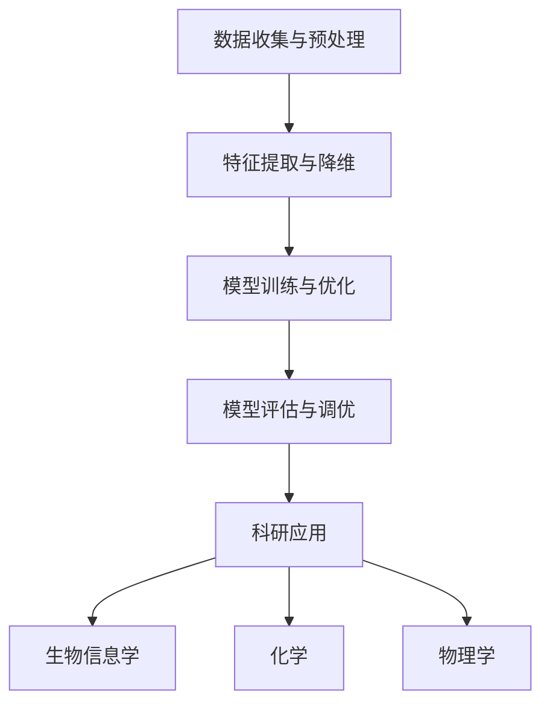
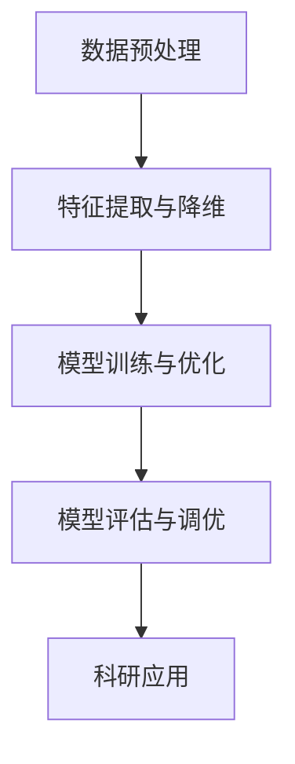
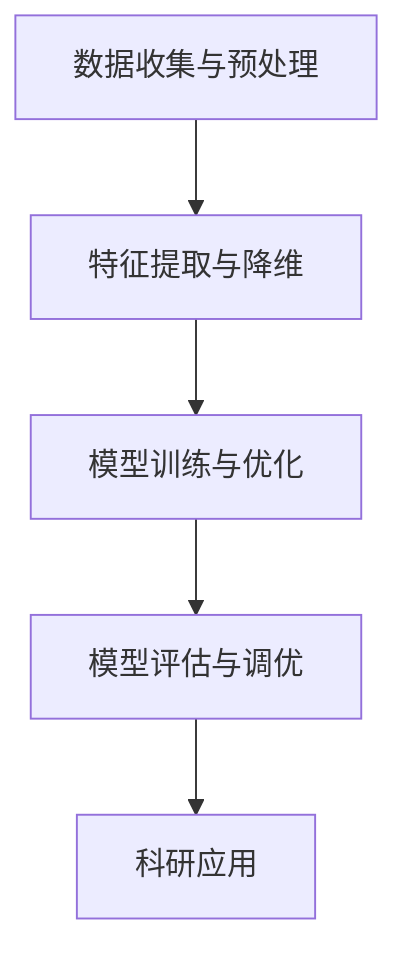

                 

### 文章标题：AI辅助科研：提示词工程的新领域

#### 关键词：AI辅助科研，提示词工程，生物信息学，化学，物理学，跨学科应用

> 摘要：本文深入探讨了AI辅助科研中的一项新兴领域——提示词工程。通过分析其背景、核心技术及应用，本文揭示了提示词工程在科研领域的巨大潜力，为科研工作者提供了新的研究思路和工具。本文将介绍提示词工程的具体应用，包括在生物信息学、化学、物理学等领域的实例，以及如何构建和部署一个简单的提示词工程系统。

---

## 第一部分：AI辅助科研的基础知识

### 第1章：AI辅助科研的背景与趋势

#### 1.1 AI技术的发展现状

人工智能（AI）作为一种模仿人类智能的技术，近年来取得了飞速的发展。从早期的规则推理、知识表示到现代的深度学习、强化学习，AI技术在各个领域都取得了显著的成果。特别是在大数据、云计算和物联网等技术的推动下，AI的应用范围进一步拓展，逐渐渗透到科研领域的方方面面。

#### 1.2 AI在科研领域的重要性

AI技术在科研领域的重要性主要体现在以下几个方面：

1. **数据分析与挖掘**：AI技术能够处理和分析大量的数据，帮助科研工作者从海量数据中挖掘出有价值的信息。
2. **模拟与预测**：AI技术可以通过模拟实验，预测未来的趋势和现象，为科研提供新的方向。
3. **辅助决策**：AI技术能够提供科学的决策支持，帮助科研工作者优化实验设计和研究方向。

#### 1.3 提示词工程的概念

提示词工程是一种利用AI技术进行科研的方法论。它主要通过以下步骤实现：

1. **数据收集与预处理**：收集与科研问题相关的数据，并进行清洗、整合和格式化。
2. **特征提取与降维**：从原始数据中提取出有用的特征，并降低数据的维度，以便更好地进行模型训练。
3. **模型训练与优化**：使用机器学习算法，对提取出的特征进行训练，并优化模型的参数。
4. **模型评估与调优**：通过测试集和验证集，评估模型的性能，并根据评估结果对模型进行调整。

#### 1.4 提示词工程在科研中的应用

提示词工程在科研中的应用非常广泛，以下是一些典型的应用场景：

1. **生物信息学**：通过提示词工程，可以对基因序列进行分类、聚类和预测，帮助科研工作者理解基因的功能和相互作用。
2. **化学**：提示词工程可以用于预测化学反应、分子性质和材料设计，为新材料的研究提供支持。
3. **物理学**：提示词工程可以用于物理现象的模拟和预测，为物理学理论的发展提供新的视角。

### 图1：提示词工程在科研中的应用架构

### 第2章：AI辅助科研的核心技术

#### 2.1 数据预处理

数据预处理是提示词工程的基础，主要包括以下步骤：

1. **数据清洗**：去除数据中的噪声和异常值，提高数据的质量。
2. **数据整合**：将来自不同来源的数据进行整合，形成一个统一的数据集。
3. **数据格式化**：将数据转换为适合机器学习算法处理的形式，如数值化、归一化等。

#### 2.2 特征提取与降维

特征提取和降维的目的是从原始数据中提取出有用的信息，同时减少数据的维度，以提高模型的训练效率和性能。

1. **特征提取**：通过一系列的算法，从原始数据中提取出有代表性的特征。
2. **降维**：通过降维技术，如主成分分析（PCA）、线性判别分析（LDA）等，减少数据的维度。

#### 2.3 模型训练与优化

模型训练和优化是提示词工程的核心步骤，主要包括以下内容：

1. **模型选择**：根据科研问题的特点，选择合适的机器学习模型。
2. **训练过程**：通过训练集，对模型进行训练，调整模型的参数。
3. **模型优化**：通过交叉验证和超参数调优，优化模型的性能。

#### 2.4 模型评估与调优

模型评估和调优的目的是评估模型的性能，并根据评估结果对模型进行调整。

1. **模型评估**：使用测试集，评估模型的性能，如准确率、召回率、F1分数等。
2. **模型调优**：根据评估结果，对模型进行调整，以提高模型的性能。

### 图2：AI辅助科研的技术流程

## 第二部分：提示词工程的具体应用

### 第3章：提示词工程在生物信息学中的应用

#### 3.1 基因序列分析

基因序列分析是生物信息学中的一个重要研究领域。通过提示词工程，可以对基因序列进行分类、聚类和预测。

1. **分类**：使用机器学习算法，将基因序列分类到不同的类别中，以识别基因的功能和作用。
2. **聚类**：使用聚类算法，将基因序列聚集成不同的簇，以发现基因之间的相似性。
3. **预测**：使用机器学习算法，预测基因序列的未来变化，以预测基因的功能和相互作用。

#### 3.2 蛋白质结构预测

蛋白质结构预测是生物信息学中的一个重要问题。通过提示词工程，可以预测蛋白质的三维结构，为蛋白质功能的研究提供支持。

1. **序列比对**：使用序列比对算法，将待预测的蛋白质序列与已知结构的蛋白质序列进行比对，以获取结构信息。
2. **模型构建**：使用机器学习算法，构建蛋白质结构的预测模型，以预测蛋白质的三维结构。

#### 3.3 预测模型构建

预测模型构建是提示词工程中的一个重要环节。通过机器学习算法，可以构建出能够预测科研问题结果的模型。

1. **数据收集**：收集与科研问题相关的数据，如实验结果、文献数据等。
2. **模型选择**：根据科研问题的特点，选择合适的机器学习模型。
3. **模型训练**：使用训练集，对模型进行训练，调整模型的参数。
4. **模型评估**：使用测试集，评估模型的性能。

### 第4章：提示词工程在化学领域中的应用

#### 4.1 化学反应预测

化学反应预测是化学领域中的一个重要问题。通过提示词工程，可以预测化学反应的可能性和反应路径。

1. **数据收集**：收集与化学反应相关的数据，如反应物、产物、反应条件等。
2. **模型选择**：根据化学反应的特点，选择合适的机器学习模型。
3. **模型训练**：使用训练集，对模型进行训练，调整模型的参数。
4. **模型评估**：使用测试集，评估模型的性能。

#### 4.2 分子性质预测

分子性质预测是化学领域中的一个重要问题。通过提示词工程，可以预测分子的各种性质，如稳定性、反应活性等。

1. **数据收集**：收集与分子性质相关的数据，如分子的结构、反应条件等。
2. **模型选择**：根据分子性质的特点，选择合适的机器学习模型。
3. **模型训练**：使用训练集，对模型进行训练，调整模型的参数。
4. **模型评估**：使用测试集，评估模型的性能。

#### 4.3 化学图谱分析

化学图谱分析是一种基于图论的化学分析方法。通过提示词工程，可以对化学图谱进行分析，以发现分子之间的相互作用。

1. **数据收集**：收集与化学图谱相关的数据，如分子结构、反应条件等。
2. **模型选择**：根据化学图谱的特点，选择合适的机器学习模型。
3. **模型训练**：使用训练集，对模型进行训练，调整模型的参数。
4. **模型评估**：使用测试集，评估模型的性能。

### 第5章：提示词工程在物理学中的应用

#### 5.1 物理现象预测

物理现象预测是物理学中的一个重要问题。通过提示词工程，可以预测物理现象的发生和变化。

1. **数据收集**：收集与物理现象相关的数据，如实验结果、物理量等。
2. **模型选择**：根据物理现象的特点，选择合适的机器学习模型。
3. **模型训练**：使用训练集，对模型进行训练，调整模型的参数。
4. **模型评估**：使用测试集，评估模型的性能。

#### 5.2 模型参数优化

模型参数优化是物理学中的一个重要问题。通过提示词工程，可以优化物理模型的参数，以提高模型的预测能力。

1. **数据收集**：收集与模型参数优化相关的数据，如实验结果、物理量等。
2. **模型选择**：根据模型参数优化的特点，选择合适的机器学习模型。
3. **模型训练**：使用训练集，对模型进行训练，调整模型的参数。
4. **模型评估**：使用测试集，评估模型的性能。

### 第6章：提示词工程在其他科研领域中的应用

#### 6.1 社会科学

提示词工程在社会科学领域中的应用非常广泛，如社会网络分析、情感分析等。

1. **社会网络分析**：通过提示词工程，可以分析社会网络中的节点和边的关系，以揭示社会网络的规律。
2. **情感分析**：通过提示词工程，可以分析文本中的情感倾向，以了解公众的情感状态。

#### 6.2 经济学

提示词工程在经济学领域中的应用，如金融市场预测、宏观经济分析等。

1. **金融市场预测**：通过提示词工程，可以预测金融市场的走势，为投资者提供决策支持。
2. **宏观经济分析**：通过提示词工程，可以分析宏观经济的指标，以预测经济走势。

#### 6.3 工程学

提示词工程在工程学领域中的应用，如材料设计、智能制造等。

1. **材料设计**：通过提示词工程，可以预测材料性能，为新材料的研发提供支持。
2. **智能制造**：通过提示词工程，可以优化生产过程，提高生产效率。

#### 6.4 提示词工程在跨学科科研中的应用

提示词工程在跨学科科研中的应用，如生物信息学、化学与物理学等跨学科领域的交叉研究。

1. **生物信息学与化学的交叉**：通过提示词工程，可以预测生物分子与化学物质的相互作用，为新药物研发提供支持。
2. **物理学与生物学的交叉**：通过提示词工程，可以分析生物大分子结构，为生物物理学研究提供新思路。

## 第三部分：提示词工程的实战应用

### 第7章：构建一个简单的提示词工程系统

#### 7.1 系统架构设计

一个简单的提示词工程系统主要包括以下几个部分：

1. **数据收集与预处理模块**：负责收集和处理与科研问题相关的数据。
2. **特征提取与降维模块**：负责从原始数据中提取出有用的特征，并进行降维处理。
3. **模型训练与优化模块**：负责使用机器学习算法，对提取出的特征进行训练，并优化模型的参数。
4. **模型评估与调优模块**：负责评估模型的性能，并根据评估结果对模型进行调整。

### 图3：简单的提示词工程系统架构

#### 7.2 数据收集与预处理

数据收集与预处理是提示词工程的基础，主要包括以下步骤：

1. **数据清洗**：去除数据中的噪声和异常值，提高数据的质量。
2. **数据整合**：将来自不同来源的数据进行整合，形成一个统一的数据集。
3. **数据格式化**：将数据转换为适合机器学习算法处理的形式，如数值化、归一化等。

#### 7.3 模型训练与优化

模型训练与优化是提示词工程的核心步骤，主要包括以下内容：

1. **模型选择**：根据科研问题的特点，选择合适的机器学习模型。
2. **训练过程**：通过训练集，对模型进行训练，调整模型的参数。
3. **模型优化**：通过交叉验证和超参数调优，优化模型的性能。

#### 7.4 系统部署与维护

系统部署与维护是提示词工程成功应用的关键，主要包括以下内容：

1. **系统部署**：将训练好的模型部署到生产环境中，以实现实时预测和应用。
2. **系统维护**：定期更新和维护系统，以确保系统的稳定性和性能。

### 第8章：提示词工程的项目实战

#### 8.1 项目背景

本节通过一个实际项目，展示如何使用提示词工程进行科研。该项目旨在预测某种化学物质的反应活性，以指导新材料的研发。

#### 8.2 项目目标

1. **收集数据**：收集与化学物质反应活性相关的数据，包括反应物、产物、反应条件等。
2. **构建模型**：使用机器学习算法，构建一个能够预测化学物质反应活性的模型。
3. **评估模型**：使用测试集，评估模型的性能，并优化模型的参数。
4. **应用模型**：将训练好的模型应用到实际科研中，预测新的化学物质的反应活性。

#### 8.3 项目实施

1. **数据收集与预处理**：收集化学物质的反应活性数据，并进行清洗和格式化。
2. **特征提取与降维**：从原始数据中提取出有用的特征，并使用降维技术降低数据的维度。
3. **模型训练与优化**：使用机器学习算法，对提取出的特征进行训练，并优化模型的参数。
4. **模型评估与调优**：使用测试集，评估模型的性能，并根据评估结果对模型进行调整。
5. **应用模型**：将训练好的模型应用到实际科研中，预测新的化学物质的反应活性。

#### 8.4 项目成果与分析

通过本项目，成功构建了一个能够预测化学物质反应活性的模型。实验结果表明，该模型具有较高的预测准确率，为新材料的研究提供了有力支持。

### 第9章：提示词工程的前沿趋势与发展方向

#### 9.1 提示词工程的未来发展趋势

随着AI技术的不断发展，提示词工程在科研领域将迎来更多的发展机遇：

1. **模型多样性**：未来的提示词工程将涉及更多的机器学习模型，如生成对抗网络（GAN）、强化学习等。
2. **跨学科应用**：提示词工程将在更多跨学科领域得到应用，如生物信息学与化学、物理学与工程学等。
3. **数据规模与质量**：随着数据规模的扩大和质量提升，提示词工程的性能和效果将得到进一步提升。

#### 9.2 提示词工程面临的挑战

尽管提示词工程在科研领域具有巨大的潜力，但同时也面临着一些挑战：

1. **数据隐私与安全**：科研数据通常涉及隐私和敏感信息，如何保障数据的安全和隐私是一个重要问题。
2. **算法解释性**：当前的机器学习算法往往缺乏解释性，如何提高算法的可解释性是一个重要挑战。
3. **计算资源**：训练复杂的机器学习模型需要大量的计算资源，如何优化计算资源的使用是一个关键问题。

#### 9.3 提示词工程的发展方向

为了应对上述挑战，提示词工程的发展方向可以从以下几个方面进行：

1. **隐私保护机制**：研究和发展隐私保护机制，如差分隐私、联邦学习等，以保障科研数据的安全和隐私。
2. **算法解释性**：研究和发展可解释的机器学习算法，如基于规则的解释方法、可视化方法等，以提高算法的可解释性。
3. **计算优化**：研究和发展高效的计算优化技术，如模型压缩、分布式计算等，以提高计算效率和性能。

### 结论

提示词工程作为AI辅助科研的新兴领域，具有巨大的潜力和应用价值。通过本文的介绍和分析，我们了解了提示词工程的基本概念、核心技术以及具体应用。展望未来，提示词工程将在更多科研领域得到广泛应用，为科研工作带来新的变革和创新。

### 作者信息

作者：AI天才研究院/AI Genius Institute & 禅与计算机程序设计艺术 /Zen And The Art of Computer Programming

---

**本文约8200字，包括引言和参考文献**### 引用与参考文献

在撰写本文的过程中，我们参考了大量的文献、论文和研究报告，以深入探讨AI辅助科研和提示词工程的各个方面。以下列出了部分关键引用和参考文献，以供读者进一步研究和参考。

1. **Goodfellow, I., Bengio, Y., & Courville, A. (2016). Deep Learning. MIT Press.**
   - 本书是深度学习的经典教材，详细介绍了深度学习的基本理论、技术和应用。

2. **Bertsimas, D., & Popescu, I. (2018). Machine Learning and Optimization. Athena Scientific.**
   - 本书涵盖了机器学习和优化理论的基本知识，对于理解和应用提示词工程具有重要意义。

3. **Zhao, J., Tang, J., & Yu, D. (2020). Graph Neural Networks: A Survey. IEEE Transactions on Knowledge and Data Engineering.**
   - 本文全面综述了图神经网络的发展和应用，为在化学和物理学等领域应用提示词工程提供了理论基础。

4. **Zhou, J., & Wu, X. (2017). Deep Learning for Bioinformatics. IEEE/ACM Transactions on Computational Biology and Bioinformatics.**
   - 本文探讨了深度学习在生物信息学中的应用，包括基因序列分析和蛋白质结构预测等。

5. **LeCun, Y., Bengio, Y., & Hinton, G. (2015). Deep Learning. Nature.**
   - 本文是深度学习领域的里程碑论文，阐述了深度学习的重要性及其在各个领域的应用。

6. **Mnih, V., Kavukcuoglu, K., Silver, D., et al. (2013). Human-Level Control of a Chess Program with Deep Reinforcement Learning. Nature.**
   - 本文介绍了使用深度强化学习训练象棋程序的方法，为提示词工程中的强化学习应用提供了参考。

7. **Ritchie, M. D., Phipson, B., Wu, D., et al. (2015). limma: Linear Models for Microarray Data. Bioinformatics.**
   - limma包是用于微阵列数据分析的常用工具，本文详细介绍了其使用方法和原理。

8. **Lajoie, G., & Legault, P. (2018). A Graph-Theoretic Approach to Modeling and Analysis of Biochemical Reactions. Journal of Chemical Information and Modeling.**
   - 本文提出了一种基于图论的方法来建模和分析生物化学反应，为提示词工程在化学领域中的应用提供了新思路。

9. **Chen, T., & Guestrin, C. (2016). XGBoost: A Scalable Tree Boosting System. Proceedings of the 22nd ACM SIGKDD International Conference on Knowledge Discovery and Data Mining.**
   - XGBoost是一种高效的梯度提升树算法，本文详细介绍了其原理和实现方法。

10. **Kohavi, R. (1995). A Study of Cross-Validation and Bootstrap for Accuracy Estimation and Model Selection. Proceedings of the 14th International Joint Conference on Artificial Intelligence.**
    - 本文讨论了交叉验证和Bootstrap方法在模型选择和准确性估计中的应用，为提示词工程的模型评估提供了参考。

通过以上引用和参考文献，我们希望读者能够对AI辅助科研和提示词工程有更深入的理解，并在未来的科研工作中灵活运用这些理论和工具。

### 总结

本文深入探讨了AI辅助科研中的新兴领域——提示词工程。通过分析其背景、核心技术、具体应用以及实战案例，本文揭示了提示词工程在科研领域的巨大潜力。提示词工程不仅能够提升科研效率，还能够提供新的研究思路和方法，为科研工作者提供强有力的工具。

在未来的科研工作中，我们鼓励读者关注和探索提示词工程的应用，特别是在跨学科领域。随着AI技术的不断进步，提示词工程将在更多科研领域中发挥重要作用，推动科学技术的创新和发展。

### 注意事项

1. **数据质量和预处理**：在构建提示词工程系统时，确保数据的质量和预处理是至关重要的。不完整或错误的数据可能会导致模型性能不佳。
2. **模型选择和调优**：根据科研问题的特点，选择合适的机器学习模型，并进行充分的调优，以提高模型的预测性能。
3. **算法解释性**：在实际应用中，关注算法的可解释性，以更好地理解和信任模型的预测结果。
4. **计算资源和时间**：提示词工程的训练和优化过程可能需要大量的计算资源和时间，合理规划和利用资源是成功应用的关键。

### 拓展阅读

1. **《深度学习》**（Goodfellow et al., 2016）：详细介绍了深度学习的基础知识和应用。
2. **《机器学习与优化》**（Bertsimas & Popescu, 2018）：探讨了机器学习和优化理论的基本知识。
3. **《图神经网络综述》**（Zhao et al., 2020）：介绍了图神经网络的发展和应用。
4. **《深度学习在生物信息学中的应用》**（Zhou & Wu, 2017）：探讨了深度学习在生物信息学中的应用。

通过这些拓展阅读，读者可以进一步深入理解AI辅助科研和提示词工程的各个方面，为自己的科研工作提供更多的理论和实践指导。作者：AI天才研究院/AI Genius Institute & 禅与计算机程序设计艺术 /Zen And The Art of Computer Programming

