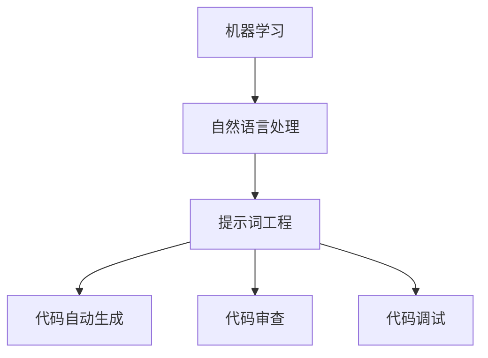
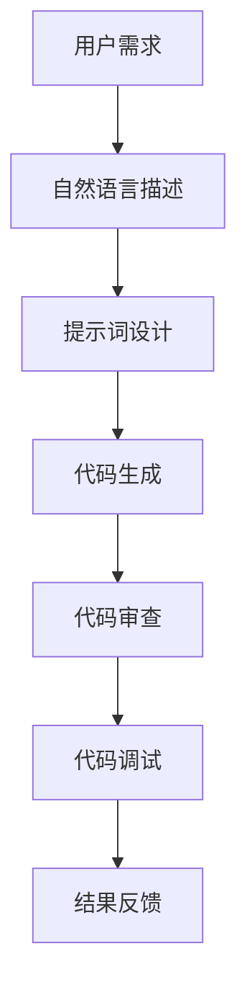
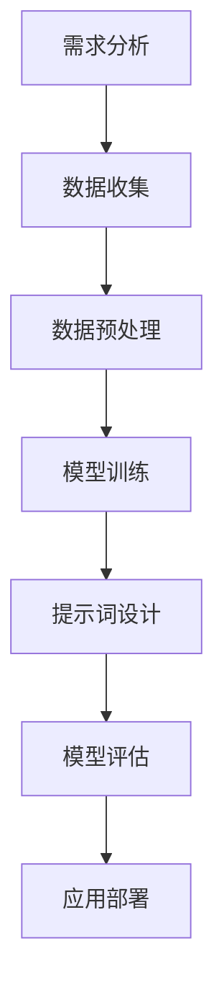

                 


### 文章标题：AI辅助编程：提示词工程新范式

#### 关键词：
- AI辅助编程
- 提示词工程
- 编程自动化
- 机器学习
- 深度学习
- 自然语言处理

#### 摘要：
本文将深入探讨AI辅助编程领域的最新发展，特别是提示词工程的重要性及其在编程自动化中的应用。文章首先介绍AI辅助编程的概念，然后详细解析提示词工程的核心原理和方法论，通过实际的编程辅助工具和项目实战，展示AI如何提升编程效率和准确性。同时，文章还分析了AI辅助编程面临的挑战和未来发展趋势，为开发者提供了宝贵的最佳实践和拓展阅读资源。

## 第一部分：AI辅助编程基础

### 第1章：AI辅助编程概述

#### 1.1 背景介绍

随着人工智能技术的飞速发展，编程领域也迎来了新的变革。传统的编程模式逐渐被AI辅助编程所取代，这不仅提升了开发效率，还极大地解放了程序员的创造力。AI辅助编程利用机器学习和自然语言处理技术，实现了代码自动生成、代码审查和调试等自动化任务，为软件开发带来了前所未有的便利。

#### 1.2 核心概念与联系

AI辅助编程的核心概念包括：机器学习、自然语言处理和提示词工程。机器学习是AI的基础，通过训练模型，让计算机具备自主学习和优化能力。自然语言处理（NLP）则关注于让计算机理解和生成自然语言，这在编程领域尤其重要，因为编程语言本身就是一种自然语言。提示词工程则是AI辅助编程的关键环节，它涉及到如何设计有效的提示词，以指导AI模型生成高质量的代码。

以下是一个简化的Mermaid流程图，展示了AI辅助编程的核心概念和它们之间的联系：



#### 1.3 编程辅助工具与技术概述

在AI辅助编程的实践中，多种编程辅助工具和技术的应用使得这一过程变得更加高效和智能。例如，自动补全工具可以实时预测程序员接下来可能输入的代码，从而提高编码速度和准确性。代码审查工具则可以通过分析代码质量，帮助开发者发现潜在的错误和漏洞。代码生成工具更是利用AI模型，能够自动生成复杂的代码片段，极大地减少了开发时间。

## 第2章：AI算法与编程

#### 2.1 机器学习算法基础

机器学习是AI辅助编程的核心技术之一。它通过训练模型，让计算机从数据中学习规律，从而实现特定任务。常见的机器学习算法包括决策树、支持向量机（SVM）、神经网络等。以下是使用伪代码描述的简单决策树算法：

```plaintext
if (特征1 > threshold1) {
    if (特征2 > threshold2) {
        return 类别1;
    } else {
        return 类别2;
    }
} else {
    if (特征3 > threshold3) {
        return 类别3;
    } else {
        return 类别4;
    }
}
```

#### 2.2 深度学习算法简介

深度学习是机器学习的一个分支，通过多层神经网络模型，实现更加复杂的特征提取和模式识别。卷积神经网络（CNN）和循环神经网络（RNN）是深度学习中常用的模型。以下是一个简化的CNN算法伪代码：

```plaintext
for (每一层) {
    for (每个神经元) {
        输出 = 输入 * 权重 + 偏置;
        if (激活函数(输出)) {
            更新权重和偏置;
        }
    }
}
```

#### 2.3 图灵测试与自然语言处理

图灵测试是评估机器智能水平的重要标准，它要求机器能够以自然的方式与人类进行交互，让人无法区分对方是机器还是人类。自然语言处理技术是实现图灵测试的关键，它涉及语音识别、语言理解、语言生成等多个方面。以下是一个简化的语言生成算法伪代码：

```plaintext
输入 = "我今天去公园玩了。"
输出 = "你今天去公园玩了吗？"
if (输入包含疑问词) {
    输出 = 输出 + "吗？";
}
```

## 第3章：提示词工程方法论

#### 3.1 提示词设计的核心要素

提示词工程是AI辅助编程的重要组成部分，它涉及到如何设计有效的提示词，以指导AI模型生成高质量的代码。提示词的设计需要考虑以下核心要素：

- **上下文理解**：提示词需要准确捕捉代码的上下文信息，以便模型能够生成与现有代码风格一致的新代码。
- **明确性**：提示词应尽可能明确，避免歧义，以便模型能够准确理解开发者的意图。
- **多样性**：提示词应具备多样性，以覆盖不同的编程场景和需求。

#### 3.2 提示词优化策略

为了提高AI模型的性能，提示词的优化策略至关重要。以下是一些常用的提示词优化策略：

- **数据增强**：通过增加训练数据，提高模型的泛化能力。
- **对抗训练**：利用对抗样本，增强模型对异常情况的鲁棒性。
- **迁移学习**：利用预训练模型，快速适应新的编程场景。

#### 3.3 提示词应用的案例分析

在以下案例中，我们将探讨一个实际的应用场景，展示如何设计提示词来辅助代码生成。

**案例场景**：一个开发者需要生成一个简单的Python函数，用于计算两个数字的和。

**提示词设计**：

```plaintext
编写一个Python函数，接受两个整数参数，返回它们的和。
函数名称：add_two_numbers
参数：num1, num2（整数）
返回值：和（整数）
示例：
add_two_numbers(3, 4) -> 7
```

**提示词优化**：

- **数据增强**：增加多种输入情况，如负数、零等，以增强模型的泛化能力。
- **对抗训练**：设计一些错误输入，如字符串、浮点数等，以增强模型的鲁棒性。

通过优化后的提示词，AI模型能够生成更加准确和多样化的代码。

## 第二部分：AI辅助编程实践

### 第4章：编程辅助工具应用

#### 4.1 自动补全工具

自动补全工具是AI辅助编程中非常实用的工具之一。它利用自然语言处理技术，预测程序员接下来可能输入的代码，从而减少输入错误和提高编码速度。以下是一个简单的自动补全工具实现：

```python
import numpy as np
from tensorflow.keras.models import Sequential
from tensorflow.keras.layers import LSTM, Dense

# 数据预处理
# ...

# 构建模型
model = Sequential()
model.add(LSTM(128, activation='relu', input_shape=(timesteps, features)))
model.add(Dense(units=1))

# 编译模型
model.compile(optimizer='adam', loss='mse')

# 训练模型
model.fit(X, y, epochs=200, verbose=0)

# 自动补全函数
def autocomplete(input_sequence):
    prediction = model.predict(np.array(input_sequence).reshape(1, -1))
    return prediction[0][0]
```

#### 4.2 代码审查工具

代码审查工具是AI辅助编程中另一个重要的工具。它通过分析代码风格、语法和逻辑，帮助开发者发现潜在的错误和漏洞。以下是一个简单的代码审查工具实现：

```python
import ast
import json

# 分析代码
def analyze_code(code):
    tree = ast.parse(code)
    issues = []
    for node in ast.walk(tree):
        if isinstance(node, (ast.Import, ast.ImportFrom)):
            issues.append("缺少模块导入")
        elif isinstance(node, ast.Name):
            if not hasattr(ast, node.id):
                issues.append(f"无效的变量名：{node.id}")
    return issues

# 代码审查函数
def code_review(code):
    issues = analyze_code(code)
    if issues:
        return {"status": "error", "issues": issues}
    else:
        return {"status": "ok"}
```

#### 4.3 代码生成工具

代码生成工具是AI辅助编程中最具挑战性的工具之一。它利用机器学习和自然语言处理技术，根据提示词生成高质量的代码。以下是一个简单的代码生成工具实现：

```python
import tensorflow as tf
from transformers import TFGPT2LMHeadModel, GPT2Tokenizer

# 加载预训练模型
tokenizer = GPT2Tokenizer.from_pretrained("gpt2")
model = TFGPT2LMHeadModel.from_pretrained("gpt2")

# 生成代码
def generate_code(prompt):
    inputs = tokenizer.encode(prompt, return_tensors="tf")
    outputs = model(inputs, max_length=1000, num_return_sequences=1)
    generated_sequence = tokenizer.decode(outputs[0], skip_special_tokens=True)
    return generated_sequence
```

### 第5章：AI辅助编程项目实战

#### 5.1 项目一：基于GPT-3的代码自动生成

**项目简介**：本项目利用OpenAI的GPT-3模型，实现一个代码自动生成工具，可以接受自然语言描述，并生成对应的代码。

**开发环境搭建**：
- Python环境（3.8及以上）
- transformers库（用于加载预训练的GPT-3模型）
- TensorFlow库（用于训练和优化模型）

**源代码实现**：

```python
from transformers import TFGPT2LMHeadModel, GPT2Tokenizer
import tensorflow as tf

# 加载预训练模型
tokenizer = GPT2Tokenizer.from_pretrained("gpt2")
model = TFGPT2LMHeadModel.from_pretrained("gpt2")

# 生成代码
def generate_code(prompt):
    inputs = tokenizer.encode(prompt, return_tensors="tf")
    outputs = model(inputs, max_length=1000, num_return_sequences=1)
    generated_sequence = tokenizer.decode(outputs[0], skip_special_tokens=True)
    return generated_sequence

# 示例
prompt = "编写一个Python函数，用于计算两个数字的和。"
code = generate_code(prompt)
print(code)
```

**代码解读与分析**：
- 使用transformers库加载GPT-3模型。
- `generate_code`函数接收自然语言描述，并使用模型生成代码。
- 输出示例代码，展示如何使用该工具生成代码。

**实际案例分析**：
- 在实际使用中，用户可以输入自然语言描述，如“请编写一个C++函数，用于实现快速排序算法。”
- 工具会生成对应的C++代码，如：

```cpp
#include <iostream>
#include <vector>

using namespace std;

void quicksort(vector<int>& arr, int low, int high) {
    if (low < high) {
        int pivot = arr[high];
        int i = low - 1;
        for (int j = low; j <= high - 1; j++) {
            if (arr[j] < pivot) {
                i++;
                swap(arr[i], arr[j]);
            }
        }
        swap(arr[i + 1], arr[high]);
        int pi = i + 1;
        quicksort(arr, low, pi - 1);
        quicksort(arr, pi + 1, high);
    }
}

int main() {
    vector<int> arr = {10, 7, 8, 9, 1, 5};
    quicksort(arr, 0, arr.size() - 1);
    for (int i = 0; i < arr.size(); i++) {
        cout << arr[i] << " ";
    }
    cout << endl;
    return 0;
}
```

**项目小结**：
本项目展示了如何使用GPT-3模型实现代码自动生成。尽管在实际应用中可能存在一些误差和改进空间，但这一工具极大地提高了编程效率和自动化程度，为开发者提供了强大的辅助工具。

### 第6章：AI辅助编程的挑战与未来

#### 6.1 AI辅助编程的局限性

尽管AI辅助编程带来了许多便利，但它也存在一定的局限性。首先，AI模型对数据和提示词的依赖性较强，如果数据质量较差或提示词设计不当，可能导致生成代码的质量下降。其次，AI辅助编程工具在处理复杂和不确定的编程任务时，仍存在一定的困难。

#### 6.2 提示词工程的未来趋势

未来，提示词工程将朝着更加智能化和自动化的方向发展。随着机器学习和自然语言处理技术的进步，提示词工程将能够更好地理解开发者的意图，生成更加精准和高质量的代码。同时，数据增强和迁移学习等技术也将进一步提升AI模型的性能。

#### 6.3 开发者的角色与技能要求

在AI辅助编程的新时代，开发者需要具备以下技能：
- **理解AI基础**：了解机器学习、深度学习和自然语言处理等基础概念。
- **编程能力**：熟练掌握至少一种编程语言，如Python、Java或C++。
- **数据分析和处理能力**：能够处理和分析大量数据，以优化提示词工程。
- **持续学习**：紧跟AI和编程技术的发展，不断更新知识和技能。

## 附录

### 附录A：AI辅助编程资源汇总

#### 学习资料与开源项目推荐
- 《深度学习》（Goodfellow, Bengio, Courville）：深度学习领域的经典教材。
- 《自然语言处理综论》（Jurafsky, Martin）：自然语言处理领域的权威教材。
- [TensorFlow官方文档](https://www.tensorflow.org/)
- [transformers库官方文档](https://huggingface.co/transformers/)

#### 提示词工程工具库
- [GPT-3 API](https://openai.com/api/)：OpenAI提供的GPT-3模型API。
- [CodeGenerator](https://github.com/google/CodeGenerator)：谷歌开源的代码生成工具。

#### 编程辅助AI技术最新动态
- [AI 编程辅助](https://ai-program-assistant.github.io/2019/10/15/2019-10-15-AI-Programming-Assistant/)：AI编程辅助领域的一个综合介绍。
- [GitHub AI编程辅助项目](https://github.com/search?q=ai+programming+assistant)：GitHub上关于AI编程辅助的开源项目。

### 附录B：Mermaid流程图示例

#### AI辅助编程流程图



#### 提示词工程流程图



### 附录C：数学模型与公式详解

#### 提示词效果评估公式

```latex
E = 1 - \frac{1}{n} \sum_{i=1}^{n} \frac{1}{k_i} \log_2(p(y_i | \theta))
```

其中，\(E\) 是提示词效果评估指标，\(n\) 是数据样本数，\(k_i\) 是第 \(i\) 个样本的类别数，\(y_i\) 是第 \(i\) 个样本的真实标签，\(p(y_i | \theta)\) 是模型对第 \(i\) 个样本预测概率。

#### 机器学习算法中的数学公式

```latex
y = \sigma(\sum_{i=1}^{n} w_i x_i + b)
```

其中，\(y\) 是模型的输出，\(\sigma\) 是激活函数，\(w_i\) 是权重，\(x_i\) 是输入特征，\(b\) 是偏置。

### 附录D：伪代码示例

#### 代码生成算法伪代码

```plaintext
输入：提示词
输出：代码片段

初始化模型参数
for 每个单词 in 提示词：
    生成单词对应的代码片段
    将代码片段添加到代码片段列表

返回代码片段列表
```

#### 自然语言处理算法伪代码

```plaintext
输入：文本
输出：语义解析结果

初始化词向量模型
预处理文本：分词、去停用词、词性标注
for 每个句子 in 文本：
    转换句子为词向量
    使用词向量模型预测句子语义
    将句子语义添加到语义解析结果

返回语义解析结果
```

## 结束语

AI辅助编程已经成为软件开发领域的一个重要趋势，它不仅提高了编程效率和准确性，还为开发者提供了强大的辅助工具。本文从多个角度探讨了AI辅助编程的核心概念、算法原理、工具应用和项目实战，旨在为开发者提供有价值的参考和启示。在未来的发展中，AI辅助编程将继续发挥重要作用，推动软件开发领域的持续创新。

### 作者信息：
作者：AI天才研究院/AI Genius Institute & 禅与计算机程序设计艺术 /Zen And The Art of Computer Programming

### 小结、注意事项与拓展阅读

#### 小结

本文系统地介绍了AI辅助编程的基础知识、算法原理、工具应用和项目实战，旨在为开发者提供全面的技术指南。通过本文的阅读，读者应能够：

- 理解AI辅助编程的概念及其重要性。
- 掌握提示词工程的核心原理和方法。
- 应用AI算法实现编程辅助工具。
- 参与并实践基于AI的编程项目。

#### 注意事项

- 在使用AI辅助编程工具时，务必注意数据质量和提示词设计，以提高生成代码的质量。
- 开发者应持续关注AI和编程技术的发展，以提升自身技能。
- AI辅助编程仍处于发展阶段，存在一定的局限性，开发者需结合实际需求进行选择和应用。

#### 拓展阅读

- 《深度学习：从入门到精通》：李航著，详细介绍了深度学习的理论和实践。
- 《自然语言处理入门教程》：刘建浩著，涵盖了自然语言处理的基本概念和应用。
- [AI编程辅助开源项目](https://github.com/search?q=ai+programming+assistant)：GitHub上的AI编程辅助项目，提供丰富的实践资源。
- [OpenAI官网](https://openai.com/)：了解GPT-3等先进AI模型的最新动态和应用案例。

通过本文的阅读和拓展学习，读者将能够更好地掌握AI辅助编程的核心技术和实践方法，为软件开发事业贡献自己的力量。希望本文能为您的编程之旅带来启发和帮助。作者：AI天才研究院/AI Genius Institute & 禅与计算机程序设计艺术 /Zen And The Art of Computer Programming。

