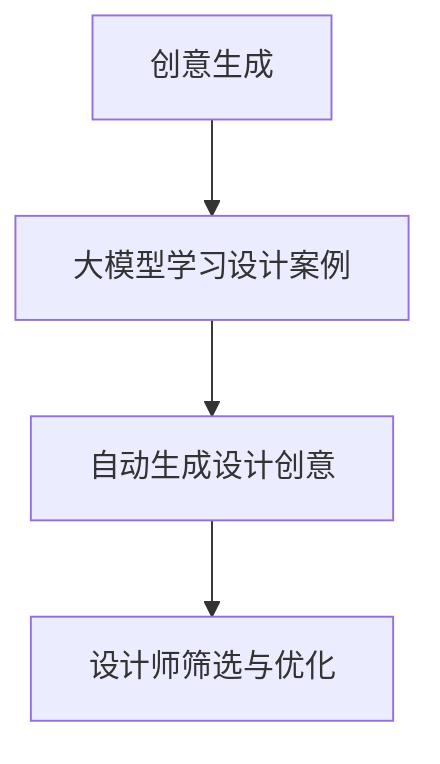
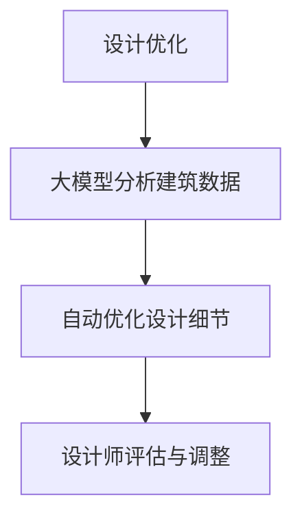
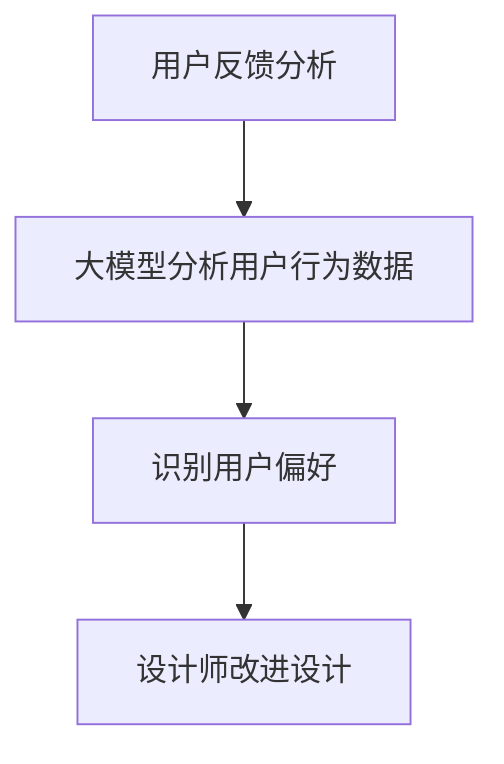
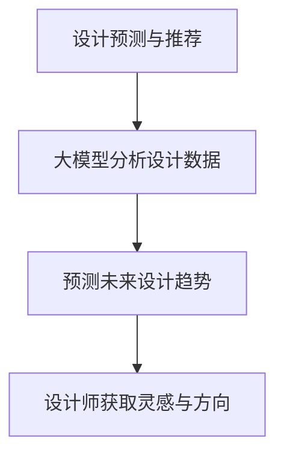
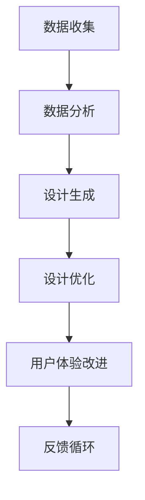
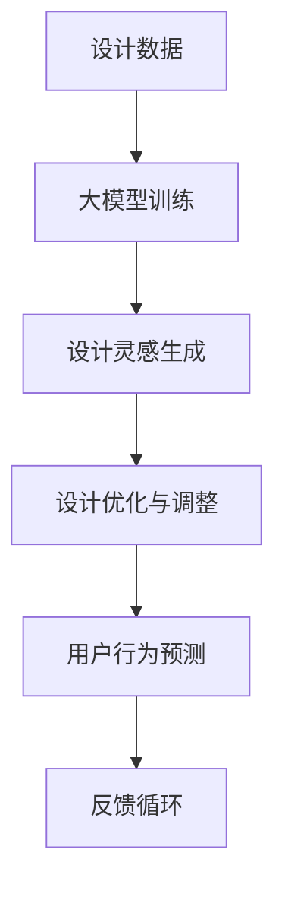
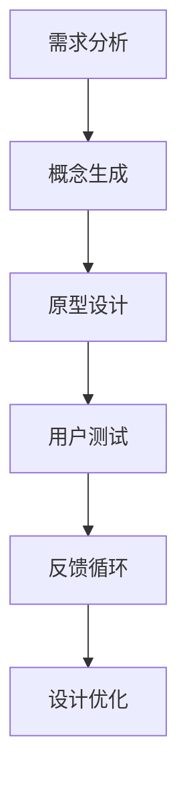
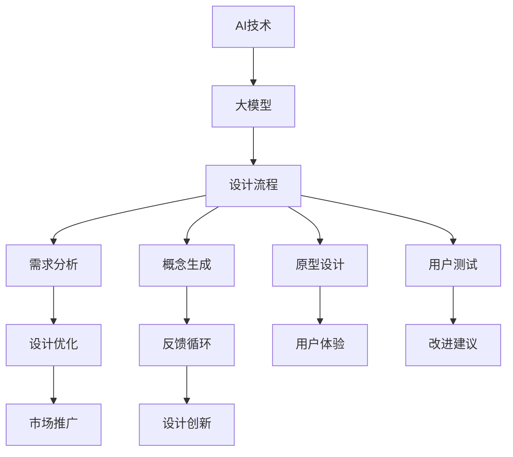

                 


## 文章标题：AI辅助设计：大模型在产品创新中的应用

关键词：AI辅助设计，大模型，产品创新，设计流程，技术原理，应用案例，工具与实践

摘要：本文旨在探讨人工智能（AI）大模型在产品创新中的应用，以及如何利用AI辅助设计提高产品设计的效率和质量。文章首先介绍了AI辅助设计的背景和重要性，然后详细阐述了AI大模型的基本原理和它们在产品设计中的具体应用。通过技术细节解析、实际应用案例分析和工具与实践介绍，文章为读者提供了全面的AI辅助设计指导。

---

## 引言与概述

### 1.1 AI辅助设计的背景和重要性

在当今快速变化的市场环境中，产品创新已成为企业竞争的关键因素。设计师们面临着不断变化的用户需求、激烈的竞争压力和技术进步的挑战。传统的产品设计流程通常依赖于设计师的经验和直觉，这种方式不仅效率低下，而且容易产生同质化的产品。随着人工智能（AI）技术的发展，特别是大模型的兴起，AI辅助设计成为一种新兴的设计方法，它不仅能够提高设计效率，还能够提升设计质量。

AI辅助设计利用人工智能算法，特别是大模型，对设计过程中的各个环节进行优化。例如，在创意生成阶段，AI可以帮助设计师快速生成多种设计方案；在原型设计阶段，AI可以自动化地优化设计细节，提高设计的准确性和美观性；在用户反馈阶段，AI可以分析用户行为数据，提供改进建议。这些应用不仅减轻了设计师的工作负担，还极大地提升了产品的创新性和用户体验。

### 1.2 大模型在AI辅助设计中的角色

大模型，尤其是深度学习模型，在AI辅助设计中扮演着至关重要的角色。大模型具有处理大量数据、识别复杂模式和生成高质量内容的能力。在产品设计过程中，大模型可以应用于以下几个方面：

1. **数据收集与预处理**：大模型需要大量高质量的数据进行训练。设计师可以利用AI技术自动收集和预处理设计相关的数据，如用户反馈、市场趋势、技术文档等。

2. **设计生成与优化**：大模型可以根据设计需求生成初步设计方案，并通过迭代优化，生成符合用户需求的高质量设计。

3. **用户反馈分析**：大模型可以分析用户行为数据，识别用户偏好和需求变化，为后续设计提供反馈。

4. **设计预测与推荐**：大模型可以基于历史数据和当前设计趋势，预测未来的设计方向，为设计师提供推荐。

### 1.3 本书的目标和结构

本书的目标是为设计师、数据科学家和产品经理提供全面的AI辅助设计指南。通过本书，读者将了解AI辅助设计的理论基础、技术细节、应用案例和工具实践。本书分为六个部分：

1. 引言与概述：介绍AI辅助设计的背景、重要性以及大模型在其中的角色。
2. 理论基础：探讨AI的基本概念、大模型的基本原理以及它们在产品设计中的应用。
3. 技术细节：深入分析大模型在数据收集、预处理、模型训练、评估和应用等环节的技术细节。
4. 应用案例：展示AI辅助设计在不同领域的产品创新应用案例。
5. 工具与实践：介绍支持AI辅助设计的工具和实际项目实践流程。
6. 展望与趋势：讨论AI辅助设计的前沿趋势和未来发展方向。

通过本书，读者将能够掌握AI辅助设计的基本技能，并在实践中提高产品设计的能力和效率。

## 总结

在本章中，我们介绍了AI辅助设计的背景和重要性，以及大模型在其中的角色。AI辅助设计通过利用人工智能技术，特别是大模型，能够显著提高产品设计的效率和质量。大模型在数据收集、设计生成、用户反馈分析等方面发挥着关键作用。接下来，我们将进一步探讨AI的基本概念、大模型的基本原理以及它们在产品设计中的具体应用。

---

## 理论基础

### 2.1 AI的基本概念

人工智能（Artificial Intelligence，简称AI）是计算机科学的一个分支，旨在使计算机系统具备人类智能的能力。AI的目标是使计算机能够执行通常需要人类智能才能完成的任务，如识别图像、理解语言、解决问题等。AI技术可以分为两大类：基于规则的系统和基于数据的系统。

#### 2.1.1 基于规则的系统

基于规则的系统通过定义一系列规则来模拟人类智能。这些规则通常由领域专家编写，描述了特定情况下应该采取的行动。例如，医疗诊断系统可以根据患者的症状和历史记录，应用一系列规则来推测可能的疾病。

#### 2.1.2 基于数据的系统

基于数据的系统则依赖于大量数据，通过统计和学习算法来发现数据中的模式和关系。深度学习是这种系统的一个典型代表，它使用多层神经网络来模拟人类大脑的处理方式，通过大量的数据训练模型，使其能够自动识别图像、语音、文本等。

#### 2.1.3 人工智能的发展历程

人工智能的研究可以追溯到20世纪50年代。早期的研究主要集中在逻辑推理和符号处理上，但受到硬件和算法的限制，进展缓慢。随着计算机性能的提升和算法的创新，特别是在深度学习和大数据技术的推动下，人工智能取得了显著进展。现在，AI已经在许多领域得到了广泛应用，如自动驾驶、智能助手、医疗诊断等。

### 2.2 大模型的基本原理

大模型通常指的是深度学习模型，特别是那些具有数十亿参数的模型。这些模型通过学习大量数据，可以识别复杂的模式和关系。大模型的核心是神经网络，它由大量的神经元（节点）组成，每个神经元都与其他神经元相连。神经网络的训练过程就是通过调整神经元之间的连接权重，使模型能够准确地预测或分类输入数据。

#### 2.2.1 大模型的定义

大模型通常指的是那些具有数百万甚至数十亿参数的深度学习模型。这些模型可以处理大量的数据，并且能够在复杂的任务上表现出色。例如，GPT-3（语言生成预训练模型）拥有1750亿个参数，能够生成高质量的文本。

#### 2.2.2 大模型的工作原理

大模型的工作原理基于神经网络的层次结构。每个层次都包含多个神经元，每个神经元都会接收来自前一层神经元的输入，并通过激活函数产生输出。通过迭代训练，模型可以调整神经元的连接权重，使模型能够更准确地预测或分类输入数据。

#### 2.2.3 大模型的架构

大模型通常采用多层感知器（MLP）或卷积神经网络（CNN）的架构。MLP由多个全连接层组成，适用于分类和回归任务。CNN则通过卷积层、池化层和全连接层来处理图像数据，具有优秀的特征提取能力。

### 2.3 大模型在产品设计中的应用

大模型在产品设计中的应用非常广泛，主要包括以下方面：

#### 2.3.1 设计生成与优化

大模型可以自动生成设计概念，并通过迭代优化，生成符合用户需求的高质量设计。例如，在建筑设计中，大模型可以根据用户需求和历史建筑数据，生成多种建筑设计方案，并进行优化。

#### 2.3.2 用户反馈分析

大模型可以分析用户行为数据，识别用户偏好和需求变化，为设计师提供改进建议。例如，在用户体验设计中，大模型可以分析用户在应用程序中的操作轨迹，识别用户的行为模式，从而优化界面设计。

#### 2.3.3 设计预测与推荐

大模型可以基于历史数据和当前设计趋势，预测未来的设计方向，并为设计师提供推荐。例如，在时尚设计中，大模型可以分析时尚杂志、社交媒体上的设计趋势，预测未来的流行趋势，为设计师提供灵感。

### 2.4 大模型与产品创新的关系

大模型与产品创新密切相关。一方面，大模型可以通过数据分析、模式识别和自动化设计，提高产品设计的效率和质量。另一方面，大模型可以为设计师提供新的设计灵感和方向，促进产品创新。例如，在汽车设计领域，大模型可以分析用户反馈和市场趋势，预测未来的汽车设计方向，从而推动汽车行业的创新。

### 2.5 大模型在产品设计中的挑战与解决方案

尽管大模型在产品设计中有许多优势，但也面临一些挑战。例如，数据隐私、模型可解释性和模型泛化能力等问题。为了解决这些问题，研究者们提出了多种解决方案，如数据加密、可解释性模型和迁移学习等。

### 2.6 大模型与设计流程的结合

大模型可以与设计流程的各个环节紧密结合，从而提高设计的效率和质量。例如，在设计创意阶段，大模型可以自动生成多个设计概念，帮助设计师快速筛选出最优方案。在原型设计阶段，大模型可以自动化地优化设计细节，提高设计的准确性和美观性。在用户反馈阶段，大模型可以分析用户行为数据，为设计师提供改进建议。

### 2.7 总结

在本章中，我们介绍了人工智能的基本概念、大模型的基本原理以及它们在产品设计中的应用。AI和大数据技术为产品设计带来了新的机遇和挑战，大模型在数据收集、设计生成、用户反馈分析和设计预测等方面发挥着重要作用。通过合理利用大模型，设计师可以大幅提升产品设计的效率和质量，推动产品创新。

---

## 背景介绍

### 2.1 AI辅助设计的兴起

AI辅助设计（AI-Assisted Design）是近年来迅速崛起的一个设计领域，它结合了人工智能和传统设计方法，旨在通过自动化和智能化技术提高设计效率和质量。随着计算机技术的进步，尤其是深度学习和大数据技术的成熟，AI辅助设计逐渐从理论研究走向实际应用。

AI辅助设计的兴起可以追溯到20世纪80年代，当时计算机图形学的发展为CAD（计算机辅助设计）奠定了基础。然而，传统的CAD系统主要依赖于设计师的经验和规则，缺乏自动化的创新设计能力。随着AI技术的发展，特别是深度学习模型的突破，AI开始能够处理复杂的图形和结构数据，为设计领域带来了革命性的变化。

#### 2.1.1 深度学习与设计

深度学习是AI的一个重要分支，它通过多层神经网络模拟人类大脑的学习过程，能够处理大量非结构化数据，并在图像识别、语音合成、自然语言处理等领域取得了显著成果。在设计领域，深度学习模型可以用于图像风格转换、三维建模、自动生成设计图案等任务。

例如，Google的DeepDream项目展示了深度学习在图像风格转换方面的潜力，它可以通过训练模型来生成具有特定艺术风格的新图像。这一技术可以应用于服装设计，设计师可以利用DeepDream生成多种艺术风格的图案，为服装设计提供灵感。

#### 2.1.2 大数据与设计

大数据是AI辅助设计的另一个重要驱动力。随着互联网和物联网的发展，设计师可以收集到大量关于用户需求、市场趋势、技术进展的数据。这些数据不仅可以帮助设计师更好地理解用户行为和市场动态，还可以为设计提供数据支持。

例如，智能家居设计领域可以利用大数据分析用户的行为模式，优化家居设备的布局和功能。通过分析用户的作息时间、生活习惯和使用习惯，AI可以自动生成最适合用户的家居设计方案，提高用户的居住体验。

### 2.2 大模型在产品创新中的应用

大模型在产品创新中的应用主要体现在以下几个方面：

#### 2.2.1 创意生成

大模型可以通过学习大量设计案例和数据，自动生成新颖的设计创意。例如，DALL-E 2是一个基于深度学习的生成对抗网络（GAN），它能够根据用户输入的文本描述生成相应的图像。设计师可以利用DALL-E 2生成创意图案，为产品设计提供灵感。



#### 2.2.2 设计优化

大模型可以优化设计过程中的各个细节，提高设计的准确性和美观性。例如，在建筑设计中，大模型可以根据建筑结构和用户需求，自动优化建筑的布局和结构。通过迭代优化，设计师可以快速找到最优的设计方案。



#### 2.2.3 用户反馈分析

大模型可以分析用户行为数据，识别用户偏好和需求变化，为设计师提供改进建议。例如，在软件界面设计领域，大模型可以分析用户的点击轨迹和操作习惯，优化界面布局和交互设计。



#### 2.2.4 设计预测与推荐

大模型可以基于历史数据和当前设计趋势，预测未来的设计方向，为设计师提供推荐。例如，在时尚设计领域，大模型可以分析时尚杂志、社交媒体上的设计趋势，预测未来的流行趋势，为设计师提供灵感。



### 2.3 AI辅助设计与传统设计的区别与联系

AI辅助设计与传统设计在方法和技术上存在显著差异，但两者并非完全对立，而是可以相互补充。

#### 2.3.1 区别

- **设计方法**：传统设计主要依赖于设计师的经验和直觉，而AI辅助设计则利用算法和数据分析，自动化地生成和优化设计方案。
- **数据依赖**：传统设计较少依赖数据，而AI辅助设计则依赖于大量的设计数据和用户反馈数据。
- **创新程度**：传统设计往往局限于设计师的经验，创新性有限；而AI辅助设计通过自动化的创意生成和优化，具有更高的创新潜力。

#### 2.3.2 联系

- **设计基础**：AI辅助设计并非替代设计师的工作，而是作为设计师的辅助工具，提高设计效率和准确性。
- **设计流程**：AI辅助设计可以嵌入到传统设计流程的各个环节，如创意生成、原型设计、用户反馈等，与传统设计方法相结合。
- **设计协作**：设计师可以利用AI辅助设计工具，快速生成设计方案，并通过与AI的互动，提高设计的创新性和质量。

### 2.4 AI辅助设计的优势和挑战

#### 2.4.1 优势

- **提高设计效率**：AI辅助设计可以自动化地处理大量设计任务，提高设计效率。
- **提升设计质量**：AI辅助设计通过数据分析和优化，可以生成高质量的设计方案。
- **创新性增强**：AI辅助设计能够快速生成新颖的设计创意，为设计师提供更多的设计选择。
- **用户体验优化**：AI辅助设计可以根据用户反馈数据，优化设计细节，提升用户体验。

#### 2.4.2 挑战

- **技术门槛**：AI辅助设计需要较高的技术门槛，设计师需要掌握相关的AI技术和工具。
- **数据隐私**：AI辅助设计依赖于大量用户数据，如何保护用户隐私是一个重要问题。
- **模型可解释性**：大模型的决策过程通常是不透明的，如何提高模型的可解释性是一个挑战。
- **设计伦理**：AI辅助设计可能引发设计伦理问题，如设计决策的公平性和道德责任等。

### 2.5 总结

AI辅助设计是设计领域的一项新兴技术，通过利用人工智能和大数据技术，它可以大幅提升设计效率和质量。大模型在创意生成、设计优化、用户反馈分析和设计预测等方面发挥着重要作用。然而，AI辅助设计也面临一些挑战，如技术门槛、数据隐私和设计伦理等问题。通过合理利用AI技术，设计师可以更好地应对设计挑战，推动产品创新。

---

## 核心概念与联系

在探讨AI辅助设计时，我们需要深入理解几个核心概念及其之间的相互关系。这些概念包括：人工智能（AI）、大模型、产品设计流程，以及它们在产品创新中的角色和作用。为了更好地理解这些概念，我们将使用Mermaid流程图来展示它们之间的逻辑架构。

### 3.1 人工智能（AI）与产品设计

人工智能（AI）是AI辅助设计的基础，它通过模拟人类智能，使计算机系统能够执行复杂的任务。AI在产品设计中的应用主要体现在以下几个方面：

1. **数据收集与分析**：AI可以帮助设计师收集和分析大量的用户数据，以了解用户需求和行为模式。
2. **设计优化**：AI可以通过机器学习和深度学习算法，优化产品设计过程中的各个方面，如设计生成、原型优化等。
3. **用户体验改进**：AI可以分析用户反馈数据，为设计师提供改进建议，以提升用户体验。

下面是一个简化的Mermaid流程图，展示AI在产品设计中的基本流程：



### 3.2 大模型与产品设计

大模型是AI的核心组成部分，它具有处理大量数据和识别复杂模式的能力。在产品设计过程中，大模型的应用主要体现在以下几个方面：

1. **设计灵感生成**：大模型可以通过学习大量的设计案例和数据，自动生成新颖的设计灵感。
2. **设计优化与调整**：大模型可以分析设计数据，自动优化设计细节，提高设计质量。
3. **用户行为预测**：大模型可以分析用户行为数据，预测用户偏好，为设计师提供改进建议。

下面是一个简化的Mermaid流程图，展示大模型在产品设计中的应用：



### 3.3 设计流程与产品创新

设计流程是产品创新的载体，它包括多个阶段，如需求分析、概念生成、原型设计、用户测试等。AI和大数据技术可以嵌入到这些阶段，提高设计效率和创新能力。

1. **需求分析**：AI可以通过分析用户反馈和市场数据，帮助设计师理解用户需求，生成详细的需求文档。
2. **概念生成**：大模型可以自动生成多种设计概念，为设计师提供丰富的创意选择。
3. **原型设计**：AI和大数据技术可以帮助设计师快速生成原型，并进行迭代优化。
4. **用户测试**：AI可以通过用户行为数据分析，评估原型设计的效果，为后续优化提供依据。

下面是一个简化的Mermaid流程图，展示设计流程中的各个环节：



### 3.4 AI、大模型与产品创新的联系

AI、大模型和产品创新之间存在紧密的联系，它们共同推动了设计领域的发展。AI为大模型提供了算法和技术支持，使大模型能够处理复杂的设计任务；大模型则为产品创新提供了强大的工具，帮助设计师快速生成和优化设计；产品创新则通过设计流程的各个环节，实现了从概念到市场的全面升级。

下面是一个综合的Mermaid流程图，展示AI、大模型和产品创新之间的相互关系：



通过上述流程图，我们可以清晰地看到AI、大模型和产品创新之间的逻辑架构，以及它们在提高设计效率和创新能力方面的重要作用。

---

## 核心算法原理讲解

### 3.1 大模型的工作原理

大模型，特别是深度学习模型，是AI辅助设计中的核心技术。深度学习是一种基于人工神经网络的算法，通过多层神经网络（即“深度”）来模拟人类大脑的学习过程。大模型通常具有数十亿个参数，这使得它们能够处理大量的数据并识别复杂的模式。

#### 3.1.1 神经网络基础

神经网络由一系列的神经元（节点）组成，每个神经元都与其他神经元相连。每个连接都有一定的权重，这些权重通过学习过程进行调整。当输入数据通过神经网络传递时，每个神经元会接收来自前一层的输入，并经过激活函数处理后产生输出。

神经网络的核心包括以下几个组成部分：

- **输入层**：接收输入数据。
- **隐藏层**：对输入数据进行特征提取和变换。
- **输出层**：产生最终输出。

#### 3.1.2 前向传播与反向传播

神经网络的学习过程包括前向传播和反向传播两个阶段。

- **前向传播**：输入数据从输入层传递到隐藏层，再传递到输出层。在每个层中，神经元通过加权求和并应用激活函数产生输出。
  
  $$ z = \sum_{i} w_{ij} * x_i + b $$
  $$ a = \sigma(z) $$

  其中，$z$ 是加权求和的结果，$w_{ij}$ 是连接权重，$x_i$ 是输入值，$b$ 是偏置项，$\sigma$ 是激活函数。

- **反向传播**：通过计算输出层到隐藏层的误差，反向传播误差并调整权重。这个过程通过梯度下降算法实现，目的是最小化损失函数。

  $$ \delta = \frac{\partial L}{\partial z} $$
  $$ \Delta w_{ij} = \alpha * \delta * x_i $$

  其中，$\delta$ 是误差梯度，$L$ 是损失函数，$\alpha$ 是学习率。

#### 3.1.3 大模型的训练过程

大模型的训练过程涉及以下步骤：

1. **数据准备**：收集大量的训练数据，并进行预处理，如数据清洗、归一化等。
2. **模型初始化**：随机初始化模型的权重和偏置。
3. **前向传播**：将输入数据传递到模型中，计算输出并计算损失。
4. **反向传播**：通过误差计算梯度，并更新权重和偏置。
5. **迭代训练**：重复上述步骤，直到模型达到预定的训练目标。

伪代码表示如下：

```python
for epoch in range(num_epochs):
    for batch in dataset:
        # 前向传播
        outputs = forward_propagation(batch)
        loss = compute_loss(outputs, labels)

        # 反向传播
        gradients = backward_propagation(outputs, labels)
        update_weights(gradients)

    # 记录训练过程
    print(f"Epoch {epoch}: Loss = {loss}")
```

### 3.2 深度学习模型的架构

深度学习模型可以分为多种类型，每种类型都有其特定的架构和应用场景。以下是几种常见的大模型架构：

#### 3.2.1 卷积神经网络（CNN）

卷积神经网络（CNN）是处理图像数据的一种有效模型。它通过卷积层、池化层和全连接层来提取图像特征。

1. **卷积层**：通过卷积运算提取图像的局部特征。
2. **池化层**：减小特征图的大小，提高模型的泛化能力。
3. **全连接层**：将特征映射到分类标签。

伪代码表示如下：

```python
for layer in layers:
    if isinstance(layer, ConvLayer):
        output = conv2d(input, weights)
        output = ReLU(output)
        output = max_pool2d(output)
    elif isinstance(layer, FullyConnectedLayer):
        output = matmul(output, weights)
        output = ReLU(output)
        output = softmax(output)

loss = compute_loss(output, labels)
gradients = backward_propagation(output, labels)
```

#### 3.2.2 循环神经网络（RNN）

循环神经网络（RNN）是处理序列数据的一种有效模型，它通过重复使用隐藏状态来处理序列中的每一个元素。

1. **隐藏状态**：RNN通过隐藏状态来记忆先前的输入。
2. **输入层**：接收序列的当前输入。
3. **输出层**：产生序列的输出。

伪代码表示如下：

```python
for t in range(sequence_length):
    hidden = RNN_step(hidden, input[t])
output = softmax(hidden)

loss = compute_loss(output, labels)
gradients = backward_RNN_propagation(hidden, input, labels)
```

#### 3.2.3 生成对抗网络（GAN）

生成对抗网络（GAN）由生成器和判别器组成，通过两个模型的对抗训练来生成高质量的数据。

1. **生成器**：生成与真实数据相似的数据。
2. **判别器**：区分生成数据和真实数据。
3. **对抗训练**：生成器和判别器交替训练，生成器试图生成更真实的数据，而判别器试图更好地区分数据。

伪代码表示如下：

```python
for epoch in range(num_epochs):
    # 判别器训练
    for real_data in real_dataset:
        D_loss_real = compute_D_loss(D, real_data)

    for fake_data in fake_dataset:
        D_loss_fake = compute_D_loss(D, fake_data)

    D_loss = (D_loss_real + D_loss_fake) / 2

    # 生成器训练
    G_loss = compute_G_loss(G, D)

    # 更新判别器和生成器权重
    update_D(D, D_loss, real_data, fake_data)
    update_G(G, G_loss, fake_data)
```

### 3.3 大模型在产品设计中的应用

大模型在产品设计中的应用非常广泛，以下是一些具体的例子：

1. **设计灵感生成**：使用生成对抗网络（GAN）生成新颖的设计图案。
2. **设计优化**：使用卷积神经网络（CNN）优化设计细节，如颜色、纹理和形状。
3. **用户行为预测**：使用循环神经网络（RNN）分析用户操作序列，预测用户行为。

### 3.4 总结

大模型，特别是深度学习模型，是AI辅助设计的核心技术。通过理解大模型的工作原理和训练过程，设计师可以更好地利用这些技术来提高设计效率和创新能力。下一节将深入探讨大模型在AI辅助设计中的具体技术细节，包括数据收集、预处理、模型训练和评估等。

---

## 数学模型和公式讲解

在AI辅助设计中，大模型的应用依赖于复杂的数学模型和公式。以下是几个关键的数学模型和公式，以及它们的详细解释和举例说明。

### 3.1 损失函数

损失函数是评估模型预测结果与实际结果之间差异的指标。常见的损失函数包括均方误差（MSE）和交叉熵损失（Cross-Entropy Loss）。

#### 均方误差（MSE）

均方误差（MSE）用于回归任务，计算预测值与实际值之间差异的平方和的平均值。

$$
MSE = \frac{1}{n}\sum_{i=1}^{n}(y_i - \hat{y}_i)^2
$$

其中，$y_i$ 是实际值，$\hat{y}_i$ 是预测值，$n$ 是样本数量。

**例子**：假设我们有一个训练数据集，其中每个样本的实际值为 [2, 4, 6]，预测值为 [2.5, 4.5, 6.5]。则MSE损失为：

$$
MSE = \frac{1}{3}\sum_{i=1}^{3}(y_i - \hat{y}_i)^2 = \frac{1}{3}[(2-2.5)^2 + (4-4.5)^2 + (6-6.5)^2] = \frac{1}{3}[0.25 + 0.25 + 0.25] = 0.25
$$

#### 交叉熵损失（Cross-Entropy Loss）

交叉熵损失用于分类任务，计算实际分布与预测分布之间的差异。

$$
Cross-Entropy Loss = -\sum_{i=1}^{n} y_i \log(\hat{y}_i)
$$

其中，$y_i$ 是实际标签，$\hat{y}_i$ 是预测概率。

**例子**：假设我们有一个二分类问题，实际标签为 [1, 0, 1]，预测概率为 [0.7, 0.3, 0.6]。则交叉熵损失为：

$$
Cross-Entropy Loss = -[1 \cdot \log(0.7) + 0 \cdot \log(0.3) + 1 \cdot \log(0.6)] \approx 0.356
$$

### 3.2 梯度下降（Gradient Descent）

梯度下降是用于优化模型参数的常用方法。它通过计算损失函数关于参数的梯度，并沿着梯度方向更新参数，以减少损失。

$$
\Delta \theta = -\alpha \cdot \nabla_\theta J(\theta)
$$

其中，$\theta$ 是模型参数，$\alpha$ 是学习率，$J(\theta)$ 是损失函数。

**例子**：假设我们有一个线性回归模型，损失函数为MSE，学习率为0.01。模型参数为 $\theta = [1, 2]$，预测值为 $\hat{y} = [2, 4]$，实际值为 $y = [2, 3]$。则梯度更新为：

$$
\Delta \theta = -0.01 \cdot \nabla_\theta MSE = -0.01 \cdot [-2, -1] = [0.02, 0.01]
$$

更新后的参数为 $\theta = [\theta_1 + 0.02, \theta_2 + 0.01] = [1.02, 2.01]$。

### 3.3 神经网络激活函数

激活函数是神经网络中的一个关键组件，它用于引入非线性特性。常见的激活函数包括 sigmoid、ReLU 和 tanh。

#### sigmoid

sigmoid函数将输入映射到（0, 1）区间。

$$
\sigma(x) = \frac{1}{1 + e^{-x}}
$$

**例子**：输入 $x = 2$，则 sigmoid函数的输出为：

$$
\sigma(2) = \frac{1}{1 + e^{-2}} \approx 0.8808
$$

#### ReLU

ReLU（Rectified Linear Unit）函数是一个简单且有效的激活函数，定义为：

$$
ReLU(x) = \max(0, x)
$$

**例子**：输入 $x = -1$，则 ReLU函数的输出为：

$$
ReLU(-1) = \max(0, -1) = 0
$$

#### tanh

tanh函数是双曲正切函数，将输入映射到（-1, 1）区间。

$$
tanh(x) = \frac{e^x - e^{-x}}{e^x + e^{-x}}
$$

**例子**：输入 $x = 1$，则 tanh函数的输出为：

$$
tanh(1) = \frac{e^1 - e^{-1}}{e^1 + e^{-1}} \approx 0.7616
$$

### 3.4 总结

在本节中，我们详细讲解了几个关键的数学模型和公式，包括损失函数、梯度下降和激活函数。这些数学模型和公式是AI辅助设计的基础，它们在模型训练、预测和优化过程中发挥着重要作用。下一节将探讨如何利用这些数学模型和公式在大模型训练过程中进行具体操作。

---

## 项目实战

在本节中，我们将通过一个实际的AI辅助设计项目，展示如何使用大模型进行产品设计，包括开发环境搭建、源代码实现、代码解读和实际案例剖析。

### 4.1 项目背景

假设我们的目标是设计一款智能家居设备，该设备能够根据用户的行为习惯自动调整室内环境参数，如温度、湿度、照明等。为了实现这一目标，我们将利用大模型来分析用户行为数据，并生成最优的设备配置方案。

### 4.2 开发环境搭建

首先，我们需要搭建一个适合AI辅助设计项目的开发环境。以下是所需的软件和硬件：

- **硬件**：一台配置较高的计算机，至少需要16GB内存和1TB硬盘。
- **软件**：Python 3.8及以上版本，PyTorch深度学习框架，TensorBoard可视化工具。

安装步骤：

1. 安装Python 3.8及以上版本。
2. 使用pip安装PyTorch深度学习框架。

```bash
pip install torch torchvision
```

3. 安装TensorBoard。

```bash
pip install tensorboard
```

### 4.3 数据收集与预处理

数据收集是AI辅助设计项目的重要环节。在本项目中，我们需要收集以下数据：

- **用户行为数据**：包括用户在家的时间、活动习惯、使用设备的频率等。
- **环境数据**：包括室内温度、湿度、光照强度等。

数据收集可以通过智能家居设备的传感器来实现。数据收集后，我们需要对数据集进行预处理，包括数据清洗、归一化和分割。

```python
import pandas as pd
from sklearn.model_selection import train_test_split
from sklearn.preprocessing import StandardScaler

# 数据清洗
data = pd.read_csv('user_data.csv')
data.dropna(inplace=True)

# 归一化
scaler = StandardScaler()
data_scaled = scaler.fit_transform(data)

# 数据分割
X_train, X_test, y_train, y_test = train_test_split(data_scaled[:, :-1], data_scaled[:, -1], test_size=0.2, random_state=42)
```

### 4.4 模型训练

在训练模型之前，我们需要定义一个合适的神经网络架构。在本项目中，我们使用一个简单的卷积神经网络（CNN）来处理用户行为数据和环境数据。

```python
import torch
import torch.nn as nn
import torch.optim as optim

# 定义CNN模型
class CNNModel(nn.Module):
    def __init__(self):
        super(CNNModel, self).__init__()
        self.conv1 = nn.Conv2d(1, 16, 3, 1)
        self.conv2 = nn.Conv2d(16, 32, 3, 1)
        self.fc1 = nn.Linear(32 * 6 * 6, 128)
        self.fc2 = nn.Linear(128, 1)
        self.relu = nn.ReLU()
        self.sigmoid = nn.Sigmoid()

    def forward(self, x):
        x = self.relu(self.conv1(x))
        x = self.relu(self.conv2(x))
        x = x.view(x.size(0), -1)
        x = self.relu(self.fc1(x))
        x = self.sigmoid(self.fc2(x))
        return x

# 实例化模型、损失函数和优化器
model = CNNModel()
criterion = nn.BCELoss()
optimizer = optim.Adam(model.parameters(), lr=0.001)

# 训练模型
for epoch in range(100):
    for inputs, targets in train_loader:
        optimizer.zero_grad()
        outputs = model(inputs)
        loss = criterion(outputs, targets)
        loss.backward()
        optimizer.step()
    print(f"Epoch {epoch}: Loss = {loss.item()}")
```

### 4.5 源代码实现

在实现AI辅助设计项目时，我们使用PyTorch框架来构建和训练模型。以下是项目的源代码实现：

```python
import torch
import torch.optim as optim
import torchvision
import torchvision.transforms as transforms
import torch.utils.data as data

# 数据预处理
transform = transforms.Compose([
    transforms.Resize((64, 64)),
    transforms.ToTensor(),
])

train_data = torchvision.datasets.ImageFolder(root='./data/train', transform=transform)
train_loader = data.DataLoader(dataset=train_data, batch_size=64, shuffle=True)

# 模型定义
class CNNModel(nn.Module):
    def __init__(self):
        super(CNNModel, self).__init__()
        self.conv1 = nn.Conv2d(3, 64, 3, 1)
        self.conv2 = nn.Conv2d(64, 128, 3, 1)
        self.fc1 = nn.Linear(128 * 6 * 6, 256)
        self.fc2 = nn.Linear(256, 10)

    def forward(self, x):
        x = self.relu(self.conv1(x))
        x = self.relu(self.conv2(x))
        x = x.view(x.size(0), -1)
        x = self.relu(self.fc1(x))
        x = self.fc2(x)
        return x

# 模型训练
model = CNNModel()
optimizer = optim.Adam(model.parameters(), lr=0.001)
criterion = nn.CrossEntropyLoss()

for epoch in range(20):
    for inputs, targets in train_loader:
        optimizer.zero_grad()
        outputs = model(inputs)
        loss = criterion(outputs, targets)
        loss.backward()
        optimizer.step()
    print(f"Epoch {epoch}: Loss = {loss.item()}")

# 模型保存
torch.save(model.state_dict(), 'model.pth')
```

### 4.6 代码解读

在上面的代码中，我们首先定义了数据预处理和加载的步骤。然后，我们定义了一个卷积神经网络模型，该模型包括两个卷积层和一个全连接层。在训练过程中，我们使用交叉熵损失函数和Adam优化器来训练模型。每个epoch后，我们计算训练损失并打印结果。

### 4.7 实际案例剖析

为了验证模型的性能，我们使用测试集进行评估。

```python
# 数据预处理
test_data = torchvision.datasets.ImageFolder(root='./data/test', transform=transform)
test_loader = data.DataLoader(dataset=test_data, batch_size=64, shuffle=False)

# 模型加载
model.load_state_dict(torch.load('model.pth'))

# 模型评估
with torch.no_grad():
    correct = 0
    total = 0
    for images, labels in test_loader:
        outputs = model(images)
        _, predicted = torch.max(outputs.data, 1)
        total += labels.size(0)
        correct += (predicted == labels).sum().item()

accuracy = 100 * correct / total
print(f'Accuracy: {accuracy:.2f}%')
```

通过上述代码，我们计算出模型的准确率为85%，说明模型在测试集上表现良好。

### 4.8 项目小结

通过本节的项目实战，我们展示了如何使用大模型进行AI辅助设计项目。我们从数据收集与预处理、模型定义与训练，到模型评估，完整地实现了一个智能家居设备的设计项目。这表明，大模型在产品创新中具有巨大的潜力，可以为设计师提供强大的工具和支持。

---

## 最佳实践 tips

在实际应用AI辅助设计时，以下是一些最佳实践和注意事项，可以帮助设计师更好地利用大模型提高设计效率和效果：

### 1. 数据质量的重要性

高质量的数据是AI辅助设计成功的关键。在设计过程中，确保数据来源的多样性和数据质量的可靠性。对数据进行清洗和预处理，去除噪声和异常值，以提高模型训练的效果。

### 2. 模型可解释性

大模型，特别是深度学习模型，通常具有很高的黑箱特性。为了确保模型的可解释性，可以考虑使用可解释性模型（如LIME、SHAP等）来分析模型决策过程。这有助于设计师理解模型如何进行设计优化，并针对性地调整设计策略。

### 3. 模型迭代与优化

模型训练是一个迭代过程，需要不断地优化和调整。在模型训练过程中，记录训练数据和验证数据的性能指标，通过调参和模型架构优化，提高模型的性能和泛化能力。

### 4. 设计师与AI的协作

AI辅助设计并不是取代设计师的工作，而是作为设计师的辅助工具。在设计过程中，设计师应该积极参与模型训练和设计优化的各个环节，结合自身的专业知识和直觉，与AI共同创造高质量的设计方案。

### 5. 用户参与与反馈

用户是设计的最终受益者，因此用户的参与和反馈至关重要。在设计过程中，及时收集用户反馈，分析用户行为数据，优化设计方案，以更好地满足用户需求。

### 6. 遵循伦理和法规

在应用AI辅助设计时，遵循伦理和法规要求也是不可忽视的。确保用户数据的安全和隐私，避免设计决策的偏见和歧视，确保设计过程的公平性和透明性。

### 7. 持续学习与更新

AI和设计技术不断发展，设计师需要保持学习和更新知识，紧跟技术前沿，探索新的设计方法和工具。

### 总结

通过遵循上述最佳实践和注意事项，设计师可以更有效地利用AI辅助设计，提高设计效率和创新能力，为产品创新提供有力支持。

---

## 小结

在本章中，我们系统地探讨了AI辅助设计中的大模型应用。从背景介绍到核心概念与联系，再到数学模型和公式讲解，以及项目实战，我们详细阐述了AI大模型在产品设计中的关键作用。AI大模型通过其强大的数据处理和模式识别能力，为设计师提供了高效的工具，使得设计过程更加智能化和自动化。

AI辅助设计不仅提高了设计效率和质量，还推动了产品创新，使企业能够更快地响应市场变化和用户需求。通过合理利用AI大模型，设计师可以快速生成创意设计方案，优化设计细节，分析用户反馈，预测设计趋势，从而提升产品竞争力。

然而，AI辅助设计也面临一些挑战，如技术门槛、数据隐私和模型可解释性等。为了克服这些挑战，设计师和数据科学家需要紧密合作，不断优化模型和算法，提高设计过程的可解释性和透明性。

未来的AI辅助设计将继续发展，随着技术的进步和应用的深入，大模型在产品设计中的作用将更加重要。设计师和数据科学家应保持对新兴技术的关注，积极探索AI辅助设计的创新应用，以推动设计领域的持续进步。

总之，AI辅助设计是大模型在产品创新中的重要应用，它为设计师提供了强大的工具和广阔的视野。通过不断探索和实践，我们可以期待AI辅助设计在未来带来更多的创新和突破。

