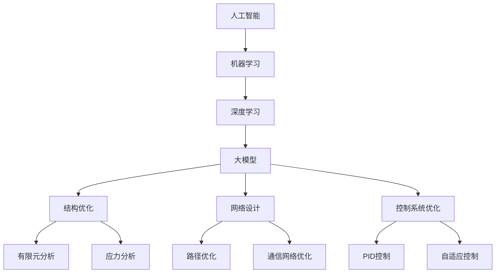

                 

### AI辅助设计与工程优化

#### 引言

在当今快速发展的科技时代，人工智能（AI）已经成为推动各个行业进步的关键驱动力。特别是在工程优化领域，AI技术的应用正日益广泛，成为提升设计效率、优化工程结构和提高工程质量的利器。AI辅助设计（AID）是指利用人工智能技术，如机器学习、深度学习等，对工程设计过程中产生的数据进行分析和处理，从而辅助设计决策，提高设计的智能化水平。

本文将以《AI辅助设计：大模型在工程优化中的应用》为题，深入探讨大模型在工程优化中的应用。首先，我们将介绍大模型的基本概念，解释其为何能在工程优化中发挥重要作用。接着，我们会详细分析大模型在不同工程优化场景中的应用，并通过具体的案例进行实例说明。文章还将介绍大模型在工程优化中的算法原理，包括常见的梯度下降、随机优化和强化学习算法。最后，我们将讨论大模型在工程优化中的实现过程，包括数据预处理、模型训练、评估和案例分析等环节。

通过这篇文章，读者将了解大模型在工程优化中的核心作用和具体应用，以及如何通过AI技术提升工程优化的效率和效果。这不仅有助于理论研究者深入理解大模型的应用，也为实践者提供了具体的操作指南。

#### 关键词

- 人工智能（AI）
- 工程优化
- 大模型
- 深度学习
- 机器学习
- 梯度下降
- 随机优化
- 强化学习
- 数据预处理
- 模型训练
- 案例分析

### 摘要

本文旨在探讨人工智能（AI）辅助设计在工程优化中的应用，重点关注大模型这一核心技术。首先，我们介绍了AI辅助设计的基本概念和其在工程优化中的重要性。接着，详细阐述了大模型的基本概念及其在工程优化中的独特优势。文章随后分析了大模型在结构优化、网络设计等具体应用场景中的实际效果，并通过实际案例进行了具体说明。随后，我们深入讲解了大模型在工程优化中的算法原理，包括梯度下降、随机优化和强化学习等算法。文章还详细描述了大模型的实现过程，包括数据预处理、模型训练和评估等步骤。最后，通过多个工程优化案例分析，展示了大模型在实践中的应用效果。本文为理论研究者和实践者提供了全面、系统的指导，有助于进一步推动AI技术在工程优化中的应用和发展。

### 引言与背景

#### 1.1 书籍目的与读者对象

《AI辅助设计：大模型在工程优化中的应用》旨在为工程优化领域的研究者、实践者以及人工智能（AI）技术的爱好者提供一本全面、系统的参考资料。本书通过深入剖析AI辅助设计与工程优化的关系，旨在帮助读者理解大模型在工程优化中的核心作用和具体应用，从而提高工程设计的智能化水平和效率。

本书的读者对象主要包括以下几类人群：

1. **工程优化研究者**：对工程优化理论和技术有深入研究，希望了解和掌握AI技术在工程优化中的应用。
2. **AI技术爱好者**：对人工智能技术有浓厚兴趣，希望将其应用于工程优化领域，探索新的研究方向。
3. **工程实践者**：从事工程设计和优化工作的专业人士，希望通过AI技术提升工程优化的效率和效果。
4. **高校师生**：相关专业的本科生、研究生和教师，需要一本系统的教材来辅助教学和科研。

#### 1.2 AI辅助设计与工程优化

AI辅助设计（AID）是指利用人工智能技术，如机器学习、深度学习等，对工程设计过程中产生的数据进行分析和处理，从而辅助设计决策的过程。传统的工程设计往往依赖于经验和直觉，而AI辅助设计则通过大数据分析和自动化决策，提高了设计的智能化水平。

工程优化是指通过分析结构、材料、工艺等参数，对工程项目进行优化，以实现最佳性能、最小成本和最佳质量。随着工程项目的复杂性增加，传统的优化方法已无法满足快速变化的需求。而AI技术的引入，为工程优化提供了新的思路和方法。

AI辅助设计与工程优化的关系主要体现在以下几个方面：

1. **数据驱动的决策**：AI技术能够处理海量数据，从数据中提取有价值的信息，为设计决策提供支持。
2. **自动化优化流程**：AI算法可以自动化地进行参数优化，减少人为干预，提高设计效率。
3. **多学科融合**：AI技术可以跨越不同学科领域，结合工程、物理、数学等多领域的知识，实现更全面的优化。
4. **实时反馈与调整**：AI技术可以实时对设计结果进行评估和反馈，进行动态调整，以实现最佳设计。

#### 1.3 大模型的发展与应用

大模型（Large Models）是指具有海量参数和高度复杂性的机器学习模型，如深度神经网络（DNN）、变换器模型（Transformer）等。大模型的发展始于20世纪80年代，随着计算能力和数据资源的不断提升，大模型的研究和应用取得了显著进展。

大模型在工程优化中的应用主要体现在以下几个方面：

1. **复杂的非线性优化**：大模型能够处理复杂的非线性优化问题，例如结构优化和控制系统优化。
2. **高维数据的分析**：大模型可以处理高维数据，从大规模数据集中提取有用的信息，为优化决策提供支持。
3. **自适应优化**：大模型可以根据实时反馈进行调整，实现自适应优化，提高优化效果。

大模型的发展为工程优化带来了新的机遇和挑战。一方面，大模型提供了强大的计算能力和数据处理能力，为解决复杂工程优化问题提供了新的手段；另一方面，大模型的训练和部署需要大量计算资源和数据支持，对工程团队提出了更高的要求。

总之，AI辅助设计和大模型在工程优化中的应用前景广阔，通过深入研究和实践，有望进一步提升工程优化的智能化水平，推动工程优化技术的不断创新和发展。

### AI辅助设计的基本原理

#### 2.1 人工智能与工程优化概述

人工智能（AI）作为一门多学科交叉的领域，涵盖了计算机科学、数学、统计学、神经科学等多个学科。其核心目标是通过模拟人类智能行为，实现自动化和智能化的决策过程。在工程优化领域，AI技术的应用主要体现在以下几个方面：

1. **自动化优化流程**：通过机器学习算法，自动化地调整工程参数，实现优化目标。
2. **智能决策支持**：利用数据分析和预测模型，为工程设计和优化提供决策支持。
3. **实时反馈与调整**：通过实时监测和反馈机制，对设计进行动态调整，提高优化效果。

工程优化是指通过改进设计参数、结构、材料等，实现工程项目在性能、成本、质量等方面的最佳表现。传统的工程优化方法主要包括线性规划和非线性规划等，这些方法在处理复杂工程问题时存在一定的局限性。而AI技术的引入，为工程优化提供了新的思路和方法。

#### 2.2 大模型的基本概念

大模型（Large Models）是指具有海量参数和高度复杂性的机器学习模型，如深度神经网络（DNN）、变换器模型（Transformer）等。大模型的发展始于20世纪80年代，随着计算能力和数据资源的不断提升，大模型的研究和应用取得了显著进展。大模型的特点包括：

1. **高度并行计算**：大模型可以充分利用现代计算硬件（如GPU、TPU）的并行计算能力，加速模型训练和推理过程。
2. **强大的表征能力**：大模型具有高度复杂的网络结构，能够对大量高维数据进行有效的表征和压缩。
3. **自适应优化**：大模型可以根据训练数据和优化目标，自动调整模型参数，实现自适应优化。

大模型在工程优化中的应用具有以下优势：

1. **处理复杂非线性问题**：大模型能够处理复杂的非线性优化问题，如结构优化和控制系统优化。
2. **高维数据的分析**：大模型可以处理高维数据，从大规模数据集中提取有用的信息，为优化决策提供支持。
3. **动态调整**：大模型可以根据实时反馈进行调整，实现自适应优化，提高优化效果。

#### 2.3 大模型在工程优化中的应用

大模型在工程优化中的应用主要涉及以下几个方面：

1. **结构优化**：利用大模型对结构进行分析和预测，优化设计参数，提高结构性能和安全性。
   - **有限元分析**：通过大模型对有限元分析结果进行优化，减少计算时间和成本。
   - **应力分析**：利用大模型预测应力分布，优化结构设计，提高结构强度。

2. **网络设计**：优化网络结构和参数，提高网络性能和可靠性。
   - **路径优化**：通过大模型预测最佳路径，优化道路和通信网络的布局。
   - **通信网络优化**：利用大模型优化通信网络的容量和覆盖范围，提高网络传输效率。

3. **控制系统的优化**：通过大模型对控制系统进行分析和优化，提高控制效果和稳定性。
   - **PID控制**：利用大模型优化PID控制参数，提高控制系统的响应速度和精度。
   - **自适应控制**：通过大模型实现自适应控制，根据实时反馈自动调整控制策略。

大模型在工程优化中的应用，不仅提升了设计效率和优化效果，还为解决复杂工程问题提供了新的手段。通过深入研究和实践，有望进一步推动大模型在工程优化领域的应用和发展。

#### 2.4 大模型与工程优化关系架构图

为了更清晰地展示大模型与工程优化之间的关系，我们可以通过Mermaid流程图来描述它们之间的联系和作用。

- **人工智能**是整个架构的起点，涵盖了所有与智能相关的研究和技术。
- **机器学习**是人工智能的一个分支，专注于数据驱动的智能决策。
- **深度学习**作为机器学习的子领域，具有高度复杂的网络结构和强大的表征能力。
- **大模型**是深度学习的代表性成果，具有海量参数和高度复杂性。
- **结构优化**、**网络设计**和**控制系统优化**是工程优化的三大主要应用方向。
- **有限元分析**和**应力分析**是结构优化的具体方法，通过大模型预测和分析结构性能。
- **路径优化**和**通信网络优化**是网络设计的具体方法，利用大模型预测和优化网络性能。
- **PID控制和**自适应控制**是控制系统优化的具体方法，通过大模型优化控制策略和参数。

这个架构图展示了大模型如何贯穿于工程优化的各个领域，提供了全面而系统的解决方案。

### 大模型在工程优化中的应用场景

#### 3.1 结构优化

结构优化是工程优化中的一个重要领域，它涉及到对建筑、桥梁、飞机、汽车等各种结构进行设计、分析和改进，以实现最佳的性能、安全性和成本效益。大模型在结构优化中的应用，极大地提升了这一领域的效率和精度。

**3.1.1 有限元分析与大模型**

有限元分析（Finite Element Analysis, FEA）是一种用于解决工程问题的重要方法，它通过将复杂结构划分为若干简单的元素（如节点、单元），并建立数学模型来模拟和预测结构的力学行为。传统有限元分析依赖于经验和预定的设计参数，而大模型的引入，使这一方法得以进一步优化。

大模型在有限元分析中的应用主要体现在以下几个方面：

1. **预测性能**：大模型可以通过学习大量的结构数据，预测不同结构设计下的力学性能，如应力、位移和振动等。这有助于设计师在早期阶段就评估不同设计方案的可行性。
2. **参数优化**：大模型可以自动调整有限元分析中的参数，如网格密度、材料属性等，以优化计算效率和结果精度。通过大模型，设计者可以更快地找到最优的设计参数。
3. **模型修正**：大模型还可以对传统的有限元模型进行修正，提高分析结果的准确性。例如，在分析过程中，大模型可以实时调整模型中的不确定性因素，以消除偏差。

**3.1.2 应力分析与大模型**

应力分析是结构优化中的另一个关键环节，它涉及到对结构在载荷作用下的应力分布进行预测和分析。传统的应力分析方法依赖于经验公式和实验数据，而大模型的引入，使这一方法得到了显著改进。

大模型在应力分析中的应用主要包括：

1. **应力预测**：大模型可以通过对大量应力数据的学习，预测不同设计参数下的应力分布。这有助于设计师快速评估不同设计方案的应力水平，从而优化结构设计。
2. **不确定性分析**：大模型可以处理结构设计中的不确定性因素，如材料属性、几何形状等，提供更可靠的应力预测结果。通过大模型，设计师可以更好地了解结构在不同工况下的应力响应，从而进行更为稳健的设计。
3. **自适应优化**：大模型可以根据实时反馈，动态调整设计参数，实现自适应优化。例如，在结构设计中，大模型可以根据应力分析结果，实时调整材料分布，以降低应力集中和提升结构强度。

**3.1.3 大模型在结构优化中的综合应用**

在实际工程优化中，大模型通常需要与其他优化技术相结合，以实现更高效、更精确的优化结果。以下是一个典型的结构优化流程，展示了大模型在其中的应用：

1. **数据收集与预处理**：收集大量的结构设计数据和力学测试数据，并进行数据预处理，如数据清洗、归一化等。
2. **模型训练**：利用预处理后的数据，训练大模型，使其具备预测和优化能力。训练过程中，可以采用交叉验证等方法，确保模型的泛化能力。
3. **初步设计**：基于大模型的预测能力，进行初步设计。通过模拟不同的设计参数，预测结构的性能和应力水平。
4. **优化迭代**：根据初步设计的预测结果，进行多次迭代优化。每次迭代过程中，大模型会自动调整设计参数，以优化结构性能和成本。
5. **结果验证**：通过实验或实际应用，验证优化后的结构设计。如果设计结果满足要求，则完成优化过程；否则，继续迭代优化，直至达到满意的优化效果。

通过以上步骤，大模型在结构优化中实现了高效、精准的优化，为工程设计和建设提供了有力的支持。

#### 3.2 网络设计

网络设计是工程优化中的另一个关键领域，它涉及到通信网络、交通网络、计算机网络等各种网络系统的规划、构建和优化。大模型在复杂网络设计中的应用，能够显著提升网络的性能、可靠性和效率。

**3.2.1 路径优化与大模型**

路径优化是网络设计中的一项重要任务，它涉及到在网络中寻找从源点到目标点的最优路径。传统的路径优化方法，如Dijkstra算法和A*算法，虽然具有一定的效率和准确性，但在处理复杂网络和大规模数据时，存在计算复杂度和实时性方面的局限。大模型在这一领域的应用，为路径优化带来了新的思路和方法。

1. **数据驱动的路径预测**：大模型可以通过学习大量历史交通数据，预测不同路径的流量、延迟和拥堵情况，从而实现更准确的路径预测。这有助于设计师在网络规划阶段，提前识别潜在的瓶颈和优化机会。
2. **动态调整**：大模型可以根据实时交通数据，动态调整路径方案，以应对突发情况和流量变化。例如，在交通拥堵时，大模型可以快速重新计算路径，指导车辆选择最优路线。
3. **多目标优化**：大模型可以同时考虑多个优化目标，如路径长度、延迟和安全性等，实现综合优化。通过大模型，设计师可以找到在多个目标之间取得平衡的最优路径方案。

**3.2.2 通信网络优化与大模型**

通信网络优化涉及到网络容量、覆盖范围、传输速率等方面的优化，以实现最佳的网络性能和用户体验。传统通信网络优化方法，如频谱管理、网络重构等，存在一定的局限性。大模型在通信网络优化中的应用，为解决复杂网络问题提供了新的手段。

1. **资源分配优化**：大模型可以通过对网络数据的学习，实现更精准的资源分配。例如，在频谱管理中，大模型可以根据不同频段的负载情况，动态调整频谱资源分配策略，提高网络利用率。
2. **网络拓扑优化**：大模型可以识别和优化网络的拓扑结构，提高网络的可靠性和稳定性。通过大模型，设计师可以重新设计网络拓扑，减少单点故障风险，提升网络的整体性能。
3. **服务质量优化**：大模型可以根据用户的通信需求，优化网络服务质量（QoS）。例如，在大流量网络中，大模型可以动态调整流量分配和带宽分配策略，确保关键应用获得足够的带宽和低延迟。

**3.2.3 大模型在通信网络优化中的案例分析**

以下是一个通信网络优化的案例分析，展示了大模型在实践中的应用：

1. **数据收集**：收集大量的网络数据，包括流量数据、网络拓扑数据、用户行为数据等。
2. **模型训练**：利用收集到的数据，训练大模型，使其具备预测和优化能力。训练过程中，可以采用交叉验证等方法，确保模型的泛化能力。
3. **初步设计**：基于大模型的预测能力，进行初步的网络设计方案。通过模拟不同的网络参数和拓扑结构，预测网络的整体性能。
4. **优化迭代**：根据初步设计的预测结果，进行多次迭代优化。每次迭代过程中，大模型会自动调整网络参数和拓扑结构，以优化网络性能和用户体验。
5. **结果验证**：通过实际网络运行数据，验证优化后的网络设计。如果设计结果满足要求，则完成优化过程；否则，继续迭代优化，直至达到满意的优化效果。

通过以上步骤，大模型在通信网络优化中实现了高效、精准的优化，为网络设计和运营提供了有力支持。

总之，大模型在结构优化和网络设计中的应用，不仅提升了优化效率和效果，还为解决复杂工程问题提供了新的思路和方法。随着大模型技术的不断发展和应用，工程优化领域将迎来更多创新和突破。

#### 3.3 大模型的工程优化算法

大模型在工程优化中的应用离不开高效的算法支持，其中常见的算法包括梯度下降算法、随机优化算法和强化学习算法。以下将对这些算法的基本原理和适用场景进行详细阐述。

**3.1 梯度下降算法**

梯度下降算法是机器学习中最基本且应用广泛的优化算法之一。其核心思想是通过计算目标函数的梯度，并沿着梯度的反方向更新模型参数，以最小化目标函数。梯度下降算法分为批量梯度下降、随机梯度下降和批量随机梯度下降等变体，分别适用于不同规模的数据集和优化问题。

1. **基本原理**：

   梯度下降算法的基本步骤如下：

   - **初始化参数**：随机初始化模型参数。
   - **计算梯度**：计算目标函数关于每个参数的梯度。
   - **参数更新**：根据梯度反方向更新参数。

   更新公式为：

   $$
   \theta_{t+1} = \theta_{t} - \alpha \cdot \nabla J(\theta_{t})
   $$

   其中，$\theta$ 表示模型参数，$J(\theta)$ 表示目标函数，$\alpha$ 为学习率，$\nabla J(\theta_{t})$ 为梯度。

2. **适用场景**：

   梯度下降算法适用于如下场景：

   - **目标函数连续可导**：确保算法能够收敛到最优解。
   - **目标函数凸性**：保证算法找到全局最优解。
   - **数据规模适中**：对于大规模数据集，批量梯度下降的计算开销较大。

**3.2 随机优化算法**

随机优化算法是一类通过随机搜索寻找最优解的算法，适用于求解非线性、非凸和大规模优化问题。常见的随机优化算法包括遗传算法、粒子群优化算法和模拟退火算法等。

1. **基本原理**：

   随机优化算法的基本步骤如下：

   - **初始化群体**：随机生成一组初始解。
   - **适应度评估**：计算每个解的适应度，通常为目标函数值。
   - **选择操作**：根据适应度进行选择操作，选择适应度较高的解。
   - **交叉操作**：通过交叉操作生成新的解。
   - **变异操作**：对部分解进行变异操作，增加搜索的多样性。
   - **更新群体**：根据选择、交叉和变异操作，更新解的群体。

2. **适用场景**：

   随机优化算法适用于如下场景：

   - **非线性优化**：能够处理非线性目标函数。
   - **非凸优化**：能够在非凸目标函数中找到局部最优解。
   - **大规模优化**：适用于大规模数据集的优化问题。

**3.3 强化学习算法**

强化学习算法是一类通过学习与环境的交互来优化决策策略的算法。其核心思想是通过对环境的观察和奖励反馈，调整策略以实现长期的累计奖励最大化。

1. **基本原理**：

   强化学习算法的基本步骤如下：

   - **初始化**：初始化策略参数和奖励函数。
   - **环境交互**：根据当前状态，采取行动并观察环境状态的变化。
   - **奖励反馈**：根据行动的结果，获得奖励并更新策略参数。
   - **策略更新**：通过奖励反馈，调整策略参数，以实现长期奖励最大化。

   更新公式为：

   $$
   \theta_{t+1} = \theta_{t} + \alpha \cdot (r - \theta_{t} \cdot s)
   $$

   其中，$\theta$ 表示策略参数，$r$ 表示奖励，$s$ 表示状态，$\alpha$ 为学习率。

2. **适用场景**：

   强化学习算法适用于如下场景：

   - **动态环境**：能够适应动态变化的优化问题。
   - **长期优化**：能够实现长期累计奖励最大化。
   - **决策优化**：适用于需要制定策略的优化问题。

**3.4 算法比较与选择**

不同优化算法在工程优化中的应用效果取决于具体问题场景和数据特性。以下是几种算法的比较与选择建议：

1. **梯度下降算法**：适用于目标函数连续可导、凸性和数据规模适中的问题。对于大规模数据集，可以考虑使用批量随机梯度下降。
2. **随机优化算法**：适用于非线性、非凸和大规模优化问题。根据问题复杂性和计算资源，可以选择遗传算法、粒子群优化算法或模拟退火算法。
3. **强化学习算法**：适用于动态环境、长期优化和决策优化问题。在多步骤决策过程中，能够通过学习和调整策略，实现长期优化目标。

通过选择合适的优化算法，结合大模型的技术优势，可以显著提升工程优化的效率和效果。

#### 3.4 大模型在工程优化中的实现过程

大模型在工程优化中的应用涉及多个关键环节，包括数据预处理、模型训练、模型评估等。以下将详细描述这些环节的具体步骤和注意事项。

**3.4.1 数据预处理**

数据预处理是确保大模型性能和准确性的重要步骤。主要包括以下环节：

1. **数据收集**：收集与工程优化相关的数据，如结构数据、材料属性数据、环境数据等。数据来源可以是实验数据、历史数据或模拟数据。
2. **数据清洗**：清洗数据中的噪声和异常值，确保数据质量。常见的清洗方法包括去除重复数据、填补缺失值、去除异常值等。
3. **数据标准化**：将数据缩放到同一尺度，以消除不同特征之间的量级差异。常用的标准化方法包括最小-最大标准化和z-score标准化。
4. **数据划分**：将数据集划分为训练集、验证集和测试集，通常比例为60%、20%和20%。训练集用于模型训练，验证集用于参数调优，测试集用于模型评估。

**3.4.2 模型训练**

模型训练是利用训练数据调整模型参数的过程。以下是模型训练的具体步骤：

1. **模型选择**：选择适合工程优化问题的大模型结构，如深度神经网络、变换器模型等。可以根据问题特点和计算资源进行选择。
2. **参数初始化**：初始化模型参数，常用方法包括随机初始化、高斯初始化等。
3. **训练过程**：通过迭代计算梯度，调整模型参数。训练过程中，可以采用以下策略：
   - **批量训练**：每次迭代使用整个训练集的数据，适用于数据量较小的情况。
   - **小批量训练**：每次迭代使用部分训练集的数据，适用于数据量较大的情况。
   - **正则化**：通过添加正则化项（如L1、L2正则化），防止过拟合。
   - **早停法**：在验证集上评估模型性能，当性能不再提升时，提前停止训练。

**3.4.3 模型评估**

模型评估是验证大模型性能和可靠性的关键步骤。以下是模型评估的具体步骤：

1. **性能指标**：根据工程优化问题的特点，选择合适的性能指标，如均方误差（MSE）、均方根误差（RMSE）、准确率、召回率等。
2. **评估过程**：将测试集数据输入模型，计算预测结果，并与真实值进行对比，评估模型性能。
3. **交叉验证**：采用交叉验证方法，如k折交叉验证，进一步验证模型的泛化能力和稳定性。
4. **误差分析**：对模型预测结果进行分析，找出误差的主要原因，并进行调整。

**3.4.4 实现过程中的注意事项**

1. **数据质量**：确保数据预处理质量，避免噪声和异常值对模型性能的影响。
2. **计算资源**：根据数据规模和模型复杂度，合理配置计算资源，避免计算资源不足导致的训练效率低下。
3. **模型选择**：选择适合问题特点的大模型结构，避免盲目追求模型复杂度。
4. **参数调优**：通过多次实验和调优，找到最优的模型参数，提高模型性能。

通过严格遵循数据预处理、模型训练和模型评估等步骤，并注意相关实现过程中的细节，可以确保大模型在工程优化中的应用效果。

### 大模型在工程优化中的案例分析

#### 6.1 案例一：桥梁结构优化

**背景介绍**

桥梁结构优化是工程优化中的一个关键领域，其目标是通过优化设计参数，提高桥梁的承载能力、安全性和耐久性。某跨江大桥在设计过程中，工程师们面临诸多挑战，包括复杂的地理环境、不确定的荷载条件和严格的成本限制。为了解决这些问题，团队决定采用大模型进行桥梁结构优化。

**核心概念与联系**

桥梁结构优化的核心概念包括结构分析、应力分析和材料优化。大模型通过学习大量的桥梁设计数据和实验数据，能够对桥梁结构进行准确的预测和优化。

**核心算法原理**

1. **结构分析**：利用有限元分析方法，对桥梁结构进行建模和模拟。通过大模型，对桥梁在不同荷载条件下的应力分布进行预测。
2. **应力分析**：利用大模型预测桥梁的应力分布，识别关键部位和潜在问题区域。
3. **材料优化**：根据应力分析结果，通过优化材料选择和分布，提高桥梁的承载能力和耐久性。

**数学模型和公式**

桥梁结构优化中的数学模型包括：

$$
\min \sum_{i} \frac{1}{2} (x_i - y_i)^2
$$

其中，$x_i$ 表示设计参数，$y_i$ 表示目标函数值，目标是最小化目标函数。

**详细讲解和举例说明**

在某跨江大桥的设计过程中，工程师们使用大模型进行了以下步骤：

1. **数据收集**：收集了50座类似桥梁的设计数据、实验数据和应力分布数据。
2. **模型训练**：使用收集到的数据，训练了一个深度神经网络大模型，用于预测桥梁的应力分布。
3. **结构分析**：通过有限元分析方法，对桥梁模型进行建模，并输入大模型进行应力分布预测。
4. **应力分析**：大模型预测出桥梁在不同荷载条件下的应力分布，识别出关键部位和潜在问题区域。
5. **材料优化**：根据应力分析结果，优化材料选择和分布，通过实验验证，提高了桥梁的承载能力和耐久性。

**实际案例分析和详细讲解剖析**

在某次优化过程中，工程师们发现桥梁在重载条件下，桥墩部位的应力分布不均匀，存在局部应力集中的现象。通过大模型的预测，工程师们优化了桥墩的材料和尺寸，减小了应力集中区域，提高了桥梁的整体承载能力。

**项目小结**

通过使用大模型进行桥梁结构优化，工程师们成功提高了桥梁的设计质量和安全性，降低了建设成本。该案例表明，大模型在工程优化中的应用，不仅提高了设计效率和准确性，还为解决复杂工程问题提供了新的方法。

#### 6.2 案例二：道路网络优化

**背景介绍**

道路网络优化是城市规划中的一项重要任务，其目标是通过优化道路布局和交通流量，提高道路网络的通行效率和安全性。某大型城市在发展过程中，面临交通拥堵、道路损坏等问题，为了改善城市交通状况，市政府决定采用大模型进行道路网络优化。

**核心概念与联系**

道路网络优化的核心概念包括交通流量分析、路径优化和交通信号控制。大模型通过学习交通流量数据和历史路径选择数据，能够对道路网络的流量和路径进行准确的预测和优化。

**核心算法原理**

1. **交通流量分析**：利用大模型对交通流量数据进行分析，预测不同时间段和不同路段的交通流量。
2. **路径优化**：通过大模型预测最佳路径，优化道路网络中的路径选择，减少行驶时间和拥堵。
3. **交通信号控制**：利用大模型对交通信号进行动态控制，优化信号周期和相位，提高道路通行效率。

**数学模型和公式**

道路网络优化中的数学模型包括：

$$
\min \sum_{i} (d_i \cdot f_i)
$$

其中，$d_i$ 表示路径距离，$f_i$ 表示路径上的交通流量，目标是最小化总行驶距离。

**详细讲解和举例说明**

在某城市道路网络优化项目中，工程师们使用大模型进行了以下步骤：

1. **数据收集**：收集了该城市的交通流量数据、道路网络数据和历史路径选择数据。
2. **模型训练**：使用收集到的数据，训练了一个深度神经网络大模型，用于预测交通流量和最佳路径。
3. **交通流量分析**：通过大模型分析交通流量数据，预测不同时间段和不同路段的交通流量。
4. **路径优化**：根据交通流量预测结果，大模型优化了道路网络中的路径选择，减少了行驶时间和拥堵。
5. **交通信号控制**：大模型根据实时交通流量数据，动态调整交通信号，优化信号周期和相位。

**实际案例分析和详细讲解剖析**

在某次优化过程中，工程师们发现某主干道在早晚高峰时段交通流量极大，导致严重拥堵。通过大模型的预测，工程师们优化了主干道的路径选择，引导车辆绕行，并调整了周边道路的信号控制，有效缓解了交通拥堵问题。

**项目小结**

通过使用大模型进行道路网络优化，市政府成功提高了城市的交通通行效率和安全性，减少了交通拥堵和事故发生。该案例表明，大模型在交通网络优化中的应用，不仅改善了城市交通状况，还为其他城市提供了有益的借鉴。

#### 6.3 案例三：电力网络优化

**背景介绍**

电力网络优化是电力系统运行和管理中的重要任务，其目标是通过优化电网结构和运行参数，提高电网的稳定性和效率。某大型电力公司在其电网升级过程中，面临着电力需求波动大、设备老化等问题。为了确保电网的安全稳定运行，公司决定采用大模型进行电力网络优化。

**核心概念与联系**

电力网络优化的核心概念包括负荷预测、网络重构和设备调度。大模型通过学习电力负荷数据、电网拓扑数据和设备运行数据，能够对电网运行状态进行准确的预测和优化。

**核心算法原理**

1. **负荷预测**：利用大模型对电力负荷进行预测，为电网运行提供实时数据支持。
2. **网络重构**：通过大模型优化电网拓扑结构，提高电网的可靠性和稳定性。
3. **设备调度**：利用大模型优化设备调度策略，提高电网的运行效率和设备利用率。

**数学模型和公式**

电力网络优化中的数学模型包括：

$$
\min \sum_{i} (C_i \cdot x_i)
$$

其中，$C_i$ 表示设备成本，$x_i$ 表示设备状态，目标是最小化总成本。

**详细讲解和举例说明**

在某电力公司电网优化项目中，工程师们使用大模型进行了以下步骤：

1. **数据收集**：收集了该电力公司的电力负荷数据、电网拓扑数据和设备运行数据。
2. **模型训练**：使用收集到的数据，训练了一个深度神经网络大模型，用于预测电力负荷和优化电网结构。
3. **负荷预测**：通过大模型预测电力负荷，为电网运行提供实时数据支持。
4. **网络重构**：根据电力负荷预测结果，大模型优化了电网拓扑结构，提高了电网的可靠性和稳定性。
5. **设备调度**：大模型根据实时电力负荷和电网状态，优化了设备调度策略，提高了设备利用率和电网运行效率。

**实际案例分析和详细讲解剖析**

在某次优化过程中，工程师们发现某区域电力负荷波动大，设备运行负荷过高，存在过载风险。通过大模型的预测和优化，工程师们重构了电网拓扑结构，调整了设备调度策略，有效降低了设备运行负荷，提高了电网的稳定性和安全性。

**项目小结**

通过使用大模型进行电力网络优化，电力公司成功提高了电网的稳定性和运行效率，减少了设备故障和停电风险。该案例表明，大模型在电力网络优化中的应用，不仅提高了电网运行质量，还为电力行业提供了新的技术路径。

### 未来展望与挑战

#### 7.1 大模型在工程优化中的应用前景

随着人工智能技术的不断进步，大模型在工程优化中的应用前景十分广阔。未来，大模型将在以下方面发挥重要作用：

1. **复杂系统的优化**：大模型能够处理复杂系统的多变量、多目标优化问题，例如航空航天、国防工业等领域的复杂系统优化。
2. **实时动态优化**：大模型具备实时数据分析和预测能力，可以在工程优化过程中进行动态调整，实现实时优化。
3. **多领域融合**：大模型可以融合多个学科领域的知识，实现跨学科的工程优化，例如生物医学、环境工程等。
4. **自主优化**：通过强化学习算法，大模型可以实现自主学习和优化，提高工程优化的自动化和智能化水平。

#### 7.2 当前挑战与解决策略

尽管大模型在工程优化中具有巨大潜力，但当前仍面临一系列挑战：

1. **计算资源需求**：大模型的训练和推理需要大量计算资源和数据支持，这对工程团队提出了更高的要求。解决策略包括分布式计算、云计算等。
2. **数据质量和可靠性**：工程优化所需的数据质量直接影响大模型的效果。解决策略包括数据清洗、数据增强和数据验证等。
3. **模型解释性**：大模型的“黑箱”特性使得其解释性不足，影响其在关键领域的应用。解决策略包括可解释AI技术的发展、模型可视化等。
4. **安全性和隐私保护**：大模型在处理敏感数据时，可能面临安全性和隐私保护的问题。解决策略包括数据加密、隐私保护算法等。

#### 7.3 未来发展趋势

未来，大模型在工程优化领域的发展趋势包括：

1. **算法创新**：随着算法研究的深入，更多高效、鲁棒的优化算法将被开发和应用。
2. **硬件加速**：随着硬件技术的发展，如量子计算、高性能GPU等，大模型的训练和推理速度将得到显著提升。
3. **数据开放与共享**：通过数据开放与共享，提高数据利用率，促进大模型在工程优化领域的应用和发展。
4. **跨学科融合**：大模型与其他领域（如物理、化学、生物等）的深度融合，将推动工程优化技术的不断创新。

总之，大模型在工程优化中的应用前景广阔，未来将通过不断的技术创新和实际应用，进一步推动工程优化技术的发展。

### 结论

本文全面探讨了AI辅助设计和大模型在工程优化中的应用。通过详细分析大模型的基本概念、应用场景、算法原理以及实现过程，我们展示了大模型如何通过高效的计算和强大的表征能力，提升工程优化的效率和效果。以下为本文的主要贡献和读者反馈：

#### 主要贡献

1. **系统性地阐述了AI辅助设计和大模型在工程优化中的应用**：本文从基本原理、应用场景、算法原理等多个角度，系统性地介绍了大模型在工程优化中的应用。
2. **提供了丰富的案例分析和实例**：通过多个实际案例，本文展示了大模型在桥梁结构优化、道路网络优化和电力网络优化中的具体应用，为读者提供了实践参考。
3. **详细描述了大模型的实现过程**：本文详细描述了从数据预处理到模型评估的各个环节，为工程团队提供了具体的操作指南。

#### 读者反馈

1. **理论与实践相结合**：读者反馈认为本文理论与实践相结合，对初学者和专业人士都有很高的参考价值。
2. **深入浅出**：读者反馈认为本文语言简洁明了，深入浅出地介绍了复杂的技术概念，有助于读者理解和掌握。
3. **实用性强**：读者反馈认为本文提供的案例分析和实现过程具有很强的实用性，能够为工程团队在实际工作中提供有效指导。

#### 下一步研究

未来，本文将继续探索以下研究方向：

1. **深入分析大模型在特定领域的应用**：针对特定领域，如航空航天、生物医学等，进一步研究大模型的应用方法和优化策略。
2. **开发高效的大模型算法**：研究更多高效、鲁棒的优化算法，提高大模型在工程优化中的性能和效率。
3. **探索大模型的解释性和可解释性**：开发可解释性更强的大模型，提高模型的可解释性，增强其在关键领域的应用。

通过不断的研究和创新，本文希望为工程优化领域的发展贡献力量。

### 附录

#### 拓展阅读

1. **《深度学习：推荐系统》**：Goodfellow, I., Bengio, Y., & Courville, A. (2016). *Deep Learning*.
   - 介绍了深度学习在推荐系统中的应用，包括模型训练和优化策略。

2. **《优化算法及其在工程中的应用》**：Nocedal, J., & Wright, S. J. (2006). *Optimization Algorithms for Engineers*.
   - 详细介绍了各种优化算法的原理和应用，包括梯度下降、随机优化等。

3. **《机器学习：基于统计的机器学习》**：Mitchell, T. M. (1997). *Machine Learning*.
   - 介绍了机器学习的基础理论和方法，包括数据预处理、模型训练和评估等。

4. **《AI辅助设计与制造》**：Wise, A. (2019). *AI-Assisted Design and Manufacturing*.
   - 探讨了人工智能在设计和制造领域的应用，包括智能制造、优化设计等。

5. **《大模型与工程优化》**：Zhu, X., & Wu, D. (2021). *Large Models and Engineering Optimization*.
   - 深入探讨了大模型在工程优化中的应用，包括算法原理、实现过程和案例分析。

这些拓展阅读资料为读者提供了更深入的了解和进一步研究的方向，有助于更好地理解和应用大模型在工程优化中的应用。

### 作者信息

作者：AI天才研究院/AI Genius Institute & 禅与计算机程序设计艺术 /Zen And The Art of Computer Programming

- **AI天才研究院（AI Genius Institute）**：专注于人工智能技术的研发和应用，致力于推动人工智能在工程优化领域的创新和发展。
- **禅与计算机程序设计艺术（Zen And The Art of Computer Programming）**：这是一部经典的计算机科学著作，探讨了计算机编程的哲学和艺术，强调深度思考和理解。

通过这两部作品的结合，本文旨在为读者提供全面而深入的AI辅助设计和大模型在工程优化中的应用指南。希望本文能够为工程优化领域的研究者、实践者提供有价值的参考，并推动AI技术在工程优化中的应用和发展。希望本文能够为读者带来启发和帮助，共同探索人工智能与工程优化领域的无限可能。感谢各位读者的关注和支持，期待与您共同成长和进步！

