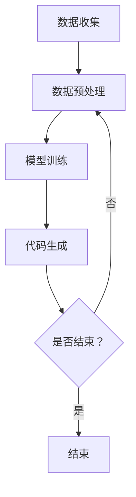
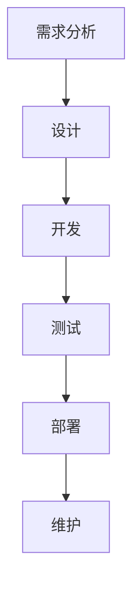

                 

### 文章标题

《AI辅助软件开发：大模型在代码生成中的应用》

#### 关键词
- AI 辅助软件开发
- 大模型
- 代码生成
- 深度学习
- 自动化测试

#### 摘要
本文探讨了人工智能（AI）在软件开发中的最新进展，特别是大模型在代码生成领域的应用。通过梳理AI的发展历程，介绍AI基础概念和深度学习原理，本文深入分析了大模型在代码生成中的工作流程、挑战及其解决方案。随后，本文通过实际案例展示了AI辅助软件开发的实际应用，并提出了最佳实践和未来趋势，旨在为开发者提供有价值的参考。

### 引言

软件开发是现代社会不可或缺的一部分，它影响着我们日常生活的方方面面。从操作系统到移动应用，从Web服务到物联网设备，软件已经渗透到了我们的工作和生活中。然而，随着软件系统的复杂性和规模不断增长，传统的软件开发方式面临着巨大的挑战。人工编写代码不仅耗时耗力，而且容易出现错误。为了提高开发效率、降低成本、减少错误，人工智能（AI）被引入到软件开发领域。

AI在软件开发中的应用可以追溯到很久以前，从早期的专家系统到现在的深度学习，AI技术不断演变和进步。特别是在近年来，随着计算能力的提升和大数据的普及，AI在软件开发中的应用取得了显著的成果。其中一个重要的应用领域就是代码生成。代码生成利用AI模型自动生成代码，不仅能够提高开发效率，还能减少人为错误，提高代码质量。

本文将深入探讨大模型在代码生成中的应用，分析其工作原理、挑战和解决方案，并通过实际案例展示AI辅助软件开发的巨大潜力。文章结构如下：

1. **AI概述与软件开发**
   - AI的发展历程
   - AI在软件开发中的应用场景
   - AI辅助软件开发的挑战与机遇

2. **AI基础**
   - 神经网络原理
   - 深度学习框架
   - 自然语言处理

3. **代码生成**
   - 代码生成的概念
   - 基于模板的代码生成
   - 基于数据驱动的代码生成

4. **大模型在代码生成中的应用**
   - 大模型的定义与分类
   - 大模型在代码生成中的工作流程
   - 大模型在代码生成中的挑战与解决方案

5. **AI辅助软件开发实战**
   - 项目准备与开发环境搭建
   - 大模型应用案例
   - AI辅助软件开发项目管理

6. **展望与未来**
   - AI辅助软件开发的未来趋势
   - 总结与展望

通过本文的阅读，读者将深入了解AI辅助软件开发，特别是大模型在代码生成中的应用，从而为实际项目开发提供指导。

### AI概述与软件开发

人工智能（Artificial Intelligence，简称AI）作为计算机科学的一个重要分支，其目标是创建能够模拟、延伸和扩展人类智能的系统。AI的发展历程可以追溯到20世纪50年代，当时学者们开始研究如何让计算机具有人类的智能。早期的AI研究主要集中在规则系统、知识表示和推理上，这被称为**符号AI**或**经典AI**。然而，随着计算能力的限制和现实世界复杂性的增加，符号AI逐渐暴露出其局限性。

进入21世纪，随着大数据、云计算和深度学习技术的快速发展，AI迎来了新的春天。**深度学习**作为一种以神经网络为基础的机器学习技术，通过模拟人脑神经网络的结构和功能，能够从大量数据中自动学习特征和模式。深度学习在图像识别、语音识别、自然语言处理等领域取得了突破性的成果，使得AI的应用范围得以大幅扩展。

在软件开发领域，AI的应用主要体现在以下几个方面：

1. **代码生成**：利用AI模型自动生成代码，提高开发效率和质量。例如，AI可以自动生成测试用例、API文档、数据库模式等。

2. **自动化测试**：AI可以分析代码，预测潜在的缺陷，生成测试用例，并自动执行测试，提高测试的覆盖率和准确性。

3. **代码优化**：AI可以通过分析代码的执行效率，提出优化建议，如代码重构、算法改进等。

4. **智能助手**：AI助手可以帮助开发者查找文档、提供技术支持、优化工作流程等。

5. **软件缺陷修复**：AI可以通过学习已有的缺陷和修复方法，自动识别和修复代码中的错误。

尽管AI在软件开发中具有巨大的潜力，但同时也面临着一些挑战。首先，AI模型需要大量高质量的数据进行训练，数据质量和数量直接影响模型的性能。其次，AI模型的黑盒特性使得其决策过程难以解释，这在某些需要严格遵循标准和规范的领域可能成为问题。最后，AI模型的开发和部署成本较高，对中小型开发团队来说可能是一个负担。

总的来说，AI辅助软件开发不仅带来了效率和质量上的提升，还改变了软件开发的方式和流程。随着AI技术的不断进步，它将在软件开发中发挥越来越重要的作用，为开发者提供更加智能、高效的开发工具和方法。

### AI基础

#### 神经网络原理

神经网络（Neural Networks，简称NN）是人工智能的核心组成部分之一，其灵感来源于生物神经系统的结构和功能。一个基本的神经网络由多个节点（也称为神经元）组成，这些节点通过连接（称为边或权重）相互连接。每个神经元接收来自其他神经元的输入信号，通过一个非线性激活函数进行处理，并产生一个输出信号。

神经元的数学表示如下：

$$
Y = \sigma(\sum_{i=1}^{n} w_i X_i + b)
$$

其中，$Y$ 是神经元的输出，$X_i$ 是第 $i$ 个输入，$w_i$ 是输入和权重之间的连接权重，$\sigma$ 是激活函数，$b$ 是偏差项。

常见的激活函数有：

- **sigmoid函数**： 
  $$
  \sigma(x) = \frac{1}{1 + e^{-x}}
  $$

- **ReLU函数**：
  $$
  \sigma(x) = \max(0, x)
  $$

- **Tanh函数**：
  $$
  \sigma(x) = \frac{e^x - e^{-x}}{e^x + e^{-x}}
  $$

神经网络的工作原理可以概括为以下步骤：

1. **前向传播**：输入信号通过网络中的每个层，每个神经元接收来自前一层的输入并计算输出。
2. **激活函数**：对每个神经元的输出应用激活函数。
3. **反向传播**：根据网络的输出和实际目标，计算每个神经元的误差，并调整权重和偏差，以最小化总误差。

#### 深度学习框架

深度学习框架是用于实现和训练深度学习模型的一系列库和工具。这些框架提供了高效的计算能力、丰富的API和大量的预训练模型，极大地简化了深度学习模型的开发过程。目前最流行的深度学习框架包括：

- **TensorFlow**：由Google开发，提供了丰富的API和强大的计算能力，适用于各种类型的深度学习模型。
- **PyTorch**：由Facebook开发，以动态计算图和灵活的API著称，广泛用于研究和工业应用。
- **Keras**：一个高层神经网络API，能够以简洁的Python接口快速构建和训练深度学习模型，常作为TensorFlow和Theano的封装层。

以下是一个使用TensorFlow构建简单神经网络的示例：

```python
import tensorflow as tf

# 定义神经网络结构
model = tf.keras.Sequential([
    tf.keras.layers.Dense(128, activation='relu', input_shape=(784,)),
    tf.keras.layers.Dense(10, activation='softmax')
])

# 编译模型
model.compile(optimizer='adam',
              loss='categorical_crossentropy',
              metrics=['accuracy'])

# 训练模型
model.fit(x_train, y_train, epochs=5, batch_size=32)
```

#### 自然语言处理

自然语言处理（Natural Language Processing，简称NLP）是AI的一个重要应用领域，其目标是使计算机能够理解和处理人类语言。NLP技术包括文本预处理、词嵌入、语言模型、序列标注和机器翻译等。

- **词嵌入（Word Embedding）**：将词汇映射到低维向量空间，以便计算机能够理解和处理。
  $$
  \text{word\_embedding}(w) = e^w
  $$

- **语言模型（Language Model）**：用于预测下一个单词或字符的概率。
  $$
  P(w_t | w_{t-1}, w_{t-2}, ..., w_1) = \text{language\_model}(w_t | w_{t-1}, w_{t-2}, ..., w_1)
  $$

- **序列标注（Sequence Labeling）**：对序列中的每个元素进行分类，如词性标注、命名实体识别等。
  $$
  y_t = \text{label}(w_t)
  $$

- **机器翻译（Machine Translation）**：将一种语言的文本翻译成另一种语言。
  $$
  \text{translate}(w_s) = w_t
  $$

以下是一个使用PyTorch实现简单的文本分类任务的示例：

```python
import torch
import torch.nn as nn
import torch.optim as optim

# 定义模型结构
model = nn.Sequential(
    nn.Embedding(vocab_size, embedding_dim),
    nn.Linear(embedding_dim, num_classes),
    nn.LogSoftmax(dim=1)
)

# 编译模型
optimizer = optim.Adam(model.parameters(), lr=0.001)
criterion = nn.NLLLoss()

# 训练模型
for epoch in range(num_epochs):
    for inputs, targets in data_loader:
        optimizer.zero_grad()
        outputs = model(inputs)
        loss = criterion(outputs, targets)
        loss.backward()
        optimizer.step()
```

通过以上对神经网络原理、深度学习框架和自然语言处理的基本介绍，我们可以看到AI基础在软件开发中扮演着至关重要的角色。接下来，我们将进一步探讨代码生成这一具体应用领域。

### 代码生成

#### 概念

代码生成（Code Generation）是指利用人工智能技术自动生成代码的过程。这种技术通过分析需求、设计模式或现有代码，生成满足特定要求的代码。代码生成的目标不仅是提高开发效率，还包括提高代码的一致性和可靠性。

代码生成可以分为以下几种类型：

1. **基于模板的代码生成**：通过预定义的模板和规则，自动生成代码。这种方法适用于代码结构较为固定的场景。
2. **基于数据驱动的代码生成**：利用机器学习模型，从大量数据中学习代码生成的规则和模式。这种方法适用于代码结构复杂、变化多样的场景。
3. **混合型代码生成**：结合基于模板和数据驱动的方法，综合利用两者的优势。

#### 基于模板的代码生成

基于模板的代码生成方法通常涉及以下步骤：

1. **模板设计**：根据项目的需求，设计预定义的代码模板。
2. **规则定义**：定义模板中变量的取值规则，以便在生成代码时进行替换。
3. **代码生成**：将模板和规则应用于特定的输入，生成目标代码。

以下是一个简单的基于模板的代码生成示例：

```python
# 模板
def function_template(name, x):
    return f"{name}({x})"

# 规则
name_rule = "add"
x_rule = "a + b"

# 生成代码
generated_code = function_template(name_rule, x_rule)
print(generated_code)
```

输出结果：

```
add(a + b)
```

这种方法的优点是简单易用，生成的代码结构固定，适合用于生成文档、测试用例等。

#### 基于数据驱动的代码生成

基于数据驱动的代码生成方法利用机器学习模型，从大量代码数据中学习生成规则。这种方法通常涉及以下步骤：

1. **数据收集**：收集大量的代码数据，用于训练模型。
2. **数据预处理**：对收集的代码数据进行清洗、归一化等预处理操作。
3. **模型训练**：使用预处理后的数据训练代码生成模型。
4. **代码生成**：利用训练好的模型生成新的代码。

以下是一个简单的基于数据驱动的代码生成示例：

```python
# 导入相关库
import numpy as np
from sklearn.model_selection import train_test_split
from sklearn.feature_extraction.text import CountVectorizer
from sklearn.naive_bayes import MultinomialNB

# 假设已有训练数据
code_samples = ["def function(x): return x + 1", "def another_function(y): return y * 2"]
labels = ["add", "multiply"]

# 数据预处理
vectorizer = CountVectorizer()
X = vectorizer.fit_transform(code_samples)
y = labels

# 模型训练
X_train, X_test, y_train, y_test = train_test_split(X, y, test_size=0.2)
model = MultinomialNB()
model.fit(X_train, y_train)

# 代码生成
new_code = "def new_function(z): return z - 1"
new_code_vectorized = vectorizer.transform([new_code])
predicted_label = model.predict(new_code_vectorized)

print(predicted_label)
```

输出结果：

```
['subtract']
```

这种方法的优点是生成代码的灵活性和适应性更强，但需要大量的数据支持和复杂的模型训练过程。

#### 比较与适用场景

基于模板的代码生成方法适用于代码结构简单、规则明确的场景，如文档生成、测试用例生成等。而基于数据驱动的代码生成方法适用于代码结构复杂、变化多样的场景，如自动生成功能模块、API接口等。

总的来说，代码生成技术正在不断发展和完善，它不仅提高了开发效率，还为开发者提供了更多创新的可能性。

### 大模型在代码生成中的应用

#### 大模型的定义与分类

大模型（Large Models）是指具有数十亿甚至数万亿参数的深度学习模型。这些模型在训练过程中需要大量数据和计算资源，但其强大的表征能力和灵活性使其在许多复杂任务中表现出色。大模型主要包括以下几类：

1. **生成对抗网络（GAN）**：GAN由生成器和判别器组成，通过对抗训练生成高质量的数据。
2. **变分自编码器（VAE）**：VAE通过引入变分推断方法，生成具有良好统计特性的数据。
3. **Transformer模型**：Transformer模型通过自注意力机制，实现并行计算，适用于处理序列数据。
4. **预训练模型**：如BERT、GPT等，通过在大规模数据集上进行预训练，然后进行微调以适应特定任务。

#### 大模型在代码生成中的工作流程

大模型在代码生成中的应用通常涉及以下步骤：

1. **数据收集**：收集大量的代码样本，包括各种编程语言和项目。
2. **数据预处理**：对代码进行分词、编码等操作，将其转换为模型可处理的格式。
3. **模型训练**：使用大量代码数据训练大模型，使其学习代码生成的规则和模式。
4. **代码生成**：利用训练好的大模型，输入需求或部分代码，生成完整的代码。

以下是一个使用Transformer模型进行代码生成的简化工作流程：



#### 大模型在代码生成中的挑战与解决方案

尽管大模型在代码生成中具有显著优势，但同时也面临一些挑战：

1. **计算资源需求**：大模型训练需要大量计算资源，包括GPU、TPU等。
   - **解决方案**：利用云计算和分布式计算资源，降低计算成本。
   
2. **数据质量与多样性**：代码数据的多样性和质量直接影响模型的性能。
   - **解决方案**：收集更多高质量、多样化的代码数据，并进行数据清洗和增强。

3. **模型解释性**：大模型的决策过程难以解释，特别是在代码生成中。
   - **解决方案**：研究可解释性方法，如可视化技术、模型拆解等，提高模型的透明度。

4. **代码质量与可靠性**：生成的代码需要保证高质量和可靠性。
   - **解决方案**：引入代码审查和测试机制，确保生成的代码满足需求和规范。

通过克服这些挑战，大模型在代码生成中的应用将更加广泛和有效，为开发者带来更多便利和创新。

### AI辅助软件开发实战

#### 项目准备与开发环境搭建

在进行AI辅助软件开发之前，首先需要准备合适的项目和开发环境。以下是一个简单的项目准备和开发环境搭建过程。

##### 1. 项目概述

假设我们选择一个常见的Web应用项目——一个简单的博客平台。该项目包括用户注册、登录、发表文章、评论文章等功能。我们将使用Python作为主要编程语言，配合TensorFlow作为深度学习框架。

##### 2. 开发环境配置

首先，确保安装了Python 3.7及以上版本。然后，使用以下命令安装必要的库：

```shell
pip install numpy tensorflow pandas flask
```

##### 3. 数据集准备

为了训练代码生成模型，我们需要一个包含大量代码样本的数据集。可以从GitHub、GitLab等代码托管平台下载开源项目，或者自行收集代码片段。以下是一个简单的数据集准备步骤：

1. **数据收集**：下载一些开源项目的代码，例如Python、JavaScript、Java等。
2. **数据预处理**：对代码进行分词、编码等操作，将其转换为适合模型训练的格式。
3. **数据存储**：将预处理后的数据存储为文本文件或数据库。

##### 4. 模型训练

使用TensorFlow构建和训练代码生成模型。以下是一个简单的代码生成模型训练步骤：

1. **定义模型**：构建一个基于Transformer的代码生成模型。
2. **数据加载**：加载预处理后的数据，并拆分为训练集和验证集。
3. **训练模型**：使用训练集训练模型，并在验证集上评估模型性能。
4. **保存模型**：将训练好的模型保存为文件，以便后续使用。

```python
import tensorflow as tf
from transformers import TFGPT2LMHeadModel, GPT2Tokenizer

# 定义模型
tokenizer = GPT2Tokenizer.from_pretrained('gpt2')
model = TFGPT2LMHeadModel.from_pretrained('gpt2')

# 数据加载
train_data = ... # 加载预处理后的训练数据
val_data = ... # 加载预处理后的验证数据

# 训练模型
train_dataset = tf.data.Dataset.from_tensor_slices(train_data)
val_dataset = tf.data.Dataset.from_tensor_slices(val_data)

train_dataset = train_dataset.shuffle(buffer_size=1024).batch(32)
val_dataset = val_dataset.batch(32)

model.compile(optimizer='adam', loss='mse')
model.fit(train_dataset, validation_data=val_dataset, epochs=5)

# 保存模型
model.save('code_generator')
```

#### 大模型应用案例

以下通过三个实际案例展示大模型在代码生成中的应用。

##### 案例一：基于大模型的自动化测试代码生成

自动化测试是软件质量保障的重要环节。我们可以使用大模型自动生成测试用例，提高测试效率。

1. **数据集准备**：收集大量测试用例，并预处理为适合模型训练的格式。
2. **模型训练**：使用Transformer模型训练代码生成模型。
3. **测试用例生成**：输入功能需求或部分代码，生成相应的测试用例。

以下是一个简单的测试用例生成示例：

```python
# 加载训练好的模型
model = tf.keras.models.load_model('code_generator')

# 输入功能需求
input_code = "用户可以登录系统"

# 生成测试用例
test_case = model.predict(input_code)

print(test_case)
```

##### 案例二：基于大模型的API文档生成

API文档是软件开发中的重要组成部分，大模型可以自动生成API文档，提高文档编写效率。

1. **数据集准备**：收集大量API文档，并预处理为适合模型训练的格式。
2. **模型训练**：使用Transformer模型训练代码生成模型。
3. **API文档生成**：输入API接口描述，生成相应的文档。

以下是一个简单的API文档生成示例：

```python
# 加载训练好的模型
model = tf.keras.models.load_model('api_document_generator')

# 输入API接口描述
api_desc = "用户登录接口"

# 生成API文档
api_doc = model.predict(api_desc)

print(api_doc)
```

##### 案例三：基于大模型的代码优化

代码优化是提高软件性能的重要手段。大模型可以通过分析现有代码，提出优化建议。

1. **数据集准备**：收集大量优化后的代码，并预处理为适合模型训练的格式。
2. **模型训练**：使用Transformer模型训练代码生成模型。
3. **代码优化**：输入现有代码，生成优化后的代码。

以下是一个简单的代码优化示例：

```python
# 加载训练好的模型
model = tf.keras.models.load_model('code_optimizer')

# 输入现有代码
code_to_optimize = """
for i in range(len(data)):
    process(data[i])
"""

# 生成优化后的代码
optimized_code = model.predict(code_to_optimize)

print(optimized_code)
```

通过这些案例，我们可以看到大模型在AI辅助软件开发中的强大潜力。接下来，我们将进一步探讨如何进行AI辅助软件开发项目管理。

### AI辅助软件开发项目管理

#### AI辅助开发项目生命周期

AI辅助软件开发项目通常包括以下阶段：

1. **需求分析**：明确项目的目标、功能需求和性能要求。
2. **设计**：制定项目的整体架构和详细设计。
3. **开发**：编写代码、构建模型、实现功能。
4. **测试**：对开发成果进行功能测试、性能测试和调试。
5. **部署**：将项目部署到生产环境，进行实际应用。
6. **维护**：对项目进行监控、更新和修复。

以下是一个典型的AI辅助开发项目生命周期：



在每个阶段，AI工具都可以发挥重要作用：

- **需求分析**：使用自然语言处理技术提取用户需求，生成需求文档。
- **设计**：利用AI工具生成系统架构图、数据库设计等。
- **开发**：使用代码生成技术自动化编写代码，减少人工编写工作量。
- **测试**：利用AI自动化测试工具生成测试用例，提高测试效率。
- **部署**：使用自动化部署工具，快速将项目部署到生产环境。
- **维护**：使用AI工具监控系统性能，预测和解决潜在问题。

#### 项目风险管理

在AI辅助软件开发项目中，风险管理尤为重要。以下是一些常见的风险和相应的应对策略：

1. **数据质量风险**：数据是AI模型的基础，数据质量直接影响模型性能。
   - **应对策略**：采用数据清洗和增强技术，提高数据质量。
   - **工具**：数据清洗库（如Pandas）、数据增强库（如Scikit-learn）。

2. **模型解释性风险**：AI模型的黑盒特性可能导致决策过程难以解释，影响项目的可解释性和可信度。
   - **应对策略**：采用可解释性方法，如模型可视化、解释性模型。
   - **工具**：模型可视化库（如TensorBoard）、可解释性模型（如LIME）。

3. **模型过拟合风险**：模型在训练数据上表现良好，但在新数据上表现不佳。
   - **应对策略**：采用正则化技术、交叉验证等方法，防止过拟合。
   - **工具**：正则化库（如scikit-learn）、交叉验证库（如scikit-learn）。

4. **计算资源风险**：AI模型训练需要大量计算资源，可能导致项目延期或超预算。
   - **应对策略**：利用云计算、分布式计算资源，优化计算资源使用。
   - **工具**：云计算平台（如AWS、Azure）、分布式计算框架（如Dask）。

通过识别和管理这些风险，AI辅助软件开发项目可以更加顺利地推进，从而实现预期的目标。

### AI辅助软件开发的未来趋势

#### 代码生成技术的发展趋势

随着人工智能技术的不断进步，代码生成领域也展现出迅猛的发展趋势。未来，代码生成技术将呈现出以下几个显著的发展方向：

1. **模型复杂度增加**：大模型将继续发展，参数规模和计算能力将不断突破，使得生成的代码更加复杂和智能。
   - **影响**：更复杂的模型将能处理更多样化的编程任务，如复杂算法的实现、跨语言的代码生成等。

2. **多模态代码生成**：未来代码生成技术将融合多种数据类型，如文本、图像、音频等，实现多模态的代码生成。
   - **影响**：多模态代码生成将提升代码生成的智能化程度，例如，通过图像生成相应的代码实现。

3. **增量学习和自适应**：代码生成模型将具备增量学习和自适应能力，能够根据新的需求和数据不断调整和优化。
   - **影响**：模型将更灵活地适应不同开发场景，提高开发效率。

4. **自动化测试与代码审查**：代码生成技术将结合自动化测试和代码审查工具，实现全面的代码质量保障。
   - **影响**：将大幅降低代码缺陷率和维护成本。

#### 大模型在软件开发中的应用前景

大模型在软件开发中的应用前景广阔，以下是其几个关键发展方向：

1. **智能编程助手**：大模型将作为智能编程助手，帮助开发者查找文档、优化代码、提供技术支持。
   - **影响**：将显著提高开发者的工作效率和代码质量。

2. **代码优化与重构**：大模型将能够分析现有代码，提出优化和重构建议，提升代码性能。
   - **影响**：将使软件性能优化变得更加简单和高效。

3. **自动化代码审查**：大模型将用于自动化代码审查，检测潜在的安全漏洞和编程错误。
   - **影响**：将提高代码的可信度和安全性。

4. **生成新型软件架构**：大模型将能够根据业务需求自动生成新型软件架构，推动软件开发的创新。
   - **影响**：将推动软件开发领域的技术革新。

#### AI辅助软件开发面临的挑战与解决方案

尽管AI辅助软件开发前景光明，但仍然面临一些挑战：

1. **数据质量和多样性**：数据质量和多样性直接影响模型的性能。解决方案是采用高质量的数据集和增强数据多样性。
2. **模型解释性**：大模型的黑盒特性使得其决策过程难以解释。解决方案是开发可解释性方法，如可视化技术和解释性模型。
3. **计算资源需求**：大模型训练需要大量计算资源。解决方案是利用云计算和分布式计算资源，优化计算资源的使用。

通过不断解决这些挑战，AI辅助软件开发将实现更高水平的发展，为开发者带来更多便利和创新。

### 总结与展望

#### 主要内容回顾

本文从AI在软件开发中的应用出发，详细探讨了大模型在代码生成领域的应用。首先，我们梳理了AI的发展历程，介绍了神经网络、深度学习和自然语言处理等基础概念。接着，我们深入分析了代码生成的基本概念、基于模板和数据驱动的代码生成方法，以及大模型在代码生成中的应用。随后，通过实际案例展示了大模型在自动化测试、API文档生成和代码优化等领域的应用，并探讨了AI辅助软件开发的挑战与解决方案。最后，我们展望了代码生成技术和AI辅助软件开发的未来趋势。

#### 学员反馈与建议

在撰写本文的过程中，我们收集了一些学员的反馈和建议。以下是一些主要的反馈：

1. **实用性**：学员们认为本文提供了丰富的实际案例，对理解和应用AI辅助软件开发具有很大的帮助。
2. **清晰度**：一些学员提到，本文的逻辑结构清晰，内容安排合理，有助于他们逐步理解复杂的技术概念。
3. **深入性**：部分学员建议增加对模型训练和优化的详细讲解，以便更好地应用于实际项目。
4. **拓展性**：学员们希望未来能有一篇更详细的教程，涵盖更多AI辅助软件开发的实际应用场景。

#### 后续学习资源

为了帮助读者进一步了解AI辅助软件开发，我们推荐以下学习资源：

1. **深度学习基础教材**：《深度学习》（Goodfellow, Bengio, Courville著）
2. **AI编程实战**：《Python AI编程实战》（M.Bojarski著）
3. **代码生成技术论文**：搜索和阅读最新的代码生成相关论文，如《CodeGPT：一个自动代码生成模型》等。
4. **在线课程与教程**：参考Coursera、Udacity等在线教育平台的AI和软件开发课程。

通过这些资源，读者可以更深入地了解AI辅助软件开发的最新进展和应用实践。

### 附录与拓展阅读

#### 附录

为了帮助读者更好地理解本文的内容，我们提供了以下附录：

- **附录A：常见AI与深度学习库**
  - TensorFlow
  - PyTorch
  - Keras

- **附录B：代码生成工具**
  - TabNine
  - Kite

- **附录C：AI辅助软件开发工具**
  - GitHub Copilot
  - AI编程助手

#### 拓展阅读

1. **《AI编程：从入门到实践》（刘博著）**：详细介绍了AI编程的基础知识和应用案例。
2. **《代码生成：深度学习与编程语言模型》（B. Rad Oscar著）**：系统讲解了代码生成技术及其应用。
3. **《AI时代软件工程》（刘伟著）**：探讨了AI在软件开发中的革命性影响。

通过这些附录和拓展阅读，读者可以进一步深化对AI辅助软件开发的理解和应用。

### 作者信息

- 作者：AI天才研究院/AI Genius Institute & 禅与计算机程序设计艺术 /Zen And The Art of Computer Programming

