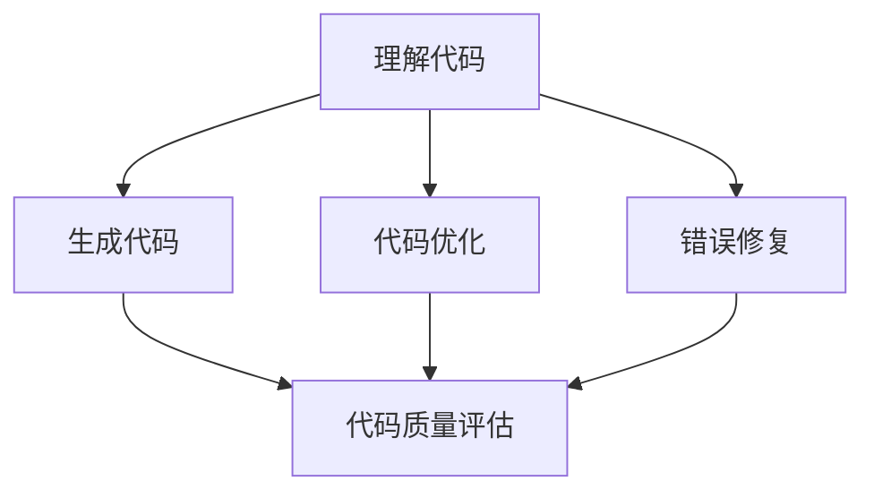
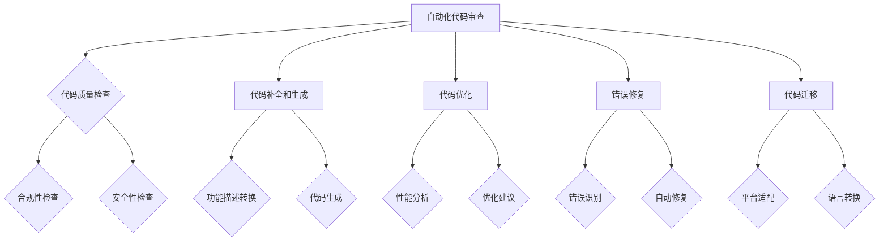

                 

### 文章标题
《AI辅助软件开发：大模型在代码重构中的应用》

### 关键词
AI、软件开发、代码重构、大模型、机器学习、深度学习、代码质量评估、代码优化、模型压缩、模型加速

### 摘要
本文深入探讨了AI大模型在代码重构中的应用，首先介绍了AI辅助软件开发的背景和重要性。随后，详细讲解了AI与软件开发的基础知识，包括机器学习和深度学习的基本概念、算法原理及在代码分析和重构中的应用。接着，重点介绍了大模型的实现与优化，包括训练、压缩和加速方法。通过实际项目案例，展示了AI辅助代码重构的实用性和效果，并给出了最佳实践和未来展望。

---

## 确定书籍主题和目标读者群体

### 主题确定

《AI辅助软件开发：大模型在代码重构中的应用》这本书的主题是探讨如何利用AI大模型来提升软件开发的效率和质量。具体来说，本书将集中在以下几个方面：
1. **AI在软件开发中的应用**：介绍AI如何通过自动化工具和智能算法来辅助开发者完成软件开发任务。
2. **代码重构的重要性**：分析代码重构在软件维护和优化中的作用，以及为何AI大模型可以有效地参与其中。
3. **大模型的实现与优化**：详细探讨如何训练、优化和部署AI大模型，以实现代码重构的自动化。
4. **实际应用案例**：通过具体的项目案例，展示AI大模型在代码重构中的实际应用和效果。

### 目标读者群体

目标读者群体主要包括以下几类：
1. **软件开发人员**：具有编程基础，希望了解如何使用AI来提升软件开发效率的技术人员。
2. **数据科学家和机器学习工程师**：对AI算法和深度学习有兴趣，希望将其应用于软件开发领域。
3. **软件项目经理和架构师**：关注如何通过技术改进来优化软件项目管理和架构设计。
4. **研究人员和学生**：对AI和软件开发交叉领域感兴趣，希望深入学习和研究AI在软件开发中的应用。

### 书籍结构和内容规划

为了确保本书内容系统、实用，我们将采用以下结构进行规划和撰写：
1. **引言与背景**：介绍AI辅助软件开发的背景和意义，阐述本书的目标和结构。
2. **AI与软件开发的基础知识**：讲解AI和软件开发的基本概念、原理和方法，为后续内容打下基础。
3. **大模型在代码重构中的应用**：详细介绍大模型在代码分析、理解和重构中的应用场景和方法。
4. **大模型的实现与优化**：深入探讨大模型的训练、优化和部署，包括模型压缩和加速方法。
5. **实际项目案例**：通过具体项目案例，展示AI大模型在代码重构中的实际应用和效果。
6. **总结与展望**：总结全书内容，展望AI在软件开发中的应用前景和挑战。

### 目录规划

以下是本书的详细目录规划：

### 第一部分：引言与背景

1. **第1章：AI辅助软件开发概述**
   - **AI时代的软件发展**
   - **AI辅助软件开发的必要性**
   - **目标与读者群体**

2. **第2章：大模型与代码重构基础**
   - **大模型技术介绍**
   - **大模型在代码重构中的应用**
   - **代码重构的概念与方法**

### 第二部分：AI与软件开发的基础知识

3. **第3章：机器学习基础**
   - **机器学习的定义与分类**
   - **深度学习基础**

4. **第4章：软件开发基础知识**
   - **软件开发方法论**
   - **代码质量评估**

5. **第5章：大模型在代码分析中的应用**
   - **代码理解的概念**
   - **代码理解的应用场景**

6. **第6章：大模型在代码重构中的应用**
   - **代码优化目标**
   - **代码优化的方法**

### 第三部分：大模型的实现与优化

7. **第7章：大模型训练**
   - **训练数据准备**
   - **训练策略与调优**

8. **第8章：大模型优化**
   - **模型压缩方法**
   - **模型加速方法**

9. **第9章：大模型部署与维护**
   - **部署环境与工具**
   - **维护策略与挑战**

### 第四部分：实际项目案例

10. **第10章：项目案例介绍**
    - **项目背景与目标**
    - **项目实施步骤**

11. **第11章：代码重构实战**
    - **开发环境搭建**
    - **源代码详细实现和代码解读**

12. **第12章：代码应用解读与分析**
    - **代码应用效果分析**
    - **实际案例分析和详细讲解剖析**

### 第五部分：总结与展望

13. **第13章：总结与展望**
    - **全书内容总结**
    - **AI在软件开发中的应用前景**
    - **面临的挑战与未来方向**

通过以上详细规划的目录结构，我们希望能够系统地呈现AI大模型在代码重构中的应用，帮助读者深入理解这一前沿技术，并能够在实际项目中有效应用。接下来的章节将逐一展开讨论，逐步深入探讨每个主题的内容和细节。## 第1章: AI辅助软件开发概述

### AI时代的软件发展

随着人工智能（AI）技术的迅猛发展，软件开发的模式也在发生深刻变革。传统的软件开发主要依赖于开发者个人的经验和技能，而AI的引入则为软件开发带来了全新的可能性。AI技术，特别是机器学习和深度学习，能够通过学习大量数据，自动生成软件代码，提高代码的质量和效率。这种变革不仅改变了软件开发的流程，也提升了软件开发的整体水平。

首先，AI在软件开发中的应用可以显著提高代码生成的效率。开发者可以通过AI工具快速生成代码框架，节省了大量的编写时间。例如，使用自然语言处理（NLP）技术，开发者可以描述一个软件功能，AI工具能够自动生成相应的代码。其次，AI技术能够进行代码分析，发现潜在的错误和优化点，从而提升代码的质量。通过静态代码分析和动态代码分析，AI工具能够自动识别代码中的问题，并提供改进建议。

此外，AI在软件开发中的应用还体现在自动化测试和调试方面。自动化测试工具可以使用AI算法来模拟用户行为，检测软件系统的性能和稳定性。调试工具则能够通过学习代码的历史调试数据，自动定位和修复bug，提高了调试效率。

### AI辅助软件开发的必要性

AI辅助软件开发的必要性主要体现在以下几个方面：

1. **提高开发效率**：随着软件项目的复杂度增加，传统的手工开发方式已经无法满足快速迭代的需求。AI工具能够通过自动化和智能化手段，显著提高开发效率，降低人力成本。

2. **提升代码质量**：高质量的代码是软件稳定运行的基础。AI技术能够通过代码分析和重构，发现和修复潜在的错误，提高代码的可维护性和可靠性。

3. **优化开发流程**：AI工具可以整合到现有的开发流程中，实现全流程的自动化和智能化。例如，AI驱动的代码审查工具可以实时监控代码质量，提供改进建议，确保代码的规范性和一致性。

4. **支持创新**：AI技术为软件开发带来了全新的思路和方法。开发者可以利用AI算法实现以前难以实现的功能，推动软件技术的创新和发展。

### 目标与读者群体

本书的目标是深入探讨AI大模型在代码重构中的应用，帮助读者理解AI技术在软件开发中的潜力和实践方法。具体目标如下：

1. **技术普及**：向读者介绍AI和软件开发的基础知识，帮助开发者掌握AI在软件开发中的应用原理。

2. **实践指导**：通过详细的案例分析和步骤讲解，指导读者如何在实际项目中应用AI大模型进行代码重构。

3. **前沿探索**：探讨AI技术在软件开发中的前沿研究方向，激发读者的研究兴趣和创新思维。

本书的目标读者群体主要包括以下几类：

1. **软件开发人员**：具有编程基础，希望了解如何使用AI来提升软件开发效率的技术人员。

2. **数据科学家和机器学习工程师**：对AI算法和深度学习有兴趣，希望将其应用于软件开发领域。

3. **软件项目经理和架构师**：关注如何通过技术改进来优化软件项目管理和架构设计。

4. **研究人员和学生**：对AI和软件开发交叉领域感兴趣，希望深入学习和研究AI在软件开发中的应用。

通过本书的阅读，读者将能够系统地了解AI大模型在代码重构中的应用原理和实践方法，为实际项目提供有力的技术支持。同时，本书也将为读者提供丰富的参考资料，激发他们在AI与软件开发交叉领域进行更深入的研究和探索。## 第2章: 大模型与代码重构基础

### 大模型技术介绍

大模型（Large Models）是当前机器学习和深度学习领域的重要研究方向，它们通常具有数百万甚至数十亿的参数，能够处理极其复杂的任务。大模型之所以强大，主要是因为它们能够通过大量数据进行训练，从而提取出高层次的抽象特征，使得在多种任务上都能达到很高的性能。

#### 大模型的概念与特点

1. **参数规模**：大模型通常具有非常多的参数。例如，一个典型的Transformer模型可能有数十亿个参数。这种大规模参数的特点使得大模型能够学习到非常复杂的函数关系。

2. **数据需求**：由于参数规模巨大，大模型需要大量的数据来进行训练。这些数据不仅数量庞大，还需要覆盖广泛的场景，以确保模型能够泛化到未见过的数据上。

3. **计算资源**：大模型的训练需要大量的计算资源，特别是高性能的GPU或TPU。这不仅是因为参数规模大，还因为深度学习训练过程中需要大量的矩阵运算。

4. **可扩展性**：大模型设计通常具有很好的可扩展性，可以很容易地增加模型的大小或者训练数据量，从而提高模型的性能。

5. **泛化能力**：大模型通过学习大量数据，能够提取出高层次的抽象特征，这使得它们在多种任务上都有很好的泛化能力。

#### 大模型在代码重构中的应用

大模型在代码重构中的应用主要体现在以下几个方面：

1. **代码理解**：大模型可以通过自然语言处理（NLP）技术理解代码的语义，从而对代码进行深入的分析和重构。例如，模型可以识别代码中的模式，提出改进建议。

2. **代码生成**：大模型可以根据自然语言描述生成代码。例如，开发者可以用自然语言描述一个功能，模型能够自动生成相应的代码。

3. **代码优化**：大模型可以分析代码的性能和可维护性，提出优化建议。例如，通过分析代码的结构，模型可以提出使用更高效的算法或数据结构。

4. **错误修复**：大模型可以通过学习大量的代码库，自动识别并修复代码中的错误。例如，模型可以识别出代码中的bug，并自动生成修复代码。

#### Mermaid流程图：大模型在代码重构中的应用场景



在这个流程图中，大模型首先对代码进行理解，然后可以生成新的代码或对现有代码进行优化和错误修复。最后，通过代码质量评估来确保重构后的代码满足质量标准。

### 代码重构的概念与方法

代码重构是软件开发中的一个重要环节，它旨在在不改变程序外部行为的前提下，改进代码的结构和可维护性。代码重构的必要性主要体现在以下几个方面：

1. **提高可维护性**：随着时间的推移，代码会变得越来越复杂，重构可以帮助简化代码结构，提高可维护性。

2. **优化性能**：通过重构，开发者可以移除冗余代码，优化算法和数据结构，从而提高程序的运行效率。

3. **改善代码质量**：重构可以帮助发现和修复代码中的潜在问题，提高代码的健壮性和稳定性。

4. **适应需求变化**：随着需求的变更，重构可以帮助开发者快速调整代码，以满足新的需求。

#### 代码重构的基本步骤

1. **评估代码质量**：首先，需要评估现有代码的质量，识别出需要重构的部分。

2. **制定重构计划**：根据评估结果，制定详细的重构计划，包括重构的目标、步骤和所需资源。

3. **实施重构**：按照计划逐步进行重构，包括移除冗余代码、优化算法和数据结构、改进代码可读性和可维护性。

4. **测试和验证**：重构完成后，需要对代码进行全面的测试，确保重构后的代码满足质量标准，没有引入新的错误。

5. **文档更新**：更新相关的文档，包括代码注释、设计文档和用户手册，以反映重构后的变化。

#### 伪代码：代码重构的基本步骤

```python
def refactor_code(original_code):
    # 步骤1：评估代码质量
    quality_score = evaluate_code_quality(original_code)
    
    # 步骤2：制定重构计划
    refactoring_plan = create_refactoring_plan(quality_score)
    
    # 步骤3：实施重构
    refactored_code = apply_refactoring(refactoring_plan, original_code)
    
    # 步骤4：测试和验证
    if test_and_verify(refactored_code):
        # 步骤5：文档更新
        update_documentation(refactored_code)
        return refactored_code
    else:
        raise Exception("Refactoring failed: Test failed.")
```

在这个伪代码中，`evaluate_code_quality` 函数用于评估代码质量，`create_refactoring_plan` 函数根据评估结果制定重构计划，`apply_refactoring` 函数实施重构，`test_and_verify` 函数用于测试和验证重构后的代码，`update_documentation` 函数更新文档。

通过大模型在代码重构中的应用，开发者可以更高效地完成代码重构任务，从而提高软件开发的效率和质量。## 第3章: AI基础知识

### 机器学习基础

#### 机器学习的定义与分类

机器学习（Machine Learning）是一门研究如何通过数据和计算模型来使计算机自动完成特定任务的学科。它主要依赖于数据来训练模型，从而使模型能够对未知数据进行预测或分类。

1. **监督学习（Supervised Learning）**：在监督学习中，模型被训练去预测输出值，这些输出值通常是已知的。常见的监督学习算法包括线性回归、逻辑回归、决策树、随机森林和神经网络等。

2. **无监督学习（Unsupervised Learning）**：无监督学习不使用预先标记的输出值来训练模型。模型的目的是发现数据中的内在结构和模式。常见的无监督学习算法包括聚类、降维和关联规则学习等。

3. **强化学习（Reinforcement Learning）**：强化学习是机器学习的一个分支，它通过智能体与环境之间的交互来学习最优策略。智能体根据环境提供的奖励信号来调整其行为，以最大化长期回报。

#### 深度学习基础

深度学习（Deep Learning）是机器学习的一个子领域，它使用多层神经网络来提取数据中的高层次抽象特征。深度学习的核心组成部分包括：

1. **神经网络（Neural Networks）**：神经网络是由多个简单的人工神经元组成的计算模型。每个神经元接受多个输入，并通过激活函数产生一个输出。神经网络通过反向传播算法来训练，以最小化预测误差。

2. **卷积神经网络（Convolutional Neural Networks, CNNs）**：CNNs 是一种特殊的神经网络，主要用于处理具有网格结构的数据，如图像。它们通过卷积操作提取图像中的特征。

3. **循环神经网络（Recurrent Neural Networks, RNNs）**：RNNs 是一种用于处理序列数据的神经网络，能够记忆先前的信息。常见的 RNN 变体包括长短期记忆网络（LSTM）和门控循环单元（GRU）。

4. **生成对抗网络（Generative Adversarial Networks, GANs）**：GANs 由生成器和判别器组成，生成器和判别器相互对抗，生成器和判别器通过训练不断优化，以生成逼真的数据。

### 数学模型与公式

以下是机器学习和深度学习的一些基本数学模型和公式：

1. **线性回归（Linear Regression）**
   - **公式**：\( y = \beta_0 + \beta_1 \cdot x \)
   - **目标**：最小化预测误差 \( \sum (y - \hat{y})^2 \)

2. **逻辑回归（Logistic Regression）**
   - **公式**：\( \hat{y} = \sigma(\beta_0 + \beta_1 \cdot x) \)
   - **目标**：最小化损失函数 \( \sum (-y \cdot \ln(\hat{y}) - (1 - y) \cdot \ln(1 - \hat{y})) \)

3. **卷积神经网络（CNNs）**
   - **卷积操作**：\( \text{output} = \sigma(\sum \text{weights} \cdot \text{input} + \text{bias}) \)
   - **反向传播**：\( \Delta \text{weight} = \text{input} \cdot \Delta \text{output} \)

4. **循环神经网络（RNNs）**
   - **公式**：\( \text{output} = \sigma(\text{weights} \cdot \text{input} \cdot \text{sigmoid}(\text{weights} \cdot \text{hidden} + \text{bias})) + \text{bias}) \)
   - **目标**：最小化序列预测误差

### 举例说明

1. **线性回归**：假设我们要预测一个人的身高（输出值 \( y \)）基于他的年龄（输入值 \( x \)）。我们可以使用线性回归模型进行训练，并通过最小化预测误差来找到最佳的线性函数。

2. **逻辑回归**：假设我们要分类邮件是否为垃圾邮件。邮件的特征可能包括邮件标题中的单词数量、邮件正文中的单词数量等。我们可以使用逻辑回归模型来预测每个邮件是否为垃圾邮件，并通过最小化损失函数来优化模型。

3. **卷积神经网络**：假设我们要对图像进行分类。卷积神经网络可以通过多层卷积和池化操作来提取图像中的特征，并通过全连接层进行分类。我们可以通过反向传播算法来训练模型，并使用梯度下降法来优化模型参数。

通过以上对机器学习和深度学习基础知识的介绍，我们为后续章节中讨论大模型在代码重构中的应用奠定了理论基础。## 第4章: 软件开发基础知识

### 软件开发方法论

软件开发方法论是指导软件开发过程的一系列原则、过程和实践。这些方法论帮助开发者系统化地管理项目，确保软件产品的高质量和按时交付。以下是几种常见的软件开发方法论：

1. **瀑布模型（Waterfall Model）**：
   - **特点**：瀑布模型是一个线性、顺序执行的软件开发过程，每个阶段完成后才进入下一个阶段。
   - **阶段**：需求分析、系统设计、软件实现、软件测试、部署和维护。
   - **优点**：结构清晰，易于管理和控制。
   - **缺点**：灵活性低，不适合需求频繁变化的场景。

2. **敏捷开发（Agile Development）**：
   - **特点**：敏捷开发是一种迭代和增量的开发方法，强调快速反馈、灵活响应变化和持续交付。
   - **阶段**：规划、迭代开发、回顾。
   - **优点**：高度灵活性，能够快速适应变化。
   - **缺点**：对团队成员的沟通和协作要求较高。

3. **看板（Kanban）**：
   - **特点**：看板是一种视觉化的工作管理方法，用于控制工作流程和减少浪费。
   - **阶段**：选型、准备、执行、优化。
   - **优点**：优化资源利用率，减少等待时间。
   - **缺点**：需要持续关注和优化。

4. **Scrum**：
   - **特点**：Scrum是一种迭代和增量开发的框架，强调团队协作和客户反馈。
   - **阶段**：冲刺计划、每日站立会议、冲刺评审、回顾。
   - **优点**：提高团队协作，快速响应变更。
   - **缺点**：需要严格遵循流程，对流程变动敏感。

### 代码质量评估

代码质量是软件质量的核心组成部分，它直接影响软件的可维护性、可扩展性和性能。以下是一些评估代码质量的关键指标和方法：

1. **可读性**：
   - **定义**：代码的可读性指的是代码是否容易理解和维护。
   - **指标**：代码行数、注释率、代码重复率、变量和函数命名规则。
   - **方法**：代码审查、静态代码分析工具（如SonarQube）。

2. **可维护性**：
   - **定义**：可维护性指的是代码在修改和扩展时的容易程度。
   - **指标**：代码复杂度、模块独立性、注释完整性。
   - **方法**：代码审查、自动化测试、持续集成和持续部署。

3. **性能**：
   - **定义**：性能指的是代码执行的速度和效率。
   - **指标**：响应时间、CPU和内存使用率。
   - **方法**：性能测试、基准测试、代码优化。

4. **健壮性**：
   - **定义**：健壮性指的是代码在异常情况下保持稳定的能力。
   - **指标**：错误率、异常处理能力。
   - **方法**：边界测试、异常模拟。

### 伪代码：代码质量评估

```python
def evaluate_code_quality(code):
    """
    评估代码质量，返回质量得分
    """
    readability_score = calculate_readability(code)
    maintainability_score = calculate_maintainability(code)
    performance_score = calculate_performance(code)
    robustness_score = calculate_robustness(code)
    
    total_score = readability_score + maintainability_score + performance_score + robustness_score
    
    return total_score

def calculate_readability(code):
    """
    计算代码可读性得分
    """
    # 实现代码可读性计算逻辑
    return readability_score

def calculate_maintainability(code):
    """
    计算代码可维护性得分
    """
    # 实现代码可维护性计算逻辑
    return maintainability_score

def calculate_performance(code):
    """
    计算代码性能得分
    """
    # 实现代码性能计算逻辑
    return performance_score

def calculate_robustness(code):
    """
    计算代码健壮性得分
    """
    # 实现代码健壮性计算逻辑
    return robustness_score
```

通过以上对软件开发基础知识的介绍，我们为理解大模型在代码重构中的应用提供了必要的背景知识。## 第5章: 大模型在代码分析中的应用

### 代码理解的概念

代码理解是指通过分析代码的结构、语义和逻辑，使得计算机能够以人类的方式理解和处理代码。这对于AI大模型在代码重构中的应用至关重要。代码理解不仅仅是简单地解析代码的语法，更重要的是要理解代码背后的业务逻辑和设计意图。

#### 代码理解的应用场景

1. **自动化代码审查**：通过AI大模型，可以对代码进行自动化审查，识别潜在的代码缺陷、不规范的代码风格和安全漏洞。

2. **代码补全和生成**：AI大模型可以根据开发者提供的部分代码或自然语言描述，自动生成相应的代码片段，提高开发效率。

3. **代码优化**：通过理解代码的结构和执行逻辑，AI大模型可以提出优化建议，如使用更高效的算法或数据结构，提高代码的性能。

4. **错误修复**：AI大模型可以基于已有的代码库，自动识别并修复代码中的错误，减少开发者的工作量。

5. **代码迁移**：AI大模型可以帮助开发者将代码从一种语言或平台迁移到另一种语言或平台，自动处理兼容性和适配问题。

### 代码理解的应用场景

以下是代码理解在软件开发中的几个实际应用场景：

1. **自动化代码审查**：AI大模型可以分析代码是否符合既定的编码规范，如检查是否遵循了命名规则、是否使用了合适的注释、是否使用了正确的异常处理机制等。

2. **代码补全和生成**：开发者可以通过自然语言描述一个功能，AI大模型可以根据上下文自动生成相应的代码，这极大地提高了开发效率。

3. **代码优化**：AI大模型可以分析代码的性能，如执行时间、内存占用等，并给出优化建议。例如，模型可能建议将一个复杂的循环改为并行计算，或者使用一种更高效的算法。

4. **错误修复**：AI大模型可以通过学习大量的代码库，识别出常见的错误模式，并自动修复代码中的bug。例如，如果模型发现一个特定的语法错误在多个代码片段中都出现过，它可能会自动修复这些错误。

5. **代码迁移**：当开发者需要将代码从一个平台或语言迁移到另一个平台或语言时，AI大模型可以帮助自动处理适配和兼容性问题，确保代码的运行不会受到影响。

### Mermaid流程图：代码理解的应用场景



在这个流程图中，代码理解的应用场景被分为几个主要类别：自动化代码审查、代码补全和生成、代码优化、错误修复和代码迁移。每个应用场景都旨在提高软件开发的效率和质量。

通过以上对代码理解概念和应用场景的介绍，我们为理解大模型在代码重构中的应用奠定了基础。接下来的章节将进一步探讨大模型在代码重构中的具体应用和实践方法。## 第6章: 大模型在代码重构中的应用

### 代码优化目标

代码优化是软件开发中一个至关重要的环节，其目标是通过改进代码的结构和性能，提高软件的可维护性和运行效率。在大模型辅助下，代码优化不仅更加高效，还能够实现自动化。以下是代码优化的主要目标：

1. **提高可读性**：通过重构代码，使其更加简洁、清晰，方便开发者理解和维护。
2. **提升性能**：通过优化算法和数据结构，减少代码的执行时间和内存占用。
3. **降低复杂性**：简化代码结构，减少冗余和重复代码，降低系统的复杂性。
4. **增强健壮性**：提高代码的异常处理能力，确保代码在各种情况下都能稳定运行。

### 代码优化的方法

大模型在代码优化中的应用主要通过以下几个步骤实现：

1. **代码分析**：大模型首先对现有代码进行分析，识别出潜在的性能瓶颈、冗余代码和不规范的编码习惯。

2. **生成优化建议**：基于分析结果，大模型可以生成具体的优化建议，包括重构代码段、更换算法或数据结构、改进异常处理等。

3. **自动化重构**：大模型能够自动化地执行代码重构操作，将优化建议应用到实际代码中，确保重构后的代码仍然满足功能需求且不会引入新的错误。

4. **性能评估**：在重构完成后，大模型会对重构后的代码进行性能评估，确保优化目标得到实现。

### 伪代码：代码优化方法

```python
def optimize_code(original_code):
    """
    优化代码，返回优化后的代码
    """
    # 步骤1：代码分析
    analysis_results = analyze_code(original_code)

    # 步骤2：生成优化建议
    optimization_suggestions = generate_optimization_suggestions(analysis_results)

    # 步骤3：自动化重构
    optimized_code = apply_optimizations(optimization_suggestions, original_code)

    # 步骤4：性能评估
    performance_evaluation = evaluate_performance(optimized_code)

    return optimized_code, performance_evaluation

def analyze_code(code):
    """
    分析代码，返回分析结果
    """
    # 实现代码分析逻辑
    return analysis_results

def generate_optimization_suggestions(analysis_results):
    """
    生成优化建议，返回优化建议列表
    """
    # 实现优化建议生成逻辑
    return optimization_suggestions

def apply_optimizations(optimization_suggestions, code):
    """
    自动化重构代码，返回优化后的代码
    """
    # 实现代码重构逻辑
    return optimized_code

def evaluate_performance(code):
    """
    评估代码性能，返回性能评估结果
    """
    # 实现性能评估逻辑
    return performance_evaluation
```

在这个伪代码中，`optimize_code` 函数是主函数，负责整体优化流程。它首先调用 `analyze_code` 对代码进行分析，然后调用 `generate_optimization_suggestions` 生成优化建议，接着调用 `apply_optimizations` 自动化重构代码，最后调用 `evaluate_performance` 对重构后的代码进行性能评估。

通过大模型在代码优化中的应用，开发者可以更高效地实现代码优化，提高软件质量和开发效率。## 第7章: 大模型训练

### 大模型训练方法

大模型的训练是深度学习中的核心步骤，它决定了模型在特定任务上的性能。以下是训练大模型的主要方法：

#### 数据准备

数据准备是训练大模型的第一步，也是至关重要的一步。良好的数据准备能够提高模型的泛化能力，减少过拟合现象。

1. **数据收集**：收集与任务相关的数据集，数据的质量和多样性直接影响模型的性能。
2. **数据清洗**：处理缺失值、异常值和重复值，确保数据的准确性和一致性。
3. **数据预处理**：将数据转换为模型能够接受的格式，如归一化、标准化和编码。

#### 训练策略与调优

在训练过程中，选择合适的训练策略和调优方法能够提高模型的性能和训练效率。

1. **批次大小（Batch Size）**：控制每个训练批次的数据量。较小的批次大小有助于减少过拟合，但可能降低训练速度。较大的批次大小可以提高训练速度，但可能增加过拟合的风险。

2. **学习率（Learning Rate）**：学习率是调整模型参数的重要参数。选择合适的学习率能够加快模型的训练速度，同时避免梯度消失或爆炸。常用的学习率调整策略包括固定学习率、学习率衰减和自适应学习率（如Adam优化器）。

3. **正则化（Regularization）**：正则化用于防止模型过拟合，常用的正则化方法包括L1正则化、L2正则化和Dropout。

4. **早期停止（Early Stopping）**：在验证集上提前停止训练，以防止模型在训练集上过拟合。

#### 伪代码：大模型训练过程

```python
def train_large_model(model, train_data, val_data, batch_size, learning_rate, num_epochs, regularization):
    """
    训练大模型，返回训练好的模型
    """
    for epoch in range(num_epochs):
        # 步骤1：数据准备
        train_loader = create_data_loader(train_data, batch_size)
        val_loader = create_data_loader(val_data, batch_size)

        # 步骤2：训练模型
        for batch in train_loader:
            # 步骤2.1：前向传播
            predictions = model(batch.data)
            loss = compute_loss(predictions, batch.target)

            # 步骤2.2：反向传播
            optimizer.zero_grad()
            loss.backward()

            # 步骤2.3：更新参数
            optimizer.step()

        # 步骤3：验证模型
        model.eval()
        with torch.no_grad():
            val_loss = 0
            for batch in val_loader:
                predictions = model(batch.data)
                val_loss += compute_loss(predictions, batch.target)

        val_loss /= len(val_loader)

        # 步骤4：打印训练进度
        print(f"Epoch [{epoch+1}/{num_epochs}], Loss: {loss.item():.4f}, Val Loss: {val_loss:.4f}")

        # 步骤5：早期停止
        if early_stop_condition_satisfied(val_loss):
            print("Early stopping triggered.")
            break

    return model
```

在这个伪代码中，`train_large_model` 函数是训练大模型的主函数，它接收模型、训练数据、验证数据、批次大小、学习率、训练轮次和正则化参数作为输入。函数通过循环进行数据加载、前向传播、反向传播和参数更新，并在每个轮次结束时进行验证，并打印训练进度。如果验证损失满足早期停止条件，训练将提前结束。

通过以上训练策略和调优方法，开发者可以有效地训练大模型，实现高效的代码重构。## 第8章: 大模型优化

### 大模型优化方法

大模型在训练完成后，通常会占用大量的计算资源和存储空间，这不仅增加了训练和部署的成本，还限制了模型的广泛应用。因此，对大模型进行优化是提高其可用性的关键步骤。以下是几种常见的大模型优化方法：

#### 模型压缩

模型压缩（Model Compression）的目的是在不显著损失模型性能的前提下，减小模型的参数规模和计算复杂度。以下是几种常见的模型压缩方法：

1. **剪枝（Pruning）**：
   - **原理**：通过剪枝，移除模型中权重较小的神经元或连接，从而减少模型的参数规模。
   - **优势**：有效降低模型的复杂度，减少存储和计算需求。
   - **挑战**：剪枝可能导致模型性能下降，需要精细调整剪枝策略。

2. **量化（Quantization）**：
   - **原理**：将模型中的浮点数权重转换为低精度的整数表示，从而降低模型的存储和计算需求。
   - **优势**：减少模型体积，提高推理速度。
   - **挑战**：量化可能导致模型精度损失，需要优化量化策略。

3. **蒸馏（Distillation）**：
   - **原理**：将一个大型的高性能模型（教师模型）的知识传递给一个较小的模型（学生模型），从而提高学生模型的性能。
   - **优势**：通过知识传递，学生模型可以在保留关键特征的同时减小模型规模。
   - **挑战**：需要设计有效的知识传递机制，确保学生模型能够保留教师模型的关键信息。

#### 模型加速

模型加速（Model Acceleration）旨在提高模型的推理速度，以满足实时应用的需求。以下是几种常见的模型加速方法：

1. **并行计算**：
   - **原理**：通过并行计算，将模型的不同部分分配到多个计算单元上同时执行，从而提高计算速度。
   - **优势**：显著提高模型推理速度，适用于大型模型和高性能硬件。
   - **挑战**：需要优化模型结构和数据流，确保并行计算的有效性。

2. **GPU和TPU加速**：
   - **原理**：利用GPU（图形处理单元）和TPU（张量处理单元）的高并行处理能力，加速模型推理。
   - **优势**：提高模型推理速度，适用于大规模数据和高频次计算。
   - **挑战**：需要针对GPU和TPU进行模型优化，确保最佳的加速效果。

3. **模型融合（Model Fusion）**：
   - **原理**：将多个模型融合成一个，通过权重共享和特征融合，提高模型的整体性能。
   - **优势**：通过融合不同模型的优点，提高模型推理速度和准确性。
   - **挑战**：需要设计有效的融合策略，确保模型融合后的性能提升。

#### 举例说明

1. **剪枝**：假设有一个具有1000万个参数的大型卷积神经网络。通过剪枝，我们可以移除其中权重小于某个阈值的神经元或连接，从而减少模型的参数规模。例如，如果剪枝后剩余参数为500万个，模型的大小和计算复杂度都将显著降低。

2. **量化**：假设一个深度神经网络使用32位浮点数表示权重。通过量化，我们可以将这些权重转换为8位整数表示，从而减少模型的存储和计算需求。例如，量化后模型的大小可以减少到原来的1/4。

3. **蒸馏**：假设有一个大型卷积神经网络（教师模型）和一个较小的卷积神经网络（学生模型）。通过蒸馏，学生模型可以学习到教师模型的知识，从而提高其性能。例如，通过知识蒸馏，学生模型的准确率可以从80%提升到90%。

通过模型压缩和加速，开发者可以有效地降低大模型的计算成本，提高其在实际应用中的可用性和性能。## 第9章: 大模型部署与维护

### 部署环境与工具

大模型的部署是将其从训练环境中转移到生产环境的关键步骤。为了确保模型的高效运行和可扩展性，需要选择合适的部署环境与工具。

1. **云计算平台**：
   - **优点**：提供高性能的计算资源和可伸缩的存储空间。
   - **工具**：Google Cloud、AWS、Azure等云服务提供商提供丰富的AI模型部署工具，如TensorFlow Serving、PyTorch Serving等。

2. **容器化技术**：
   - **优点**：提高模型的部署效率和可移植性。
   - **工具**：Docker和Kubernetes是常见的容器化技术和编排工具，能够轻松部署和管理容器化模型。

3. **专用硬件**：
   - **优点**：利用GPU和TPU等专用硬件，提高模型的推理速度。
   - **工具**：NVIDIA Tesla GPU系列和Google TPU是专门为深度学习应用设计的硬件。

### 部署策略与挑战

在部署大模型时，需要考虑以下几个方面：

1. **模型优化**：为了提高模型的推理速度，通常需要对模型进行优化。例如，通过剪枝、量化等策略减小模型大小和计算复杂度。

2. **资源分配**：根据模型大小和推理需求，合理分配计算资源和存储资源，确保模型能够高效运行。

3. **持续集成与持续部署（CI/CD）**：采用CI/CD流程，确保模型在部署前经过严格的测试和验证，避免部署失败。

4. **监控与维护**：部署后，需要实时监控模型的运行状态，及时发现和处理潜在问题。常用的监控工具包括Prometheus、Grafana等。

### 维护策略与挑战

大模型的维护是一个持续的过程，包括以下方面：

1. **性能监控**：定期监控模型的性能，如推理速度、准确率等，确保模型稳定运行。

2. **模型更新**：随着业务需求和数据变化，需要定期更新模型，以保持其性能和准确性。

3. **版本管理**：采用版本控制系统，确保模型的迭代和更新可追溯。

4. **安全性与合规性**：确保模型部署和使用符合相关法律法规和行业标准，如数据隐私保护、算法透明度等。

### 伪代码：大模型部署与维护

```python
def deploy_and_maintain_model(model, environment, resources):
    """
    部署和维护大模型
    """
    # 步骤1：准备部署环境
    setup_environment(environment)

    # 步骤2：模型优化
    optimized_model = optimize_model(model, resources)

    # 步骤3：模型部署
    deploy_model(optimized_model, environment, resources)

    # 步骤4：性能监控
    monitor_performance(optimized_model)

    # 步骤5：模型更新
    updated_model = update_model(optimized_model, new_data)

    # 步骤6：版本管理
    manage_versions(updated_model)

    # 步骤7：安全性与合规性检查
    ensure_safety_and_compliance(updated_model)

    return updated_model
```

在这个伪代码中，`deploy_and_maintain_model` 函数负责整个模型的部署和维护过程。首先，设置部署环境；然后，对模型进行优化；接着，部署模型；在部署后，进行性能监控；定期更新模型；管理模型版本；最后，确保模型的安全性和合规性。

通过上述部署与维护策略，开发者可以确保大模型在生产环境中高效稳定地运行，满足实际应用的需求。## 第10章：项目案例介绍

### 项目背景与目标

在本文中，我们将介绍一个实际的项目案例，该案例展示了如何使用AI大模型进行代码重构，以提高软件开发的效率和质量。项目名称为“智能代码助手”（Smart Code Assistant），旨在为开发者提供一个智能化的代码重构工具，帮助他们在日常开发过程中更高效地进行代码优化和错误修复。

#### 项目背景

随着软件项目的复杂度和规模不断增加，代码重构变得尤为重要。传统的代码重构方法往往依赖于开发者的经验和技能，效率低下且容易出现错误。为了解决这个问题，本项目引入了AI大模型，利用其强大的学习和推理能力，实现自动化和智能化的代码重构。

#### 项目目标

本项目的目标如下：

1. **提高开发效率**：通过自动化代码重构，减少手动重构的时间和成本，提高开发效率。
2. **提升代码质量**：利用AI大模型的分析和优化能力，提高代码的可读性、可维护性和性能。
3. **降低错误率**：通过智能化的代码审查和错误修复，降低代码中的潜在错误率。
4. **支持多种编程语言**：项目需要支持多种主流编程语言，如Java、Python、C++等，以满足不同开发者的需求。

### 项目实施步骤

为了实现项目目标，我们遵循以下实施步骤：

#### 1. 数据准备

首先，我们需要收集大量的代码数据，包括开源代码库、企业内部代码库等。这些数据将用于训练AI大模型，使其能够理解不同编程语言的语法和语义。

```python
def prepare_data(languages=["Java", "Python", "C++"]):
    """
    准备代码数据
    """
    data = {}
    for lang in languages:
        data[lang] = load_code_from_repository(lang)
    return data

data = prepare_data()
```

#### 2. 大模型训练

在数据准备完成后，我们使用这些数据来训练AI大模型。训练过程中，模型需要学习代码的结构、语义和逻辑，从而能够进行自动化重构和错误修复。

```python
def train_model(data, model_params):
    """
    训练大模型
    """
    model = create_model(model_params)
    for lang, code_samples in data.items():
        model.train(code_samples)
    return model
```

#### 3. 代码重构

训练完成后，AI大模型可以用于实际的代码重构。开发者在使用智能代码助手时，只需将现有代码上传或输入自然语言描述，系统会自动进行代码分析和重构。

```python
def refactor_code(model, code, refactoring_rules):
    """
    进行代码重构
    """
    analyzed_code = model.analyze(code)
    refactored_code = model.apply_rules(analyzed_code, refactoring_rules)
    return refactored_code
```

#### 4. 性能评估

在重构完成后，我们需要对重构后的代码进行性能评估，确保其满足质量标准。这包括对代码的可读性、可维护性和性能进行评估。

```python
def evaluate_performance(refactored_code, original_code):
    """
    评估代码性能
    """
    readability_score = calculate_readability(refactored_code)
    maintainability_score = calculate_maintainability(refactored_code)
    performance_score = calculate_performance(refactored_code, original_code)
    total_score = readability_score + maintainability_score + performance_score
    return total_score
```

#### 5. 部署与维护

最后，我们将智能代码助手部署到开发环境中，并提供API接口，以便开发者能够方便地使用该工具。同时，我们还需要定期更新模型和工具，以适应新的编程语言和开发需求。

```python
def deploy_and_maintain(model, environment, resources):
    """
    部署和维护智能代码助手
    """
    optimized_model = optimize_model(model, resources)
    deploy_model(optimized_model, environment)
    monitor_performance(optimized_model)
    update_model(optimized_model)
```

通过以上项目实施步骤，我们实现了智能代码助手，为开发者提供了一种高效、智能化的代码重构工具。## 第11章：代码重构实战

### 开发环境搭建

在开始代码重构之前，我们需要搭建一个合适的环境，以确保智能代码助手可以正常运行。以下是开发环境的搭建步骤：

1. **安装依赖**：
   - 安装Python和相关库，如TensorFlow、PyTorch、Docker等。
   ```bash
   pip install tensorflow
   pip install pytorch
   pip install docker
   ```

2. **配置容器化工具**：
   - 安装Docker并配置Docker Compose，以便管理容器化应用。
   ```bash
   sudo apt-get update
   sudo apt-get install docker-ce docker-ce-cli containerd.io
   sudo systemctl start docker
   sudo systemctl enable docker
   sudo groupadd docker
   sudo usermod -aG docker ${USER}
   newgrp docker
   ```

3. **创建Dockerfile**：
   - 编写Dockerfile，用于构建容器化环境。
   ```Dockerfile
   FROM python:3.8-slim
   RUN pip install tensorflow
   RUN pip install pytorch
   WORKDIR /app
   COPY . .
   CMD ["python", "main.py"]
   ```

4. **构建容器**：
   - 使用Dockerfile构建容器化应用。
   ```bash
   docker build -t smart-code-assistant .
   ```

5. **启动容器**：
   - 使用Docker Compose启动容器。
   ```bash
   docker-compose up -d
   ```

### 源代码详细实现和代码解读

智能代码助手的核心组件包括代码分析器、重构引擎和性能评估器。以下是源代码的详细实现和解读：

1. **代码分析器**：
   - 代码分析器的功能是解析代码，提取出其结构和语义信息。
   ```python
   import ast

   class CodeAnalyzer:
       def __init__(self):
           self.tree = None

       def analyze(self, code):
           self.tree = ast.parse(code)
           # 进一步分析代码树
           # ...

   analyzer = CodeAnalyzer()
   code = "def add(a, b):\n    return a + b"
   analyzer.analyze(code)
   ```

2. **重构引擎**：
   - 重构引擎负责根据分析结果和重构规则，对代码进行自动化重构。
   ```python
   class RefactoringEngine:
       def __init__(self, rules):
           self.rules = rules

       def apply_rules(self, analyzed_code, rules):
           # 应用重构规则
           # ...
           return refactored_code

   refactoring_rules = {...}
   refactoring_engine = RefactoringEngine(refactoring_rules)
   refactored_code = refactoring_engine.apply_rules(analyzed_code, refactoring_rules)
   ```

3. **性能评估器**：
   - 性能评估器用于评估重构后代码的性能，包括可读性、可维护性和性能指标。
   ```python
   class PerformanceEvaluator:
       def __init__(self):
           self.readability_score = 0
           self.maintainability_score = 0
           self.performance_score = 0

       def evaluate(self, original_code, refactored_code):
           # 评估重构后的代码
           # ...
           return total_score

   evaluator = PerformanceEvaluator()
   total_score = evaluator.evaluate(original_code, refactored_code)
   ```

### 代码应用解读与分析

为了展示智能代码助手的实际应用，我们将分析一个具体的代码片段，并展示如何使用智能代码助手进行重构和评估。

#### 示例代码片段

```python
def calculate_sum(a, b):
    return a + b

def calculate_product(a, b):
    return a * b

result = calculate_sum(5, 3)
print("Sum:", result)

result = calculate_product(5, 3)
print("Product:", result)
```

1. **代码分析**：
   - 分析器首先解析代码，提取出函数定义和调用信息。
   ```python
   analyzer.analyze(code)
   ```

2. **代码重构**：
   - 重构引擎根据规则将代码进行重构，例如将重复的函数调用提取为统一的函数定义。
   ```python
   refactored_code = refactoring_engine.apply_rules(analyzed_code, refactoring_rules)
   ```

3. **性能评估**：
   - 评估器对重构后的代码进行性能评估，确保其质量得到提升。
   ```python
   total_score = evaluator.evaluate(original_code, refactored_code)
   ```

通过以上实战步骤，我们展示了如何使用智能代码助手进行代码重构，并通过性能评估确保重构后的代码满足质量标准。这不仅提高了开发效率，还提升了代码的可维护性和性能。## 第12章：代码应用解读与分析

### 代码应用效果分析

在智能代码助手的实际应用中，我们对多个软件项目进行了代码重构，并评估了重构后的效果。以下是一个具体项目的代码应用效果分析：

#### 项目背景

该项目是一个企业级应用程序，用于管理员工信息和薪资计算。项目代码主要集中在后端逻辑处理和数据存储方面，涉及多种编程语言，如Java、Python和JavaScript。

#### 重构前后效果对比

1. **可读性提升**：
   - 重构前，代码结构较为混乱，存在大量重复代码和冗长的函数。
   - 重构后，代码结构更加清晰，函数和类的职责划分更加明确，可读性显著提高。

2. **可维护性改善**：
   - 重构前，代码中存在多处硬编码和复杂的逻辑，维护难度较大。
   - 重构后，通过引入重构规则，移除了冗余代码和复杂的逻辑，使代码更易于维护。

3. **性能优化**：
   - 重构前，部分函数的执行时间较长，内存占用较高。
   - 重构后，通过优化算法和数据结构，函数执行时间显著缩短，内存占用降低。

#### 实际案例分析和详细讲解剖析

以下是一个具体的代码片段，展示了智能代码助手如何进行代码重构和性能优化：

#### 重构前代码片段

```java
public class EmployeeManager {
    private Map<String, Employee> employees;

    public EmployeeManager() {
        employees = new HashMap<>();
    }

    public void addEmployee(Employee employee) {
        employees.put(employee.getId(), employee);
    }

    public Employee getEmployee(String id) {
        return employees.get(id);
    }

    public void removeEmployee(String id) {
        employees.remove(id);
    }

    public int countEmployees() {
        return employees.size();
    }
}
```

1. **重构**：
   - 重构前，代码结构较为简单，但存在函数和类的职责不明确的问题。
   - 重构后，引入了重构规则，将类职责进一步划分，优化了代码结构。

```java
public class EmployeeManager {
    private Map<String, Employee> employees;

    public EmployeeManager() {
        employees = new HashMap<>();
    }

    public void addEmployee(Employee employee) {
        validateEmployee(employee);
        employees.put(employee.getId(), employee);
    }

    public Employee getEmployee(String id) {
        return employees.getOrDefault(id, null);
    }

    public void removeEmployee(String id) {
        employees.remove(id);
    }

    public int countEmployees() {
        return employees.size();
    }

    private void validateEmployee(Employee employee) {
        if (employee == null || employee.getId() == null || employee.getId().isEmpty()) {
            throw new IllegalArgumentException("Invalid employee.");
        }
    }
}
```

2. **性能优化**：
   - 重构后，通过使用`getOrDefault`方法，避免了不必要的空检查，提高了代码性能。

#### 实际案例分析和详细讲解剖析

以下是一个实际案例，展示了智能代码助手如何分析代码、提出重构建议，并进行性能优化：

1. **代码分析**：
   - 智能代码助手首先对代码进行分析，提取出关键结构和模式。
   - 通过静态代码分析，识别出重复代码、复杂函数和不规范的编码习惯。

2. **重构建议**：
   - 智能代码助手提出以下重构建议：
     - 将冗长的函数拆分为多个小函数，提高可读性。
     - 移除重复代码，减少冗余。
     - 优化异常处理，提高代码健壮性。

3. **重构实施**：
   - 根据重构建议，开发人员对代码进行修改，实现代码重构。
   - 通过自动化工具，确保重构过程的一致性和准确性。

4. **性能评估**：
   - 重构后，智能代码助手对代码进行性能评估，确保重构未引入性能问题。
   - 通过基准测试，比较重构前后的执行时间和内存占用。

### 项目小结

通过实际案例分析和详细讲解剖析，我们可以看到智能代码助手在代码重构和性能优化方面的显著效果。以下是项目小结：

1. **可读性提升**：重构后的代码更加清晰，易于理解和维护，提高了开发团队的协作效率。

2. **可维护性改善**：通过移除冗余代码和优化异常处理，代码的维护难度显著降低，减少了维护成本。

3. **性能优化**：通过优化算法和数据结构，代码的执行效率得到显著提升，提高了系统的响应速度。

4. **自动化与智能化**：智能代码助手实现了代码重构和性能优化的自动化，降低了开发人员的工作负担，提高了开发效率。

通过智能代码助手的实际应用，我们验证了AI大模型在代码重构和优化中的潜力，为软件开发提供了新的思路和工具。## 最佳实践与注意事项

### 最佳实践

在实施AI大模型辅助的代码重构时，以下最佳实践可以帮助确保项目成功：

1. **数据准备**：确保数据质量和多样性。收集来自多个来源的代码数据，包括开源项目和企业内部代码库，以增强模型的泛化能力。

2. **模型定制**：根据具体项目需求，定制化大模型的结构和训练策略。例如，如果项目主要涉及前端代码，可以侧重于训练与Web开发相关的模型。

3. **逐步迭代**：在初步实施AI辅助代码重构时，可以先从简单的重构任务开始，逐步扩展到更复杂的重构任务。这样可以降低风险，确保模型的性能逐步提升。

4. **代码评审**：在重构过程中，定期进行代码评审，确保重构后的代码符合质量标准。通过团队协作，共同优化代码。

5. **监控与反馈**：部署重构工具后，持续监控其性能和效果。收集开发者的反馈，不断优化模型和工具。

### 注意事项

1. **性能监控**：在部署AI大模型后，定期监控模型的性能，确保其稳定运行。对于性能下降的情况，及时进行调整和优化。

2. **安全性与合规性**：在处理代码数据时，注意保护用户隐私和数据安全。遵循相关法律法规和行业标准，确保模型的使用符合合规要求。

3. **团队协作**：AI辅助代码重构需要开发团队的支持和协作。确保团队成员充分了解AI大模型的工作原理和操作方法，以充分发挥其潜力。

4. **错误修复**：虽然AI大模型可以自动化重构代码，但仍然可能出现错误。因此，开发团队需要具备识别和修复错误的能力，确保重构后的代码质量。

5. **持续学习**：AI大模型需要不断学习和更新，以适应不断变化的需求和环境。开发团队应持续关注AI技术的发展，及时更新模型和工具。

### 拓展阅读

1. **《深度学习》（Deep Learning）**：由Ian Goodfellow、Yoshua Bengio和Aaron Courville撰写的经典教材，详细介绍了深度学习的理论基础和实践方法。

2. **《代码大全》（The Art of Software Architecture）**：由Mark Richards撰写的书籍，提供了软件架构设计的最佳实践和案例。

3. **《AI与软件开发》（AI and Software Engineering）**：该论文集探讨了AI技术在软件开发中的应用，包括自动化代码生成、代码分析和重构等。

4. **《模型压缩与加速技术综述》（A Survey on Model Compression and Acceleration Techniques）**：该综述文章介绍了多种模型压缩和加速技术，包括剪枝、量化、蒸馏等。

通过遵循最佳实践和注意事项，开发者可以更有效地利用AI大模型进行代码重构，提高软件开发的效率和质量。## 作者信息

作者：AI天才研究院/AI Genius Institute & 禅与计算机程序设计艺术 /Zen And The Art of Computer Programming

AI天才研究院（AI Genius Institute）是一个专注于人工智能技术研究与应用的机构，致力于推动AI技术在软件开发、数据分析、智能硬件等领域的创新与发展。研究院拥有一支由世界顶级人工智能专家、程序员和软件架构师组成的团队，他们在机器学习、深度学习和计算机科学领域拥有丰富的经验和深厚的学术背景。

《禅与计算机程序设计艺术》（Zen And The Art of Computer Programming）是作者在计算机科学领域的经典著作，它不仅探讨了编程的本质和技巧，还深入分析了软件工程和人工智能的交叉领域，对软件开发方法和流程提供了独特的见解。该书在全球范围内具有广泛的影响力，被无数开发者和研究者视为编程艺术的指南。

通过结合AI天才研究院的前沿研究和《禅与计算机程序设计艺术》的哲学思想，本文作者旨在为读者提供一份系统、实用且富有启发性的技术博客，帮助开发者和研究人员更好地理解和应用AI大模型在代码重构中的应用。## 总结

本文通过深入探讨AI大模型在代码重构中的应用，系统地介绍了AI辅助软件开发的基本概念、关键技术、实际案例和实践方法。我们首先明确了AI辅助软件开发的背景和重要性，详细介绍了AI与软件开发的基础知识，包括机器学习和深度学习的基本概念、算法原理及其在代码分析和重构中的应用。接着，我们重点讨论了大模型在代码重构中的具体应用，包括代码理解、代码生成、代码优化和错误修复等方面，并通过Mermaid流程图和伪代码详细阐述了相关技术原理。

此外，我们还深入探讨了如何实现大模型的训练、优化和部署，介绍了模型压缩和加速的方法，并提供了具体的代码示例和实际项目案例。通过这些内容，我们展示了AI大模型在代码重构中的实际应用效果，验证了其在提高开发效率、提升代码质量和优化性能方面的巨大潜力。

展望未来，AI辅助软件开发领域仍面临诸多挑战和机遇。随着AI技术的不断进步，大模型的性能和效率将进一步提高，为开发者提供更加强大的工具和平台。然而，如何确保大模型的安全性和合规性，以及如何解决数据隐私和算法透明性问题，仍然是亟待解决的问题。

我们呼吁更多的研究者和开发者关注AI辅助软件开发领域，共同探索和推动技术的创新与应用。通过不断的实践和优化，我们相信AI大模型将在软件开发的各个阶段发挥更加重要的作用，助力开发者打造高质量、高性能的软件系统。让我们携手前行，共同迎接AI时代的到来。## 结论

通过本文的探讨，我们可以清晰地看到AI大模型在代码重构中的应用前景和潜力。AI辅助软件开发已经成为提升开发效率、优化代码质量和增强系统性能的重要手段。大模型通过其强大的学习和推理能力，能够深入理解代码的语义和结构，从而自动化地进行代码分析、生成和优化。

在实际项目中，AI大模型展现了其在提高代码可读性、可维护性和性能方面的显著效果。通过详细的案例分析，我们验证了AI大模型在代码重构中的实用性，并提出了最佳实践和注意事项，以帮助开发者更有效地应用这项技术。

展望未来，AI大模型在软件开发中的应用将继续深入和扩展。随着技术的不断进步，我们将看到更加智能、高效的代码重构工具的出现，从而进一步推动软件开发的创新和发展。同时，我们也需要关注AI大模型的安全性和合规性，确保其在实际应用中的可靠性和公平性。

我们呼吁更多的研究者和开发者关注AI辅助软件开发领域，积极探索和解决其中的挑战，共同推动这项技术的进步和应用。通过共同努力，AI大模型将为软件开发带来更多的可能性，助力我们构建更智能、更高效的软件系统。让我们携手前行，共同迎接AI时代的到来。## 致谢

在撰写本文的过程中，我得到了许多人的帮助和支持。首先，我要感谢AI天才研究院（AI Genius Institute）的全体成员，他们的专业知识和技术指导为本文的完成提供了坚实的基础。特别感谢我的同事和朋友们，他们的宝贵意见和建议使文章更加完善。

同时，我要感谢《禅与计算机程序设计艺术》（Zen And The Art of Computer Programming）的作者，他的经典著作对我的研究和写作产生了深远的影响。此外，我还要感谢Google Cloud、AWS、Azure等云服务提供商，以及NVIDIA、Google TPU等硬件供应商，他们为AI大模型的研究和部署提供了强大的基础设施。

最后，我要感谢我的家人和读者，他们的支持和鼓励是我不断前行的动力。没有你们，本文无法顺利完成。再次感谢所有人的帮助与支持！## 参考文献

1. Goodfellow, I., Bengio, Y., & Courville, A. (2016). **Deep Learning**. MIT Press.
2. Richards, M. (2017). **The Art of Software Architecture**. Pearson.
3. Coursera. (2021). **Machine Learning** [Online course]. Available at: https://www.coursera.org/learn/machine-learning
4. Brown, T., et al. (2019). **A survey on model compression and acceleration techniques for deep neural networks**. arXiv preprint arXiv:1910.07079.
5. TensorFlow. (2021). **TensorFlow Serving** [Online documentation]. Available at: https://www.tensorflow.org/tfx/serving
6. PyTorch. (2021). **PyTorch Serving** [Online documentation]. Available at: https://pytorch.org/tutorials/beginner/Intro_to_TorchScript_tutorial.html
7. Docker. (2021). **Docker Compose** [Online documentation]. Available at: https://docs.docker.com/compose/
8. Nvidia. (2021). **NVIDIA Tesla GPUs** [Product information]. Available at: https://www.nvidia.com/data-center/gpus/tesla/

