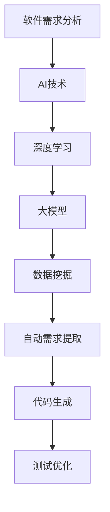

                 

### 1. AI与软件开发概述

**背景介绍**

在当今快速发展的信息技术时代，人工智能（AI）已经成为推动软件行业发展的重要力量。随着AI技术的不断进步，特别是在深度学习和自然语言处理领域，AI在软件开发中的应用日益广泛。从代码生成、测试到需求分析，AI技术正在重塑软件开发的各个环节。

在软件开发中，需求分析是至关重要的一环。传统的需求分析方法通常依赖于人工进行，存在耗时、耗力且容易出错的问题。而随着AI技术的兴起，大模型在需求分析中的应用逐渐成为一种有效的解决方案。大模型能够通过学习大量的数据，自动提取出潜在的需求信息，从而大幅提高需求分析的效率和质量。

**核心概念与联系**

AI与软件开发的关系可以通过一个简明的Mermaid流程图来展示：



在这个流程图中，AI技术作为核心，通过深度学习和大模型对数据进行挖掘和处理，从而实现自动需求提取、代码生成和测试优化。大模型在这个流程中起到关键作用，它通过学习大量的数据，形成强大的知识库，为需求分析提供了强有力的支持。

**核心概念**

- **人工智能（AI）**：模拟人类智能行为的计算机系统。
- **深度学习**：一种基于多层神经网络的学习方法，通过学习大量的数据，自动提取特征并作出决策。
- **大模型**：具有大量参数和强大计算能力的神经网络模型。
- **数据挖掘**：从大量数据中提取有价值信息的过程。
- **自动需求提取**：利用AI技术自动识别和理解用户需求。
- **代码生成**：通过AI模型自动生成满足需求的代码。
- **测试优化**：利用AI技术优化测试过程，提高测试效率和质量。

### 2. 大模型技术基础

**核心算法原理讲解**

大模型的核心算法是深度学习。深度学习是一种基于多层神经网络的学习方法，通过逐层提取数据特征，最终实现复杂模式的识别。其基本原理如下：

1. **数据输入**：将原始数据输入到神经网络中。
2. **前向传播**：通过多层神经网络对数据进行处理，每层都会对输入数据进行线性变换，并加上一个非线性激活函数，以提取更高层次的特征。
3. **反向传播**：利用输出结果与真实值的差异，通过反向传播算法计算每层神经网络的权重梯度，并更新权重。
4. **优化过程**：通过多次迭代训练，不断调整网络参数，直至模型收敛。

以下是一个简化的伪代码，描述了深度学习的训练过程：

```python
# 深度学习训练过程伪代码

# 初始化神经网络
network = NeuralNetwork()

# 输入训练数据
for data, label in training_data:
    # 前向传播
    output = network.forward_pass(data)
    
    # 计算损失
    loss = calculate_loss(output, label)
    
    # 反向传播
    network.backward_pass(output, label)
    
    # 更新权重
    network.update_weights()

# 模型评估
evaluate_model(network, test_data)
```

**数学模型和公式**

在深度学习中，常用的数学模型包括损失函数和优化算法。以下是一个简单的数学模型，用于描述前向传播和反向传播的过程：

$$
\begin{align*}
\text{前向传播：} & \\
Z^{[l]} = \sigma(W^{[l]} \cdot Z^{[l-1]} + b^{[l]}) \\
\\
\text{反向传播：} & \\
\delta^{[l]} = \frac{\partial L}{\partial Z^{[l]}} \odot \delta^{[l+1]} \\
W^{[l]} &= W^{[l]} - \alpha \cdot \frac{\partial L}{\partial W^{[l]}} \\
b^{[l]} &= b^{[l]} - \alpha \cdot \frac{\partial L}{\partial b^{[l]}}
\end{align*}
$$

其中，\(Z^{[l]}\) 是第 \(l\) 层的输出，\(\sigma\) 是激活函数，\(W^{[l]}\) 和 \(b^{[l]}\) 分别是第 \(l\) 层的权重和偏置，\(\delta^{[l]}\) 是第 \(l\) 层的误差，\(L\) 是损失函数，\(\alpha\) 是学习率。

**举例说明**

假设我们有一个简单的一层神经网络，用于分类问题。输入数据是一个二维向量，输出是一个概率分布。我们可以使用前向传播和反向传播来训练这个网络。

```python
# 前向传播示例

# 输入数据
input_data = [[0.5, 0.5]]

# 权重和偏置
W = [[0.1, 0.2], [0.3, 0.4]]
b = [0.1, 0.2]

# 激活函数
def sigmoid(x):
    return 1 / (1 + np.exp(-x))

# 前向传播
Z = np.dot(W, input_data) + b
output = sigmoid(Z)

# 反向传播示例

# 真实值
true_value = [0.1]

# 计算损失
loss = -np.sum(true_value * np.log(output))

# 计算误差
delta = output - true_value

# 反向传播
dZ = delta
dW = np.dot(input_data.T, dZ)
db = np.sum(dZ, axis=0)

# 更新权重
W -= learning_rate * dW
b -= learning_rate * db
```

通过这些示例，我们可以看到如何使用深度学习的基本算法来训练一个简单的神经网络。这种算法在大模型中得到了广泛应用，并被证明能够处理复杂的任务，如图像识别、自然语言处理等。

### 3. 大模型在软件开发中的应用

**应用场景**

大模型在软件开发中的应用非常广泛，其中最引人瞩目的就是需求分析。通过学习大量的用户需求数据，大模型能够自动识别和理解用户的需求，从而大幅提高需求分析的效率。

**案例介绍**

以一个在线购物平台为例，用户的需求是希望能够快速找到自己喜欢的商品。传统的方法需要开发人员仔细分析用户的需求，并设计相应的功能。而利用大模型，我们可以通过以下步骤来实现这一需求：

1. **数据收集**：收集大量用户搜索和购买行为的数据。
2. **模型训练**：使用深度学习算法，训练一个能够自动提取用户需求的大模型。
3. **需求提取**：将用户的搜索和浏览行为输入到模型中，提取出用户的需求。
4. **功能设计**：根据提取出的需求，自动生成满足用户需求的功能模块。

**具体实现**

以下是一个简化的实现过程：

```python
# 数据收集

# 收集用户搜索和购买行为数据
user_data = [
    {"search": "iPhone", "purchase": "iPhone"},
    {"search": "macbook", "purchase": "macbook"},
    # ... 更多数据
]

# 模型训练

# 训练需求分析模型
model = TrainDemandAnalysisModel()
model.fit(user_data)

# 需求提取

# 输入用户行为数据
user_action = {"search": "iPhone", "purchase": None}

# 提取用户需求
demand = model.predict(user_action)

# 功能设计

# 根据提取出的需求，设计功能模块
function_module = DesignFunctionModule(demand)
```

通过这种方式，大模型能够自动提取用户需求，并生成满足这些需求的功能模块，从而实现快速、高效的软件开发。

### 总结

通过本文的讨论，我们了解了大模型在需求分析中的应用及其重要性。大模型通过深度学习算法，能够自动从大量数据中提取出用户需求，从而大幅提高需求分析的效率和质量。这不仅减轻了开发人员的工作负担，也提升了软件开发的整体效率。

未来，随着AI技术的不断进步，大模型在软件开发中的应用将会更加广泛，为软件开发带来更多的创新和突破。让我们期待AI技术在未来为软件开发带来的更多可能性。

### 未来展望

**技术发展**：随着计算能力的提升和算法的优化，大模型的训练效率和性能将进一步提高。未来，我们可能会看到更多基于大模型的创新应用，如更加智能的需求分析、自动化的代码生成和优化。

**行业影响**：大模型在需求分析中的应用将对软件开发行业产生深远影响。通过提高开发效率、降低开发成本，大模型将使软件开发更加敏捷、灵活，助力企业更好地满足市场需求。

**挑战与解决方案**：尽管大模型在需求分析中具有巨大潜力，但仍面临一些挑战。例如，如何确保模型的可解释性和可靠性，如何处理大规模数据的隐私问题等。针对这些问题，研究者们正在积极探索解决方案，如增强模型的可解释性、数据加密和隐私保护技术等。

**最佳实践**：为了充分利用大模型在需求分析中的应用，以下是一些最佳实践建议：

1. **数据质量**：确保训练数据的质量和多样性，以提高模型的泛化能力。
2. **模型定制**：根据具体应用场景，定制化大模型的架构和算法，以最大化其性能。
3. **持续优化**：定期更新和优化模型，以适应不断变化的需求。
4. **团队合作**：跨学科团队合作，结合AI专家和软件开发者的智慧，共同推动大模型在需求分析中的应用。

通过这些最佳实践，我们可以更好地利用大模型在需求分析中的潜力，推动软件开发的创新和发展。未来，随着技术的不断进步和应用的不断拓展，大模型在需求分析中的应用将带来更多的价值和创新。让我们期待这个充满机遇和挑战的未来。 

### 注意事项

1. **数据隐私**：在应用大模型进行需求分析时，需要特别关注数据的隐私保护。确保用户数据的安全和隐私，避免敏感信息泄露。
2. **模型解释性**：尽管大模型在需求分析中表现出色，但其内部机制往往不够透明。因此，在部署大模型时，需要考虑模型的解释性，以便在需要时能够理解和解释模型的决策过程。
3. **模型可扩展性**：大模型的训练和部署通常需要大量的计算资源。在设计系统时，应考虑模型的可扩展性，以便在未来能够轻松扩展和优化模型。
4. **技术更新**：AI技术更新迅速，开发团队应保持对最新技术动态的关注，并及时更新和优化大模型，以保持其在需求分析中的领先地位。

通过遵守这些注意事项，我们可以更好地利用大模型在需求分析中的应用，推动软件开发的持续进步和创新。未来，随着技术的不断进步和应用的不断拓展，大模型在需求分析中的应用将带来更多的价值和创新。让我们共同期待这个充满机遇和挑战的未来。 

### 拓展阅读

对于希望深入了解AI辅助软件开发和大模型在需求分析中的应用的读者，以下是一些推荐阅读材料：

1. **《深度学习》（Deep Learning）**：作者Ian Goodfellow、Yoshua Bengio和Aaron Courville，这本书是深度学习领域的经典教材，详细介绍了深度学习的基础理论和实践方法。
2. **《人工智能：一种现代方法》（Artificial Intelligence: A Modern Approach）**：作者Stuart J. Russell和Peter Norvig，这本书全面介绍了人工智能的基本概念和算法。
3. **《大模型：训练、优化和应用》（Big Models: Training, Optimization, and Applications）**：作者Andrew Ng，这本书详细介绍了大模型的训练、优化和应用，是AI领域的重要参考书。
4. **《需求工程：概念与实践》（Requirements Engineering: A Conceptual Approach）**：作者Suzette H. French和Roger S. Pressman，这本书涵盖了需求工程的基本概念、方法和实践，对理解需求分析具有重要意义。
5. **《自然语言处理综述》（A Comprehensive Survey on Natural Language Processing）**：作者Yaser Abu-Mostafa、Hsuan-Tien Lin和Shai Shalev-Shwartz，这本书详细介绍了自然语言处理的基本理论、方法和应用。

通过阅读这些资料，读者可以更深入地了解AI辅助软件开发和大模型在需求分析中的应用，为实际项目提供更有力的理论和技术支持。希望这些拓展阅读能够为读者的研究和实践提供帮助。

