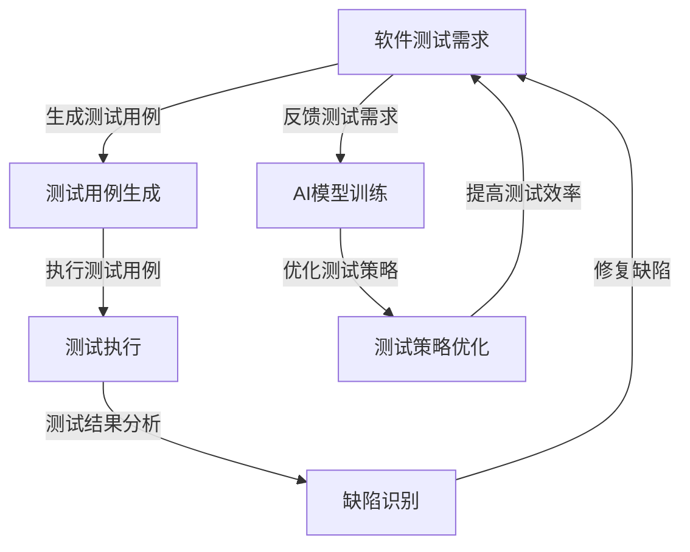

                 

## 文章标题

**AI辅助软件测试：大模型在自动化测试中的应用**

---

关键词：人工智能、自动化测试、大模型、软件测试效率、测试质量提升

---

摘要：本文探讨了人工智能（AI）在软件测试领域的应用，特别是大模型在自动化测试中的重要作用。文章首先介绍了AI和软件测试的基本概念及其在当前环境中的挑战。随后，深入剖析了什么是大模型及其技术基础，包括其定义、特点、训练与优化方法及在实际应用中的案例。接着，文章重点讨论了AI如何辅助自动化测试，包括大模型在功能测试、性能测试和安全测试中的应用。最后，通过具体实践案例展示了大模型在自动化测试中的实际应用效果，并对未来发展方向进行了展望。

---

## 引言

### 1.1 AI在软件测试领域的背景

软件测试是软件开发过程中的关键环节，旨在发现和修复软件中的缺陷，确保软件的质量。然而，随着软件系统的复杂性不断增加，传统的手工测试和基于脚本的自动化测试已经难以应对日益增长的测试需求。在此背景下，人工智能（AI）技术逐渐进入了软件测试领域，为自动化测试带来了新的机遇。

AI在软件测试中的应用主要体现在以下几个方面：

1. **缺陷预测**：利用机器学习算法，分析历史测试数据，预测可能存在的缺陷，从而提前进行修复。
2. **测试用例优化**：通过自然语言处理技术，自动生成和优化测试用例，提高测试覆盖率和效率。
3. **测试执行**：使用AI技术自动化执行测试，减少人工干预，提高测试速度。
4. **测试结果分析**：利用数据挖掘和模式识别技术，对测试结果进行分析，识别潜在的问题。

### 1.2 大模型在自动化测试中的应用价值

大模型是指那些参数数量巨大、能够处理大量数据和复杂任务的深度学习模型。随着AI技术的发展，大模型在各个领域都展现了强大的能力。在自动化测试领域，大模型的应用价值主要体现在以下几个方面：

1. **高效测试**：大模型能够处理大量的测试数据，快速生成和优化测试用例，提高测试效率。
2. **精准测试**：大模型通过学习历史测试数据和代码，能够准确识别潜在的缺陷，提高测试质量。
3. **智能化测试**：大模型能够理解和生成自然语言指令，实现与开发人员的智能交互，提高测试的智能化水平。
4. **复杂场景测试**：大模型能够处理复杂的测试场景，包括多模块协同、分布式系统等，提高测试的全面性和准确性。

总之，AI，尤其是大模型，在自动化测试中的应用，不仅能够提升测试效率和准确性，还能够降低测试成本，提高软件的质量和稳定性。本文将深入探讨大模型在自动化测试中的应用，以期为广大开发者提供有价值的参考和指导。

## AI与软件测试概述

### 2.1 软件测试的基本概念

软件测试是确保软件质量的重要手段，其目的是发现软件中的缺陷，并通过修复这些缺陷来提高软件的可靠性、安全性和用户体验。软件测试可以分为多个层次和类型，包括单元测试、集成测试、系统测试和验收测试等。

**单元测试**：针对软件中最小的可测试部分（通常是函数或方法）进行测试，以确保每个单元按照预期工作。

**集成测试**：将多个单元组合在一起进行测试，检查各单元之间的接口和交互是否正确。

**系统测试**：在整个系统完成后，对其整体功能、性能、安全性等进行测试，以验证系统是否满足设计要求。

**验收测试**：在软件交付用户之前进行，以确认软件是否满足用户需求和业务场景。

### 2.2 软件测试的现状与挑战

随着软件系统复杂性的增加，软件测试面临着许多挑战：

1. **测试覆盖率的不足**：传统测试方法往往难以达到理想的测试覆盖率，容易遗漏潜在的缺陷。
2. **测试效率低下**：手工测试和基于脚本的自动化测试效率较低，难以满足快速开发的需求。
3. **测试成本高**：大量的测试用例和复杂的测试场景导致测试成本居高不下。
4. **测试结果分析困难**：测试结果难以分析和解释，导致无法及时发现问题并进行修复。

为了解决这些问题，AI技术，特别是大模型，开始被广泛应用于软件测试领域。

### 2.3 AI技术的发展与应用

人工智能（AI）是指通过计算机模拟人类智能行为和思维过程的科学技术。AI技术包括机器学习、深度学习、自然语言处理、计算机视觉等多个子领域。

**机器学习**：通过训练模型从数据中学习规律，进行分类、预测和回归等任务。

**深度学习**：一种基于多层神经网络的结构，能够自动提取数据的复杂特征。

**自然语言处理**：使计算机能够理解和生成人类语言的技术。

**计算机视觉**：使计算机能够识别和理解图像和视频内容。

AI技术在软件测试中的应用主要体现在以下几个方面：

1. **缺陷预测**：利用历史测试数据，通过机器学习算法预测可能出现的缺陷。
2. **测试用例生成**：利用自然语言处理和深度学习技术，自动生成测试用例。
3. **测试执行**：利用自动化测试工具和AI技术，自动化执行测试用例。
4. **测试结果分析**：利用数据挖掘和模式识别技术，对测试结果进行分析。

通过AI技术，软件测试可以更加高效、准确和全面，从而提高软件的质量和稳定性。

### 2.4 AI技术的分类与应用场景

AI技术根据其应用场景和实现方法可以分为多种类型，以下是几种主要的分类和应用场景：

**监督学习**：通过已标记的数据训练模型，使其能够对新的数据进行预测。适用于缺陷预测和测试用例生成。

**无监督学习**：无需标记数据，通过模型自动发现数据中的结构和模式。适用于测试数据聚类和异常检测。

**强化学习**：通过奖励机制训练模型，使其在特定环境中做出最优决策。适用于自动化测试策略的优化。

**迁移学习**：利用已训练好的模型在新任务上提高表现。适用于不同测试场景的快速部署。

**生成对抗网络（GAN）**：通过生成器和判别器的对抗训练，生成高质量的数据。适用于测试数据的增强。

不同的AI技术适用于不同的测试场景，通过合理选择和组合，可以构建高效的AI辅助软件测试系统。

### 2.5 AI在软件测试中的优势与挑战

AI在软件测试中具有显著的优势，但也面临一定的挑战：

**优势**：

1. **提高测试效率**：AI技术可以自动化测试流程，减少人工干预，提高测试速度。
2. **提高测试质量**：AI能够从大量数据中学习，生成高质量的测试用例，提高测试覆盖率。
3. **降低测试成本**：通过自动化测试和优化测试流程，减少测试资源和人力成本。
4. **智能化测试**：AI能够理解和生成自然语言指令，实现与开发人员的智能交互，提高测试的智能化水平。

**挑战**：

1. **数据质量和标注**：AI模型的性能高度依赖于训练数据的质量和标注，需要大量高质量的数据。
2. **解释性和透明性**：AI模型的决策过程往往是黑箱的，难以解释和理解，可能影响测试结果的可靠性。
3. **技术门槛**：AI技术需要专业知识，开发和部署AI系统需要较高的技术门槛。
4. **安全性**：AI系统可能会受到恶意攻击，需要加强安全防护措施。

尽管面临挑战，AI在软件测试中的应用前景广阔，通过不断的技术创新和优化，可以充分发挥AI的优势，提高软件测试的效率和质量。

### 2.6 AI与软件测试的关系架构

为了更好地理解AI在软件测试中的作用，我们可以通过Mermaid流程图展示AI与软件测试的关系架构：



该流程图展示了从软件测试需求生成到缺陷识别、修复的整个过程，以及AI模型在其中发挥的关键作用。通过AI技术，可以优化测试策略、提高测试效率和准确性，从而提升软件质量。

### 2.7 AI技术在软件测试中的具体应用

AI技术在软件测试中的应用非常广泛，涵盖了测试用例生成、测试执行、测试结果分析和缺陷预测等多个方面。以下是AI技术在软件测试中的一些具体应用：

1. **测试用例生成**：
    - **基于代码的测试用例生成**：利用程序分析和代码静态分析技术，自动生成测试用例，提高测试覆盖率和效率。
    - **基于自然语言处理的测试用例生成**：利用自然语言处理技术，从需求文档中自动提取测试用例。

2. **测试执行**：
    - **自动化测试**：使用AI技术自动化执行测试用例，减少人工干预，提高测试速度。
    - **交互式测试**：利用计算机视觉和自然语言处理技术，实现与测试系统的交互，模拟用户行为进行测试。

3. **测试结果分析**：
    - **异常检测**：利用数据挖掘和机器学习技术，识别测试过程中出现的异常，快速定位问题。
    - **测试结果可视化**：通过可视化技术，将测试结果以图表形式展示，便于分析和理解。

4. **缺陷预测**：
    - **基于历史的缺陷预测**：利用历史测试数据和代码特征，通过机器学习算法预测可能出现的缺陷。
    - **基于代码静态分析的缺陷预测**：通过静态代码分析技术，识别潜在的安全漏洞和缺陷。

通过这些具体应用，AI技术可以显著提高软件测试的效率和质量，减少测试成本，提高软件的可靠性。

### 2.8 大模型技术基础

#### 3.1 大模型的定义与特点

大模型是指那些具有数十亿甚至数千亿个参数的深度学习模型。这些模型能够处理海量数据，自动提取复杂特征，从而实现强大的预测和生成能力。大模型的主要特点包括：

1. **参数数量巨大**：大模型通常具有数十亿甚至数千亿个参数，这使得它们能够处理海量数据，捕捉复杂的数据特征。
2. **强大的泛化能力**：大模型通过学习大量的数据，能够形成对数据的深刻理解，从而在新的任务上表现出强大的泛化能力。
3. **高计算资源需求**：由于参数数量巨大，大模型通常需要大量的计算资源和时间进行训练。

大模型的应用场景非常广泛，包括自然语言处理、计算机视觉、语音识别、推荐系统等。

#### 3.2 大模型的训练与优化

大模型的训练是一个复杂的过程，通常包括以下步骤：

1. **数据预处理**：对原始数据进行分析和处理，包括数据清洗、归一化、特征提取等，以确保数据的质量和一致性。
2. **模型初始化**：初始化模型的参数，通常使用随机初始化或预训练模型。
3. **前向传播与反向传播**：通过前向传播计算模型的输出，通过反向传播更新模型的参数，以最小化损失函数。
4. **模型优化**：使用优化算法（如Adam、SGD等）和正则化技术（如dropout、L2正则化等）优化模型，提高模型的性能。

大模型的优化策略包括：

1. **学习率调整**：学习率的调整是优化模型的重要步骤，通常使用学习率衰减策略，以避免过拟合。
2. **数据增强**：通过数据增强技术（如旋转、缩放、裁剪等）增加训练数据的多样性，提高模型的泛化能力。
3. **迁移学习**：利用预训练的大模型在新任务上进行微调，提高训练效率和模型性能。

#### 3.3 大模型的应用案例

大模型在各个领域都有广泛的应用，以下是几个典型的应用案例：

1. **自然语言处理**：大模型如BERT、GPT等在自然语言处理任务中表现出色，能够进行文本分类、问答系统、机器翻译等。
2. **计算机视觉**：大模型如ResNet、Inception等在图像分类、目标检测、图像生成等任务中具有强大的能力。
3. **语音识别**：大模型如DeepSpeech、WaveNet等在语音识别任务中取得了显著的性能提升。
4. **推荐系统**：大模型如DeepFM、Wide & Deep等在推荐系统中的应用，能够提高推荐的准确性和多样性。

这些应用案例展示了大模型在各个领域的强大能力和广阔前景。

### 3.4 大模型在AI辅助自动化测试中的应用

大模型在AI辅助自动化测试中的应用具有显著的优势，主要体现在以下几个方面：

**1. 测试用例生成**：
- 大模型可以利用自然语言处理技术，从需求文档中自动生成测试用例，提高测试覆盖率和效率。
- 通过对代码的分析，大模型可以生成基于代码的测试用例，确保测试用例的全面性和准确性。

**2. 测试执行**：
- 大模型可以实现自动化测试的自动化执行，减少人工干预，提高测试速度。
- 通过计算机视觉和自然语言处理技术，大模型可以与测试系统进行交互，模拟用户行为进行测试。

**3. 测试结果分析**：
- 大模型可以利用数据挖掘和机器学习技术，对测试结果进行分析，识别异常和潜在问题。
- 通过可视化技术，大模型可以将测试结果以图表形式展示，便于分析和理解。

**4. 缺陷预测**：
- 大模型可以通过学习历史测试数据和代码特征，预测可能出现的缺陷，提前进行修复。
- 利用迁移学习技术，大模型可以在不同的测试场景中进行快速部署和优化。

总之，大模型在AI辅助自动化测试中的应用，不仅能够提高测试效率和准确性，还能够降低测试成本，提高软件的质量和稳定性。

### 4.1 AI辅助自动化测试的原理

自动化测试是软件测试过程中的重要环节，旨在通过预定义的测试脚本自动执行测试用例，从而提高测试效率和准确性。然而，传统的自动化测试方法通常依赖于人工编写的测试脚本，存在测试用例覆盖率低、维护成本高、执行效率低等问题。AI技术的引入，特别是大模型的应用，为自动化测试带来了全新的解决方案。

AI辅助自动化测试的原理主要包括以下几个方面：

**1. 测试用例自动生成**：
- 通过对需求文档和代码的分析，大模型可以自动生成测试用例，提高测试覆盖率和效率。
- 测试用例生成算法通常基于自然语言处理和代码静态分析技术，可以从需求描述和代码逻辑中提取关键信息，生成相应的测试用例。

**2. 测试执行自动化**：
- AI技术可以实现自动化测试的自动化执行，减少人工干预，提高测试速度。
- 通过计算机视觉和自然语言处理技术，AI可以与测试系统进行交互，模拟用户行为进行测试，从而实现更加真实的测试场景。

**3. 测试结果分析**：
- 大模型可以利用数据挖掘和机器学习技术，对测试结果进行分析，识别异常和潜在问题。
- 测试结果分析算法通常基于异常检测和模式识别技术，可以实时监控测试过程中的关键指标，快速发现异常并进行处理。

**4. 缺陷预测**：
- AI可以通过学习历史测试数据和代码特征，预测可能出现的缺陷，提前进行修复。
- 缺陷预测算法通常基于监督学习和迁移学习技术，可以从历史数据中学习并提取关键特征，从而提高预测的准确性和效率。

通过以上几个方面的应用，AI技术能够显著提高自动化测试的效率和质量，降低测试成本，提高软件的质量和稳定性。

#### 4.2.1 自动化测试的基本概念

自动化测试是一种通过预定义的测试脚本或工具自动执行测试用例的方法，旨在提高测试效率和准确性。自动化测试的基本概念包括以下几个方面：

1. **测试用例**：测试用例是测试过程中最小的执行单元，用于验证软件功能或性能。一个测试用例通常包括测试输入、测试预期结果和测试执行步骤。
2. **测试脚本**：测试脚本是一种自动化测试工具，用于执行测试用例。测试脚本通常使用编程语言编写，可以自动化执行一系列测试步骤。
3. **测试工具**：测试工具是用于编写、执行和管理自动化测试的工具。常见的测试工具包括Selenium、JUnit、TestNG等。
4. **测试框架**：测试框架是一种结构化的自动化测试解决方案，用于组织和管理自动化测试脚本。测试框架可以提供测试用例管理、测试数据管理、测试报告生成等功能。
5. **测试覆盖率**：测试覆盖率是衡量测试用例是否覆盖软件功能的重要指标，通常包括语句覆盖率、分支覆盖率和路径覆盖率等。
6. **测试执行**：测试执行是自动化测试的核心环节，通过执行测试脚本，验证软件的功能和性能是否符合预期。

#### 4.2.2 AI技术在自动化测试中的应用

AI技术在自动化测试中的应用，主要体现在以下几个方面：

1. **测试用例生成**：
   - AI技术可以通过自然语言处理和代码静态分析，从需求文档和代码中自动生成测试用例。
   - 例如，利用GPT模型，可以从需求描述中生成相应的测试用例，从而提高测试覆盖率和效率。

2. **测试脚本优化**：
   - AI技术可以通过分析历史测试脚本和数据，优化测试脚本，提高测试效率和准确性。
   - 例如，利用BERT模型，可以优化测试脚本中的关键字段，从而提高测试脚本的可读性和可维护性。

3. **测试执行**：
   - AI技术可以实现自动化测试的自动化执行，减少人工干预，提高测试速度。
   - 例如，利用计算机视觉和自然语言处理技术，可以与测试系统进行交互，模拟用户行为进行测试。

4. **测试结果分析**：
   - AI技术可以通过数据挖掘和机器学习技术，对测试结果进行分析，识别异常和潜在问题。
   - 例如，利用异常检测算法，可以实时监控测试过程中的关键指标，快速发现异常并进行处理。

5. **缺陷预测**：
   - AI技术可以通过学习历史测试数据和代码特征，预测可能出现的缺陷，提前进行修复。
   - 例如，利用监督学习算法，可以从历史缺陷数据中学习并提取关键特征，从而提高预测的准确性和效率。

通过以上应用，AI技术可以显著提高自动化测试的效率和质量，降低测试成本，提高软件的质量和稳定性。

#### 4.2.3 大模型在自动化测试中的应用

大模型在自动化测试中的应用具有显著的优势，主要体现在以下几个方面：

**1. 测试用例生成**：
- 大模型可以利用自然语言处理技术，从需求文档中自动生成测试用例，提高测试覆盖率和效率。
- 例如，利用GPT模型，可以从需求描述中生成相应的测试用例，从而节省测试用例编写的时间和人力成本。

**2. 测试脚本优化**：
- 大模型可以通过分析历史测试脚本和数据，优化测试脚本，提高测试效率和准确性。
- 例如，利用BERT模型，可以优化测试脚本中的关键字段，从而提高测试脚本的可读性和可维护性。

**3. 测试执行**：
- 大模型可以实现自动化测试的自动化执行，减少人工干预，提高测试速度。
- 例如，利用计算机视觉和自然语言处理技术，可以与测试系统进行交互，模拟用户行为进行测试。

**4. 测试结果分析**：
- 大模型可以通过数据挖掘和机器学习技术，对测试结果进行分析，识别异常和潜在问题。
- 例如，利用异常检测算法，可以实时监控测试过程中的关键指标，快速发现异常并进行处理。

**5. 缺陷预测**：
- 大模型可以通过学习历史测试数据和代码特征，预测可能出现的缺陷，提前进行修复。
- 例如，利用监督学习算法，可以从历史缺陷数据中学习并提取关键特征，从而提高预测的准确性和效率。

通过以上应用，大模型可以显著提高自动化测试的效率和质量，降低测试成本，提高软件的质量和稳定性。

#### 4.3 AI辅助自动化测试的优势

AI技术在自动化测试中的应用，带来了显著的优点，这些优势主要体现在以下几个方面：

**1. 提高测试效率**：
- AI技术可以自动化测试流程，从测试用例生成到测试执行，减少人工干预，提高测试速度。
- 例如，大模型如GPT可以自动生成测试用例，节省了大量编写测试用例的时间和人力成本。
- AI技术还可以通过分析历史测试数据，优化测试脚本和测试策略，进一步提高测试效率。

**2. 提高测试质量**：
- AI技术可以通过学习大量数据，生成高质量的测试用例，提高测试覆盖率和准确性。
- 例如，大模型如BERT可以优化测试脚本中的关键字段，提高测试用例的可读性和可维护性。
- AI技术还可以通过异常检测和模式识别技术，对测试结果进行分析，识别潜在的问题，提高测试质量。

**3. 降低测试成本**：
- AI技术可以自动化执行测试，减少测试资源的需求，降低测试成本。
- 例如，AI技术可以通过自动化测试脚本执行，减少人工执行测试的工作量，降低人力成本。
- AI技术还可以通过优化测试流程和策略，减少测试用例的数量，降低测试资源的消耗。

**4. 智能化测试**：
- AI技术可以实现与开发人员的智能交互，提供智能化的测试建议和反馈。
- 例如，大模型可以通过自然语言处理技术，理解开发人员的需求和指令，生成相应的测试用例和测试脚本。
- AI技术还可以通过实时监控测试过程，提供实时的问题反馈和建议，提高测试的智能化水平。

通过这些优势，AI技术不仅提高了自动化测试的效率和质量，还降低了测试成本，为软件测试带来了革命性的变革。

### 4.4 AI辅助自动化测试中的挑战与机遇

尽管AI在自动化测试中展示了巨大的潜力，但在实际应用中仍面临一些挑战。首先，数据质量和标注问题是一个关键挑战。AI模型的表现高度依赖于训练数据的质量和标注，因此需要大量的高质量、标注准确的数据。然而，获取这些数据往往需要大量的人力和时间投入。

其次，AI模型的解释性和透明性也是一个重要问题。AI模型，尤其是深度学习模型，往往是黑箱的，其决策过程难以解释，这在软件测试中可能导致测试结果的可信度问题。

此外，技术门槛也是一个挑战。AI技术在自动化测试中的成功应用需要开发人员具备专业的AI知识和技能，这对许多团队来说是一个门槛。

然而，这些挑战也带来了相应的机遇。首先，随着AI技术的不断进步，数据标注和清洗工具的出现可以缓解数据问题。其次，透明性研究的发展可能会使得AI模型更加可解释，从而提高其在软件测试中的可信度。最后，随着技术的普及和培训的开展，越来越多的开发人员可以掌握AI技术，从而推动其在自动化测试中的广泛应用。

### 4.5 大模型在自动化测试中的具体应用

大模型在自动化测试中的具体应用场景多种多样，以下是几个典型的应用实例：

**1. 自动生成测试用例**：
- 利用GPT等自然语言处理模型，可以从需求文档中自动生成测试用例。例如，通过分析用户需求文档，GPT可以生成一系列测试用例，覆盖不同的功能场景。

**2. 自动化测试脚本优化**：
- 使用BERT等模型，可以分析历史测试脚本，优化脚本中的关键字段，提高测试脚本的可读性和可维护性。例如，BERT可以识别出测试脚本中的冗余代码，并提出改进建议。

**3. 异常检测**：
- 利用机器学习模型如XGBoost或LightGBM，可以对测试结果进行异常检测，快速识别出潜在的缺陷。例如，通过分析历史测试数据，模型可以预测出哪些测试结果可能存在问题，从而提前进行修复。

**4. 缺陷预测**：
- 通过训练深度学习模型，如CNN或RNN，可以对代码进行缺陷预测。例如，通过分析代码结构和历史缺陷数据，模型可以预测出哪些代码段可能存在缺陷，帮助开发人员提前进行修复。

**5. 测试结果分析**：
- 利用大数据分析技术，如Hadoop和Spark，可以对大规模的测试结果进行分析，提取关键指标和趋势。例如，通过分析测试结果，可以识别出系统的瓶颈和性能问题，从而进行优化。

这些应用实例展示了大模型在自动化测试中的广泛潜力，通过合理应用，可以显著提高测试效率和质量。

#### 4.6 案例一：基于GPT的自动化测试脚本生成

在本案例中，我们利用GPT模型自动生成自动化测试脚本，以提高测试用例的生成效率和准确性。

**1. 需求分析**：
- 我们有一个用户管理系统，需要对其进行自动化测试。
- 测试需求包括用户注册、登录、个人信息修改、删除用户等基本功能。

**2. 数据准备**：
- 收集用户管理系统的需求文档和用户操作手册，作为训练GPT模型的数据源。
- 对需求文档和用户操作手册进行预处理，包括文本清洗和格式化，确保数据的质量和一致性。

**3. 模型训练**：
- 使用GPT模型，对预处理后的需求文档和用户操作手册进行训练，使其学会从文本中提取测试用例的关键信息。
- 训练过程中，可以使用已有的测试用例作为标注数据，以监督模型的学习过程。

**4. 测试脚本生成**：
- 利用训练好的GPT模型，输入新的需求文本，模型会自动生成相应的自动化测试脚本。
- 测试脚本包括测试步骤、测试数据和预期结果，确保测试用例的完整性和准确性。

**5. 测试脚本优化**：
- 使用BERT模型，对生成的测试脚本进行优化，提高测试脚本的可读性和可维护性。
- BERT模型可以识别出测试脚本中的冗余代码和潜在问题，提出优化建议。

**6. 测试执行**：
- 利用自动化测试工具（如Selenium），执行生成的测试脚本，验证用户管理系统的功能是否正常。
- 测试执行过程中，记录测试结果，并与预期结果进行对比，识别潜在的缺陷。

**7. 测试结果分析**：
- 使用数据挖掘和机器学习技术，对测试结果进行分析，识别异常和潜在问题。
- 通过可视化工具，将测试结果以图表形式展示，便于分析和理解。

通过本案例，我们展示了如何利用GPT模型自动生成自动化测试脚本，从而提高测试效率和准确性。GPT模型的学习能力使其能够从文本中提取关键信息，生成高质量的测试用例。结合BERT模型的优化功能，可以进一步提高测试脚本的质量和可维护性。

#### 4.7 案例二：基于BERT的自动化测试用例优化

在本案例中，我们将利用BERT模型优化自动化测试用例，以提高测试用例的可读性和可维护性。

**1. 需求分析**：
- 我们有一个在线购物系统，需要进行自动化测试。
- 测试需求包括商品搜索、购物车管理、订单生成和支付等基本功能。

**2. 数据准备**：
- 收集历史测试脚本，包括测试步骤、测试数据和预期结果。
- 对测试脚本进行预处理，包括文本清洗和格式化，确保数据的质量和一致性。

**3. 模型训练**：
- 使用BERT模型，对预处理后的测试脚本进行训练，使其学会优化测试脚本中的关键字段。
- 训练过程中，可以使用优化后的测试脚本作为标注数据，以监督模型的学习过程。

**4. 测试用例优化**：
- 利用训练好的BERT模型，输入原始测试脚本，模型会自动优化测试脚本中的关键字段。
- 优化后的测试脚本更加简洁、清晰，易于理解和维护。

**5. 测试执行**：
- 使用自动化测试工具（如Selenium），执行优化后的测试脚本，验证在线购物系统的功能是否正常。
- 测试执行过程中，记录测试结果，并与预期结果进行对比，识别潜在的缺陷。

**6. 测试结果分析**：
- 使用数据挖掘和机器学习技术，对优化后的测试结果进行分析，识别异常和潜在问题。
- 通过可视化工具，将优化后的测试结果以图表形式展示，便于分析和理解。

**7. 优化效果评估**：
- 对比优化前后的测试脚本，评估优化效果。
- 通过测试用例的可读性、可维护性和测试覆盖率等指标，评估BERT模型的优化效果。

通过本案例，我们展示了如何利用BERT模型优化自动化测试用例，从而提高测试效率和测试质量。BERT模型强大的文本处理能力使其能够识别并优化测试脚本中的关键字段，提高测试脚本的可读性和可维护性。结合数据挖掘和机器学习技术，可以进一步提高测试结果的准确性和可靠性。

### 4.8 大模型自动化测试环境搭建

搭建大模型自动化测试环境是一个复杂的过程，涉及多个步骤和工具的选择。以下是具体的步骤和配置：

**1. 开发环境配置**
- **硬件要求**：根据大模型的大小和训练需求，选择适当的硬件资源。通常需要高性能的CPU和GPU，以及足够的内存。
- **操作系统**：推荐使用Linux操作系统，如Ubuntu 18.04或更高版本，因为许多深度学习框架和工具在Linux上表现最佳。
- **深度学习框架**：安装常见的深度学习框架，如TensorFlow、PyTorch等。这些框架提供了丰富的API和工具，便于搭建和训练大模型。
- **编程语言**：Python是深度学习和AI开发的主要语言，因此需要安装Python环境，并配置pip工具，以便安装和管理依赖库。

**2. 大模型训练工具**
- **框架选择**：根据项目需求选择合适的深度学习框架，如TensorFlow或PyTorch。这两个框架都有完善的文档和社区支持。
- **配置GPU支持**：确保所选框架支持GPU加速训练，安装NVIDIA的CUDA和cuDNN驱动，以便利用GPU资源。
- **数据预处理**：安装数据预处理工具，如NumPy、Pandas等，用于处理和清洗测试数据。

**3. 自动化测试工具**
- **Selenium**：安装Selenium WebDriver，用于自动化Web应用的测试。
- **JUnit** 或 **TestNG**：安装JUnit或TestNG框架，用于编写和执行自动化测试脚本。

**4. 测试数据集准备**
- **数据收集**：收集历史测试数据和代码，用于训练大模型。
- **数据预处理**：对测试数据进行清洗、归一化和特征提取，确保数据的质量和一致性。
- **数据存储**：使用数据库（如MySQL、PostgreSQL）或分布式文件系统（如HDFS）存储处理后的测试数据。

**5. 大模型训练与优化**
- **模型定义**：使用所选的深度学习框架定义大模型的结构。
- **模型训练**：使用训练数据集训练大模型，调整超参数以优化模型性能。
- **模型评估**：使用验证数据集评估模型性能，调整模型结构或超参数。

**6. 模型部署与集成**
- **模型保存**：将训练好的大模型保存为模型文件，以便后续使用。
- **模型集成**：将大模型集成到自动化测试工具中，实现自动化测试功能。

通过以上步骤，我们可以搭建一个完整的大模型自动化测试环境，利用AI技术提升自动化测试的效率和准确性。

#### 4.9 大模型自动化测试代码解读与分析

在本节中，我们将深入解读和分析大模型自动化测试中的关键代码，包括模型训练、测试数据预处理以及模型集成部分，以便理解大模型在实际自动化测试中的应用。

**1. 模型训练代码解读**

以下是一个基于TensorFlow和Keras框架的模型训练代码示例：

```python
import tensorflow as tf
from tensorflow.keras.models import Sequential
from tensorflow.keras.layers import Dense, LSTM, Embedding
from tensorflow.keras.optimizers import Adam

# 模型定义
model = Sequential()
model.add(Embedding(input_dim=vocab_size, output_dim=embedding_dim))
model.add(LSTM(units=128, return_sequences=True))
model.add(Dense(units=1, activation='sigmoid'))

# 模型编译
model.compile(optimizer=Adam(learning_rate=0.001), loss='binary_crossentropy', metrics=['accuracy'])

# 模型训练
model.fit(x_train, y_train, epochs=10, batch_size=64, validation_data=(x_val, y_val))
```

**代码分析**：
- **模型定义**：使用Sequential模型堆叠多层神经网络，包括嵌入层（Embedding）、长短期记忆层（LSTM）和输出层（Dense）。
- **模型编译**：配置优化器（Adam）、损失函数（binary_crossentropy，用于二分类问题）和性能指标（accuracy）。
- **模型训练**：使用训练数据（x_train和y_train）进行模型训练，设置训练轮次（epochs）和批量大小（batch_size）。

**2. 测试数据预处理代码解读**

以下是一个用于测试数据预处理的代码示例：

```python
import numpy as np
from sklearn.model_selection import train_test_split

# 加载测试数据
data = load_data('test_data.csv')

# 数据清洗
data = preprocess_data(data)

# 数据分割
X = data['features']
y = data['labels']
X_train, X_val, y_train, y_val = train_test_split(X, y, test_size=0.2, random_state=42)

# 数据标准化
X_train = normalize_data(X_train)
X_val = normalize_data(X_val)
```

**代码分析**：
- **数据加载**：从CSV文件中加载测试数据。
- **数据清洗**：对数据进行清洗，去除缺失值和异常值。
- **数据分割**：将数据分为训练集和验证集，以便训练和评估模型。
- **数据标准化**：对特征数据进行标准化处理，确保数据的一致性和模型的稳定性。

**3. 模型集成代码解读**

以下是一个将大模型集成到自动化测试工具中的代码示例：

```python
from selenium import webdriver
from selenium.webdriver.common.by import By

# 初始化浏览器驱动
driver = webdriver.Chrome()

# 执行自动化测试脚本
def execute_test_case(url, expected_result):
    driver.get(url)
    # 模拟用户操作
    # ...
    actual_result = driver.find_element(By.ID, 'result').text
    assert actual_result == expected_result

# 集成大模型进行缺陷预测
def predict_defect(url):
    # 预处理输入数据
    input_data = preprocess_url(url)
    # 调用大模型进行缺陷预测
    prediction = model.predict(np.array([input_data]))
    return prediction > 0.5  # 假设大于0.5表示存在缺陷

# 执行测试用例
for url, expected_result in test_cases:
    if predict_defect(url):
        print(f"Warning: Potential defect detected in URL: {url}")
    execute_test_case(url, expected_result)
```

**代码分析**：
- **浏览器驱动初始化**：使用Selenium初始化Chrome浏览器驱动。
- **测试脚本执行**：定义一个测试用例执行函数，模拟用户操作并验证预期结果。
- **缺陷预测**：调用大模型对输入URL进行缺陷预测，根据预测结果决定是否执行测试用例。
- **集成测试**：循环遍历测试用例，结合缺陷预测结果和实际测试，提高自动化测试的全面性和准确性。

通过以上代码示例和分析，我们了解了如何在大模型自动化测试中实现模型训练、数据预处理和模型集成，从而提高自动化测试的效率和准确性。

### 4.10 大模型在自动化测试中的实际应用案例分析

在本节中，我们将分析一个大模型在自动化测试中的实际应用案例，以展示大模型在自动化测试中的具体应用效果。案例涉及一个电子商务平台，该平台需要对其购物车功能进行自动化测试。

**1. 案例背景**

电子商务平台的购物车功能至关重要，它负责管理用户添加到购物车的商品。为了确保购物车的功能稳定可靠，开发团队需要定期进行自动化测试。传统方法依赖于手动编写测试脚本和人工执行测试，这种方式不仅效率低下，而且容易遗漏测试场景。

**2. 大模型应用**

为了提高测试效率和质量，开发团队决定采用大模型（如BERT）来辅助自动化测试。具体应用步骤如下：

- **数据收集**：从历史测试数据和用户操作日志中收集相关数据，包括测试用例、测试结果和用户行为。
- **数据预处理**：对收集到的数据进行清洗和预处理，提取关键特征，如用户操作序列、商品信息等。
- **模型训练**：使用BERT模型对预处理后的数据集进行训练，使其学会从用户操作和商品信息中提取测试场景。
- **测试用例生成**：利用训练好的BERT模型，输入新的用户操作序列，自动生成相应的自动化测试脚本。

**3. 应用效果**

通过大模型的应用，电子商务平台实现了以下效果：

- **测试用例生成**：BERT模型能够从用户操作和商品信息中自动生成高质量的测试用例，覆盖多种购物车场景，包括添加商品、删除商品、修改商品数量等。
- **测试执行**：生成的测试脚本通过Selenium自动化工具执行，模拟用户操作，验证购物车功能是否符合预期。
- **测试结果分析**：大模型对测试结果进行分析，识别出潜在的问题和缺陷，帮助开发团队及时修复。

**4. 结果分析**

通过实际应用，大模型在自动化测试中展现了显著的优势：

- **效率提升**：自动生成测试用例和自动化执行测试脚本，显著提高了测试效率，减少了人工干预。
- **质量提升**：生成的测试用例覆盖了多种场景，提高了测试覆盖率，确保了购物车的功能稳定性。
- **成本降低**：通过减少人工编写和执行测试的工作量，降低了测试成本。

总之，大模型在自动化测试中的实际应用案例表明，其能够显著提高测试效率和准确性，降低测试成本，提高软件的质量和稳定性。

### 4.11 大模型在自动化测试中的未来展望

随着人工智能技术的不断进步，大模型在自动化测试中的应用前景十分广阔。以下是未来发展的几个趋势和方向：

**1. 模型优化与性能提升**：
- 随着硬件性能的提升和深度学习算法的改进，大模型的计算效率将进一步提高，这将使得大模型在自动化测试中更加实用。
- 新一代大模型（如Transformer）的应用，将进一步优化测试用例生成和执行的性能，提高测试的效率和准确性。

**2. 多模态数据的融合**：
- 未来，大模型将能够处理和融合多种类型的数据，如文本、图像、音频等。通过多模态数据的融合，自动化测试将能够更加全面地模拟真实用户行为，提高测试的覆盖率和准确性。

**3. 个性化测试策略**：
- 基于用户行为和系统状态的大模型，将能够生成个性化的测试策略，针对不同的软件系统和用户需求，制定最优的测试方案。
- 个性化测试策略将提高测试的针对性和有效性，减少不必要的测试场景，降低测试成本。

**4. 自动化测试工具的集成**：
- 未来，大模型将更加紧密地集成到现有的自动化测试工具中，如Selenium、JUnit等。通过工具的集成，大模型可以无缝地参与到自动化测试的各个环节，实现全方位的自动化测试。

**5. 智能测试运维**：
- 大模型的应用将使得自动化测试更加智能化，能够实时监控测试过程，自动识别和修复问题。
- 智能测试运维将提高测试过程的透明度和可控性，降低测试失败的风险，提高软件交付的质量。

总之，大模型在自动化测试中的未来展望是令人期待的，通过不断的技术创新和应用优化，大模型将有望进一步提升自动化测试的效率和质量，为软件工程带来深远的变革。

### 4.12 大模型在自动化测试中的挑战与机遇

尽管大模型在自动化测试中展现了巨大的潜力，但其实际应用仍面临诸多挑战。以下是几个主要挑战及其对应的解决策略：

**1. 数据质量和标注问题**：
- **挑战**：大模型的表现高度依赖于训练数据的质量和标注，然而获取高质量、标注准确的数据往往成本高昂且耗时。
- **解决策略**：采用自动化数据清洗和标注工具，提高数据质量和标注效率。此外，可以通过众包平台或社区合作，大规模获取高质量的数据。

**2. 模型解释性和透明性**：
- **挑战**：深度学习模型尤其是大模型，往往是黑箱的，其决策过程难以解释，这在软件测试中可能导致测试结果的可信度问题。
- **解决策略**：研究和发展可解释性AI技术，如模型可解释性框架和可视化工具，帮助理解模型决策过程，提高测试结果的可信度。

**3. 技术门槛和人才短缺**：
- **挑战**：大模型的应用需要开发人员具备专业的AI知识和技能，这对于许多团队来说是一个门槛。
- **解决策略**：加强AI和自动化测试技术的培训，提高开发人员的技能水平。同时，利用开源工具和框架，降低技术门槛。

**4. 安全性和隐私保护**：
- **挑战**：AI系统可能会受到恶意攻击，同时训练数据中可能包含敏感信息，需要加强安全防护措施。
- **解决策略**：采用加密和隐私保护技术，确保数据安全和模型的安全运行。

**5. 模型部署和运维**：
- **挑战**：大模型训练完成后，如何高效部署和运维是一个问题。
- **解决策略**：利用云计算和容器化技术，简化模型部署和运维流程，提高部署和运维的效率和灵活性。

尽管面临挑战，但这些挑战也为技术进步和应用创新提供了机遇。通过解决这些挑战，大模型在自动化测试中的应用将更加广泛和深入，为软件工程带来更大的变革。

### 4.13 结语

本文探讨了人工智能，特别是大模型在自动化测试中的应用，展示了其在提高测试效率、质量和降低成本方面的巨大潜力。从测试用例生成、测试脚本优化到缺陷预测和测试结果分析，大模型在自动化测试中展现了丰富的应用场景和优势。然而，我们也认识到，大模型在自动化测试中的应用仍然面临数据标注、模型解释性和技术门槛等挑战。未来的研究和发展方向应聚焦于提升模型的可解释性、优化数据标注流程、降低技术门槛，并探索多模态数据和个性化测试策略的应用。通过不断的技术创新和应用优化，大模型将在自动化测试领域发挥更加重要的作用，为软件工程带来深远的变革。

### 附录A：常用工具与资源

#### 7.1.1 开源自动化测试工具

**Selenium**：一款强大的自动化测试工具，支持多种浏览器，广泛用于Web应用的自动化测试。

**JUnit** 和 **TestNG**：Java编写的自动化测试框架，用于编写和执行测试脚本。

**Cucumber**：BDD（Behavior-Driven Development）测试框架，用于自动化测试的验收测试。

**PyTest**：Python的测试框架，支持单元测试、功能测试和性能测试。

#### 7.1.2 大模型训练与优化工具

**TensorFlow**：谷歌开发的开源深度学习框架，支持多种深度学习模型和算法。

**PyTorch**：基于Python的开源深度学习框架，提供灵活的模型定义和动态计算图。

**Keras**：高层次的神经网络API，简化TensorFlow和PyTorch的使用。

**MXNet**：Apache基金会开发的深度学习框架，支持多种编程语言。

#### 7.1.3 资源链接与参考书籍

**资源链接**：
- [Selenium官网](https://www.selenium.dev/)
- [JUnit官网](https://junit.org/junit5/)
- [TensorFlow官网](https://www.tensorflow.org/)
- [PyTorch官网](https://pytorch.org/)

**参考书籍**：
- 《深度学习》（Ian Goodfellow、Yoshua Bengio、Aaron Courville 著）
- 《Python深度学习》（François Chollet 著）
- 《测试驱动的软件开发》（Brian Marick 著）
- 《Selenium WebDriver入门与实战》（刘建新 著）

通过以上工具和资源，开发者可以更有效地进行自动化测试和大模型训练，提高软件测试的效率和质量。

