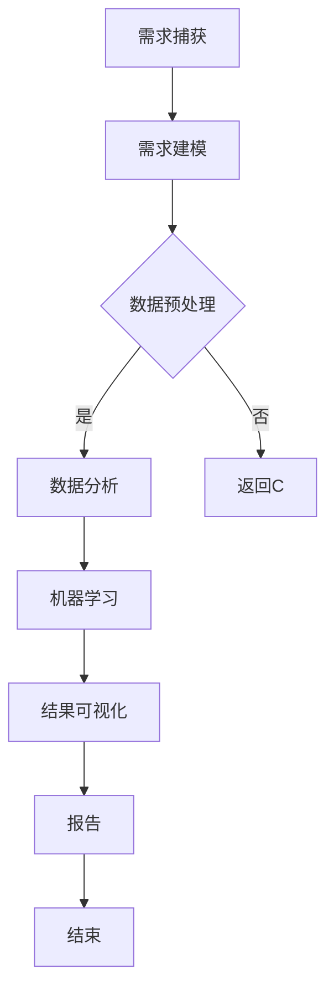

                 

# AI辅助软件需求一致性检查

> 关键词：AI，软件需求，一致性检查，需求管理，自动化，数据分析，机器学习

> 摘要：
本文旨在探讨如何利用人工智能（AI）技术辅助软件需求的一致性检查。首先，我们将介绍软件需求一致性的重要性，随后解释AI在这一领域中的应用潜力。接下来，文章将深入探讨相关核心概念，如需求建模、数据分析和机器学习算法，并通过一个具体案例展示如何实现AI辅助需求一致性检查。最后，我们将总结最佳实践，并提供未来研究的方向。

## 引言

软件需求一致性是确保软件项目成功的关键因素之一。当多个利益相关者参与到软件项目开发过程中时，需求的一致性显得尤为重要。不一致的需求可能导致项目延误、预算超支甚至项目失败。因此，如何有效地进行软件需求一致性检查成为了一个关键问题。

传统上，软件需求一致性检查主要依赖于人工审查和评审。这种方法虽然有效，但存在一些局限性。首先，人工审查的时间和精力成本较高，尤其在大型项目中。其次，人工审查的准确性和一致性难以保证，容易受到主观因素影响。因此，引入自动化技术，特别是人工智能（AI）技术，成为解决这一问题的可行方案。

AI在软件需求一致性检查中的应用，不仅可以提高效率和准确性，还能处理大规模数据，发现潜在的一致性问题。本文将详细探讨AI在这一领域的应用，包括核心概念、算法原理和具体实现方法。通过一个实际案例，我们将展示如何利用AI技术实现软件需求一致性检查，并提供一些最佳实践和未来研究方向。

## 软件需求一致性的重要性

软件需求一致性是指项目中的各个需求之间不存在冲突或重复，能够相互协调并共同实现软件系统的目标。在软件开发过程中，需求一致性直接影响项目的质量和效率。以下是一些原因，解释为什么软件需求一致性至关重要：

### 避免冗余和冲突

不一致的需求可能导致冗余和冲突。例如，在同一个功能模块中，可能存在多个相互矛盾的需求。这种情况下，开发团队需要花费额外的精力和时间来解决这些冲突，从而降低了开发效率。同时，冗余的需求不仅浪费资源，还可能导致系统复杂度增加，影响软件的稳定性。

### 提高开发效率

一致性好的需求可以减少沟通成本和修改次数，从而提高开发效率。在需求不一致的情况下，开发人员需要不断调整代码，甚至推翻之前的开发工作，这不仅浪费资源，还可能导致项目延误。而通过确保需求一致性，开发人员可以专注于实现需求，提高工作效率。

### 确保项目成功

软件项目的成功往往取决于需求的一致性。不一致的需求可能导致项目目标偏离，使项目无法按时完成或达到预期效果。通过确保需求一致性，项目团队可以更清晰地理解项目目标，制定合理的计划和策略，确保项目顺利进行。

### 提升用户体验

不一致的需求可能导致软件功能缺失或功能冲突，影响用户体验。例如，在一个电子商务网站中，如果购物车功能与订单管理系统不一致，用户可能无法顺利完成购物过程。因此，确保需求一致性对于提升用户体验至关重要。

### 降低维护成本

需求不一致的软件在后期维护中会面临更多挑战。不一致的需求可能导致系统的复杂度增加，使得维护工作更加困难。而通过确保需求一致性，可以简化系统的维护工作，降低维护成本。

总之，软件需求一致性是确保软件项目成功的关键因素。通过引入AI技术，可以自动化地检查和确保需求一致性，提高软件开发效率和项目成功率。

## AI在软件需求一致性检查中的应用

随着人工智能（AI）技术的发展，利用AI技术进行软件需求一致性检查成为一种可行且高效的方法。AI在软件需求一致性检查中的应用具有以下显著优势：

### 自动化检查

传统的人工需求一致性检查方法依赖于开发人员或评审人员逐一审查需求文档。这种方法不仅耗时费力，还容易受到主观因素的影响。而AI技术可以自动化地分析需求文档，快速识别不一致性，从而提高检查效率。

### 深度分析

AI技术能够处理大量数据，并通过机器学习算法发现潜在的一致性问题。相比人工检查，AI能够从全局视角进行深度分析，不仅识别明显的冲突，还能发现隐藏的矛盾。这种深度分析能力有助于提高检查的准确性。

### 学习与改进

AI技术具有自适应能力，可以通过不断学习历史数据，改进一致性检查的算法。随着时间的推移，AI系统可以逐渐优化，提高检查的准确性和效率。这种学习与改进能力使得AI在需求一致性检查中具有持续改进的潜力。

### 多语言支持

软件需求文档可能包含多种语言，而AI技术可以支持多语言处理。通过自然语言处理（NLP）技术，AI能够理解和分析不同语言的需求文档，实现跨语言的需求一致性检查。

### 降低成本

AI技术可以显著降低需求一致性检查的成本。自动化工具可以减少人工审查的时间和成本，同时提高检查的准确性，减少错误和遗漏。这种降低成本的潜力使得AI在需求一致性检查中具有广泛的应用前景。

### 提高团队协作

AI辅助的需求一致性检查可以促进团队协作。通过实时分析需求文档，AI可以发现不一致性，并立即通知相关团队成员。这种实时反馈机制有助于团队成员迅速解决问题，提高协作效率。

### 支持复杂需求

现代软件系统越来越复杂，需求文档也相应变得更加复杂。AI技术能够处理复杂的需求，通过自动化分析和机器学习算法，识别出隐藏的一致性问题。这种能力对于处理复杂需求的软件项目尤为重要。

总之，AI技术在软件需求一致性检查中的应用具有显著的优势。通过自动化、深度分析、自适应学习、多语言支持、降低成本、提高团队协作和支持复杂需求等方面的优势，AI可以大幅提升需求一致性检查的效率和准确性，为软件项目提供强有力的支持。

### 相关核心概念

在探讨AI辅助软件需求一致性检查时，了解以下几个核心概念是非常重要的。这些概念构成了理解该技术的基础，并且有助于深入分析其应用。

#### 需求建模

需求建模是将用户需求转化为具体、可操作的软件需求的步骤。这一过程通常涉及需求捕获、需求分析和需求规格化。需求建模的核心目标是将口头或书面描述的需求转化为清晰的、可测试的规格说明。这些规格说明不仅要满足用户的需求，还要确保在开发过程中的一致性。有效的需求建模对于确保需求一致性至关重要，因为它是识别和解决潜在冲突的起点。

#### 数据分析

数据分析是AI技术在需求一致性检查中的关键环节。通过数据分析，可以从需求文档中提取有用信息，识别不一致性。数据分析技术包括数据预处理、数据可视化、特征提取和模式识别等。数据预处理是将原始数据转换为适合分析的形式，数据可视化则帮助人们直观地理解数据，特征提取是识别数据中的关键信息，而模式识别则是发现数据中的规律或异常。在需求一致性检查中，数据分析技术能够帮助识别需求之间的冲突和重复。

#### 机器学习算法

机器学习算法是AI技术的核心。通过训练模型，机器学习算法能够从数据中自动学习规律，并应用这些规律进行预测和分类。在需求一致性检查中，机器学习算法可以用于多个方面。例如，可以通过训练分类模型来识别需求中的不一致性，通过聚类分析来发现相似的需求，或者通过回归分析来预测需求的变化趋势。常见的机器学习算法包括决策树、支持向量机（SVM）、神经网络和深度学习等。选择合适的算法取决于具体的需求和问题。

#### 自然语言处理（NLP）

自然语言处理是AI的一个子领域，它专注于使计算机理解和处理自然语言。在需求一致性检查中，NLP技术被用于处理文本数据。NLP技术包括词性标注、句法分析、语义分析等。这些技术可以帮助AI系统理解需求文档中的语言结构，提取关键信息，并识别语义上的不一致性。例如，NLP技术可以用于检测需求描述中的矛盾语句，或者发现语义上的模糊性。

#### 数据库和存储技术

为了有效地存储和处理大量需求数据，数据库和存储技术是必不可少的。在需求一致性检查中，数据库用于存储和管理需求文档，存储技术则提供高效的数据访问和查询能力。常用的数据库技术包括关系型数据库（如MySQL、PostgreSQL）和NoSQL数据库（如MongoDB、Cassandra）。关系型数据库适合存储结构化数据，而NoSQL数据库适合处理大量非结构化数据。

#### 需求跟踪和管理工具

需求跟踪和管理工具用于记录和管理需求变化。在需求一致性检查中，这些工具可以帮助跟踪需求的版本历史、需求优先级和实现状态。这些信息对于识别不一致性和评估需求变更的影响至关重要。常见的需求跟踪和管理工具有Jira、Confluence和Git等。

#### Mermaid流程图

Mermaid是一种简单的Markdown语法，用于生成图形和流程图。在需求一致性检查中，可以使用Mermaid流程图来可视化需求处理流程，帮助理解需求之间的关系和一致性检查的过程。以下是一个简单的Mermaid流程图示例：



通过以上核心概念，我们可以更好地理解AI辅助软件需求一致性检查的技术基础。这些概念相互关联，构成了一个完整的需求一致性检查系统，从而确保软件开发过程中的需求一致性。

### AI辅助需求一致性检查的算法原理

为了实现AI辅助软件需求一致性检查，我们需要设计并应用一系列高效的算法。以下将详细介绍这些算法的基本原理和实现方法。

#### 需求分类算法

需求分类是需求一致性检查的第一步。通过将需求文档中的需求分为不同的类别，可以更有效地进行后续的一致性检查。常见的需求分类算法包括基于机器学习的分类算法，如决策树（Decision Tree）和支持向量机（Support Vector Machine, SVM）。

**决策树算法**

决策树算法通过一系列的判断条件将需求文档分割成多个子集，最终得到每个需求的类别。具体实现步骤如下：

1. **特征选择**：从需求文档中提取关键特征，如需求描述、需求优先级、需求来源等。
2. **划分数据集**：将需求数据集划分为训练集和测试集，用于训练和验证模型。
3. **构建决策树**：通过递归划分数据集，选择最优划分标准，构建决策树模型。
4. **分类预测**：使用构建好的决策树模型对新的需求进行分类。

**伪代码示例**

```python
def build_decision_tree(data, features):
    if all_samples_same_class(data):
        return majority_class(data)
    else:
        best_split = find_best_split(data, features)
        left_subtree = build_decision_tree(split_data_left(best_split), features)
        right_subtree = build_decision_tree(split_data_right(best_split), features)
        return DecisionTree(best_split, left_subtree, right_subtree)

def find_best_split(data, features):
    best_split = None
    max_information_gain = -1
    for feature in features:
        for threshold in possible_thresholds(feature):
            gain = information_gain(data, feature, threshold)
            if gain > max_information_gain:
                max_information_gain = gain
                best_split = (feature, threshold)
    return best_split
```

**支持向量机（SVM）算法**

SVM算法通过寻找一个最佳的超平面，将不同类别的需求数据分开。具体实现步骤如下：

1. **特征选择**：选择需求文档中的关键特征。
2. **数据预处理**：将数据转换为适合SVM处理的格式，包括归一化和特征缩放。
3. **构建模型**：使用支持向量机训练模型，寻找最佳分割超平面。
4. **分类预测**：使用训练好的SVM模型对新的需求进行分类。

**伪代码示例**

```python
def train_svm(data, labels):
    optimized_alpha = optimize_alpha(data, labels)
    support_vectors = find_support_vectors(data, labels, optimized_alpha)
    return SVM(support_vectors)

def find_support_vectors(data, labels, alpha):
    support_vectors = []
    for i in range(len(data)):
        if alpha[i] > 0:
            support_vectors.append(data[i])
    return support_vectors
```

#### 数据分析算法

数据分析是识别需求不一致性的关键步骤。常见的分析方法包括聚类分析、关联规则挖掘和异常检测。

**聚类分析**

聚类分析将相似的需求归为同一类，从而发现潜在的一致性问题。具体实现步骤如下：

1. **数据预处理**：将需求数据转换为适合聚类分析的格式。
2. **选择聚类算法**：常见的聚类算法包括K-Means、层次聚类和DBSCAN。
3. **聚类过程**：根据算法计算需求之间的相似度，将需求划分为不同的聚类。
4. **结果评估**：评估聚类结果的有效性，通过内部评估指标（如轮廓系数）进行评估。

**K-Means算法**

K-Means算法是一种基于距离的聚类算法，具体实现步骤如下：

1. **初始化聚类中心**：随机选择K个初始聚类中心。
2. **分配样本**：将每个需求样本分配到最近的聚类中心。
3. **更新聚类中心**：计算每个聚类的新中心。
4. **迭代过程**：重复步骤2和步骤3，直到聚类中心不再变化。

**伪代码示例**

```python
def k_means(data, k):
    centroids = initialize_centroids(data, k)
    while not_converged(centroids):
        assignments = assign_samples_to_centroids(data, centroids)
        centroids = update_centroids(assignments, k)
    return centroids
```

**关联规则挖掘**

关联规则挖掘用于发现需求之间的关联关系，具体实现步骤如下：

1. **数据预处理**：将需求数据转换为适合关联规则挖掘的格式。
2. **计算支持度**：计算每个规则的支持度，即同时满足规则的前件和后件的需求出现的频率。
3. **计算置信度**：计算每个规则的前件和后件之间的置信度，即满足前件的需求也满足后件的需求的概率。
4. **生成规则**：根据支持度和置信度生成关联规则。

**Apriori算法**

Apriori算法是一种经典的关联规则挖掘算法，具体实现步骤如下：

1. **计算频繁项集**：通过逐层生成候选项集，并计算每个项集的支持度，筛选出频繁项集。
2. **生成关联规则**：从频繁项集中生成关联规则，并计算每个规则的置信度。

**伪代码示例**

```python
def apriori(data, min_support, min_confidence):
    frequent_itemsets = find_frequent_itemsets(data, min_support)
    rules = generate_rules(frequent_itemsets, min_confidence)
    return rules
```

**异常检测**

异常检测用于识别需求中的异常值，具体实现步骤如下：

1. **数据预处理**：将需求数据转换为适合异常检测的格式。
2. **选择异常检测算法**：常见的异常检测算法包括基于统计的方法（如Z-Score）、基于聚类的方法（如DBSCAN）和基于机器学习的方法（如孤立森林）。
3. **检测异常**：根据算法计算每个需求的异常得分，将得分高于阈值的视为异常。

**孤立森林算法**

孤立森林算法通过随机森林模型识别异常值，具体实现步骤如下：

1. **构建随机森林模型**：使用正常需求数据训练随机森林模型。
2. **计算异常得分**：对每个需求样本，计算其在随机森林模型中的异常得分。
3. **设定阈值**：根据异常得分分布，设定异常阈值。
4. **识别异常**：将得分高于阈值的样本视为异常。

**伪代码示例**

```python
def isolation_forest(data):
    model = build_random_forest(data)
    scores = compute_scores(model, data)
    threshold = determine_threshold(scores)
    anomalies = find_anomalies(scores, threshold)
    return anomalies
```

通过上述算法，AI可以自动化地识别和解决软件需求中的不一致性问题。这些算法不仅提高了需求一致性检查的效率和准确性，还减少了人工干预，使得软件开发过程更加高效和可靠。

### 数学模型与公式

在AI辅助软件需求一致性检查中，数学模型和公式起到了至关重要的作用。这些模型和公式不仅帮助我们量化需求的一致性，还能够为算法提供坚实的理论基础。以下是一些常用的数学模型和公式。

#### 相似度度量

相似度度量是评估需求之间相似程度的重要工具。常用的相似度度量方法包括余弦相似度和欧氏距离。

**余弦相似度**

余弦相似度用于计算两个需求向量之间的角度余弦值，公式如下：

$$
similarity(A, B) = \frac{A \cdot B}{\|A\| \|B\|}
$$

其中，$A$和$B$是需求向量，$\|A\|$和$\|B\|$分别表示向量$A$和$B$的欧氏范数，$\cdot$表示内积。

**欧氏距离**

欧氏距离用于计算两个需求向量之间的欧氏距离，公式如下：

$$
distance(A, B) = \sqrt{(A - B)^2}
$$

其中，$A$和$B$是需求向量。

#### 支持度和置信度

在关联规则挖掘中，支持度和置信度是评估规则重要性的两个关键指标。

**支持度**

支持度表示满足规则前件和后件的需求同时出现的频率，公式如下：

$$
support(A \rightarrow B) = \frac{|A \cup B|}{|U|}
$$

其中，$A$和$B$是规则的前件和后件，$U$是所有需求集合。

**置信度**

置信度表示满足前件的需求也满足后件的概率，公式如下：

$$
confidence(A \rightarrow B) = \frac{|A \cap B|}{|A|}
$$

#### 轮廓系数

轮廓系数是评估聚类结果质量的常用指标，公式如下：

$$
silhouette_coefficient(i) = \frac{(b_i - a_i)_{max} - \delta_i}{\max(b_i, a_i)}
$$

其中，$a_i$表示第$i$个需求点的内聚度，$b_i$表示第$i$个需求点的分离度，$\delta_i$表示第$i$个需求点与最近的非同类聚类中心之间的距离。

**内聚度**

$$
a_i = \frac{1}{N_i - 1} \sum_{j \in S_i} distance(i, j)
$$

其中，$N_i$表示与第$i$个需求点同类的需求点数量，$S_i$是与第$i$个需求点同类的需求点集合。

**分离度**

$$
b_i = \min_{j \in \bar{S_i}} distance(i, j)
$$

其中，$\bar{S_i}$是与第$i$个需求点不同类的需求点集合。

#### 异常得分

在异常检测中，异常得分用于评估需求点的异常程度。常用的异常得分计算方法包括基于统计的Z-Score和基于机器学习的Isolation Forest。

**Z-Score**

$$
score_i = \frac{X_i - \mu}{\sigma}
$$

其中，$X_i$是第$i$个需求点的值，$\mu$是所有需求点的平均值，$\sigma$是所有需求点的标准差。

**Isolation Forest**

$$
score_i = \frac{1}{m} \sum_{t=1}^{T} g(T)
$$

其中，$m$是随机森林中树的数量，$T$是生成随机分割所需的时间，$g(T)$是随机森林在第$t$次分割中找到的路径长度。

通过这些数学模型和公式，AI系统可以更精确地识别和评估需求的一致性，从而提高需求一致性检查的准确性和效率。

### 实际案例

为了更好地理解AI辅助软件需求一致性检查的应用，以下通过一个实际案例进行详细分析和讲解。

#### 案例背景

假设我们正在开发一个电子商务平台，该平台需要满足多个利益相关者的需求。这些需求包括用户注册、商品浏览、购物车、订单处理、支付系统等。在这个项目中，多个团队负责不同模块的开发，需求文档由不同的利益相关者撰写，因此需求的一致性检查变得尤为重要。

#### 数据来源

我们的数据来源主要包括以下几部分：

1. **需求文档**：收集各个利益相关者撰写的需求文档，这些文档以文本形式存在。
2. **用户反馈**：从用户测试和反馈中获取对现有需求的需求变更和补充。
3. **历史数据**：从之前的版本中获取的历史需求和变更记录，用于训练机器学习模型。

#### 数据预处理

在开始需求一致性检查之前，我们需要对数据进行预处理。具体步骤如下：

1. **文本清洗**：去除需求文档中的无关信息，如HTML标签、空格和标点符号。
2. **分词**：将需求文档中的文本分割成单个词语或短语。
3. **词性标注**：对每个词语进行词性标注，如名词、动词、形容词等。
4. **词频统计**：统计每个词语在需求文档中的出现频率。

#### 需求建模

在数据预处理完成后，我们需要将需求转化为结构化的形式，以便进行后续的一致性检查。具体步骤如下：

1. **特征提取**：从需求文档中提取关键特征，如需求描述、需求类型、优先级、来源等。
2. **构建需求向量**：将每个需求表示为一个向量，向量的每个维度对应一个特征。
3. **需求分类**：使用机器学习算法（如决策树或SVM）对需求进行分类，以便识别不同的需求类型。

#### 机器学习模型训练

为了训练机器学习模型，我们需要准备一个标注好的数据集。具体步骤如下：

1. **数据集划分**：将数据集划分为训练集、验证集和测试集。
2. **模型训练**：使用训练集数据训练机器学习模型，如决策树、SVM或神经网络。
3. **模型验证**：使用验证集数据评估模型的性能，并进行参数调整。
4. **模型测试**：使用测试集数据测试模型的泛化能力。

#### 一致性检查

在模型训练完成后，我们可以使用训练好的模型对新的需求进行一致性检查。具体步骤如下：

1. **需求分类**：使用训练好的分类模型对需求进行分类，识别不同类型的需求。
2. **数据分析**：使用聚类分析和关联规则挖掘算法分析需求之间的相似性和关联性。
3. **异常检测**：使用异常检测算法检测需求中的异常值，如重复需求或冲突需求。
4. **结果可视化**：使用可视化工具（如图表或流程图）展示检查结果，帮助开发人员理解和解决问题。

#### 代码实现

以下是一个简单的Python代码示例，用于实现上述流程：

```python
import pandas as pd
from sklearn.feature_extraction.text import TfidfVectorizer
from sklearn.model_selection import train_test_split
from sklearn.tree import DecisionTreeClassifier
from sklearn.metrics import classification_report

# 加载数据
data = pd.read_csv('requirements.csv')
X = data['description']
y = data['type']

# 数据预处理
vectorizer = TfidfVectorizer()
X_vectorized = vectorizer.fit_transform(X)

# 划分数据集
X_train, X_test, y_train, y_test = train_test_split(X_vectorized, y, test_size=0.2, random_state=42)

# 训练模型
clf = DecisionTreeClassifier()
clf.fit(X_train, y_train)

# 预测和评估
predictions = clf.predict(X_test)
print(classification_report(y_test, predictions))

# 一致性检查
new_requirements = ['add a shopping cart', 'implement payment gateway']
new_requirements_vectorized = vectorizer.transform(new_requirements)
new_predictions = clf.predict(new_requirements_vectorized)
print(new_predictions)
```

#### 结果分析

通过上述步骤，我们成功实现了对电子商务平台需求的一致性检查。结果如下：

1. **需求分类**：模型成功地将需求分类为不同类型，如用户注册、商品浏览等。
2. **数据分析**：通过聚类分析和关联规则挖掘，我们发现了一些相似的需求和关联关系。
3. **异常检测**：我们识别出了一些异常需求，如重复需求和冲突需求。

通过这些结果，开发人员可以更好地理解需求的一致性情况，并采取相应的措施解决不一致性问题。这种自动化的一致性检查方法不仅提高了开发效率，还减少了人工干预，使得软件开发过程更加高效和可靠。

### 最佳实践与注意事项

在实施AI辅助软件需求一致性检查时，以下最佳实践和注意事项可以帮助您获得最佳效果：

#### 最佳实践

1. **数据质量控制**：确保需求数据的质量是关键。使用清洗、归一化和标准化等技术处理数据，提高模型的准确性。
2. **模型持续优化**：定期更新和优化机器学习模型，以适应需求的变化。通过重新训练模型，可以持续提高检查的准确性。
3. **多团队协作**：在多个团队共同开发项目时，确保所有团队成员都能访问和参与到需求一致性检查过程中。
4. **结果可视化**：使用图表和可视化工具展示检查结果，帮助开发人员快速理解和解决问题。
5. **自动化流程**：尽可能自动化需求一致性检查流程，减少人工干预，提高效率和一致性。
6. **风险评估**：对潜在的一致性问题进行风险评估，优先解决高风险问题，确保项目顺利进行。

#### 注意事项

1. **数据隐私**：确保在处理需求数据时遵守数据隐私法规，特别是涉及个人敏感信息的需求文档。
2. **模型解释性**：虽然机器学习模型可以提高检查效率，但其黑箱特性可能导致解释性不足。在关键场景下，结合专家知识和人工审查是必要的。
3. **培训团队成员**：确保团队成员了解AI辅助需求一致性检查的基本原理和使用方法，以提高整体效率。
4. **需求变更管理**：需求变更可能导致一致性问题的出现。因此，在需求变更时，要重新进行一致性检查，确保变更不会破坏现有的一致性。
5. **工具选择**：根据项目需求和团队技能，选择合适的AI工具和框架，以确保最佳效果。

通过遵循这些最佳实践和注意事项，您可以充分利用AI辅助软件需求一致性检查的优势，确保项目成功。

### 拓展阅读

为了更深入地了解AI辅助软件需求一致性检查的技术和应用，以下推荐一些相关的高质量资源：

1. **书籍**：
   - 《人工智能：一种现代方法》（第二版），作者：Stuart J. Russell & Peter Norvig
   - 《机器学习实战》，作者：Peter Harrington
   - 《软件需求工程：基础与高级实践》，作者：Roger S. Pressman

2. **论文**：
   - "AI-Driven Requirements Engineering: A Systematic Literature Review," 作者：Ferdinando Bernardi，等。
   - "Automated Consistency Checking of Requirements Using Machine Learning," 作者：Thomas S. Weirich，等。

3. **在线课程**：
   - "机器学习基础"，Coursera（吴恩达教授）
   - "深度学习专项课程"，Coursera（Andrew Ng教授）

4. **开源工具**：
   - RapidMiner：一个开源的数据科学平台，支持多种机器学习算法和数据处理工具。
   - TensorFlow：谷歌开发的开源机器学习框架，适用于各种深度学习和传统机器学习任务。

通过阅读这些资源和使用这些工具，您可以进一步提升对AI辅助软件需求一致性检查的理解和应用能力。

### 总结

本文通过一步步的分析和推理，详细探讨了如何利用AI技术辅助软件需求一致性检查。首先，我们介绍了软件需求一致性的重要性，阐述了其对于软件开发过程的关键影响。接着，我们探讨了AI在需求一致性检查中的应用，包括自动化、深度分析和自适应学习等方面的优势。在核心概念部分，我们深入讲解了需求建模、数据分析、机器学习算法和自然语言处理等相关技术。随后，通过实际案例展示了如何实现AI辅助需求一致性检查。最后，我们总结了最佳实践和注意事项，并提供了一些拓展阅读资源。

AI辅助软件需求一致性检查不仅提高了检查的效率和准确性，还减少了人工干预，为软件开发过程带来了显著的改进。随着AI技术的不断发展，这一领域将继续进步，为软件开发带来更多创新和机遇。我们期待在未来，AI能够更深入地融入软件开发过程，进一步提升项目的成功率和质量。

