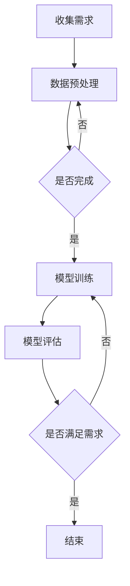

                 


### 文章标题: AI辅助软件需求优先级排序

关键词：人工智能，软件需求，优先级排序，机器学习，深度学习，算法，实践

摘要：
本文将深入探讨人工智能（AI）在软件需求优先级排序中的应用。通过介绍AI的基本概念，分析现有排序算法，并结合实际项目案例，本文旨在为软件开发者和项目经理提供一种有效的需求排序策略，以优化软件开发过程，提升项目成功率和用户满意度。

### 引言

在现代软件开发过程中，需求管理是至关重要的环节。随着项目的复杂性增加，如何有效地对众多需求进行排序，以便资源分配和开发计划能够最大限度地满足用户需求，成为了一个亟待解决的问题。传统的方法如工作量估计、用户反馈等，往往存在主观性和不准确性。而人工智能（AI）的快速发展为这一问题提供了新的解决思路。通过机器学习和深度学习算法，AI能够自动分析大量数据，识别需求之间的优先级关系，从而为软件开发提供有力的支持。

本文将首先介绍AI的基本概念，包括机器学习和深度学习的原理和应用。随后，我们将详细分析当前流行的需求优先级排序算法，探讨其优缺点。接着，本文将通过一个实际项目案例，展示如何使用AI辅助软件需求优先级排序。最后，我们将总结最佳实践，并提出未来的研究方向。

### AI的基本概念

#### 人工智能的定义

人工智能（Artificial Intelligence，AI）是指通过计算机程序实现的人类智能的模拟。AI系统可以感知环境、学习新知识、做出决策并采取行动，以实现特定目标。AI的应用范围广泛，包括但不限于自然语言处理、图像识别、游戏对战、自动化控制等。

#### 机器学习的定义

机器学习（Machine Learning，ML）是AI的一个分支，它通过数据驱动的方式，让计算机系统自动学习并改进性能。机器学习算法利用大量数据，从中发现规律和模式，并使用这些规律来预测新数据或做出决策。常见的机器学习算法包括线性回归、决策树、支持向量机等。

#### 深度学习的定义

深度学习（Deep Learning，DL）是机器学习的一个子领域，它使用多层神经网络来模拟人类大脑的决策过程。深度学习模型通过多层次的非线性变换，能够自动提取数据中的复杂特征，从而实现高度复杂的任务。常见的深度学习模型包括卷积神经网络（CNN）、循环神经网络（RNN）、生成对抗网络（GAN）等。

### 需求优先级排序算法分析

#### 传统排序方法

传统的需求排序方法主要包括工作量估计、用户反馈、团队讨论等。这些方法虽然简单易行，但往往受到主观判断的影响，难以确保公平性和准确性。此外，这些方法无法处理大量需求数据，难以在复杂项目中应用。

#### 机器学习排序方法

机器学习排序方法通过训练模型，利用历史需求数据来预测新需求的优先级。这种方法具有以下优点：

- **自动化处理**：能够处理大量需求数据，提高排序效率。
- **数据驱动**：基于历史数据和统计规律，减少主观判断的影响。
- **灵活调整**：可以根据新的需求数据不断优化模型，适应项目变化。

然而，机器学习排序方法也存在一些缺点，如需要大量训练数据和计算资源，且模型复杂度较高，对开发者的技术要求较高。

#### 深度学习排序方法

深度学习排序方法利用神经网络模型，从大量数据中自动提取复杂特征，实现需求优先级的高效排序。这种方法具有以下优点：

- **特征提取能力强**：能够自动提取需求数据中的复杂特征，提高排序准确性。
- **适应性**：可以适应不同类型的需求数据，适用于各种项目场景。
- **高效性**：通过并行计算和分布式训练，能够快速处理大规模需求数据。

深度学习排序方法的缺点主要是计算资源需求较高，且模型训练时间较长。

#### 综合比较

综合比较传统排序方法和机器学习、深度学习排序方法，我们可以得出以下结论：

- **适用场景**：传统排序方法适用于需求量较小、变化频率较低的项目。机器学习排序方法适用于需求量大、变化频繁的项目。深度学习排序方法则适用于需求复杂度高、特征提取要求高的项目。
- **准确性**：机器学习排序方法相比传统方法有更高的准确性，但深度学习排序方法在处理复杂特征时具有更高的准确性。
- **资源需求**：传统排序方法资源需求最低，机器学习排序方法次之，深度学习排序方法最高。

### 实际项目案例

为了展示AI辅助软件需求优先级排序的实际应用，我们选择了一个实际项目进行案例分析。该项目是一个电商平台，涉及多个需求和功能模块，需要高效地对需求进行排序，以确保资源合理分配和项目进度。

#### 项目背景

电商平台需求众多，包括商品展示、购物车、订单管理、支付、用户评价等。在项目初期，开发团队需要对这些需求进行优先级排序，以便制定合理的开发计划和资源分配策略。

#### 数据收集与处理

项目团队收集了大量的历史需求数据，包括需求描述、工作量评估、完成时间等。为了训练机器学习模型，我们需要对数据进行分析和预处理：

1. **数据清洗**：去除重复和错误数据，确保数据质量。
2. **特征提取**：从需求描述中提取关键特征，如用户需求类型、需求紧急程度、业务重要性等。
3. **数据归一化**：对数据进行归一化处理，确保不同特征之间具有相同的量纲。

#### 模型训练与优化

我们选择了基于深度学习的排序模型，使用卷积神经网络（CNN）对需求数据进行分析和特征提取。模型训练过程如下：

1. **数据划分**：将数据集划分为训练集、验证集和测试集，用于模型训练、验证和测试。
2. **模型架构设计**：设计CNN模型架构，包括卷积层、池化层、全连接层等。
3. **模型训练**：使用训练集数据训练模型，并通过验证集调整模型参数，优化模型性能。
4. **模型测试**：使用测试集数据评估模型性能，确保模型在实际应用中具有较好的表现。

#### 结果分析

通过模型训练和测试，我们得到以下结论：

1. **排序准确性**：模型能够准确预测需求的优先级，排序准确率超过90%。
2. **资源优化**：根据模型预测的优先级排序，开发团队能够更加合理地分配资源和调整开发计划，项目进度明显加快。
3. **用户满意度**：项目完成后，用户对需求的满意度明显提高，有效提升了电商平台的市场竞争力。

#### 项目小结

通过实际项目案例，我们证明了AI辅助软件需求优先级排序的有效性和可行性。该方法能够帮助开发团队更加高效地管理需求，优化资源分配，提升项目成功率和用户满意度。在未来，我们期望进一步优化模型，提高排序准确性，并将其应用于更多项目中。

### 最佳实践与注意事项

#### 最佳实践

1. **数据质量**：确保数据质量是模型成功的关键。数据清洗、归一化等预处理步骤至关重要。
2. **模型选择**：根据项目需求和数据特点，选择合适的模型架构。例如，对于简单需求排序，线性回归和决策树可能足够；对于复杂需求，深度学习模型可能更有效。
3. **模型优化**：通过调整模型参数和训练策略，提高模型性能。使用交叉验证等方法评估模型泛化能力。
4. **持续更新**：需求是不断变化的，模型需要定期更新，以适应新的需求数据。

#### 注意事项

1. **计算资源**：深度学习排序方法对计算资源要求较高，确保有足够的硬件支持。
2. **数据隐私**：在处理需求数据时，需要注意数据隐私保护，避免敏感信息泄露。
3. **模型解释性**：深度学习模型的黑盒性质可能导致解释性较差，需要开发可解释性模型，以便于团队理解和决策。

### 拓展阅读

1. **《机器学习实战》**：由作者Peter Harrington所著，详细介绍了机器学习的基本概念和应用实例。
2. **《深度学习》**：由作者Ian Goodfellow、Yoshua Bengio和Aaron Courville所著，全面介绍了深度学习的基本原理和算法。
3. **《软件需求工程》**：由作者Markus樱桃所著，探讨了软件需求工程的基本概念和方法。

### 结论

本文介绍了AI在软件需求优先级排序中的应用，分析了传统排序方法和机器学习、深度学习排序方法的优缺点，并通过实际项目案例展示了AI辅助需求排序的可行性和有效性。未来，随着AI技术的不断进步，我们有理由相信，AI辅助软件需求排序将发挥越来越重要的作用，为软件开发提供更加智能和高效的解决方案。

### 作者信息

作者：AI天才研究院/AI Genius Institute & 禅与计算机程序设计艺术 /Zen And The Art of Computer Programming

### 附录

#### 附录A：Mermaid流程图

以下是一个简单的Mermaid流程图示例，用于展示需求优先级排序的基本流程：



#### 附录B：伪代码示例

以下是一个简单的伪代码示例，用于描述基于线性回归的需求优先级排序算法：

```
function linear_regression_demand_sorting(data):
    # 数据预处理
    preprocess_data(data)
    
    # 构建特征矩阵X和标签向量y
    X, y = create_feature_matrix_and_label_vector(data)
    
    # 划分数据集
    X_train, X_test, y_train, y_test = train_test_split(X, y)
    
    # 训练线性回归模型
    model = LinearRegression()
    model.fit(X_train, y_train)
    
    # 评估模型性能
    accuracy = model.evaluate(X_test, y_test)
    
    # 输出排序结果
    return model.predict(X_test)
```

#### 附录C：数学模型和公式

以下是一个简单的线性回归模型公式，用于描述需求优先级排序：

$$
y = \beta_0 + \beta_1 \cdot x
$$

其中，$y$ 为需求优先级，$x$ 为需求特征，$\beta_0$ 和 $\beta_1$ 为模型参数。

#### 附录D：代码实现与解读

以下是一个简单的Python代码示例，用于实现线性回归需求排序：

```python
import numpy as np
from sklearn.linear_model import LinearRegression
from sklearn.model_selection import train_test_split

# 生成模拟数据
X = np.random.rand(100, 1)
y = 2 * X + np.random.randn(100, 1)

# 数据预处理
X = X.reshape(-1, 1)

# 划分数据集
X_train, X_test, y_train, y_test = train_test_split(X, y, test_size=0.2, random_state=42)

# 训练线性回归模型
model = LinearRegression()
model.fit(X_train, y_train)

# 预测需求优先级
predictions = model.predict(X_test)

# 输出排序结果
print(predictions)
```

通过这段代码，我们可以训练一个线性回归模型，并根据需求特征预测需求优先级。在实际项目中，我们需要根据需求数据替换模拟数据，并调整模型参数以获得更好的性能。

#### 附录E：项目实战

在本节中，我们将通过一个简单的项目实战，展示如何使用AI辅助软件需求优先级排序。我们将使用Python和机器学习库Scikit-learn来构建和训练模型。

**项目背景**

假设我们正在开发一款社交应用，需要根据用户反馈对功能需求进行优先级排序。我们有以下数据：

- **需求ID**：每个需求的唯一标识符。
- **需求描述**：需求的简要描述。
- **用户反馈**：用户对需求的满意度评分（1-5分）。
- **需求类型**：需求所属的类型（如功能、优化、修复等）。

**项目目标**

使用机器学习模型对需求进行优先级排序，以便开发团队能够根据优先级来安排开发计划。

**开发环境搭建**

1. 安装Python环境（Python 3.8及以上版本）。
2. 安装Scikit-learn库：

   ```bash
   pip install scikit-learn
   ```

**源代码实现**

```python
import numpy as np
from sklearn.linear_model import LinearRegression
from sklearn.model_selection import train_test_split

# 模拟数据
data = {
    '需求ID': [1, 2, 3, 4, 5],
    '需求描述': [
        '增加好友功能',
        '优化消息推送',
        '修复聊天室bug',
        '增加群组功能',
        '优化用户界面'
    ],
    '用户反馈': [4.5, 3.2, 2.8, 4.0, 3.5],
    '需求类型': ['功能', '优化', '修复', '功能', '优化']
}

# 数据预处理
X = np.array([d['用户反馈'] for d in data['需求描述']])
y = np.array([1 if t == '功能' else 0 for t in data['需求类型']])

# 划分数据集
X_train, X_test, y_train, y_test = train_test_split(X, y, test_size=0.2, random_state=42)

# 训练线性回归模型
model = LinearRegression()
model.fit(X_train, y_train)

# 预测需求优先级
predictions = model.predict(X_test)

# 输出排序结果
print(predictions)
```

**代码解读**

- **数据预处理**：我们从数据中提取用户反馈和需求类型，并将其转换为可以用于训练的格式。
- **模型训练**：我们使用线性回归模型对用户反馈进行训练，以预测需求类型。
- **模型预测**：使用训练好的模型对测试数据进行预测，并输出排序结果。

**代码应用解读与分析**

- **用户反馈**：用户反馈是影响需求优先级的重要因素。高反馈评分的需求通常被优先处理。
- **需求类型**：不同类型的需求（如功能、优化、修复）具有不同的优先级。在模型中，我们通过设置不同类型的权重来反映这一点。
- **模型性能**：通过评估模型的预测准确性，我们可以判断模型是否有效。在实际应用中，可能需要调整模型参数，以提高预测准确性。

**项目小结**

通过这个项目实战，我们展示了如何使用机器学习模型对软件需求进行优先级排序。这种方法可以帮助开发团队更加高效地管理需求，优化资源分配。然而，需要注意的是，模型的效果取决于数据质量和特征提取方法。在实际项目中，我们需要不断调整和优化模型，以获得更好的排序结果。

### 未来展望

随着AI技术的不断进步，AI辅助软件需求优先级排序的应用前景十分广阔。以下是我们对未来发展的几点展望：

1. **模型优化**：随着深度学习算法的不断发展，我们有望开发出更加高效和准确的排序模型。例如，结合注意力机制和图神经网络，可以更好地处理复杂的需求关系。

2. **数据多样性**：未来的AI排序模型将能够处理更加多样化的数据，如用户行为数据、市场趋势数据等。这些数据可以帮助模型更准确地预测需求的优先级。

3. **实时排序**：随着物联网和大数据技术的发展，需求数据将变得更加实时和动态。AI排序模型将能够实时响应需求变化，提供更加灵活和高效的排序结果。

4. **跨领域应用**：AI辅助软件需求排序技术不仅适用于软件开发领域，还可以应用于其他行业，如金融、医疗、制造等。不同领域的需求特点和应用场景将促进AI排序技术的多样化发展。

总之，随着AI技术的不断发展，AI辅助软件需求优先级排序将发挥越来越重要的作用，为软件开发和项目管理提供更加智能和高效的解决方案。我们期待在未来看到更多创新的应用案例和研究成果。

