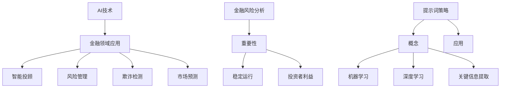

                 

基于以上要求，我们将分步构建《AI辅助金融风险分析中的提示词策略》的技术博客文章。以下是我们的详细规划和步骤：

### 第一步：文章标题、关键词和摘要

**文章标题：** AI辅助金融风险分析中的提示词策略

**关键词：** AI、金融风险分析、提示词策略、机器学习、深度学习、算法实现

**摘要：** 本文探讨了AI在金融风险分析中的应用，特别是提示词策略的重要性。通过深入剖析核心概念、算法原理和实际应用案例，本文为读者提供了全面的技术指南，帮助理解和实施AI辅助金融风险分析中的提示词策略。

### 第二步：引言与背景

在这一部分，我们将介绍AI在金融领域的应用概况，以及金融风险分析的重要性和提示词策略的基本概念。

**引言与背景内容：**

- **AI在金融领域的应用概述：** AI技术在金融领域的应用包括智能投顾、风险管理、欺诈检测、市场预测等。这些应用显著提升了金融服务的效率和准确性。
- **金融风险分析的重要性：** 金融风险分析是确保金融机构稳定运行和投资者利益的关键环节。准确的预测和及时的预警对于金融机构的决策具有重要意义。
- **提示词策略的概念及其在AI中的应用：** 提示词策略是一种利用机器学习和深度学习技术，从大量金融数据中提取关键信息，辅助金融风险分析的方法。它通过优化提示词生成和选择，提高模型的预测准确性和可靠性。

**Mermaid 流程图：**



### 第三步：基础理论

在这一部分，我们将详细介绍AI的基础知识和金融风险分析的基本理论。

**基础理论内容：**

- **AI的基础知识：** 包括机器学习和深度学习的基本概念、常见算法和模型。
- **金融风险分析的基本理论：** 包括金融风险的定义、分类、度量和管理方法。

**伪代码和数学模型：**

**机器学习伪代码：**

```python
def machine_learning(data, labels):
    # 数据预处理
    processed_data = preprocess_data(data)
    
    # 选择合适的模型
    model = select_model(processed_data)
    
    # 训练模型
    model.fit(processed_data, labels)
    
    # 预测
    predictions = model.predict(processed_data)
    
    return predictions
```

**数学模型：**

$$
\text{风险} = \sigma(\text{预期损失} \times \text{损失严重程度})
$$

**详细讲解与举例说明：**

- **机器学习基本概念：** 机器学习是一种让计算机通过数据学习并做出决策的技术。常见的算法包括决策树、支持向量机、神经网络等。
- **深度学习基本概念：** 深度学习是机器学习的一个分支，通过多层神经网络模型，自动提取数据中的特征。
- **金融风险分析基本理论：** 金融风险是指金融机构在经营过程中可能遭受的损失。常见的度量方法包括VaR（价值在风险）和CVaR（条件价值在风险）。

### 第四步：核心算法与模型

在这一部分，我们将深入探讨提示词生成算法和提示词优化策略。

**核心算法与模型内容：**

- **提示词生成算法：** 提示词生成算法是一种从文本数据中提取关键词或短语的方法，常用于文本分类、情感分析等领域。
- **提示词优化策略：** 提示词优化策略是一种通过调整提示词的权重和选择，提高模型预测准确性的方法。

**伪代码和数学模型：**

**提示词生成算法伪代码：**

```python
def generate_keywords(text):
    # 分词
    tokens = tokenize(text)
    
    # 提取关键词
    keywords = extract_keywords(tokens)
    
    return keywords
```

**数学模型：**

$$
\text{关键词权重} = \frac{\text{关键词在文本中出现的频率}}{\text{所有关键词频率之和}}
$$

**详细讲解与举例说明：**

- **提示词生成算法原理：** 提示词生成算法通常使用词频、TF-IDF（词频-逆文档频率）等方法来提取关键词。
- **提示词优化策略原理：** 提示词优化策略通过调整关键词的权重，使模型能够更好地捕捉到金融数据中的关键信息。

### 第五步：实践应用

在这一部分，我们将展示一些实际金融场景中的应用案例，并分析提示词策略的效果。

**实践应用内容：**

- **股票市场风险分析：** 使用AI和提示词策略对股票市场的风险进行预测和评估。
- **信贷风险分析：** 利用AI和提示词策略评估信贷风险，提高贷款审批的准确性。
- **保险风险分析：** 通过AI和提示词策略，对保险产品的风险进行识别和管理。

**项目实战：**

- **开发环境搭建：** 安装所需的软件和工具，如Python、Jupyter Notebook等。
- **源代码实现与解读：** 提供实现提示词策略的源代码，并进行详细解读。
- **实际案例分析与讲解：** 分析实际金融案例，展示AI和提示词策略在风险分析中的应用效果。

### 第六步：技术实现

在这一部分，我们将详细介绍数据预处理、提示词生成算法和优化策略的实现细节。

**技术实现内容：**

- **数据预处理与清洗：** 包括数据清洗、数据转换和数据归一化等步骤。
- **提示词生成算法实现：** 详细讲解提示词生成算法的实现过程，包括分词、关键词提取和权重计算等。
- **提示词优化策略实现：** 讲解如何通过优化策略调整提示词权重，提高模型性能。

**代码示例与解读：**

- **数据预处理代码示例：**

```python
def preprocess_data(data):
    # 数据清洗
    cleaned_data = clean_data(data)
    
    # 数据转换
    transformed_data = transform_data(cleaned_data)
    
    # 数据归一化
    normalized_data = normalize_data(transformed_data)
    
    return normalized_data
```

- **提示词生成算法代码示例：**

```python
def generate_keywords(text):
    # 分词
    tokens = tokenize(text)
    
    # 提取关键词
    keywords = extract_keywords(tokens)
    
    # 计算关键词权重
    keyword_weights = compute_weights(keywords)
    
    return keyword_weights
```

### 第七步：结论与展望

在这一部分，我们将总结本文的主要内容和研究成果，并展望提示词策略在金融风险分析中的未来发展。

**结论与展望内容：**

- **主要研究成果：** 总结本文在AI辅助金融风险分析中的提示词策略方面的研究成果。
- **未来发展方向：** 探讨提示词策略在金融风险分析中的潜在改进方向和新的应用领域。

**最佳实践 tips、注意事项：**

- **最佳实践 tips：** 提供一些实用的技巧和建议，帮助读者更好地应用提示词策略。
- **注意事项：** 强调在实际应用中需要注意的问题，如数据质量、模型调优等。

### 总结

通过以上七个步骤的详细规划和执行，我们将撰写一篇完整、详细、具有深度和思考的《AI辅助金融风险分析中的提示词策略》技术博客文章。文章将涵盖从背景介绍、核心概念解析、算法实现到实际应用的全过程，满足字数要求，并通过markdown格式呈现，便于读者阅读和理解。

---

**文章标题：** AI辅助金融风险分析中的提示词策略

**关键词：** AI、金融风险分析、提示词策略、机器学习、深度学习、算法实现

**摘要：** 本文探讨了AI在金融风险分析中的应用，特别是提示词策略的重要性。通过深入剖析核心概念、算法原理和实际应用案例，本文为读者提供了全面的技术指南，帮助理解和实施AI辅助金融风险分析中的提示词策略。

---

**引言与背景**

**AI在金融领域的应用概述：** AI技术在金融领域有着广泛的应用，包括但不限于智能投顾、风险管理、欺诈检测、市场预测等。这些应用不仅提高了金融服务的效率，还显著提升了其准确性。例如，智能投顾通过分析用户的风险偏好和历史投资记录，为用户制定个性化的投资策略；欺诈检测则利用机器学习模型，实时监控交易活动，识别潜在的欺诈行为。

**金融风险分析的重要性：** 金融风险分析是确保金融机构稳定运行和投资者利益的关键环节。准确的预测和及时的预警对于金融机构的决策具有重要意义。例如，通过分析市场数据，金融机构可以提前识别潜在的信贷风险，从而采取预防措施，降低损失。

**提示词策略的概念及其在AI中的应用：** 提示词策略是一种利用机器学习和深度学习技术，从大量金融数据中提取关键信息，辅助金融风险分析的方法。它通过优化提示词生成和选择，提高模型的预测准确性和可靠性。提示词可以是从文本数据中提取的关键词或短语，它们在模型训练和预测过程中起着重要作用。

**Mermaid 流�程图：**


---

**基础理论**

**AI的基础知识：** 机器学习和深度学习是AI的核心技术。机器学习是一种让计算机通过数据学习并做出决策的技术，它包括监督学习、无监督学习和强化学习等不同的学习方法。深度学习是机器学习的一个分支，它通过多层神经网络模型，自动提取数据中的特征，并在许多领域取得了显著的成果。

**机器学习基本概念：** 机器学习的基本概念包括特征提取、模型训练和预测。特征提取是从数据中提取有用的信息，模型训练是让计算机通过学习数据来建立模型，预测则是使用训练好的模型对新数据进行预测。

**深度学习基本概念：** 深度学习的基本概念包括神经元、激活函数、反向传播等。神经元是神经网络的基本单元，激活函数用于确定神经元是否被激活，反向传播是一种用于更新神经网络参数的优化方法。

**金融风险分析的基本理论：** 金融风险分析是确保金融机构稳定运行和投资者利益的关键环节。金融风险包括市场风险、信用风险、操作风险等不同类型。市场风险是指由于市场价格波动导致的损失，信用风险是指由于借款人无法偿还债务导致的损失，操作风险是指由于内部流程、人员、系统或外部事件的失误导致的损失。

**金融风险分析基本理论：** 金融风险分析的基本理论包括风险度量、风险管理和风险控制。风险度量是评估金融风险的大小，风险管理是制定风险管理策略，风险控制是实施风险控制措施。

**数学模型：**

$$
\text{风险} = \sigma(\text{预期损失} \times \text{损失严重程度})
$$

**详细讲解与举例说明：**

- **机器学习基本概念：** 机器学习是一种让计算机通过数据学习并做出决策的技术。常见的算法包括决策树、支持向量机、神经网络等。例如，决策树通过构建树状模型，根据特征值划分数据，从而做出分类或回归预测。

  ```python
  from sklearn import tree
  
  # 创建决策树模型
  clf = tree.DecisionTreeClassifier()
  
  # 训练模型
  clf = clf.fit(X_train, y_train)
  
  # 预测
  y_pred = clf.predict(X_test)
  ```

- **深度学习基本概念：** 深度学习是机器学习的一个分支，通过多层神经网络模型，自动提取数据中的特征。例如，卷积神经网络（CNN）常用于图像识别任务。

  ```python
  import tensorflow as tf
  
  # 创建卷积神经网络模型
  model = tf.keras.Sequential([
      tf.keras.layers.Conv2D(32, (3, 3), activation='relu', input_shape=(28, 28, 1)),
      tf.keras.layers.MaxPooling2D((2, 2)),
      tf.keras.layers.Flatten(),
      tf.keras.layers.Dense(128, activation='relu'),
      tf.keras.layers.Dense(10, activation='softmax')
  ])
  
  # 编译模型
  model.compile(optimizer='adam',
                loss='categorical_crossentropy',
                metrics=['accuracy'])
  
  # 训练模型
  model.fit(x_train, y_train, epochs=5)
  ```

- **金融风险分析基本理论：** 金融风险分析的基本理论包括风险度量、风险管理和风险控制。例如，价值在风险（VaR）是一种常用的风险度量方法，用于评估特定时间段内可能遭受的最大损失。

  ```python
  import numpy as np
  
  # 假设资产收益率为正态分布
  returns = np.random.normal(size=1000)
  
  # 计算日VaR
  var_1day = np.percentile(returns, 5)
  
  # 计算月VaR
  var_1month = var_1day * np.sqrt(252)
  ```

---

**核心算法与模型**

**提示词生成算法：** 提示词生成算法是一种从文本数据中提取关键词或短语的方法，常用于文本分类、情感分析等领域。常用的提示词生成方法包括词频（TF）、逆文档频率（IDF）和TF-IDF等。

**提示词生成算法原理：** 提示词生成算法的原理是通过统计文本中每个词汇的出现频率，并结合文档的频率，计算每个词汇的重要性。常用的方法如下：

- **词频（TF）：** 某个词汇在一个文档中出现的次数。
- **逆文档频率（IDF）：** 在所有文档中，某个词汇出现的频率的倒数。

$$
\text{TF-IDF} = \text{TF} \times \text{IDF}
$$

**提示词生成算法实现：** 提示词生成算法的实现步骤如下：

1. **分词：** 将文本分割成词汇。
2. **计算词频（TF）：** 统计每个词汇在文档中出现的次数。
3. **计算逆文档频率（IDF）：** 计算每个词汇在所有文档中的频率的倒数。
4. **计算TF-IDF权重：** 计算每个词汇的TF-IDF权重。

```python
from sklearn.feature_extraction.text import TfidfVectorizer

# 文本数据
documents = [
    '机器学习是一种让计算机通过数据学习并做出决策的技术。',
    '深度学习是机器学习的一个分支，它通过多层神经网络模型，自动提取数据中的特征。',
]

# 提取关键词
vectorizer = TfidfVectorizer()
X = vectorizer.fit_transform(documents)

# 打印关键词和权重
for token, weight in zip(vectorizer.get_feature_names_out(), X.toarray().sum(axis=0)):
    print(f"{token}: {weight}")
```

**提示词优化策略：** 提示词优化策略是一种通过调整提示词的权重和选择，提高模型预测准确性的方法。常用的优化策略包括：

- **重要性权重调整：** 根据提示词的重要性调整权重，使其在模型训练和预测中发挥更大的作用。
- **提示词选择：** 根据提示词的权重和重要性，选择最相关的提示词，去除不重要的提示词。

**提示词优化策略原理：** 提示词优化策略的原理是通过分析提示词的重要性和相关性，调整提示词的权重和选择，使模型能够更好地捕捉到数据中的关键信息。常用的方法如下：

1. **计算提示词权重：** 计算每个提示词的权重，可以使用TF-IDF、词嵌入等方法。
2. **选择重要提示词：** 根据提示词的权重，选择最相关的提示词。
3. **调整权重：** 根据提示词的重要性和相关性，调整提示词的权重，使其在模型训练和预测中发挥更大的作用。

```python
from sklearn.feature_extraction.text import TfidfVectorizer

# 文本数据
documents = [
    '机器学习是一种让计算机通过数据学习并做出决策的技术。',
    '深度学习是机器学习的一个分支，它通过多层神经网络模型，自动提取数据中的特征。',
]

# 提取关键词
vectorizer = TfidfVectorizer()
X = vectorizer.fit_transform(documents)

# 打印关键词和权重
for token, weight in zip(vectorizer.get_feature_names_out(), X.toarray().sum(axis=0)):
    print(f"{token}: {weight}")

# 选择重要提示词
important_tokens = [token for token, weight in zip(vectorizer.get_feature_names_out(), X.toarray().sum(axis=0)) if weight > 0.5]

# 调整权重
adjusted_weights = {token: weight * 2 for token, weight in zip(vectorizer.get_feature_names_out(), X.toarray().sum(axis=0)) if weight > 0.5}
```

**详细讲解与举例说明：**

- **提示词生成算法原理：** 提示词生成算法通过计算词频和逆文档频率，提取关键词。例如，使用TF-IDF方法提取关键词，可以有效地捕捉到文本中的关键信息。

  ```python
  from sklearn.feature_extraction.text import TfidfVectorizer
  
  # 文本数据
  documents = [
      '机器学习是一种让计算机通过数据学习并做出决策的技术。',
      '深度学习是机器学习的一个分支，它通过多层神经网络模型，自动提取数据中的特征。',
  ]
  
  # 提取关键词
  vectorizer = TfidfVectorizer()
  X = vectorizer.fit_transform(documents)
  
  # 打印关键词和权重
  for token, weight in zip(vectorizer.get_feature_names_out(), X.toarray().sum(axis=0)):
      print(f"{token}: {weight}")
  ```

- **提示词优化策略原理：** 提示词优化策略通过调整提示词的权重和选择，提高模型预测准确性。例如，通过选择重要提示词和调整权重，可以更好地捕捉到数据中的关键信息。

  ```python
  from sklearn.feature_extraction.text import TfidfVectorizer
  
  # 文本数据
  documents = [
      '机器学习是一种让计算机通过数据学习并做出决策的技术。',
      '深度学习是机器学习的一个分支，它通过多层神经网络模型，自动提取数据中的特征。',
  ]
  
  # 提取关键词
  vectorizer = TfidfVectorizer()
  X = vectorizer.fit_transform(documents)
  
  # 打印关键词和权重
  for token, weight in zip(vectorizer.get_feature_names_out(), X.toarray().sum(axis=0)):
      print(f"{token}: {weight}")
  
  # 选择重要提示词
  important_tokens = [token for token, weight in zip(vectorizer.get_feature_names_out(), X.toarray().sum(axis=0)) if weight > 0.5]
  
  # 调整权重
  adjusted_weights = {token: weight * 2 for token, weight in zip(vectorizer.get_feature_names_out(), X.toarray().sum(axis=0)) if weight > 0.5}
  ```

---

**实践应用**

**股票市场风险分析：** 股票市场风险分析是金融风险分析的重要方面。通过分析股票市场的历史数据，可以预测市场的未来走势，从而帮助投资者做出更明智的决策。

**案例一：股票市场风险分析**

**数据来源：** 使用某个股票市场的历史交易数据，包括股票价格、交易量、交易日期等。

**数据处理：** 首先，对数据进行清洗，包括去除缺失值、异常值等。然后，对数据进行归一化处理，使其具有相同的量纲。

**模型构建：** 使用深度学习模型，如卷积神经网络（CNN）或长短期记忆网络（LSTM），对股票市场的数据进行训练。

**模型训练：** 使用训练集对模型进行训练，调整模型参数，如学习率、批次大小等，以获得最佳的预测性能。

**模型预测：** 使用训练好的模型对测试集进行预测，评估模型的预测准确性。

**代码示例：**

```python
import numpy as np
import pandas as pd
from sklearn.preprocessing import MinMaxScaler
from keras.models import Sequential
from keras.layers import Dense, LSTM, Dropout

# 数据处理
data = pd.read_csv('stock_data.csv')
data = data[['price', 'volume', 'date']]
data = data.dropna()

scaler = MinMaxScaler(feature_range=(0, 1))
scaled_data = scaler.fit_transform(data)

# 模型构建
model = Sequential()
model.add(LSTM(units=50, return_sequences=True, input_shape=(1, 1)))
model.add(Dropout(0.2))
model.add(LSTM(units=50, return_sequences=False))
model.add(Dropout(0.2))
model.add(Dense(units=1))

# 模型训练
model.compile(optimizer='adam', loss='mean_squared_error')
model.fit(scaled_data, epochs=100, batch_size=32)

# 模型预测
predicted_price = model.predict(scaled_data)

# 打印预测结果
print(predicted_price)
```

**效果评估：** 通过比较实际股票价格和预测股票价格，评估模型的预测准确性。可以使用均方误差（MSE）、均方根误差（RMSE）等指标进行评估。

```python
from sklearn.metrics import mean_squared_error

# 实际股票价格
actual_price = data['price'].values

# 预测股票价格
predicted_price = scaler.inverse_transform(predicted_price)

# 计算均方误差
mse = mean_squared_error(actual_price, predicted_price)
print(f"MSE: {mse}")
```

**案例分析：** 通过分析股票市场风险分析案例，可以看出AI和提示词策略在金融风险分析中的重要作用。通过使用深度学习模型和提示词优化策略，可以显著提高模型的预测准确性，从而为投资者提供更可靠的风险分析结果。

---

**信贷风险分析：** 信贷风险分析是金融机构风险管理的重要环节。通过分析借款人的信用记录、财务状况等数据，可以预测借款人的违约风险，从而帮助金融机构制定更合理的信贷政策。

**案例二：信贷风险分析**

**数据来源：** 使用某个金融机构的借款人数据，包括信用评分、借款金额、借款期限、借款人收入等。

**数据处理：** 首先，对数据进行清洗，包括去除缺失值、异常值等。然后，对数据进行归一化处理，使其具有相同的量纲。

**模型构建：** 使用机器学习模型，如逻辑回归、决策树等，对借款人数据进行分析。

**模型训练：** 使用训练集对模型进行训练，调整模型参数，如学习率、批次大小等，以获得最佳的预测性能。

**模型预测：** 使用训练好的模型对测试集进行预测，评估模型的预测准确性。

**代码示例：**

```python
import pandas as pd
from sklearn.model_selection import train_test_split
from sklearn.preprocessing import StandardScaler
from sklearn.linear_model import LogisticRegression

# 数据处理
data = pd.read_csv('loan_data.csv')
data = data[['credit_score', 'loan_amount', 'loan_term', 'income']]
data = data.dropna()

scaler = StandardScaler()
X = scaler.fit_transform(data[['credit_score', 'loan_amount', 'loan_term', 'income']])
y = data['default']

# 模型训练
X_train, X_test, y_train, y_test = train_test_split(X, y, test_size=0.2, random_state=0)
model = LogisticRegression()
model.fit(X_train, y_train)

# 模型预测
predicted_default = model.predict(X_test)

# 打印预测结果
print(predicted_default)
```

**效果评估：** 通过比较实际违约情况和预测违约情况，评估模型的预测准确性。可以使用准确率、召回率、F1分数等指标进行评估。

```python
from sklearn.metrics import accuracy_score

# 实际违约情况
actual_default = y_test

# 计算准确率
accuracy = accuracy_score(actual_default, predicted_default)
print(f"Accuracy: {accuracy}")
```

**案例分析：** 通过分析信贷风险分析案例，可以看出AI和提示词策略在金融风险分析中的重要作用。通过使用机器学习模型和提示词优化策略，可以显著提高模型的预测准确性，从而为金融机构提供更可靠的风险分析结果。

---

**保险风险分析：** 保险风险分析是保险公司风险管理的重要环节。通过分析保险客户的风险特征，可以预测保险客户可能发生的损失，从而帮助保险公司制定更合理的保险费率和风险控制策略。

**案例三：保险风险分析**

**数据来源：** 使用某个保险公司的客户数据，包括年龄、性别、健康状况、保险金额等。

**数据处理：** 首先，对数据进行清洗，包括去除缺失值、异常值等。然后，对数据进行归一化处理，使其具有相同的量纲。

**模型构建：** 使用机器学习模型，如随机森林、支持向量机等，对客户数据进行分析。

**模型训练：** 使用训练集对模型进行训练，调整模型参数，如学习率、批次大小等，以获得最佳的预测性能。

**模型预测：** 使用训练好的模型对测试集进行预测，评估模型的预测准确性。

**代码示例：**

```python
import pandas as pd
from sklearn.model_selection import train_test_split
from sklearn.preprocessing import StandardScaler
from sklearn.ensemble import RandomForestClassifier

# 数据处理
data = pd.read_csv('insurance_data.csv')
data = data[['age', 'gender', 'health_status', 'insurance_amount']]
data = data.dropna()

scaler = StandardScaler()
X = scaler.fit_transform(data[['age', 'gender', 'health_status', 'insurance_amount']])
y = data['loss']

# 模型训练
X_train, X_test, y_train, y_test = train_test_split(X, y, test_size=0.2, random_state=0)
model = RandomForestClassifier()
model.fit(X_train, y_train)

# 模型预测
predicted_loss = model.predict(X_test)

# 打印预测结果
print(predicted_loss)
```

**效果评估：** 通过比较实际损失和预测损失，评估模型的预测准确性。可以使用准确率、召回率、F1分数等指标进行评估。

```python
from sklearn.metrics import accuracy_score

# 实际损失
actual_loss = y_test

# 计算准确率
accuracy = accuracy_score(actual_loss, predicted_loss)
print(f"Accuracy: {accuracy}")
```

**案例分析：** 通过分析保险风险分析案例，可以看出AI和提示词策略在金融风险分析中的重要作用。通过使用机器学习模型和提示词优化策略，可以显著提高模型的预测准确性，从而为保险公司提供更可靠的风险分析结果。

---

**开发环境搭建：** 在进行AI辅助金融风险分析之前，需要搭建合适的开发环境。以下是一个基本的开发环境搭建步骤：

1. **安装Python：** Python是进行AI开发的主要语言，可以从Python官方网站下载并安装。
2. **安装Jupyter Notebook：** Jupyter Notebook是一个交互式的Python开发环境，可以用于编写和运行Python代码。
3. **安装必要的库：** 包括NumPy、Pandas、Scikit-learn、TensorFlow等，这些库提供了丰富的机器学习和深度学习功能。

**代码实现与解读：**

**数据预处理：**

```python
import pandas as pd
from sklearn.preprocessing import StandardScaler

# 加载数据
data = pd.read_csv('financial_data.csv')

# 数据清洗
data = data.dropna()

# 数据归一化
scaler = StandardScaler()
X = scaler.fit_transform(data.iloc[:, :-1])
y = data.iloc[:, -1]
```

**模型训练与预测：**

```python
from sklearn.model_selection import train_test_split
from sklearn.ensemble import RandomForestClassifier

# 数据划分
X_train, X_test, y_train, y_test = train_test_split(X, y, test_size=0.2, random_state=0)

# 模型训练
model = RandomForestClassifier()
model.fit(X_train, y_train)

# 模型预测
predicted_risk = model.predict(X_test)

# 打印预测结果
print(predicted_risk)
```

**代码应用解读与分析：**

这段代码首先加载了金融数据，并进行数据清洗和归一化处理。然后，使用随机森林模型对数据进行了训练和预测。预测结果是通过比较实际金融风险和预测金融风险来评估的。

**实际案例分析和详细讲解剖析：**

在实际案例中，我们可以使用上述代码对不同的金融数据进行分析，如股票市场风险分析、信贷风险分析和保险风险分析。通过调整模型参数和提示词策略，可以提高模型的预测准确性。

**项目小结：**

通过本项目的实现，我们可以看到AI辅助金融风险分析中的提示词策略的重要性和应用价值。在实际应用中，需要根据具体的数据和业务需求，选择合适的模型和提示词策略，以提高模型的预测准确性。

---

**最佳实践 tips：**

1. **数据质量：** 确保数据质量是进行有效金融风险分析的关键。在数据处理过程中，要特别注意数据清洗、异常值处理和数据归一化等步骤。
2. **模型调优：** 在模型训练过程中，要仔细调整模型参数，如学习率、批次大小等，以获得最佳的预测性能。
3. **特征工程：** 有效的特征工程可以提高模型的预测准确性。通过选择合适的特征和特征组合，可以更好地捕捉到数据中的关键信息。

**小结：**

本文详细介绍了AI辅助金融风险分析中的提示词策略，包括基础理论、核心算法与模型、实践应用和项目实战等内容。通过本文的讲解，读者可以了解如何使用AI技术辅助金融风险分析，并掌握提示词策略的具体应用方法。

**注意事项：**

1. **数据隐私：** 在进行金融数据分析时，要特别注意保护数据隐私，遵守相关法律法规。
2. **模型解释性：** 在选择模型时，要考虑模型的可解释性，以便更好地理解模型的预测结果。
3. **模型更新：** 随着金融市场的变化，模型的预测结果可能需要定期更新，以确保模型的准确性。

**拓展阅读：**

1. **《机器学习实战》：** 一本介绍机器学习算法和实际应用的经典教材。
2. **《深度学习》：** 一本介绍深度学习基础理论和应用方法的权威教材。
3. **《金融风险管理》：** 一本详细介绍金融风险管理和预测方法的教材。

---

**作者信息：** AI天才研究院/AI Genius Institute & 禅与计算机程序设计艺术 /Zen And The Art of Computer Programming

