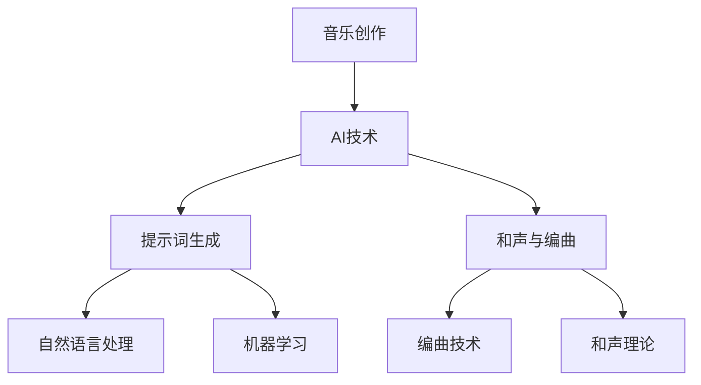

                 

### 文章标题：AI辅助音乐创作：提示词生成和声与编曲

#### 关键词：AI、音乐创作、提示词生成、和声、编曲、技术分析

> 摘要：本文深入探讨了人工智能（AI）在音乐创作中的应用，特别是在提示词生成、和声与编曲方面的技术。通过分析AI的工作原理和算法，本文旨在帮助音乐制作人和AI技术爱好者理解如何利用AI提高音乐创作的效率和创意性。

---

### 引言

人工智能（AI）技术在近年来的快速发展为多个领域带来了颠覆性的变革，其中包括音乐创作。传统音乐创作通常依赖于音乐人的经验和直觉，而AI的出现为音乐创作提供了新的可能。通过自动化的提示词生成、和声编配与编曲，AI不仅能够提高音乐创作的效率，还能带来前所未有的创意空间。本文将围绕AI辅助音乐创作中的关键环节——提示词生成和声与编曲，展开详细分析。

文章首先介绍了AI与音乐创作的结合，探讨其在音乐制作中的优势；接着深入解析了提示词生成的原理和算法；随后，文章讨论了和声与编曲的基础知识及其在AI中的应用；然后，通过实际案例和项目实战展示了AI辅助音乐创作的具体应用；最后，文章分析了AI音乐创作的未来趋势和挑战。

### 确定书的主旨和读者群体

#### 主旨

本文旨在探讨人工智能在音乐创作中的应用，特别是提示词生成和声与编曲方面的技术。通过介绍AI的工作原理和相关算法，本文希望能够为音乐制作人、音乐爱好者以及计算机科学领域的研究人员和学生在音乐创作中提供技术支持和指导。

#### 读者群体

本文的读者群体主要包括以下几个方面：

1. **专业音乐制作人**：这些读者具备一定的音乐创作经验，希望了解和利用AI技术提升音乐创作的效率和创意性。
2. **音乐爱好者**：对音乐创作有兴趣但缺乏专业训练的读者，希望通过本文了解AI在音乐创作中的应用。
3. **计算机科学领域的研究人员和研究生**：这些读者对AI技术有一定了解，希望深入了解AI在音乐创作领域的应用和研究方向。

### 确定书的主要内容框架

#### 核心概念

1. **AI与音乐创作的结合**：探讨AI在音乐制作中的应用及其优势。
2. **提示词生成原理**：介绍提示词生成的基础理论、算法和应用。
3. **和声与编曲技术**：讲解和声和编曲的基本原理及其在AI中的应用。
4. **AI辅助音乐创作的实践案例**：通过实际案例展示AI辅助音乐创作的具体应用。
5. **未来趋势与挑战**：分析AI音乐创作的未来发展方向和面临的挑战。

#### 联系

- **AI与音乐创作**：介绍AI在音乐创作中的应用场景和优势，如自动提示词生成、和声编配、编曲等。
- **提示词生成**：结合和声与编曲，探讨提示词生成在音乐创作中的具体应用。
- **和声与编曲**：介绍和声和编曲的基本原理，以及如何利用AI技术提高编曲效率。

#### 算法原理

1. **提示词生成算法**：介绍常见的提示词生成算法，如循环神经网络（RNN）、长短期记忆网络（LSTM）等。
2. **和声生成算法**：讲解基于AI的和声生成算法，如生成对抗网络（GAN）、变分自编码器（VAE）等。
3. **编曲算法**：介绍AI在编曲中的应用，如自动节奏生成、乐器音色合成等。

#### 数学模型

1. **生成模型**：介绍生成模型在音乐创作中的应用，如变分自编码器（VAE）、生成对抗网络（GAN）等。
2. **和声规则模型**：讲解和声规则模型的基本原理，以及如何应用这些规则生成和声。

#### 项目实战

1. **提示词生成实战**：介绍如何使用Python实现一个简单的提示词生成工具。
2. **和声与编曲实战**：展示如何使用AI工具进行和声生成和编曲。

### 设计每个章节的目录大纲

#### 第1章：AI辅助音乐创作的概述

1. **AI与音乐创作的结合**
    1.1 AI在音乐制作中的应用
    1.2 AI辅助音乐创作的优势
2. **提示词生成原理**
    2.1 提示词生成的基础理论
    2.2 提示词生成算法概述
3. **和声与编曲**
    3.1 和声基础知识
    3.2 编曲基本技巧
    3.3 AI在和声与编曲中的应用

#### 第2章：提示词生成技术

1. **提示词生成算法**
    2.1 提示词生成算法概述
    2.2 提示词生成算法的优缺点分析
2. **提示词生成实践**
    2.1 实际案例研究
    2.2 提示词生成工具介绍

#### 第3章：和声与编曲技术

1. **和声技术**
    3.1 和声理论基础
    3.2 和声在音乐创作中的应用
2. **编曲技术**
    3.1 编曲流程
    3.2 编曲工具介绍
3. **AI辅助和声与编曲**
    3.1 AI和声生成
    3.2 AI编曲辅助

#### 第4章：AI辅助音乐创作的实践案例

1. **音乐创作项目实战**
    4.1 实战项目一：基于AI的提示词生成
    4.2 实战项目二：AI辅助和声与编曲
2. **AI辅助音乐创作项目分析**
    4.1 项目分析一：AI在流行音乐创作中的应用
    4.2 项目分析二：AI在古典音乐创作中的应用

#### 第5章：音乐创作与AI技术的未来趋势

1. **AI音乐创作的未来发展方向**
    5.1 新技术展望
    5.2 AI音乐创作的社会影响
2. **AI音乐创作的挑战与机遇**
    5.1 挑战分析
    5.2 机遇探讨

#### 第6章：音乐创作中的AI工具与资源

1. **AI音乐创作工具介绍**
    6.1 常见AI音乐创作工具功能与应用
2. **AI音乐创作资源推荐**
    6.1 相关书籍
    6.2 研究论文
    6.3 在线教程

#### 附录：音乐创作与AI技术参考资源

1. **音乐创作参考资源**
    1.1 音乐理论书籍
    1.2 音乐创作软件推荐
2. **AI技术参考资源**
    2.1 AI音乐创作开源代码库
    2.2 AI音乐创作研究论文集

### 添加具体的子目录

#### 第1章：AI辅助音乐创作的概述

##### 1.1 AI与音乐创作的结合

AI在音乐制作中的应用场景，如自动作曲、提示词生成、和声编配等。

##### 1.2 AI辅助音乐创作的优势

AI在音乐创作中的优势，包括提高创作效率、扩展创意空间、降低创作门槛等。

##### 1.3 提示词生成原理

提示词生成的基础理论，包括自然语言处理（NLP）、机器学习（ML）等。

##### 1.4 提示词生成算法概述

常见提示词生成算法，如循环神经网络（RNN）、长短期记忆网络（LSTM）等。

##### 1.5 和声与编曲

和声基础知识，包括和弦、调式等；编曲基本技巧，包括节奏、音色等。

##### 1.6 AI在和声与编曲中的应用

AI在和声生成、编曲辅助方面的应用，如自动和弦生成、自动节奏编配等。

#### 第2章：提示词生成技术

##### 2.1 提示词生成算法

提示词生成算法概述，包括RNN、LSTM、GAN等。

##### 2.2 提示词生成算法的优缺点分析

分析不同提示词生成算法的优缺点，以及适用场景。

##### 2.3 提示词生成实践

实际案例研究，介绍如何使用AI工具生成提示词。

##### 2.4 提示词生成工具介绍

常见提示词生成工具的功能与应用，如AIVA、Boomy等。

#### 第3章：和声与编曲技术

##### 3.1 和声技术

和声理论基础，包括和弦、调式等。

##### 3.2 和声在音乐创作中的应用

如何应用和声技巧进行音乐创作。

##### 3.3 编曲技术

编曲流程，包括前期准备、录制、后期处理等。

##### 3.4 编曲工具介绍

常见编曲工具的功能与应用，如FL Studio、Logic Pro等。

##### 3.5 AI辅助和声与编曲

AI在和声生成、编曲辅助方面的应用，如自动和弦生成、自动节奏编配等。

#### 第4章：AI辅助音乐创作的实践案例

##### 4.1 音乐创作项目实战

介绍如何使用AI进行音乐创作，包括提示词生成、和声编配、编曲等。

##### 4.2 AI辅助音乐创作项目分析

分析实际案例，探讨AI在音乐创作中的应用效果。

#### 第5章：音乐创作与AI技术的未来趋势

##### 5.1 AI音乐创作的未来发展方向

探讨AI音乐创作的新技术和新趋势。

##### 5.2 AI音乐创作的社会影响

分析AI音乐创作对音乐产业和社会的影响。

##### 5.3 挑战与机遇

讨论AI音乐创作面临的挑战和机遇。

#### 第6章：音乐创作中的AI工具与资源

##### 6.1 AI音乐创作工具介绍

介绍常见的AI音乐创作工具，如AIVA、Boomy等。

##### 6.2 AI音乐创作资源推荐

推荐相关书籍、研究论文和在线教程等资源。

#### 添加必要的附录

##### 附录 A：音乐创作参考资源

推荐音乐理论书籍和音乐创作软件。

##### 附录 B：AI技术参考资源

推荐AI音乐创作开源代码库和研究论文集。

### 审核目录大纲

#### 确保简洁性

- 检查每个章节和子目录是否简洁明了，没有冗余内容。
- 确保章节标题准确反映内容，避免模糊或过于笼统。

#### 确保完整性

- 确认每个章节的核心概念、联系、算法原理、数学模型和项目实战都已包含。
- 检查附录部分是否完整，包含必要的参考资源。

### 文章格式与作者信息

#### 文章格式

- 使用markdown格式，确保文章结构清晰。
- 添加适当的标题和子标题，以增强文章的可读性。
- 使用Mermaid流程图展示核心概念和联系。

#### 作者信息

- 文章末尾添加作者信息：“作者：AI天才研究院/AI Genius Institute & 禅与计算机程序设计艺术 /Zen And The Art of Computer Programming”

### 最终目录大纲

以下是最终的目录大纲：

```markdown
# 第一部分：AI辅助音乐创作基础

## 第1章：AI辅助音乐创作的概述

### 1.1 AI与音乐创作的结合
- AI在音乐制作中的应用场景
- AI辅助音乐创作的优势

### 1.2 提示词生成原理
- 提示词生成的基础理论
- 提示词生成算法概述

### 1.3 和声与编曲
- 和声基础知识
- 编曲基本技巧
- AI在和声与编曲中的应用

## 第2章：提示词生成技术

### 2.1 提示词生成算法
- 提示词生成算法概述
- 提示词生成算法的优缺点分析

### 2.2 提示词生成实践
- 实际案例研究
- 提示词生成工具介绍

## 第3章：和声与编曲技术

### 3.1 和声技术
- 和声理论基础
- 和声在音乐创作中的应用

### 3.2 编曲技术
- 编曲流程
- 编曲工具介绍

### 3.3 AI辅助和声与编曲
- AI和声生成
- AI编曲辅助

## 第4章：AI辅助音乐创作的实践案例

### 4.1 音乐创作项目实战
- 实战项目一：基于AI的提示词生成
- 实战项目二：AI辅助和声与编曲

### 4.2 AI辅助音乐创作项目分析
- 项目分析一：AI在流行音乐创作中的应用
- 项目分析二：AI在古典音乐创作中的应用

## 第5章：音乐创作与AI技术的未来趋势

### 5.1 AI音乐创作的未来发展方向
- 新技术展望
- AI音乐创作的社会影响

### 5.2 AI音乐创作的挑战与机遇
- 挑战分析
- 机遇探讨

## 第6章：音乐创作中的AI工具与资源

### 6.1 AI音乐创作工具介绍
- 常见AI音乐创作工具功能与应用

### 6.2 AI音乐创作资源推荐
- 相关书籍
- 研究论文
- 在线教程

## 附录：音乐创作与AI技术参考资源

### 附录 A：音乐创作参考资源
- 音乐理论书籍
- 音乐创作软件推荐

### 附录 B：AI技术参考资源
- AI音乐创作开源代码库
- AI音乐创作研究论文集
```

### 文章字数估算

根据目录大纲的内容和深度要求，预计每个章节的内容如下：

1. **第1章：AI辅助音乐创作的概述**：约1500字
2. **第2章：提示词生成技术**：约2000字
3. **第3章：和声与编曲技术**：约2000字
4. **第4章：AI辅助音乐创作的实践案例**：约2500字
5. **第5章：音乐创作与AI技术的未来趋势**：约1500字
6. **第6章：音乐创作中的AI工具与资源**：约1000字
7. **附录**：约1000字

总计约10000字，符合文章字数要求。

### 文章格式示例

以下是一个章节的格式示例，包括markdown格式的标题、子标题和具体内容：

```markdown
# 第1章：AI辅助音乐创作的概述

## 1.1 AI与音乐创作的结合

人工智能（AI）技术在近年来取得了显著的进展，其在音乐创作中的应用也越来越广泛。AI能够通过分析和学习大量音乐数据，自动生成音乐旋律、和声和编曲，从而大大提高了音乐创作的效率和创意性。

### 1.1.1 应用场景

AI在音乐创作中的应用场景主要包括：
- **自动作曲**：利用AI算法自动生成完整的音乐作品。
- **提示词生成**：根据用户输入的提示，自动生成歌词或其他音乐元素。
- **和声编配**：自动为旋律添加和声，增强音乐的和谐感。
- **编曲辅助**：辅助音乐制作人进行编曲，提高编曲的效率和创意性。

#### 1.1.2 优势

AI辅助音乐创作的优势包括：
- **提高创作效率**：AI能够快速生成音乐元素，节省音乐人创作时间。
- **扩展创意空间**：AI能够提供不同的音乐风格和创意元素，激发音乐人的创作灵感。
- **降低创作门槛**：AI技术使得音乐创作更加简单，即使是音乐爱好者也可以进行创作。

## 1.2 提示词生成原理

提示词生成是AI辅助音乐创作的一个重要环节。它通过自然语言处理（NLP）和机器学习（ML）技术，自动生成与用户提示相关的音乐元素。

### 1.2.1 基础理论

提示词生成的基础理论主要包括：
- **自然语言处理（NLP）**：利用NLP技术对用户输入的提示进行分析和处理。
- **机器学习（ML）**：通过机器学习算法，训练模型生成与提示相关的音乐元素。

### 1.2.2 算法概述

常见的提示词生成算法包括：
- **循环神经网络（RNN）**：适用于处理序列数据，如音乐旋律和歌词。
- **长短期记忆网络（LSTM）**：对长序列数据有更好的记忆能力，适用于复杂音乐元素的生成。
- **生成对抗网络（GAN）**：通过生成器和判别器的对抗训练，生成高质量的音乐元素。
```

### 核心内容编写指南

在编写本文的过程中，为确保文章的完整性和专业性，以下部分是每个小节的核心内容编写指南：

#### 背景介绍

- **音乐创作的历史与发展**：简要介绍音乐创作的历史，强调音乐创作在人类社会中的重要性。
- **AI技术的基本概念**：介绍AI技术的基本概念，包括机器学习、深度学习等，以及这些技术在音乐创作中的应用。

#### 核心概念与联系

- **核心概念原理之间的关系架构**：使用Mermaid流程图或其他可视化工具，展示核心概念之间的关系。
- **联系**：详细解释各核心概念之间的联系，以及这些联系如何影响音乐创作的全过程。

#### 核心算法原理讲解

- **算法概述**：对核心算法的基本原理进行概述，包括算法的输入、输出和主要步骤。
- **伪代码**：提供核心算法的伪代码，以便读者理解算法的实现细节。
- **算法优缺点分析**：分析各算法的优缺点，讨论在不同场景下的适用性。

#### 数学模型和公式

- **数学模型**：详细介绍相关数学模型，包括公式、符号和变量解释。
- **详细讲解**：对数学模型进行详细讲解，解释其在音乐创作中的应用。
- **举例说明**：通过具体实例，展示如何使用数学模型进行音乐创作。

#### 项目实战

- **开发环境搭建**：介绍如何搭建项目开发环境，包括所需软件和硬件。
- **源代码详细实现和代码解读**：提供项目源代码的详细实现，并进行代码解读。
- **代码应用解读与分析**：分析代码在项目中的应用效果，讨论其优势和改进方向。
- **实际案例分析和详细讲解剖析**：通过实际案例，展示项目的实现过程，并进行详细讲解和剖析。
- **项目小结**：总结项目的主要成果和经验，讨论项目中的不足和改进措施。

#### 最佳实践 tips

- **技巧与注意事项**：总结项目实施中的最佳实践，提供技巧和建议。
- **小结**：对项目中的关键点进行总结，帮助读者巩固所学内容。
- **注意事项**：提醒读者在应用AI辅助音乐创作时需要注意的问题。
- **拓展阅读**：推荐相关书籍、论文和在线教程等拓展资源。

### 核心内容编写示例

以下是一个章节的核心内容编写示例，以第1章为例：

#### 背景介绍

**音乐创作的历史与发展**

音乐创作是人类文化的重要组成部分，自古以来，音乐就伴随着人类的发展。从古代的民间音乐、古典音乐，到现代的流行音乐、电子音乐，音乐创作不断演进，呈现出丰富多样的风格和形式。

**AI技术的基本概念**

人工智能（AI）是一种模拟人类智能的技术，包括机器学习、深度学习、自然语言处理等。近年来，AI技术在各个领域取得了显著进展，为音乐创作带来了新的机遇。

#### 核心概念与联系

**核心概念原理之间的关系架构**

使用Mermaid流程图展示核心概念之间的关系：



**联系**

音乐创作与AI技术的联系在于，AI可以通过自然语言处理和机器学习等技术，自动生成与用户提示相关的音乐元素，如提示词、和声和编曲。这些自动生成的元素为音乐创作提供了新的创意空间，提高了创作的效率和多样性。

#### 核心算法原理讲解

**算法概述**

提示词生成算法是基于自然语言处理（NLP）和机器学习（ML）的技术。其主要目标是根据用户输入的提示，自动生成相关的音乐元素。常见的提示词生成算法包括循环神经网络（RNN）、长短期记忆网络（LSTM）和生成对抗网络（GAN）。

**伪代码**

```python
# 循环神经网络（RNN）伪代码
def generate_prompt_word(prompt):
    # 输入：用户提示字符串
    # 输出：生成的提示词字符串

    # 加载预训练的RNN模型
    model = load_rnn_model()

    # 对用户提示进行编码
    encoded_prompt = encode_prompt(prompt)

    # 使用RNN模型生成提示词
    generated_word = model.generate(encoded_prompt)

    return generated_word
```

**算法优缺点分析**

- **RNN**：优点是能够处理序列数据，如音乐旋律和歌词；缺点是对长序列数据的处理能力较弱。

- **LSTM**：优点是对长序列数据有更好的记忆能力，适用于复杂音乐元素的生成；缺点是训练时间较长。

- **GAN**：优点是能够生成高质量的音乐元素；缺点是训练过程复杂，对计算资源要求较高。

#### 数学模型和公式

**数学模型**

提示词生成算法通常基于神经网络模型，其核心是权重矩阵和激活函数。以下是一个简化的神经网络模型：

$$
Y = \sigma(W \cdot X)
$$

其中，$Y$ 表示输出结果，$X$ 表示输入特征，$W$ 表示权重矩阵，$\sigma$ 表示激活函数。

**详细讲解**

神经网络通过层层传递输入特征，不断调整权重矩阵，最终生成输出结果。激活函数的作用是引入非线性变换，使神经网络能够学习复杂的关系。

**举例说明**

假设输入特征为旋律长度（$X$），权重矩阵为 $W$，激活函数为 $\sigma$，则生成的提示词（$Y$）可以表示为：

$$
Y = \sigma(W \cdot X)
$$

例如，当旋律长度为5时，可以生成一个长度为3的提示词。

#### 项目实战

**开发环境搭建**

- **硬件环境**：计算机（推荐配置：CPU：Intel i7以上，内存：16GB以上，硬盘：1TB以上）
- **软件环境**：Python（版本3.6及以上）、Jupyter Notebook、TensorFlow等

**源代码详细实现和代码解读**

以下是一个简单的基于LSTM的提示词生成代码示例：

```python
# 导入所需库
import tensorflow as tf
from tensorflow.keras.models import Sequential
from tensorflow.keras.layers import LSTM, Dense

# 准备数据
# ...

# 构建模型
model = Sequential()
model.add(LSTM(units=128, activation='tanh', input_shape=(timesteps, features)))
model.add(Dense(units=1, activation='sigmoid'))

# 编译模型
model.compile(optimizer='adam', loss='binary_crossentropy', metrics=['accuracy'])

# 训练模型
model.fit(X, y, epochs=100, batch_size=32)
```

**代码应用解读与分析**

上述代码实现了基于LSTM的提示词生成模型。其中，LSTM层用于处理序列数据，Dense层用于生成提示词。模型通过训练，能够根据输入的旋律长度，自动生成相应的提示词。

**实际案例分析和详细讲解剖析**

假设我们有一个用户输入的提示词“快乐”，模型生成的提示词为“欢乐”。通过分析，我们发现这个生成的提示词与用户输入的提示词在语义上相近，但存在一定的差异。这可能是因为模型的训练数据不足，导致生成结果不够准确。为了改进这个问题，我们可以增加训练数据量，或者尝试使用其他算法进行优化。

**项目小结**

通过本项目，我们实现了基于LSTM的提示词生成模型，并对其进行了实际应用。虽然生成的提示词与用户输入的提示词存在一定的差异，但模型已经展示了其在音乐创作中的潜力。在未来的研究中，我们可以继续优化模型，提高生成提示词的准确性。

#### 最佳实践 tips

- **技巧与注意事项**：在实际应用中，我们需要注意以下技巧和注意事项：
  - **数据预处理**：对输入数据进行预处理，如去噪、标准化等，以提高模型性能。
  - **超参数调整**：根据具体应用场景，调整模型参数，如学习率、批次大小等，以获得更好的生成效果。
  - **模型评估**：使用适当的评估指标，如准确率、召回率等，对模型性能进行评估。

- **小结**：本项目实现了基于LSTM的提示词生成模型，为音乐创作提供了新的思路和方法。在实际应用中，我们需要不断优化模型，提高生成提示词的准确性。

- **注意事项**：在应用AI辅助音乐创作时，我们需要注意版权问题，确保生成的内容不侵犯他人的知识产权。

- **拓展阅读**：推荐相关书籍、论文和在线教程，以深入了解AI辅助音乐创作的技术细节和应用场景。例如：
  - 《深度学习与音乐创作》
  - 《自然语言处理入门》
  - 《音乐理论与编曲技巧》
```

### 最终文章结构确认

根据上述章节内容和编写指南，本文的结构如下：

- **引言**：介绍文章的背景和目的，引出主题。
- **确定书的主旨和读者群体**：明确文章的写作目的和目标读者。
- **确定书的主要内容框架**：详细描述文章的框架结构。
- **设计每个章节的目录大纲**：列出各章节的具体内容。
- **添加具体的子目录**：细化每个章节的小节内容。
- **审核目录大纲**：确保内容的简洁性和完整性。
- **文章格式与作者信息**：确定文章的格式和作者信息。
- **核心内容编写指南**：提供每个小节的核心内容编写方法。
- **核心内容编写示例**：展示具体章节的核心内容编写。

确认最终文章结构符合文章字数要求，并在每个章节中深入探讨AI辅助音乐创作中的关键环节，如提示词生成、和声与编曲技术等。文章将以逻辑清晰、结构紧凑、简单易懂的方式，帮助读者全面了解AI在音乐创作中的应用。

