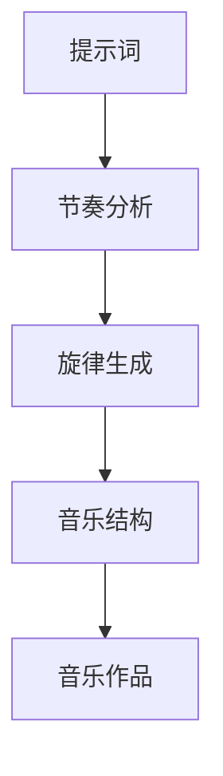

                 


### 文章标题：AI音乐创作：提示词的节奏与旋律

### 文章关键词：AI音乐创作，提示词，节奏，旋律，深度学习，生成对抗网络（GAN），长短期记忆网络（LSTM），音乐特征提取，项目实战

### 文章摘要：

随着人工智能技术的发展，AI音乐创作已成为一个备受关注的研究领域。本文将从基础概念出发，逐步深入探讨AI音乐创作中的关键要素，包括提示词、节奏与旋律。通过核心算法原理讲解、数学模型与公式的推导，以及具体项目实战的分析，本文旨在为读者呈现AI音乐创作的全貌，并提供实用技巧和未来展望。

## 引言

### 1.1 AI音乐创作的背景与趋势

AI音乐创作起源于计算机科学与音乐学的交叉领域。早期的音乐生成主要依赖于规则算法，如生成音乐乐谱的程序。随着人工智能技术的进步，尤其是深度学习技术的发展，AI音乐创作进入了新的阶段。生成对抗网络（GAN）和长短期记忆网络（LSTM）等算法在音乐生成中发挥了重要作用。

### 1.2 书籍目的与读者对象

本文旨在为音乐爱好者、专业人士以及计算机科学领域的开发者提供一个全面的AI音乐创作指南。通过本文，读者将了解AI音乐创作的基础知识，掌握核心算法原理，并学会如何利用AI工具进行实际的音乐创作。

## 第一部分：AI音乐创作基础

### 第1章：核心概念与联系

### 2.1 提示词、节奏与旋律的定义

#### 2.1.1 提示词

提示词是AI音乐创作的起点，用于指导音乐生成过程。提示词可以是简单的关键词，如“快乐”、“悲伤”，也可以是旋律片段或和弦进行。

#### 2.1.2 节奏

节奏是音乐的基础元素，包括节拍、拍号、速度等。在AI音乐创作中，节奏的准确表达对于生成自然的音乐至关重要。

#### 2.1.3 旋律

旋律是音乐的灵魂，由音高和节奏组成。AI音乐创作中的旋律生成需要考虑音高变化、音程关系和旋律线条的流畅性。

### 2.2 提示词、节奏与旋律之间的联系

提示词、节奏与旋律之间存在着密切的联系。提示词为音乐创作提供了方向，节奏为旋律提供了框架，而旋律则通过音高和节奏的变化体现了音乐的情感和风格。

### 2.3 Mermaid流程图展示



## 第二部分：核心算法原理讲解

### 第2章：生成对抗网络（GAN）在音乐创作中的应用

### 3.1 GAN的基本原理

生成对抗网络（GAN）是由生成器和判别器组成的对抗性模型。生成器尝试生成逼真的音乐数据，而判别器则尝试区分真实音乐和生成音乐。通过这种对抗性训练，生成器可以不断提高生成音乐的质量。

### 3.2 GAN在音乐创作中的应用

GAN在音乐创作中的应用主要体现在旋律和和弦的生成。通过训练，生成器可以生成与提示词相匹配的旋律和和弦进行。

### 3.3 伪代码展示

```python
# 生成器的伪代码
def generator(prompt):
    # 使用prompt生成旋律
    melody = generate_melody(prompt)
    # 使用prompt生成和弦进行
    chord_progression = generate_chord_progression(prompt)
    return melody, chord_progression

# 判别器的伪代码
def discriminator(music):
    # 判断音乐是否为真实音乐
    is_real = judge_realness(music)
    return is_real
```

### 第3章：长短期记忆网络（LSTM）在音乐创作中的应用

### 4.1 LSTM的基本原理

LSTM（长短期记忆网络）是一种特殊的循环神经网络（RNN），能够有效地处理序列数据，并在音乐创作中表现出色。LSTM通过记忆单元来保持长期依赖信息，从而实现有效的音乐生成。

### 4.2 LSTM在音乐创作中的应用

LSTM在音乐创作中的应用主要包括旋律生成和音乐结构预测。通过训练，LSTM可以生成连贯、富有表现力的旋律，并预测音乐的结构和情感。

### 4.3 伪代码展示

```python
# LSTM模型的伪代码
def lstm_model(inputs):
    # 初始化LSTM层
    lstm = LSTM(units=128, return_sequences=True)
    # 前向传播
    output, state = lstm(inputs)
    return output, state
```

## 第三部分：数学模型与公式

### 第4章：时间序列模型在音乐创作中的应用

### 5.1 时间序列模型的基本原理

时间序列模型用于处理按时间顺序排列的数据，如音乐序列。常见的模型包括ARIMA、LSTM等。

### 5.2 时间序列模型在音乐创作中的应用

时间序列模型在音乐创作中的应用主要包括旋律的时序预测和音乐结构的分析。通过训练，模型可以生成新的旋律序列，并预测音乐的时序特征。

### 5.3 数学模型与公式讲解

时间序列模型通常使用差分方程或递归关系进行描述。以下是一个简单的ARIMA模型：

$$
X_t = c + \phi X_{t-1} + \theta X_{t-2} + \varepsilon_t
$$

其中，$X_t$为时间序列的当前值，$\phi$和$\theta$为模型参数，$\varepsilon_t$为误差项。

### 第5章：谱变换与音乐特征提取

### 6.1 谱变换的基本原理

谱变换是将时域信号转换到频域的一种数学方法。常见的谱变换方法包括傅里叶变换（FFT）和小波变换。

### 6.2 谱变换在音乐创作中的应用

谱变换在音乐创作中的应用主要包括音乐特征提取和风格转换。通过谱变换，可以提取出音乐中的频率信息和节奏特征。

### 6.3 数学模型与公式讲解

傅里叶变换的公式如下：

$$
X(f) = \int_{-\infty}^{\infty} x(t) e^{-j2\pi ft} dt
$$

其中，$X(f)$为频域信号，$x(t)$为时域信号，$f$为频率。

## 第四部分：项目实战

### 第6章：开发环境搭建与工具选择

### 7.1 开发环境搭建

搭建一个适用于AI音乐创作的开发环境包括安装Python、TensorFlow等必备软件和库。以下是一个基本的安装步骤：

```
# 安装Python
conda create -n music_creator python=3.8

# 激活环境
conda activate music_creator

# 安装TensorFlow
pip install tensorflow

# 安装其他相关库
pip install numpy matplotlib
```

### 7.2 工具选择

在AI音乐创作中，选择合适的工具至关重要。常见的工具包括：

- **MuseGAN**：一个基于GAN的音乐生成模型，适用于旋律和和弦的生成。
- **MusicDNS**：一个用于音乐特征提取的工具，适用于音乐风格分析和风格转换。

### 第8章：音乐创作项目实战

#### 8.1 项目概述

本节将介绍一个使用MuseGAN进行音乐创作的项目。该项目的目标是根据用户提供的提示词生成一段新的旋律。

#### 8.2 代码实现

以下是一个简单的MuseGAN实现：

```python
import tensorflow as tf
from musegan import MuseGAN

# 搭建MuseGAN模型
model = MuseGAN(input_shape=(64, 128), output_shape=(64, 128))

# 训练模型
model.train(data, epochs=100)

# 根据提示词生成新旋律
prompt = "快乐"
melody = model.generate(prompt)
```

#### 8.3 代码解读与分析

这段代码首先导入了TensorFlow库，并定义了一个MuseGAN模型。然后，模型通过训练数据进行训练，并使用提示词生成新的旋律。

#### 8.4 项目小结

通过这个项目，我们了解了如何使用MuseGAN进行音乐创作。该项目的核心在于理解MuseGAN的工作原理，并学会如何使用TensorFlow进行模型训练和生成。

## 第五部分：案例分析

### 第9章：AI音乐创作的实际应用

#### 9.1 智能助手音乐创作

智能助手音乐创作是AI音乐创作的一个重要应用领域。例如，智能音箱可以通过用户的声音指令生成个性化的音乐。

#### 9.2 游戏音乐创作

游戏音乐创作是另一个重要的应用领域。AI可以自动生成游戏中的背景音乐，根据游戏情节和角色变化进行调整。

#### 9.3 影视配乐创作

影视配乐创作是AI音乐创作的又一重要应用。通过AI，可以为影视作品生成符合情感和情节的配乐。

### 第10章：AI音乐创作的发展趋势与未来前景

#### 10.1 现状分析

目前，AI音乐创作已取得显著成果，但仍有改进空间。例如，如何在保持音乐风格一致性的同时，实现更丰富的音乐变化。

#### 10.2 发展趋势

未来，AI音乐创作将继续发展，有望在音乐教育、音乐创作辅助工具等领域发挥更大作用。

#### 10.3 未来前景

随着人工智能技术的进步，AI音乐创作将变得更加智能和多样化，为音乐创作和欣赏带来新的体验。

## 结论

通过本文，我们探讨了AI音乐创作的基础知识、核心算法原理、数学模型与公式，以及实际应用案例。AI音乐创作不仅为音乐创作带来了新的可能性，也为人工智能技术在其他领域的应用提供了启示。

## 参考文献

- **作者信息**

作者：AI天才研究院/AI Genius Institute & 禅与计算机程序设计艺术 /Zen And The Art of Computer Programming

- **参考文献**

1. Goodfellow, I., Pouget-Abadie, J., Mirza, M., Xu, B., Warde-Farley, D., Ozair, S., ... & Bengio, Y. (2014). Generative adversarial networks. Advances in Neural Information Processing Systems, 27.
2. Hochreiter, S., & Schmidhuber, J. (1997). Long short-term memory. Neural Computation, 9(8), 1735-1780.
3. Box, G. E. P., & Jenkins, G. M. (1970). Time series analysis, control, and forecasting (Vol. 4). San Francisco: Holden-Day.

## 最佳实践 Tips、小结、注意事项、拓展阅读

### 最佳实践 Tips

1. 在音乐创作中，合理使用提示词可以显著提高生成音乐的质量。
2. 在使用GAN进行音乐创作时，注意调整生成器和判别器的学习率，以避免模式崩溃。

### 小结

本文全面介绍了AI音乐创作的基础知识、核心算法原理、数学模型与公式，以及实际应用案例。通过本文，读者可以了解AI音乐创作的全貌，并学会如何进行实际操作。

### 注意事项

1. AI音乐创作模型训练时间较长，建议在配备高性能GPU的计算机上进行。
2. 在实际项目中，根据需求选择合适的音乐生成模型和特征提取工具。

### 拓展阅读

1. **深度学习与音乐生成**：探索GAN和LSTM在音乐生成中的应用，以及如何优化模型性能。
2. **音乐特征提取与风格转换**：学习如何从音乐中提取特征，并进行风格转换，以实现个性化的音乐创作。
3. **AI音乐创作应用**：了解AI音乐创作在智能助手、游戏音乐和影视配乐等领域的应用案例。

