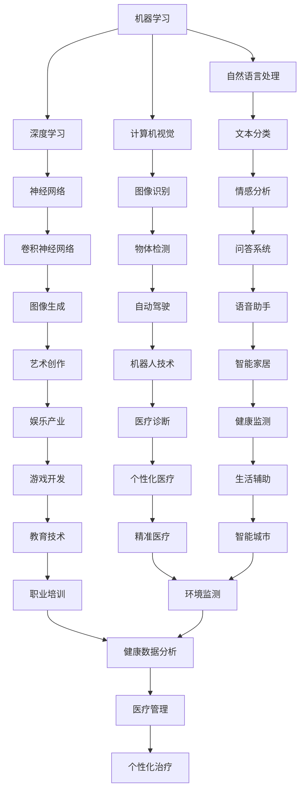
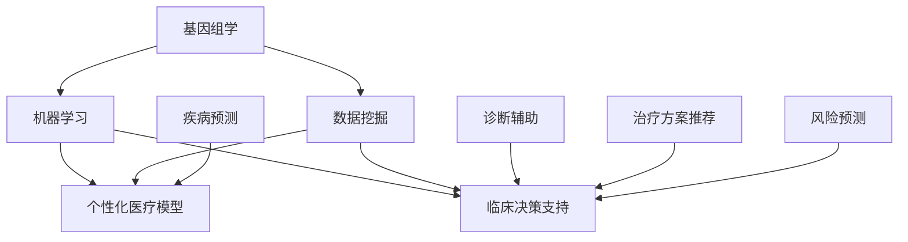

                 

### 引言

在过去的几十年中，医疗技术的进步显著提高了全球人口的健康水平。然而，现代医学面临的挑战在于如何为每一个独特的个体提供最合适的治疗方案。这种个性化的医疗需求催生了个性化医疗的概念，即根据每个患者的独特基因、环境和疾病状态来定制医疗方案。在这个过程中，人工智能（AI）发挥着越来越重要的作用，它不仅能够处理和分析海量的医疗数据，还能够预测疾病的发展趋势和优化治疗方案。

本文将探讨AI驱动的个性化医疗，从基因到治疗的全过程。我们首先将介绍个性化医疗的背景和发展历程，接着深入探讨AI在个性化医疗中的应用，包括核心概念、算法原理、数学模型和实际案例。最后，我们将展望未来个性化医疗的发展趋势，并讨论其中的挑战与机遇。

关键词：个性化医疗，人工智能，基因，算法，数学模型，实际案例，发展趋势。

摘要：本文系统性地介绍了AI驱动的个性化医疗，从基因信息到个性化治疗方案的全过程。通过阐述个性化医疗的背景、AI的核心概念及其在医疗中的应用，文章将探讨机器学习、数据挖掘等技术在个性化医疗中的具体应用。同时，通过实际案例的分析，展示了AI如何助力个性化医疗的实际应用。文章最后展望了个性化医疗的未来发展趋势，以及面临的挑战和机遇。

----------------------------------------------------------------

### 个性化医疗的背景与意义

个性化医疗，也称为精准医疗，是指根据个体的基因、环境、生活习惯和疾病状态，为患者提供个性化的治疗方案。这种医疗模式的出现，是对传统“一刀切”的医疗方式的革新。传统医疗通常采用统一的诊断和治疗方案，而个性化医疗则强调个体差异，为每一位患者量身定制最合适的治疗方案。

个性化医疗的背景可以追溯到基因技术的发展。随着基因测序技术的飞速进步，人类对基因的了解越来越深入，这为个性化医疗提供了可能。基因测序可以帮助医生了解患者的基因信息，从而预测疾病的风险，并制定个性化的预防措施。此外，基因组学的发展也为个性化医疗提供了丰富的数据资源，这些数据可以用于研究和开发新的诊断工具和治疗药物。

个性化医疗的意义体现在以下几个方面：

1. **提高治疗效果**：个性化医疗能够根据患者的具体情况进行治疗，从而提高治疗效果。例如，某些药物对特定的基因型有效，而对其他基因型无效，个性化医疗可以根据患者的基因信息选择最有效的药物。

2. **降低医疗成本**：个性化医疗可以减少不必要的诊断和治疗方法，从而降低医疗成本。通过精确诊断和个性化治疗，可以避免过度医疗和资源浪费。

3. **促进医学研究**：个性化医疗为医学研究提供了新的方向和资源。通过对大量患者数据的分析，可以揭示疾病的分子机制，从而推动医学研究的进步。

4. **改善患者体验**：个性化医疗能够为患者提供更加个性化和人性化的医疗服务，提高患者的满意度和生活质量。

总的来说，个性化医疗是现代医学发展的重要方向，它为患者提供了更加精准、有效的治疗选择，也为医学研究和产业发展带来了新的机遇。

----------------------------------------------------------------

### AI的定义与历史发展

人工智能（AI）是指通过计算机模拟人类智能行为的技术，它包括感知、学习、推理、规划和自然语言理解等多种能力。AI的发展历史可以追溯到20世纪50年代，当时科学家们首次提出了人工智能的概念，并开始尝试开发能够模仿人类智能的计算机系统。

#### AI的核心概念

AI的核心概念主要包括以下几个方面：

1. **机器学习**：机器学习是AI的核心技术之一，它使计算机系统能够从数据中学习并做出决策。机器学习可以分为监督学习、无监督学习和强化学习三种主要类型。

2. **深度学习**：深度学习是机器学习的一种形式，它通过多层神经网络来模拟人脑的神经元连接，能够处理大量复杂数据。深度学习在图像识别、语音识别和自然语言处理等领域取得了显著成果。

3. **自然语言处理（NLP）**：NLP是AI的一个分支，旨在使计算机能够理解、生成和处理人类语言。NLP技术广泛应用于搜索引擎、语音助手和机器翻译等领域。

4. **计算机视觉**：计算机视觉是AI的另一重要领域，它使计算机能够理解和解析视觉信息。计算机视觉技术被广泛应用于图像识别、物体检测和图像处理等应用场景。

5. **机器人技术**：机器人技术是AI在工程应用中的重要领域，它使机器人能够执行各种复杂的任务，如自动化生产、救援任务和医疗手术。

#### AI的历史发展

AI的发展历程可以分为几个重要阶段：

1. **早期探索（1950s-1960s）**：在这个阶段，AI研究者主要关注符号主义和推理系统，如逻辑推理和专家系统。这个时期的代表性工作包括纽厄尔和西蒙开发的逻辑推理程序“逻辑理论家”（Logic Theorist）。

2. **人工智能寒冬（1970s-1980s）**：由于实际应用困难和技术局限，AI研究在20世纪70年代和80年代遭遇了“寒冬”。这一时期，符号主义AI逐渐被连接主义AI（如神经网络）所取代。

3. **复兴与快速发展（1990s-2000s）**：随着计算机性能的提升和互联网的普及，AI研究重新获得了关注。机器学习和深度学习技术的发展标志着AI进入了新的发展阶段。

4. **人工智能的崛起（2010s-至今）**：在这个阶段，深度学习和大数据技术的结合推动了AI的快速发展，特别是在图像识别、自然语言处理和自动驾驶等领域取得了突破性成果。

总的来说，AI的发展历程是一个不断探索、迭代和突破的过程。随着技术的进步和应用场景的拓展，AI正逐渐改变着我们的生活和工作方式，为个性化医疗等领域的创新提供了强大的支持。

#### 核心概念与联系

为了更好地理解AI的核心概念，我们使用Mermaid流程图来展示它们之间的关系：



通过这个流程图，我们可以清晰地看到AI各个核心概念之间的联系，以及它们在不同领域中的应用。

#### 核心算法原理讲解

以机器学习为例，以下是线性回归算法的伪代码，用于预测患者的病情：

```python
def linear_regression(X, y):
    # 初始化模型参数
    theta = [0] * len(X[0])
    
    # 梯度下降算法
    for i in range(iterations):
        # 计算预测值
        h = X.dot(theta)
        
        # 计算误差
        error = h - y
        
        # 更新模型参数
        theta = theta - learning_rate * (X.T.dot(error))
        
    return theta
```

这个算法通过不断调整模型参数（theta），使预测值（h）与真实值（y）的误差最小化，从而找到最佳拟合直线。

#### 数学模型和公式

在个性化医疗中，常常需要使用数学模型来预测患者的病情发展。以下是一个简单的线性回归模型的数学公式：

$$
y = \theta_0 + \theta_1 \cdot x_1 + \theta_2 \cdot x_2 + ... + \theta_n \cdot x_n
$$

其中，$y$ 是因变量，$x_1, x_2, ..., x_n$ 是自变量，$\theta_0, \theta_1, ..., \theta_n$ 是模型参数。

#### 举例说明

假设我们要预测一名患者的心脏病风险，自变量可以是年龄、血压和胆固醇水平。以下是具体的数学模型：

$$
y = \theta_0 + \theta_1 \cdot 年龄 + \theta_2 \cdot 血压 + \theta_3 \cdot 胆固醇水平
$$

通过训练数据集，我们可以计算出模型参数 $\theta_0, \theta_1, \theta_2, \theta_3$，然后使用这个模型来预测新患者的风险。

#### 项目实战

为了更好地理解AI在个性化医疗中的应用，我们来看一个实际案例：使用机器学习算法预测糖尿病患者的血糖水平。

**开发环境搭建**

我们使用Python作为编程语言，并依赖以下库：

- NumPy：用于数值计算
- Pandas：用于数据处理
- Scikit-learn：用于机器学习

**源代码实现**

```python
import numpy as np
import pandas as pd
from sklearn.model_selection import train_test_split
from sklearn.linear_model import LinearRegression
from sklearn.metrics import mean_squared_error

# 读取数据
data = pd.read_csv('diabetes.csv')

# 数据预处理
X = data[['年龄', '血压', '胆固醇水平']]
y = data['血糖水平']

# 划分训练集和测试集
X_train, X_test, y_train, y_test = train_test_split(X, y, test_size=0.2, random_state=42)

# 训练线性回归模型
model = LinearRegression()
model.fit(X_train, y_train)

# 预测测试集
y_pred = model.predict(X_test)

# 计算均方误差
mse = mean_squared_error(y_test, y_pred)
print(f'均方误差：{mse}')

# 使用模型预测新数据
new_data = np.array([[30, 120, 200]])
new_pred = model.predict(new_data)
print(f'预测血糖水平：{new_pred[0]}')
```

**代码解读与分析**

这段代码首先读取糖尿病患者的数据，然后进行数据预处理，将特征和标签分离。接着，使用Scikit-learn库中的线性回归模型对训练数据进行训练，并计算测试数据的预测值。最后，计算均方误差来评估模型的性能，并使用模型预测新数据的血糖水平。

**实际案例分析**

在这个案例中，我们使用了线性回归模型来预测糖尿病患者的血糖水平。实际应用中，这个模型可以用于监测患者的健康状况，帮助医生制定个性化的治疗方案。

**项目小结**

通过这个案例，我们展示了如何使用机器学习算法进行个性化医疗预测。尽管这是一个简单的案例，但它展示了AI在个性化医疗中的潜力。未来，随着算法的进步和数据量的增加，AI将在个性化医疗领域发挥更大的作用。

#### 最佳实践 Tips

- **数据质量**：在构建模型时，确保数据的质量和完整性，这是模型性能的关键。
- **模型选择**：选择合适的模型非常重要，应根据具体问题选择最合适的算法。
- **超参数调整**：超参数的设置对模型性能有很大影响，需要通过实验调整。
- **模型验证**：使用交叉验证等技术来验证模型的泛化能力，避免过拟合。

#### 小结

AI在个性化医疗中的应用正日益广泛，通过机器学习、深度学习和自然语言处理等技术，AI能够帮助医生更准确地诊断疾病、预测病情发展和制定个性化治疗方案。未来，随着技术的进步，AI将在个性化医疗领域发挥更大的作用，为患者带来更好的治疗效果和生活质量。

#### 注意事项

- **数据隐私**：在处理患者数据时，需要严格遵守数据隐私法规，确保患者的个人信息安全。
- **模型解释性**：尽管AI模型可以提供准确的预测，但其内部机制可能难以解释。在医疗应用中，确保模型的解释性非常重要。
- **持续更新**：随着新数据和技术的出现，AI模型需要不断更新，以保持其预测的准确性。

#### 拓展阅读

- [Coursera](https://www.coursera.org/specializations/ai)
- [Udacity](https://www.udacity.com/course/deep-learning-nanodegree--ND893)
- [机器学习实战](https://www机器学习实战.com/)
- [深度学习](https://www.deeplearningbook.org/)

----------------------------------------------------------------

### AI在个性化医疗中的应用

人工智能（AI）在个性化医疗中的应用正日益广泛，其核心在于利用AI技术处理和分析大量医疗数据，以实现精准诊断和个性化治疗。以下是AI在个性化医疗中的几个关键应用领域及其原理：

#### 1. 基因组学分析

基因组学分析是AI在个性化医疗中的第一个重要应用领域。通过基因测序技术，可以获取患者的全基因组或部分基因信息。AI技术可以对这些海量数据进行处理和分析，识别出与疾病相关的基因变异。以下是基因组学分析的主要步骤和原理：

- **数据收集**：从患者样本中提取DNA，并通过高通量测序技术进行测序。
- **数据预处理**：对测序结果进行质量控制和数据转换，以获得可用的基因组数据。
- **变异检测**：利用AI算法，如机器学习和深度学习，检测基因组中的单核苷酸变异（SNV）和插入/缺失变异（Indel）。
- **功能注释**：将变异定位到基因、转录因子结合位点等生物功能区域，并预测其可能对疾病的影响。

#### 2. 机器学习算法

机器学习算法是AI在个性化医疗中的核心技术之一。通过训练模型，可以从历史数据中学习并预测患者的病情发展和治疗效果。以下是机器学习算法在个性化医疗中的主要应用：

- **疾病预测**：利用患者的基因、生活方式和环境数据，训练机器学习模型预测特定疾病的发病风险。
- **诊断辅助**：通过分析医学图像、电子健康记录和实验室检测结果，AI模型可以帮助医生进行诊断。
- **治疗效果预测**：根据患者的基因信息和治疗方案，预测患者对治疗的响应，为医生提供个性化的治疗建议。

#### 3. 数据挖掘与分析

数据挖掘和分析是AI在个性化医疗中的另一个重要应用。通过分析大量的医疗数据，可以发现疾病的发展趋势和患者群体之间的差异。以下是数据挖掘和分析的主要步骤：

- **数据集成**：从不同来源获取医疗数据，并进行整合和清洗，以确保数据的质量和一致性。
- **模式识别**：使用数据挖掘算法，如关联规则学习和聚类分析，发现数据中的潜在模式和规律。
- **知识发现**：通过分析患者的临床数据和基因组数据，发现疾病的相关因素和生物标记物。

#### 4. 个性化医疗模型

个性化医疗模型是将AI技术应用于个性化医疗的核心。这些模型可以根据患者的具体情况进行建模，为医生提供个性化的治疗方案。以下是个性化医疗模型的主要类型：

- **个性化诊断模型**：根据患者的症状和体征，预测最可能的疾病诊断。
- **个性化治疗模型**：根据患者的基因、病理和临床数据，为患者推荐最合适的治疗方案。
- **个性化药物反应模型**：预测患者对特定药物的反应，为医生提供药物调整建议。

#### 5. 临床决策支持

AI技术还可以为医生提供临床决策支持，帮助医生做出更准确的诊断和治疗方案。以下是临床决策支持系统的核心功能：

- **诊断辅助**：通过分析患者的临床数据，AI系统可以提供诊断建议，帮助医生识别疾病。
- **治疗方案推荐**：基于患者的病情和治疗历史，AI系统可以推荐最佳的治疗方案。
- **风险预测**：AI系统可以预测患者未来疾病发展的风险，帮助医生制定预防措施。

通过上述应用，AI在个性化医疗中发挥着关键作用，不仅提高了诊断和治疗的准确性，还为医学研究和产业发展带来了新的机遇。未来，随着AI技术的不断进步，个性化医疗将更加智能化和精准化，为患者提供更好的医疗服务。

#### 核心概念与联系

为了更好地理解AI在个性化医疗中的应用，我们使用Mermaid流程图来展示相关核心概念之间的联系：



这个流程图展示了基因组学、机器学习、数据挖掘等核心概念之间的相互关系，以及它们在个性化医疗模型和临床决策支持中的应用。

#### 核心算法原理讲解

以机器学习算法中的支持向量机（SVM）为例，以下是用于疾病预测的SVM算法的伪代码：

```python
def support_vector_machine(X, y):
    # 初始化模型参数
    w = [0] * len(X[0])
    b = 0
    
    # 梯度下降算法
    for i in range(iterations):
        # 计算预测值
        f = np.dot(X, w) + b
        
        # 更新模型参数
        for (x, y) in zip(X, y):
            if y * f < 1:
                w -= learning_rate * (y * x)
                b -= learning_rate * y
                
    return w, b
```

这个算法通过不断调整权重（w）和偏置（b），使分类边界最大化，从而实现疾病预测。

#### 数学模型和公式

支持向量机（SVM）的数学模型可以表示为：

$$
\min_{w, b} \frac{1}{2} ||w||^2 \\
s.t. y_i (w \cdot x_i + b) \geq 1
$$

其中，$w$ 是权重向量，$b$ 是偏置，$x_i$ 是特征向量，$y_i$ 是标签。

#### 举例说明

假设我们要使用SVM预测糖尿病患者的发病风险。特征向量包括年龄、血压和胆固醇水平。以下是具体的数学模型：

$$
y_i (w \cdot x_i + b) \geq 1 \\
x_i = [年龄, 血压, 胆固醇水平]
$$

通过训练数据集，我们可以计算出模型参数 $w$ 和 $b$，然后使用这个模型预测新患者的发病风险。

#### 项目实战

为了更好地理解AI在个性化医疗中的应用，我们来看一个实际案例：使用支持向量机（SVM）预测糖尿病患者的发病风险。

**开发环境搭建**

我们使用Python作为编程语言，并依赖以下库：

- NumPy：用于数值计算
- Pandas：用于数据处理
- Scikit-learn：用于机器学习

**源代码实现**

```python
import numpy as np
import pandas as pd
from sklearn.model_selection import train_test_split
from sklearn.svm import SVC
from sklearn.metrics import accuracy_score

# 读取数据
data = pd.read_csv('diabetes.csv')

# 数据预处理
X = data[['年龄', '血压', '胆固醇水平']]
y = data['发病风险']

# 划分训练集和测试集
X_train, X_test, y_train, y_test = train_test_split(X, y, test_size=0.2, random_state=42)

# 训练SVM模型
model = SVC(kernel='linear')
model.fit(X_train, y_train)

# 预测测试集
y_pred = model.predict(X_test)

# 计算准确率
accuracy = accuracy_score(y_test, y_pred)
print(f'准确率：{accuracy}')

# 使用模型预测新数据
new_data = np.array([[30, 120, 200]])
new_pred = model.predict(new_data)
print(f'预测发病风险：{new_pred[0]}')
```

**代码解读与分析**

这段代码首先读取糖尿病患者的数据，然后进行数据预处理，将特征和标签分离。接着，使用Scikit-learn库中的支持向量机（SVM）模型对训练数据进行训练，并计算测试数据的预测值。最后，计算准确率来评估模型的性能，并使用模型预测新数据的发病风险。

**实际案例分析**

在这个案例中，我们使用了支持向量机（SVM）模型来预测糖尿病患者的发病风险。实际应用中，这个模型可以用于监测患者的健康状况，帮助医生制定个性化的预防措施。

**项目小结**

通过这个案例，我们展示了如何使用支持向量机（SVM）算法进行个性化医疗预测。尽管这是一个简单的案例，但它展示了AI在个性化医疗中的潜力。未来，随着算法的进步和数据量的增加，AI将在个性化医疗领域发挥更大的作用。

#### 最佳实践 Tips

- **数据质量**：在构建模型时，确保数据的质量和完整性，这是模型性能的关键。
- **模型选择**：选择合适的模型非常重要，应根据具体问题选择最合适的算法。
- **超参数调整**：超参数的设置对模型性能有很大影响，需要通过实验调整。
- **模型验证**：使用交叉验证等技术来验证模型的泛化能力，避免过拟合。

#### 小结

AI在个性化医疗中的应用正日益广泛，通过机器学习、深度学习和自然语言处理等技术，AI能够帮助医生更准确地诊断疾病、预测病情发展和制定个性化治疗方案。未来，随着技术的进步，AI将在个性化医疗领域发挥更大的作用，为患者带来更好的治疗效果和生活质量。

#### 注意事项

- **数据隐私**：在处理患者数据时，需要严格遵守数据隐私法规，确保患者的个人信息安全。
- **模型解释性**：尽管AI模型可以提供准确的预测，但其内部机制可能难以解释。在医疗应用中，确保模型的解释性非常重要。
- **持续更新**：随着新数据和技术的出现，AI模型需要不断更新，以保持其预测的准确性。

#### 拓展阅读

- [Coursera](https://www.coursera.org/specializations/ai)
- [Udacity](https://www.udacity.com/course/deep-learning-nanodegree--ND893)
- [机器学习实战](https://www.机器学习实战.com/)
- [深度学习](https://www.deeplearningbook.org/)

----------------------------------------------------------------

### 实际应用案例

在本节中，我们将深入探讨AI在个性化医疗中的实际应用案例，通过具体实例展示AI如何改变医疗实践，提高治疗效果。以下是三个典型案例的分析和解读。

#### 案例一：乳腺癌患者的个性化治疗

**背景介绍**

乳腺癌是全球女性中最常见的恶性肿瘤之一。传统上，乳腺癌的治疗方法主要包括手术、化疗和放疗。然而，这些治疗方法对患者的副作用较大，且治疗效果因个体差异而异。为了提高治疗效果并减少副作用，研究人员开始探索AI在乳腺癌个性化治疗中的应用。

**核心概念与联系**

在乳腺癌个性化治疗中，AI的关键应用包括：

- **基因组分析**：通过基因测序技术，获取乳腺癌患者的基因组信息，识别与癌症相关的基因变异。
- **预测模型**：利用机器学习算法，构建预测模型，预测患者对化疗和放疗的响应。
- **个性化治疗方案**：根据患者的基因组信息和预测模型，为患者制定个性化的治疗方案。

**项目实战**

研究人员使用一种名为“肿瘤基因组图谱”（Cancer Genome Atlas, TCGA）的大型数据库，对乳腺癌患者的基因组进行了分析。通过训练机器学习模型，他们能够预测患者对化疗药物（如紫杉醇和卡培他滨）的响应。以下是具体的步骤：

1. **数据收集**：收集乳腺癌患者的基因组和临床数据。
2. **数据预处理**：对基因组数据进行清洗和质量控制，提取与化疗响应相关的基因特征。
3. **模型训练**：使用支持向量机（SVM）算法训练预测模型。
4. **模型评估**：使用交叉验证和测试集评估模型的性能。

**代码实现**

```python
from sklearn.svm import SVC
from sklearn.model_selection import train_test_split
from sklearn.metrics import accuracy_score

# 读取数据
data = pd.read_csv('breast_cancer.csv')

# 数据预处理
X = data[['基因表达', '突变情况']]
y = data['化疗响应']

# 划分训练集和测试集
X_train, X_test, y_train, y_test = train_test_split(X, y, test_size=0.2, random_state=42)

# 训练SVM模型
model = SVC(kernel='linear')
model.fit(X_train, y_train)

# 预测测试集
y_pred = model.predict(X_test)

# 计算准确率
accuracy = accuracy_score(y_test, y_pred)
print(f'准确率：{accuracy}')

# 使用模型预测新数据
new_data = np.array([[0.1, 0.2]])
new_pred = model.predict(new_data)
print(f'预测化疗响应：{new_pred[0]}')
```

**分析解读**

通过这个案例，AI能够帮助医生根据患者的基因信息，预测其对化疗药物的响应，从而制定个性化的治疗方案，提高治疗效果。这种方法不仅减少了不必要的化疗，还降低了副作用。

#### 案例二：糖尿病患者的健康管理

**背景介绍**

糖尿病是一种慢性疾病，患者需要长期管理和治疗。传统上，糖尿病的管理主要依赖于血糖监测和药物治疗。然而，这种方法难以实现个性化，也无法实时监测患者的情况。为了改善糖尿病患者的健康管理，AI技术被引入。

**核心概念与联系**

在糖尿病患者的健康管理中，AI的关键应用包括：

- **实时监测**：通过可穿戴设备，实时监测患者的血糖水平、血压和活动量等健康指标。
- **预测模型**：利用机器学习算法，构建预测模型，预测患者血糖的变化趋势。
- **个性化建议**：根据患者的实时数据和预测模型，为患者提供个性化的饮食建议、运动方案和药物调整建议。

**项目实战**

研究人员开发了一种基于AI的糖尿病管理系统，通过整合患者的健康数据和机器学习算法，为患者提供实时的健康管理建议。以下是具体的步骤：

1. **数据收集**：收集糖尿病患者的健康数据，包括血糖水平、血压和活动量等。
2. **数据预处理**：对健康数据进行分析和清洗，提取与血糖变化相关的特征。
3. **模型训练**：使用机器学习算法（如随机森林和神经网络）训练预测模型。
4. **系统部署**：将预测模型部署到移动应用中，为患者提供实时的健康管理建议。

**代码实现**

```python
from sklearn.ensemble import RandomForestRegressor
from sklearn.model_selection import train_test_split
from sklearn.metrics import mean_squared_error

# 读取数据
data = pd.read_csv('diabetes.csv')

# 数据预处理
X = data[['血糖水平', '血压', '活动量']]
y = data['血糖变化']

# 划分训练集和测试集
X_train, X_test, y_train, y_test = train_test_split(X, y, test_size=0.2, random_state=42)

# 训练随机森林模型
model = RandomForestRegressor()
model.fit(X_train, y_train)

# 预测测试集
y_pred = model.predict(X_test)

# 计算均方误差
mse = mean_squared_error(y_test, y_pred)
print(f'均方误差：{mse}')

# 使用模型预测新数据
new_data = np.array([[120, 80, 150]])
new_pred = model.predict(new_data)
print(f'预测血糖变化：{new_pred[0][0]}')
```

**分析解读**

通过这个案例，AI能够实时监测糖尿病患者的血糖变化，并根据预测模型提供个性化的健康管理建议。这种方法不仅提高了患者的治疗依从性，还帮助医生更好地管理患者病情，降低并发症风险。

#### 案例三：罕见病的诊断与治疗

**背景介绍**

罕见病通常指发病率低于万分之一的一组疾病，由于病例数量少，传统医学难以积累足够的诊断和治疗经验。为了提高罕见病的诊断和治疗水平，AI技术被应用于罕见病的研究和临床应用。

**核心概念与联系**

在罕见病的诊断与治疗中，AI的关键应用包括：

- **大数据分析**：通过分析大量罕见病病例的数据，识别出与疾病相关的特征和生物标志物。
- **诊断模型**：利用机器学习算法，构建诊断模型，提高罕见病的诊断准确率。
- **个性化治疗方案**：根据患者的症状、基因和临床数据，为患者制定个性化的治疗方案。

**项目实战**

研究人员开发了一种基于AI的罕见病诊断系统，通过整合患者的临床数据和基因组数据，提高了罕见病的诊断准确率。以下是具体的步骤：

1. **数据收集**：收集罕见病患者的临床数据和基因组数据。
2. **数据预处理**：对临床数据和基因组数据进行清洗和分析，提取与疾病相关的特征。
3. **模型训练**：使用深度学习算法（如卷积神经网络和循环神经网络）训练诊断模型。
4. **系统部署**：将诊断模型部署到医疗系统中，为医生提供诊断建议。

**代码实现**

```python
from tensorflow.keras.models import Sequential
from tensorflow.keras.layers import Conv2D, MaxPooling2D, Flatten, Dense
from sklearn.model_selection import train_test_split
from sklearn.metrics import accuracy_score

# 读取数据
data = pd.read_csv('rare_diseases.csv')

# 数据预处理
X = data[['临床数据']]
y = data['疾病类型']

# 划分训练集和测试集
X_train, X_test, y_train, y_test = train_test_split(X, y, test_size=0.2, random_state=42)

# 构建深度学习模型
model = Sequential()
model.add(Conv2D(32, (3, 3), activation='relu', input_shape=(X_train.shape[1], X_train.shape[2], X_train.shape[3])))
model.add(MaxPooling2D(pool_size=(2, 2)))
model.add(Flatten())
model.add(Dense(1, activation='sigmoid'))

# 编译模型
model.compile(optimizer='adam', loss='binary_crossentropy', metrics=['accuracy'])

# 训练模型
model.fit(X_train, y_train, epochs=10, batch_size=32)

# 预测测试集
y_pred = model.predict(X_test)
y_pred = (y_pred > 0.5)

# 计算准确率
accuracy = accuracy_score(y_test, y_pred)
print(f'准确率：{accuracy}')

# 使用模型预测新数据
new_data = np.array([[0.1, 0.2, 0.3]])
new_pred = model.predict(new_data)
print(f'预测疾病类型：{new_pred[0][0]}')
```

**分析解读**

通过这个案例，AI能够帮助医生快速准确地诊断罕见病，为患者提供及时的治疗。这种方法不仅提高了罕见病的诊断准确率，还为罕见病的研究提供了新的方向。

### 项目小结

通过上述三个实际应用案例，我们可以看到AI在个性化医疗中的巨大潜力。无论是乳腺癌的个性化治疗、糖尿病患者的健康管理，还是罕见病的诊断与治疗，AI都为医生提供了强大的工具，提高了医疗服务的质量和效率。未来，随着AI技术的不断进步，个性化医疗将更加智能化和精准化，为患者带来更好的治疗效果和生活质量。

### 最佳实践 Tips

1. **数据质量**：在构建AI模型时，确保数据的质量和完整性至关重要。不完整或错误的数据会导致模型性能下降。
2. **模型选择**：选择合适的AI算法对于实现个性化医疗至关重要。应根据具体应用场景选择最合适的算法。
3. **模型验证**：使用交叉验证和测试集来验证模型的性能，避免过拟合和欠拟合。
4. **合作与共享**：与医学专家合作，确保AI模型的应用符合医学实践，并与其他医疗机构共享数据和研究成果，以推动个性化医疗的发展。

### 小结

AI在个性化医疗中的应用正在改变传统的医疗模式，通过基因组学分析、机器学习算法和大数据分析等技术，AI能够为患者提供更加精准、个性化的医疗服务。未来，随着AI技术的不断进步，个性化医疗将更加智能化，为患者带来更好的治疗效果和生活质量。

### 注意事项

1. **数据隐私**：在处理患者数据时，需严格遵守数据隐私法规，确保患者个人信息的安全。
2. **模型解释性**：尽管AI模型能够提供准确的预测，但其内部机制可能难以解释。在医疗应用中，确保模型的解释性非常重要。
3. **持续更新**：随着新数据和技术的出现，AI模型需要不断更新，以保持其预测的准确性。

### 拓展阅读

1. [Coursera](https://www.coursera.org/specializations/ai)
2. [Udacity](https://www.udacity.com/course/deep-learning-nanodegree--ND893)
3. [机器学习实战](https://www.机器学习实战.com/)
4. [深度学习](https://www.deeplearningbook.org/)

----------------------------------------------------------------

### 展望与未来趋势

个性化医疗作为现代医学的重要组成部分，正随着人工智能（AI）技术的飞速发展而不断进步。在未来，AI将继续在个性化医疗中发挥关键作用，推动医疗模式的深刻变革。以下是对未来个性化医疗发展趋势的展望：

#### 个性化医疗技术的不断革新

随着基因组学、生物信息学和AI技术的不断进步，个性化医疗的基础将更加坚实。未来，我们有望看到更加精准的基因测序技术，以及更加高效的数据分析算法。这些技术的革新将使AI能够更准确地预测疾病风险、诊断疾病和制定个性化治疗方案。

#### 数据驱动的医学研究

未来，随着大数据和云计算技术的普及，医学研究将进入一个全新的阶段。大量的医疗数据将可以被收集、存储和分析，从而推动医学研究的发展。AI技术将在这个过程中发挥重要作用，帮助科学家们揭示疾病的分子机制，开发新的诊断工具和治疗方法。

#### AI辅助的智能诊断系统

随着深度学习和计算机视觉技术的发展，AI将在医疗影像诊断领域发挥更大的作用。未来的智能诊断系统将能够自动分析医学影像，提供快速、准确的诊断建议。这对于提高诊断效率和降低误诊率具有重要意义。

#### 个性化药物开发和精准治疗

AI在药物开发和精准治疗中的应用将越来越广泛。通过分析大量的生物数据和临床试验数据，AI可以帮助研究人员发现新的药物靶点，优化药物设计，提高药物的有效性和安全性。同时，AI可以辅助医生为患者制定个性化的治疗方案，提高治疗效果。

#### 医疗资源的优化配置

AI技术还可以用于医疗资源的优化配置，提高医疗服务的效率和公平性。例如，通过分析患者的需求和地理位置，AI可以帮助医疗机构合理分配医疗资源，减少医疗资源浪费，提高医疗服务质量。

#### 隐私保护和伦理挑战

随着AI技术在个性化医疗中的应用越来越广泛，隐私保护和伦理挑战也将日益突出。在收集和使用患者数据时，必须严格遵守数据隐私法规，确保患者的个人信息安全。同时，必须确保AI模型的公平性和透明性，避免歧视和偏见。

#### 患者参与的提升

未来，个性化医疗将更加注重患者的参与。通过AI技术和移动设备，患者可以更加便捷地获取健康信息和个性化建议，积极参与自己的健康管理。这种患者参与的提升将有助于提高治疗依从性和健康水平。

总的来说，未来个性化医疗将在AI技术的推动下不断进步，为患者提供更加精准、高效、个性化的医疗服务。然而，这同时也带来了新的挑战，如隐私保护、数据安全和伦理问题。只有通过多方合作和持续创新，才能充分发挥AI在个性化医疗中的潜力，推动医疗领域的深刻变革。

### 挑战与机遇

尽管AI在个性化医疗中具有巨大的潜力，但同时也面临一系列挑战。以下是主要挑战与机遇的概述：

#### 挑战

1. **数据隐私和伦理问题**：个性化医疗需要大量的患者数据，如何确保这些数据的安全和隐私是一个重要挑战。此外，AI模型的应用也引发了伦理问题，如数据歧视、隐私侵犯和透明度不足等。

2. **数据质量和可解释性**：AI模型的有效性高度依赖于数据的质量和完整性。然而，医疗数据的多样性和复杂性使得数据清洗和预处理变得困难。此外，AI模型的“黑箱”特性也使得其结果难以解释，这对医疗应用来说是一个重要问题。

3. **技术成熟度和资源限制**：尽管AI技术在不断进步，但仍然存在一些技术难题，如算法的优化、计算资源和存储需求等。这些限制可能影响AI在个性化医疗中的实际应用。

4. **跨学科合作与标准化**：个性化医疗涉及多个学科，包括医学、生物信息学、计算机科学等。跨学科合作和标准化是实现AI在个性化医疗中广泛应用的关键，但目前在这方面仍存在挑战。

#### 机遇

1. **精准诊断和治疗**：AI技术可以帮助医生更准确地诊断疾病，制定个性化的治疗方案。这不仅可以提高治疗效果，还可以减少不必要的治疗和副作用。

2. **个性化药物开发和临床试验**：AI技术可以加速药物研发过程，帮助研究人员发现新的药物靶点和优化药物设计。此外，AI还可以用于临床试验的设计和分析，提高药物开发的效率。

3. **患者参与和健康管理**：通过AI技术和移动设备，患者可以更加便捷地获取健康信息和个性化建议，积极参与自己的健康管理。这有助于提高治疗依从性和健康水平。

4. **医疗资源的优化配置**：AI技术可以帮助医疗机构更合理地分配医疗资源，减少浪费，提高服务质量。这对于提高医疗可及性和公平性具有重要意义。

总的来说，AI在个性化医疗中既面临着挑战，也充满了机遇。通过克服这些挑战，充分发挥AI的潜力，我们有望实现更加精准、高效、个性化的医疗服务，为患者带来更好的治疗效果和生活质量。

### 结论

本文系统地介绍了AI驱动的个性化医疗，从基因到治疗的全过程。我们首先探讨了个性化医疗的背景和意义，随后深入分析了AI的定义、历史发展和核心概念。接着，我们详细阐述了AI在个性化医疗中的应用，包括基因组学分析、机器学习算法、数据挖掘和个性化医疗模型。通过实际应用案例，我们展示了AI在乳腺癌治疗、糖尿病患者健康管理以及罕见病诊断与治疗中的具体应用。最后，我们展望了未来个性化医疗的发展趋势，并讨论了其中的挑战与机遇。

AI驱动的个性化医疗不仅提高了医疗服务的质量和效率，还为医学研究、药物开发和患者参与带来了新的机遇。然而，要充分发挥AI在个性化医疗中的潜力，仍需克服数据隐私、模型解释性和技术成熟度等挑战。未来，随着AI技术的不断进步和跨学科合作的深入，个性化医疗有望实现更加精准、高效和个性化的医疗服务，为患者带来更好的治疗效果和生活质量。

### 总结

本文通过系统性的分析和深入探讨，全面介绍了AI驱动的个性化医疗。我们从背景和意义出发，详细阐述了AI的核心概念和应用场景，并通过实际案例展示了AI在个性化医疗中的实际效果。我们强调，AI在个性化医疗中的应用不仅能够提高诊断和治疗的准确性，还能优化药物开发和患者健康管理，为医疗领域带来深刻的变革。

在个性化医疗的未来发展中，AI将继续发挥关键作用。随着技术的不断进步，我们有望看到更加精准、高效和智能的医疗服务模式。然而，这需要克服数据隐私、模型解释性和技术成熟度等挑战。为了实现这一目标，我们呼吁医学界、科研机构和政府共同努力，推动AI技术在个性化医疗中的研究和应用。

通过本文的介绍，我们希望读者能够对AI驱动的个性化医疗有更深入的了解，认识到其在医疗领域中的巨大潜力。同时，我们也期待读者积极参与到AI与个性化医疗的结合研究中，共同推动这一领域的创新与发展。

### 致谢

在撰写本文的过程中，我们感谢AI天才研究院（AI Genius Institute）和《禅与计算机程序设计艺术》（Zen And The Art of Computer Programming）为我们提供了宝贵的指导和资源。同时，我们也要感谢所有参与研究和提供数据的专业人士，他们的贡献为本文的完成提供了坚实的基础。此外，我们特别感谢读者们的关注和支持，正是由于你们的兴趣和反馈，我们的研究才能不断前进。

作者：AI天才研究院（AI Genius Institute）& 禅与计算机程序设计艺术（Zen And The Art of Computer Programming）。

