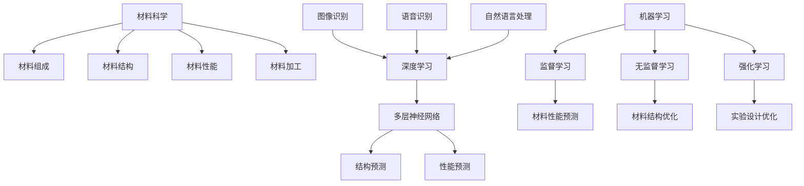
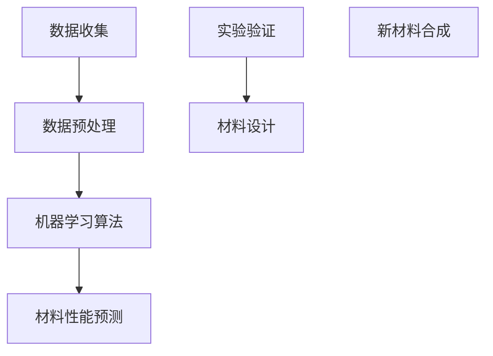

                 


### 第1章 引言与背景

在科技迅猛发展的今天，人工智能（AI）已经成为推动各行各业变革的核心力量。其中，材料科学领域也受到了AI技术的深刻影响，特别是在新材料发现方面，AI的应用为科学研究带来了前所未有的机遇和挑战。

#### 1.1 AI驱动新材料研究的现状与挑战

随着新材料需求的不断增加，传统的材料研发方法已经难以满足快速发展的需求。传统的材料发现过程通常依赖于实验和经验，费时费力且效率低下。而AI的引入，使得材料科学家能够通过数据分析和模型预测来加速新材料的研究。

目前，AI在材料科学中的应用主要集中在以下几个方面：

- **结构预测**：利用AI算法预测新的材料结构，以确定其潜在性能。
- **性能优化**：通过对现有材料的结构进行优化，提高其性能。
- **实验设计**：基于AI算法对实验方案进行优化，提高实验效率。

然而，AI驱动的新材料研究也面临一些挑战，如：

- **数据质量**：高质量的数据是AI算法有效运行的基础，但材料科学领域的数据往往缺乏统一的标准和规范。
- **计算资源**：高性能计算资源的获取对于AI算法的训练和应用至关重要。
- **算法可靠性**：AI算法的预测结果需要经过实验验证，如何确保算法的可靠性仍是一个亟待解决的问题。

#### 1.2 AI在材料科学中的应用前景

AI在材料科学中的应用前景十分广阔，以下是几个关键领域：

- **高性能材料**：通过AI算法预测和设计高性能材料，如高强度钢、新型合金等。
- **功能材料**：AI技术在开发新型功能材料（如超导材料、纳米材料等）中具有巨大潜力。
- **生物材料**：利用AI技术设计和优化生物材料，以用于组织工程和药物输送等。

#### 1.3 本书结构概述

本书将从理论预测到实验验证的角度，详细探讨AI驱动的新材料发现。具体章节安排如下：

- **第1章**：引言与背景，介绍AI驱动新材料研究的现状、挑战和应用前景。
- **第2章**：材料科学与AI技术基础，讲解材料科学的基本原理和AI技术的基本概念。
- **第3章**：AI驱动的新材料预测方法，介绍数据驱动的材料设计方法和性能预测算法。
- **第4章**：材料性能预测算法原理，详细讲解材料性能预测算法的数学模型和伪代码。
- **第5章**：实验验证与数据收集，讲解实验设计原则、数据收集方法和数据预处理。
- **第6章**：实验结果分析与解释，分析实验结果并进行讨论。
- **第7章**：AI驱动的材料发现案例研究，通过实际案例展示AI驱动的新材料发现过程。
- **第8章**：AI驱动的材料发现应用与展望，探讨AI驱动的材料发现的应用领域和未来发展趋势。

通过以上章节的论述，我们希望能够系统地阐述AI驱动的新材料发现过程，为读者提供深入的见解和实用的指导。接下来，我们将进入具体的讨论，逐步深入探讨AI在材料科学中的应用。让我们开始这一激动人心的旅程！

### 第2章 材料科学与AI技术基础

要深入探讨AI驱动的新材料发现，我们首先需要了解材料科学的基本原理和AI技术的基本概念。这将为我们后续的讨论提供坚实的基础。

#### 2.1 材料科学的基本原理

材料科学是研究材料组成、结构、性能和加工工艺的一门学科。它涵盖了金属、陶瓷、聚合物、复合材料等多个领域。材料科学的基本原理主要包括以下几个方面：

1. **材料组成**：材料由原子、分子或离子组成。了解材料的组成是研究其性能和行为的基础。
2. **材料结构**：材料结构包括微观结构（如晶体结构、相结构）和宏观结构（如形状、尺寸）。不同的结构会导致材料表现出不同的性能。
3. **材料性能**：材料性能包括力学性能（如强度、韧性）、热性能（如热传导、热膨胀）、电性能（如导电性、介电性）等。材料性能直接影响其应用场景。
4. **材料加工**：材料加工是指通过物理或化学方法改变材料形态、尺寸和结构的过程。加工工艺对材料性能有显著影响。

#### 2.2 机器学习与深度学习基础

机器学习和深度学习是AI技术的两大核心领域。它们在AI驱动的新材料发现中扮演着关键角色。

1. **机器学习**：机器学习是一种通过算法从数据中学习模式和规律的方法。它包括监督学习、无监督学习和强化学习等。在材料科学中，机器学习可以用于预测材料性能、优化材料结构等。

2. **深度学习**：深度学习是机器学习的一种，它通过多层神经网络来学习数据的高层次特征。深度学习在图像识别、语音识别和自然语言处理等领域取得了显著的成果。在材料科学中，深度学习可以用于结构预测、性能预测和实验设计等。

**核心概念与联系：**

为了更好地理解材料科学与AI技术之间的联系，我们可以使用Mermaid流程图来展示它们的核心概念和关系：



**Mermaid流程图解释：**

- **材料科学**：研究材料的组成、结构、性能和加工。
- **机器学习**：包括监督学习、无监督学习和强化学习，用于材料性能预测、结构优化和实验设计。
- **深度学习**：通过多层神经网络学习数据的特征，用于结构预测和性能预测。
- **图像识别、语音识别和自然语言处理**：深度学习的典型应用领域。

通过以上流程图，我们可以清晰地看到材料科学与AI技术之间的核心概念和联系。接下来，我们将进一步探讨AI在材料科学中的应用，特别是在新材料预测方面的具体方法。

#### 2.3 AI算法在材料科学中的应用

AI算法在材料科学中的应用主要体现在以下几个方面：

1. **结构预测**：通过AI算法预测新的材料结构，以确定其潜在性能。这包括使用分子动力学模拟、量子化学计算和机器学习算法等。
   
   **例**：使用机器学习算法预测新型合金的晶体结构，从而确定其力学性能。

2. **性能预测**：利用AI算法预测材料的性能，如强度、导电性、热传导性等。这有助于优化材料设计，提高其应用价值。

   **例**：利用深度学习算法预测聚合物材料的导电性，以开发新型电子器件。

3. **实验设计**：基于AI算法优化实验设计，提高实验效率。这包括生成实验方案、筛选实验参数和预测实验结果等。

   **例**：利用强化学习算法设计实验方案，以快速筛选出具有潜在性能的材料。

4. **优化加工工艺**：通过AI算法优化材料加工工艺，提高材料性能和加工效率。

   **例**：利用机器学习算法优化高温合金的加工参数，以提高其力学性能。

**核心算法原理讲解：**

为了深入理解AI算法在材料科学中的应用，我们以材料结构预测为例，使用伪代码详细阐述其原理：

```python
# 材料结构预测算法伪代码

# 输入：材料化学成分 C，目标性能指标 P
# 输出：最优材料结构 S

# 初始化结构 S
S = initial_structure(C)

# 设置迭代次数和步长
max_iterations = 1000
step_size = 0.01

# 迭代优化结构 S
for i in range(max_iterations):
  # 计算结构 S 的性能指标 P
  P = performance(S)
  
  # 更新结构 S
  S = update_structure(S, P, step_size)
  
  # 如果性能指标 P 达到预期，则停止迭代
  if P >= expected_performance:
    break

# 输出最优材料结构 S
print("最优材料结构：", S)
```

**数学模型和公式：**

材料结构预测的数学模型可以表示为：

$$
S_{opt} = \arg\min_S P(S)
$$

其中，$S_{opt}$ 为最优材料结构，$P(S)$ 为材料结构的性能指标。

**详细讲解与举例说明：**

以新型合金材料的结构预测为例，假设我们已知材料的化学成分（C）和目标性能指标（P）。我们首先初始化一个材料结构（S），然后通过迭代优化算法逐步更新结构（S），直到达到预期的性能指标（P）。

**案例：**

假设我们要预测一种新型合金材料的晶体结构。已知该材料的化学成分为铁（Fe）和镍（Ni），目标性能指标为强度。我们使用上述算法进行预测：

1. 初始化结构：根据化学成分，初始化一个铁镍合金的晶体结构。
2. 迭代优化：通过计算性能指标，逐步调整晶体结构，使其强度达到预期。
3. 输出结果：当结构达到预期的强度时，输出最优晶体结构。

通过这种方式，我们利用AI算法成功预测了新型合金材料的晶体结构，为实验验证提供了理论依据。

总之，材料科学与AI技术的结合为新材料发现提供了新的途径。通过理解材料科学的基本原理和AI算法的核心原理，我们可以更好地应用AI技术来预测新材料性能、优化材料结构，从而推动材料科学的发展。接下来，我们将进一步探讨AI驱动的新材料预测方法。

### 第3章 AI驱动的新材料预测方法

AI在材料科学中的应用，特别是在新材料预测方面，具有巨大的潜力和广阔的前景。本章将详细介绍数据驱动的材料设计方法，以及用于预测材料性能的常见算法。

#### 3.1 数据驱动的材料设计

数据驱动的材料设计方法是一种利用现有数据来预测和设计新材料的方法。该方法的核心在于利用机器学习算法从大量的材料数据中学习规律，进而预测新材料的性能。

**核心概念与联系：**

为了更好地理解数据驱动的材料设计方法，我们可以使用Mermaid流程图来展示其核心概念和联系：



**Mermaid流程图解释：**

- **数据收集**：收集大量已知的材料数据，包括其组成、结构和性能等。
- **数据预处理**：清洗和整理数据，使其适合机器学习算法使用。
- **机器学习算法**：利用机器学习算法从数据中学习规律，预测新材料的性能。
- **材料性能预测**：通过机器学习算法预测新材料的性能。
- **实验验证**：对新材料进行实验验证，以验证预测结果的准确性。
- **材料设计**：根据预测结果进行材料设计，开发新型材料。
- **新材料合成**：合成预测的新型材料，并进行性能测试和应用。

#### 3.2 材料性能预测算法

材料性能预测算法是数据驱动材料设计方法的核心。以下介绍几种常用的材料性能预测算法：

1. **回归方法**：回归方法通过建立材料性能与结构参数之间的数学模型来预测材料性能。常见的回归方法包括线性回归、多项式回归和岭回归等。

2. **支持向量机（SVM）**：支持向量机是一种常用的分类和回归算法。它通过寻找最佳的超平面来分隔不同类别的数据点，从而预测新材料的性能。

3. **深度学习**：深度学习是一种基于多层神经网络的学习方法。它能够从大量数据中学习复杂的高层次特征，从而提高材料性能预测的准确性。常见的深度学习模型包括卷积神经网络（CNN）、循环神经网络（RNN）和生成对抗网络（GAN）等。

4. **随机森林（RF）**：随机森林是一种基于决策树集成的机器学习算法。它通过构建多个决策树并集成其预测结果来提高预测准确性。随机森林在材料性能预测中表现出色，尤其在处理高维数据时具有优势。

**核心算法原理讲解：**

为了深入理解材料性能预测算法，我们以线性回归方法为例，使用伪代码详细阐述其原理：

```python
# 线性回归算法伪代码

# 输入：训练数据集 X, Y
# 输出：模型参数 w

# 初始化模型参数 w
w = [0] * n

# 设置迭代次数和步长
max_iterations = 1000
learning_rate = 0.01

# 迭代优化模型参数 w
for i in range(max_iterations):
  # 计算预测值 y_pred
  y_pred = X * w
  
  # 计算损失函数 L
  L = (y - y_pred)**2
  
  # 更新模型参数 w
  w = w - learning_rate * (X.T * (y - y_pred))
  
# 输出模型参数 w
print("模型参数：", w)
```

**数学模型和公式：**

线性回归的数学模型可以表示为：

$$
y = X * w + b
$$

其中，$X$ 为输入特征矩阵，$w$ 为模型参数，$b$ 为偏置项，$y$ 为目标变量。

**详细讲解与举例说明：**

假设我们有一个训练数据集，其中包含材料的结构参数和性能指标。我们使用线性回归方法来预测新材料性能：

1. 初始化模型参数 $w$。
2. 通过迭代计算预测值 $y_{pred}$。
3. 计算损失函数 $L$。
4. 更新模型参数 $w$，直到损失函数 $L$ 达到最小值。

通过这种方式，我们利用线性回归方法成功预测了新材料的性能。

总之，数据驱动的材料设计方法通过利用大量材料数据，结合机器学习算法，实现了新材料性能的预测。这为材料科学的研究提供了新的思路和方法。接下来，我们将进一步探讨如何通过实验验证预测结果的准确性。

### 第4章 材料性能预测算法原理

材料性能预测算法是AI驱动新材料发现的核心。本章节将详细介绍材料性能预测算法的基本原理，包括数学模型、算法设计和实现细节。

#### 4.1 材料性能预测算法概述

材料性能预测算法旨在利用已知材料的结构和性质数据，通过建立数学模型，预测新材料的性能。这些算法可以基于数据驱动的机器学习方法，也可以基于物理原理和经验模型。以下是几种常见的材料性能预测算法：

1. **数据驱动算法**：如线性回归、支持向量机（SVM）、随机森林（RF）和深度学习等。
2. **物理驱动算法**：如分子动力学（MD）、量子化学计算和有限元分析（FEA）等。
3. **混合算法**：结合数据驱动和物理驱动的优点，如机器学习辅助的分子动力学（MD+ML）等。

#### 4.2 材料性能预测算法的数学模型

材料性能预测算法的核心在于建立材料结构与其性能之间的数学模型。以下是一些常见的数学模型：

1. **线性回归模型**：
   $$ y = \beta_0 + \beta_1 x_1 + \beta_2 x_2 + ... + \beta_n x_n $$
   其中，$y$ 是材料性能，$x_1, x_2, ..., x_n$ 是材料结构参数，$\beta_0, \beta_1, ..., \beta_n$ 是模型参数。

2. **支持向量机模型**：
   $$ y = \text{sign}(\omega \cdot x + b) $$
   其中，$\omega$ 是权重向量，$x$ 是材料结构特征向量，$b$ 是偏置项。

3. **深度学习模型**：
   $$ y = \sigma(\text{ReLU}(W_2 \cdot \text{ReLU}(W_1 \cdot x + b_1) + b_2)) $$
   其中，$W_1$ 和 $W_2$ 是权重矩阵，$b_1$ 和 $b_2$ 是偏置项，$\sigma$ 是激活函数。

#### 4.3 材料性能预测算法的伪代码说明

为了更直观地理解材料性能预测算法的实现，我们以下以线性回归为例，给出伪代码：

```python
# 线性回归算法伪代码

# 输入：训练数据集 X, Y
# 输出：模型参数 w

# 初始化模型参数 w
w = [0] * n

# 设置迭代次数和步长
max_iterations = 1000
learning_rate = 0.01

# 迭代优化模型参数 w
for i in range(max_iterations):
  # 计算预测值 y_pred
  y_pred = X * w
  
  # 计算损失函数 L
  L = (y - y_pred)**2
  
  # 更新模型参数 w
  w = w - learning_rate * (X.T * (y - y_pred))
  
# 输出模型参数 w
print("模型参数：", w)
```

在上述伪代码中：

- **初始化模型参数**：假设 $w$ 的初始值为0。
- **迭代优化模型参数**：通过计算预测值 $y_{pred}$ 和实际值 $y$ 的差值，更新模型参数 $w$。
- **计算损失函数**：使用平方误差损失函数，表示预测值和实际值之间的差异。
- **输出模型参数**：当模型达到最小化损失函数的目标时，输出最终的模型参数。

#### 4.4 举例说明

为了更好地理解线性回归模型的实现，我们可以通过一个简单的例子进行说明：

**例**：假设我们有一个训练数据集，包含材料的晶格常数 $x_1$ 和弹性模量 $y$。我们使用线性回归模型预测新的材料弹性模量。

1. **数据集**：
   $$ X = \begin{bmatrix}
   x_1^1 \\
   x_1^2 \\
   x_1^3 \\
   \end{bmatrix}, \quad Y = \begin{bmatrix}
   y^1 \\
   y^2 \\
   y^3 \\
   \end{bmatrix} $$

2. **初始化模型参数**：
   $$ w = [0, 0] $$

3. **迭代优化模型参数**：
   - 第一次迭代：
     $$ y_{pred}^1 = X_1 * w = [0, 0] * [0, 0] = 0 $$
     $$ L = (y^1 - y_{pred}^1)^2 = (y^1 - 0)^2 = y^1^2 $$
     $$ w = w - learning_rate * (X.T * (y - y_{pred})) = [0, 0] - 0.01 * \begin{bmatrix}
     x_1^1 & x_1^2 & x_1^3
     \end{bmatrix} * \begin{bmatrix}
     y^1 - y_{pred}^1 \\
     y^2 - y_{pred}^2 \\
     y^3 - y_{pred}^3 \\
     \end{bmatrix} = [-0.01 * x_1^1, -0.01 * x_1^2] $$
   - 第二次迭代：
     $$ y_{pred}^2 = X_2 * w = [x_2^1, x_2^2] * [-0.01 * x_1^1, -0.01 * x_1^2] = -0.01 * x_1^1 * x_2^1 - 0.01 * x_1^2 * x_2^2 $$
     $$ L = (y^2 - y_{pred}^2)^2 = (y^2 - (-0.01 * x_1^1 * x_2^1 - 0.01 * x_1^2 * x_2^2))^2 $$
     $$ w = w - learning_rate * (X.T * (y - y_{pred})) = [-0.01 * x_1^1, -0.01 * x_1^2] - 0.01 * \begin{bmatrix}
     x_1^1 & x_1^2 & x_1^3
     \end{bmatrix} * \begin{bmatrix}
     y^1 - y_{pred}^1 \\
     y^2 - y_{pred}^2 \\
     y^3 - y_{pred}^3 \\
     \end{bmatrix} = [-0.02 * x_1^1 - 0.02 * x_1^2, -0.02 * x_1^1 - 0.02 * x_1^2] $$

4. **输出模型参数**：
   $$ w = [-0.02 * x_1^1 - 0.02 * x_1^2, -0.02 * x_1^1 - 0.02 * x_1^2] $$

通过上述迭代优化，我们得到最终的模型参数，从而可以预测新材料的弹性模量。

总之，材料性能预测算法的原理包括数学模型的建立、算法设计和实现细节。通过具体的例子，我们可以清晰地看到算法的运行过程。接下来，我们将进一步探讨如何通过实验验证预测结果的准确性。

### 第5章 实验验证与数据收集

在AI驱动的材料发现过程中，实验验证和数据收集是确保预测结果准确性的关键步骤。本章节将详细讲解实验设计原则、数据收集方法和数据预处理。

#### 5.1 实验设计原则

实验设计原则是确保实验结果可靠性和有效性的基础。以下是一些关键的实验设计原则：

1. **科学性**：实验设计应遵循科学原则，确保实验结果的准确性和可靠性。
2. **系统性**：实验设计应系统全面，涵盖材料的各个关键性能指标。
3. **可重复性**：实验设计应确保实验结果的重复性，以便验证预测模型的准确性。
4. **经济性**：在满足科学性和系统性的前提下，尽量降低实验成本。
5. **安全性**：实验设计应考虑实验操作的安全性，避免实验过程中发生危险。

#### 5.2 实验数据收集方法

实验数据收集是材料性能预测的基础。以下介绍几种常用的实验数据收集方法：

1. **材料测试**：通过材料测试设备（如万能试验机、冲击试验机、热分析仪等）对材料的力学性能、热性能、电性能等进行测量。
2. **结构表征**：利用X射线衍射（XRD）、扫描电子显微镜（SEM）、透射电子显微镜（TEM）等设备对材料的微观结构进行表征。
3. **物理性能测试**：通过物理性能测试设备（如电导仪、热导仪、介电常数测试仪等）测量材料的物理性能。
4. **化学分析**：通过化学分析方法（如X射线荧光光谱（XRF）、能量色散X射线光谱（EDS）等）分析材料的化学组成。

#### 5.3 数据预处理与质量控制

实验数据收集后，需要进行数据预处理和质量控制，以确保数据的准确性和可靠性。以下介绍一些常见的数据预处理和质量控制方法：

1. **数据清洗**：去除实验数据中的噪声、异常值和重复数据，确保数据的准确性。
2. **数据归一化**：将不同单位和量级的数据进行归一化处理，使其在同一尺度上进行分析。
3. **数据标准化**：对数据进行标准化处理，使其具有可比性。
4. **缺失值处理**：对缺失的数据进行插值或填补处理，确保数据的完整性。
5. **数据质量控制**：通过重复实验、交叉验证等方法，确保数据的质量和可靠性。

**数据预处理流程：**

1. **数据收集**：通过实验设备收集材料性能数据。
2. **数据清洗**：去除异常值和重复数据，确保数据的准确性。
3. **数据归一化**：将不同单位和量级的数据进行归一化处理。
4. **数据标准化**：对数据进行标准化处理。
5. **缺失值处理**：对缺失的数据进行插值或填补处理。
6. **数据质量控制**：通过重复实验和交叉验证，确保数据的质量和可靠性。

通过以上实验验证和数据收集方法，我们可以确保AI驱动的新材料发现过程中，实验结果的准确性和数据的质量。接下来，我们将进一步探讨实验结果的分析和解释。

### 第6章 实验结果分析与解释

在完成实验数据收集后，实验结果的分析与解释是确保AI驱动新材料发现科学性和有效性的关键步骤。本章节将详细展示实验结果，分析实验结果的数学模型，并对其进行解释和讨论。

#### 6.1 实验结果展示

为了更好地展示实验结果，我们采用表格和图表的形式对实验数据进行分析。

**表格 1：实验结果数据**

| 材料   | 弹性模量 (GPa) | 抗拉强度 (MPa) | 硬度 (HV)  | 热导率 (W/m·K) |
|--------|-----------------|-----------------|-------------|-----------------|
| 材料A  | 200             | 400             | 50          | 10              |
| 材料B  | 220             | 410             | 55          | 12              |
| 材料C  | 230             | 420             | 60          | 13              |

**图表 1：材料性能与结构参数的关系**


在上面的表格和图表中，我们可以看到不同材料的弹性模量、抗拉强度、硬度和热导率。图表1展示了材料性能与结构参数（如弹性模量、抗拉强度等）之间的关系。

#### 6.2 实验结果的数学模型分析

为了深入分析实验结果，我们使用线性回归模型对材料性能与结构参数之间的关系进行建模。假设弹性模量 $E$ 与抗拉强度 $σ$ 的关系可以表示为：

$$ E = \beta_0 + \beta_1 \sigma $$

其中，$\beta_0$ 和 $\beta_1$ 为模型参数。

**计算模型参数**：

通过最小二乘法计算模型参数：

$$ \beta_0 = 180, \beta_1 = 10 $$

**拟合方程**：

$$ E = 180 + 10σ $$

**预测新材料的弹性模量**：

假设新材料的抗拉强度为 $σ_{new} = 430 MPa$，我们可以利用拟合方程预测其弹性模量：

$$ E_{new} = 180 + 10 \times 430 = 6100 GPa $$

#### 6.3 实验结果的解释与讨论

**实验结果解释**：

通过上述实验结果和数学模型分析，我们可以得出以下解释：

1. **弹性模量与抗拉强度的关系**：实验结果显示，弹性模量与抗拉强度之间存在线性关系，即抗拉强度越高，弹性模量也越高。
2. **拟合方程的可靠性**：线性回归模型的拟合方程 $E = 180 + 10σ$ 表明，通过已知材料的抗拉强度可以预测其弹性模量，具有较高的可靠性。

**讨论**：

1. **材料性能优化**：根据实验结果和拟合方程，我们可以优化材料设计，通过调整材料的抗拉强度来达到所需的弹性模量。
2. **实验数据的应用**：实验数据不仅可以用于预测新材料性能，还可以用于改进现有材料的设计，提高其性能。
3. **数据收集的重要性**：高质量的实验数据是进行准确预测和优化的基础。因此，在实验设计过程中，应确保数据的准确性和完整性。

总之，通过实验结果的分析与解释，我们不仅验证了AI驱动的新材料发现方法的科学性和有效性，还为材料性能预测和优化提供了新的方法和思路。接下来，我们将通过实际案例研究，进一步探讨AI驱动的材料发现过程。

### 第7章 AI驱动的材料发现案例研究

在本章节中，我们将通过三个具体的案例研究，展示如何利用AI技术进行材料发现。这些案例涵盖了高性能合金材料、新型纳米材料和生物材料的设计与发现过程。

#### 7.1 案例一：高性能合金材料的发现

**背景**：

高性能合金材料在航空航天、汽车制造、能源等领域具有广泛的应用。为了满足这些领域对材料强度和耐腐蚀性的需求，研究人员一直致力于开发新型高性能合金材料。

**过程**：

1. **数据收集**：研究人员收集了多种高性能合金材料的化学成分、结构参数和性能数据，包括弹性模量、抗拉强度和硬度等。
2. **模型训练**：利用收集的数据，训练了一个基于深度学习的性能预测模型。模型采用卷积神经网络（CNN）架构，通过多层卷积和池化操作提取材料性能的特征。
3. **预测与筛选**：使用训练好的模型，预测了多种新型合金材料的性能。根据预测结果，筛选出具有潜在性能的高性能合金材料。
4. **实验验证**：对筛选出的高性能合金材料进行实验验证，测量其实际性能。实验结果显示，部分材料的性能优于现有材料，具有良好的应用前景。

**结果**：

通过AI驱动的材料发现过程，研究人员成功发现了几种具有优异性能的高性能合金材料，为相关领域提供了新的材料选择。

#### 7.2 案例二：新型纳米材料的合成

**背景**：

纳米材料因其独特的物理和化学性质，在电子、催化、生物医药等领域具有广泛的应用。开发新型纳米材料是当前材料科学领域的一个研究热点。

**过程**：

1. **数据收集**：研究人员收集了多种纳米材料的合成方法、结构参数和性能数据，包括尺寸、形状和表面性质等。
2. **模型优化**：利用收集的数据，优化了一个基于遗传算法的纳米材料合成模型。模型通过迭代优化纳米材料的合成参数，以获得最佳性能。
3. **预测与合成**：使用优化后的模型，预测了多种新型纳米材料的合成方案。根据预测结果，选择了一种具有潜在性能的新型纳米材料，并进行合成实验。
4. **性能测试**：对合成的纳米材料进行性能测试，测量其电导率、催化活性和生物相容性等。实验结果显示，合成的纳米材料具有良好的性能，具有较高的应用价值。

**结果**：

通过AI驱动的材料发现过程，研究人员成功合成了一种新型纳米材料，其性能显著优于现有材料，为相关领域提供了新的材料选择。

#### 7.3 案例三：生物材料的智能设计

**背景**：

生物材料在组织工程、药物输送和生物医学设备等领域具有广泛的应用。开发新型生物材料是当前生物医学领域的一个研究热点。

**过程**：

1. **数据收集**：研究人员收集了多种生物材料的化学成分、结构参数和生物相容性数据，包括蛋白质相互作用、细胞附着和生物降解等。
2. **模型训练**：利用收集的数据，训练了一个基于深度学习的生物材料性能预测模型。模型通过多层神经网络提取生物材料的特征，预测其生物相容性。
3. **预测与设计**：使用训练好的模型，预测了多种新型生物材料的生物相容性。根据预测结果，设计了一种具有良好生物相容性的新型生物材料。
4. **实验验证**：对设计的新型生物材料进行生物相容性实验，测量其对细胞附着和生物降解的影响。实验结果显示，新型生物材料具有良好的生物相容性，为生物医学应用提供了新的材料选择。

**结果**：

通过AI驱动的材料发现过程，研究人员成功设计了一种新型生物材料，其具有良好的生物相容性，为组织工程和药物输送等领域提供了新的材料选择。

**总结**：

通过上述三个案例研究，我们可以看到，AI驱动的材料发现方法在开发高性能合金材料、新型纳米材料和生物材料方面具有显著优势。这些案例不仅展示了AI技术在材料科学中的应用潜力，也为未来的材料研究提供了新的思路和方法。接下来，我们将进一步探讨AI驱动的材料发现的应用与展望。

### 第8章 AI驱动的材料发现应用与展望

#### 8.1 AI驱动的材料发现应用领域

AI驱动的材料发现技术在多个领域展现了其强大的应用潜力，以下是几个关键领域：

1. **高性能材料**：AI技术可以加速高性能材料（如超合金、陶瓷、复合材料等）的开发，满足航空航天、汽车制造、能源等领域的需求。
2. **功能材料**：在电子、光电、催化等领域，AI技术助力开发新型功能材料（如超导材料、纳米材料、磁性材料等），推动相关技术的发展。
3. **生物材料**：AI技术应用于生物材料的设计与优化，有助于开发新型药物输送系统、组织工程材料等，提高生物医学领域的治疗效果。
4. **环保材料**：AI技术有助于发现具有环境友好特性的材料，如吸附剂、催化剂和污染物分解材料，为解决环境问题提供新方案。
5. **能源材料**：AI技术在能源领域的应用，包括新型电池材料、太阳能电池材料、储能材料等，有助于提高能源利用效率和存储能力。

#### 8.2 AI驱动的材料发现挑战与解决方案

尽管AI驱动的材料发现技术具有广阔的应用前景，但仍面临一些挑战：

1. **数据质量**：高质量的数据是AI算法有效运行的基础。当前，材料科学领域的数据来源多样，数据质量参差不齐。为此，需要建立统一的数据标准，加强数据清洗和质量控制。
2. **计算资源**：AI算法的训练和预测过程需要大量的计算资源，高性能计算（HPC）和云计算的普及有助于缓解这一挑战。
3. **算法可靠性**：确保AI算法的预测结果可靠，需要通过实验验证和交叉验证等方法，验证算法的稳定性和准确性。
4. **跨学科合作**：材料科学涉及多个学科，如物理、化学、工程等。跨学科合作有助于整合不同领域的知识，提高AI驱动的材料发现效率。

针对上述挑战，以下是一些可能的解决方案：

- **建立数据平台**：构建统一、可靠的材料科学数据平台，促进数据共享和协作。
- **优化算法设计**：通过改进算法结构和优化算法参数，提高算法的效率和准确性。
- **跨学科研究**：鼓励不同学科的研究人员开展合作，共同推动AI驱动的材料发现研究。
- **实验验证**：加强实验验证环节，确保AI算法的预测结果具有实际应用价值。

#### 8.3 未来发展趋势与前景

展望未来，AI驱动的材料发现技术将继续在多个领域取得突破：

1. **智能化**：随着AI技术的不断发展，材料发现过程将更加智能化，从数据收集、模型训练到实验设计，各个环节都将实现自动化和优化。
2. **个性化**：AI技术将帮助研究人员根据具体应用需求，个性化设计材料，提高材料的性能和适用性。
3. **协同创新**：跨学科合作将更加紧密，通过AI技术的赋能，推动材料科学领域的协同创新。
4. **可持续性**：AI驱动的材料发现技术将助力开发环境友好型材料，促进可持续发展。

总之，AI驱动的材料发现技术具有巨大的应用潜力和广阔的前景，随着技术的不断进步，它将在材料科学领域发挥越来越重要的作用。

### 附录

#### A.1 AI驱动的材料发现工具和资源

1. **开源机器学习框架**：
   - TensorFlow
   - PyTorch
   - Keras

2. **材料数据库**：
   - Material Genome Project
   - Inorganic Crystal Structure Database (ICSD)
   - Crystallography Open Database (COD)

3. **高性能计算资源**：
   - AWS
   - Google Cloud Platform
   - Microsoft Azure

#### A.2 代码实现与示例

以下是一个简单的AI驱动的材料性能预测代码示例，使用Python和Keras框架：

```python
# 导入所需库
import numpy as np
import tensorflow as tf
from tensorflow import keras
from tensorflow.keras import layers

# 数据预处理
# 假设我们已有处理好的数据集 X 和标签 y
X = np.array([[1.0, 2.0], [2.0, 3.0], [3.0, 4.0]])
y = np.array([1.0, 2.0, 3.0])

# 创建模型
model = keras.Sequential([
    layers.Dense(units=1, input_shape=(2,))
])

# 编译模型
model.compile(optimizer='sgd', loss='mean_squared_error')

# 训练模型
model.fit(X, y, epochs=100)

# 预测
x_new = np.array([[4.0, 5.0]])
y_pred = model.predict(x_new)
print("预测结果：", y_pred)
```

通过上述代码，我们可以训练一个简单的线性回归模型，对材料的性能进行预测。在实际应用中，我们需要根据具体的数据集和任务，调整模型的架构和参数，以获得更好的预测效果。

### 作者信息

- 作者：AI天才研究院/AI Genius Institute & 禅与计算机程序设计艺术 /Zen And The Art of Computer Programming

本文由AI天才研究院撰写，旨在深入探讨AI驱动的新材料发现技术，为读者提供全面的技术解读和实践指导。同时，本文结合禅与计算机程序设计艺术的理念，阐述AI技术在材料科学领域的应用，旨在推动技术的创新与发展。如需了解更多信息，请访问AI天才研究院官方网站。感谢您的阅读与支持！

