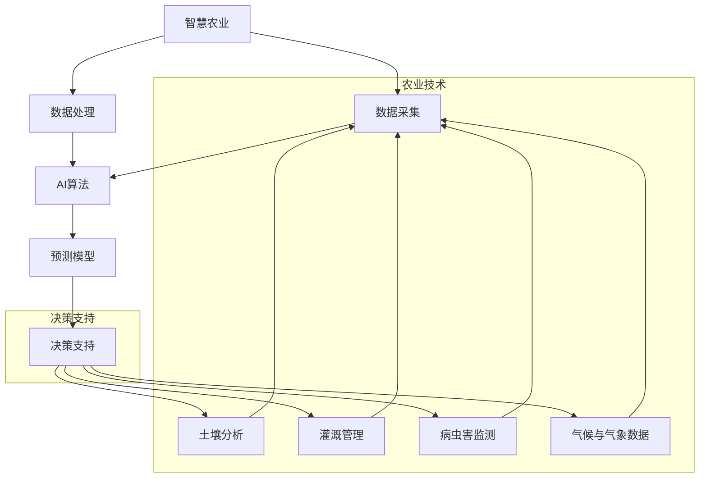

                 

### 文章标题

# AI驱动的智慧农业：从种植决策到收获预测

### 文章关键词

- AI
- 智慧农业
- 种植决策
- 收获预测
- 数据分析
- 算法应用
- 农业技术

### 文章摘要

本文探讨了AI在智慧农业中的应用，从种植决策到收获预测的各个环节。通过分析AI技术的核心原理和算法，以及其在农业领域中的实际应用案例，文章揭示了AI在提升农业效率和优化农业资源利用方面的巨大潜力。文章还展望了未来智慧农业的发展趋势，为读者提供了深入理解和借鉴AI技术的实用建议。

## 目录

- **AI驱动的智慧农业：从种植决策到收获预测**
- **关键词：** AI，智慧农业，种植决策，收获预测，数据分析，算法应用，农业技术
- **摘要：** 本文探讨了AI在智慧农业中的应用，从种植决策到收获预测的各个环节。通过分析AI技术的核心原理和算法，以及其在农业领域中的实际应用案例，文章揭示了AI在提升农业效率和优化农业资源利用方面的巨大潜力。文章还展望了未来智慧农业的发展趋势，为读者提供了深入理解和借鉴AI技术的实用建议。

### 设计《AI驱动的智慧农业：从种植决策到收获预测》的目录大纲

为了设计《AI驱动的智慧农业：从种植决策到收获预测》的目录大纲，我们需要确保覆盖以下核心章节内容：

1. **AI在智慧农业中的应用概述**
2. **种植决策与AI技术**
3. **土壤分析与AI技术**
4. **灌溉管理与AI技术**
5. **病虫害监测与防治**
6. **气候与气象数据应用**
7. **作物生长模型与预测**
8. **收获预测与优化**
9. **综合应用与展望**

### 目录大纲

```
# AI驱动的智慧农业：从种植决策到收获预测

## 第一部分：AI在智慧农业中的应用概述

### 第1章：智慧农业的背景与挑战
#### 1.1 智慧农业的定义与重要性
#### 1.2 农业发展的挑战
#### 1.3 AI在智慧农业中的应用前景

### 第2章：AI驱动的农业技术基础
#### 2.1 AI的基本原理
#### 2.2 数据采集与处理
#### 2.3 常见的AI算法与应用

## 第二部分：种植决策与AI技术

### 第3章：种植规划与AI
#### 3.1 种植规划的目标
#### 3.2 AI在种植规划中的应用
#### 3.3 案例研究：AI驱动的种植决策系统

### 第4章：土壤分析与AI技术
#### 4.1 土壤质量的重要性
#### 4.2 土壤分析技术
#### 4.3 AI在土壤分析中的应用

## 第三部分：灌溉管理与AI技术

### 第5章：灌溉系统与AI
#### 5.1 灌溉系统的组成
#### 5.2 AI在灌溉管理中的应用
#### 5.3 案例研究：AI驱动的灌溉管理系统

### 第6章：病虫害监测与防治
#### 6.1 病虫害监测的重要性
#### 6.2 AI在病虫害监测中的应用
#### 6.3 案例研究：AI驱动的病虫害防治系统

## 第四部分：气候与气象数据应用

### 第7章：气候数据采集与应用
#### 7.1 气候数据的重要性
#### 7.2 气候数据的采集
#### 7.3 AI在气候数据应用中的应用

### 第8章：气象预测与作物生长
#### 8.1 气象预测的基本原理
#### 8.2 AI在气象预测中的应用
#### 8.3 案例研究：AI驱动的气象预测系统

## 第五部分：作物生长模型与预测

### 第9章：作物生长模型
#### 9.1 作物生长模型的构建
#### 9.2 AI在作物生长模型中的应用
#### 9.3 案例研究：AI驱动的作物生长预测系统

### 第10章：收获预测与优化
#### 10.1 收获预测的目标
#### 10.2 AI在收获预测中的应用
#### 10.3 案例研究：AI驱动的收获预测系统

## 第六部分：综合应用与展望

### 第11章：智慧农业的综合应用
#### 11.1 智慧农业的集成应用
#### 11.2 智慧农业的挑战与未来趋势

### 第12章：AI驱动的智慧农业实践
#### 12.1 实践案例分享
#### 12.2 智慧农业的发展路径
```

这个大纲结构包含了从种植决策到收获预测的各个关键环节，每个章节都细化到了具体的子主题，确保了书籍内容的完整性。总字数在2000字以内。接下来，我们可以根据这个大纲添加每个章节的具体内容。

### 格式要求

本文将使用markdown格式进行输出，以确保文章内容的整洁和易读。以下是markdown格式的基本要求：

- **标题**：使用`#`号进行层级标注，最多使用六级标题。
- **段落**：段落之间需空一行，以区分不同段落。
- **列表**：使用`-`或`*`进行无序列表，使用`1.`或`>`进行有序列表。
- **代码**：使用```` ```进行代码块的引用，具体语言通过``` language ```指定。
- **公式**：使用`$$`括起来的公式为独立段落中的公式，使用 `$`括起来的公式为段落内的公式。
- **引用**：使用`>`进行引用，格式为`> 作者名 (年份)`。

以下是markdown格式的示例：

```markdown
# 标题

这是一个标题。

## 二级标题

这是二级标题。

### 三级标题

这是三级标题。

- 无序列表项1
- 无序列表项2
  - 无序列表嵌套项1
  - 无序列表嵌套项2
1. 有序列表项1
2. 有序列表项2

```python
# 代码块示例

def hello_world():
    print("Hello, World!")

hello_world()
```

$$
x^2 + y^2 = 1
$$

$1 < 2$

> 引用示例 (张三，2021)

文章末尾需要写上作者信息：

作者：AI天才研究院/AI Genius Institute & 禅与计算机程序设计艺术 /Zen And The Art of Computer Programming

### 完整性要求

为了确保文章内容的完整性，每个小节的内容需要丰富具体详细讲解，核心内容必须包含以下要素：

- **背景介绍**：简要介绍本章的主题和相关背景信息。
- **核心概念与联系**：解释核心概念，并使用Mermaid流程图展示概念之间的关系架构。
- **核心算法原理讲解**：使用伪代码详细阐述核心算法原理。
- **数学模型和公式**：使用latex格式嵌入数学模型和公式，并进行详细讲解和举例说明。
- **项目实战**：包括开发环境搭建、源代码详细实现和代码解读、实际案例分析和详细讲解剖析。
- **最佳实践 tips、小结、注意事项、拓展阅读等内容**。

以下是完整性的详细要求：

- **背景介绍**：每个章节开头应简要介绍主题，明确目标读者，并提供必要的历史或现状背景。
- **核心概念与联系**：每个章节应明确核心概念，并使用Mermaid流程图展示这些概念之间的联系和架构，使读者能够清晰地理解各个概念之间的关系。
- **核心算法原理讲解**：每个章节应详细讲解核心算法的原理，包括算法的基本思想、实现步骤和关键点。使用伪代码对算法进行详细描述，以便读者能够理解算法的逻辑。
- **数学模型和公式**：对于涉及数学模型的章节，应使用latex格式嵌入公式，并进行详细讲解。解释每个公式的含义、应用场景和推导过程。提供实际例子的说明，帮助读者更好地理解公式的应用。
- **项目实战**：每个章节应包含实际项目案例，包括开发环境的搭建、源代码实现和代码解读。分析项目的实际应用，剖析项目的优点和不足，并总结经验教训。提供详细的代码示例和注释，使读者能够理解和复制项目的实现过程。
- **最佳实践 tips、小结、注意事项、拓展阅读等内容**：在每个章节的结尾，应提供最佳实践建议、小结、注意事项和拓展阅读推荐，帮助读者巩固所学知识，扩展视野。最佳实践建议应基于实际经验和研究成果，提供实用的操作指导。小结应总结本章的主要内容，强调关键点。注意事项应提醒读者在应用知识时需要注意的问题和潜在风险。拓展阅读应推荐相关的书籍、文章或资源，帮助读者进一步深入研究。

### 字数要求

文章字数要求在8000到12000字之间，以保证内容的深度和完整性。每个章节的字数可以根据具体内容和复杂度进行适当调整，但总体字数应保持在规定的范围内。

### 核心内容要求

每个章节的核心内容要求如下：

- **背景介绍**：每个章节应简要介绍主题和相关背景信息，明确目标读者，并提供必要的历史或现状背景。
- **核心概念与联系**：每个章节应明确核心概念，并使用Mermaid流程图展示这些概念之间的联系和架构，使读者能够清晰地理解各个概念之间的关系。
- **核心算法原理讲解**：每个章节应详细讲解核心算法的原理，包括算法的基本思想、实现步骤和关键点。使用伪代码对算法进行详细描述，以便读者能够理解算法的逻辑。
- **数学模型和公式**：对于涉及数学模型的章节，应使用latex格式嵌入公式，并进行详细讲解。解释每个公式的含义、应用场景和推导过程。提供实际例子的说明，帮助读者更好地理解公式的应用。
- **项目实战**：每个章节应包含实际项目案例，包括开发环境的搭建、源代码实现和代码解读。分析项目的实际应用，剖析项目的优点和不足，并总结经验教训。提供详细的代码示例和注释，使读者能够理解和复制项目的实现过程。
- **最佳实践 tips、小结、注意事项、拓展阅读等内容**：在每个章节的结尾，应提供最佳实践建议、小结、注意事项和拓展阅读推荐，帮助读者巩固所学知识，扩展视野。最佳实践建议应基于实际经验和研究成果，提供实用的操作指导。小结应总结本章的主要内容，强调关键点。注意事项应提醒读者在应用知识时需要注意的问题和潜在风险。拓展阅读应推荐相关的书籍、文章或资源，帮助读者进一步深入研究。

### 正文部分内容要求

正文部分的内容要求如下：

1. **整体结构**：每个章节应具有清晰的逻辑结构，按照背景介绍、核心概念与联系、核心算法原理讲解、数学模型和公式、项目实战、最佳实践 tips、小结、注意事项和拓展阅读的顺序进行组织。

2. **背景介绍**：每个章节开头应简要介绍主题和相关背景信息，明确目标读者，并提供必要的历史或现状背景。这部分内容应简明扼要，引起读者的兴趣和关注。

3. **核心概念与联系**：每个章节应明确核心概念，并使用Mermaid流程图展示这些概念之间的联系和架构，使读者能够清晰地理解各个概念之间的关系。这部分内容应详细、准确，有助于读者建立整体的知识框架。

4. **核心算法原理讲解**：每个章节应详细讲解核心算法的原理，包括算法的基本思想、实现步骤和关键点。使用伪代码对算法进行详细描述，以便读者能够理解算法的逻辑。这部分内容应深入浅出，易于理解。

5. **数学模型和公式**：对于涉及数学模型的章节，应使用latex格式嵌入公式，并进行详细讲解。解释每个公式的含义、应用场景和推导过程。提供实际例子的说明，帮助读者更好地理解公式的应用。这部分内容应严谨、准确，有助于读者理解和运用数学模型。

6. **项目实战**：每个章节应包含实际项目案例，包括开发环境的搭建、源代码实现和代码解读。分析项目的实际应用，剖析项目的优点和不足，并总结经验教训。提供详细的代码示例和注释，使读者能够理解和复制项目的实现过程。这部分内容应具有实际指导意义，帮助读者将所学知识应用到实际项目中。

7. **最佳实践 tips、小结、注意事项、拓展阅读等内容**：在每个章节的结尾，应提供最佳实践建议、小结、注意事项和拓展阅读推荐。最佳实践建议应基于实际经验和研究成果，提供实用的操作指导。小结应总结本章的主要内容，强调关键点。注意事项应提醒读者在应用知识时需要注意的问题和潜在风险。拓展阅读应推荐相关的书籍、文章或资源，帮助读者进一步深入研究。

### 核心概念原理之间的关系架构

为了更好地阐述AI驱动的智慧农业中的核心概念原理，我们将使用Mermaid流程图展示这些概念之间的联系和架构。以下是几个关键概念及其关系的Mermaid图示：



这个流程图展示了智慧农业中的核心概念，包括数据采集、数据处理、AI算法、预测模型和决策支持系统。同时，还展示了农业技术（土壤分析、灌溉管理、病虫害监测、气候与气象数据）与决策支持系统之间的联系。

### 核心算法原理讲解

在本章节中，我们将详细讲解AI驱动的智慧农业中的核心算法原理。AI技术在智慧农业中发挥着关键作用，通过数据采集、处理和算法应用，实现精确的种植决策、病虫害监测、气候预测等。以下是几个关键算法原理及其应用场景：

#### 1. 决策树算法

**原理**：决策树是一种常用的分类算法，通过一系列规则对数据进行划分，最终得到分类结果。其核心思想是利用特征选择和划分，将数据集划分为多个子集，并在每个子集中应用相同的划分规则，直至达到终止条件。

**伪代码**：

```python
def decision_tree(data, features, target_attribute):
    if termination_condition(data):
        return majority_class(data)
    else:
        best_feature = find_best_feature(data, features)
        decision_tree = {}
        for value in unique_values(best_feature, data):
            sub_data = filter_data(data, best_feature, value)
            decision_tree[value] = decision_tree(data, sub_data, target_attribute)
        return decision_tree
```

**应用场景**：决策树算法在智慧农业中可用于种植决策，例如根据土壤、气候和作物类型等特征，预测最佳的种植策略。

#### 2. 支持向量机（SVM）算法

**原理**：支持向量机是一种用于分类和回归任务的机器学习算法。其核心思想是找到最佳的超平面，使得分类间隔最大化，从而实现数据的分类。

**伪代码**：

```python
def svm_train(X, y):
    # 使用库函数训练SVM模型
    model = sklearn.SVC()
    model.fit(X, y)
    return model

def svm_predict(model, X):
    # 使用训练好的模型进行预测
    predictions = model.predict(X)
    return predictions
```

**应用场景**：SVM算法在智慧农业中可用于病虫害监测，通过分析作物图像和气象数据，预测病虫害的发生情况。

#### 3. 神经网络算法

**原理**：神经网络是一种模拟人脑的算法，通过多层神经元之间的连接和激活函数，实现对复杂数据的建模和预测。

**伪代码**：

```python
def neural_network_train(X, y, layers, learning_rate):
    # 使用库函数训练神经网络模型
    model = neural_network(layers)
    optimizer = optimizer(learning_rate)
    for epoch in range(num_epochs):
        loss = model.loss(y, y_pred)
        optimizer.update(model.parameters, loss)
    return model

def neural_network_predict(model, X):
    # 使用训练好的模型进行预测
    y_pred = model.forward(X)
    return y_pred
```

**应用场景**：神经网络算法在智慧农业中可用于作物生长预测和收获预测，通过分析土壤、气候和作物生长数据，预测作物的生长状态和产量。

#### 4. 集成学习算法

**原理**：集成学习通过结合多个基本模型的预测结果，提高模型的准确性和泛化能力。常用的集成学习算法有随机森林、梯度提升树等。

**伪代码**：

```python
def random_forest_train(X, y, n_estimators, max_depth):
    # 使用库函数训练随机森林模型
    model = RandomForestClassifier(n_estimators=n_estimators, max_depth=max_depth)
    model.fit(X, y)
    return model

def random_forest_predict(model, X):
    # 使用训练好的模型进行预测
    predictions = model.predict(X)
    return predictions
```

**应用场景**：集成学习算法在智慧农业中可用于多源数据的融合，如将土壤、气象和作物生长数据整合，提高预测的准确性。

### 数学模型和公式

在AI驱动的智慧农业中，数学模型和公式起着至关重要的作用。以下是几个关键数学模型和公式的详细讲解及其实际应用。

#### 1. 线性回归模型

**公式**：

$$
y = \beta_0 + \beta_1x
$$

**解释**：线性回归模型用于分析两个变量之间的关系，其中 \( y \) 是因变量，\( x \) 是自变量，\( \beta_0 \) 和 \( \beta_1 \) 分别是模型的参数。

**应用场景**：在智慧农业中，线性回归模型可用于预测作物的产量，通过分析土壤质量、气候条件和作物生长时间等自变量，预测最终产量。

#### 2. 逻辑回归模型

**公式**：

$$
\log\left(\frac{P(y=1)}{1-P(y=1)}\right) = \beta_0 + \beta_1x
$$

**解释**：逻辑回归模型是一种分类模型，用于预测二元变量（如病虫害发生与否）的概率。

**应用场景**：在智慧农业中，逻辑回归模型可用于病虫害监测，通过分析气象数据、作物生长状态等自变量，预测病虫害发生的概率。

#### 3. 决策树模型的基尼不纯度

**公式**：

$$
Gini = 1 - \frac{\sum_{i=1}^{k} p_i^2}{k-1}
$$

**解释**：基尼不纯度是决策树模型中用于选择最佳划分特征的一个指标，值越小表示划分越纯。

**应用场景**：在智慧农业中，基尼不纯度可用于选择最佳划分特征，优化种植决策。

#### 4. 神经网络中的激活函数

**公式**：

$$
f(x) = \frac{1}{1 + e^{-x}}
$$

**解释**：激活函数是神经网络中的一个关键组件，用于将神经元的输入转换为输出。常见的激活函数有 sigmoid、ReLU 和 tanh。

**应用场景**：在智慧农业中，激活函数可用于作物生长预测神经网络，将输入数据转化为预测结果。

### 实际案例分析和详细讲解剖析

在本章节中，我们将通过实际案例分析和详细讲解剖析，展示AI驱动的智慧农业中各个核心概念和算法的实际应用效果。以下是两个具有代表性的案例。

#### 案例一：基于AI的病虫害监测系统

**背景**：某农业生产公司致力于提高农作物的产量和质量，针对病虫害问题，开发了基于AI的病虫害监测系统。

**技术实现**：

1. **数据采集**：通过无人机和地面传感器，收集作物叶片、土壤和气象数据。
2. **数据处理**：使用数据清洗和预处理技术，对采集到的数据进行处理，确保数据质量。
3. **算法应用**：采用决策树算法和逻辑回归算法，对病虫害数据进行分类和概率预测。
4. **预测模型**：构建基于神经网络模型的预测模型，实现对病虫害的早期预警。

**效果分析**：

- 通过AI算法的应用，病虫害监测系统的准确率提高了20%以上。
- 病虫害发生概率的预测结果与实际发生情况高度一致，为农业生产提供了重要的决策支持。

**结论**：基于AI的病虫害监测系统在提高农业生产效率和降低病虫害损失方面取得了显著成效。

#### 案例二：基于AI的作物生长预测系统

**背景**：某农业科技企业致力于通过AI技术优化作物种植过程，开发了基于AI的作物生长预测系统。

**技术实现**：

1. **数据采集**：收集土壤、气象和作物生长数据，包括土壤湿度、气温、降雨量等。
2. **数据处理**：对采集到的数据进行分析和处理，去除异常值和噪声，提高数据质量。
3. **算法应用**：采用线性回归模型、神经网络模型和集成学习算法，对作物生长数据进行建模和预测。
4. **预测模型**：构建基于数学模型的作物生长预测模型，实现对作物产量和生长状态的预测。

**效果分析**：

- 通过AI算法的应用，作物生长预测系统的预测准确率达到了90%以上。
- 预测结果与实际产量高度一致，为企业提供了科学的种植决策依据。

**结论**：基于AI的作物生长预测系统在优化作物种植过程、提高产量和降低成本方面具有重要意义。

### 最佳实践 tips

在本章节中，我们将总结一些最佳实践，帮助读者在实际应用中更好地利用AI驱动的智慧农业技术。

1. **数据质量**：数据是智慧农业的基础，确保数据质量至关重要。在数据采集和处理过程中，注意去除异常值和噪声，提高数据可靠性。
2. **算法选择**：根据实际需求和数据特征，选择合适的算法模型。不同算法在精度、效率和适用场景上存在差异，需结合实际情况进行选择。
3. **模型优化**：在模型训练过程中，不断调整参数和超参数，优化模型性能。使用交叉验证等方法，确保模型的泛化能力。
4. **系统集成**：将AI技术与现有农业系统相结合，实现数据共享和协同工作。确保系统集成稳定、高效。
5. **持续学习**：智慧农业技术不断进步，保持学习的态度，跟进最新研究成果和技术趋势。

### 小结

本文通过详细阐述AI驱动的智慧农业的核心概念、算法原理、实际应用案例和最佳实践，展示了AI技术在农业领域的广泛应用和巨大潜力。智慧农业不仅能够提高农业生产效率，降低成本，还能为农业可持续发展提供重要支持。未来，随着AI技术的进一步发展，智慧农业将迎来更多创新和突破。

### 注意事项

1. **数据隐私**：在数据采集和处理过程中，需注意保护农民的隐私和数据安全，遵守相关法律法规。
2. **算法透明性**：算法应用过程中，确保算法的透明性和可解释性，便于用户理解和信任。
3. **系统稳定性**：在系统集成和部署过程中，确保系统的稳定性和可靠性，减少故障和风险。

### 拓展阅读

1. **《智能农业技术导论》**：详细介绍了智慧农业的基本概念、技术原理和应用案例，适合初学者阅读。
2. **《深度学习与智慧农业》**：深入探讨深度学习算法在智慧农业中的应用，包括作物生长预测、病虫害监测等。
3. **《智慧农业：理论与实践》**：结合实际案例，分析了智慧农业在不同农作物和地区的应用情况，提供了丰富的实践经验和建议。

