                 

，现在开始正式撰写文章。

----------------------------------------------------------------

#### 1.2.3 AI在智能制造中的应用

AI技术在智能制造中有着广泛的应用，包括但不限于以下几个方面：

- **生产过程优化：**利用AI算法对生产过程进行优化，提高生产效率和产品质量。
- **供应链管理：**通过AI技术对供应链进行实时监控和管理，提高供应链的响应速度和效率。
- **质量管理：**利用AI技术进行质量检测和预测，提高产品质量。
- **设备维护：**通过AI技术进行设备故障预测和维护，降低设备故障率。

## 第2章 核心概念与联系

### 2.1 智能制造体系架构

智能制造体系架构是智能制造实现的基础，它包括了制造执行系统（MES）、企业资源计划（ERP）、供应链管理系统（SCM）等核心组成部分。下面是一个简单的智能制造体系架构图：

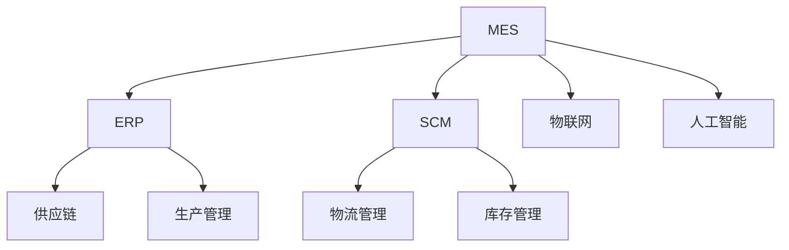

#### 2.1.1 智能制造体系架构

- **制造执行系统（MES）：**MES是连接生产计划和实际生产过程的桥梁，它负责实时监控生产过程，确保生产计划的顺利执行。
- **企业资源计划（ERP）：**ERP系统是企业资源管理系统的缩写，它负责整合企业的财务、人力资源、供应链等多个模块，实现企业资源的统一管理。
- **供应链管理系统（SCM）：**SCM系统负责供应链的监控和管理，包括物流管理、库存管理、供应链优化等。
- **物联网（IoT）：**物联网技术将各种设备互联，实现实时数据采集和监控，为智能制造提供数据支持。
- **人工智能（AI）：**人工智能技术是智能制造的核心驱动力，通过AI技术对生产过程进行优化、预测和决策。

### 2.2 关键技术解析

#### 2.2.1 机器学习算法在智能制造中的应用

机器学习算法在智能制造中的应用非常广泛，主要包括以下几个方面：

- **生产过程预测：**利用机器学习算法对生产过程进行预测，包括生产进度、生产效率等。
- **质量预测：**利用机器学习算法对产品质量进行预测，提前发现潜在的问题。
- **设备故障预测：**利用机器学习算法对设备故障进行预测，提前进行维护，降低设备故障率。

下面是一个简单的机器学习算法在智能制造中的应用流程图：

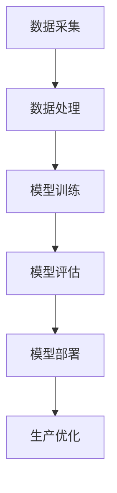

#### 2.2.2 深度学习在智能制造中的应用

深度学习是机器学习的一种，具有强大的特征学习能力，在智能制造中也有着广泛的应用，主要包括以下几个方面：

- **图像识别：**利用深度学习算法对生产现场进行监控，识别生产中的异常情况。
- **语音识别：**利用深度学习算法实现生产设备的智能交互，提高生产效率。
- **自然语言处理：**利用深度学习算法实现生产报告的自动生成，提高工作效率。

下面是一个简单的深度学习在智能制造中的应用流程图：

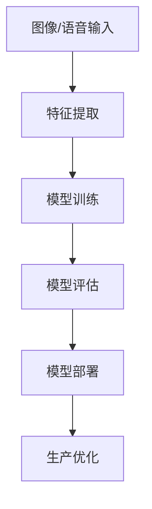

## 第3章 供应链优化

### 3.1 供应链管理基础

#### 3.1.1 供应链管理的基本概念

供应链管理是指对供应链的各个环节进行有效管理，包括供应商、制造商、分销商、零售商等，以满足最终客户的需求。供应链管理的基本概念包括以下几个方面：

- **供应链网络：**供应链网络是指供应链中的各个环节和参与者。
- **供应链流程：**供应链流程是指从原材料采购到产品交付给最终客户的全过程。
- **供应链绩效：**供应链绩效是指供应链管理的有效性，包括成本、质量、交付时间等指标。

#### 3.1.2 供应链管理的关键环节

供应链管理的关键环节包括以下几个方面：

- **需求预测：**准确的需求预测是供应链管理的核心，它决定了原材料采购和生产计划的制定。
- **库存管理：**库存管理是供应链管理的重要环节，合理的库存水平可以降低库存成本，提高供应链的响应速度。
- **物流管理：**物流管理是供应链管理的另一个关键环节，它决定了产品的交付时间和成本。
- **供应链协同：**供应链协同是指供应链各个环节之间的协调和合作，以提高供应链的整体效率。

### 3.2 供应链优化方法

#### 3.2.1 数据挖掘与预测

数据挖掘与预测是供应链优化的关键方法之一，它主要包括以下几个方面：

- **需求预测：**利用历史数据和市场信息，通过数据挖掘和预测算法，预测未来的需求。
- **库存优化：**利用数据挖掘和预测算法，优化库存水平，降低库存成本。
- **物流优化：**利用数据挖掘和预测算法，优化物流路径和运输方式，降低物流成本。

下面是一个简单的供应链优化流程图：

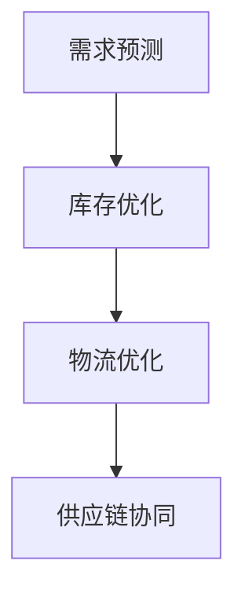

#### 3.2.2 运输路线优化

运输路线优化是供应链优化的重要方面，它主要包括以下几个方面：

- **路径规划：**利用算法和模型，规划最优的运输路线。
- **成本优化：**通过优化运输路线，降低运输成本。
- **时间优化：**通过优化运输路线，缩短运输时间，提高物流效率。

下面是一个简单的运输路线优化流程图：

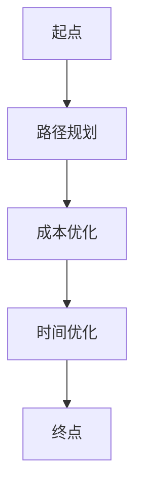

#### 3.2.3 库存管理优化

库存管理优化是供应链优化的重要方面，它主要包括以下几个方面：

- **库存水平优化：**根据需求预测和生产计划，优化库存水平。
- **库存周期优化：**通过优化库存周期，降低库存成本。
- **库存监控：**利用数据挖掘和预测算法，对库存进行实时监控和预警。

下面是一个简单的库存管理优化流程图：

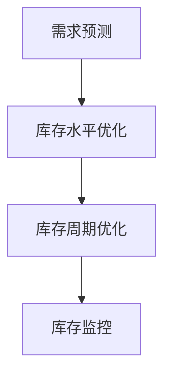

## 第4章 个性化生产

### 4.1 个性化生产概述

#### 4.1.1 个性化生产的概念

个性化生产是指根据客户的需求和偏好，对产品进行定制化生产，以满足客户的个性化需求。个性化生产的核心是定制化，它主要包括以下几个方面：

- **产品定制：**根据客户的需求，对产品的规格、功能、外观等进行定制。
- **生产定制：**根据客户的订单，对生产过程进行定制化调整，以实现快速交付。
- **服务定制：**根据客户的需求，提供定制化的售后服务，如维修、保养等。

#### 4.1.2 个性化生产的关键因素

个性化生产的关键因素包括以下几个方面：

- **客户需求：**个性化生产的起点是客户需求，只有准确理解客户需求，才能实现个性化生产。
- **生产技术：**个性化生产需要先进的生产技术和设备，如数控机床、3D打印等。
- **供应链管理：**个性化生产需要对供应链进行优化管理，确保生产过程的高效和灵活。
- **成本控制：**个性化生产可能会增加生产成本，因此需要合理控制成本，确保盈利性。

### 4.2 个性化生产技术

#### 4.2.1 人工智能在个性化生产中的应用

人工智能在个性化生产中有着广泛的应用，主要包括以下几个方面：

- **需求分析：**利用人工智能技术，对客户需求进行分析和预测，提供个性化建议。
- **产品设计：**利用人工智能技术，自动生成产品设计和生产方案，提高设计效率。
- **生产控制：**利用人工智能技术，实时监控生产过程，实现智能生产。
- **质量检测：**利用人工智能技术，对产品质量进行实时检测和预测，提高产品质量。

下面是一个简单的个性化生产流程图：

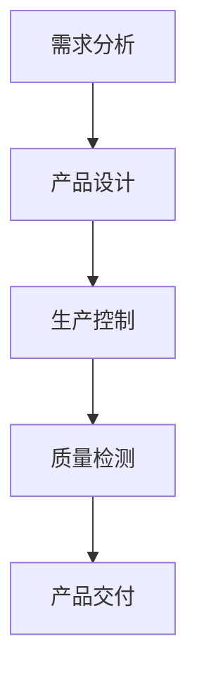

#### 4.2.2 个性化生产线的构建

个性化生产线的构建是个性化生产的关键，它主要包括以下几个方面：

- **生产线布局：**根据产品特点和客户需求，设计合理的生产线布局。
- **生产设备：**选择适合个性化生产的设备，如数控机床、3D打印设备等。
- **自动化控制：**利用自动化控制系统，实现生产线的自动化和智能化。
- **数据采集与监控：**通过数据采集和监控，实时了解生产线的运行状态，实现智能生产。

下面是一个简单的个性化生产线流程图：

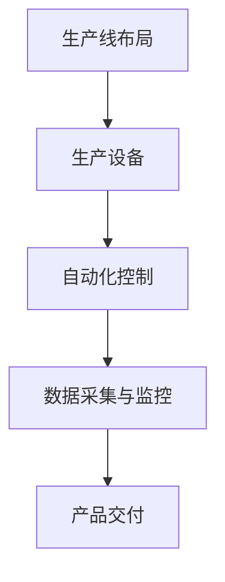

## 第5章 数据分析与决策

### 5.1 数据分析基础

#### 5.1.1 数据分析的基本概念

数据分析是指利用统计学、计算机科学和信息技术等方法，对数据进行收集、整理、分析和解释，以发现数据背后的规律和趋势。数据分析的基本概念包括以下几个方面：

- **数据：**数据是分析的基础，包括数值、文字、图像等。
- **数据类型：**数据类型包括数值型、类别型、文本型等。
- **数据分析方法：**数据分析方法包括统计分析、机器学习、数据挖掘等。
- **数据分析工具：**数据分析工具包括Excel、Python、R等。

#### 5.1.2 数据分析的方法与工具

数据分析的方法与工具主要包括以下几个方面：

- **数据收集：**通过问卷调查、在线数据采集等方式收集数据。
- **数据预处理：**对收集到的数据进行清洗、转换、整合等处理。
- **统计分析：**利用统计学方法对数据进行描述性分析和推断性分析。
- **机器学习：**利用机器学习方法，如回归分析、决策树、支持向量机等，对数据进行预测和分类。
- **数据可视化：**利用数据可视化工具，如Tableau、Matplotlib等，将数据分析结果以图表形式展示。

### 5.2 决策支持系统

#### 5.2.1 决策支持系统的构建

决策支持系统（DSS）是一种辅助决策者进行决策的工具，它主要包括以下几个方面：

- **数据输入：**收集和输入决策所需的数据。
- **模型构建：**构建决策模型，如线性规划、决策树等。
- **算法实现：**实现决策算法，如梯度下降、贪心算法等。
- **结果输出：**将决策结果输出，供决策者参考。

下面是一个简单的决策支持系统流程图：

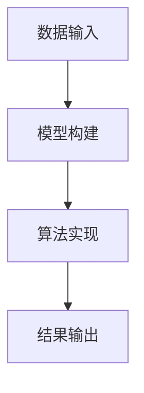

#### 5.2.2 数据驱动的决策过程

数据驱动的决策过程主要包括以下几个步骤：

- **问题识别：**明确决策的目标和问题。
- **数据收集：**收集与决策相关的数据。
- **数据分析：**对数据进行清洗、预处理和统计分析。
- **模型构建：**构建决策模型，如回归分析、决策树等。
- **算法实现：**实现决策算法，如梯度下降、贪心算法等。
- **结果评估：**评估决策结果，如准确率、召回率等。
- **决策输出：**输出决策结果，供决策者参考。

下面是一个简单的数据驱动的决策过程流程图：

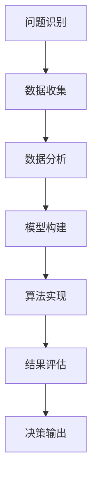

## 第6章 AI驱动的工厂自动化

### 6.1 工厂自动化概述

#### 6.1.1 工厂自动化的概念

工厂自动化是指利用现代控制技术、信息技术、人工智能技术等，实现工厂生产过程的自动化和智能化。工厂自动化的核心目标是提高生产效率、降低生产成本、提高产品质量和安全性。

#### 6.1.2 工厂自动化的优势

工厂自动化具有以下几个优势：

- **提高生产效率：**自动化生产线可以实现连续生产，提高生产效率，减少人为操作错误。
- **降低生产成本：**自动化生产可以降低人力成本，提高设备利用率，降低生产成本。
- **提高产品质量：**自动化生产线可以实现精确控制，提高产品质量，减少不良品率。
- **提高安全性：**自动化生产可以降低工人劳动强度，提高生产安全性。

#### 6.1.3 工厂自动化的分类

工厂自动化主要可以分为以下几个类别：

- **单元自动化：**实现对单一设备或生产单元的自动化控制。
- **过程自动化：**实现对整个生产过程的自动化控制。
- **工厂自动化：**实现整个工厂的自动化生产，包括生产线、物流、质量检测等。

### 6.2 自动化控制系统

#### 6.2.1 自动化控制系统的构成

自动化控制系统主要由以下几个部分构成：

- **传感器：**用于检测生产过程的各种参数，如温度、压力、速度等。
- **执行器：**根据控制系统的指令，驱动设备执行相应的动作，如电机、阀门等。
- **控制器：**根据传感器收集的数据，对执行器进行控制，实现对生产过程的自动化控制。
- **人机界面：**用于操作人员与控制系统的交互，显示生产过程的各种数据，供操作人员参考。

下面是一个简单的自动化控制系统流程图：

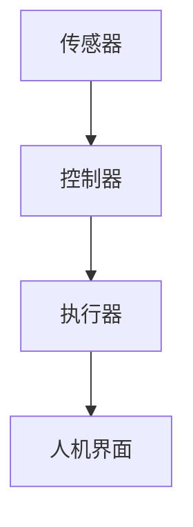

#### 6.2.2 自动化控制系统的应用

自动化控制系统在智能制造中有着广泛的应用，主要包括以下几个方面：

- **生产过程监控：**自动化控制系统可以实时监控生产过程的各种参数，确保生产过程稳定。
- **故障诊断与维护：**自动化控制系统可以通过实时数据监测，实现故障预测和诊断，提前进行设备维护。
- **生产效率优化：**自动化控制系统可以根据生产数据，优化生产计划，提高生产效率。
- **质量控制：**自动化控制系统可以实现生产过程的在线质量检测，确保产品质量。

下面是一个简单的自动化控制系统应用流程图：

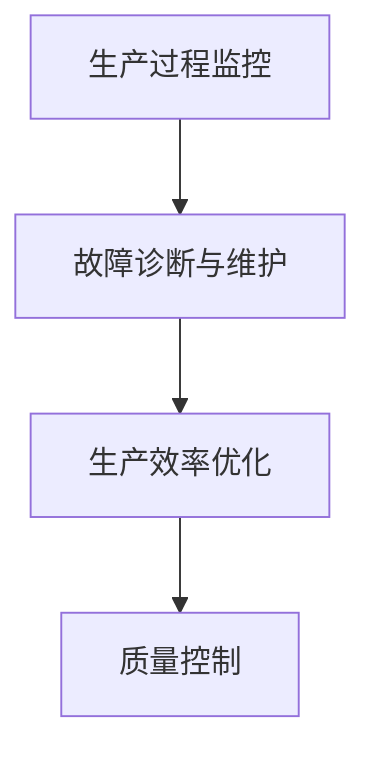

## 第7章 智能制造案例研究

### 7.1 案例一：智能工厂建设

#### 7.1.1 案例背景

某知名家电企业为了提升生产效率，降低生产成本，提高产品质量，决定建设一个智能工厂。该智能工厂集成了自动化生产线、机器人、传感器、云计算等先进技术，实现了生产过程的全面自动化和智能化。

#### 7.1.2 案例分析

- **生产效率提升：**通过引入自动化生产线和机器人，生产效率提高了30%以上，生产周期缩短了50%。
- **生产成本降低：**通过自动化生产，降低了人力成本和能源消耗，生产成本降低了20%。
- **产品质量提升：**通过实时监控和在线检测，产品质量合格率提高了15%，不良品率降低了30%。
- **数据驱动决策：**通过实时数据分析和决策支持系统，实现了生产过程的优化和预测，提高了生产效率和产品质量。

### 7.2 案例二：AI驱动供应链优化

#### 7.2.1 案例背景

某大型电子产品公司为了提高供应链的响应速度和效率，决定采用AI技术对供应链进行优化。该公司收集了大量的供应链数据，包括供应商信息、物流信息、库存数据等，并利用机器学习算法进行数据分析。

#### 7.2.2 案例分析

- **需求预测：**通过机器学习算法对市场需求进行预测，准确率提高了20%，供应链响应速度提高了15%。
- **库存优化：**通过数据挖掘和预测算法，优化了库存水平，库存成本降低了10%。
- **物流优化：**通过优化运输路线和物流模式，物流成本降低了15%，物流时间缩短了20%。
- **供应链协同：**通过实时数据分析和决策支持系统，实现了供应链各环节的协同，提高了供应链的整体效率。

### 7.3 案例三：个性化定制生产

#### 7.3.1 案例背景

某服装品牌为了提高客户满意度，决定开展个性化定制生产。该公司利用人工智能技术，实现了从设计、生产到交付的全流程自动化和个性化。

#### 7.3.2 案例分析

- **设计个性化：**通过人工智能技术，根据客户的需求和偏好，自动生成个性化设计，设计效率提高了30%。
- **生产个性化：**通过3D打印和自动化生产线，实现了个性化生产的自动化和高效化，生产周期缩短了40%。
- **交付个性化：**通过智能物流和实时数据跟踪，实现了个性化产品的快速交付，客户满意度提高了20%。
- **数据驱动决策：**通过实时数据分析和决策支持系统，优化了生产计划和供应链管理，提高了生产效率和产品质量。

## 第8章 未来发展趋势与挑战

### 8.1 智能制造发展趋势

智能制造作为工业4.0的核心，正在快速发展。未来智能制造的发展趋势主要包括以下几个方面：

- **技术的融合：**智能制造将更加注重技术之间的融合，如人工智能、物联网、大数据等，实现跨领域的集成应用。
- **数据的深度利用：**随着数据采集和分析技术的不断发展，智能制造将更加注重数据的深度利用，通过数据驱动实现生产过程的优化。
- **智能化的自动化：**智能制造将更加注重自动化技术的智能化，通过引入人工智能技术，实现生产过程的自我优化和自我调整。
- **定制化生产：**随着消费者需求的多样化，智能制造将更加注重个性化定制生产，满足消费者个性化的需求。

### 8.2 挑战与解决方案

尽管智能制造具有巨大的发展潜力，但同时也面临着一些挑战。主要的挑战包括：

- **数据安全与隐私保护：**随着智能制造的发展，数据量不断增加，如何保护数据安全和用户隐私成为一个重要问题。解决方案包括建立完善的数据安全管理体系、采用加密技术、加强数据隐私保护等。
- **技术人才的培养：**智能制造需要大量的技术人才，但当前技术人才供需矛盾较大。解决方案包括加强教育改革、提高技术人才的待遇和地位、鼓励创新等。
- **生产成本的降低：**智能制造初期，生产成本较高，如何降低生产成本是一个重要问题。解决方案包括优化生产流程、提高生产效率、采用新技术等。

## 附录

### 附录A：相关术语解释

- **智能制造：**智能制造是一种基于信息物理系统（CPS）的智能系统，通过将智能技术与制造技术深度融合，实现制造过程的智能化、自动化和个性化。
- **人工智能：**人工智能是指通过计算机程序模拟人类智能行为，实现机器自主学习和自主决策的技术。
- **机器学习：**机器学习是指利用算法和模型，从数据中自动学习和发现规律，以实现特定任务的预测和决策。
- **深度学习：**深度学习是机器学习的一种，通过多层神经网络对数据进行处理和预测。

### 附录B：参考资源

- **书籍推荐：**
  - 《智能制造：工业4.0的核心》
  - 《人工智能：一种现代的方法》
  - 《机器学习：概率视角》
  - 《深度学习：算法与应用》

- **论文推荐：**
  - "Industry 4.0: Vision, Application, and Research Directions"
  - "Artificial Intelligence: A Modern Approach"
  - "Machine Learning: A Probabilistic Perspective"
  - "Deep Learning: Methods and Applications"

- **网络资源推荐：**
  - [智能制造官方网站](https://www.smartmanufacturing.org/)
  - [人工智能官方网站](https://www.ai.org/)
  - [机器学习官方网站](https://www.ml.org/)
  - [深度学习官方网站](https://www.deeplearning.net/)

