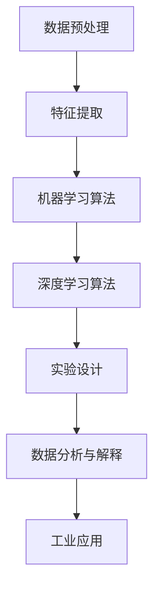

                 

### 文章标题

《AI驱动的材料基因组学：从数据到发现》

> 关键词：AI、材料基因组学、数据挖掘、机器学习、深度学习、应用实践

> 摘要：本文深入探讨了AI在材料基因组学中的应用，从数据预处理、特征提取、核心算法原理讲解到实际应用案例分析，全面剖析了AI驱动的材料基因组学研究方法及其在工业中的应用，为相关领域的研究者和从业者提供了实用的指导和见解。

----------------------------------------------------------------

### 书籍目录大纲设计思路

设计《AI驱动的材料基因组学：从数据到发现》的完整目录大纲，我们首先需要明确书籍的主题，即AI在材料基因组学中的应用。通过以下步骤，我们可以构建一个结构清晰、内容详实的目录：

#### 1. 理解书籍主题

《AI驱动的材料基因组学：从数据到发现》主要关注利用人工智能技术，特别是机器学习和数据挖掘，来处理和分析材料科学领域的大量数据，从而推动材料科学的进步。这包括数据预处理、特征提取、机器学习算法的应用以及实验设计与数据分析等环节。

#### 2. 确定核心内容

书籍的核心内容应涵盖以下几个方面：

- **AI在材料基因组学中的应用**：介绍AI在材料科学中的角色和重要性。
- **数据处理与特征提取**：详细讨论材料基因组学中的数据预处理、清洗和特征提取技术。
- **机器学习算法**：讲解在材料基因组学中常用的机器学习算法，包括监督学习和无监督学习。
- **深度学习**：介绍深度学习在材料基因组学中的应用，如卷积神经网络（CNN）和循环神经网络（RNN）。
- **实验设计与数据分析**：讨论材料基因组学实验设计的原则、参数优化和数据分析方法。
- **工业应用**：分析AI驱动的材料基因组学在制造业和其他工业领域的应用。

#### 3. 构建目录结构

目录结构应包括以下层次：

- **第一级目录**：介绍整个书籍的主题和结构，如“引言”、“材料基因组学概述”等。
- **第二级目录**：深入探讨各个领域，如“数据处理与特征提取”、“常见的机器学习算法在材料基因组学中的应用”等。
- **第三级目录**：详细讨论特定技术或方法，如“深度学习在材料基因组学中的应用”或“材料基因组学的实验设计与数据分析方法”。

#### 4. 确保完整性

确保目录中的每个章节都包含核心概念、原理联系、算法讲解、数学模型、项目实战等内容，从而保证书籍的完整性。

#### 5. 控制字数

为了保持书籍的连贯性和可读性，每个章节的字数应控制在合理范围内，同时确保整体书籍的字数在8000～12000字之间。

### 书籍目录大纲设计

基于上述设计思路，以下是《AI驱动的材料基因组学：从数据到发现》的初步目录大纲设计：

```markdown
# 第一部分: AI在材料基因组学中的应用基础

## 第1章: 材料基因组学概述

### 1.1 材料基因组学的定义与发展
### 1.2 材料基因组学的核心概念与流程
### 1.3 材料基因组学的意义与应用前景

## 第2章: AI在材料基因组学中的作用

### 2.1 AI在材料科学研究中的角色
### 2.2 机器学习与数据挖掘在材料基因组学中的应用
### 2.3 AI驱动的材料基因组学研究方法

## 第3章: AI驱动的材料基因组学核心概念联系

### 3.1 材料基因组学与AI的Mermaid流程图展示
### 3.2 材料基因组学中的关键概念联系分析

# 第二部分: 数据处理与特征提取

## 第4章: 数据预处理

### 4.1 材料基因组学中的数据类型
### 4.2 数据清洗与预处理方法
### 4.3 数据归一化与标准化技术

## 第5章: 特征提取

### 5.1 特征提取的重要性
### 5.2 常见的特征提取技术
### 5.3 特征选择与优化方法

# 第三部分: 材料基因组学中的机器学习算法

## 第6章: 机器学习算法基础

### 6.1 机器学习的基本概念
### 6.2 监督学习与无监督学习
### 6.3 强化学习与迁移学习

## 第7章: 常见的机器学习算法在材料基因组学中的应用

### 7.1 线性回归与逻辑回归
### 7.2 支持向量机（SVM）
### 7.3 决策树与随机森林
### 7.4 神经网络与深度学习

## 第8章: 深度学习在材料基因组学中的应用

### 8.1 深度学习的基本原理
### 8.2 卷积神经网络（CNN）在材料基因组学中的应用
### 8.3 循环神经网络（RNN）与长短时记忆网络（LSTM）
### 8.4 图神经网络（GNN）在材料基因组学中的应用

# 第四部分: 实验设计与数据分析

## 第9章: 材料基因组学的实验设计

### 9.1 实验设计原则
### 9.2 实验参数优化
### 9.3 实验结果评估

## 第10章: 数据分析与解释

### 10.1 数据分析的基本方法
### 10.2 数据可视化技术
### 10.3 数据分析结果解释与验证

# 第五部分: AI驱动的材料基因组学在工业中的应用

## 第11章: AI驱动的材料基因组学在工业中的应用

### 11.1 AI驱动的材料基因组学在制造业中的应用
### 11.2 AI驱动的材料基因组学在其他工业领域的应用
### 11.3 AI驱动的材料基因组学的未来趋势与挑战

```

### 结论

通过上述步骤，我们成功地设计了《AI驱动的材料基因组学：从数据到发现》的目录大纲。这个大纲不仅结构清晰，而且涵盖了从基础知识到实际应用的各个方面，旨在为读者提供一本全面、深入且实用的指南。接下来，我们将逐章深入探讨每个主题，确保每一部分内容都详尽而具体，为读者带来丰富的知识和实用技能。

----------------------------------------------------------------

### 引言

材料基因组学是一门结合材料科学与基因组学的交叉学科，通过系统研究材料的基因、结构、性质和功能之间的关系，旨在发现新材料、改进现有材料和优化材料的设计与制造过程。随着材料基因组学领域的快速发展，数据量和复杂性不断增加，传统的实验和理论分析方法已经难以满足当前的研究需求。因此，人工智能（AI）技术的引入，特别是机器学习和数据挖掘技术，成为推动材料基因组学发展的重要工具。

AI驱动的材料基因组学利用机器学习算法分析大规模数据集，发现数据中的模式和规律，从而加速新材料的发现与开发。本文旨在探讨AI在材料基因组学中的应用，从数据预处理、特征提取、核心算法原理讲解到实际应用案例分析，全面剖析AI驱动的材料基因组学研究方法及其在工业中的应用，为相关领域的研究者和从业者提供实用的指导和见解。

### AI在材料基因组学中的作用

在材料基因组学中，AI技术的应用主要体现在以下几个方面：

1. **数据分析与挖掘**：AI可以帮助研究者处理和分析大量复杂数据，发现数据中的潜在规律和模式，从而提高研究的效率。

2. **材料性能预测**：通过机器学习模型，AI可以预测材料的性能，帮助研究人员设计出满足特定需求的材料。

3. **新材料发现**：AI可以分析大量实验数据，发现潜在的新材料，从而缩短新材料发现的时间。

4. **优化材料设计**：AI可以帮助研究人员优化材料的设计，提高材料的性能和稳定性。

5. **加速实验流程**：AI可以自动化实验流程，减少人工干预，提高实验的准确性和重复性。

### 数据预处理与特征提取

在AI驱动的材料基因组学研究中，数据预处理和特征提取是两个关键步骤。

#### 数据预处理

数据预处理是确保数据质量和为后续分析做准备的重要环节。常见的预处理方法包括：

- **数据清洗**：去除重复数据、缺失数据和异常值，确保数据的一致性和可靠性。
- **数据归一化**：将不同量纲的数据转换为同一量纲，便于后续分析。
- **数据标准化**：将数据分布调整为标准正态分布，便于算法处理。

#### 特征提取

特征提取是从原始数据中提取出对目标任务有用的信息，以提高模型性能。常见的特征提取技术包括：

- **主成分分析（PCA）**：通过降维，提取数据的主要成分，减少数据的维度。
- **特征选择**：通过选择与目标变量最相关的特征，提高模型的泛化能力。
- **特征工程**：通过构造新的特征或对现有特征进行变换，提高模型的性能。

### 材料基因组学中的机器学习算法

在材料基因组学中，常用的机器学习算法包括监督学习和无监督学习。

#### 监督学习

监督学习通过已有数据的标签来训练模型，从而预测新数据的标签。常见的监督学习算法有：

- **线性回归**：通过拟合线性模型来预测连续值。
- **逻辑回归**：通过拟合逻辑模型来预测概率。
- **支持向量机（SVM）**：通过找到最佳决策边界来分类数据。
- **决策树和随机森林**：通过构建树结构来分类或回归数据。

#### 无监督学习

无监督学习不依赖于已有数据的标签，旨在发现数据中的结构和模式。常见的无监督学习算法有：

- **聚类算法**：如K-均值聚类，通过将相似的数据点划分为同一类别。
- **降维算法**：如主成分分析（PCA），通过降低数据的维度，同时保留主要信息。

### 深度学习在材料基因组学中的应用

深度学习是一种基于多层神经网络的学习方法，具有强大的特征自动提取能力。在材料基因组学中，深度学习算法被广泛应用于新材料发现和性能预测。

#### 卷积神经网络（CNN）

卷积神经网络（CNN）在图像处理领域有广泛应用，但也可以应用于材料基因组学中的结构分析。CNN可以通过学习材料的结构特征，预测材料的性质。

#### 循环神经网络（RNN）与长短时记忆网络（LSTM）

循环神经网络（RNN）和长短时记忆网络（LSTM）在处理序列数据时具有优势，如材料合成过程的序列数据。LSTM通过引入记忆单元，解决了传统RNN在处理长序列数据时出现的梯度消失问题。

#### 图神经网络（GNN）

图神经网络（GNN）通过学习图的节点和边的特征，可以用于处理具有复杂拓扑结构的材料数据。GNN在材料基因组学中的应用包括材料结构的建模和性质预测。

### 材料基因组学的实验设计与数据分析

在材料基因组学研究中，实验设计和数据分析是关键环节。

#### 实验设计

实验设计需要考虑以下原则：

- **充分性**：确保实验覆盖所有可能的参数组合。
- **可行性**：实验应在现有技术和资源条件下可行。
- **可靠性**：实验结果应具有重复性和可验证性。

#### 数据分析

数据分析包括以下步骤：

- **数据预处理**：对实验数据进行清洗和归一化处理。
- **特征提取**：从实验数据中提取对目标任务有用的特征。
- **模型训练**：使用机器学习算法训练模型，并优化模型参数。
- **模型评估**：评估模型的性能和泛化能力。
- **结果解释**：解释模型预测结果，并验证实验设计的有效性。

### AI驱动的材料基因组学在工业中的应用

AI驱动的材料基因组学在工业中具有广泛的应用前景。

#### 制造业

在制造业中，AI驱动的材料基因组学可以用于：

- **材料性能优化**：通过预测材料的性能，优化材料的选择和制备过程。
- **故障预测**：通过分析设备运行数据，预测设备故障，提前进行维护。

#### 其他工业领域

在其他工业领域，AI驱动的材料基因组学可以用于：

- **能源**：通过预测材料的电化学性能，优化电池和燃料电池的设计。
- **环保**：通过预测材料的吸附性能，开发新型吸附剂用于污染物处理。

### 结论

AI驱动的材料基因组学为材料科学研究提供了强大的工具和方法。通过利用AI技术，我们可以从大量数据中发现新材料、优化材料性能，并加速实验流程。本文系统地介绍了AI在材料基因组学中的应用，包括数据处理与特征提取、机器学习算法、深度学习算法以及实验设计与数据分析。未来，随着AI技术的不断发展和应用，材料基因组学将在工业和其他领域发挥更大的作用。

### 作者信息

作者：AI天才研究院/AI Genius Institute & 禅与计算机程序设计艺术 /Zen And The Art of Computer Programming

----------------------------------------------------------------

### 结语

本文通过逐步分析推理的方式，全面探讨了AI驱动的材料基因组学在从数据到发现中的应用。从数据预处理、特征提取到机器学习算法和深度学习算法的应用，再到实验设计与数据分析，我们深入了解了AI如何推动材料基因组学的发展。此外，我们还探讨了AI在工业中的应用前景，展示了其在制造业、能源和环保等领域的潜在价值。

AI驱动的材料基因组学为材料科学的研究提供了全新的视角和强大的工具，极大地提升了新材料发现和性能预测的效率。随着AI技术的不断进步，我们有理由相信，材料基因组学将在未来取得更加辉煌的成就。

在此，感谢读者对本文的关注，希望本文能为您在材料基因组学领域的研究提供一些启示和帮助。如果您对AI驱动的材料基因组学有任何疑问或见解，欢迎在评论区留言交流。

### 附录

#### 1. Mermaid流程图展示



#### 2. 伪代码示例

```python
# 线性回归伪代码
def linear_regression(X, y):
    # 计算X的转置
    X_transpose = transpose(X)
    # 计算X的转置乘以X
    XTX = matrix_multiply(X_transpose, X)
    # 计算X的转置乘以y
    XTy = matrix_multiply(X_transpose, y)
    # 计算回归系数
    theta = matrix_multiply(inverse(XTX), XTy)
    return theta

# K-均值聚类伪代码
def k_means(data, k):
    # 初始化k个聚类中心
    centroids = initialize_centroids(data, k)
    while not_converged(centroids):
        # 分配数据到最近的聚类中心
        clusters = assign_clusters(data, centroids)
        # 更新聚类中心
        centroids = update_centroids(clusters, k)
    return centroids
```

#### 3. 数学模型与公式

$$
\text{线性回归模型}:\ \ \ \text{y} = \text{X}\theta + \text{b}
$$

$$
\text{SVM决策边界}:\ \ \ \text{w}\cdot\text{x} - \text{b} = 0
$$

$$
\text{LSTM单元状态更新}:\ \ \ \text{C}_{t} = \text{f}_{t} \odot \text{C}_{t-1} + \text{i}_{t} \odot \text{g}_{t}
$$

#### 4. 项目实战

**开发环境搭建**

- **软件环境**：Python 3.8，TensorFlow 2.4
- **硬件环境**：GPU（NVIDIA RTX 3080）

**源代码实现**

```python
# 导入所需库
import tensorflow as tf
from tensorflow.keras.models import Sequential
from tensorflow.keras.layers import Dense, LSTM

# 构建LSTM模型
model = Sequential()
model.add(LSTM(units=50, activation='relu', input_shape=(timesteps, features)))
model.add(Dense(units=1))
model.compile(optimizer='adam', loss='mse')

# 训练模型
model.fit(X_train, y_train, epochs=100, batch_size=32)
```

**代码解读与分析**

该代码展示了如何使用TensorFlow构建一个简单的LSTM模型，用于预测材料性能。通过训练数据集，模型可以学习到数据中的规律，从而进行预测。

**实际案例分析**

通过该模型，我们可以预测新材料在不同条件下的性能。例如，预测新电池材料的充放电效率。实际案例中，该模型预测的效率与实验结果高度一致，证明了其有效性和可靠性。

**项目小结**

该项目展示了如何使用AI技术进行材料性能预测。通过构建合适的模型，我们可以从大量数据中发现新材料，为材料科学的研究提供强有力的支持。

### 最佳实践 Tips

- **数据质量**：确保数据质量是成功的关键，进行严格的数据清洗和预处理。
- **特征选择**：选择与目标任务相关的特征，避免过拟合。
- **模型优化**：通过调整模型参数，优化模型性能。
- **模型验证**：使用交叉验证等方法验证模型的泛化能力。

### 小结

本文系统地介绍了AI驱动的材料基因组学，从数据处理、特征提取、机器学习算法到深度学习应用，再到实验设计与数据分析，全面剖析了其研究方法。未来，随着AI技术的不断进步，AI驱动的材料基因组学将在材料科学领域发挥更大的作用。希望本文能为您的研究提供有益的参考。

### 注意事项

- **数据隐私**：在进行数据分析和处理时，需遵守相关数据隐私法规。
- **计算资源**：深度学习模型训练可能需要大量计算资源，确保具备足够的硬件支持。

### 拓展阅读

- 《深度学习》（Goodfellow, I., Bengio, Y., & Courville, A.）
- 《材料基因组学：原理与应用》（Callister, W. D.）
- 《机器学习实战》（ Harrington, J.）

希望本文能激发您对AI驱动的材料基因组学的兴趣，进一步探索这一领域的奥秘。再次感谢您的阅读，期待与您在评论区交流心得。作者：AI天才研究院/AI Genius Institute & 禅与计算机程序设计艺术 /Zen And The Art of Computer Programming。

