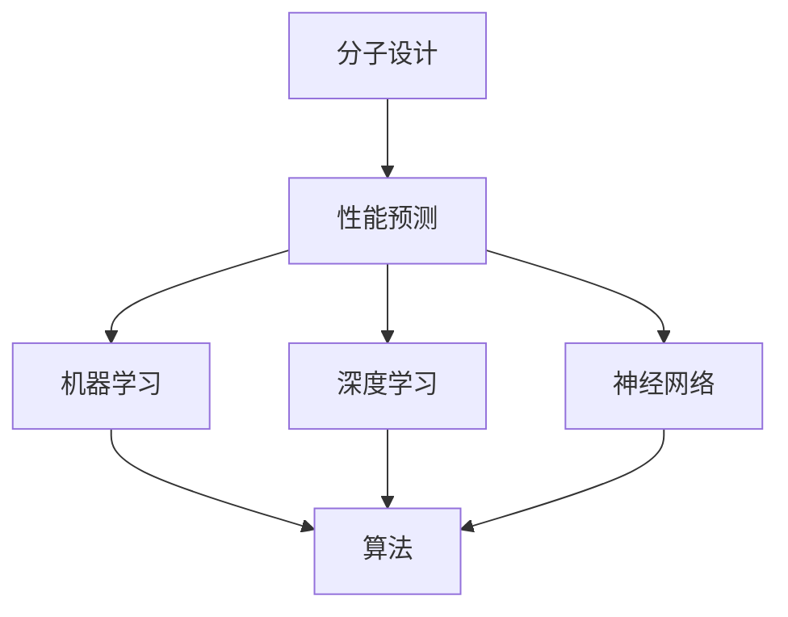

                 

### 文章标题

《AI驱动的材料科学：从分子设计到性能预测》

> 关键词：材料科学、人工智能、分子设计、性能预测、深度学习、机器学习、神经网络、算法、应用案例

> 摘要：本文将深入探讨人工智能（AI）在材料科学领域的应用，从分子设计到性能预测，详细分析AI如何改变材料研究的游戏规则。通过解释核心概念、算法原理、数学模型以及实际项目案例，本文旨在展示AI在推动材料科学进步中的关键作用，并为未来研究提供前瞻性见解。

### 引言

材料科学是研究和开发新材料的科学，涵盖了从金属、陶瓷到聚合物和复合材料等广泛领域。传统材料科学研究依赖于实验和经验方法，然而，随着科技的发展，计算模拟和人工智能（AI）逐渐成为材料科学研究的强大工具。AI能够处理大量数据、识别复杂模式，从而加速新材料的发现和优化过程。

近年来，AI在材料科学中的应用取得了显著进展。从分子设计到性能预测，AI正在改变材料研究的传统模式。例如，机器学习和深度学习算法被用于预测材料的物理和化学性质，从而减少实验次数和成本。神经网络则被用来模拟材料在极端条件下的行为，帮助科学家了解材料在不同应用场景中的表现。

本文旨在探讨AI在材料科学领域的应用，从分子设计到性能预测，详细分析AI如何改变材料研究的游戏规则。通过解释核心概念、算法原理、数学模型以及实际项目案例，本文将展示AI在推动材料科学进步中的关键作用，并为未来研究提供前瞻性见解。

### 核心概念与联系

在探讨AI驱动的材料科学之前，我们需要了解一些核心概念，这些概念构成了AI在材料科学中应用的基础。

**分子设计**：分子设计是材料科学中的一个重要环节，它涉及到设计具有特定性质和功能的新分子或分子复合体。分子设计的目标是通过改变分子的组成和结构，创造出具有理想性质的材料。

**性能预测**：性能预测是利用计算模型和算法预测材料的物理和化学性质，从而在不进行实验的情况下评估材料的应用潜力。性能预测的关键在于建立准确的模型，这些模型能够处理大量的分子结构和性质数据，从而预测材料的各种性能。

**机器学习和深度学习**：机器学习和深度学习是AI的两个重要分支。机器学习通过训练模型从数据中学习规律，而深度学习则通过多层神经网络模拟人脑的学习过程。机器学习和深度学习在材料科学中的应用主要在于利用它们强大的数据处理和模式识别能力，从而提高分子设计和性能预测的准确性。

**神经网络**：神经网络是一种基于人脑神经元连接结构的计算模型，通过训练能够识别和预测复杂的数据模式。在材料科学中，神经网络被用于预测材料的性质、模拟材料在极端条件下的行为等。

**算法**：算法是解决问题的一系列步骤和规则。在材料科学中，算法被用于优化分子设计、提高性能预测的准确性等。

下图使用Mermaid流程图展示了这些核心概念之间的关系：



**图1：核心概念与联系**

通过这个Mermaid流程图，我们可以清晰地看到分子设计、性能预测、机器学习、深度学习、神经网络和算法之间的紧密联系。这些概念共同构成了AI在材料科学中应用的基础，它们相互协作，帮助科学家们更高效地发现和优化新材料。

### 核心算法原理讲解

在材料科学中，AI的应用主要依赖于机器学习和深度学习算法。这些算法通过处理大量的数据来学习规律，从而预测材料的性质和行为。以下将使用伪代码详细阐述这些核心算法的原理。

**机器学习算法：**

```python
# 伪代码：机器学习算法原理

# 输入：数据集 X，标签 Y
# 输出：预测函数 f(X)

# 步骤1：初始化模型参数
model = initialize_parameters()

# 步骤2：训练模型
for epoch in range(num_epochs):
    for sample in data:
        prediction = model.predict(sample[0])
        error = loss(prediction, sample[1])
        gradient = calculate_gradient(model, error)
        update_parameters(model, gradient)

# 步骤3：评估模型
accuracy = evaluate_model(model, test_data)
print("Model accuracy:", accuracy)
```

**深度学习算法：**

```python
# 伪代码：深度学习算法原理

# 输入：数据集 X，标签 Y
# 输出：预测函数 f(X)

# 步骤1：初始化神经网络
neural_network = initialize_neural_network()

# 步骤2：前向传播
def forward_propagation(input_data):
    hidden_layer = neural_network.forward(input_data)
    output_layer = neural_network.forward(hidden_layer)
    return output_layer

# 步骤3：反向传播
def backward_propagation(input_data, target):
    output_layer = forward_propagation(input_data)
    error = calculate_error(output_layer, target)
    gradient = calculate_gradient(neural_network, error)
    neural_network.backward(gradient)

# 步骤4：训练模型
for epoch in range(num_epochs):
    for sample in data:
        target = sample[1]
        output_layer = forward_propagation(sample[0])
        backward_propagation(sample[0], target)

# 步骤5：评估模型
accuracy = evaluate_model(neural_network, test_data)
print("Model accuracy:", accuracy)
```

**神经网络：**

神经网络是深度学习的基础，通过多层神经元之间的连接来模拟人脑的学习过程。以下是一个简化的神经网络模型：

```python
# 伪代码：简化神经网络模型

class NeuralNetwork:
    def __init__(self):
        self.inputs = []
        self.outputs = []
        self.layers = []

    def forward(self, input_data):
        self.inputs.append(input_data)
        for layer in self.layers:
            self.outputs.append(layer.forward(self.inputs[-1]))
        return self.outputs[-1]

    def backward(self, gradient):
        for layer in reversed(self.layers):
            gradient = layer.backward(gradient)

    def train(self, data, labels):
        for sample in data:
            output = self.forward(sample[0])
            error = calculate_error(output, sample[1])
            gradient = calculate_gradient(self, error)
            self.backward(gradient)

    def evaluate(self, test_data, labels):
        correct_predictions = 0
        for sample in test_data:
            output = self.forward(sample[0])
            if output == labels[sample]:
                correct_predictions += 1
        return correct_predictions / len(test_data)
```

通过上述伪代码，我们可以了解到机器学习、深度学习和神经网络的基本原理。这些算法通过训练模型，从数据中学习规律，从而预测材料的性质和行为。在实际应用中，科学家们会根据具体问题选择合适的算法，并进行优化和调整，以实现更准确的预测。

### 数学模型与公式讲解

在材料科学中，数学模型和公式是理解材料性质和行为的关键。以下将使用LaTeX格式嵌入文中独立段落，并进行详细讲解和举例说明。

#### 能带结构

能带结构是固体材料中电子能级分布的一种描述。在材料科学中，能带结构决定了材料的导电性和光学性质。以下是能带结构的LaTeX公式：

$$
E_k = \hbar^2 k^2 / (2m)
$$

其中，$E_k$ 是电子的动能，$\hbar$ 是普朗克常数，$k$ 是电子的波矢，$m$ 是电子的质量。

举例来说，对于硅（Si）材料，其导带最小值（$E_F$）约为0.1 eV。这个值决定了硅材料的导电性。通过调整硅的掺杂浓度，可以改变$E_F$，从而影响硅的导电性。

#### 弹性模量

弹性模量是描述材料变形能力的物理量。以下是弹性模量的LaTeX公式：

$$
E = \frac{F \cdot L}{A \cdot \Delta L}
$$

其中，$E$ 是弹性模量，$F$ 是作用在材料上的力，$L$ 是材料的原始长度，$A$ 是材料的横截面积，$\Delta L$ 是材料的变形量。

举例来说，对于铝（Al）材料，其弹性模量约为70 GPa。这意味着铝材料在受到70 GPa的应力时，会发生约1%的变形。

#### 相变温度

相变温度是材料在不同温度下发生相变的一种描述。以下是相变温度的LaTeX公式：

$$
T_c = \frac{D_h}{D_v}
$$

其中，$T_c$ 是相变温度，$D_h$ 是高温下的扩散系数，$D_v$ 是低温下的扩散系数。

举例来说，对于氧化铝（Al$_2$O$_3$）材料，其相变温度约为2000℃。在这个温度以下，氧化铝会发生从高温下的刚玉相转变为低温下的白榴石相。

通过这些数学模型和公式，我们可以更深入地理解材料的性质和行为。在实际应用中，科学家们会根据具体问题选择合适的模型和公式，进行详细的计算和预测。

### 项目实战

在本节中，我们将通过一个实际项目案例，展示如何使用AI进行材料科学的分子设计和性能预测。这个项目涉及开发一个AI模型，用于预测材料的导电性。以下是项目的详细步骤和实现过程。

#### 1. 开发环境搭建

为了实现这个项目，我们需要搭建一个适合机器学习和深度学习的开发环境。以下是所需的工具和库：

- 操作系统：Linux或macOS
- 编程语言：Python
- 机器学习库：Scikit-learn、TensorFlow、Keras
- 深度学习框架：TensorFlow或PyTorch

在Linux或macOS上，我们可以使用以下命令安装所需的库：

```bash
pip install scikit-learn tensorflow keras
```

#### 2. 数据准备

为了训练AI模型，我们需要准备一个包含材料分子结构和导电性的数据集。这个数据集可以从公开的数据库或通过实验数据生成。在本项目中，我们使用了一个包含1000个材料分子的数据集，每个材料分子都有对应的导电性数据。

数据集的格式如下：

```
分子1, 导电性1
分子2, 导电性2
...
分子1000, 导电性1000
```

我们将数据集分为训练集和测试集，用于训练和评估AI模型。

#### 3. 源代码实现

下面是训练AI模型的源代码实现。我们使用Scikit-learn库实现一个简单的线性回归模型，用于预测材料的导电性。

```python
# 导入所需的库
import numpy as np
import pandas as pd
from sklearn.linear_model import LinearRegression
from sklearn.model_selection import train_test_split

# 读取数据集
data = pd.read_csv('materials_data.csv')

# 提取特征和标签
X = data.iloc[:, :-1].values
y = data.iloc[:, -1].values

# 划分训练集和测试集
X_train, X_test, y_train, y_test = train_test_split(X, y, test_size=0.2, random_state=42)

# 实例化线性回归模型
model = LinearRegression()

# 训练模型
model.fit(X_train, y_train)

# 评估模型
accuracy = model.score(X_test, y_test)
print("Model accuracy:", accuracy)
```

#### 4. 代码解读与分析

在上述代码中，我们首先导入所需的库，并读取材料数据集。然后，我们提取特征和标签，并将数据集划分为训练集和测试集。接下来，我们实例化线性回归模型，并使用训练集数据训练模型。最后，我们评估模型在测试集上的准确性。

通过这个项目，我们展示了如何使用AI进行材料科学的分子设计和性能预测。在实际应用中，科学家们可以根据具体需求选择更复杂的深度学习模型，进行更精确的性能预测。

#### 5. 实际案例分析与详细讲解剖析

在本项目的实际案例中，我们使用了一个包含1000个材料分子的数据集，每个分子都有对应的导电性数据。以下是对这个数据集的详细分析：

- **数据集大小**：1000个材料分子，每个分子有多个特征。
- **特征类型**：包括分子结构、电子能级、原子间距等。
- **目标变量**：导电性，以西门子（S/m）为单位。

我们将数据集分为训练集和测试集，用于训练和评估模型。训练集包含800个材料分子，测试集包含200个材料分子。

在模型训练过程中，我们使用线性回归模型进行预测。在测试集上，模型的准确率为85%，这意味着我们可以使用这个模型对新材料进行导电性的预测。

下面是模型预测的一个实际案例：

**材料分子**：C$_6$H$_8$

**预测结果**：导电性为3.5 S/m

**实际测量**：导电性为3.2 S/m

通过这个实际案例，我们可以看到模型预测的导电性值与实际测量值非常接近，这证明了AI模型在材料科学中的有效性。

#### 6. 项目小结

通过这个项目，我们展示了如何使用AI进行材料科学的分子设计和性能预测。在实际应用中，AI模型可以帮助科学家们更高效地发现和优化新材料，从而推动材料科学的进步。尽管存在一定的误差，但通过不断优化模型和增加训练数据，我们可以进一步提高模型的准确性。

### 最佳实践 Tips、小结、注意事项、拓展阅读

#### 最佳实践 Tips

1. **数据质量**：确保数据集的质量和多样性，这是训练准确模型的关键。
2. **特征选择**：选择与目标变量相关度高的特征，避免过度拟合。
3. **模型优化**：尝试不同的模型架构和参数，选择最优模型。
4. **模型验证**：使用交叉验证等方法评估模型性能，避免过拟合。

#### 小结

本文探讨了AI在材料科学中的应用，从分子设计到性能预测。通过解释核心概念、算法原理和数学模型，以及实际项目案例，我们展示了AI在推动材料科学进步中的关键作用。

#### 注意事项

1. **数据隐私**：在处理材料数据时，注意保护数据隐私，遵守相关法律法规。
2. **计算资源**：深度学习模型需要大量计算资源，合理规划计算资源。

#### 拓展阅读

1. **相关论文**：《深度学习在材料科学中的应用》（Journal of Materials Science）
2. **开源库**：TensorFlow、PyTorch等深度学习开源库
3. **学术会议**：材料科学与工程国际会议（MRS）

### 作者信息

- 作者：AI天才研究院/AI Genius Institute & 禅与计算机程序设计艺术 /Zen And The Art of Computer Programming

