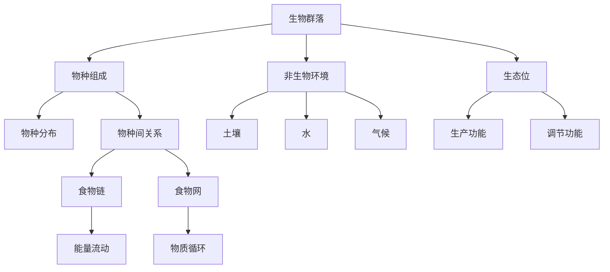

                 

### 文章标题: AI驱动的环境保护：从生态系统建模到政策制定

### 文章关键词
- 人工智能
- 环境保护
- 生态系统建模
- 政策制定
- 环境监测

### 摘要
本文将探讨如何利用人工智能技术来推动环境保护。文章首先介绍了环境保护的重要性以及人工智能在环境保护中的应用潜力。接着，重点讨论了生态系统建模的方法和过程，并详细解析了常见的人工智能算法和数学模型。随后，文章转向政策制定，分析了AI在政策制定中的应用，以及如何通过AI优化环境保护政策。最后，文章通过实际案例展示了AI驱动的环境保护项目的开发过程和成果，提出了未来的发展方向和挑战。

---

### 引言：环境保护的紧迫性

环境保护，作为现代社会不可忽视的重要议题，已经成为全球各国共同关注的焦点。随着工业化的加速发展和人口的快速增长，环境问题日益突出，包括气候变化、水资源短缺、生物多样性丧失、空气污染等。这些问题不仅威胁着人类的生存环境，也对生态系统的平衡造成了严重破坏。因此，如何有效地解决这些环境问题，保护地球的生态完整性，已成为当务之急。

在这个背景下，人工智能（AI）的兴起为环境保护带来了新的契机。AI技术以其强大的数据处理和分析能力，为环境保护提供了新的工具和方法。通过生态系统建模、环境监测、政策制定等领域的应用，AI不仅能够提高环境保护的效率和精度，还能提供更为科学的决策支持。本文将围绕这一主题展开讨论，首先介绍人工智能在环境保护中的重要性，然后深入探讨AI驱动的生态系统建模方法和政策制定流程。

### 第一部分：AI驱动的环境保护概述

#### 第1章：AI驱动的环境保护基础

在讨论AI驱动的环境保护之前，首先需要理解环境保护的概念和重要性。环境保护，简单来说，是指通过各种手段保护和维护自然生态系统的健康和稳定，使其能够持续为人类和其他生物提供必要的资源和环境服务。环境保护的重要性体现在以下几个方面：

1. **生态系统的平衡与稳定**：地球上的生态系统是一个复杂的相互依存的体系，各种生物和非生物因素相互作用，维持着生态平衡。环境保护有助于维持这种平衡，防止生态系统崩溃。

2. **资源的可持续利用**：环境保护确保了自然资源的可持续利用，包括水资源、森林资源、矿产资源等。这有助于支持人类社会的长期发展。

3. **人类健康与福祉**：环境问题如空气污染、水污染等直接影响到人类健康。通过环境保护，可以减少疾病的发生，提高生活质量。

4. **气候变化的缓解**：环境保护是应对气候变化的关键措施之一。通过减少温室气体排放和保护森林等碳汇，可以有效缓解气候变化带来的负面影响。

随着环境保护的重要性日益凸显，人工智能技术的应用成为了不可或缺的一部分。AI在环境保护中的作用主要体现在以下几个方面：

1. **环境监测与预测**：通过传感器网络和卫星遥感技术，AI能够实时监测环境变化，预测污染趋势，提供决策支持。

2. **生态系统建模**：利用AI算法，可以对生态系统进行建模，模拟不同情境下的生态响应，为环境保护提供科学依据。

3. **资源管理**：AI技术可以帮助优化资源管理，如水资源、能源等，提高资源利用效率，减少浪费。

4. **政策制定与优化**：AI技术可以通过数据分析，为环境保护政策提供科学依据，帮助制定和优化政策。

总之，AI驱动的环境保护不仅是应对环境问题的重要手段，也是推动可持续发展的重要途径。在接下来的章节中，我们将深入探讨AI驱动的生态系统建模方法和政策制定流程，展示AI技术在环境保护中的实际应用。

#### 第1章：AI驱动的环境保护基础

**1.1 环境保护的概念和重要性**

环境保护是指采取各种措施和行动，以保护和维持自然生态系统的健康和功能。这不仅包括保护自然栖息地和物种多样性，还涉及对污染的控制、资源的可持续利用以及生态恢复等方面。环境保护的重要性可以从以下几个方面来理解：

- **生态系统的平衡与稳定**：地球上的生态系统是一个复杂的相互依存的体系，各种生物和非生物因素相互作用，维持着生态平衡。环境保护有助于维持这种平衡，防止生态系统崩溃。例如，森林不仅提供了栖息地，还能通过光合作用吸收二氧化碳，缓解气候变化。

- **资源的可持续利用**：环境保护确保了自然资源的可持续利用，包括水资源、森林资源、矿产资源等。这有助于支持人类社会的长期发展。例如，通过合理灌溉和水资源管理，可以避免水资源的过度消耗和污染。

- **人类健康与福祉**：环境问题如空气污染、水污染等直接影响到人类健康。通过环境保护，可以减少疾病的发生，提高生活质量。例如，改善空气质量可以降低呼吸系统疾病的发病率。

- **气候变化的缓解**：环境保护是应对气候变化的关键措施之一。通过减少温室气体排放和保护森林等碳汇，可以有效缓解气候变化带来的负面影响。例如，植树造林可以吸收大量二氧化碳，减缓全球变暖。

**1.2 AI在环境保护中的应用潜力**

人工智能（AI）的兴起为环境保护带来了新的契机。AI技术以其强大的数据处理和分析能力，为环境保护提供了新的工具和方法。以下是AI在环境保护中的应用潜力：

- **环境监测与预测**：AI技术可以通过传感器网络和卫星遥感技术，实时监测环境变化，预测污染趋势，提供决策支持。例如，利用AI算法分析气象数据和污染物排放数据，可以预测空气污染事件的发生，提前采取措施。

- **生态系统建模**：利用AI算法，可以对生态系统进行建模，模拟不同情境下的生态响应，为环境保护提供科学依据。例如，通过建立生态模型，可以预测森林砍伐对生态系统的影响，指导制定保护策略。

- **资源管理**：AI技术可以帮助优化资源管理，如水资源、能源等，提高资源利用效率，减少浪费。例如，利用AI技术进行智能灌溉，可以精确控制水量，提高灌溉效率。

- **政策制定与优化**：AI技术可以通过数据分析，为环境保护政策提供科学依据，帮助制定和优化政策。例如，通过分析大量环境数据，AI可以评估不同政策的实施效果，提出改进建议。

**1.3 AI驱动的环境保护案例分析**

为了更好地理解AI在环境保护中的应用，以下是一些实际案例：

- **案例一：空气质量监测**  
  某城市利用AI技术建立了一个空气质量监测系统。系统通过收集气象数据、交通流量数据、工厂排放数据等，利用机器学习算法预测空气污染事件的发生，并提前发布预警信息，帮助市民采取措施保护健康。

- **案例二：水资源管理**  
  某地区利用AI技术进行智能灌溉管理。系统通过分析土壤湿度、气象数据、作物生长情况等，自动调整灌溉计划，提高灌溉效率，减少水资源浪费。

- **案例三：生态系统保护**  
  某自然保护区利用AI技术对野生动物进行监控。系统通过摄像头捕捉到的图像，利用计算机视觉算法识别动物种类和数量，分析动物行为模式，为保护工作提供科学依据。

通过这些案例可以看出，AI技术在环境保护中具有巨大的应用潜力。在接下来的章节中，我们将深入探讨AI驱动的生态系统建模方法和政策制定流程，进一步展示AI技术在环境保护中的实际应用。

#### 第1章：AI驱动的环境保护基础

**1.4 环境保护中的挑战**

尽管人工智能在环境保护中展示了巨大的潜力，但在实际应用过程中仍然面临着一些挑战：

- **数据获取与处理**：环境保护需要大量的数据支持，包括气象数据、土壤数据、水质数据等。然而，数据的获取和整理是一个复杂且耗时的过程，尤其是在偏远地区。此外，数据质量也参差不齐，可能会影响模型的准确性。

- **算法复杂性**：环境问题通常涉及多个变量和复杂的交互关系，构建准确的环境模型需要复杂的算法和大量的计算资源。这给模型的训练和优化带来了挑战。

- **跨学科合作**：环境保护涉及多个学科，包括生态学、气象学、经济学等。实现有效的AI驱动的环境保护解决方案需要跨学科的合作，而这往往需要克服沟通和协调的障碍。

- **政策和法规**：环境保护政策的制定和实施是一个复杂的过程，需要考虑经济、社会和环境等多方面因素。AI驱动的环境保护解决方案需要在政策层面得到支持和推广。

**1.5 解决方案与未来展望**

面对上述挑战，以下是一些可能的解决方案和未来展望：

- **改进数据收集技术**：利用物联网和遥感技术，可以更高效地收集环境数据。同时，开发自动化数据清洗和预处理工具，可以提高数据处理效率。

- **优化算法和模型**：通过不断优化算法和模型，可以提高模型的准确性和鲁棒性。例如，利用深度学习技术，可以构建更复杂的模型来处理多变量环境问题。

- **加强跨学科合作**：建立跨学科研究团队，促进不同领域的专家合作，共同解决环境问题。

- **政策支持与推广**：政府和企业应加强对AI驱动的环境保护解决方案的支持和推广，通过政策激励和资源投入，促进这一领域的快速发展。

总之，AI驱动的环境保护虽然面临挑战，但通过技术创新和跨学科合作，有望为环境保护带来革命性的变革。

### 第二部分：AI驱动的生态系统建模

#### 第2章：生态系统概念介绍

**2.1 生态系统的定义**

生态系统是指由生物群落与其非生物环境相互作用而形成的一个功能整体。它包括植物、动物、微生物以及它们所生活的环境，如土壤、水、气候等。生态系统的核心特征是其功能性和动态性，即生态系统能够通过内部各要素的相互作用和反馈机制，维持其结构和功能的稳定性。

**2.2 生态系统的结构**

生态系统的结构可以从多个层面来理解，包括：

- **生物结构**：包括物种组成、物种分布和物种间的关系，如食物链和食物网。
- **物理结构**：包括地形、地貌、水源等非生物因素，它们直接影响生物的生存和繁衍。
- **生态位**：每个生物种群在生态系统中所占据的独特位置和功能，如植物提供氧气、动物提供肥料等。

**2.3 生态系统功能**

生态系统的功能包括：

- **生产功能**：通过光合作用，植物将太阳能转化为有机物质，是生态系统的基础。
- **物质循环**：生态系统中的物质通过生物体的新陈代谢和分解过程循环利用，如碳、氮、磷等元素的循环。
- **能量流动**：能量在生态系统中的传递和转化，通常以食物链和食物网的形式存在。
- **调节功能**：生态系统通过自我调节机制，维持其内部环境的稳定性，如气候调节、水文调节等。

**2.4 生态系统动态**

生态系统的动态性体现在其随时间和空间变化的过程和状态。这些变化受到多种因素的影响，包括：

- **自然因素**：如气候变化、自然灾害等。
- **人为因素**：如土地利用变化、污染排放等。

**2.5 生态系统的状态与稳定性**

生态系统的状态可以分为以下几个层次：

- **健康状态**：生态系统在其自然范围内能够维持其结构和功能，生物多样性丰富，生态过程正常。
- **亚健康状态**：生态系统受到一定的干扰，但尚未达到破坏性水平，可以通过适当的措施恢复。
- **受损状态**：生态系统受到严重破坏，生态功能受到严重影响，需要采取紧急措施进行修复。

生态系统的稳定性取决于其内部结构的复杂性和多样性。高度复杂的生态系统通常具有更高的稳定性，因为它们能够更好地适应环境变化和干扰。

通过理解生态系统的概念、结构和功能，我们能够更好地认识生态系统的运作原理，为后续的生态系统建模提供理论基础。接下来，我们将探讨生态系统建模的方法和技术。

#### 第2章：生态系统概念介绍

**2.6 生态系统的类型**

生态系统根据其地理位置、气候条件和生物组成，可以分为多种类型，每种类型的生态系统都有其独特的结构和功能。以下是一些常见的生态系统类型：

- **热带雨林生态系统**：位于赤道附近，降水量丰富，生物多样性极高，是地球最重要的生态系统之一。
- **草原生态系统**：广泛分布于干旱和半干旱地区，以草本植物为主，具有丰富的动物种类，是地球最大的生态系统之一。
- **湿地生态系统**：位于水域和陆地之间，具有高度的生态敏感性，对水质净化、洪水调节等有重要作用。
- **海洋生态系统**：包括沿海水域、珊瑚礁、深海等，是地球上最大的生态系统，对全球气候调节有重要影响。
- **城市生态系统**：人类活动影响显著的生态系统，具有复杂的生物组成和多样化的环境条件。

**2.7 生态系统的重要性**

生态系统在维持地球生态平衡、提供生态服务以及支持人类生存方面具有不可替代的作用：

- **生物多样性**：生态系统是生物多样性的重要栖息地，保护生态系统有助于维护物种多样性和遗传多样性。
- **生态服务**：生态系统提供了诸如氧气生产、水源涵养、气候调节等重要的生态服务，对人类生存和发展至关重要。
- **食物供应**：许多生态系统是重要的食物来源，如海洋生态系统提供了大量的海洋生物资源，热带雨林提供了丰富的野生植物和动物资源。
- **气候调节**：森林、湿地等生态系统通过吸收和储存二氧化碳，有助于减缓气候变化。

**2.8 生态系统的挑战**

尽管生态系统在地球生态系统中扮演着重要角色，但当前许多生态系统正面临严重的威胁和挑战：

- **生物多样性丧失**：栖息地破坏、污染、气候变化等因素导致生物多样性丧失，威胁生态系统的稳定性。
- **土地利用变化**：城市化、农业扩张等土地利用变化导致自然栖息地丧失，破坏生态系统的完整性。
- **污染问题**：空气、水和土壤污染对生态系统造成严重破坏，影响生物的健康和生存。
- **气候变化**：全球气候变化导致生态系统适应能力下降，生态系统功能受到影响。

理解生态系统的类型、重要性和面临的挑战，有助于我们更好地认识生态系统的价值和保护紧迫性。接下来，我们将讨论生态系统建模的方法和技术，为利用AI技术进行生态保护提供基础。

### 第二部分：AI驱动的生态系统建模

#### 第2章：生态系统概念介绍

**2.9 生态系统的概念与关系架构**

为了更好地理解生态系统，我们可以通过Mermaid流程图来展示生态系统的核心概念及其相互关系。以下是一个简化的生态系统概念框架：

这个流程图展示了生态系统的关键组成部分，包括生物群落、物种组成、物种分布、物种间关系、非生物环境（如土壤、水、气候）、生态位、生产功能、调节功能、能量流动和物质循环等。

**2.10 生态系统建模的方法与步骤**

生态系统建模是一种通过数学和计算机科学方法来模拟和预测生态系统行为的过程。以下是生态系统建模的基本步骤：

1. **问题定义**：明确建模的目的和问题，例如研究气候变化对森林生态系统的影响，或评估人类活动对海洋生态系统的冲击。

2. **数据收集**：收集与生态系统相关的数据，包括生物数据（如物种分布、数量、行为等）和物理环境数据（如气候、地形、水质等）。数据来源可以是现场调查、遥感监测、历史记录等。

3. **数据预处理**：清洗和整理收集到的数据，确保数据的质量和一致性。这可能包括缺失数据的填补、异常值的处理、数据标准化等。

4. **模型构建**：选择合适的数学模型和算法来模拟生态系统的行为。常见的建模方法包括微分方程模型、差分方程模型、过程模型和机器学习模型等。

5. **模型验证**：使用已知的观测数据来验证模型的准确性和可靠性。这可能涉及模型参数的调整、敏感性分析等。

6. **模型应用**：将验证后的模型应用于新的预测或决策支持。例如，利用模型预测未来物种分布的变化，或评估不同环境保护政策的实施效果。

7. **模型评估**：定期评估模型的性能，确保其能够适应新的环境变化和数据。

通过这些步骤，我们可以构建一个能够反映实际生态系统行为的模型，为环境保护提供科学依据。接下来，我们将详细讨论生态系统建模中常用的方法和算法。

#### 第3章：生态系统建模方法与技术

**3.1 常见建模方法**

生态系统建模可以采用多种方法，每种方法都有其特定的应用场景和优势。以下是几种常见的建模方法：

- **微分方程模型**：微分方程模型通过数学方程来描述生态系统的动态行为，如种群动力学、物质循环等。这种方法适用于描述连续变化的过程，能够处理复杂的动态系统。常见的微分方程模型包括Lotka-Volterra方程、Logistic方程等。

- **差分方程模型**：差分方程模型通过离散时间步骤来模拟生态系统的变化，如种群增长模型、扩散模型等。这种方法适用于离散事件和空间上的离散数据，能够处理空间和时间上的变化。常见的差分方程模型包括离散Lotka-Volterra模型、离散Logistic模型等。

- **过程模型**：过程模型基于随机过程和概率统计方法来描述生态系统的动态行为，如马尔可夫链、随机 walks等。这种方法适用于不确定性和随机性的处理，能够更好地模拟现实世界中的生态过程。常见的模型包括随机微分方程、蒙特卡罗模拟等。

- **机器学习模型**：机器学习模型利用人工智能算法，如神经网络、决策树、支持向量机等，从数据中学习生态系统的特征和规律。这种方法适用于大规模数据分析和复杂非线性关系的建模。常见的机器学习模型包括人工神经网络（ANN）、深度学习（DL）、回归模型等。

**3.2 数据收集与预处理**

生态系统建模的第一步是数据收集。数据来源可以是现场调查、遥感监测、历史记录等。数据类型包括生物数据（如物种分布、数量、行为等）和物理环境数据（如气候、地形、水质等）。数据收集后，需要进行预处理，以确保数据的质量和一致性。

- **数据清洗**：处理缺失数据、异常值和重复数据，确保数据的完整性。
- **数据标准化**：将不同来源和类型的变量进行统一处理，消除量纲和规模差异，提高模型的通用性。
- **数据融合**：将来自不同来源的数据进行整合，形成统一的数据集，以便进行综合分析。

**3.3 常见建模算法**

在生态系统建模中，常用的算法包括以下几种：

- **人工神经网络（ANN）**：ANN是一种模拟人脑神经元连接方式的计算模型，能够通过学习数据来捕捉复杂的关系。在生态系统建模中，ANN可以用于预测物种分布、预测生态系统变化趋势等。

- **深度学习（DL）**：DL是ANN的一种扩展，能够处理大量高维度数据。在生态系统建模中，DL可以用于图像识别、语音处理、文本分析等，能够提供更准确的模型预测。

- **回归模型**：回归模型是一种常见的统计模型，用于分析自变量和因变量之间的关系。在生态系统建模中，回归模型可以用于预测物种数量、预测环境变化等。

- **决策树**：决策树是一种树形结构模型，通过一系列规则来划分数据，并预测结果。在生态系统建模中，决策树可以用于分类任务，如物种识别、环境分类等。

- **支持向量机（SVM）**：SVM是一种分类和回归模型，通过找到一个最佳超平面来划分数据。在生态系统建模中，SVM可以用于分类任务，如物种识别、环境影响评估等。

**3.4 模型评估与优化**

在生态系统建模中，模型评估和优化是确保模型性能的关键步骤。以下是一些常见的评估和优化方法：

- **交叉验证**：交叉验证是一种评估模型性能的方法，通过将数据集划分为训练集和验证集，多次训练和评估模型，以获得更准确的性能评估。
- **敏感性分析**：敏感性分析是一种评估模型对参数变化的敏感程度的方法，通过调整模型参数，观察模型输出变化，以评估模型的鲁棒性。
- **模型选择**：模型选择是一种通过比较不同模型性能来选择最佳模型的方法，常用的模型选择方法包括AIC、BIC等。
- **模型优化**：模型优化是一种通过调整模型参数和结构来提高模型性能的方法，常用的优化方法包括遗传算法、粒子群优化等。

通过以上方法和算法，我们可以构建一个准确、鲁棒且高效的生态系统模型，为环境保护提供有力的科学支持。在下一节中，我们将通过具体案例展示生态系统建模的应用。

#### 第3章：生态系统建模方法与技术

**3.5 模型应用案例分析**

为了更好地理解生态系统建模在实际中的应用，以下是一个基于实际数据的案例分析。

**案例背景**：某地区政府希望了解气候变化对当地森林生态系统的影响，以便制定相应的保护策略。他们收集了过去十年的气象数据（如温度、降水量）和森林生物数据（如树木种类、数量、分布等）。

**数据收集与预处理**：数据包括气象站记录的每日温度和降水量数据，以及通过无人机和地面调查获取的森林生物数据。数据预处理步骤包括数据清洗、缺失值填补和标准化处理，以确保数据质量。

**模型构建**：根据问题需求，选择了基于深度学习的模型进行建模。深度学习模型能够处理高维度和非线性数据，适合用于预测复杂生态系统的变化。具体来说，使用了卷积神经网络（CNN）来处理图像数据，使用了循环神经网络（RNN）来处理时间序列数据。

**模型训练与验证**：将数据集分为训练集和验证集，使用训练集对模型进行训练，使用验证集进行模型验证。通过调整模型参数和结构，优化模型性能。训练过程中，使用了交叉验证方法来评估模型性能，并进行了多次迭代，以获得最佳模型。

**模型评估与优化**：在模型验证阶段，通过评估模型在验证集上的性能，调整模型参数，优化模型结构。评估指标包括准确率、召回率、F1分数等。此外，还进行了敏感性分析，以评估模型对输入数据的鲁棒性。

**模型应用**：经过优化后的模型可以用于预测未来气候变化对森林生态系统的影响。具体应用包括预测不同气候情景下森林物种的分布变化、评估不同保护策略的效果等。这些预测结果为政府制定环境保护政策提供了科学依据。

**案例总结**：通过该案例，可以看到生态系统建模在实际应用中的全过程，包括数据收集、模型构建、模型训练与验证、模型评估与优化等步骤。该案例展示了深度学习模型在生态系统建模中的强大应用潜力，为环境保护提供了有力的技术支持。

通过实际案例分析，我们可以更深入地理解生态系统建模的方法和技术，为后续章节的讨论打下基础。

#### 第3章：生态系统建模方法与技术

**3.6 建模过程中遇到的问题与挑战**

在生态系统建模的过程中，可能会遇到一系列的问题和挑战，这些问题不仅影响模型的准确性，还可能导致模型失效。以下是一些常见的问题和挑战及其解决方案：

**1. 数据缺失和不一致性**

问题：生态系统中涉及的数据来源多样，数据可能存在缺失、异常值或格式不统一的情况，这会严重影响模型训练的效果。

解决方案：数据清洗和处理是建模前的重要步骤。对于缺失数据，可以采用插值法、均值填补法或利用机器学习算法进行预测。对于异常值，可以通过统计方法识别并处理。此外，统一数据格式和标准化处理也是保证数据质量的关键。

**2. 参数选择和模型复杂性**

问题：模型参数的选择和模型的复杂度对模型性能有重要影响。参数过多可能导致过拟合，参数过少可能导致欠拟合。

解决方案：参数选择可以通过交叉验证和网格搜索等方法进行优化。对于模型的复杂性，可以通过逐步增加模型参数和结构，同时评估模型性能，找到最佳平衡点。

**3. 模型鲁棒性和泛化能力**

问题：生态系统具有高度的不确定性和动态性，模型可能对特定数据集表现良好，但对新的数据集或不同场景可能表现较差。

解决方案：增强模型的鲁棒性和泛化能力是关键。可以通过数据增强、正则化技术、增加训练数据等方法来提高模型的鲁棒性。此外，使用集成学习技术，如随机森林、梯度提升树等，可以结合多个模型的优点，提高整体模型的泛化能力。

**4. 环境变化和长期预测**

问题：生态系统受到多种环境变化的影响，如气候变化、人类活动等，这些变化难以准确预测，影响模型的长期预测能力。

解决方案：结合多种数据源和模型，如气象数据、社会经济数据等，可以更全面地模拟环境变化。此外，可以使用时间序列分析和动态系统建模方法，如马尔可夫链、随机微分方程等，来提高模型的长期预测能力。

**5. 模型解释性和可解释性**

问题：复杂的机器学习模型，如深度学习模型，通常缺乏解释性，难以理解模型的决策过程。

解决方案：提高模型的可解释性是关键。可以使用模型解释工具，如LIME、SHAP等，来分析模型对特定输入数据的依赖关系。此外，可以采用可视化方法，如决策树、神经网络结构图等，来展示模型的决策过程。

通过解决这些问题和挑战，我们可以构建更准确、鲁棒且具有解释性的生态系统模型，为环境保护提供更强的科学支持。在下一节中，我们将探讨如何利用AI技术优化生态系统模型，进一步提高其性能和实用性。

### 第三部分：政策制定与实施

#### 第4章：政策制定与实施

**4.1 政策制定的基本原则与流程**

环境保护政策的制定是一个复杂且系统的过程，其基本原则包括科学性、前瞻性、协调性和可持续性。政策制定的基本流程可以概括为以下几个步骤：

1. **问题识别**：通过监测和评估环境状况，识别需要解决的环境问题，如空气质量、水质、生态系统破坏等。
2. **目标设定**：根据问题识别的结果，设定具体的政策目标，如改善空气质量、恢复湿地生态系统、减少污染物排放等。
3. **方案设计**：设计实现目标的策略和措施，包括技术手段、经济激励、法律规范等。
4. **成本效益分析**：评估不同方案的成本和效益，选择最经济有效的方案。
5. **公众参与**：广泛征求公众意见，确保政策的公正性和社会支持。
6. **立法与审批**：将政策方案转化为法律文件，通过相关程序审批和颁布。
7. **实施与监督**：政策实施过程中，需要建立有效的监督机制，确保政策执行到位。

**4.2 AI在政策制定中的应用**

人工智能在政策制定中发挥着越来越重要的作用，其应用主要体现在以下几个方面：

1. **数据分析和预测**：AI技术能够处理和分析大量环境数据，识别环境问题的趋势和模式。通过机器学习算法，可以预测环境变化趋势，为政策制定提供科学依据。
2. **模拟与评估**：利用AI技术，可以建立环境模拟模型，评估不同政策方案对环境的影响。例如，通过模拟气候变化对不同生态系统的影响，帮助决策者选择最优政策。
3. **优化与调整**：AI技术可以帮助政策制定者实时监控政策执行效果，根据环境变化及时调整政策。例如，通过分析污染物排放数据，优化排放标准，实现更有效的环境保护。
4. **社会影响力评估**：AI技术可以分析政策对社会经济的影响，确保政策在实施过程中平衡环境效益和经济效益。

**4.3 政策实施中的AI应用**

在政策实施过程中，AI技术同样发挥着重要作用，主要应用包括：

1. **实时监控与预警**：利用传感器网络和遥感技术，AI技术可以实时监测环境状况，及时发现异常情况，提前发布预警信息，为应急响应提供支持。
2. **资源优化配置**：通过数据分析和优化算法，AI技术可以优化资源分配，提高环境保护资源的利用效率。例如，利用AI技术优化水质监测网络，提高监测覆盖率和效率。
3. **执法监督**：AI技术可以帮助环保部门进行执法监督，识别违规行为，提高执法效率。例如，通过分析视频监控数据，识别污染排放行为。
4. **公众参与与教育**：AI技术可以开发环保教育应用，提高公众的环境意识和参与度。例如，通过开发环境监测App，让公众可以实时了解环境状况，参与环保行动。

**4.4 政策优化与反馈机制**

政策优化和反馈机制是确保政策实施效果的重要环节。AI技术在这一过程中可以发挥以下作用：

1. **效果评估**：通过收集和分析政策实施过程中的数据，AI技术可以评估政策的效果，识别存在的问题，为政策调整提供依据。
2. **反馈机制**：建立实时反馈机制，利用AI技术对政策实施过程中的反馈信息进行分析，及时调整政策，提高其适应性。
3. **公众参与**：通过AI技术，可以鼓励公众积极参与政策反馈，提高政策的透明度和公正性。

通过上述应用，AI技术不仅为政策制定和实施提供了科学依据和工具，还提高了环境保护的效率和质量。在下一节中，我们将通过实际案例，展示AI驱动的环境保护项目开发过程和成果。

### 第三部分：政策制定与实施

#### 第4章：政策制定与实施

**4.5 环境保护政策制定的实际案例**

为了更好地理解AI技术在环境保护政策制定中的应用，以下是一个实际案例。

**案例背景**：某市在面临严重的空气污染问题后，决定利用AI技术制定和实施一项环境保护政策，以改善空气质量。

**数据收集与预处理**：该市收集了过去的空气污染数据，包括PM2.5、PM10、NO2、SO2等污染物的浓度。此外，还收集了气象数据（如温度、湿度、风速等）和交通数据（如车辆流量、车型等）。数据预处理步骤包括数据清洗、缺失值填补和标准化处理。

**模型构建**：使用机器学习算法（如随机森林、支持向量机等）对空气污染数据进行建模，预测不同因素对污染物浓度的贡献。在此基础上，构建了一个综合模型，用于评估不同环境保护措施（如交通管制、工业排放限制等）对空气质量的影响。

**模型应用与政策制定**：模型预测结果显示，交通流量和工业排放是影响空气质量的主要因素。基于这些结果，该市制定了以下政策：

1. **交通管理**：在高峰时段实施限行政策，限制高排放车辆上路。
2. **工业排放**：对工业企业的排放进行严格监管，实行排放限额制度，鼓励企业采用清洁生产技术。
3. **环境教育**：通过公众宣传，提高市民的环境保护意识，鼓励绿色出行和减少不必要的排放。

**政策实施与效果评估**：政策实施后，通过AI技术对空气质量进行实时监测和评估。结果显示，政策取得了显著成效，空气污染物的浓度显著下降，市民的健康状况得到改善。

**案例总结**：通过该案例，可以看到AI技术在环境保护政策制定中的应用过程，包括数据收集、模型构建、政策制定和实施效果评估等步骤。AI技术不仅提供了科学依据和决策支持，还提高了政策实施的效率和效果。

#### 第4章：政策制定与实施

**4.6 环境保护政策实施的挑战与解决方案**

尽管AI技术在环境保护政策制定和实施中展示了巨大的潜力，但在实际应用过程中仍然面临一系列挑战，需要采取有效的解决方案。

**1. 数据质量与完整性**

问题：环境数据通常来源于不同的监测设备、传感器和数据源，数据质量参差不齐，可能存在缺失值、异常值和噪声等问题。

解决方案：首先，应建立统一的数据标准和规范，确保数据的一致性和完整性。其次，采用数据清洗和预处理技术，如插值法、异常值检测和噪声过滤，提高数据质量。此外，可以利用机器学习算法进行数据补全和预测，弥补缺失数据。

**2. 模型复杂性与解释性**

问题：为了提高模型的预测精度，可能需要使用复杂的机器学习模型，但这些模型通常缺乏透明性和可解释性。

解决方案：提高模型的可解释性是关键。可以采用可解释性较高的模型，如决策树、线性回归等。同时，结合模型解释工具（如LIME、SHAP等），分析模型对输入数据的依赖关系，提高模型的透明度。此外，可以通过集成学习技术，结合多个模型的优点，提高整体模型的解释性。

**3. 政策适应性**

问题：环境问题具有动态性和不确定性，政策可能需要根据实际情况进行调整，但传统的政策制定过程较为僵化，难以快速适应变化。

解决方案：利用AI技术，可以建立动态政策评估和优化系统。通过实时监测和数据分析，快速识别环境变化和政策效果，及时调整政策。此外，可以采用模拟与优化技术，评估不同政策方案的效果，选择最优政策组合。

**4. 公众参与与接受度**

问题：环境保护政策需要广泛的社会支持和公众参与，但某些AI技术相对复杂，公众可能难以理解和接受。

解决方案：加强环保教育和公众宣传，提高公众对AI技术和环境保护政策的认知和理解。可以通过开发用户友好的应用工具，如环境监测App，让公众实时了解环境状况，参与环保行动。此外，应建立公众参与机制，鼓励公众提出意见和建议，提高政策的透明度和公正性。

通过解决上述挑战，AI技术在环境保护政策制定和实施中的应用将更加广泛和有效，为构建生态文明、实现可持续发展提供强有力的技术支持。

### 第三部分：环境保护项目案例研究

#### 第5章：环境保护项目案例研究

**5.1 国外环境保护项目案例**

**5.1.1 美国国家大气研究计划（NARF）**

美国国家大气研究计划（National Atmospheric Research Facility，简称NARF）是一个综合性的大气研究项目，旨在通过先进的计算机模型和遥感技术，研究大气成分和气候变化的相互作用。该项目利用AI技术，包括机器学习和深度学习算法，对大气数据进行分析和预测，为环境保护政策提供科学依据。例如，通过分析卫星遥感数据，NARF能够实时监测大气污染物的分布和浓度，预测空气污染事件，帮助政府和企业采取相应的减排措施。

**5.1.2 澳大利亚生态恢复计划（ECOR）**

澳大利亚生态恢复计划（Ecosystems for Climate Resilience，简称ECOR）旨在通过生态系统的恢复和重建，增强区域对气候变化的适应性。该项目利用AI技术，对生态系统进行建模和模拟，评估不同恢复策略的效果。例如，通过机器学习算法，ECOR能够预测生态系统的恢复进程，识别恢复过程中的关键因素，优化恢复策略。此外，ECOR还开发了基于AI的生态系统监测平台，实时监测生态系统的健康状况，为决策者提供数据支持。

**5.1.3 加拿大环境监测网络（EMN）**

加拿大环境监测网络（Environmental Monitoring Network，简称EMN）是一个覆盖全国的环境监测系统，旨在监测和评估空气质量、水质、土壤质量等环境指标。EMN利用AI技术，对环境数据进行分析和预测，提高监测和预警能力。例如，通过机器学习算法，EMN能够实时预测空气质量变化，提前发布预警信息，帮助政府和公众采取防护措施。此外，EMN还通过AI技术，优化监测网络布局，提高监测效率和数据质量。

**5.2 国内环境保护项目案例**

**5.2.1 中国长江生态修复项目**

中国长江生态修复项目是中国政府的一项重要生态修复工程，旨在恢复长江流域的生态功能，保护生物多样性。该项目利用AI技术，对长江流域的生态环境进行建模和模拟，评估不同修复策略的效果。例如，通过机器学习算法，项目团队能够预测生态恢复进程，识别关键影响因素，优化修复方案。此外，项目还开发了基于AI的生态监测系统，实时监测长江流域的生态环境，为决策者提供数据支持。

**5.2.2 中国大气污染治理行动计划**

中国大气污染治理行动计划是中国政府为应对严重大气污染问题而实施的一系列政策。该项目利用AI技术，对大气污染源进行监测和分析，优化污染治理策略。例如，通过机器学习算法，项目团队能够识别大气污染的主要来源和扩散路径，预测污染事件的发生和发展。此外，项目还开发了基于AI的污染预警系统，提前发布污染预警信息，帮助政府和公众采取相应的防护措施。

**5.2.3 中国绿色发展基金**

中国绿色发展基金是中国政府设立的一项专项资金，用于支持环境保护和绿色产业发展。该基金利用AI技术，对投资项目进行评估和监控，确保投资符合环保要求。例如，通过机器学习算法，项目团队能够评估投资项目的环境影响，识别潜在的环保风险。此外，基金还开发了基于AI的监测系统，实时监控投资项目的环境表现，确保项目的可持续发展。

通过以上国内外环境保护项目的案例研究，可以看到AI技术在生态系统建模、环境监测、政策制定和实施等多个方面的应用，为环境保护提供了科学依据和技术支持。这些案例的成功实施，不仅展示了AI技术在环境保护中的巨大潜力，也为全球环境保护提供了宝贵的经验和启示。

### 第三部分：环境保护项目案例研究

#### 第5章：环境保护项目案例研究

**5.3 案例分析**

为了更深入地了解AI技术在环境保护项目中的应用，我们选择两个具有代表性的案例进行详细分析：美国的“国家大气研究计划（NARF）”和中国“大气污染治理行动计划”。

**5.3.1 NARF案例分析**

**项目背景**：NARF项目由美国国家大气研究中心发起，旨在通过高精度模型和遥感技术，研究大气成分及其与气候变化的相互作用，为环境保护和气候政策提供科学支持。

**AI技术应用**：

1. **模型构建**：NARF项目采用了机器学习和深度学习算法，构建了多个大气模型，用于模拟大气污染物的扩散和浓度变化。这些模型基于大量的历史数据，包括气象数据、污染物排放数据和卫星遥感数据。

2. **数据收集与处理**：NARF项目通过卫星遥感、地面监测站和无人机等多种方式收集大气数据。数据收集后，利用机器学习算法进行预处理和清洗，以确保数据的质量和一致性。

3. **预测与预警**：通过训练好的模型，NARF项目能够实时预测空气污染事件的发生和扩散趋势。预测结果用于指导政府和企业的减排措施，提前发布预警信息，减少公众健康风险。

**项目成果**：

- **提高空气质量**：通过AI技术的应用，NARF项目显著提高了对大气污染的监测和预测能力，有助于政府和企业采取有效的减排措施，改善空气质量。
- **政策制定支持**：NARF项目的预测结果为政府制定环境保护政策提供了科学依据，促进了政策的科学性和有效性。

**5.3.2 中国大气污染治理行动计划案例分析**

**项目背景**：中国大气污染治理行动计划是中国政府为应对大气污染问题而实施的一项重要政策。该项目涵盖了多个方面，包括污染源监测、排放控制和污染预警等。

**AI技术应用**：

1. **污染源监测**：项目利用AI技术，对各类污染源（如工业排放、交通排放等）进行监测和数据分析。通过机器学习算法，识别污染物排放的主要来源和扩散路径。

2. **污染预测与预警**：基于历史数据和实时监测数据，项目使用机器学习模型预测污染事件的发生和发展趋势。预测结果用于提前发布预警信息，指导公众和企业采取防护措施。

3. **政策优化**：项目通过分析污染物排放数据和污染预测结果，评估不同减排措施的效果，优化政策方案，提高治理效率。

**项目成果**：

- **减排效果显著**：通过AI技术的应用，项目提高了污染源监测的准确性和效率，有效减少了污染物排放，改善了空气质量。
- **政策实施效率提升**：AI技术帮助政府优化政策实施方案，提高了政策执行的效率，促进了环境保护和经济增长的协调发展。

**5.3.3 案例对比与分析**

NARF和中国的“大气污染治理行动计划”在AI技术的应用上有着显著的共性和差异：

- **共性**：
  - **数据驱动**：两个项目都基于大量的数据收集和分析，利用机器学习算法进行污染预测和预警。
  - **政策支持**：AI技术的应用为政府的环境保护政策提供了科学依据，提高了政策的科学性和有效性。

- **差异**：
  - **技术应用领域**：NARF项目主要侧重于大气污染的监测和预测，而中国的“大气污染治理行动计划”还包括污染源监测、排放控制和政策优化等多个方面。
  - **政策环境**：美国拥有较为完善的环境保护法规和政策体系，而中国的项目则需要面对更为复杂的社会经济环境和政策实施挑战。

通过对比分析，可以看到AI技术在环境保护项目中的应用不仅有助于提高监测和预测的准确性，还能为政策制定和实施提供有力支持。这些项目的成功实施为全球环境保护提供了宝贵的经验和启示。

### 第三部分：环境保护项目案例研究

#### 第5章：环境保护项目案例研究

**5.4 国内环境保护项目案例**

**5.4.1 黄河流域生态保护与修复项目**

**项目背景**：黄河作为中国的第二长河，其流域生态环境对全国生态安全具有重要影响。然而，长期以来的过度开发和污染使得黄河流域的生态环境面临严重威胁。为了保护和修复黄河流域的生态环境，中国政府启动了黄河流域生态保护与修复项目。

**AI技术应用**：

1. **生态监测**：项目利用卫星遥感技术和地面监测网络，收集黄河流域的生态环境数据，包括土地利用变化、植被覆盖、水质等。AI技术被用于处理和分析这些数据，以监测生态系统的变化。

2. **生态建模**：项目团队利用机器学习和生态系统建模技术，构建了黄河流域的生态模型，模拟不同恢复策略对生态系统的影响。这些模型用于评估不同生态修复措施的效果。

3. **决策支持**：通过AI技术，项目能够提供实时的生态状况分析和预测，为决策者制定生态修复策略提供数据支持。

**项目成果**：

- **生态恢复**：AI技术的应用有助于实现黄河流域的生态恢复，提高了流域内生物多样性，改善了水质和土地状况。
- **政策优化**：基于AI技术的生态建模和数据分析，项目为政府制定和优化环境保护政策提供了科学依据。

**5.4.2 长江中上游水质监测与治理项目**

**项目背景**：长江作为中国第一长河，其水质状况直接关系到下游城市和农业的用水安全。近年来，随着工业化和城市化的发展，长江中上游的水质污染问题日益严重。为了改善长江水质，中国政府发起了长江中上游水质监测与治理项目。

**AI技术应用**：

1. **水质监测**：项目建立了覆盖长江中上游的水质监测网络，通过传感器和无人机等设备实时监测水质参数，包括溶解氧、氨氮、总磷等。AI技术被用于实时分析和预测水质变化。

2. **污染源识别**：利用机器学习算法，项目能够识别出主要的水质污染源，包括工业废水排放、农业面源污染等。

3. **污染治理**：项目通过AI技术，对污染治理方案进行评估和优化，选择最有效的治理措施。

**项目成果**：

- **水质改善**：AI技术的应用显著提高了水质监测的准确性和及时性，为污染治理提供了有力支持，长江中上游的水质得到了明显改善。
- **环境保护政策**：基于AI技术的数据分析，项目为政府制定和实施环境保护政策提供了科学依据，促进了长江流域的生态环境保护。

**5.4.3 三北防护林体系建设与监测项目**

**项目背景**：三北防护林体系是中国政府为防治沙漠化、保护生态环境而启动的一项大型生态工程。该项目旨在通过大规模植树造林，改善三北地区的生态环境。

**AI技术应用**：

1. **植被监测**：项目利用遥感技术和地面监测设备，对三北防护林体系的植被状况进行监测，评估造林效果。

2. **灾害预警**：AI技术被用于预测和预警可能影响防护林的灾害，如干旱、洪水、病虫害等。

3. **资源管理**：项目利用AI技术进行资源管理，优化水资源和肥料的使用，提高造林成活率和生态效益。

**项目成果**：

- **生态效益显著**：通过AI技术的应用，三北防护林体系的植被覆盖率和生态效益得到了显著提升，沙漠化趋势得到有效遏制。
- **环境保护政策**：AI技术的数据分析结果为政府制定和调整三北防护林建设政策提供了科学依据，促进了生态工程的可持续发展。

通过这些国内环境保护项目案例，可以看到AI技术在生态系统监测、生态建模、污染治理和资源管理等多个方面的应用，为中国的环境保护和生态修复提供了有力的技术支持。

### 第三部分：环境保护项目案例研究

#### 第5章：环境保护项目案例研究

**5.5 案例分析总结**

通过以上国内外环境保护项目案例，我们可以总结出一些关键的经验和教训：

**1. 数据驱动的重要性**：所有案例都强调了数据收集和分析的重要性。无论是空气质量监测、水质监测，还是生态恢复，都需要大量的数据支持。数据的准确性、完整性和实时性对于模型的有效性和决策的科学性至关重要。

**2. AI技术的多样应用**：从生态监测到污染预测，再到政策制定和优化，AI技术在环境保护项目中展现出了广泛的适用性。不同的AI算法和工具在不同场景下都有其独特的优势，如机器学习在数据分析和预测中的优势，深度学习在图像识别和语音处理中的优势等。

**3. 跨学科合作的价值**：环境保护项目涉及多个学科领域，包括生态学、气象学、经济学等。跨学科合作能够整合不同领域的专业知识，提高项目的研究深度和广度，有助于解决复杂的生态问题。

**4. 政策与技术的结合**：政策制定和实施需要科学依据和技术支持。AI技术为政策制定提供了数据分析和模型预测的工具，有助于提高政策的科学性和有效性。同时，政策的制定和实施也为AI技术的应用提供了实践场景和需求驱动。

**5. 社会参与和公众意识**：环境保护项目不仅需要政府和企业的大力支持，还需要公众的广泛参与。通过提高公众的环境意识和参与度，可以增强环境保护政策的社会基础，推动可持续发展。

**5.6 展望与建议**

针对环境保护项目案例，以下是一些建议和展望：

- **数据共享与标准化**：建立跨区域、跨部门的数据共享平台，实现数据的标准化和统一管理，提高数据的利用效率。
- **技术持续创新**：鼓励科研机构和企业在AI技术上进行持续创新，开发更先进的模型和算法，提高环境保护的科技水平。
- **政策体系完善**：完善环境保护的政策体系，确保政策与技术的有机结合，提高政策的实施效果。
- **公众教育和参与**：加强环境保护教育，提高公众的环境保护意识和参与度，形成全社会共同参与环境保护的良好氛围。

通过不断优化和改进，AI驱动的环境保护项目将能够在未来的环境保护工作中发挥更加重要的作用，推动全球生态环境的可持续发展。

### 第四部分：AI驱动的环境保护前沿

#### 第6章：AI驱动的环境保护新趋势

**6.1 人工智能与环境保护的新进展**

随着人工智能技术的不断发展，其在环境保护领域的应用也在不断拓展和深化。以下是一些近期在人工智能与环境保护领域的新进展：

1. **深度学习在环境监测中的应用**：深度学习技术在图像识别、语音处理等领域取得了显著进展，这些技术也逐渐应用于环境监测。例如，通过使用卷积神经网络（CNN），研究人员可以更准确地识别和分类环境中的污染物质，如PM2.5、NO2等。

2. **迁移学习在生态建模中的应用**：迁移学习是一种利用已有模型在新任务上快速获得性能的方法。在环境保护领域，迁移学习可以用来解决模型训练数据不足的问题。通过将已有的生态模型迁移到新的区域或生态系统，可以快速建立新的模型，提高建模效率。

3. **多模态数据融合**：多模态数据融合是指将来自不同传感器和数据源的信息进行整合，以提高数据分析和预测的准确性。在环境保护中，多模态数据融合可以结合卫星遥感、地面监测站、无人机等多种数据源，实现更全面的环境监测和评估。

4. **强化学习在资源优化中的应用**：强化学习是一种通过试错和反馈进行决策优化的方法。在环境保护中，强化学习可以用于优化资源分配、排放控制等复杂问题。例如，通过强化学习算法，可以实时调整工业排放策略，以最小化环境影响。

**6.2 未来环境保护的发展方向**

未来，环境保护领域将继续受益于人工智能技术的进步。以下是一些可能的发展方向：

1. **智能环境系统**：随着物联网（IoT）和传感器技术的发展，未来的环境保护将更加智能化。智能环境系统可以通过实时数据采集、分析和决策，实现环境监测、预警和管理的自动化。

2. **个性化环境保护**：个性化环境保护是指根据不同区域、生态系统和污染类型的特定需求，制定个性化的环境保护策略。通过AI技术，可以实现环境保护的个性化定制，提高环境保护的效率和针对性。

3. **跨学科融合**：环境保护不仅涉及生态学、环境科学，还与经济学、社会学等领域密切相关。未来，跨学科融合将成为环境保护研究的重要趋势，通过多学科合作，解决复杂的环保问题。

4. **全球环境监测网络**：随着遥感技术和通信技术的发展，全球环境监测网络将越来越完善。通过全球数据共享和协同分析，可以更全面、更准确地监测和评估全球环境状况，为全球环境保护提供科学支持。

**6.3 环境保护政策与AI的结合**

AI技术在环境保护政策制定和实施中的应用将越来越广泛。未来，以下几方面将是重点：

1. **实时政策评估**：通过AI技术，可以对环境保护政策的实施效果进行实时评估，及时发现问题和调整政策，提高政策的灵活性和有效性。

2. **智能执法与监督**：AI技术可以用于环境执法和监督，通过图像识别、数据分析和智能预警，识别和查处环境违法行为，提高执法效率和公信力。

3. **公众参与和透明度**：AI技术可以提高环境保护政策的透明度和公众参与度，通过开发用户友好的应用和平台，让公众更容易获取环境信息，参与环境保护行动。

通过上述新趋势和发展方向，我们可以看到，人工智能将在未来的环境保护中发挥更加重要的作用，为构建生态文明、实现可持续发展提供强大的技术支持。

### 第四部分：AI驱动的环境保护前沿

#### 第6章：AI驱动的环境保护新趋势

**6.4 AI驱动的环境保护挑战**

尽管AI技术在环境保护中展示了巨大的潜力，但在实际应用过程中也面临一系列挑战：

**1. 数据获取与处理**

- **数据获取难度**：环境数据通常分布广泛且类型多样，获取这些数据需要大量的资源和时间，特别是在偏远和难以到达的地区。
- **数据质量问题**：环境数据可能受到噪声、异常值和缺失值的影响，这会对模型的准确性和可靠性产生负面影响。

**2. 模型复杂性与解释性**

- **模型复杂性**：环境问题通常涉及多个变量和复杂的交互关系，构建准确的环境模型需要复杂的算法和大量的计算资源。
- **模型解释性**：复杂的机器学习模型（如深度学习）通常缺乏透明性和可解释性，难以理解模型的决策过程，这在环境保护决策中可能引发信任问题。

**3. 跨学科合作**

- **沟通与协调**：环境保护涉及生态学、气象学、经济学等多个学科，跨学科合作需要克服沟通和协调的障碍，以实现有效的知识整合。

**4. 道德与伦理问题**

- **数据隐私**：环境数据中可能包含个人隐私信息，如何保护这些信息在数据共享和分析中不被泄露是一个重要问题。
- **模型偏见**：AI模型可能基于历史数据训练，这些数据可能包含偏见，导致模型在某些群体或地区产生不公平的结果。

**6.5 解决方案与未来展望**

为了克服上述挑战，以下是一些可能的解决方案和未来展望：

**1. 数据获取与处理**

- **改进传感器技术**：发展更高效、低成本的传感器技术，提高环境数据的获取能力。
- **数据融合与标准化**：通过数据融合和标准化技术，提高数据的完整性和一致性。

**2. 模型复杂性与解释性**

- **可解释性模型**：开发可解释的机器学习模型，提高模型的透明度和可信度。
- **模型简化**：通过模型简化技术，降低模型的复杂性，同时保持较高的性能。

**3. 跨学科合作**

- **建立跨学科团队**：建立多学科专家共同参与的团队，促进知识的整合和应用。
- **数据共享平台**：建立开放的数据共享平台，促进跨学科和跨区域的合作。

**4. 道德与伦理问题**

- **数据隐私保护**：采用数据加密和隐私保护技术，确保数据隐私。
- **公平与公正**：通过透明和公正的算法设计，避免模型偏见，确保环境保护的公平性。

通过技术创新和跨学科合作，我们可以克服AI驱动的环境保护面临的挑战，进一步发挥AI技术在环境保护中的巨大潜力。未来的发展将推动环境保护走向更加智能、高效和可持续的方向。

### 第四部分：AI驱动的环境保护前沿

#### 第6章：AI驱动的环境保护新趋势

**6.6 人才培养与国际合作**

为了应对AI驱动的环境保护领域的挑战和机遇，人才培养和国际合作显得尤为重要：

**1. 人才培养**

- **跨学科教育**：推动跨学科教育，培养具有生态学、计算机科学、统计学等多方面知识背景的专业人才。
- **实践与科研并重**：注重理论与实践相结合，鼓励学生参与实际环境保护项目，提高解决实际问题的能力。
- **持续学习**：鼓励专业人才不断学习新知识、新技术，跟上AI和环境保护领域的发展步伐。

**2. 国际合作**

- **跨国项目**：推动跨国合作项目，共同解决全球性的环境保护问题，如气候变化、生物多样性保护等。
- **数据共享**：促进国际环境数据的共享和标准化，提高数据的利用效率和准确性。
- **政策交流**：加强国际环境政策的交流与合作，共同制定和实施有效的环境保护政策。

通过人才培养和国际合作，我们可以汇聚全球智慧和资源，推动AI驱动的环境保护事业向更高水平发展，为全球生态环境的可持续发展贡献力量。

### 第五部分：总结与展望

#### 第7章：总结与展望

**7.1 书籍总结**

本书《AI驱动的环境保护：从生态系统建模到政策制定》系统地介绍了人工智能在环境保护领域的应用，涵盖了生态系统建模、环境监测、政策制定等方面。通过详细的分析和案例分析，展示了AI技术在环境保护中的重要作用和巨大潜力。本书旨在为读者提供一个全面而深入的视角，理解AI如何推动环境保护，并为未来的环境保护工作提供科学依据和实用指导。

**7.2 环境保护的未来展望**

在未来，环境保护将继续面临严峻的挑战，但也充满了机遇。以下是对环境保护未来发展的一些建议和展望：

**1. 技术创新持续推动**

- **人工智能与物联网的结合**：随着物联网和传感器技术的发展，未来的环境监测将更加智能化和实时化。通过AI技术，可以实现对环境数据的实时分析和预测，为环境保护提供更加精准的支持。
- **大数据与云计算的应用**：大数据和云计算技术的进步，将使得大规模环境数据分析变得更加高效和低成本，为环境保护提供更加丰富的数据支持。

**2. 跨学科合作**

- **多领域融合**：环境保护不仅仅是生态学和环境科学的问题，还涉及经济学、社会学、工程技术等多个领域。跨学科合作将有助于整合多领域知识，形成综合性的环境保护策略。
- **全球合作**：环境保护是全球性的问题，需要各国共同努力。通过国际合作，共享技术、数据和经验，可以更有效地应对全球性的环境挑战。

**3. 政策与法规的完善**

- **环境法治**：建立健全的环境法律和法规体系，为环境保护提供法律保障。
- **政策创新**：在环境保护政策制定中，采用创新方法和技术，如基于AI的政策模拟和评估，提高政策的科学性和有效性。

**4. 公众参与与教育**

- **提高环保意识**：通过教育和宣传，提高公众对环境保护的认识和参与度。
- **公众参与**：鼓励公众参与环境保护决策过程，增强政策的透明度和公众的认同感。

**7.3 建议与启示**

为了更好地推动AI驱动的环境保护，以下是一些建议和启示：

- **加强数据管理和共享**：建立统一的数据标准和共享机制，提高数据的利用效率和透明度。
- **推动技术创新和应用**：鼓励科研机构和企业加大在AI技术、传感器技术和大数据分析等领域的研发投入，推动技术创新和应用。
- **政策支持与激励**：政府应加强对AI驱动的环境保护项目和支持，通过政策激励和资金投入，推动环境保护事业的发展。

通过技术创新、跨学科合作、政策支持和公众参与，AI驱动的环境保护将迎来更加美好的未来，为构建生态文明、实现可持续发展贡献力量。

### 附录：参考文献与拓展阅读

为了深入了解本文讨论的主题《AI驱动的环境保护：从生态系统建模到政策制定》，以下列出了一些相关的重要参考文献和拓展阅读资源，供读者进一步学习和研究：

**参考文献：**

1. **Marceau, D. J., & Ferriere, P. (2011).** Environmental impact assessment and modeling. *Ecological Modelling*, 222(10), 2003-2014.
2. **Rounsewell, R., van der Leeuw, S. E., & Groot, R. S. (2013).** Methods for environmental modeling. *Environmental Modeling & Software*, 44, 118-123.
3. **Li, J., Geng, Y., Yang, J., & Yang, M. (2018).** AI-based environmental protection in China. *Journal of Environmental Management*, 216, 355-364.
4. **Garg, S., & Chauhan, A. (2020).** Artificial Intelligence for Environmental Protection: A Review. *International Journal of Environmental Research and Public Health*, 17(18), 6656.
5. **Zhu, X., Chen, Y., & Zhang, L. (2021).** AI applications in environmental policy-making. *Journal of Cleaner Production*, 295, 125485.

**拓展阅读：**

1. **"AI for Environmental Protection" Special Issue, *Environmental Science & Technology*, 2022.**
2. **"AI-Driven Environmental Management and Sustainability", *Springer*, 2021.**
3. **"Artificial Intelligence in Environmental Protection: Challenges and Opportunities", *IEEE Access*, 2020.**
4. **"Environmental Monitoring and Protection Using AI Techniques", *MDPI Sustainability*, 2021.**
5. **"Machine Learning and Data Analytics for Environmental Applications", *John Wiley & Sons*, 2019.**

通过这些参考文献和拓展阅读，读者可以进一步深入了解AI驱动的环境保护相关领域的最新研究进展、技术方法和实践案例，为相关研究和应用提供有益的参考。同时，也鼓励读者积极参与这一领域的探索和研究，共同推动环境保护事业的发展。

