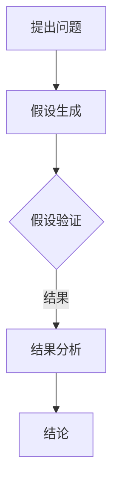

                 

Certainly! Let's break down the task into several steps and outline the structure of the blog post.

### Step 1: Define the Core Concepts and Their Relationships

#### AI-Driven Scientific Discovery Overview
- Explain the role of AI in scientific research.
- Discuss the advantages of using AI for scientific discovery.
- Outline the process of AI-driven scientific discovery.

#### From Hypothesis to Verification
- Explain the formation of hypotheses in scientific research.
- Discuss the importance of hypothesis verification.

### Step 2: Identify Core Algorithm Principles

#### Data Preprocessing
- Data cleaning, normalization, feature extraction.

#### Model Selection and Training
- Introduction to common models (neural networks, support vector machines, decision trees).
- Principles and applications of selected models.

#### Model Evaluation and Optimization
- Evaluation metrics (accuracy, recall, F1-score).
- Optimization methods for improving model performance.

### Step 3: Write Mathematical Models and Formulas

#### Probability Models
- Bayesian formula, maximum likelihood estimation.

#### Neural Networks
- Forward propagation, backpropagation algorithms, and their mathematical principles.

### Step 4: Design Practical Project Cases

#### Dataset Selection and Preprocessing
- Choosing appropriate experimental datasets.
- Data preprocessing steps.

#### Model Construction and Training
- Demonstration of model construction and training using real cases.

#### Result Analysis and Optimization
- Analysis of training results.
- Optimization strategies for improving model performance.

### Step 5: Determine the Detailed Content Structure of Each Chapter

#### Chapter 1: AI-Driven Scientific Discovery Overview
- 1.1 AI-Driven Scientific Research
- 1.2 Advantages of AI in Scientific Research
- 1.3 Process of AI-Driven Scientific Discovery

#### Chapter 2: Data Preprocessing and Model Selection
- 2.1 Data Preprocessing Methods
- 2.2 Introduction to Common Models
- 2.3 Model Selection and Evaluation

#### Chapter 3: The Formation and Verification of Hypotheses
- 3.1 Formation of Hypotheses
- 3.2 Verification of Hypotheses
- 3.3 Verification Methods and Tools

#### Chapter 4: Neural Networks and Deep Learning
- 4.1 Basic Structure of Neural Networks
- 4.2 Principles of Deep Learning Algorithms
- 4.3 Application Cases of Deep Learning

#### Chapter 5: Probability Models and Statistical Methods
- 5.1 Basic Concepts of Probability Models
- 5.2 Bayesian Networks and Inference
- 5.3 Statistical Learning and Prediction

#### Chapter 6: Experimental Design and Data Analysis
- 6.1 Principles of Experimental Design
- 6.2 Data Analysis Methods
- 6.3 Analysis of Experimental Results

#### Chapter 7: AI-Driven Scientific Discovery Case Studies
- 7.1 Case Study 1: Bioinformatics
- 7.2 Case Study 2: Climate Change Research
- 7.3 Case Study 3: Medical Image Analysis

### Step 6: Embed Core Concepts, Algorithm Principles, Mathematical Formulas, and Project Practical Examples Using Mermaid Flowcharts, Pseudo Code, LaTeX Mathematical Formulas, and Code Samples

#### Chapter 1: AI-Driven Scientific Discovery Overview

##### Mermaid Flowchart: The Process of Scientific Research


##### Pseudo Code: Neural Network Training Process
```python
function train_neural_network(data, labels, epochs):
    for epoch in 1 to epochs:
        for each sample in data:
            compute_forward_pass(sample)
            compute_loss(labels, predicted)
            compute_gradients()
            update_weights()
    return model
```

##### Mathematical Formula: Maximum Likelihood Estimation
$$
P(X|\theta) = \frac{P(\theta|X)P(X)}{P(\theta)}
$$

##### Project Practical: Using Scikit-learn for Model Training and Evaluation
```python
from sklearn.model_selection import train_test_split
from sklearn.ensemble import RandomForestClassifier
from sklearn.metrics import accuracy_score, confusion_matrix

# Data preprocessing
X_train, X_test, y_train, y_test = train_test_split(X, y, test_size=0.2)

# Model construction and training
clf = RandomForestClassifier()
clf.fit(X_train, y_train)

# Model evaluation
accuracy = accuracy_score(y_test, clf.predict(X_test))
conf_matrix = confusion_matrix(y_test, clf.predict(X_test))
```

This outline and structure should serve as a solid foundation for writing the blog post. Let's move on to the next steps, including writing the abstract, introduction, and each chapter in detail, following the outlined structure and embedding the required elements.

