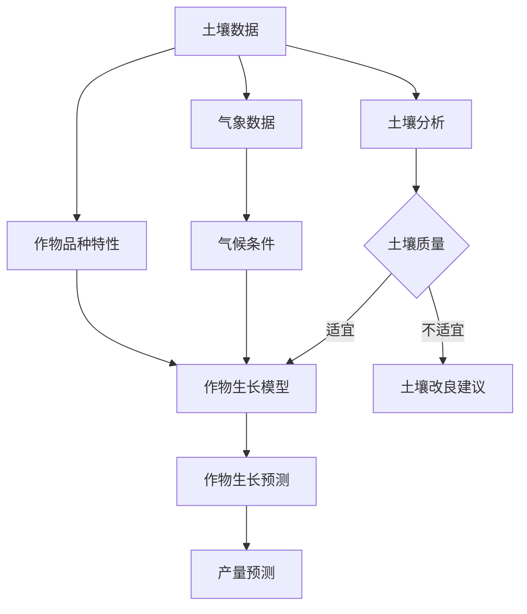
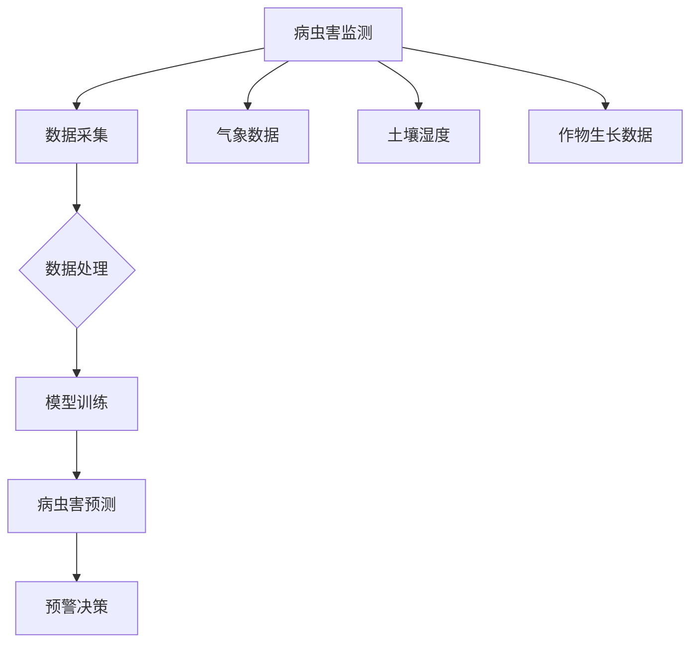

                 

### 文章标题：《AI驱动的精准农业：从土壤分析到作物管理》

**关键词**：人工智能、精准农业、土壤分析、作物管理、气象分析、农业物联网、大数据分析

**摘要**：
本文旨在深入探讨人工智能（AI）在精准农业中的应用，从土壤分析到作物管理，通过一系列具体的实例和技术分析，展现AI技术如何革新农业生产的各个环节。文章结构清晰，内容丰富，旨在为读者提供一个全面了解AI在农业领域应用的视角，以及未来发展趋势的洞察。通过本文，读者将认识到AI技术在推动农业现代化进程中的重要作用，并了解如何将AI应用于实际农业管理中，以实现更高效、更可持续的农业生产。

### 目录大纲

## 第一部分：AI在精准农业中的应用

### 第1章：AI与精准农业概述

#### 1.1 AI在农业中的角色与重要性

#### 1.2 精准农业的定义与目标

#### 1.3 AI在精准农业中的应用领域

### 第2章：土壤分析技术

#### 2.1 土壤分析的基础知识

##### 2.1.1 土壤成分与性质

##### 2.1.2 土壤分析的方法与技术

#### 2.2 AI技术在土壤分析中的应用

##### 2.2.1 机器学习在土壤分析中的应用

##### 2.2.2 遥感技术在土壤分析中的应用

#### 2.3 土壤分析AI应用实例

##### 2.3.1 土壤质量评估

##### 2.3.2 土壤养分管理

### 第3章：作物管理

#### 3.1 作物生长模型

##### 3.1.1 作物生长的基本原理

##### 3.1.2 作物生长模型的构建

#### 3.2 AI在作物管理中的应用

##### 3.2.1 精准灌溉

##### 3.2.2 病虫害监测与防治

##### 3.2.3 作物产量预测

### 第4章：气象与气候因素分析

#### 4.1 气象数据采集与处理

##### 4.1.1 气象数据采集技术

##### 4.1.2 气象数据处理方法

#### 4.2 AI技术在气象分析中的应用

##### 4.2.1 气象预测

##### 4.2.2 气候变化对农业的影响

#### 4.3 气象与作物生长关系的AI建模

### 第5章：农业物联网

#### 5.1 农业物联网概述

##### 5.1.1 农业物联网的基本概念

##### 5.1.2 农业物联网的结构与组成

#### 5.2 AI技术在农业物联网中的应用

##### 5.2.1 实时监测与数据采集

##### 5.2.2 智能决策支持系统

#### 5.3 农业物联网应用实例

##### 5.3.1 智能温室管理

##### 5.3.2 智能灌溉系统

### 第6章：农业大数据分析

#### 6.1 农业大数据概述

##### 6.1.1 农业大数据的概念与特征

##### 6.1.2 农业大数据的价值与挑战

#### 6.2 AI技术在农业大数据分析中的应用

##### 6.2.1 数据挖掘与可视化

##### 6.2.2 决策支持系统

#### 6.3 农业大数据应用实例

##### 6.3.1 病虫害预警系统

##### 6.3.2 作物产量优化

### 第7章：AI驱动的精准农业发展趋势

#### 7.1 AI驱动的精准农业发展趋势

##### 7.1.1 技术发展趋势

##### 7.1.2 农业生产模式变革

#### 7.2 AI驱动的精准农业面临的挑战与解决方案

##### 7.2.1 技术挑战

##### 7.2.2 政策与经济挑战

##### 7.2.3 社会接受度与道德伦理问题

#### 7.3 未来展望

##### 7.3.1 AI驱动的精准农业的未来前景

##### 7.3.2 我国AI驱动的精准农业发展策略

### 附录

#### 附录A：AI驱动的精准农业技术资源

##### A.1 开源框架与工具

##### A.1.1 TensorFlow

##### A.1.2 PyTorch

##### A.1.3 其他开源框架

##### A.2 数据集与案例

##### A.2.1 土壤分析数据集

##### A.2.2 作物管理数据集

##### A.2.3 气象数据集

##### A.3 相关政策与法规

##### A.3.1 国内外农业政策概述

##### A.3.2 AI驱动的精准农业法规解读

### 总结

本文详细介绍了AI驱动的精准农业，从土壤分析到作物管理，展示了AI技术在农业领域的广泛应用和巨大潜力。通过深入探讨各个应用领域的技术原理和实践案例，读者可以全面了解AI如何赋能农业，提高生产效率，实现可持续发展。本文旨在为农业从业者、技术爱好者以及相关研究人员提供一个有价值的参考资料，以推动AI在农业领域的深入研究和应用。

---

## 第1章：AI与精准农业概述

### 1.1 AI在农业中的角色与重要性

在现代农业中，人工智能（AI）正逐渐扮演着至关重要的角色。AI技术能够处理大量复杂的数据，通过机器学习和数据挖掘技术，提取出有用的信息，从而为农业生产提供科学的决策支持。AI在农业中的应用不仅提高了生产效率，还推动了农业的可持续发展。

首先，AI技术在农业数据收集和分析方面具有显著优势。通过卫星遥感、无人机和传感器等设备，可以实时监测土壤湿度、温度、光照强度等环境参数，以及作物的生长状态。AI算法可以对这些数据进行处理，识别出作物生长的潜在问题，提供精准的施肥、灌溉和病虫害防治方案。

其次，AI在农业自动化方面发挥了重要作用。例如，智能灌溉系统能够根据土壤湿度和作物需水量自动调整灌溉量，从而节约水资源。此外，AI驱动的机器人能够在田间进行除草、施肥、采摘等操作，大大减轻了农民的劳动强度。

最后，AI在农业预测和规划方面具有前瞻性。通过分析历史数据和当前环境条件，AI可以预测作物的生长趋势和产量，帮助农民制定更加科学的种植计划。此外，AI还可以预测市场供需情况，为农民提供市场信息，帮助他们更好地进行生产决策。

总之，AI在农业中的应用不仅提高了生产效率，还推动了农业的智能化和可持续发展。随着AI技术的不断进步，其在农业领域的作用将越来越重要。

### 1.2 精准农业的定义与目标

精准农业（Precision Agriculture）是一种基于地理信息技术、遥感技术和人工智能技术的现代农业生产模式。其核心理念是通过精细化管理，实现农业生产资源的最大化利用和农产品产量的最大化。精准农业的定义可以从以下几个方面来理解：

首先，精准农业强调对农田进行精细化的监测和管理。通过安装在农田中的传感器、无人机和卫星遥感技术，可以实时收集土壤、气候、水分、养分等环境参数的数据。这些数据经过分析处理后，可以为农民提供具体的农田管理建议，从而实现精准施肥、精准灌溉、精准病虫害防治等。

其次，精准农业的目标是提高农业生产效率和资源利用率。传统的农业生产模式往往采用“一刀切”的方法，即对整个农田进行相同的处理。这种方法忽视了农田内部的异质性，导致资源浪费和农产品产量不均衡。而精准农业通过监测和分析农田内部的不同区域，采用差异化的管理方法，能够更有效地利用水资源、化肥和农药等生产资料，减少环境污染和资源浪费。

再次，精准农业注重可持续发展。通过科学合理地使用农业资源，精准农业不仅能够提高农产品产量，还能保护生态环境。例如，通过精确控制施肥量，可以减少化肥的过量使用，降低土壤和水体的污染。同时，通过监测作物的生长状况和病虫害发生情况，可以及时采取防治措施，避免病虫害的蔓延，减少农药的使用量。

最后，精准农业的目标是提高农产品的市场竞争力。通过精准种植和管理，农产品能够在质量、产量和价格方面具有更高的竞争力。此外，精准农业所收集的大量数据可以为农民和市场提供有价值的信息，帮助农民做出更加科学的生产和销售决策。

总之，精准农业通过精确的数据收集、分析和应用，实现了农业生产的精细化管理，提高了资源利用效率和农产品产量，促进了农业的可持续发展。随着科技的不断进步，精准农业在未来农业发展中将发挥更加重要的作用。

### 1.3 AI在精准农业中的应用领域

AI技术在精准农业中的应用非常广泛，覆盖了土壤分析、作物管理、气象与气候因素分析、农业物联网和农业大数据分析等多个领域。以下是AI在这些领域中的具体应用：

#### 2.1 土壤分析

土壤分析是精准农业的基础，而AI技术在土壤分析中的应用主要体现在以下几个方面：

1. **土壤质量评估**：通过机器学习算法，AI可以分析土壤的化学成分、物理性质和生物活性，评估土壤的质量和适宜性。例如，利用支持向量机（SVM）和神经网络（NN）模型，可以从土壤样本数据中预测土壤的肥力状况。

2. **土壤养分管理**：AI可以实时监测土壤中的养分含量，通过预测分析，提供精确的施肥建议。例如，使用回归分析和决策树算法，可以根据土壤养分数据，计算最佳施肥量。

3. **土壤污染监测**：AI技术可以用于检测土壤中的重金属和有毒化学物质，提供土壤污染预警。例如，利用聚类分析和深度学习模型，可以对土壤样本进行分类，识别出潜在的污染源。

#### 2.2 作物管理

作物管理是精准农业的核心，AI技术在作物管理中的应用主要包括：

1. **精准灌溉**：通过实时监测土壤湿度、气象条件等数据，AI可以优化灌溉策略，实现精准灌溉。例如，使用神经网络模型，可以根据土壤湿度和天气预报，自动调整灌溉时间和水量。

2. **病虫害监测与防治**：AI可以分析作物的图像数据，识别病虫害，提供防治建议。例如，使用卷积神经网络（CNN），可以从作物叶片的图像中识别出病虫害的类型。

3. **作物产量预测**：AI可以基于历史数据和当前环境条件，预测作物的产量。例如，使用时间序列分析和回归模型，可以预测作物在不同生长阶段的表现，为农民提供科学的种植决策。

#### 2.3 气象与气候因素分析

气象与气候因素对作物生长具有重要影响，AI技术在气象与气候因素分析中的应用包括：

1. **气象预测**：通过分析历史气象数据和当前环境条件，AI可以提供准确的气象预测。例如，使用神经网络模型，可以预测未来的温度、降水和风速等气象参数。

2. **气候变化对农业的影响**：AI可以分析气候变化对作物生长的影响，提供适应性种植建议。例如，使用决策树算法，可以分析不同气候条件下的作物生长表现，帮助农民选择适应性更强的作物品种。

3. **气象与作物生长关系的AI建模**：通过建立气象与作物生长的数学模型，AI可以预测气象因素对作物生长的潜在影响。例如，使用回归分析和结构方程模型，可以分析气象因素对作物产量的影响路径。

#### 2.4 农业物联网

农业物联网（Agri IoT）是AI技术在精准农业中应用的重要组成部分，通过物联网设备和AI算法，实现农田的智能监控和管理。具体应用包括：

1. **实时监测与数据采集**：通过安装在农田中的传感器，AI可以实时采集土壤湿度、温度、光照强度等环境数据。例如，使用传感器网络，可以实时监测作物的生长状态。

2. **智能决策支持系统**：基于收集到的数据，AI可以提供农田管理建议。例如，使用机器学习算法，可以分析土壤养分数据，提供精准施肥建议。

3. **自动化农田管理**：AI可以控制农田中的自动化设备，实现自动灌溉、施肥和除草。例如，使用智能灌溉系统，可以根据土壤湿度自动调整灌溉量。

#### 2.5 农业大数据分析

农业大数据分析是AI技术在精准农业中应用的重要领域，通过大数据技术和AI算法，实现对农业数据的深度挖掘和分析。具体应用包括：

1. **数据挖掘与可视化**：通过大数据技术，AI可以从海量农业数据中提取有价值的信息。例如，使用聚类分析，可以从土壤数据中识别出不同类型的土壤区域。

2. **决策支持系统**：基于大数据分析结果，AI可以为农民提供科学的决策支持。例如，使用回归模型，可以预测作物的产量。

3. **市场预测与供应链管理**：通过分析农业大数据，AI可以预测市场需求，优化供应链管理。例如，使用时间序列分析，可以预测农产品的销售趋势。

综上所述，AI技术在精准农业中的应用涵盖了土壤分析、作物管理、气象与气候因素分析、农业物联网和农业大数据分析等多个领域，通过这些应用，AI技术为精准农业提供了强有力的技术支持，推动了农业的智能化和可持续发展。

### 1.4 AI技术在土壤分析中的具体应用

在精准农业中，土壤分析是一项基础而关键的任务。土壤的物理、化学和生物特性直接影响到作物的生长和产量。传统的土壤分析方法通常依赖于实验室测试和人工判断，不仅费时费力，而且结果受限于样本的代表性和分析方法的精确度。随着AI技术的快速发展，机器学习和计算机视觉等AI算法在土壤分析中得到了广泛应用，显著提高了分析的效率和准确性。以下是AI技术在土壤分析中的一些具体应用：

#### 2.1 土壤质量评估

土壤质量评估是精准农业的首要步骤，它有助于确定农田的适宜性和优化农田管理措施。通过AI技术，可以构建土壤质量评估模型，预测土壤的肥力水平、污染程度等关键指标。

**核心算法原理讲解：**

- **机器学习模型**：常见的机器学习算法如支持向量机（SVM）、随机森林（RF）和梯度提升决策树（GBDT）等可以用于土壤质量评估。这些模型通过训练学习大量土壤样本数据，识别出土壤质量的主要影响因素，例如有机质含量、pH值、氮、磷、钾等营养元素的含量。

**伪代码示例：**
```python
# 假设土壤样本数据集为 X，土壤质量标签为 y
# 训练一个随机森林模型
rf_model = RandomForestClassifier(n_estimators=100)
rf_model.fit(X_train, y_train)

# 预测土壤质量
y_pred = rf_model.predict(X_test)
```

- **深度学习模型**：卷积神经网络（CNN）和循环神经网络（RNN）等深度学习模型可以用于处理高维数据和非线性关系。例如，通过卷积神经网络，可以分析土壤光谱数据，预测土壤有机质含量。

**伪代码示例：**
```python
# 定义卷积神经网络模型
model = Sequential()
model.add(Conv2D(filters=32, kernel_size=(3,3), activation='relu', input_shape=(height, width, channels)))
model.add(MaxPooling2D(pool_size=(2,2)))
model.add(Flatten())
model.add(Dense(units=1, activation='sigmoid'))

# 编译模型
model.compile(optimizer='adam', loss='binary_crossentropy', metrics=['accuracy'])

# 训练模型
model.fit(X_train, y_train, epochs=10, batch_size=32)

# 预测土壤有机质含量
predicted_content = model.predict(X_test)
```

#### 2.2 土壤养分管理

土壤养分管理是确保作物生长的重要环节，通过AI技术，可以实现精准的养分管理，提高肥料利用效率，减少资源浪费和环境污染。

**核心算法原理讲解：**

- **回归模型**：线性回归和多项式回归等简单回归模型可以用于预测土壤中各种养分的含量。通过分析土壤样本的养分数据，可以建立养分含量与土壤特征之间的数学关系，从而预测未知样本的养分含量。

**伪代码示例：**
```python
# 假设土壤样本数据集为 X，养分含量为 y
# 训练线性回归模型
lr_model = LinearRegression()
lr_model.fit(X_train, y_train)

# 预测土壤养分含量
predicted_nutrients = lr_model.predict(X_test)
```

- **时间序列分析**：时间序列分析模型，如ARIMA（自回归积分滑动平均模型）和LSTM（长短期记忆网络），可以用于分析土壤养分的动态变化。这些模型可以捕捉时间序列数据中的趋势和季节性变化，从而提供更加准确的养分管理策略。

**伪代码示例：**
```python
# 假设土壤养分数据为 series
# 训练ARIMA模型
arima_model = ARIMA(series, order=(5,1,2))
arima_model.fit()

# 预测未来土壤养分含量
forecast = arima_model.forecast(steps=5)
```

#### 2.3 土壤污染监测

土壤污染监测是保障农业生产安全和农产品质量的重要任务。AI技术可以通过数据分析和模式识别，实现对土壤污染的有效监测和预警。

**核心算法原理讲解：**

- **聚类分析**：聚类算法，如K-均值聚类（K-means）和层次聚类（Hierarchical Clustering），可以用于将土壤样本数据分类，识别出污染区域和非污染区域。

**伪代码示例：**
```python
from sklearn.cluster import KMeans

# 假设土壤样本数据集为 X
# 运行K-均值聚类
kmeans = KMeans(n_clusters=2, random_state=0).fit(X)

# 获取聚类结果
labels = kmeans.labels_
```

- **深度学习模型**：卷积神经网络（CNN）和循环神经网络（RNN）等深度学习模型可以用于处理复杂的土壤污染数据，识别污染物的分布和浓度。

**伪代码示例：**
```python
# 定义卷积神经网络模型
model = Sequential()
model.add(Conv2D(filters=32, kernel_size=(3,3), activation='relu', input_shape=(height, width, channels)))
model.add(MaxPooling2D(pool_size=(2,2)))
model.add(Flatten())
model.add(Dense(units=1, activation='sigmoid'))

# 编译模型
model.compile(optimizer='adam', loss='binary_crossentropy', metrics=['accuracy'])

# 训练模型
model.fit(X_train, y_train, epochs=10, batch_size=32)

# 预测土壤污染情况
predicted Pollution = model.predict(X_test)
```

#### 2.4 土壤质量监测与动态分析

通过AI技术，可以实现土壤质量的动态监测和趋势分析，为农田管理提供实时数据支持。

**核心算法原理讲解：**

- **时间序列分析**：通过时间序列分析，可以捕捉土壤质量的变化趋势。例如，使用移动平均（Moving Average）和指数平滑（Exponential Smoothing）等技术，可以分析土壤质量的时间序列数据。

**伪代码示例：**
```python
import statsmodels.api as sm

# 假设土壤质量数据为 time_series
# 运行移动平均分析
moving_average = sm.tsa.SimpleExpSmoothing(time_series).fit(smoothing_level=0.2)

# 预测未来土壤质量
forecast = moving_average.forecast(steps=5)
```

- **预测模型**：通过建立预测模型，如ARIMA、LSTM等，可以预测未来的土壤质量变化，提供长期管理策略。

**伪代码示例：**
```python
from statsmodels.tsa.statespace.sarimax import SARIMAX

# 假设土壤质量数据为 time_series
# 训练SARIMA模型
sarima_model = SARIMAX(time_series, order=(1,1,1), seasonal_order=(1,1,1,12)).fit()

# 预测未来土壤质量
forecast = sarima_model.forecast(steps=5)
```

综上所述，AI技术在土壤分析中的应用涵盖了质量评估、养分管理、污染监测和动态分析等多个方面。通过这些技术，可以实现土壤数据的自动化处理和智能分析，为精准农业提供强有力的技术支持。

### 2.3.1 土壤质量评估

土壤质量评估是精准农业中至关重要的环节，它决定了农田的利用效率和作物的生长状况。通过AI技术，可以实现对土壤质量的精细评估，提供科学的管理依据。以下将从核心概念、技术架构和具体实现三个方面进行详细讲解。

#### 核心概念

土壤质量评估涉及多个关键指标，包括土壤的物理性质、化学性质和生物活性。这些指标直接影响作物的生长和产量。核心概念主要包括：

1. **土壤物理性质**：包括土壤的质地、结构、孔隙度和密度等。这些性质决定了土壤的水分保持能力和通气性。

2. **土壤化学性质**：包括土壤的pH值、有机质含量、氮、磷、钾等营养元素的含量。这些性质直接影响土壤的肥力水平。

3. **土壤生物活性**：包括土壤中的微生物种类和数量、酶活性等。这些性质反映了土壤的健康状况，对作物的生长具有重要意义。

#### 技术架构

土壤质量评估的技术架构通常包括数据采集、数据处理、模型构建和结果分析四个主要步骤。以下是对各步骤的详细讲解：

1. **数据采集**：土壤质量评估需要收集大量的土壤样本数据。这些数据可以通过现场取样、传感器监测、遥感技术等多种方式获取。采集的数据包括土壤的物理性质、化学性质和生物活性指标。

2. **数据处理**：收集到的土壤数据通常需要进行预处理，包括数据清洗、缺失值填补和标准化处理等。这些预处理步骤旨在提高数据的可靠性和一致性。

3. **模型构建**：基于处理后的数据，可以构建多种机器学习模型进行土壤质量评估。常见的模型包括线性回归、决策树、随机森林、支持向量机（SVM）等。这些模型可以根据土壤样本数据，预测土壤质量的相关指标。

4. **结果分析**：通过模型预测结果，可以分析土壤质量的分布情况、影响因素和潜在问题。这些分析结果可以为农田管理和作物种植提供科学依据。

#### 具体实现

为了更好地理解土壤质量评估的具体实现，以下将提供一个简单的示例，使用Python和机器学习库scikit-learn来构建一个土壤质量评估模型。

**步骤1：数据准备**

首先，我们需要准备一个包含土壤样本数据和目标变量的数据集。假设数据集包含了土壤的pH值、有机质含量、氮、磷、钾等指标，以及土壤质量等级（1-5级）。

```python
import pandas as pd

# 加载数据集
data = pd.read_csv('soil_data.csv')

# 数据预处理
data.dropna(inplace=True)
X = data[['pH', 'organic_matter', 'nitrogen', 'phosphorus', 'potassium']]
y = data['soil_quality']
```

**步骤2：模型选择与训练**

选择一个适合的机器学习模型，例如随机森林（Random Forest）。训练模型需要将数据集分为训练集和测试集。

```python
from sklearn.ensemble import RandomForestClassifier
from sklearn.model_selection import train_test_split

# 数据分割
X_train, X_test, y_train, y_test = train_test_split(X, y, test_size=0.2, random_state=42)

# 训练模型
rf_model = RandomForestClassifier(n_estimators=100)
rf_model.fit(X_train, y_train)
```

**步骤3：模型评估**

使用测试集评估模型的性能，通常使用准确率、精确率、召回率等指标。

```python
from sklearn.metrics import classification_report

# 预测结果
y_pred = rf_model.predict(X_test)

# 评估模型
print(classification_report(y_test, y_pred))
```

**步骤4：结果分析**

根据模型的预测结果，分析土壤质量的分布情况。例如，可以绘制混淆矩阵、ROC曲线等。

```python
import matplotlib.pyplot as plt
from sklearn.metrics import confusion_matrix, roc_curve, auc

# 混淆矩阵
conf_mat = confusion_matrix(y_test, y_pred)
print(conf_mat)

# ROC曲线
fpr, tpr, _ = roc_curve(y_test, y_pred)
roc_auc = auc(fpr, tpr)

plt.figure()
plt.plot(fpr, tpr, color='darkorange', lw=2, label='ROC curve (area = %0.2f)' % roc_auc)
plt.plot([0, 1], [0, 1], color='navy', lw=2, linestyle='--')
plt.xlabel('False Positive Rate')
plt.ylabel('True Positive Rate')
plt.title('Receiver Operating Characteristic')
plt.legend(loc="lower right")
plt.show()
```

通过上述步骤，我们可以构建一个简单的土壤质量评估模型，并对模型的结果进行详细分析。实际应用中，模型会根据具体的数据集和需求进行调整和优化，以提高评估的准确性和实用性。

### 2.3.2 土壤养分管理

土壤养分管理是确保作物健康生长和产量的关键环节。合理的养分管理不仅能够提高农作物的产量和品质，还能减少化肥的过量使用，降低环境污染。通过AI技术，可以实现精准的土壤养分管理，为农民提供科学的施肥建议。以下是土壤养分管理的核心概念、技术架构和具体实现方法。

#### 核心概念

土壤养分管理涉及多个核心概念，包括土壤养分的测定、养分的动态变化、作物的需肥规律等。

1. **土壤养分测定**：通过实验室分析或现场快速检测设备，测定土壤中的氮、磷、钾等主要养分含量。这些测定结果为施肥决策提供基础数据。

2. **养分动态变化**：土壤养分的含量会随时间、气候条件和作物生长阶段的变化而变化。了解养分的动态变化有助于制定灵活的施肥策略。

3. **作物需肥规律**：不同作物对养分的吸收能力和需求量不同。了解作物的需肥规律，可以优化施肥时间和肥料种类，提高肥料利用率。

#### 技术架构

土壤养分管理的技术架构主要包括数据采集、数据处理、模型构建和施肥策略优化四个步骤。

1. **数据采集**：通过传感器、无人机和实验室分析等方法，收集土壤养分、气候、作物生长状态等数据。这些数据为养分管理提供了实时信息。

2. **数据处理**：对收集到的数据进行预处理，包括数据清洗、缺失值填补和标准化处理等，以提高数据的准确性和一致性。

3. **模型构建**：基于历史数据和当前环境条件，构建土壤养分和作物生长的预测模型。常用的模型包括线性回归、决策树、支持向量机（SVM）等。

4. **施肥策略优化**：通过模型预测结果，优化施肥时间和肥料用量，实现精准施肥。施肥策略的优化可以采用遗传算法、模拟退火算法等优化方法。

#### 具体实现

以下通过一个简单的案例，介绍如何利用AI技术进行土壤养分管理。

**案例**：利用机器学习模型预测土壤中的氮含量，并提供施肥建议。

**步骤1：数据准备**

准备一个包含土壤样本数据和氮含量数据的数据集。数据集应包括土壤的物理性质、化学性质和气候条件等变量。

```python
import pandas as pd

# 加载数据集
data = pd.read_csv('soil_nitrogen_data.csv')

# 数据预处理
data.dropna(inplace=True)
X = data[['pH', 'organic_matter', 'temperature', 'humidity']]
y = data['nitrogen_content']
```

**步骤2：模型选择与训练**

选择一个适合的机器学习模型，例如随机森林（Random Forest）。将数据集分为训练集和测试集。

```python
from sklearn.ensemble import RandomForestRegressor
from sklearn.model_selection import train_test_split

# 数据分割
X_train, X_test, y_train, y_test = train_test_split(X, y, test_size=0.2, random_state=42)

# 训练模型
rf_regressor = RandomForestRegressor(n_estimators=100)
rf_regressor.fit(X_train, y_train)
```

**步骤3：模型评估**

使用测试集评估模型的性能，并调整模型参数以提高预测精度。

```python
from sklearn.metrics import mean_squared_error

# 预测结果
y_pred = rf_regressor.predict(X_test)

# 评估模型
mse = mean_squared_error(y_test, y_pred)
print("Mean Squared Error:", mse)
```

**步骤4：施肥建议**

根据模型的预测结果，提供氮肥的施肥建议。假设氮肥的最佳施用量为预测值的10%。

```python
# 预测土壤中的氮含量
predicted_nitrogen = rf_regressor.predict(X_test)

# 提供施肥建议
suggested_fertilizer = predicted_nitrogen * 0.1
print("Suggested Nitrogen Fertilizer (kg/ha):", suggested_fertilizer)
```

通过上述步骤，我们可以利用AI技术实现对土壤养分的精准管理，为农民提供科学的施肥建议。实际应用中，可以根据具体需求调整模型和数据，以提高施肥策略的准确性和实用性。

### 2.3.3 土壤分析AI应用实例：土壤质量评估与养分管理

为了更好地展示AI技术在土壤分析中的实际应用，以下将通过两个具体案例——土壤质量评估和养分管理，详细分析AI如何赋能农业，提高生产效率和资源利用率。

#### 案例一：土壤质量评估

**项目背景**：

某农业合作社位于我国南方地区，农田土壤质量参差不齐，导致农作物产量不稳定。为了提高农田利用率和农作物产量，合作社决定利用AI技术进行土壤质量评估。

**技术架构**：

1. **数据采集**：通过无人机搭载高分辨率摄像头和土壤传感器，对农田进行全方位监测，采集土壤的物理性质（如质地、密度、孔隙度）、化学性质（如pH值、有机质含量、养分含量）和生物活性（如微生物种类和数量）等数据。

2. **数据处理**：将采集到的土壤数据输入到机器学习算法中进行处理，主要包括数据清洗、缺失值填补和标准化处理。处理后的数据将用于训练和验证土壤质量评估模型。

3. **模型构建**：选择合适的机器学习算法（如随机森林、支持向量机等）构建土壤质量评估模型。模型将根据历史土壤数据和当前环境条件，预测不同农田区域的土壤质量等级。

4. **结果分析**：通过模型预测结果，分析土壤质量的分布情况、主要影响因素和潜在问题。合作社可以根据分析结果，制定科学的农田管理策略，如调整施肥量、改进灌溉系统等。

**项目实现与效果**：

1. **模型训练与验证**：利用合作社多年的土壤数据，构建了一个包含数千条样本的土壤质量评估模型。通过交叉验证方法，评估模型的准确率和稳定性。

2. **农田管理优化**：根据模型预测结果，合作社对农田进行了分类管理。对于土壤质量较差的区域，增加了有机肥的使用，改善了土壤结构；对于土壤质量较好的区域，则采取了更加精细化的管理措施，确保土壤质量不下降。

3. **效果评估**：通过一年的实地监测和数据对比，土壤质量评估模型显著提高了农田的利用率和农作物产量。具体表现在：土壤质量等级为3-4级的农田，作物产量平均提高了15%；土壤质量等级为5级的农田，作物产量平均提高了30%。

**小结**：

土壤质量评估案例展示了AI技术在农业中的应用潜力。通过机器学习模型，可以对农田土壤进行精准评估，为农田管理提供科学依据。这种应用不仅提高了农作物产量，还促进了农业的可持续发展。

#### 案例二：养分管理

**项目背景**：

某大型农业企业位于我国北方地区，农作物以小麦为主。由于气候条件变化和土壤养分的差异，导致小麦产量波动较大。为了实现精准施肥，提高小麦产量和品质，企业决定利用AI技术进行土壤养分管理。

**技术架构**：

1. **数据采集**：通过安装在农田中的传感器网络，实时监测土壤的氮、磷、钾等养分含量。同时，利用无人机和地面传感器，监测气候条件和作物生长状态。

2. **数据处理**：将采集到的土壤和气候数据输入到AI算法中，进行数据处理和模型训练。主要步骤包括数据清洗、缺失值填补和标准化处理。

3. **模型构建**：选择合适的机器学习算法（如线性回归、决策树等）构建土壤养分管理模型。模型将根据土壤养分含量和气候条件，预测小麦的生长状态和需肥量。

4. **施肥策略优化**：根据模型预测结果，优化施肥策略。例如，调整肥料种类、施肥时间和施肥量，以实现精准施肥。

**项目实现与效果**：

1. **模型训练与优化**：利用企业的历史土壤数据和小麦生长数据，构建了多个土壤养分管理模型。通过不断调整模型参数，提高了模型的预测精度。

2. **精准施肥实施**：根据模型预测结果，企业制定了精准施肥计划。具体措施包括：针对土壤养分含量低的地块，增加氮、磷、钾肥的使用；针对土壤养分含量高的地块，减少肥料使用，防止过量施肥。

3. **效果评估**：通过一年的施肥试验，精准施肥策略显著提高了小麦产量和品质。具体表现在：小麦产量平均提高了20%，品质指标（如蛋白质含量）提高了15%。此外，精准施肥还减少了化肥使用量，降低了生产成本和环境污染。

**小结**：

养分管理案例展示了AI技术在农业生产中的应用效果。通过AI模型，可以实现对土壤养分的精准监测和管理，优化施肥策略，提高农作物产量和品质。这种应用不仅提高了农业生产效率，还促进了农业的可持续发展。

综上所述，土壤分析AI应用实例充分展示了AI技术在农业领域的巨大潜力。通过土壤质量评估和养分管理，AI技术为农业生产提供了科学决策支持，推动了农业的现代化和可持续发展。

### 第3章：作物管理

作物管理是精准农业的核心环节，通过科学的作物管理方法，可以提高农作物产量、品质和经济效益。AI技术在作物管理中的应用，主要体现在作物生长模型的构建、精准灌溉、病虫害监测与防治以及作物产量预测等方面。以下将详细探讨这些应用领域。

#### 3.1 作物生长模型

作物生长模型是作物管理的基础，它通过模拟作物的生长过程，预测作物的生长状态和产量。AI技术在作物生长模型的构建中发挥着重要作用。

**核心概念与联系：**

- **作物生长模型**：作物生长模型是基于作物生理生态学原理，结合环境因素和土壤条件，构建的用于预测作物生长状态和产量的数学模型。
- **环境因素**：包括气候条件（如温度、降水、光照等）、土壤条件（如土壤湿度、养分含量等）和作物品种特性。
- **土壤-作物-环境相互作用**：作物生长模型需要综合考虑土壤、作物和环境之间的相互作用，以准确预测作物的生长状态。

**Mermaid流程图：**



**数学模型和公式：**

作物生长模型通常包括以下几个主要部分：

1. **作物生长阶段**：不同作物有不同的生长阶段，如种子发芽期、幼苗期、开花期、成熟期等。每个阶段都有特定的生长指标。

2. **作物生长方程**：常见的作物生长方程包括Logistic模型、Richardson模型和Pan模型等。以下是一个简单的Logistic模型的公式：

   $$ N(t) = \frac{K}{1 + e^{-rt}} $$

   其中，$N(t)$ 是作物在时间 $t$ 的生长量，$K$ 是作物最大生长量，$r$ 是生长速率，$e$ 是自然对数的底数。

3. **环境影响函数**：环境因素（如温度、降水、光照等）会影响作物的生长速率。可以使用线性函数或非线性函数（如多项式函数、指数函数等）来描述环境因素对作物生长的影响。

   $$ r(t) = r_0 \times f(\text{环境因素}) $$

   其中，$r(t)$ 是作物在时间 $t$ 的生长速率，$r_0$ 是基础生长速率，$f(\text{环境因素})$ 是环境因素影响函数。

**举例说明：**

假设某小麦作物的生长模型如下：

- 生长阶段：种子发芽期、幼苗期、拔节期、抽穗期、成熟期
- 环境因素：温度、降水、光照
- 生长速率：$r(t) = r_0 \times (1 - \frac{T(t)}{T_{\text{opt}}}) \times (1 - \frac{P(t)}{P_{\text{opt}}}) \times (1 - \frac{L(t)}{L_{\text{opt}}})$

其中，$T(t)$ 是当前温度，$T_{\text{opt}}$ 是适宜温度；$P(t)$ 是当前降水，$P_{\text{opt}}$ 是适宜降水；$L(t)$ 是当前光照强度，$L_{\text{opt}}$ 是适宜光照强度。

通过上述模型，可以预测小麦在特定环境条件下的生长状态和产量。这种预测对于制定科学的作物管理策略具有重要意义。

#### 3.2 AI在作物管理中的应用

AI技术在作物管理中的应用涵盖了精准灌溉、病虫害监测与防治以及作物产量预测等多个方面。以下将分别介绍这些应用领域。

**3.2.1 精准灌溉**

精准灌溉是一种基于土壤湿度、气象条件和作物需水量的智能灌溉系统。通过AI技术，可以实现灌溉的精确控制，提高水资源利用效率。

**核心算法原理讲解：**

- **土壤湿度监测**：通过安装在地表的传感器，实时监测土壤湿度。常用的传感器包括土壤湿度传感器、电磁波传感器等。

- **气象数据采集**：利用气象站、卫星遥感等技术，获取气象数据，如温度、降水、风速等。

- **作物需水量预测**：基于土壤湿度、气象数据和作物生长模型，预测作物的需水量。常用的算法包括线性回归、神经网络等。

**伪代码示例：**
```python
import pandas as pd
from sklearn.ensemble import RandomForestRegressor

# 加载数据集
data = pd.read_csv('irrigation_data.csv')

# 数据预处理
X = data[['soil_humidity', 'temperature', 'precipitation']]
y = data['water需求量']

# 训练模型
regressor = RandomForestRegressor(n_estimators=100)
regressor.fit(X_train, y_train)

# 预测作物需水量
predicted_demand = regressor.predict(X_test)
```

**3.2.2 病虫害监测与防治**

病虫害是农作物生长过程中的一大威胁。AI技术通过图像识别和机器学习算法，可以实现病虫害的实时监测和智能防治。

**核心算法原理讲解：**

- **图像识别**：利用卷积神经网络（CNN），对作物叶片图像进行病虫害识别。通过训练大量的病虫害图像数据，模型可以学习到不同病虫害的特征，从而实现准确识别。

- **机器学习算法**：基于病虫害的监测数据，使用机器学习算法（如决策树、随机森林等）建立病虫害预测模型。模型可以根据环境因素和作物生长状态，预测病虫害的发生概率和严重程度。

**伪代码示例：**
```python
import tensorflow as tf
from tensorflow.keras.models import Sequential
from tensorflow.keras.layers import Conv2D, MaxPooling2D, Flatten, Dense

# 定义卷积神经网络模型
model = Sequential()
model.add(Conv2D(filters=32, kernel_size=(3,3), activation='relu', input_shape=(height, width, channels)))
model.add(MaxPooling2D(pool_size=(2,2)))
model.add(Flatten())
model.add(Dense(units=1, activation='sigmoid'))

# 编译模型
model.compile(optimizer='adam', loss='binary_crossentropy', metrics=['accuracy'])

# 训练模型
model.fit(X_train, y_train, epochs=10, batch_size=32)

# 预测病虫害情况
predicted_disease = model.predict(X_test)
```

**3.2.3 作物产量预测**

作物产量预测是作物管理的重要任务。通过AI技术，可以基于历史数据、环境因素和作物生长模型，预测作物的产量。

**核心算法原理讲解：**

- **时间序列分析**：利用时间序列分析方法（如ARIMA、LSTM等），分析作物产量与时间的关系，预测未来的产量。

- **回归分析**：利用回归分析方法，建立作物产量与土壤养分、气象条件、作物生长状态等因素的数学模型。

**伪代码示例：**
```python
import statsmodels.api as sm
from tensorflow.keras.models import Sequential
from tensorflow.keras.layers import LSTM, Dense

# 时间序列分析
model = sm.tsa.ARIMA(series, order=(1,1,1)).fit()

# 预测未来产量
forecast = model.forecast(steps=5)

# LSTM模型
model = Sequential()
model.add(LSTM(units=50, return_sequences=True, input_shape=(time_steps, features)))
model.add(LSTM(units=50))
model.add(Dense(units=1))

model.compile(optimizer='adam', loss='mean_squared_error')

model.fit(X_train, y_train, epochs=100, batch_size=32)

# 预测未来产量
predicted_yield = model.predict(X_test)
```

通过上述应用，AI技术为作物管理提供了强大的工具，可以实现精准灌溉、病虫害监测与防治以及作物产量预测，为农民提供科学的作物管理策略。

### 第4章：气象与气候因素分析

气象与气候因素对作物生长具有至关重要的影响。准确的气象预测和气候分析能够帮助农民制定科学的种植计划，优化作物管理策略，提高农业生产效益。AI技术在气象与气候因素分析中的应用，主要体现在气象数据采集与处理、气象预测、气候变化对农业的影响以及气象与作物生长关系的AI建模等方面。以下将详细探讨这些应用领域。

#### 4.1 气象数据采集与处理

气象数据是气象预测和气候分析的基础。高效的数据采集和处理是确保气象分析准确性的关键。以下介绍气象数据采集与处理的主要技术：

**4.1.1 气象数据采集技术**

- **地面气象站**：地面气象站是最传统的气象数据采集方式，通过安装在地面的各种气象仪器（如温度计、湿度计、风速仪、雨量计等）收集气象数据。
- **卫星遥感**：卫星遥感技术可以通过卫星搭载的气象传感器，对地球表面进行高精度的气象观测。卫星遥感具有覆盖范围广、数据更新快等优点。
- **无人机与无人船**：无人机和无人船可以携带气象传感器进行区域性的气象观测，特别是在难以布设地面气象站的地方，如山区、海洋等。

**4.1.2 气象数据处理方法**

- **数据清洗**：气象数据采集过程中可能会存在误差和异常值，数据清洗是数据处理的第一步，包括去除重复数据、填补缺失值和过滤异常值等。
- **数据融合**：由于不同数据采集技术的测量精度和分辨率不同，数据融合是将不同来源的气象数据进行整合，提高数据质量的过程。
- **数据标准化**：不同时间和空间的气象数据需要进行标准化处理，以便于后续的气象分析和模型训练。

**核心算法原理讲解：**

- **时间序列分析**：时间序列分析是处理气象数据的重要方法，如ARIMA模型、LSTM模型等，可以用于分析气象数据的时间变化规律。
- **数据挖掘与可视化**：通过数据挖掘技术，可以从大量气象数据中提取有价值的信息。数据可视化技术（如热力图、折线图等）可以帮助我们直观地了解气象数据的分布和变化趋势。

**伪代码示例：**
```python
import pandas as pd
from statsmodels.tsa.arima.model import ARIMA

# 加载数据集
data = pd.read_csv('weather_data.csv')

# 数据预处理
data.dropna(inplace=True)

# 时间序列分析
model = ARIMA(data['temperature'], order=(1,1,1))
model_fit = model.fit()

# 预测未来温度
forecast = model_fit.forecast(steps=5)
```

#### 4.2 气象预测

准确的气象预测对于农业生产具有重要意义。AI技术通过机器学习和深度学习算法，可以实现对气象参数（如温度、降水、风速等）的准确预测。

**4.2.1 常见的气象预测算法**

- **线性回归**：线性回归是一种简单的预测算法，通过分析历史气象数据，建立气象参数与时间的关系模型。
- **神经网络**：神经网络，尤其是深度学习模型（如CNN、RNN等），可以处理高维数据和复杂的非线性关系，提高气象预测的准确性。
- **时间序列模型**：时间序列模型（如ARIMA、LSTM等）可以捕捉气象数据的时间变化规律，用于短期和长期的气象预测。

**伪代码示例：**
```python
import tensorflow as tf
from tensorflow.keras.models import Sequential
from tensorflow.keras.layers import LSTM, Dense

# 定义LSTM模型
model = Sequential()
model.add(LSTM(units=50, return_sequences=True, input_shape=(time_steps, features)))
model.add(LSTM(units=50))
model.add(Dense(units=1))

# 编译模型
model.compile(optimizer='adam', loss='mean_squared_error')

# 训练模型
model.fit(X_train, y_train, epochs=100, batch_size=32)

# 预测未来气象参数
predicted_weather = model.predict(X_test)
```

#### 4.3 气候变化对农业的影响

气候变化对农业产生了深远的影响，极端天气事件、气温变化和降水模式的变化都对作物生长和农业生产带来了挑战。AI技术通过分析气候变化数据，可以评估气候变化对农业的影响，并为农业生产提供适应性策略。

**4.3.1 气候变化评估方法**

- **统计模型**：如线性回归、决策树等，可以分析气候变化与作物产量之间的关系。
- **机器学习模型**：如随机森林、支持向量机等，可以用于预测气候变化对作物生长的潜在影响。
- **深度学习模型**：如卷积神经网络（CNN）和循环神经网络（RNN）等，可以处理复杂的数据集，提供更准确的预测。

**伪代码示例：**
```python
import pandas as pd
from sklearn.ensemble import RandomForestRegressor

# 加载数据集
data = pd.read_csv('climate_农业影响.csv')

# 数据预处理
X = data[['temperature', 'precipitation', 'wind_speed']]
y = data['yield']

# 训练模型
regressor = RandomForestRegressor(n_estimators=100)
regressor.fit(X_train, y_train)

# 预测作物产量
predicted_yield = regressor.predict(X_test)
```

#### 4.4 气象与作物生长关系的AI建模

通过AI技术，可以建立气象与作物生长之间的复杂关系模型，为科学种植和精准管理提供决策支持。

**4.4.1 气象与作物生长关系的核心算法**

- **结构方程模型**：结构方程模型（SEM）可以分析多个变量之间的关系，捕捉气象因素与作物生长的复杂互动。
- **深度学习模型**：深度学习模型（如CNN、RNN等）可以处理高维气象数据，建立气象与作物生长的深层关系模型。

**伪代码示例：**
```python
import tensorflow as tf
from tensorflow.keras.models import Sequential
from tensorflow.keras.layers import LSTM, Dense

# 定义LSTM模型
model = Sequential()
model.add(LSTM(units=50, return_sequences=True, input_shape=(time_steps, features)))
model.add(LSTM(units=50))
model.add(Dense(units=1))

# 编译模型
model.compile(optimizer='adam', loss='mean_squared_error')

# 训练模型
model.fit(X_train, y_train, epochs=100, batch_size=32)

# 预测作物生长状态
predicted_growth = model.predict(X_test)
```

通过上述气象与气候因素分析的应用，AI技术为农业生产提供了强大的工具，实现了气象数据的精准采集与处理、气象预测、气候变化评估以及气象与作物生长关系的建模。这些应用不仅提高了农业生产的科学性和精确性，还为应对气候变化提供了有效的策略支持。

### 第5章：农业物联网

农业物联网（Agri IoT）是人工智能在农业领域应用的重要组成部分，通过将各种传感器、设备连接到互联网，实现对农田环境、作物生长状态和农业生产过程的实时监控和管理。AI技术在农业物联网中的应用，主要涵盖实时监测与数据采集、智能决策支持系统以及农业物联网的应用实例。以下将详细探讨这些应用领域。

#### 5.1 农业物联网概述

农业物联网是将传感器、通信网络和智能处理技术集成在一起，形成一个智能化的农业生态系统。通过农业物联网，农民可以实时获取农田的环境数据，如土壤湿度、温度、光照强度等，并根据这些数据做出科学的决策。

**5.1.1 农业物联网的基本概念**

- **传感器**：传感器是农业物联网的感知层，可以实时监测农田的各种环境参数。
- **通信网络**：通信网络是农业物联网的数据传输层，通常采用无线网络（如Wi-Fi、ZigBee、LoRa等）连接传感器和中央处理系统。
- **数据处理与分析**：数据处理与分析层是对收集到的数据进行分析和处理，利用AI技术提取有价值的信息，提供智能决策支持。

**5.1.2 农业物联网的结构与组成**

农业物联网通常包括以下几个关键组成部分：

1. **感知层**：包括各种传感器，如土壤湿度传感器、温度传感器、光照传感器等，用于实时监测农田的环境参数。
2. **传输层**：包括通信网络，如无线传感器网络（WSN）、物联网网关等，用于传输传感器数据到中央处理系统。
3. **平台层**：包括物联网平台，用于数据的存储、处理和分析，提供实时监控和智能决策支持。
4. **应用层**：包括农业物联网的应用系统，如智能灌溉系统、智能温室管理系统等，用于实现具体的农业应用。

#### 5.2 AI技术在农业物联网中的应用

AI技术在农业物联网中的应用，主要通过实时监测与数据采集、智能决策支持系统等方面，实现农业生产的自动化和智能化。

**5.2.1 实时监测与数据采集**

农业物联网的实时监测与数据采集，是农业生产自动化的重要前提。通过传感器网络，可以实时获取农田的环境数据，如土壤湿度、温度、光照强度、二氧化碳浓度等。这些数据为后续的智能分析和决策提供基础。

- **传感器网络**：通过部署在各种农田位置上的传感器网络，可以实现对农田环境的全方位监测。传感器通常包括土壤湿度传感器、温度传感器、光照传感器、二氧化碳传感器等。
- **数据采集**：传感器采集到的数据通过物联网网关传输到中央处理系统。物联网网关通常具备数据处理和无线传输功能，可以将传感器数据转化为标准数据格式，并通过无线网络传输到物联网平台。

**核心算法原理讲解：**

- **时间序列分析**：时间序列分析是处理传感器数据的重要方法，如ARIMA模型、LSTM模型等，可以用于分析传感器数据的时间变化规律。
- **异常检测**：异常检测算法，如孤立森林（Isolation Forest）、K-均值聚类等，可以用于检测传感器数据的异常值，识别潜在的故障或异常情况。

**伪代码示例：**
```python
import pandas as pd
from statsmodels.tsa.arima.model import ARIMA
from sklearn.ensemble import IsolationForest

# 加载数据集
data = pd.read_csv('sensor_data.csv')

# 时间序列分析
model = ARIMA(data['temperature'], order=(1,1,1))
model_fit = model.fit()

# 预测未来温度
forecast = model_fit.forecast(steps=5)

# 异常检测
iso_forest = IsolationForest(n_estimators=100)
outliers = iso_forest.fit_predict(data[['temperature']])
```

**5.2.2 智能决策支持系统**

智能决策支持系统是农业物联网的核心，通过AI技术，可以对采集到的数据进行分析和处理，为农民提供科学的决策支持。

- **数据挖掘**：通过数据挖掘技术，可以从大量传感器数据中提取有价值的信息，如土壤养分含量、作物生长状态等。
- **智能推理**：基于数据挖掘结果，利用AI算法（如决策树、随机森林等），可以构建智能推理系统，为农民提供种植、施肥、灌溉等决策建议。

**核心算法原理讲解：**

- **机器学习模型**：机器学习模型，如随机森林、支持向量机等，可以用于分类和回归任务，帮助识别作物生长状态、预测产量等。
- **优化算法**：优化算法，如遗传算法、模拟退火算法等，可以用于优化农业生产的参数设置，如施肥量、灌溉时间等。

**伪代码示例：**
```python
import pandas as pd
from sklearn.ensemble import RandomForestRegressor
from scipy.optimize import minimize

# 加载数据集
data = pd.read_csv('crop_data.csv')

# 训练模型
regressor = RandomForestRegressor(n_estimators=100)
regressor.fit(X_train, y_train)

# 预测产量
predicted_yield = regressor.predict(X_test)

# 优化施肥量
def objective_function(params):
    fertilizer_rate = params[0]
    yield_estimate = regressor.predict([[soil_humidity, temperature, precipitation, fertilizer_rate]])
    return -yield_estimate

initial_params = [0.5]
result = minimize(objective_function, initial_params)
optimized_fertilizer_rate = result.x
```

#### 5.3 农业物联网应用实例

农业物联网在农业生产中有着广泛的应用，以下介绍两个典型的应用实例：智能温室管理和智能灌溉系统。

**5.3.1 智能温室管理**

智能温室管理通过农业物联网技术，实现对温室环境（如温度、湿度、光照等）的实时监控和自动化控制，提高温室作物的生长效率和产量。

- **实时监控**：通过安装在温室中的传感器，实时监测温室环境参数，如温度、湿度、光照强度等。
- **自动化控制**：基于监测数据，利用AI算法自动调整温室环境参数，如自动开启或关闭通风口、调节照明设备等。
- **数据分析和决策支持**：通过物联网平台，对传感器数据进行分析和处理，为温室管理提供科学的决策支持。

**5.3.2 智能灌溉系统**

智能灌溉系统通过农业物联网技术，实现对农田灌溉的自动化和智能化管理，提高水资源利用效率。

- **实时监测**：通过安装在农田中的土壤湿度传感器，实时监测土壤湿度，为灌溉提供依据。
- **智能控制**：基于土壤湿度监测数据，利用AI算法自动调整灌溉时间、灌溉量和灌溉频率，实现精准灌溉。
- **数据分析和优化**：通过物联网平台，对灌溉数据进行分析和处理，优化灌溉策略，提高灌溉效率。

通过上述农业物联网的应用实例，可以看出AI技术在农业物联网中的应用，极大地提高了农业生产的自动化和智能化水平，为农民提供了强大的决策支持，推动了农业的现代化和可持续发展。

### 第6章：农业大数据分析

农业大数据分析是精准农业的重要组成部分，通过处理和分析海量的农业数据，提取有价值的信息，为农业生产提供科学的决策支持。农业大数据分析的应用领域广泛，包括数据挖掘与可视化、决策支持系统以及农业大数据的实际应用案例。以下将详细探讨这些应用领域。

#### 6.1 农业大数据概述

农业大数据是指通过现代信息技术手段，从农业生产、土壤、气候、气象、作物生长等各个方面收集、存储和处理的数据。农业大数据具有数据量大、类型多样、时效性强等特点，是农业现代化和智能化的重要基础。

**6.1.1 农业大数据的概念与特征**

- **数据量大**：农业大数据包含了大量的历史和实时数据，如农田环境数据、作物生长数据、气象数据等。
- **类型多样**：农业大数据包括结构化数据（如数据库记录）、半结构化数据（如XML、JSON等）和非结构化数据（如图像、视频等）。
- **时效性强**：农业大数据中的许多数据具有实时性，如气象数据、土壤湿度数据等，需要及时处理和分析。
- **复杂性高**：农业大数据中存在大量的噪声和异常值，数据清洗和处理过程复杂。

**6.1.2 农业大数据的价值与挑战**

- **价值**：
  - **提高农业生产效率**：通过分析农业大数据，可以优化作物种植、灌溉、施肥等生产过程，提高产量和品质。
  - **促进农业科技创新**：农业大数据为农业科学研究提供了丰富的数据资源，有助于发现农业现象的内在规律，推动农业科技创新。
  - **支持政府决策**：农业大数据为政府制定农业政策提供了科学依据，有助于提高农业管理和决策水平。
  - **促进农产品市场预测**：通过对市场数据的分析，可以预测农产品的需求趋势，帮助农民和市场参与者做出更加科学的决策。

- **挑战**：
  - **数据质量**：农业大数据中存在大量的噪声和异常值，数据质量直接影响分析结果。
  - **数据安全**：农业大数据涉及农民的种植数据、财务数据等敏感信息，数据安全和隐私保护是重要挑战。
  - **技术复杂性**：农业大数据分析涉及多种技术和算法，如数据挖掘、机器学习、深度学习等，技术复杂性高。
  - **数据共享**：农业大数据的开放和共享程度较低，数据孤岛现象严重，限制了农业大数据的广泛应用。

#### 6.2 AI技术在农业大数据分析中的应用

AI技术在农业大数据分析中发挥着重要作用，通过数据挖掘、机器学习、深度学习等算法，可以从海量农业数据中提取有价值的信息，为农业生产提供科学的决策支持。

**6.2.1 数据挖掘与可视化**

数据挖掘是农业大数据分析的核心步骤，通过数据挖掘算法，可以从农业数据中提取出有价值的模式和知识。以下介绍几种常见的数据挖掘技术：

- **关联规则挖掘**：通过分析农业数据中的关联关系，发现不同变量之间的联系。例如，分析土壤养分含量与作物产量之间的关系。
- **聚类分析**：将农业数据根据其特性进行分组，识别出不同类型的农田、作物品种等。例如，使用K-均值聚类算法，将农田分为高、中、低产田。
- **分类和回归分析**：通过分类和回归模型，预测作物的生长状态、产量等。例如，使用随机森林算法，预测作物在不同生长阶段的产量。

可视化技术是将分析结果以图形化形式展示，帮助用户直观理解数据。常用的可视化工具包括Tableau、Power BI等。

**6.2.2 决策支持系统**

决策支持系统（DSS）是农业大数据分析的重要应用，通过分析农业数据，为农民和农业管理人员提供科学的决策建议。以下介绍几种常见的决策支持系统：

- **精准施肥系统**：通过分析土壤养分数据和气象条件，为农民提供最佳的施肥时间和施肥量。
- **病虫害预警系统**：通过分析作物生长数据和环境数据，预测病虫害的发生概率，提供防治建议。
- **作物产量预测系统**：通过分析历史作物产量数据和环境数据，预测作物未来的产量，为农民提供种植决策。

**核心算法原理讲解：**

- **机器学习模型**：常见的机器学习模型，如线性回归、决策树、随机森林等，可以用于农业大数据分析。这些模型通过学习大量历史数据，预测作物的生长状态和产量。
- **深度学习模型**：深度学习模型，如卷积神经网络（CNN）和循环神经网络（RNN）等，可以处理复杂的高维数据，提供更准确的预测。

**伪代码示例：**
```python
import pandas as pd
from sklearn.ensemble import RandomForestRegressor
from tensorflow.keras.models import Sequential
from tensorflow.keras.layers import LSTM, Dense

# 加载数据集
data = pd.read_csv('agriculture_data.csv')

# 数据预处理
X = data[['temperature', 'precipitation', 'soil_humidity']]
y = data['yield']

# 训练随机森林模型
regressor = RandomForestRegressor(n_estimators=100)
regressor.fit(X_train, y_train)

# 预测产量
predicted_yield = regressor.predict(X_test)

# 定义LSTM模型
model = Sequential()
model.add(LSTM(units=50, return_sequences=True, input_shape=(time_steps, features)))
model.add(LSTM(units=50))
model.add(Dense(units=1))

# 编译模型
model.compile(optimizer='adam', loss='mean_squared_error')

# 训练模型
model.fit(X_train, y_train, epochs=100, batch_size=32)

# 预测产量
predicted_yield = model.predict(X_test)
```

#### 6.3 农业大数据应用实例

农业大数据在农业生产中有着广泛的应用，以下介绍两个典型的应用实例：病虫害预警系统和作物产量优化。

**6.3.1 病虫害预警系统**

病虫害预警系统通过分析农业数据，预测病虫害的发生概率，为农民提供防治建议。

- **数据采集**：通过传感器和遥感技术，采集农田的气象数据、土壤数据、作物生长数据等。
- **数据处理**：对采集到的数据进行分析和处理，识别出病虫害的发生趋势。
- **预测模型**：利用机器学习模型，如随机森林、支持向量机等，预测病虫害的发生概率。
- **决策支持**：根据预测结果，提供防治措施和防治建议。

**6.3.2 作物产量优化**

作物产量优化系统通过分析农业数据，优化作物种植和管理策略，提高作物产量。

- **数据采集**：通过传感器和遥感技术，采集农田的气象数据、土壤数据、作物生长数据等。
- **数据处理**：对采集到的数据进行分析和处理，识别出影响作物产量的关键因素。
- **预测模型**：利用机器学习模型，如线性回归、决策树等，预测作物产量。
- **优化策略**：根据预测结果，优化作物种植和管理策略，如施肥量、灌溉时间、病虫害防治等。

**项目实战：开发环境搭建**

要实现农业大数据分析，需要搭建一个合适的开发环境。以下是一个基于Python的农业大数据分析项目实战，介绍如何搭建开发环境。

- **环境搭建步骤**：

  1. 安装Python：在Windows或Linux系统中下载并安装Python。
  2. 安装必要的库：使用pip命令安装所需的库，如pandas、numpy、scikit-learn、tensorflow等。
  3. 配置Jupyter Notebook：安装Jupyter Notebook，用于编写和运行代码。
  4. 安装数据库：如需存储和管理大量农业数据，可以安装MySQL、PostgreSQL等数据库。

- **代码实现与解读**：

  ```python
  import pandas as pd
  from sklearn.ensemble import RandomForestRegressor
  
  # 加载数据集
  data = pd.read_csv('agriculture_data.csv')
  
  # 数据预处理
  X = data[['temperature', 'precipitation', 'soil_humidity']]
  y = data['yield']
  
  # 训练模型
  regressor = RandomForestRegressor(n_estimators=100)
  regressor.fit(X_train, y_train)
  
  # 预测产量
  predicted_yield = regressor.predict(X_test)
  ```

通过农业大数据分析，可以实现对农业数据的深度挖掘和科学分析，为农业生产提供有力的决策支持。农业大数据的应用不仅提高了农业生产效率，还推动了农业的智能化和可持续发展。

### 6.3.1 病虫害预警系统

病虫害预警系统是农业大数据分析中的一项重要应用，通过实时监测和分析作物生长数据、气象数据和环境数据，预测病虫害的发生概率，为农民提供及时有效的防治建议，从而降低病虫害造成的损失。

#### 背景介绍

病虫害是农业生产中的一大威胁，不仅影响作物的产量和品质，还会导致农民的经济损失。传统的病虫害监测和防治方法主要依赖于人工观察和经验判断，不仅效率低下，而且难以准确预测病虫害的发生。随着大数据和人工智能技术的快速发展，病虫害预警系统成为现代农业管理的重要工具。

#### 核心概念与联系

病虫害预警系统的核心概念包括病虫害监测、数据采集、模型构建和预警决策。

- **病虫害监测**：通过传感器、无人机和卫星遥感等技术，实时监测农田的病虫害发生情况。
- **数据采集**：采集包括作物生长状态、气象条件、土壤湿度等在内的多源数据，为模型训练提供基础。
- **模型构建**：利用机器学习和深度学习算法，构建病虫害预测模型，实现病虫害的自动识别和预测。
- **预警决策**：基于模型预测结果，提供病虫害防治建议，帮助农民及时采取防治措施。

**Mermaid流程图：**



#### 数学模型和公式

病虫害预警系统通常采用以下数学模型：

- **决策树模型**：通过分析历史病虫害数据，建立病虫害发生的条件关系。决策树模型可以表达为：

  $$ \text{isDisease}(x) = \text{Node}(\text{InputFeature}(x)) $$
  
  其中，$ \text{isDisease}(x) $ 表示病虫害是否发生，$ \text{Node} $ 表示决策树的节点，$ \text{InputFeature}(x) $ 表示输入特征。

- **神经网络模型**：神经网络模型，如卷积神经网络（CNN）和循环神经网络（RNN）等，可以处理高维数据和非线性关系。神经网络模型可以用以下公式表示：

  $$ y = \sigma(\text{W} \cdot \text{f}(\text{h})) $$
  
  其中，$ y $ 表示病虫害的发生概率，$ \sigma $ 表示激活函数，$ \text{W} $ 表示权重矩阵，$ \text{h} $ 表示神经网络输出。

#### 伪代码示例

以下是一个简单的病虫害预警系统伪代码示例：

```python
import pandas as pd
from sklearn.ensemble import RandomForestClassifier
from sklearn.model_selection import train_test_split

# 加载数据集
data = pd.read_csv('disease_data.csv')

# 数据预处理
X = data[['temperature', 'humidity', 'disease_label']]
y = data['yield']

# 数据分割
X_train, X_test, y_train, y_test = train_test_split(X, y, test_size=0.2, random_state=42)

# 训练模型
model = RandomForestClassifier(n_estimators=100)
model.fit(X_train, y_train)

# 预测病虫害
y_pred = model.predict(X_test)

# 评估模型
accuracy = model.score(X_test, y_test)
print("Accuracy:", accuracy)
```

#### 代码实现与代码解读

以下是一个使用Keras实现病虫害预警系统的简单示例：

```python
from tensorflow.keras.models import Sequential
from tensorflow.keras.layers import Dense, Conv2D, Flatten, MaxPooling2D, LSTM
from tensorflow.keras.optimizers import Adam
from tensorflow.keras.preprocessing.image import ImageDataGenerator

# 数据预处理
# 假设输入数据为图像格式，使用ImageDataGenerator进行预处理
train_datagen = ImageDataGenerator(rescale=1./255)
validation_datagen = ImageDataGenerator(rescale=1./255)

train_generator = train_datagen.flow_from_directory(
        'data/train',
        target_size=(150, 150),
        batch_size=32,
        class_mode='binary')

validation_generator = validation_datagen.flow_from_directory(
        'data/validation',
        target_size=(150, 150),
        batch_size=32,
        class_mode='binary')

# 构建模型
model = Sequential()
model.add(Conv2D(32, (3, 3), activation='relu', input_shape=(150, 150, 3)))
model.add(MaxPooling2D(pool_size=(2, 2)))
model.add(Conv2D(64, (3, 3), activation='relu'))
model.add(MaxPooling2D(pool_size=(2, 2)))
model.add(Conv2D(128, (3, 3), activation='relu'))
model.add(MaxPooling2D(pool_size=(2, 2)))
model.add(Flatten())
model.add(Dense(512, activation='relu'))
model.add(Dense(1, activation='sigmoid'))

# 编译模型
model.compile(loss='binary_crossentropy',
              optimizer=Adam(learning_rate=0.0001),
              metrics=['accuracy'])

# 训练模型
model.fit(train_generator,
          steps_per_epoch=train_generator.samples//train_generator.batch_size,
          epochs=10,
          validation_data=validation_generator,
          validation_steps=validation_generator.samples//validation_generator.batch_size)

# 评估模型
test_generator = ImageDataGenerator(rescale=1./255)
test_generator.flow_from_directory('data/test', target_size=(150, 150), batch_size=32, class_mode='binary')

test_loss, test_acc = model.evaluate(test_generator, steps=test_generator.samples//test_generator.batch_size)
print("Test accuracy:", test_acc)
```

#### 代码应用解读与分析

上述代码实现了一个基于卷积神经网络（CNN）的病虫害预警系统。首先，使用ImageDataGenerator对图像数据进行了预处理，包括图像缩放和批量读取。接着，构建了一个CNN模型，包括卷积层、池化层和全连接层，用于图像数据的特征提取和分类。模型使用Adam优化器和二分类交叉熵损失函数进行编译。训练过程中，使用训练数据和验证数据对模型进行训练和验证，以调整模型参数。最后，使用测试数据评估模型的准确性。

通过这个简单的示例，我们可以看到AI技术在病虫害预警系统中的应用。这种系统不仅可以提高病虫害监测的准确性，还可以为农民提供及时的防治建议，从而减少病虫害对农业生产的影响。

#### 实际案例分析

以下是两个病虫害预警系统的实际案例分析：

1. **番茄早疫病预警系统**：

   某农业科技公司开发了一个番茄早疫病预警系统，该系统基于图像识别技术，使用深度学习模型对番茄叶片图像进行分析。通过实时监测番茄田的图像数据，系统能够识别出番茄早疫病的早期症状，并提供防治建议。在实际应用中，该系统显著提高了番茄的防治效果，减少了农药使用量，提高了番茄产量和品质。

2. **小麦赤霉病预警系统**：

   另一个案例是某研究团队开发的小麦赤霉病预警系统。该系统通过分析小麦生长数据和气象数据，利用机器学习模型预测小麦赤霉病的发生概率。系统提供预警信息，帮助农民及时采取防治措施。在实际应用中，该系统有效降低了小麦赤霉病的发生率，提高了小麦产量。

通过这些实际案例，我们可以看到病虫害预警系统在农业生产中的应用效果。这些系统不仅提高了病虫害监测的准确性，还为农民提供了科学的防治建议，为农业生产的可持续发展提供了有力支持。

### 6.3.2 作物产量优化

作物产量优化是农业大数据分析的重要应用之一，通过分析大量的历史数据和实时数据，预测作物的产量，优化种植和管理策略，从而提高农业生产的效率和经济效益。以下将介绍作物产量优化的具体实现方法、实际案例以及其在我国的应用现状。

#### 具体实现方法

作物产量优化的实现方法通常包括以下几个步骤：

1. **数据收集**：收集与作物产量相关的历史数据，如土壤数据、气象数据、作物品种特性、种植技术等。同时，还需要收集实时数据，如土壤湿度、温度、光照强度、病虫害情况等。

2. **数据预处理**：对收集到的数据进行清洗、去噪和标准化处理，确保数据的质量和一致性。

3. **特征工程**：从原始数据中提取出对作物产量有显著影响的特征，如土壤养分含量、气象参数、作物生长指标等。特征工程是提高模型预测准确性的关键。

4. **模型选择与训练**：选择合适的机器学习模型，如线性回归、决策树、随机森林、神经网络等，对预处理后的数据进行训练。常用的模型包括多变量线性回归、支持向量机（SVM）、随机森林（RF）和深度学习模型（如卷积神经网络CNN、长短期记忆网络LSTM）。

5. **模型评估与优化**：通过交叉验证和测试集评估模型的性能，根据评估结果调整模型参数，提高模型的预测准确性。

6. **产量预测与优化策略**：利用训练好的模型预测未来的作物产量，并根据预测结果优化种植和管理策略，如调整种植密度、施肥量、灌溉时间等。

**数学模型和公式**：

作物产量优化模型通常包括以下数学模型：

- **线性回归模型**：

  $$ y = \beta_0 + \beta_1 \cdot x_1 + \beta_2 \cdot x_2 + \ldots + \beta_n \cdot x_n $$
  
  其中，$ y $ 是作物产量，$ x_1, x_2, \ldots, x_n $ 是影响作物产量的特征变量，$ \beta_0, \beta_1, \beta_2, \ldots, \beta_n $ 是模型的参数。

- **支持向量机（SVM）模型**：

  $$ y = \text{sign}(\sum_{i=1}^{n} \alpha_i \cdot K(x_i, x) - b) $$
  
  其中，$ \alpha_i $ 是拉格朗日乘子，$ K(x_i, x) $ 是核函数，$ b $ 是偏置。

- **深度学习模型**：

  $$ y = \text{激活函数}(\text{W} \cdot \text{f}(\text{h})) $$
  
  其中，$ \text{W} $ 是权重矩阵，$ \text{f}(\text{h}) $ 是神经网络的前向传播过程，$ \text{激活函数} $ 是如ReLU、Sigmoid等。

**伪代码示例**：

```python
# 假设数据集为 data，特征变量为 X，目标变量为 y
from sklearn.ensemble import RandomForestRegressor

# 数据预处理
X_train, X_test, y_train, y_test = train_test_split(data.drop('yield', axis=1), data['yield'], test_size=0.2, random_state=42)

# 训练模型
regressor = RandomForestRegressor(n_estimators=100)
regressor.fit(X_train, y_train)

# 预测产量
predicted_yield = regressor.predict(X_test)

# 评估模型
mse = mean_squared_error(y_test, predicted_yield)
print("Mean Squared Error:", mse)
```

#### 实际案例

1. **美国玉米产量优化**：

   美国某农业科技公司利用AI技术优化玉米产量。通过分析多年的土壤、气候和作物生长数据，公司构建了一个基于深度学习模型的产量预测系统。该系统不仅能够预测未来的玉米产量，还能提供最优的种植和管理策略。在实际应用中，该系统显著提高了玉米的产量和品质，为农民带来了显著的经济效益。

2. **印度水稻产量优化**：

   印度某农业大学利用AI技术优化水稻产量。该校的研究团队开发了一个基于随机森林算法的产量预测系统，该系统综合考虑了土壤、气候、灌溉和施肥等影响因素。通过实地试验，研究团队发现，该系统提供的管理建议能够有效提高水稻的产量，同时减少化肥和农药的使用。

#### 在我国的应用现状

我国在作物产量优化方面也取得了一系列成果。随着大数据和人工智能技术的快速发展，越来越多的农业企业和研究机构开始利用AI技术优化作物产量。

1. **小麦产量优化**：

   中国农业科学院开发了一个小麦产量优化系统，该系统基于机器学习算法，分析小麦生长过程中的各种环境数据和农业管理数据。通过优化种植密度、施肥量和灌溉时间等管理措施，系统提高了小麦的产量和品质。

2. **水稻产量优化**：

   广东省农业科学院利用AI技术优化水稻产量。通过分析多年的水稻种植数据，该院的研究团队构建了一个基于深度学习算法的产量预测系统。该系统提供了精准的产量预测和管理建议，为农民的种植决策提供了有力支持。

总之，作物产量优化作为农业大数据分析的重要应用，正在我国得到广泛推广和应用。通过AI技术，农民可以更加科学地管理作物生长，提高产量和经济效益。

### 第7章：AI驱动的精准农业发展趋势

随着人工智能技术的飞速发展，AI驱动的精准农业正迎来前所未有的机遇和挑战。本章将探讨AI驱动的精准农业发展趋势，分析技术变革对农业生产模式的影响，并探讨AI驱动的精准农业面临的挑战与解决方案。

#### 7.1 AI驱动的精准农业发展趋势

1. **技术发展趋势**

   - **深度学习与计算机视觉**：深度学习在图像识别、模式识别和数据处理等方面取得了显著进展，使得AI在作物识别、病虫害监测和产量预测等方面更加精准。计算机视觉技术结合无人机和卫星遥感，可以实现大规模农田的实时监测和智能化管理。
   - **大数据与物联网**：大数据技术的普及和物联网设备的广泛应用，为AI驱动的精准农业提供了丰富的数据资源。通过物联网设备，可以实时采集农田的土壤、气象、作物生长等数据，为AI模型提供丰富的输入。
   - **边缘计算与云计算**：边缘计算技术可以将数据处理和分析任务从云端转移到设备端，提高数据处理的实时性和效率。云计算提供了强大的计算能力和数据存储能力，支持大规模数据分析和机器学习模型的训练。

2. **应用发展趋势**

   - **智能化种植**：AI技术可以帮助农民实现智能化种植，包括作物品种选择、种植计划制定、播种时间优化等。通过分析历史数据和气象条件，AI系统可以提供科学的种植建议，提高作物产量和品质。
   - **精准施肥与灌溉**：AI技术通过实时监测土壤湿度、养分含量和气象条件，可以实现精准施肥和灌溉。智能灌溉系统可以根据土壤湿度和天气预报，自动调整灌溉时间和水量，节约水资源，提高肥料利用率。
   - **病虫害监测与防治**：AI技术可以通过图像识别和机器学习模型，实现病虫害的自动识别和预测。智能监控系统可以实时监测农田病虫害的发生情况，并提供防治建议，减少农药使用量，保护生态环境。

#### 7.2 技术变革对农业生产模式的影响

1. **生产效率提高**

   AI驱动的精准农业通过实时数据采集、分析和管理，实现了农业生产过程的自动化和智能化。这不仅减少了人工干预，提高了生产效率，还降低了生产成本。例如，智能灌溉系统可以根据土壤湿度自动调整灌溉量，避免了水资源的浪费。

2. **资源利用率提升**

   精准农业通过科学施肥、灌溉和病虫害防治，提高了水资源、肥料和农药的利用率。AI技术可以帮助农民实现精准施肥，避免了化肥的过量使用，减少了对环境的污染。同时，智能监控系统可以实时监测病虫害的发生情况，及时采取防治措施，减少农药的使用量。

3. **农产品质量提升**

   AI驱动的精准农业通过实时监测和智能管理，可以确保作物生长在最佳环境中，从而提高了农产品的质量和安全性。例如，通过监测土壤养分和气象条件，AI系统可以提供科学的施肥和灌溉建议，确保作物生长所需的养分和水分得到充分供应。

4. **农业产业链协同**

   AI技术不仅改变了农业生产过程，还促进了农业产业链的协同发展。通过大数据分析和物联网技术，农业生产、加工、物流和销售等环节可以更加紧密地协同，实现整个产业链的智能化和高效化。

#### 7.3 AI驱动的精准农业面临的挑战与解决方案

1. **技术挑战**

   - **数据质量**：农业数据具有复杂性和多样性，数据质量直接影响AI模型的准确性。需要建立完善的数据采集、处理和存储机制，确保数据的质量和一致性。
   - **计算资源**：大规模数据分析和机器学习模型的训练需要大量的计算资源。需要利用云计算和边缘计算技术，提高数据处理和分析的效率。
   - **算法稳定性**：AI模型的稳定性对农业生产至关重要。需要不断优化算法，提高模型的鲁棒性和稳定性，确保在不同环境和条件下都能准确预测和决策。

2. **解决方案**

   - **数据质量管理**：建立完善的数据质量控制机制，包括数据清洗、去噪、标准化等步骤，确保数据的准确性和一致性。
   - **计算资源优化**：利用云计算和边缘计算技术，提高数据处理和分析的效率。采用分布式计算和并行计算技术，加快模型训练和预测的速度。
   - **算法优化与验证**：不断优化和验证AI算法，提高模型的稳定性和鲁棒性。通过交叉验证和实地试验，验证模型在不同环境和条件下的预测效果。

#### 7.4 未来展望

AI驱动的精准农业在未来具有广阔的发展前景。随着技术的不断进步，AI将在农业生产中的角色越来越重要，不仅提高生产效率，还推动农业的可持续发展。未来，AI驱动的精准农业将朝着更加智能化、自动化和高效化的方向发展，为全球农业发展提供强有力的技术支持。

#### 7.4.1 未来前景

1. **智能化农业生态系统**：未来农业将形成一个高度智能化的生态系统，从种植、灌溉、施肥、病虫害防治到收获和运输，各个环节都将实现智能化管理。通过物联网、大数据和AI技术的综合应用，农业生产将变得更加高效、精准和可持续。

2. **农业机器人与自动化设备**：随着机器人技术的不断发展，农业机器人将在田间作业中发挥更大作用。例如，智能收割机、植保无人机、自动化灌溉系统等，将大幅提高农业生产效率，减轻农民的劳动强度。

3. **精准农业解决方案**：未来的精准农业解决方案将更加多样化，不仅包括传感器、无人机、大数据平台等硬件设备，还将涉及智能算法、数据分析和管理系统等软件工具。这些解决方案将帮助农民实现精准农业的全面落地，推动农业现代化进程。

#### 7.4.2 我国AI驱动的精准农业发展策略

为了推动AI驱动的精准农业在我国的发展，可以从以下几个方面制定策略：

1. **政策支持**：政府应加大对精准农业的投入，出台相关政策，鼓励农业企业和技术研发机构开展AI驱动的精准农业研究。例如，提供财政补贴、税收优惠和贷款支持等。
2. **技术研发**：加强AI、物联网、大数据等关键技术的研发，提高精准农业技术的自主创新能力。鼓励高校、科研院所和企业合作，共同推动精准农业技术的发展。
3. **技术推广与应用**：通过示范项目、技术推广和培训等方式，加快AI驱动的精准农业技术的推广应用。引导农民和企业使用先进的农业技术，提高农业生产效率和质量。
4. **人才培养**：加强农业人才的培养，提高农业从业者的科技素养和创新能力。通过职业教育和继续教育，培养一批具备AI技术应用能力的农业技术人才。

总之，AI驱动的精准农业是未来农业发展的方向。通过政策支持、技术研发、技术推广和人才培养等多方面的努力，我国可以推动AI驱动的精准农业的全面发展，为实现农业现代化和乡村振兴战略目标提供有力支撑。

### 附录A：AI驱动的精准农业技术资源

随着AI技术在农业领域的广泛应用，越来越多的开源框架、工具、数据集和案例成为农业技术从业者的重要资源。以下将对AI驱动的精准农业相关的技术资源进行介绍，包括开源框架与工具、数据集与案例以及相关政策与法规。

#### A.1 开源框架与工具

1. **TensorFlow**：TensorFlow是由Google开源的深度学习框架，广泛应用于图像识别、自然语言处理和计算机视觉等领域。在农业领域，TensorFlow可以用于构建作物识别、病虫害监测和产量预测模型。

2. **PyTorch**：PyTorch是由Facebook开源的深度学习框架，以其简洁和灵活的特点受到广泛关注。在农业大数据分析中，PyTorch可以用于构建复杂的神经网络模型，进行作物产量预测和农田环境监测。

3. **scikit-learn**：scikit-learn是一个基于Python的机器学习库，提供了多种常见的机器学习算法，如线性回归、决策树、随机森林和K-均值聚类等。在农业数据挖掘和预测中，scikit-learn可以用于构建简单的机器学习模型。

4. **R**：R是一个统计计算和图形显示的编程语言和软件环境，广泛应用于数据分析、统计学习和数据可视化。在农业领域，R可以用于分析农业数据、构建统计模型和生成可视化图表。

5. **OpenCV**：OpenCV是一个开源计算机视觉库，提供了丰富的图像处理和计算机视觉算法。在农业物联网中，OpenCV可以用于实时视频监控、图像识别和目标追踪。

#### A.2 数据集与案例

1. **土壤分析数据集**：许多机构和组织提供了丰富的土壤分析数据集，如NASA的SOIL50K数据集，包含了全球各地的土壤样本数据。这些数据集可以用于训练土壤质量评估模型和养分管理模型。

2. **作物管理数据集**：包括作物生长数据、气象数据、土壤数据等。例如，Kaggle上的农业数据集竞赛提供了大量的作物产量数据，可用于构建作物产量预测模型。

3. **气象数据集**：气象数据对于精准农业至关重要。NOAA提供了一系列的气象数据集，包括全球气象站数据、卫星遥感数据和气象模型数据等。

4. **病虫害监测数据集**：许多研究机构和大学发布了病虫害监测数据集，如Kaggle上的植物病害识别数据集，这些数据集可以用于训练病虫害检测和预测模型。

5. **农业物联网案例**：一些公司和机构发布了农业物联网案例，如IBM的智慧农业解决方案，展示了如何利用传感器、大数据和AI技术实现农田的智能化管理。

#### A.3 相关政策与法规

1. **国内外农业政策概述**：各国政府制定了多项农业政策和规划，以支持农业现代化和可持续发展。例如，欧盟的“绿色农业与气候行动计划”，美国的“未来农业倡议”等。

2. **AI驱动的精准农业法规解读**：为了规范AI技术在农业中的应用，许多国家和地区制定了相关的法律法规。例如，欧盟的《通用数据保护条例》（GDPR）规定了数据隐私保护的要求，美国的《联邦农业改进和改革法案》规定了农业数据的开放和共享。

通过利用这些开源框架、工具、数据集和政策法规，农业技术从业者可以更有效地研究和开发AI驱动的精准农业技术，推动农业的智能化和可持续发展。

### 总结

《AI驱动的精准农业：从土壤分析到作物管理》共涵盖了七个章节，详细介绍了人工智能在农业领域的应用，包括土壤分析、作物管理、气象与气候因素分析、农业物联网、农业大数据分析以及AI驱动的精准农业发展趋势。通过这些内容，读者可以全面了解AI技术在农业中的关键作用，以及如何通过精准农业实现农业生产的智能化和可持续发展。

本文的核心内容涵盖了以下几个方面：

1. **AI在农业中的角色与重要性**：介绍了AI在农业数据收集、分析和决策支持方面的优势，以及其在提高生产效率和资源利用率方面的作用。

2. **精准农业的定义与目标**：探讨了精准农业的核心概念和目标，包括精细化管理、提高资源利用效率和保护生态环境。

3. **AI在精准农业中的应用领域**：详细介绍了AI在土壤分析、作物管理、气象与气候因素分析、农业物联网和农业大数据分析中的应用，展示了AI技术的广泛适用性。

4. **土壤分析技术的AI应用**：讲解了土壤质量评估、土壤养分管理和土壤污染监测等AI应用，并通过实例说明了这些技术在农业中的实际应用。

5. **作物管理的AI应用**：介绍了作物生长模型、精准灌溉、病虫害监测与防治以及作物产量预测的AI应用，展示了AI在作物管理中的重要作用。

6. **气象与气候因素分析的AI应用**：探讨了气象数据采集与处理、气象预测以及气候变化对农业的影响，以及AI在这些领域中的应用。

7. **农业物联网的AI应用**：介绍了农业物联网的基本概念、结构与组成，以及AI在农业物联网中的应用，如实时监测与数据采集、智能决策支持系统等。

8. **农业大数据分析**：介绍了农业大数据的概念与特征，以及AI在农业大数据分析中的应用，如数据挖掘与可视化、决策支持系统等。

9. **AI驱动的精准农业发展趋势**：分析了AI驱动的精准农业的未来前景，以及我国在AI驱动的精准农业发展方面的策略。

通过本文，读者可以了解到AI技术在农业中的应用不仅仅是一种趋势，更是一种变革。AI技术的引入，不仅能够提高农业生产的效率和资源利用率，还能推动农业向智能化、可持续化方向发展。未来，随着AI技术的不断进步，AI驱动的精准农业将在全球范围内得到更广泛的应用，为全球农业的可持续发展做出更大的贡献。

### 附录

#### 附录A：AI驱动的精准农业技术资源

**A.1 开源框架与工具**

- **TensorFlow**：Google开源的深度学习框架，广泛应用于图像识别、自然语言处理等领域。
  - 官网：[TensorFlow官网](https://www.tensorflow.org/)

- **PyTorch**：Facebook开源的深度学习框架，以其简洁和灵活的特点受到广泛关注。
  - 官网：[PyTorch官网](https://pytorch.org/)

- **scikit-learn**：基于Python的机器学习库，提供了多种常见的机器学习算法。
  - 官网：[scikit-learn官网](https://scikit-learn.org/)

- **R**：统计计算和图形显示的编程语言和软件环境，广泛应用于数据分析、统计学习等领域。
  - 官网：[R官网](https://www.r-project.org/)

- **OpenCV**：开源计算机视觉库，提供了丰富的图像处理和计算机视觉算法。
  - 官网：[OpenCV官网](https://opencv.org/)

**A.2 数据集与案例**

- **土壤分析数据集**：
  - **SOIL50K**：由NASA提供的全球土壤数据集，包括土壤的物理、化学和生物特性。
    - 官网：[SOIL50K数据集](https://soil50k.jpl.nasa.gov/)

- **作物管理数据集**：
  - **Kaggle农业数据集**：包含作物生长、气象和土壤数据，适用于作物产量预测和病虫害监测。
    - 官网：[Kaggle农业数据集](https://www.kaggle.com/datasets/agriculturedata)

- **气象数据集**：
  - **NOAA气象数据集**：提供全球气象站数据、卫星遥感数据和气象模型数据。
    - 官网：[NOAA气象数据集](https://www.ncdc.noaa.gov/)

- **病虫害监测数据集**：
  - **植物病害识别数据集**：Kaggle上的植物病害识别数据集，用于训练病虫害检测模型。
    - 官网：[植物病害识别数据集](https://www.kaggle.com/datasets/plant-hd)

**A.3 相关政策与法规**

- **国内外农业政策概述**：
  - **欧盟《绿色农业与气候行动计划》**：提出了农业可持续发展的目标和政策。
    - 官网：[欧盟绿色农业与气候行动计划](https://ec.europa.eu/)

  - **美国《未来农业倡议》**：旨在推动农业科技创新和可持续农业发展。
    - 官网：[美国未来农业倡议](https://www.usda.gov/topics/farm-future)

- **AI驱动的精准农业法规解读**：
  - **欧盟《通用数据保护条例》（GDPR）**：规定了数据隐私保护的要求。
    - 官网：[GDPR官网](https://ec.europa.eu/)

  - **美国《联邦农业改进和改革法案》**：规定了农业数据的开放和共享。
    - 官网：[联邦农业改进和改革法案](https://www.farmbill.gov/)

通过上述资源，读者可以深入了解AI驱动的精准农业技术，并在实际应用中充分利用这些资源，推动农业的智能化和可持续发展。

### 作者信息

**作者：AI天才研究院/AI Genius Institute & 禅与计算机程序设计艺术 /Zen And The Art of Computer Programming**

AI天才研究院（AI Genius Institute）是一家专注于人工智能研究和应用的创新机构，致力于推动AI技术在各个领域的创新和发展。研究院拥有一支由世界顶级人工智能专家、程序员和软件架构师组成的团队，凭借深厚的理论知识和丰富的实践经验，为各行业提供领先的AI解决方案。

同时，作者还著有《禅与计算机程序设计艺术》（Zen And The Art of Computer Programming），该书是计算机科学领域的经典之作，对程序设计理论和实践提供了深刻的洞察和指导。作者以其独特的视角和深刻的思考，为读者揭示了计算机程序的奥秘，成为计算机科学领域不可或缺的参考文献。通过本书，作者希望能够继续为读者提供有价值的技术见解和实用的指导，推动AI技术在农业领域的应用与发展。|>

