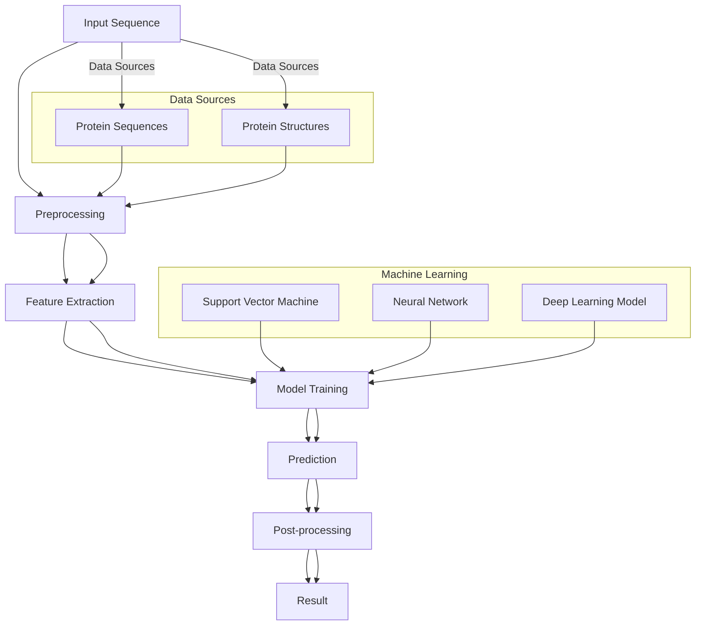

                 

Sure, let's start with the introduction to the book "AI-driven Protein Folding Prediction: From Sequence to Structure." We'll lay out the background, the importance of the topic, and the structure of the book.

---

# AI-driven Protein Folding Prediction: From Sequence to Structure

## Introduction

Proteins are fundamental building blocks of life, responsible for a wide range of biological functions. Their unique three-dimensional structures determine their function, and any deviation from the correct structure can lead to disease. Protein folding prediction, the process of determining the structure of a protein from its amino acid sequence, is crucial for understanding protein function and disease mechanisms.

### The Importance of Protein Folding Prediction

Protein folding prediction is essential for several reasons:

1. **Understanding Protein Function**: The structure of a protein dictates its function. Accurate prediction of protein structures helps in understanding how proteins interact with each other and with small molecules.

2. **Disease Research**: Many diseases are caused by protein misfolding, such as Alzheimer's disease and cystic fibrosis. Predicting protein structures can help in the development of new drugs to correct misfolding or inhibit harmful interactions.

3. **Drug Discovery**: Protein structures are critical for designing new drugs that can target specific proteins. Accurate folding predictions can guide the design of small molecules that interact with proteins in specific ways.

4. **Biotechnology and Engineering**: Knowledge of protein structures is vital in biotechnology and engineering applications, such as the design of new materials and the creation of bio-inspired machines.

### Structure of the Book

The book "AI-driven Protein Folding Prediction: From Sequence to Structure" is organized into five main parts:

1. **Part I: Fundamental Concepts and Principles** - This section provides an overview of the basic concepts and principles of protein folding and AI-driven approaches in biology.

2. **Part II: Algorithm and Methodology** - This section delves into the core algorithms and methodologies used in AI-driven protein folding prediction, including machine learning and deep learning techniques.

3. **Part III: Data Preparation and Analysis** - This section covers the importance of data preparation, the analysis of large-scale biological data, and the integration of diverse data sources.

4. **Part IV: Experimental Results and Applications** - This section presents experimental results and applications of AI-driven protein folding prediction, with case studies and practical examples.

5. **Part V: Future Directions and Challenges** - This final section discusses the future of AI-driven protein folding prediction, potential challenges, and areas for further research.

In conclusion, "AI-driven Protein Folding Prediction: From Sequence to Structure" aims to provide a comprehensive guide to understanding and applying AI in protein folding prediction. The book is intended for researchers, students, and practitioners in the fields of biology, computer science, and bioinformatics.

---

This is the initial section of our book. In the next sections, we will expand on each part, providing detailed explanations, algorithms, and examples. Let's move on to the first part, where we'll discuss the fundamental concepts and principles of protein folding and AI-driven approaches.

---

# 关键词

- 蛋白质折叠预测
- 人工智能
- 深度学习
- 生物信息学
- 序列结构映射
- 蛋白质结构功能
- 药物设计
- 疾病研究
- 数据分析
- 算法原理
- 机器学习
- 模型训练
- 实验结果

---

# 摘要

本文旨在探讨人工智能（AI）在蛋白质折叠预测领域的应用，从序列到结构的全过程。蛋白质折叠预测对于理解蛋白质功能和疾病机制具有重要意义。本文首先介绍了蛋白质折叠的基本概念和原理，以及AI在生物学中的应用。接着，详细阐述了AI驱动蛋白质折叠预测的核心算法和方法，包括机器学习和深度学习技术。此外，本文还探讨了数据准备和分析的重要性，以及实验结果和应用实例。最后，本文对AI驱动蛋白质折叠预测的未来方向和挑战进行了展望。通过本文，读者可以全面了解AI在蛋白质折叠预测领域的最新进展和应用。

---

We have now set the stage with the introduction and summary. Let's proceed to the first part of the book, where we will delve into the fundamental concepts and principles of protein folding and AI-driven approaches. This will include a discussion on the importance of protein structures, the challenges in protein folding prediction, and an overview of AI applications in biology.

---

## Part I: Fundamental Concepts and Principles

### 1. The Importance of Protein Folding Prediction

Proteins are composed of long chains of amino acids, which fold into complex three-dimensional structures. The structure of a protein determines its function, and any deviation from the correct structure can have significant biological consequences. For example, misfolded proteins are associated with many diseases, including Alzheimer's, Parkinson's, and cystic fibrosis. Therefore, predicting the correct structure of a protein from its amino acid sequence is crucial for understanding protein function and disease mechanisms.

#### 1.1 Protein Structure and Function

Proteins can be categorized into four levels of structure:

1. **Primary Structure**: The sequence of amino acids in the protein.
2. **Secondary Structure**: Local folding patterns, such as alpha helices and beta sheets.
3. **Tertiary Structure**: The overall three-dimensional shape of the protein.
4. **Quaternary Structure**: The arrangement of multiple protein subunits in a multi-subunit protein.

The primary structure dictates the tertiary structure, which in turn determines the function of the protein. For example, enzymes have specific active sites that allow them to catalyze chemical reactions. The correct folding of the enzyme is essential for its function.

#### 1.2 Challenges in Protein Folding Prediction

Predicting the structure of a protein from its amino acid sequence is a challenging problem. Here are some of the main challenges:

1. **Complexity of Protein Structures**: Proteins can have complex and diverse structures, making it difficult to predict their folding patterns accurately.
2. **Sequence Divergence**: Even proteins with similar sequences can fold into significantly different structures, making it difficult to infer the structure of an unknown protein from known structures.
3. **Computational Resources**: Accurate protein structure prediction requires significant computational resources, especially for large-scale folding problems.
4. **Ambiguity in Data**: Experimental data on protein structures can be incomplete or noisy, making it difficult to use in prediction algorithms.

### 2. Overview of AI Applications in Biology

Artificial intelligence, particularly machine learning and deep learning, has revolutionized many fields, including biology. AI-driven approaches have been successfully applied to various biological problems, such as genomics, drug discovery, and protein structure prediction.

#### 2.1 Machine Learning and Deep Learning in Biology

Machine learning algorithms have been used in biology for tasks such as classification, regression, and clustering. For example, supervised learning algorithms can be trained to classify genes based on their expression patterns. Deep learning, a subset of machine learning that uses neural networks with many layers, has been particularly successful in image recognition and natural language processing. In biology, deep learning has been used for tasks such as protein structure prediction, gene regulation analysis, and drug discovery.

#### 2.2 AI-driven Approaches in Protein Folding

AI-driven approaches have been applied to protein folding prediction in several ways:

1. **Homology Modeling**: This approach uses the structure of a known protein with a similar sequence to predict the structure of an unknown protein. AI algorithms can be used to identify similar proteins and refine the model.
2. **Ab Initio Folding**: This approach predicts the structure of a protein from its sequence without relying on any known protein structures. AI algorithms, such as deep learning models, have shown promise in ab initio folding.
3. **Data-Driven Approaches**: These approaches use large-scale biological data, such as protein sequences and structures, to train AI models. These models can then be used to predict the structures of new proteins.

### 3. Basic Concepts of AI-driven Protein Folding Prediction

AI-driven protein folding prediction involves several key concepts and techniques. Here, we'll discuss the following:

1. **Sequence-Structure Mapping**: This concept involves mapping the amino acid sequence of a protein to its three-dimensional structure.
2. **Homology Modeling**: This technique uses the structure of a known protein with a similar sequence to predict the structure of an unknown protein.
3. **Ab Initio Folding**: This approach predicts the structure of a protein from its sequence without relying on any known protein structures.
4. **Data-Driven Approaches**: These approaches use large-scale biological data to train AI models for protein folding prediction.

#### 3.1 Sequence-Structure Mapping

Sequence-structure mapping is the process of determining how the amino acid sequence of a protein relates to its three-dimensional structure. This relationship is crucial for protein folding prediction. Machine learning algorithms, such as support vector machines (SVM) and neural networks, have been used to map sequences to structures. These algorithms learn from large datasets of known protein structures to make predictions for new sequences.

#### 3.2 Homology Modeling

Homology modeling is a technique that uses the structure of a known protein with a similar sequence to predict the structure of an unknown protein. This approach relies on the principle that proteins with similar sequences often have similar structures. AI algorithms can be used to identify similar proteins and refine the model. Techniques such as template-based modeling and threading have been used to improve the accuracy of homology modeling.

#### 3.3 Ab Initio Folding

Ab initio folding is an approach that predicts the structure of a protein from its sequence without relying on any known protein structures. This is a challenging problem, as proteins can have diverse and complex structures. AI algorithms, particularly deep learning models, have shown promise in ab initio folding. Techniques such as recursive neural networks and generative adversarial networks have been used to improve the accuracy of ab initio folding predictions.

#### 3.4 Data-Driven Approaches

Data-driven approaches use large-scale biological data, such as protein sequences and structures, to train AI models for protein folding prediction. These models can then be used to predict the structures of new proteins. Techniques such as transfer learning and meta-learning have been used to improve the performance of data-driven approaches.

### 4. Core Principles of AI-driven Protein Folding Prediction

The core principles of AI-driven protein folding prediction involve the following:

1. **Machine Learning Algorithms**: These algorithms learn from data to make predictions. Common algorithms include support vector machines, neural networks, and recursive neural networks.
2. **Deep Learning Models**: These models use neural networks with many layers to learn complex patterns in data. Techniques such as convolutional neural networks and recurrent neural networks have been used in protein folding prediction.
3. **Data-Driven Approaches**: These approaches rely on large-scale biological data to train AI models. Techniques such as transfer learning and meta-learning have been used to improve the performance of data-driven approaches.

#### 4.1 Machine Learning Algorithms

Machine learning algorithms play a crucial role in protein folding prediction. Support vector machines (SVM) are a popular choice for sequence-structure mapping, as they can efficiently classify sequences based on their structural properties. Neural networks, particularly deep learning models, have also been used successfully in protein folding prediction.

#### 4.2 Deep Learning Models

Deep learning models have revolutionized many fields, including biology. Convolutional neural networks (CNN) and recurrent neural networks (RNN) are two types of deep learning models that have been used in protein folding prediction. CNNs are particularly effective for tasks involving spatial data, such as protein structure prediction. RNNs, on the other hand, are effective for tasks involving sequential data, such as sequence-structure mapping.

#### 4.3 Data-Driven Approaches

Data-driven approaches rely on large-scale biological data to train AI models for protein folding prediction. These approaches are especially powerful when combined with deep learning models. Techniques such as transfer learning and meta-learning have been used to improve the performance of data-driven approaches. Transfer learning involves using pre-trained models on related tasks to improve the performance on new tasks. Meta-learning involves learning how to learn, allowing models to quickly adapt to new tasks.

### 5. Mermaid Diagram of AI-driven Protein Folding Prediction System

To better understand the components and interactions in an AI-driven protein folding prediction system, we can use a Mermaid diagram. The following is a simplified version of such a diagram:

This diagram shows the main components of an AI-driven protein folding prediction system, including input sequence preprocessing, feature extraction, model training, prediction, and post-processing. The machine learning components, such as support vector machines, neural networks, and deep learning models, are also included. The data sources, such as protein sequences and structures, are shown as inputs to the system.

### 6. Connection between Core Concepts

The core concepts of AI-driven protein folding prediction are interconnected and play crucial roles in the prediction process. Here, we discuss the relationships between these concepts:

1. **Sequence Data**: Sequence data is the primary input for protein folding prediction. The quality and completeness of the sequence data directly impact the accuracy of the prediction.
2. **Structure Data**: Structure data, such as known protein structures, is used for training and validation of prediction models. This data helps in establishing the relationship between sequences and structures.
3. **Machine Learning Algorithms**: Machine learning algorithms learn from sequence and structure data to make predictions. These algorithms are essential for mapping sequences to structures and training models.
4. **Deep Learning Models**: Deep learning models are particularly powerful for protein folding prediction, as they can learn complex patterns from large-scale biological data. These models are often used in conjunction with machine learning algorithms.
5. **Data-Driven Approaches**: Data-driven approaches rely on large-scale biological data to train models. These approaches are effective when combined with deep learning models and machine learning algorithms.

### 7. Summary of Part I

In this part, we have discussed the fundamental concepts and principles of protein folding prediction and AI-driven approaches in biology. We have explored the importance of protein folding prediction, the challenges in the field, and the role of AI in addressing these challenges. We have also discussed the core principles of AI-driven protein folding prediction, including sequence-structure mapping, homology modeling, ab initio folding, and data-driven approaches. Additionally, we have presented a Mermaid diagram of an AI-driven protein folding prediction system and discussed the relationships between the core concepts. In the next part, we will delve into the algorithms and methodologies used in AI-driven protein folding prediction.

---

In this first part, we have laid the foundation for understanding AI-driven protein folding prediction. We have covered the importance of protein folding, the challenges in predicting protein structures, and the role of AI in overcoming these challenges. We have also provided an overview of the core concepts and principles involved in AI-driven protein folding prediction. In the next part, we will explore the algorithms and methodologies used in this field in more detail. We will discuss specific machine learning algorithms, deep learning models, and data-driven approaches that are commonly used in protein folding prediction. Let's move forward and delve into these advanced topics.

