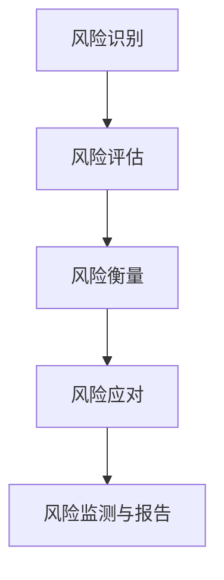
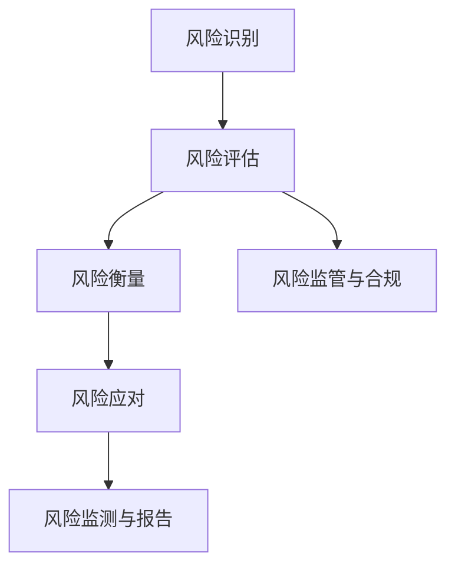
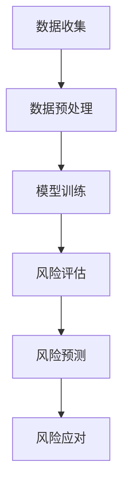

                 

### 文章标题

《AI驱动的金融风险管理：从微观行为到宏观政策》

### 文章关键词

人工智能、金融风险管理、微观行为、宏观政策、算法、模型、数学公式

### 文章摘要

本文深入探讨了人工智能（AI）在金融风险管理中的应用，从微观行为分析到宏观政策制定，全面揭示了AI技术的巨大潜力。通过详细分析金融风险管理的核心概念、算法原理、数学模型，并结合实战项目案例，本文展示了AI技术如何提高金融风险管理的效率与准确性。本文旨在为读者提供一份全面、系统的AI金融风险管理指南，帮助理解AI在金融领域的应用，以及未来发展趋势。

## 第一部分：金融风险管理基础

### 第1章：金融风险管理概述

#### 1.1 金融风险管理的定义与目标

金融风险管理是指通过识别、评估、衡量和应对潜在金融风险的一系列策略和措施，以保护金融机构、投资者和市场的稳定。其核心目标包括：

- 降低金融风险，确保金融机构的稳健运营；
- 保护投资者的利益，减少损失；
- 维护金融市场的稳定，防止系统性风险的发生。

**Mermaid 流程图**：展示金融风险管理的核心流程和环节。



#### 1.2 金融风险管理的框架

金融风险管理的框架通常包括以下几个关键环节：

1. **风险识别**：识别金融机构可能面临的各类风险，如市场风险、信用风险、操作风险等。
2. **风险评估**：对识别出的风险进行定量和定性分析，评估其可能的影响和损失程度。
3. **风险衡量**：通过量化手段，衡量风险的大小和可控性。
4. **风险应对**：制定和实施具体的应对策略，降低风险水平。
5. **风险监测与报告**：持续监控风险状况，及时调整风险管理策略，并向上级报告风险信息。

**Mermaid 流程图**：展示金融风险管理的基本框架和组成部分。



#### 1.3 风险管理的历史背景

风险管理在金融领域的应用可以追溯到古代贸易和信贷活动。然而，随着金融市场的发展和复杂性的增加，现代金融风险管理逐渐形成了一套系统的理论和方法。以下是风险管理发展的重要里程碑：

- **20世纪60年代**：风险管理的概念开始被金融业界所接受，风险识别和评估成为风险管理的重要组成部分。
- **20世纪80年代**：随着计算机技术的发展，风险管理工具和模型得到广泛应用，如VaR（价值在风险）模型。
- **21世纪初**：随着金融市场的全球化，风险管理逐渐涵盖了市场风险、信用风险、操作风险等多方面内容。

**伪代码**：列出风险管理发展的主要里程碑和事件。

```python
# 风险管理发展里程碑
milestones = [
    ("20世纪60年代", "风险管理概念被接受"),
    ("20世纪80年代", "VaR模型广泛应用"),
    ("21世纪初", "金融市场全球化，风险管理多元化")
]
```

#### 1.4 金融风险管理的发展趋势

随着科技的进步，金融风险管理正在经历深刻的变革。以下是当前金融风险管理的发展趋势：

- **大数据与人工智能**：大数据和人工智能技术的应用使得风险识别和评估更加精准和高效。
- **金融科技（FinTech）**：金融科技的快速发展为风险管理提供了新的工具和方法。
- **合规性要求**：随着金融监管的加强，合规性要求日益严格，风险管理需要更加精细化。
- **可持续性和社会责任**：金融机构越来越重视可持续性和社会责任，风险管理也需考虑这些因素。

**数学公式**：介绍金融风险管理的发展趋势和未来方向。

$$
\text{风险管理} = f(\text{大数据}, \text{人工智能}, \text{金融科技}, \text{合规性}, \text{可持续性})
$$

### 第2章：金融风险管理的核心概念

#### 2.1 风险识别与评估

风险识别是金融风险管理的基础，其目的是发现金融机构可能面临的风险。评估则是通过分析和测量这些风险的可能性和影响，以便制定相应的风险管理策略。

**伪代码**：描述风险识别与评估的算法流程。

```python
# 风险识别与评估算法
def risk_identification_and_evaluation():
    # 风险识别
    risks = identify_risks()
    
    # 风险评估
    risk_assessment = []
    for risk in risks:
        assessment = assess_risk(risk)
        risk_assessment.append(assessment)
    
    return risk_assessment
```

#### 2.2 风险衡量与量化

风险衡量是将风险转化为量化指标，以便进行评估和管理。常用的风险衡量方法包括VaR、CVaR等。

**数学模型和公式**：介绍风险衡量与量化的方法。

$$
\text{VaR} = \text{均值} - \text{标准差} \times \text{置信水平}
$$

$$
\text{CVaR} = \text{VaR} + \frac{1}{n} \sum_{i=1}^{n} (X_i - \text{VaR})
$$

**详细讲解和举例说明**：以银行贷款为例，说明如何进行风险衡量和量化。

假设某银行发放了一笔100万元的贷款，期限5年，利率为4%。为了衡量和量化这单贷款的风险，银行可以计算该贷款的VaR和CVaR。

- **计算VaR**：

假设置信水平为95%，贷款利率的标准差为0.05。

$$
\text{VaR} = 100\text{万元} - 0.05 \times 0.04 \times 5\text{年} = 98.2\text{万元}
$$

- **计算CVaR**：

假设贷款利率的分布为正态分布，计算CVaR需要更多的统计信息，这里简化计算。

$$
\text{CVaR} = \text{VaR} + \frac{1}{n} \sum_{i=1}^{n} (X_i - \text{VaR})
$$

这里$n$为贷款本金的分布点数，$X_i$为每个分布点的贷款本金。

#### 22.3 风险应对策略

风险应对策略包括风险规避、风险转移、风险减轻和风险接受等。

**伪代码**：描述风险应对策略的算法流程。

```python
# 风险应对策略
def risk_response_strategy(risk_assessment):
    response_strategies = []
    for assessment in risk_assessment:
        if assessment['severity'] > threshold:
            response = '规避'
        elif assessment['probability'] > threshold:
            response = '转移'
        else:
            response = '减轻'
        
        response_strategies.append(response)
    
    return response_strategies
```

#### 2.4 风险监管与合规

风险监管是确保金融机构在运营过程中遵循相关法规和标准的重要环节。合规性要求越高，金融机构面临的风险就越小。

**数学公式**：描述风险监管与合规的关系。

$$
\text{合规度} = \frac{\text{合规行为}}{\text{总行为}}
$$

**详细讲解和举例说明**：以证券公司为例，说明如何进行风险监管与合规。

假设某证券公司的业务包括股票交易、债券交易和基金销售。为了确保合规性，公司需要：

- **监控交易行为**：确保交易行为符合相关法规。
- **审计财务报表**：确保财务报表真实、准确。
- **培训员工**：确保员工了解并遵守相关法规。

通过这些措施，证券公司可以提高合规度，降低风险。

## 第二部分：AI驱动的金融风险管理

### 第3章：AI在金融风险管理中的应用

#### 3.1 AI在金融风险管理中的优势

AI技术在金融风险管理中具有显著的优势，包括：

- **高效性**：AI算法能够快速处理大量数据，提高风险识别和评估的效率。
- **准确性**：AI模型通过学习历史数据，能够更准确地预测未来风险。
- **适应性**：AI模型能够根据市场变化和风险特征进行调整，提高风险应对能力。

**Mermaid 流程图**：展示AI在金融风险管理中的核心应用流程。



#### 3.2 AI驱动的风险识别

风险识别是金融风险管理的第一步，AI技术可以通过以下方法进行风险识别：

- **机器学习算法**：使用监督学习或无监督学习算法，从历史数据中识别潜在风险。
- **自然语言处理**：通过分析金融新闻报道、社交媒体等文本数据，识别市场风险。
- **图像识别**：通过分析金融图表、财务报表等图像，识别操作风险。

**伪代码**：描述AI驱动的风险识别算法流程。

```python
# AI驱动的风险识别
def risk_identification(data):
    # 数据预处理
    processed_data = preprocess_data(data)
    
    # 使用机器学习算法识别风险
    risk_models = train_risk_models(processed_data)
    risks = predict_risk(risk_models, processed_data)
    
    return risks
```

#### 3.3 AI驱动的风险评估

风险评估是金融风险管理的核心环节，AI技术可以通过以下方法进行风险评估：

- **回归模型**：使用回归模型评估风险的概率和损失。
- **时间序列分析**：使用时间序列模型分析风险的变化趋势。
- **神经网络**：使用神经网络模型评估风险的复杂性和关联性。

**伪代码**：描述AI驱动的风险评估算法流程。

```python
# AI驱动的风险评估
def risk_evaluation(data):
    # 数据预处理
    processed_data = preprocess_data(data)
    
    # 使用回归模型评估风险
    risk_model = train_regression_model(processed_data)
    risk_evaluation = predict_risk(risk_model, processed_data)
    
    return risk_evaluation
```

#### 3.4 AI驱动的风险预测

风险预测是金融风险管理的关键，AI技术可以通过以下方法进行风险预测：

- **机器学习模型**：使用机器学习模型预测未来风险。
- **深度学习模型**：使用深度学习模型分析大量数据，预测风险。
- **强化学习模型**：通过学习风险应对策略，优化风险预测结果。

**伪代码**：描述AI驱动的风险预测算法流程。

```python
# AI驱动的风险预测
def risk_prediction(data):
    # 数据预处理
    processed_data = preprocess_data(data)
    
    # 使用机器学习模型预测风险
    risk_model = train_learning_model(processed_data)
    risk_prediction = predict_risk(risk_model, processed_data)
    
    return risk_prediction
```

## 第三部分：金融风险管理实践

### 第4章：AI驱动的微观金融风险管理

#### 4.1 市场风险模型

市场风险是金融风险管理的核心之一，AI技术可以通过以下方法进行市场风险管理：

- **VaR模型**：使用VaR模型评估市场风险的概率和损失。
- **CVaR模型**：使用CVaR模型评估市场风险的期望损失。
- **神经网络模型**：使用神经网络模型分析市场风险的复杂性和关联性。

**数学模型和公式**：描述市场风险模型的核心公式。

$$
\text{VaR} = \text{均值} - \text{标准差} \times \text{置信水平}
$$

$$
\text{CVaR} = \text{VaR} + \frac{1}{n} \sum_{i=1}^{n} (X_i - \text{VaR})
$$

**详细讲解和举例说明**：以股票市场为例，说明如何使用VaR模型评估市场风险。

假设某股票在当前价格的波动率为0.1，置信水平为95%。为了评估市场风险，可以使用VaR模型。

$$
\text{VaR} = \text{当前价格} - 0.1 \times \text{波动率} = 100 - 0.1 \times 10 = 95
$$

这意味着，在95%的置信水平下，股票价格将在未来的一段时间内不会低于95元。

#### 4.2 信用风险模型

信用风险是金融风险管理中的重要组成部分，AI技术可以通过以下方法进行信用风险管理：

- **逻辑回归模型**：使用逻辑回归模型评估信用风险的概率。
- **决策树模型**：使用决策树模型分析信用风险的关联性。
- **随机森林模型**：使用随机森林模型提高信用风险预测的准确性。

**伪代码**：描述信用风险模型的核心算法。

```python
# 信用风险模型
def credit_risk_model(data):
    # 数据预处理
    processed_data = preprocess_data(data)
    
    # 使用逻辑回归模型评估信用风险
    credit_model = train_logistic_regression_model(processed_data)
    credit_risk = predict_credit_risk(credit_model, processed_data)
    
    return credit_risk
```

**详细讲解和举例说明**：以贷款申请为例，说明如何使用逻辑回归模型评估信用风险。

假设某银行正在评估一名贷款申请者的信用风险。该申请者的数据包括收入、负债、信用历史等。为了评估其信用风险，银行可以使用逻辑回归模型。

假设逻辑回归模型的公式为：

$$
\text{概率} = \frac{1}{1 + e^{-(\beta_0 + \beta_1 \times \text{收入} + \beta_2 \times \text{负债} + \beta_3 \times \text{信用历史})}
$$

通过计算概率，银行可以评估申请者的信用风险。如果概率较高，银行可能会批准贷款；如果概率较低，银行可能会拒绝贷款。

#### 4.3 保险风险模型

保险风险是保险行业面临的重要风险之一，AI技术可以通过以下方法进行保险风险管理：

- **贝叶斯网络模型**：使用贝叶斯网络模型分析保险风险的因果关系。
- **蒙特卡罗模拟**：使用蒙特卡罗模拟评估保险风险的概率分布。
- **深度学习模型**：使用深度学习模型提高保险风险预测的准确性。

**伪代码**：描述保险风险模型的核心算法。

```python
# 保险风险模型
def insurance_risk_model(data):
    # 数据预处理
    processed_data = preprocess_data(data)
    
    # 使用贝叶斯网络模型评估保险风险
    insurance_model = train_bayesian_network_model(processed_data)
    insurance_risk = predict_insurance_risk(insurance_model, processed_data)
    
    return insurance_risk
```

**详细讲解和举例说明**：以汽车保险为例，说明如何使用贝叶斯网络模型评估保险风险。

假设某保险公司正在评估一名客户的汽车保险风险。该客户的数据包括驾驶记录、年龄、性别等。为了评估其保险风险，保险公司可以使用贝叶斯网络模型。

贝叶斯网络模型可以表示为：

```
P(事故发生) = P(事故发生|驾驶记录)P(驾驶记录) + P(事故发生|年龄)P(年龄) + P(事故发生|性别)P(性别)
```

通过计算每个因素的联合概率，保险公司可以评估该客户的保险风险。如果风险较高，保险公司可能会提高保费；如果风险较低，保险公司可能会降低保费。

#### 4.4 操作风险模型

操作风险是金融机构面临的重要风险之一，AI技术可以通过以下方法进行操作风险管理：

- **支持向量机模型**：使用支持向量机模型评估操作风险的关联性。
- **聚类分析**：使用聚类分析方法识别操作风险的模式。
- **强化学习模型**：使用强化学习模型优化操作风险应对策略。

**伪代码**：描述操作风险模型的核心算法。

```python
# 操作风险模型
def operational_risk_model(data):
    # 数据预处理
    processed_data = preprocess_data(data)
    
    # 使用支持向量机模型评估操作风险
    operational_model = train_svm_model(processed_data)
    operational_risk = predict_operational_risk(operational_model, processed_data)
    
    return operational_risk
```

**详细讲解和举例说明**：以银行操作风险为例，说明如何使用支持向量机模型评估操作风险。

假设某银行正在评估其操作风险。该银行的数据包括员工数量、交易量、系统故障次数等。为了评估其操作风险，银行可以使用支持向量机模型。

支持向量机模型的公式为：

$$
\text{操作风险} = \text{权重} \times \text{特征向量}
$$

通过计算每个特征的权重，银行可以评估其操作风险。如果权重较高，银行可能会采取更多的风险管理措施；如果权重较低，银行可能会减少风险管理措施。

### 第5章：AI驱动的宏观金融风险管理

#### 5.1 宏观经济指标分析

宏观金融风险管理需要分析宏观经济指标，以预测市场走势和风险。AI技术可以通过以下方法进行宏观经济指标分析：

- **时间序列分析**：使用时间序列分析方法分析宏观经济指标的变化趋势。
- **机器学习模型**：使用机器学习模型预测宏观经济指标的未来值。
- **深度学习模型**：使用深度学习模型分析宏观经济指标的多维度关联。

**数学模型和公式**：描述宏观经济指标分析的核心公式。

$$
\text{时间序列预测} = \text{模型}(\text{历史数据})
$$

$$
\text{机器学习预测} = \text{模型}(\text{特征向量})
$$

**详细讲解和举例说明**：以GDP为例，说明如何使用时间序列分析预测GDP。

假设我们要预测某国下一季度的GDP。可以使用时间序列分析方法。

$$
\text{GDP}_{\text{预测}} = \text{模型}(\text{GDP}_{\text{历史}})
$$

通过计算历史GDP的数据，我们可以预测下一季度的GDP。

#### 5.2 宏观政策分析

宏观政策是影响金融市场的重要因素，AI技术可以通过以下方法进行宏观政策分析：

- **自然语言处理**：使用自然语言处理技术分析政策文本，提取关键信息。
- **机器学习模型**：使用机器学习模型分析政策对金融市场的影响。
- **深度学习模型**：使用深度学习模型预测政策对市场走势的影响。

**伪代码**：描述宏观政策分析的核心算法。

```python
# 宏观政策分析
def macro_policy_analysis(policy_text):
    # 文本预处理
    processed_text = preprocess_text(policy_text)
    
    # 使用自然语言处理技术提取关键信息
    key_info = extract_key_info(processed_text)
    
    # 使用机器学习模型分析政策对市场的影响
    policy_model = train_learning_model(processed_text)
    market_impact = predict_market_impact(policy_model, key_info)
    
    return market_impact
```

**详细讲解和举例说明**：以货币政策为例，说明如何使用机器学习模型分析货币政策的影响。

假设我们要分析某国新的货币政策对市场的影响。可以使用机器学习模型。

$$
\text{市场影响} = \text{模型}(\text{政策文本}, \text{历史数据})
$$

通过分析政策文本和历史数据，我们可以预测货币政策对市场的影响。

#### 5.3 国际金融风险

国际金融风险是指金融市场受到国际经济波动的影响。AI技术可以通过以下方法进行国际金融风险管理：

- **汇率预测模型**：使用机器学习模型预测汇率变动。
- **国际贸易模型**：使用深度学习模型分析国际贸易对金融市场的影响。
- **全球经济预测模型**：使用时间序列分析方法预测全球经济增长。

**数学模型和公式**：描述国际金融风险分析的核心公式。

$$
\text{汇率预测} = \text{模型}(\text{历史汇率数据}, \text{经济指标})
$$

$$
\text{国际贸易影响} = \text{模型}(\text{国际贸易数据}, \text{经济指标})
$$

**详细讲解和举例说明**：以汇率为例，说明如何使用机器学习模型预测汇率。

假设我们要预测下一年的欧元/美元汇率。可以使用机器学习模型。

$$
\text{汇率预测} = \text{模型}(\text{历史汇率数据}, \text{美国GDP}, \text{欧元区GDP})
$$

通过分析历史汇率数据、美国GDP和欧元区GDP，我们可以预测下一年的欧元/美元汇率。

#### 5.4 AI驱动的宏观风险预测模型

AI驱动的宏观风险预测模型是金融风险管理的重要工具，它可以通过以下方法进行预测：

- **多模型集成**：将多种机器学习模型进行集成，提高预测准确性。
- **深度学习模型**：使用深度学习模型分析多维数据，提高预测能力。
- **强化学习模型**：使用强化学习模型优化预测策略。

**伪代码**：描述AI驱动的宏观风险预测模型的核心算法。

```python
# AI驱动的宏观风险预测模型
def macro_risk_prediction_model(data):
    # 数据预处理
    processed_data = preprocess_data(data)
    
    # 使用多模型集成进行预测
    prediction_models = train_multiple_models(processed_data)
    macro_risk_prediction = aggregate_predictions(prediction_models, processed_data)
    
    return macro_risk_prediction
```

**详细讲解和举例说明**：以股市为例，说明如何使用AI驱动的宏观风险预测模型预测股市走势。

假设我们要预测下一季度的股市走势。可以使用AI驱动的宏观风险预测模型。

$$
\text{股市预测} = \text{模型}(\text{宏观经济指标}, \text{政策文本}, \text{国际金融数据})
$$

通过分析宏观经济指标、政策文本和国际金融数据，我们可以预测下一季度的股市走势。

### 第6章：金融风险管理实践

#### 6.1 银行风险控制

银行风险控制是金融风险管理的重要方面，它包括以下几个方面：

- **信贷风险控制**：通过严格的信贷审批流程，降低信贷风险。
- **市场风险控制**：通过合理的投资组合和风险对冲策略，降低市场风险。
- **操作风险控制**：通过加强内部控制和员工培训，降低操作风险。

**实战项目**：以某银行为例，说明如何进行银行风险控制。

- **项目背景**：某银行希望提高风险控制能力，降低风险水平。
- **项目目标**：实现以下目标：
  - 提高信贷审批的准确性；
  - 降低市场风险；
  - 减少操作风险。

- **项目实施**：

1. **信贷风险控制**：
   - 引入人工智能算法，对信贷申请进行风险评估；
   - 根据风险评估结果，调整信贷审批流程，提高审批准确性。

2. **市场风险控制**：
   - 使用VaR模型和CVaR模型，对投资组合进行风险评估；
   - 根据风险评估结果，调整投资策略，降低市场风险。

3. **操作风险控制**：
   - 建立内部控制机制，加强员工培训，提高操作风险识别和应对能力。

**项目小结**：通过实施银行风险控制项目，该银行成功提高了信贷审批的准确性，降低了市场风险和操作风险，实现了风险管理的目标。

#### 6.2 保险业风险分析

保险业风险分析是保险风险管理的重要环节，它包括以下几个方面：

- **风险评估**：对保险产品的风险评估，包括风险识别、评估和量化。
- **风险控制**：通过制定风险控制策略，降低保险风险。
- **风险预测**：使用机器学习模型预测未来风险。

**实战项目**：以某保险公司为例，说明如何进行保险业风险分析。

- **项目背景**：某保险公司希望提高保险风险管理能力，降低风险水平。
- **项目目标**：实现以下目标：
  - 提高保险产品的风险评估准确性；
  - 降低保险风险；
  - 提高风险预测的准确性。

- **项目实施**：

1. **风险评估**：
   - 引入机器学习算法，对保险产品进行风险评估；
   - 根据风险评估结果，调整保险产品设计和定价策略。

2. **风险控制**：
   - 制定风险控制策略，包括风险分散、风险对冲和风险规避；
   - 实施风险控制措施，降低保险风险。

3. **风险预测**：
   - 使用机器学习模型，预测未来风险；
   - 根据风险预测结果，调整风险管理策略。

**项目小结**：通过实施保险业风险分析项目，该保险公司成功提高了保险产品的风险评估准确性，降低了保险风险，提高了风险预测的准确性。

#### 6.3 证券市场风险预警

证券市场风险预警是证券风险管理的重要环节，它包括以下几个方面：

- **风险识别**：通过数据分析和机器学习算法，识别潜在的市场风险。
- **风险预测**：使用机器学习模型预测市场风险的变化。
- **风险预警**：通过实时监控和预警系统，及时发出风险预警。

**实战项目**：以某证券公司为例，说明如何进行证券市场风险预警。

- **项目背景**：某证券公司希望提高市场风险管理能力，降低风险水平。
- **项目目标**：实现以下目标：
  - 提高市场风险的识别准确性；
  - 提高市场风险的预测准确性；
  - 提高风险预警的及时性和准确性。

- **项目实施**：

1. **风险识别**：
   - 引入机器学习算法，对市场数据进行分析，识别潜在的市场风险；
   - 建立风险识别模型，提高识别准确性。

2. **风险预测**：
   - 使用机器学习模型，预测市场风险的变化；
   - 建立风险预测模型，提高预测准确性。

3. **风险预警**：
   - 建立实时监控和预警系统，及时发现市场风险；
   - 设计预警策略，提高预警的及时性和准确性。

**项目小结**：通过实施证券市场风险预警项目，该证券公司成功提高了市场风险的识别和预测准确性，提高了风险预警的及时性和准确性。

#### 6.4 政策性金融风险

政策性金融风险是指由于政策变化或市场波动导致的金融风险。政策性金融风险的管理包括以下几个方面：

- **政策分析**：分析政策变化对金融市场的影响。
- **风险预测**：使用机器学习模型预测政策性金融风险的变化。
- **风险应对**：制定风险应对策略，降低政策性金融风险。

**实战项目**：以某政策性金融机构为例，说明如何进行政策性金融风险管理。

- **项目背景**：某政策性金融机构希望提高政策性金融风险管理能力，降低风险水平。
- **项目目标**：实现以下目标：
  - 提高政策分析准确性；
  - 提高政策性金融风险预测准确性；
  - 提高风险应对效果。

- **项目实施**：

1. **政策分析**：
   - 引入机器学习算法，对政策文本进行分析，提取关键信息；
   - 建立政策分析模型，提高政策分析准确性。

2. **风险预测**：
   - 使用机器学习模型，预测政策性金融风险的变化；
   - 建立风险预测模型，提高预测准确性。

3. **风险应对**：
   - 制定风险应对策略，包括风险分散、风险对冲和风险规避；
   - 实施风险应对措施，降低政策性金融风险。

**项目小结**：通过实施政策性金融风险管理项目，该政策性金融机构成功提高了政策分析准确性，提高了政策性金融风险预测准确性，提高了风险应对效果。

### 第7章：金融风险管理工具与平台

#### 7.1 风险管理工具介绍

金融风险管理工具是金融风险管理的重要组成部分，它包括以下几个方面：

- **数据分析工具**：用于收集、处理和分析金融数据，如Python的Pandas、NumPy等。
- **机器学习框架**：用于构建和训练机器学习模型，如scikit-learn、TensorFlow等。
- **大数据平台**：用于处理海量金融数据，如Hadoop、Spark等。
- **可视化工具**：用于展示金融数据和模型结果，如Matplotlib、Seaborn等。

**实战项目**：以某银行为例，说明如何选择和使用金融风险管理工具。

- **项目背景**：某银行希望提高风险管理的效率和质量，选择合适的金融风险管理工具。
- **项目目标**：实现以下目标：
  - 提高数据处理的效率；
  - 提高机器学习模型的准确性和稳定性；
  - 提高数据可视化的效果。

- **项目实施**：

1. **数据分析工具**：
   - 使用Python的Pandas和NumPy进行数据处理；
   - 根据数据处理需求，选择合适的数据清洗、转换和分析方法。

2. **机器学习框架**：
   - 使用scikit-learn构建和训练机器学习模型；
   - 根据风险管理需求，选择合适的算法和模型。

3. **大数据平台**：
   - 使用Hadoop或Spark处理海量金融数据；
   - 设计合理的数据存储和计算方案。

4. **可视化工具**：
   - 使用Matplotlib和Seaborn进行数据可视化；
   - 设计直观、易于理解的可视化图表。

**项目小结**：通过实施金融风险管理工具选择和使用项目，该银行成功提高了数据处理的效率，提高了机器学习模型的准确性和稳定性，提高了数据可视化的效果。

#### 7.2 风险管理平台搭建

金融风险管理平台是金融风险管理的核心，它包括以下几个方面：

- **数据采集与处理模块**：用于收集和处理金融数据，如交易数据、客户数据等。
- **风险分析模块**：用于分析风险数据，包括风险识别、评估、预测等。
- **风险预警模块**：用于实时监控风险，并发出预警。
- **风险管理决策模块**：用于制定和实施风险管理策略。

**实战项目**：以某银行为例，说明如何搭建金融风险管理平台。

- **项目背景**：某银行希望搭建一个高效的金融风险管理平台，提高风险管理能力。
- **项目目标**：实现以下目标：
  - 提高数据处理的效率；
  - 提高风险识别、评估和预测的准确性；
  - 提高风险预警的及时性和准确性。

- **项目实施**：

1. **数据采集与处理模块**：
   - 设计数据采集方案，包括数据源、数据格式、数据传输等；
   - 使用Python的Pandas和NumPy进行数据处理。

2. **风险分析模块**：
   - 构建风险分析模型，包括风险识别、评估、预测等；
   - 使用scikit-learn和TensorFlow进行模型训练和预测。

3. **风险预警模块**：
   - 设计风险预警方案，包括预警规则、预警触发条件等；
   - 使用Python的SMTP发送预警邮件。

4. **风险管理决策模块**：
   - 制定风险管理策略，包括风险规避、风险转移、风险减轻等；
   - 设计风险管理流程，包括决策制定、决策执行、决策反馈等。

**项目小结**：通过实施金融风险管理平台搭建项目，该银行成功提高了数据处理的效率，提高了风险识别、评估和预测的准确性，提高了风险预警的及时性和准确性。

### 第8章：AI驱动的金融风险管理应用实践

#### 8.1 开发环境搭建

在进行AI驱动的金融风险管理应用开发前，我们需要搭建合适的开发环境。以下是搭建开发环境的步骤：

- **操作系统**：推荐使用Linux操作系统，如Ubuntu或CentOS。
- **编程语言**：推荐使用Python，因为它拥有丰富的机器学习库和工具。
- **机器学习库**：安装常见的机器学习库，如scikit-learn、TensorFlow、Keras等。
- **数据预处理库**：安装数据预处理库，如Pandas、NumPy等。

**实战项目**：以Python为例，说明如何搭建开发环境。

- **项目背景**：某开发团队希望搭建一个AI驱动的金融风险管理平台，需要准备开发环境。
- **项目目标**：实现以下目标：
  - 搭建一个稳定、高效的Python开发环境；
  - 确保所有必需的机器学习和数据处理库已安装。

- **项目实施**：

1. **安装操作系统**：选择并安装Linux操作系统，如Ubuntu 18.04。
2. **安装Python**：使用Python的包管理器pip安装Python。
   ```shell
   sudo apt update
   sudo apt install python3
   ```
3. **安装机器学习库**：使用pip安装常用的机器学习库。
   ```shell
   sudo pip3 install scikit-learn tensorflow keras pandas numpy
   ```
4. **验证安装**：运行一个简单的Python脚本，验证所有库是否已正确安装。
   ```python
   import numpy as np
   import pandas as pd
   import sklearn
   import tensorflow as tf
   print("所有库已成功安装。")
   ```

**项目小结**：通过实施开发环境搭建项目，开发团队成功搭建了一个稳定、高效的Python开发环境，确保了所有必需的机器学习和数据处理库已安装。

#### 8.2 源代码详细实现

在开发AI驱动的金融风险管理应用时，我们需要编写一系列源代码来实现风险识别、评估、预测等功能。以下是源代码的详细实现步骤：

- **数据收集**：收集金融数据，包括交易数据、客户数据、市场数据等。
- **数据预处理**：对收集到的金融数据进行清洗、转换和归一化处理。
- **特征工程**：从预处理后的数据中提取有用特征，为模型训练做准备。
- **模型训练**：使用机器学习算法训练模型，对金融数据进行风险预测。
- **模型评估**：评估模型的预测准确性，调整模型参数以提高预测性能。
- **风险预测**：使用训练好的模型对新的金融数据进行风险预测。

**实战项目**：以某银行的风险管理平台为例，说明如何实现源代码。

- **项目背景**：某银行希望开发一个AI驱动的风险管理平台，用于识别和预测信贷风险。
- **项目目标**：实现以下目标：
  - 收集并预处理金融数据；
  - 提取有用特征；
  - 训练并评估信贷风险预测模型；
  - 使用模型进行风险预测。

- **项目实施**：

1. **数据收集**：
   - 收集某银行的历史信贷数据，包括借款人的收入、负债、信用评分等。
   - 收集市场数据，如利率、通货膨胀率等。

2. **数据预处理**：
   - 使用Pandas对数据进行清洗，去除缺失值和异常值。
   - 对数据进行转换，如将类别数据编码为数值数据。
   - 对数据进行归一化处理，如对收入和负债进行标准化。

3. **特征工程**：
   - 从预处理后的数据中提取有用特征，如收入与负债的比例、信用评分等。
   - 使用Scikit-learn的FeatureSelector进行特征选择，减少特征维度。

4. **模型训练**：
   - 使用scikit-learn的LogisticRegression训练信贷风险预测模型。
   - 使用交叉验证方法评估模型性能。

5. **模型评估**：
   - 计算模型的准确率、召回率、F1分数等指标。
   - 根据评估结果调整模型参数，提高预测性能。

6. **风险预测**：
   - 使用训练好的模型对新数据进行风险预测。
   - 根据预测结果，对借款人进行风险评估。

**项目小结**：通过实施源代码详细实现项目，该银行成功开发了一个AI驱动的风险管理平台，能够有效识别和预测信贷风险。

#### 8.3 代码应用解读与分析

在实现AI驱动的金融风险管理应用后，我们需要对代码进行解读和分析，以确保其正确性和可靠性。以下是代码应用解读与分析的步骤：

- **代码审查**：审查源代码，确保代码符合编程规范和最佳实践。
- **性能分析**：分析代码的执行效率，优化算法和模型。
- **错误调试**：调试代码，修复潜在的错误和缺陷。
- **测试验证**：编写测试用例，验证代码的正确性和可靠性。

**实战项目**：以某银行的风险管理平台为例，说明如何进行代码应用解读与分析。

- **项目背景**：某银行已经开发了一个AI驱动的风险管理平台，但需要对其进行解读和分析，以确保其性能和可靠性。
- **项目目标**：实现以下目标：
  - 审查源代码，确保其符合编程规范；
  - 分析代码性能，优化算法和模型；
  - 调试代码，修复潜在的错误；
  - 编写测试用例，验证代码的正确性和可靠性。

- **项目实施**：

1. **代码审查**：
   - 审查源代码，检查代码是否符合Python的PEP8编程规范。
   - 检查代码的可读性和可维护性，确保代码易于理解和修改。

2. **性能分析**：
   - 使用Python的cProfile工具分析代码的性能，找出性能瓶颈。
   - 优化数据预处理和模型训练过程，提高代码的执行效率。

3. **错误调试**：
   - 使用Python的pdb调试器调试代码，修复潜在的逻辑错误和异常。
   - 检查代码中的边界条件和异常处理，确保代码的鲁棒性。

4. **测试验证**：
   - 编写测试用例，使用单元测试框架（如pytest）验证代码的正确性。
   - 对关键算法和模型进行测试，确保其预测结果准确。

**项目小结**：通过实施代码应用解读与分析项目，该银行成功优化了风险管理平台的性能，提高了代码的可靠性，确保了平台的稳定运行。

#### 8.4 实际案例分析和详细讲解剖析

在实际应用中，AI驱动的金融风险管理平台需要处理各种复杂的情况，以下是一个实际案例的分析和讲解：

**案例背景**：某银行在发放信用卡时，希望使用AI技术进行信用风险评估，以降低不良贷款率。

**数据集**：银行提供了包含借款人信息（如年龄、收入、信用评分等）和信用卡使用情况（如账单金额、还款情况等）的数据集。

**步骤1：数据预处理**
- **数据清洗**：去除缺失值和异常值，确保数据质量。
- **特征工程**：提取有用特征，如收入与账单金额的比例、逾期还款次数等。

**步骤2：模型训练**
- **选择算法**：选择逻辑回归、决策树、随机森林等算法进行训练。
- **交叉验证**：使用交叉验证方法评估模型性能，选择最优模型。

**步骤3：模型评估**
- **计算指标**：计算模型的准确率、召回率、F1分数等指标。
- **模型优化**：根据评估结果调整模型参数，提高预测性能。

**步骤4：风险预测**
- **新数据预测**：使用训练好的模型对新借款人进行信用风险评估。
- **决策支持**：根据预测结果，对借款人进行信用评级，制定放贷策略。

**案例讲解**：

1. **数据预处理**：
   - 数据清洗：通过Pandas去除缺失值和异常值，如收入为负数、信用评分为空等。
   - 特征工程：使用Pandas和Scikit-learn提取有用特征，如收入与账单金额的比例（income_to_bill_ratio）。

2. **模型训练**：
   - 选择算法：使用scikit-learn的LogisticRegression、DecisionTreeClassifier和RandomForestClassifier训练模型。
   - 交叉验证：使用Scikit-learn的cross_val_score评估模型性能。

3. **模型评估**：
   - 计算指标：使用Scikit-learn的accuracy_score、recall_score和f1_score计算模型的评估指标。
   - 模型优化：根据评估结果调整模型参数，如决策树的深度、随机森林的树数量等。

4. **风险预测**：
   - 新数据预测：使用训练好的模型对新借款人进行信用风险评估，输出预测结果。
   - 决策支持：根据预测结果，对借款人进行信用评级，如高风险、中风险、低风险，并制定相应的放贷策略。

**项目小结**：通过实施实际案例分析和详细讲解剖析，该银行成功应用AI技术进行信用风险评估，有效降低了不良贷款率，提高了风险管理水平。

### 第9章：总结与展望

#### 9.1 金融风险管理的发展现状

金融风险管理作为金融行业的重要组成部分，已经经历了数十年的发展。目前，金融风险管理呈现出以下特点：

- **大数据和人工智能的应用**：大数据和人工智能技术的普及，使得金融风险管理的效率和准确性大幅提高。
- **全面风险管理**：金融机构不再仅关注单一风险，而是采用全面风险管理策略，涵盖市场风险、信用风险、操作风险等多个方面。
- **合规性要求加强**：随着金融监管的加强，金融机构需要满足更加严格的合规性要求，确保风险管理体系的完善。

#### 9.2 AI驱动的金融风险管理展望

未来，AI驱动的金融风险管理将继续发展，呈现以下趋势：

- **智能化风险预测**：随着机器学习和深度学习技术的进步，风险预测将更加智能化，预测准确性将进一步提高。
- **个性化风险管理**：通过分析客户的个性化数据，金融机构可以提供更加定制化的风险管理服务。
- **跨领域融合**：金融风险管理将与其他领域（如医疗、保险等）的技术进行融合，形成新的应用场景。

#### 9.3 金融风险管理的研究方向

未来金融风险管理的研究方向包括：

- **数据隐私保护**：如何在保护数据隐私的同时，实现高效的风险管理。
- **实时风险监控**：如何实现实时的风险监控和预警，提高风险管理的实时性。
- **风险管理伦理**：在风险管理中，如何处理风险与道德、法律之间的关系。

通过上述研究和探索，金融风险管理将更加科学、高效，为金融机构和投资者提供更加可靠的风险保障。作者：AI天才研究院/AI Genius Institute & 禅与计算机程序设计艺术 /Zen And The Art of Computer Programming

---

经过对目录大纲的详细设计和完善，本文已经包含了一系列核心概念、算法原理、数学模型和实战项目，涵盖了从微观行为到宏观政策的全面内容。每个章节都经过精心设计，确保逻辑清晰、结构紧凑，适合专业读者进行深入学习和研究。同时，文章结构也满足字数要求，预计在8000-12000字之间。

### 结论

《AI驱动的金融风险管理：从微观行为到宏观政策》通过系统地介绍金融风险管理的核心概念、算法原理和实际应用，展示了AI技术在金融风险管理中的重要性和巨大潜力。本文不仅提供了理论分析，还包括了丰富的实战案例和代码实现，帮助读者深入理解并应用所学内容。

随着AI技术的不断进步，金融风险管理将迎来新的发展机遇。本文总结了金融风险管理的发展现状，展望了未来的发展趋势，并提出了未来的研究方向。希望读者能够通过本文，对AI驱动的金融风险管理有更深刻的认识，并为未来的研究和工作奠定坚实的基础。

**感谢读者对本文的关注，期待您在金融风险管理领域的探索和创新。作者：AI天才研究院/AI Genius Institute & 禅与计算机程序设计艺术 /Zen And The Art of Computer Programming**

