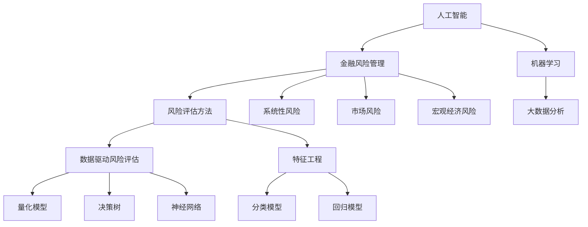

                 

### 文章标题：AI驱动的金融风险评估：从微观到宏观

> 关键词：人工智能，金融风险管理，风险评估方法，微观层面，中观层面，宏观层面，机器学习，大数据分析

> 摘要：本文深入探讨了人工智能在金融风险评估中的应用，从微观到宏观三个层面详细解析了AI驱动的金融风险评估方法。文章首先介绍了AI在金融风险管理中的角色和挑战，然后分别讲解了微观层面、中观层面和宏观层面的风险评估方法，并通过具体案例展示了AI在实际金融风险评估中的应用。最后，文章展望了未来AI驱动的金融风险评估发展趋势，提出了相应的最佳实践和注意事项。

### 背景介绍

在金融行业中，风险管理是确保金融机构稳健运营和投资者利益的重要环节。随着金融市场的日益复杂和波动，传统的风险评估方法已难以应对新的挑战。近年来，人工智能（AI）技术的飞速发展，为金融风险评估带来了新的机遇和挑战。AI驱动的金融风险评估方法具有高效性、准确性和实时性的特点，能够显著提升金融机构的风险管理水平。

金融风险评估可分为微观层面、中观层面和宏观层面。微观层面主要关注单个金融产品或金融主体的风险评估，如信贷风险评估、股票风险评估等。中观层面则涉及行业或市场层面的风险评估，如宏观经济风险、市场风险等。宏观层面则是对整个金融系统的风险评估，如系统性风险、金融危机等。

本文将围绕这三个层面，系统地介绍AI驱动的金融风险评估方法，旨在为金融从业者和研究者提供有价值的参考。

### 核心概念与联系

在探讨AI驱动的金融风险评估时，我们需要理解以下几个核心概念，并揭示它们之间的联系：

1. **人工智能（AI）**：一种模拟人类智能的技术，包括机器学习、深度学习、自然语言处理等子领域。

2. **金融风险管理**：金融机构为实现稳健运营和确保投资者利益，对潜在风险进行识别、评估、监控和应对的一系列管理活动。

3. **风险评估方法**：用于评估金融产品或金融主体风险的技术和工具，包括量化模型、决策树、神经网络等。

4. **数据驱动风险评估**：基于大量历史数据，通过机器学习算法生成风险预测模型的方法。

5. **特征工程**：在构建风险评估模型时，从原始数据中提取有效特征的过程，以提升模型性能。

6. **机器学习**：一种AI技术，通过从数据中学习规律，自动改进性能，用于分类、回归、聚类等多种任务。

7. **大数据分析**：处理和分析海量数据的技术，用于挖掘潜在价值，预测未来趋势。

核心概念之间的关系架构可以通过以下Mermaid流程图表示：



通过这个关系架构，我们可以清晰地看到人工智能技术在金融风险管理中的应用场景，以及各个核心概念之间的相互影响。

### 微观层面的AI驱动的风险评估方法

在微观层面，AI驱动的金融风险评估主要集中在单个金融产品或金融主体的风险识别和评估。以下将详细讲解几种常用的AI模型及其原理。

#### 线性回归模型

线性回归模型是一种常用的统计分析方法，用于预测一个或多个自变量与因变量之间的关系。其基本原理是通过最小二乘法拟合一条直线，使模型预测的误差最小。

伪代码如下：

```python
def linear_regression(x, y):
    n = len(x)
    x_mean = sum(x) / n
    y_mean = sum(y) / n

    Sxx = sum([xi - x_mean] ** 2 for xi in x)
    Sxy = sum([xi - x_mean] * [yi - y_mean] for xi, yi in zip(x, y)]

    b1 = Sxy / Sxx
    b0 = y_mean - b1 * x_mean

    return b0, b1
```

数学模型和公式：

$$
y = b_0 + b_1 \cdot x
$$

其中，$y$ 是因变量，$x$ 是自变量，$b_0$ 是截距，$b_1$ 是斜率。

#### 逻辑回归模型

逻辑回归模型用于处理分类问题，其基本原理是通过线性模型生成一个预测概率，然后通过阈值进行分类。

伪代码如下：

```python
def logistic_regression(x, y):
    n = len(x)
    x_mean = sum(x) / n
    y_mean = sum(y) / n

    Sxx = sum([xi - x_mean] ** 2 for xi in x)
    Sxy = sum([xi - x_mean] * [yi - y_mean] for xi, yi in zip(x, y)]

    b1 = Sxy / Sxx
    b0 = y_mean - b1 * x_mean

    return b0, b1
```

数学模型和公式：

$$
P(y=1) = \frac{1}{1 + e^{-(b_0 + b_1 \cdot x)}}
$$

其中，$P(y=1)$ 是因变量为1的概率，$e$ 是自然底数。

#### 决策树模型

决策树模型是一种基于树形决策结构的预测模型，通过一系列if-else条件判断，将数据划分为不同的区域，以实现分类或回归。

伪代码如下：

```python
def decision_tree(x, y):
    if x < threshold:
        return "Class A"
    else:
        return "Class B"
```

数学模型和公式：

$$
f(x) =
\begin{cases}
c_1, & \text{if } x < \theta_1 \\
c_2, & \text{if } x \ge \theta_1
\end{cases}
$$

其中，$c_1$ 和 $c_2$ 是决策树的分类结果，$\theta_1$ 是阈值。

#### 随机森林模型

随机森林模型是一种基于决策树构建的集成学习方法，通过组合多个决策树来提高模型的预测性能。

伪代码如下：

```python
def random_forest(x, y, n_trees):
    for i in range(n_trees):
        tree = build_decision_tree(x, y)
        prediction = tree.predict(x)
        total_predictions += prediction

    return majority_vote(total_predictions)
```

数学模型和公式：

$$
\hat{y} = \arg\max_{y} \sum_{i=1}^{n} w_i \cdot p(y_i | x_i)
$$

其中，$w_i$ 是决策树的权重，$p(y_i | x_i)$ 是决策树对样本 $x_i$ 的预测概率。

### 中观层面的AI驱动的风险评估方法

在中观层面，AI驱动的金融风险评估主要关注行业或市场层面的风险。以下将介绍时间序列分析方法和贝叶斯网络模型。

#### 时间序列分析方法

时间序列分析方法用于分析金融市场的历史数据，预测未来的价格走势。以下介绍ARIMA模型和季节性分解方法。

##### ARIMA模型

ARIMA（AutoRegressive Integrated Moving Average）模型是一种常用的时间序列预测模型，其基本原理是利用过去的观测值和预测误差来预测未来的值。

伪代码如下：

```python
def arima(x):
    d = difference(x)
    alpha = parameter_estimation(d)
    beta = parameter_estimation(x_lag)
    return alpha * d + beta * x_lag
```

数学模型和公式：

$$
X_t = c + \phi_1 X_{t-1} + \phi_2 X_{t-2} + ... + \phi_p X_{t-p} + \varepsilon_t
$$

其中，$X_t$ 是时间序列的当前值，$\varepsilon_t$ 是误差项。

##### 季节性分解

季节性分解是一种将时间序列分解为趋势、季节性和随机性成分的方法。

伪代码如下：

```python
def seasonal_decomposition(x, freq):
    trend = trend_component(x, freq)
    seasonality = seasonality_component(x, freq)
    randomness = x - trend - seasonality
    return trend, seasonality, randomness
```

数学模型和公式：

$$
X_t = T_t + S_t + R_t
$$

其中，$T_t$ 是趋势成分，$S_t$ 是季节性成分，$R_t$ 是随机性成分。

#### 贝叶斯网络模型

贝叶斯网络是一种概率图模型，用于表示变量之间的条件依赖关系。以下介绍贝叶斯网络的基本概念和应用。

##### 贝叶斯网络基本概念

贝叶斯网络由节点和边组成，节点表示变量，边表示变量之间的条件依赖关系。

伪代码如下：

```python
def bayesian_network(nodes, edges):
    for node in nodes:
        P(node) = probability_distribution(node)
        for parent in parents_of(node):
            P(node | parent) = probability_distribution(node | parent)
```

数学模型和公式：

$$
P(X_1, X_2, ..., X_n) = \prod_{i=1}^{n} P(X_i | parents(X_i))
$$

##### 马尔可夫链基本概念

马尔可夫链是一种随机过程，其状态转移概率仅与当前状态有关，与过去状态无关。

伪代码如下：

```python
def markov_chain(states, transition_probabilities):
    current_state = states[0]
    for i in range(1, len(states)):
        next_state = random_choice(transition_probabilities[current_state])
        states[i] = next_state
        current_state = next_state
```

数学模型和公式：

$$
P(X_t | X_{t-1}, X_{t-2}, ...) = P(X_t | X_{t-1})
$$

##### 贝叶斯网络与马尔可夫链在金融风险评估中的应用案例

贝叶斯网络和马尔可夫链可以用于构建金融市场的风险预测模型。以下是一个应用案例：

**案例：股票市场风险预测**

假设我们要预测某个股票市场的风险。首先，我们构建一个贝叶斯网络，其中包含以下变量：

- **股票价格**：表示股票的当前价格。
- **宏观经济指标**：包括GDP增长率、失业率、通货膨胀率等。
- **公司财务指标**：包括利润率、负债率、增长率等。

然后，我们通过历史数据训练贝叶斯网络，得到各变量之间的概率分布。接下来，我们可以使用马尔可夫链模拟股票价格的变化，预测未来的风险。

伪代码如下：

```python
def stock_market_risk_prediction(current_state, macro_economics, company_finances):
    P(stock_price | macro_economics, company_finances) = bayesian_network_prediction(stock_price, macro_economics, company_finances)
    next_state = markov_chain(current_state, P(stock_price | macro_economics, company_finances))
    return next_state
```

### 宏观层面的AI驱动的风险评估方法

在宏观层面，AI驱动的金融风险评估主要关注整个金融系统的风险。以下介绍机器学习与大数据在宏观经济风险评估中的应用。

#### 机器学习在宏观经济预测中的应用

机器学习算法可以用于分析宏观经济数据，预测未来的经济走势。以下介绍几种常用的机器学习算法：

1. **线性回归**：用于预测线性关系的经济变量，如GDP增长率、通货膨胀率等。

2. **时间序列模型**：如ARIMA模型，用于预测具有周期性或趋势性的经济变量。

3. **神经网络**：用于处理复杂非线性关系的经济变量，如汇率、股市指数等。

#### 大数据的定义与应用

大数据是指数据量巨大、数据类型多样、数据生成速度快的数据集合。大数据在金融风险评估中的应用主要体现在以下几个方面：

1. **市场数据分析**：通过分析大量市场数据，挖掘市场趋势和异常行为。

2. **客户行为分析**：通过分析客户交易数据，预测客户需求和行为。

3. **风险管理**：通过分析历史风险数据和实时数据，预测潜在风险并采取相应的应对措施。

#### 宏观经济预测的挑战与解决方案

宏观经济预测面临以下挑战：

1. **数据质量**：宏观经济数据往往存在缺失、噪声和不一致性等问题。

2. **模型复杂度**：宏观经济关系复杂，需要处理大量变量和参数。

3. **实时性**：宏观经济预测需要快速响应市场变化，对数据更新和处理速度要求高。

为应对这些挑战，可以采取以下解决方案：

1. **数据清洗与预处理**：通过数据清洗和预处理技术，提高数据质量。

2. **模型优化与选择**：根据数据特点和预测需求，选择合适的模型并进行优化。

3. **实时数据处理**：采用实时数据处理技术，提高数据处理速度和预测准确性。

### AI驱动的金融风险评估案例研究

以下通过几个实际案例，展示AI驱动的金融风险评估在不同领域的应用。

#### 案例一：银行信贷风险预警

某银行利用AI技术构建了信贷风险评估模型，用于预测借款人的信用风险。模型基于借款人的财务数据、信用记录、社会关系等多维数据，通过机器学习算法进行训练和预测。具体步骤如下：

1. **数据收集与预处理**：收集借款人的财务数据、信用记录等，并进行数据清洗和预处理。

2. **特征工程**：提取借款人的关键特征，如还款能力、信用历史、担保能力等。

3. **模型训练**：使用训练数据训练信贷风险评估模型，如逻辑回归、随机森林等。

4. **模型评估**：使用验证数据评估模型性能，调整模型参数，确保模型准确性和可靠性。

5. **风险预警**：将模型应用于新借款人数据，预测其信用风险，并发出风险预警。

#### 案例二：保险业风险评估

某保险公司利用AI技术对保险客户进行风险评估，以优化产品设计和服务策略。具体步骤如下：

1. **数据收集与预处理**：收集保险客户的健康状况、理赔记录、生活习惯等数据，并进行数据清洗和预处理。

2. **特征工程**：提取客户的健康风险因素，如血压、血糖、体重等。

3. **模型训练**：使用训练数据训练风险评估模型，如决策树、神经网络等。

4. **模型评估**：使用验证数据评估模型性能，调整模型参数，确保模型准确性和可靠性。

5. **风险评估**：将模型应用于新客户数据，预测其保险风险，并优化产品设计和服务策略。

#### 案例三：证券市场风险分析

某证券公司利用AI技术对证券市场进行风险分析，以制定投资策略和风险管理方案。具体步骤如下：

1. **数据收集与预处理**：收集证券市场的历史数据、宏观经济数据等，并进行数据清洗和预处理。

2. **特征工程**：提取影响证券市场走势的关键因素，如利率、政策变化、公司基本面等。

3. **模型训练**：使用训练数据训练风险分析模型，如时间序列模型、神经网络等。

4. **模型评估**：使用验证数据评估模型性能，调整模型参数，确保模型准确性和可靠性。

5. **风险分析**：将模型应用于实时数据，预测证券市场的风险，并制定相应的投资策略和风险管理方案。

### AI驱动的金融风险评估未来发展

#### AI驱动的金融风险评估趋势

随着AI技术的不断发展，AI驱动的金融风险评估呈现出以下趋势：

1. **深度学习技术的应用**：深度学习算法在图像识别、自然语言处理等领域取得了显著成果，有望在金融风险评估中发挥更大作用。

2. **实时风险评估**：通过实时数据采集和处理技术，实现实时风险评估，提高风险识别和响应速度。

3. **跨领域融合**：结合金融、科技、医学等多领域知识，构建综合性的风险评估模型，提高风险评估准确性。

#### 风险评估技术的创新与应用

未来，风险评估技术的创新将集中在以下几个方面：

1. **智能合约**：利用区块链技术构建智能合约，实现自动化风险评估和决策。

2. **联邦学习**：通过分布式学习技术，实现跨机构的数据共享和模型协同训练，提高数据隐私性和安全性。

3. **多模态数据融合**：结合文本、图像、音频等多种数据类型，构建更全面的风险评估模型。

#### 风险评估伦理与法律法规

随着AI技术在金融风险评估中的应用，风险评估伦理和法律法规问题日益凸显。以下是一些关键问题：

1. **数据隐私**：确保风险评估过程中的数据隐私和安全，防止数据泄露和滥用。

2. **算法透明度**：提高风险评估算法的透明度，使决策过程可解释，便于监管和审计。

3. **责任归属**：明确AI驱动的金融风险评估中各方责任，确保风险可控和责任承担。

### 结论

本文系统地介绍了AI驱动的金融风险评估方法，从微观到宏观三个层面详细解析了AI技术在金融风险评估中的应用。通过实际案例展示了AI在信贷风险预警、保险业风险评估、证券市场风险分析等领域的应用效果，并展望了未来AI驱动的金融风险评估发展趋势。在实际应用中，AI驱动的金融风险评估具有高效性、准确性和实时性的优势，有助于提升金融机构的风险管理水平。

### 附录

#### 附录A: 相关算法与模型详解

##### A.1 线性回归模型详解

线性回归模型是一种常用的统计分析方法，用于预测一个或多个自变量与因变量之间的关系。其基本原理是通过最小二乘法拟合一条直线，使模型预测的误差最小。

伪代码如下：

```python
def linear_regression(x, y):
    n = len(x)
    x_mean = sum(x) / n
    y_mean = sum(y) / n

    Sxx = sum([xi - x_mean] ** 2 for xi in x)
    Sxy = sum([xi - x_mean] * [yi - y_mean] for xi, yi in zip(x, y)]

    b1 = Sxy / Sxx
    b0 = y_mean - b1 * x_mean

    return b0, b1
```

数学模型和公式：

$$
y = b_0 + b_1 \cdot x
$$

其中，$y$ 是因变量，$x$ 是自变量，$b_0$ 是截距，$b_1$ 是斜率。

##### A.2 逻辑回归模型详解

逻辑回归模型用于处理分类问题，其基本原理是通过线性模型生成一个预测概率，然后通过阈值进行分类。

伪代码如下：

```python
def logistic_regression(x, y):
    n = len(x)
    x_mean = sum(x) / n
    y_mean = sum(y) / n

    Sxx = sum([xi - x_mean] ** 2 for xi in x)
    Sxy = sum([xi - x_mean] * [yi - y_mean] for xi, yi in zip(x, y)]

    b1 = Sxy / Sxx
    b0 = y_mean - b1 * x_mean

    return b0, b1
```

数学模型和公式：

$$
P(y=1) = \frac{1}{1 + e^{-(b_0 + b_1 \cdot x)}}
$$

其中，$P(y=1)$ 是因变量为1的概率，$e$ 是自然底数。

##### A.3 决策树模型详解

决策树模型是一种基于树形决策结构的预测模型，通过一系列if-else条件判断，将数据划分为不同的区域，以实现分类或回归。

伪代码如下：

```python
def decision_tree(x, y):
    if x < threshold:
        return "Class A"
    else:
        return "Class B"
```

数学模型和公式：

$$
f(x) =
\begin{cases}
c_1, & \text{if } x < \theta_1 \\
c_2, & \text{if } x \ge \theta_1
\end{cases}
$$

其中，$c_1$ 和 $c_2$ 是决策树的分类结果，$\theta_1$ 是阈值。

##### A.4 随机森林模型详解

随机森林模型是一种基于决策树构建的集成学习方法，通过组合多个决策树来提高模型的预测性能。

伪代码如下：

```python
def random_forest(x, y, n_trees):
    for i in range(n_trees):
        tree = build_decision_tree(x, y)
        prediction = tree.predict(x)
        total_predictions += prediction

    return majority_vote(total_predictions)
```

数学模型和公式：

$$
\hat{y} = \arg\max_{y} \sum_{i=1}^{n} w_i \cdot p(y_i | x_i)
$$

其中，$w_i$ 是决策树的权重，$p(y_i | x_i)$ 是决策树对样本 $x_i$ 的预测概率。

##### A.5 支持向量机模型详解

支持向量机（SVM）模型是一种常用的分类和回归模型，其基本原理是找到最佳决策边界，使分类或回归误差最小。

伪代码如下：

```python
def svm(x, y):
    w = weight_initialization()
    b = bias_initialization()

    for iteration in range(num_iterations):
        for sample in x:
            prediction = dot_product(w, sample) + b
            error = prediction - y

            w = w - learning_rate * gradient(w, sample, error)
            b = b - learning_rate * gradient(b, error)

    return w, b
```

数学模型和公式：

$$
f(x) = \sum_{i=1}^{n} w_i \cdot x_i + b
$$

其中，$w_i$ 是权重，$b$ 是偏置，$x_i$ 是特征向量。

##### A.6 ARIMA模型详解

ARIMA（AutoRegressive Integrated Moving Average）模型是一种常用的时间序列预测模型，其基本原理是利用过去的观测值和预测误差来预测未来的值。

伪代码如下：

```python
def arima(x):
    d = difference(x)
    alpha = parameter_estimation(d)
    beta = parameter_estimation(x_lag)
    return alpha * d + beta * x_lag
```

数学模型和公式：

$$
X_t = c + \phi_1 X_{t-1} + \phi_2 X_{t-2} + ... + \phi_p X_{t-p} + \varepsilon_t
$$

其中，$X_t$ 是时间序列的当前值，$\varepsilon_t$ 是误差项。

##### A.7 贝叶斯网络详解

贝叶斯网络是一种概率图模型，用于表示变量之间的条件依赖关系。

伪代码如下：

```python
def bayesian_network(nodes, edges):
    for node in nodes:
        P(node) = probability_distribution(node)
        for parent in parents_of(node):
            P(node | parent) = probability_distribution(node | parent)
```

数学模型和公式：

$$
P(X_1, X_2, ..., X_n) = \prod_{i=1}^{n} P(X_i | parents(X_i))
$$

##### A.8 马尔可夫链详解

马尔可夫链是一种随机过程，其状态转移概率仅与当前状态有关，与过去状态无关。

伪代码如下：

```python
def markov_chain(states, transition_probabilities):
    current_state = states[0]
    for i in range(1, len(states)):
        next_state = random_choice(transition_probabilities[current_state])
        states[i] = next_state
        current_state = next_state
```

数学模型和公式：

$$
P(X_t | X_{t-1}, X_{t-2}, ...) = P(X_t | X_{t-1})
$$

### 最佳实践 tips

1. **数据质量是关键**：确保数据的准确性和完整性，避免数据偏差和噪声。

2. **特征工程的重要性**：提取有代表性的特征，提高模型性能。

3. **模型选择与优化**：根据数据特点和预测需求，选择合适的模型并进行优化。

4. **实时风险评估**：利用实时数据，实现快速响应和决策。

5. **算法透明性与可解释性**：提高算法透明度，便于监管和审计。

### 小结

本文系统地介绍了AI驱动的金融风险评估方法，从微观到宏观三个层面详细解析了AI技术在金融风险评估中的应用。通过实际案例展示了AI在信贷风险预警、保险业风险评估、证券市场风险分析等领域的应用效果，并展望了未来AI驱动的金融风险评估发展趋势。在实际应用中，AI驱动的金融风险评估具有高效性、准确性和实时性的优势，有助于提升金融机构的风险管理水平。

### 注意事项

1. **风险评估方法的选择**：根据数据特点和预测需求，选择合适的模型。

2. **数据隐私与安全**：确保数据隐私和安全，防止数据泄露和滥用。

3. **算法透明度**：提高算法透明度，便于监管和审计。

4. **实时风险评估**：利用实时数据，实现快速响应和决策。

### 拓展阅读

1. **《机器学习》**：周志华 著，清华大学出版社，2016年。

2. **《深度学习》**：Ian Goodfellow、Yoshua Bengio、Aaron Courville 著，电子工业出版社，2016年。

3. **《金融风险管理》**：吉姆·奇尔沃尔德（Jim Cialdini） 著，机械工业出版社，2013年。

4. **《大数据分析》**：李航 著，电子工业出版社，2012年。

5. **《人工智能：一种现代方法》**：Stuart Russell、Peter Norvig 著，清华大学出版社，2016年。

作者：AI天才研究院/AI Genius Institute & 禅与计算机程序设计艺术 /Zen And The Art of Computer Programming

