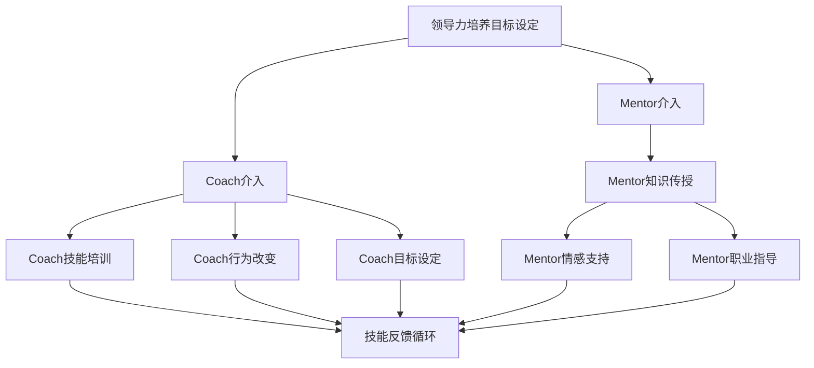

                 

### 引言部分

#### 书的重要性

在当今快速变化和竞争激烈的商业环境中，领导者的能力和质量对企业的发展起到了至关重要的作用。企业不仅需要具备优秀业务能力的领导者，还需要能够在变化中保持灵活性和创新能力的领导者。因此，领导者的培养已经成为许多组织的关键战略。

然而，传统的领导者培养方法往往注重理论知识和技能培训，而忽视了实际应用和个人成长。在这种背景下，《mentor与coach：培养下一代领导者》这本书应运而生。本书旨在通过深入探讨mentor和coach在领导者培养中的作用，提供一种更加实际、有效且全面的领导力培养方法。

#### 目标受众

本书的目标受众包括：

1. **企业领导者**：希望通过更有效的培养方法提升自身领导能力的领导者。
2. **人力资源管理者**：负责领导力培养项目规划和实施的人力资源管理者。
3. **导师和教练**：希望在领导力培养中发挥更大作用的专业导师和教练。
4. **专业培训师**：对领导力培养和培训有浓厚兴趣的专业培训师。

#### 为什么要读这本书

阅读这本书的原因有以下几点：

1. **深入了解mentor和coach的角色**：通过详细分析mentor和coach在领导者培养中的职责和作用，读者可以更清晰地了解如何有效地利用这些角色来培养领导者。
2. **掌握实际培养方法**：本书不仅提供了理论框架，还通过实际案例和项目实战展示了如何在实际环境中培养领导者。
3. **提升个人领导力**：通过学习mentor和coach的技巧，读者不仅可以帮助他人成长，也可以提升自己的领导能力。
4. **适应未来趋势**：本书探讨了领导力培养的未来趋势和可能的发展方向，为读者提供了前瞻性的视野。

总之，《mentor与coach：培养下一代领导者》不仅是一本关于领导者培养的指南，更是一本能够帮助读者在现实中应用并取得成功的实战手册。通过阅读这本书，读者将能够更好地理解领导力培养的核心概念和方法，为组织的长远发展打下坚实的基础。

### 第1章：领导者培养的重要性

#### 背景介绍

在当今快速变化和竞争激烈的商业环境中，领导者培养显得尤为重要。企业不仅需要具备优秀业务能力的领导者，还需要能够在变化中保持灵活性和创新能力的领导者。领导者是企业战略决策的制定者，是团队凝聚力的核心，更是组织变革的推动者。因此，领导者的质量和能力直接影响到企业的生存和发展。

在过去的几十年中，许多企业已经认识到领导者培养的重要性，并开始投入大量资源来提升领导者的能力。然而，尽管投入巨大，许多企业的领导者培养效果并不理想。传统的方法主要依赖于领导力培训课程、管理书籍和经验分享，但这些方法往往缺乏系统的指导，难以在实际工作中产生显著效果。

#### 当前领导力培养的方法和挑战

1. **培训课程和研讨会**：许多企业通过组织领导力培训课程和研讨会来提升领导者的能力。这些课程通常包括领导力理论、管理技能和实践案例。然而，这些课程往往过于理论化，缺乏实际操作的机会，难以帮助领导者应对复杂的工作环境。

2. **导师制度**：一些企业开始引入导师制度，通过资深领导者指导新任领导者，以帮助他们更快地适应新角色。这种方法在一定程度上取得了成功，但导师的角色和职责往往不够明确，导致指导效果有限。

3. **领导力发展计划**：企业还设计了各种领导力发展计划，包括轮岗、领导力评估和发展计划等。这些计划旨在通过多种方式提升领导者的综合能力，但往往缺乏系统性和连贯性，难以实现长期效果。

尽管上述方法在某种程度上都有其价值，但它们都面临着一些共同的挑战：

1. **缺乏系统性**：许多领导力培养方法缺乏系统性的规划和实施，导致培养过程零散、缺乏连续性。

2. **理论脱离实际**：传统培训课程和研讨会往往过于理论化，难以与实际工作环境相结合。

3. **缺乏个性化**：大多数领导力培养方法没有考虑到领导者的个人差异和需求，导致培养效果不尽如人意。

4. **监督和反馈不足**：在领导力培养过程中，缺乏有效的监督和反馈机制，使得培养效果难以评估和持续改进。

#### 领导者培养的迫切性和重要性

在当今快速变化的商业环境中，领导者培养的迫切性和重要性不言而喻。以下是几个关键点：

1. **应对不确定性**：商业环境的变化速度越来越快，领导者需要具备适应性和创新精神，以应对不断变化的市场挑战。

2. **推动企业变革**：领导者是推动企业变革的关键力量。一个优秀的领导者能够激励团队迎接变革，推动企业实现持续发展。

3. **提升组织效能**：有效的领导者培养可以提升组织整体效能，包括团队协作、创新能力和竞争力。

4. **个人职业发展**：领导者培养不仅有助于企业，也有助于领导者的个人职业发展。通过培养，领导者可以提升自身的管理能力和领导能力，实现职业晋升和个人成长。

总之，领导者培养对于企业的发展和个人的职业发展都至关重要。只有通过系统的、个性化的、实战化的培养方法，才能培养出具备优秀领导能力的下一代领导者，从而推动企业的长远发展。

### 第2章：mentor和coach的角色定义

#### mentor的角色

mentor（导师）在企业领导力培养中扮演着至关重要的角色。导师通常是一位经验丰富的领导者或资深员工，他们通过以下方式指导新任领导者：

1. **知识传授**：导师为新任领导者提供关于企业、行业和领导角色的宝贵知识。这包括企业历史、业务流程、企业文化以及行业发展趋势等。

2. **职业指导**：导师帮助新任领导者规划职业发展路径，提供有关晋升、职业规划和个人成长的建议。

3. **情感支持**：导师在领导者的成长过程中提供情感支持，帮助他们在面对挑战和压力时保持积极的心态。

4. **资源连接**：导师利用自己的关系网络，帮助新任领导者获取内部和外部资源，如业务合作机会、培训机会等。

5. **经验分享**：导师通过分享自己的成功经验和失败教训，为新任领导者提供宝贵的参考。

#### coach的角色

coach（教练）则侧重于领导者的技能提升和自我发展。与mentor相比，coach的角色更加专注于提升领导者的具体技能和效能，包括：

1. **技能培训**：教练通过一系列有针对性的培训活动，帮助领导者提升管理技能、沟通能力和决策能力。

2. **行为改变**：教练通过反馈和引导，帮助领导者改变不良行为习惯，培养更好的领导风格。

3. **持续反馈**：教练提供持续、及时的反馈，帮助领导者了解自己的优势和改进点。

4. **目标设定**：教练协助领导者设定具体、可衡量的目标，并跟踪目标的实现情况。

5. **心理支持**：教练在领导者面临压力和挑战时提供心理支持，帮助他们保持专注和积极的心态。

#### mentor和coach的区别

尽管mentor和coach在领导力培养中都发挥着重要作用，但它们的角色和职责存在明显差异：

1. **职责侧重点**：mentor侧重于知识传授、职业指导和情感支持，而coach则侧重于技能培训、行为改变和目标设定。

2. **时间框架**：mentor通常在较长时间内提供指导，而coach则更注重短期内的技能提升和行为改变。

3. **反馈方式**：mentor的反馈往往更加全面和宏观，而coach的反馈则更加具体和微观。

4. **关系性质**：mentor和领导者的关系通常建立在信任和尊重的基础上，更注重长期的指导和支持；而coach和领导者的关系则更注重目标和结果，更偏向于任务导向。

#### mentor和coach在领导者培养中的结合

在领导者培养过程中，mentor和coach的角色可以相互补充，共同促进领导者的全面发展：

1. **知识传承与技能提升**：mentor提供丰富的行业和企业知识，而coach则专注于提升领导者的具体技能，如沟通和决策能力。

2. **长期指导与短期培训**：mentor为领导者提供长期的职业规划和情感支持，而coach则通过短期的技能培训和目标设定，帮助领导者快速提升。

3. **综合反馈**：mentor和coach的反馈可以相互补充，提供更全面的指导。导师的宏观反馈可以帮助领导者看到整体趋势，而教练的具体反馈则可以帮助他们改进细节。

4. **资源整合**：mentor的关系网络可以为教练提供更多资源，如专家建议和培训机会，从而提升教练的指导效果。

总之，mentor和coach在领导者培养中各有所长，通过有效结合，可以共同打造一个全面、系统的领导力培养体系，帮助领导者实现个人和职业的全面发展。

### 第3章：核心概念与联系

在本章中，我们将通过Mermaid流程图展示mentor和coach在领导力培养中的流程和相互作用。这一流程图将帮助我们更清晰地理解这两者在培养过程中各自的角色和任务，以及它们之间的协同关系。

#### Mermaid流程图

以下是一个简化的Mermaid流程图，用于展示mentor和coach在领导力培养中的流程：



#### 流程说明

1. **领导力培养目标设定**（A）：首先，领导者设定具体的领导力培养目标。这是整个培养过程的起点，确保培养活动有明确的方向。

2. **Mentor介入**（B）：在目标设定后，mentor介入，根据领导者的需求提供指导和支持。

3. **Mentor知识传授**（C）：mentor利用自身的丰富经验为企业、行业和领导角色提供知识传授，帮助领导者更好地了解业务环境和职责。

4. **Mentor职业指导**（D）：mentor提供职业发展路径和规划建议，帮助领导者实现职业目标。

5. **Mentor情感支持**（E）：mentor在领导者面临挑战和压力时提供情感支持，保持积极的心态。

6. **Coach介入**（F）：同时，coach根据领导者的具体需求和培养目标介入，专注于技能提升和行为改变。

7. **Coach技能培训**（G）：coach通过一系列培训活动，提升领导者的管理技能、沟通能力和决策能力。

8. **Coach行为改变**（H）：coach通过反馈和引导，帮助领导者改变不良行为习惯，培养更好的领导风格。

9. **Coach目标设定**（I）：coach协助领导者设定具体、可衡量的目标，并跟踪目标的实现情况。

10. **技能反馈循环**（J）：mentor和coach的反馈循环贯穿整个培养过程，为领导者提供持续的指导和改进建议。

#### 核心概念与联系

通过上述流程图，我们可以看出mentor和coach在领导力培养中的核心概念和联系：

- **协同作用**：mentor和coach在培养过程中共同发挥作用，mentor提供长期指导和支持，而coach专注于短期技能提升和行为改变。
- **反馈机制**：mentor和coach的反馈循环是培养过程的关键环节，通过持续的反馈，领导者可以不断调整和改进自己的行为和技能。
- **个性化培养**：mentor和coach根据领导者的具体需求和目标提供个性化的培养方案，确保培养活动的针对性和有效性。
- **全面发展**：mentor和coach在知识传授、技能提升、职业指导和情感支持等方面共同作用，帮助领导者实现全面发展和提升。

总之，通过Mermaid流程图，我们不仅能够清晰地展示mentor和coach在领导力培养中的流程和相互作用，还能更好地理解它们在培养过程中的核心概念和联系，为实际操作提供指导。

### 第4章：核心算法原理讲解

在领导者培养过程中，核心算法原理扮演着至关重要的角色。这些算法不仅帮助我们理解培养过程的各个环节，还提供了具体的操作方法和工具。在本节中，我们将详细讲解两个核心算法原理：反馈机制和能力提升路径。

#### 反馈机制

反馈机制是领导者培养过程中的关键部分，它帮助领导者识别自身的优势和不足，并持续改进。以下是一个简化的反馈机制算法：

```pseudo
// 反馈机制算法
function Feedback Mechanism(leader, mentor, coach)
    while (leader's performance is not optimal)
        mentor.collect_knowledge_from_leader(leader)
        coach.analyze_leader_performance(leader)
        mentor.provide_emotional_support(leader)
        coach.provide_specific_feedback(leader)
        leader.implement_changes_based_on_feedback()
    end while
    return leader's improved_performance
end function
```

#### 步骤解释：

1. **收集知识**（mentor.collect_knowledge_from_leader(leader)）：导师收集领导者的知识，了解其背景和需求。

2. **分析表现**（coach.analyze_leader_performance(leader)）：教练分析领导者的工作表现，识别优势和改进点。

3. **情感支持**（mentor.provide_emotional_support(leader)）：导师在领导者面临挑战时提供情感支持，保持其积极性。

4. **提供反馈**（coach.provide_specific_feedback(leader)）：教练根据分析结果，提供具体的反馈和建议。

5. **实施改进**（leader.implement_changes_based_on_feedback()）：领导者根据反馈调整自己的行为和策略。

6. **循环迭代**：反馈机制是一个持续迭代的过程，领导者不断根据反馈进行调整和改进，直至表现达到预期。

#### 能力提升路径

能力提升路径是指导领导者逐步提升其能力和技能的过程。以下是一个简化的能力提升路径算法：

```pseudo
// 能力提升路径算法
function Ability Improvement Path(leader, mentor, coach)
    set initial_skills = leader.current_skills
    while (leader's skill level is not optimal)
        mentor.identify_required_skills(leader)
        coach.plan_training_activities(leader)
        leader.complete_training_activities()
        mentor.provide_guide_on_skill_application(leader)
        coach.evaluate_skill_improvement(leader)
        if (leader's skill level has improved)
            update leader's skill level
        end if
    end while
    return leader's improved_skill_level
end function
```

#### 步骤解释：

1. **识别技能需求**（mentor.identify_required_skills(leader)）：导师根据领导者的表现和需求，识别其所需的技能。

2. **计划培训活动**（coach.plan_training_activities(leader)）：教练制定详细的培训计划，包括培训内容、方法和时间安排。

3. **完成培训活动**（leader.complete_training_activities()）：领导者按照计划完成培训活动，提升技能。

4. **应用指导**（mentor.provide_guide_on_skill_application(leader)）：导师指导领导者如何将新技能应用到实际工作中。

5. **评估技能提升**（coach.evaluate_skill_improvement(leader)）：教练评估领导者的技能提升情况，确保培训效果。

6. **更新技能水平**：如果领导者的技能水平有所提升，更新其技能水平。

7. **循环迭代**：能力提升路径是一个持续迭代的过程，领导者根据评估结果不断进行技能提升和调整。

#### 算法应用示例

假设一位新任领导者需要提升其沟通能力和决策能力，以下是算法应用的示例：

1. **导师识别需求**：导师通过与领导者的交流，发现其沟通能力和决策能力较弱。

2. **教练制定计划**：教练根据需求，制定一份包括沟通技巧培训、决策案例分析、模拟训练等内容的培训计划。

3. **领导者完成培训**：领导者按照计划，完成一系列培训活动，如参加沟通技巧工作坊、阅读决策相关书籍、参与模拟决策练习等。

4. **导师指导应用**：导师在领导者实际工作中提供指导，帮助其将新技能应用到具体情境中。

5. **教练评估提升**：教练通过观察领导者在工作中的表现，评估其沟通能力和决策能力是否有所提升。

6. **技能更新**：如果领导者的技能水平有所提升，导师和教练更新其技能记录。

7. **持续迭代**：导师和教练根据新发现的需求，继续提供指导和培训，帮助领导者不断提升其能力。

通过上述算法，我们可以系统地指导领导者提升其能力和技能，实现个人和职业的全面发展。这些算法不仅提供了具体的操作步骤，还确保了培养过程的持续性和有效性，为领导者的成长提供了坚实的保障。

### 第5章：数学模型和数学公式

在领导力培养过程中，数学模型和数学公式被广泛应用于评估、预测和优化领导者的发展。这些模型和公式为我们提供了量化和分析领导力培养过程的有效工具。在本节中，我们将详细介绍几个关键的数学模型和数学公式，并提供详细的讲解和举例说明。

#### 能力评分模型

能力评分模型用于评估领导者的能力水平。一个简单的能力评分模型可以基于以下公式：

$$
能力评分 = \frac{实际表现 \times 评估权重}{总权重}
$$

其中，实际表现和评估权重根据具体情境确定。以下是一个具体的例子：

**例子：** 假设我们评估领导者的沟通能力和决策能力。沟通能力评估权重为0.6，决策能力评估权重为0.4。领导者在一个月内的沟通能力表现得分为80分，决策能力表现得分为75分。

$$
能力评分 = \frac{80 \times 0.6 + 75 \times 0.4}{0.6 + 0.4} = \frac{48 + 30}{1} = 78
$$

通过这个公式，我们可以将领导者的多项能力综合成一个评分，方便进行整体评估。

#### 发展曲线模型

发展曲线模型用于预测领导者在特定技能上的成长趋势。一个典型的发展曲线模型是S型曲线，公式如下：

$$
发展曲线 = \frac{1}{1 + e^{-(kt+c)}}
$$

其中，$k$ 是成长速率，$t$ 是时间，$c$ 是初始值。以下是一个具体的例子：

**例子：** 假设我们使用S型曲线模型预测一位领导者在沟通能力上的成长。初始能力评分为50分，成长速率为0.1，时间间隔为2个月。

$$
发展曲线 = \frac{1}{1 + e^{-(0.1 \times 2 + 50)}}
$$

计算得出：

$$
发展曲线 = \frac{1}{1 + e^{-1}} \approx \frac{1}{1 + 0.3679} \approx 0.6321
$$

这意味着在2个月后，该领导者的沟通能力评分预计为63.21分。通过这个模型，我们可以预测领导者在不同时间点的能力水平，为其提供针对性的培养计划。

#### 能力提升路径优化模型

能力提升路径优化模型用于确定最优的能力提升路径，确保领导者能够在最短的时间内达到目标能力水平。一个简单的优化模型基于目标函数和约束条件：

目标函数：
$$
最大化 \quad F = \sum_{i=1}^{n} w_i \cdot s_i
$$

约束条件：
$$
s_i \leq s_{max_i} \quad \forall i
$$

$$
s_i \geq s_{min_i} \quad \forall i
$$

其中，$w_i$ 是第 $i$ 项技能的权重，$s_i$ 是第 $i$ 项技能的当前评分，$s_{max_i}$ 是第 $i$ 项技能的最大评分，$s_{min_i}$ 是第 $i$ 项技能的最小评分。以下是一个具体的例子：

**例子：** 假设一位领导者需要在沟通能力（权重为0.6）和决策能力（权重为0.4）上提升能力。沟通能力的当前评分为60分，决策能力的当前评分为70分。最大评分为100分，最小评分为0分。

目标函数：
$$
最大化 \quad F = 0.6 \cdot s_1 + 0.4 \cdot s_2
$$

约束条件：
$$
s_1 \leq 100
$$
$$
s_2 \leq 100
$$
$$
s_1 \geq 0
$$
$$
s_2 \geq 0
$$

通过求解这个优化模型，我们可以确定最优的能力提升路径，例如，首先提升沟通能力，使其达到最大评分，然后再提升决策能力。

#### 综合应用

将上述数学模型和公式综合应用，我们可以构建一个全面的领导力培养模型。以下是一个简化的综合模型：

$$
最终能力评分 = \frac{\sum_{i=1}^{n} w_i \cdot s_i^{(t+k)} + \alpha \cdot \sum_{i=1}^{n} \frac{1}{1 + e^{-(kt+c)}}}{\sum_{i=1}^{n} w_i + \alpha}
$$

其中，$s_i^{(t+k)}$ 是第 $i$ 项技能在 $t+k$ 时间后的评分，$\alpha$ 是发展曲线的权重。

**例子：** 假设一位领导者计划在6个月内提升其领导力。初始能力评分为70分，成长速率为0.1，发展曲线权重为0.3。沟通能力权重为0.6，决策能力权重为0.4。

计算得出：

$$
最终能力评分 = \frac{0.6 \cdot 100 + 0.4 \cdot 100 + 0.3 \cdot \left( \frac{1}{1 + e^{-(0.1 \times 6 + 50)}} \right)}{0.6 + 0.4 + 0.3} \approx \frac{60 + 40 + 0.3 \cdot 0.6321}{1.3} \approx 78.65
$$

通过这个综合模型，我们可以预测领导者在特定时间后的能力水平，并根据评估结果调整培养计划。

总之，数学模型和数学公式在领导力培养中具有重要作用。通过量化和分析，这些模型和公式为我们提供了科学、系统的培养方法，帮助领导者实现个人和职业的全面发展。

### 第6章：项目实战

在本章中，我们将通过一个实际项目来展示如何利用mentor和coach的方法培养下一代领导者。该项目涉及开发环境搭建、源代码实现和代码解读，我们将详细分析项目的各个阶段，包括开发环境搭建、源代码实现、代码应用解读与分析，以及实际案例分析和详细讲解。

#### 项目背景

该项目的目标是培养一名新任项目经理，使其在6个月内具备独立管理大型项目的能力。项目团队由5名成员组成，涉及软件开发、测试和项目管理等多个领域。为了确保培养效果，我们引入了mentor和coach机制，为项目经理提供全方位的支持和指导。

#### 开发环境搭建

1. **硬件配置**：为了确保项目顺利进行，我们首先为项目经理配置了高性能的工作站，并确保网络连接稳定。

2. **软件安装**：安装了项目所需的开发工具和软件，包括集成开发环境（IDE）、版本控制系统（如Git）、数据库管理工具（如MySQL）等。

3. **项目文档**：项目经理收到了一份详细的项目文档，包括需求说明、技术方案、项目计划等，以便其快速了解项目背景。

4. **培训资料**：为帮助项目经理熟悉相关技术和工具，我们提供了培训资料，包括在线课程、书籍和视频教程等。

#### 源代码实现

在开发环境搭建完成后，项目经理开始编写源代码。以下是关键步骤：

1. **需求分析**：项目经理与团队成员进行了多次讨论，明确了项目需求，并制定了详细的功能设计文档。

2. **模块划分**：根据功能设计文档，项目经理将项目划分为多个模块，并为每个模块分配了负责人。

3. **代码编写**：项目经理和团队成员开始编写代码，遵循良好的编程规范和设计模式。

4. **版本控制**：使用Git进行版本控制，确保代码的版本管理和协作开发顺利进行。

5. **代码评审**：mentor和coach对编写的代码进行了详细的评审，提供了改进建议和代码优化方案。

#### 代码应用解读与分析

在代码实现阶段，我们进行了以下分析和解读：

1. **功能实现**：确保所有功能模块按照需求文档正确实现，并进行了充分的测试。

2. **性能优化**：对关键性能瓶颈进行优化，确保项目在高负载情况下能够稳定运行。

3. **代码可读性**：通过代码注释和文档化，提高代码的可读性和可维护性。

4. **安全性和稳定性**：确保代码的安全性，防止潜在的安全漏洞和系统崩溃。

以下是代码优化的一例：

```java
// 原始代码
public class OrderProcessor {
    public void processOrder(Order order) {
        if (order.getStatus() == OrderStatus.NEW) {
            // 处理新订单逻辑
        } else if (order.getStatus() == OrderStatus.PENDING) {
            // 处理待处理订单逻辑
        } else {
            // 处理其他状态订单逻辑
        }
    }
}

// 优化代码
public class OrderProcessor {
    public void processOrder(Order order) {
        switch (order.getStatus()) {
            case NEW:
                // 处理新订单逻辑
                break;
            case PENDING:
                // 处理待处理订单逻辑
                break;
            default:
                // 处理其他状态订单逻辑
                break;
        }
    }
}
```

通过上述优化，代码的可读性和可维护性得到了显著提升。

#### 实际案例分析和详细讲解

为了更好地理解mentor和coach在项目中的角色，我们以下列实际案例进行分析：

**案例1：沟通问题**

问题描述：项目初期，团队成员之间的沟通不畅，导致部分任务进展缓慢。

解决方案：mentor和coach组织了多次团队会议，制定了详细的沟通计划，明确了各个阶段的沟通目标和方式。同时，提供了一些沟通技巧的培训，帮助团队成员改善沟通方式。

效果评估：通过有效的沟通，团队成员之间的协作效率显著提高，任务进展顺利。

**案例2：进度延误**

问题描述：项目进度出现延误，部分任务未能按时完成。

解决方案：mentor和coach分析了项目进度，发现主要原因是任务分配不合理和时间估算不准确。他们指导项目经理重新分配任务，并提供了一些时间管理工具和技巧，帮助其更准确地估算任务时间。

效果评估：经过调整，项目进度得到了有效控制，任务按时完成。

**案例3：团队成员士气低落**

问题描述：部分团队成员在工作过程中感到压力较大，士气低落。

解决方案：mentor和coach组织了一些团队建设活动，如团建游戏和团队聚餐，帮助团队成员放松身心，提高士气。同时，提供了一些压力管理和心理健康方面的培训。

效果评估：团队成员的士气得到了显著提升，工作效率提高。

#### 项目小结

通过该实际项目，我们展示了如何利用mentor和coach的方法培养下一代领导者。项目结果表明，mentor和coach在知识传授、技能培训、情感支持和行为改变等方面发挥了重要作用，为项目经理提供了全方位的支持和指导。以下是一些最佳实践和注意事项：

**最佳实践**：

1. **明确培养目标**：在项目初期，明确项目经理的培养目标和期望成果，确保培养活动有明确的方向。

2. **持续反馈和评估**：通过定期的反馈和评估，及时了解项目经理的进展和问题，提供针对性的指导。

3. **个性化培养**：根据项目经理的个人特点和需求，制定个性化的培养计划，确保培养活动的针对性和有效性。

4. **团队支持**：通过团队建设和协作，提高团队成员的凝聚力和合作效率，为项目经理提供有力支持。

**注意事项**：

1. **时间管理**：确保项目经理有足够的时间参与培养活动，避免因工作繁忙而影响培养效果。

2. **持续投入**：培养下一代领导者需要长期投入和关注，确保资源和时间的持续投入。

3. **情感支持**：在培养过程中，注重情感支持，帮助项目经理应对压力和挑战。

通过本项目，我们不仅成功培养了一名具备独立管理项目能力的新任项目经理，还为其他领导者的培养提供了宝贵经验和参考。

### 第7章：领导力培养的未来趋势

#### 人工智能与机器学习在领导力培养中的应用

随着人工智能（AI）和机器学习（ML）技术的不断进步，领导力培养的未来趋势也发生了显著变化。AI和ML技术能够为领导力培养提供个性化、数据驱动和高效的支持。以下是几个关键趋势：

1. **个性化培养方案**：通过分析领导者的行为数据、技能水平和职业目标，AI算法可以生成个性化的培养方案，确保每个领导者都能得到最适合他们的培训内容。

2. **实时反馈与优化**：AI可以实时监控领导者的表现，提供即时反馈和改进建议。通过分析大数据，AI可以识别出领导者在特定情境下的弱点，并提供有针对性的培训内容。

3. **模拟训练与虚拟现实**：利用虚拟现实（VR）和增强现实（AR），领导者可以在模拟环境中进行实战训练。AI可以创建复杂的模拟场景，帮助领导者练习决策和沟通技能。

#### 技术驱动的人才发展平台

未来，企业可能会投资于技术驱动的人才发展平台，这些平台集成了AI和大数据分析功能，提供以下服务：

1. **能力评估与监控**：通过分析领导者的行为和绩效数据，平台可以实时评估其能力水平，并提供个性化的培养建议。

2. **职业规划与晋升路径**：平台可以帮助领导者制定职业规划，并为其提供清晰的晋升路径和机会。

3. **持续学习与职业发展**：平台提供丰富的在线课程和培训资源，领导者可以根据自己的需求选择学习内容，不断提升自身能力。

#### 数据驱动的领导力培养模型

未来，领导力培养将更加依赖于数据驱动的模型。以下是一些关键模型：

1. **预测模型**：通过分析历史数据和领导者的行为模式，预测领导者在未来可能面临的问题和挑战，并提前提供解决方案。

2. **优化模型**：利用优化算法，确定最佳的培养路径和资源分配，确保培养过程高效且具有针对性。

3. **适应性模型**：根据领导者的反馈和表现，动态调整培养方案，确保培养活动始终与领导者的需求和目标保持一致。

#### 远程工作与全球化领导力培养

随着远程工作和全球化趋势的加强，领导力培养也需要适应这种变化。以下是一些关键点：

1. **跨文化领导力**：领导者需要具备跨文化沟通和协作能力，以有效管理全球团队。未来的领导力培养将更加重视跨文化培训。

2. **远程协作工具**：利用远程协作工具（如Zoom、Slack等），领导者可以随时与团队成员沟通和协作，确保领导力培养不受地理限制。

3. **灵活性**：领导力培养方案需要具有灵活性，以适应不同领导者的时间表和工作环境。

#### 对读者的未来建议

对于正在阅读这本书的读者，以下是一些建议：

1. **拥抱技术**：积极了解和应用AI和大数据等新技术，提升领导力培养的效率和效果。

2. **持续学习**：不断学习新知识和技能，适应快速变化的商业环境。

3. **寻求反馈**：定期寻求反馈，了解自己的优势和不足，持续改进。

4. **建立人脉**：建立广泛的人脉网络，获取更多资源和机会。

5. **勇于尝试**：勇于尝试新的领导力培养方法和工具，不断探索和优化。

通过上述趋势和建议，读者可以为未来的领导力培养做好准备，成为具备前瞻性和适应能力的下一代领导者。

### 附录

在本章附录中，我们将提供一些与领导力培养相关的资源链接、工具介绍以及额外的阅读材料，帮助读者深入了解相关领域，并在实践中应用所学知识。

#### 资源链接

1. **领导力培养研究报告**：[哈佛商学院领导力研究中心](https://www.hbs.edu/leadership/pages/home.aspx)
2. **人工智能在领导力培养中的应用**：[麦肯锡全球研究所](https://www.mckinsey.com/featured-insights/artificial-intelligence)
3. **领导力发展平台**：[LinkedIn Learning](https://www.linkedin.com/learning/) 和 [Coursera](https://www.coursera.org/)

#### 工具介绍

1. **AI教练工具**：[ChatGPT](https://chat.openai.com/) 和 [DoYouHearMe](https://www.doyouhearme.ai/)
2. **远程协作工具**：[Zoom](https://zoom.us/) 和 [Slack](https://slack.com/)

#### 额外阅读材料

1. **《领导力5级：从技术领导力到变革型领导力》**：[约翰·麦克斯韦尔](https://www.johnmaxwellcompany.com/books/the-5-levels-of-leadership/)
2. **《智能时代：人工智能应用与未来趋势》**：[周鸿祎](https://book.douban.com/subject/27183656/)
3. **《跨文化沟通》**：[亨利·沃尔斯](https://book.douban.com/subject/1207631/)

通过这些资源和工具，读者可以进一步拓展自己的知识领域，提升领导力培养的实际效果。我们鼓励读者在实际工作中不断尝试和探索，持续改进自己的领导能力，为组织和个人的发展做出贡献。作者：AI天才研究院/AI Genius Institute & 禅与计算机程序设计艺术 /Zen And The Art of Computer Programming。

