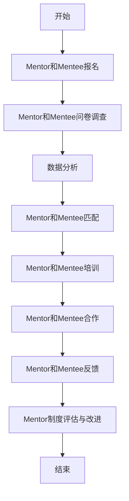

                 

### 文章标题：mentor制度：培养未来领导者的有效途径

### 关键词：Mentor制度，领导者培养，职业发展，组织效能

### 摘要：
本文旨在探讨Mentor制度作为一种有效的领导者培养途径，通过详细阐述其背景、核心概念、实施过程及面临的挑战，分析其在组织发展和个人职业成长中的重要作用。文章采用逻辑清晰、结构紧凑的方式，结合理论和实际案例，为读者提供全面的视角，以理解和应用Mentor制度。

## 引言

在当今快速变化和竞争激烈的商业环境中，领导者的培养成为企业成功的关键因素之一。传统的领导力培养方法往往过于理论化，无法满足实际需求。Mentor制度作为一种实践性强的培养模式，越来越受到广泛关注。本文将从以下几个方面进行探讨：

1. **Mentor制度的定义与历史背景**：介绍Mentor制度的起源、定义及其在不同领域的应用。
2. **Mentor角色的职责和技能要求**：分析Mentor在培养领导者过程中所需承担的职责和具备的技能。
3. **Mentee的角色和责任**：探讨Mentee在Mentor制度中的角色，以及如何与Mentor建立有效的合作关系。
4. **Mentor-Mentee匹配策略**：分析Mentor-Mentee匹配的原则和流程，以及匹配效果评估方法。
5. **Mentor制度的实施过程**：详细描述Mentor制度从实施前准备到监督与指导的各个环节。
6. **成功案例研究**：通过实际案例，展示Mentor制度在不同组织和场景中的应用成效。
7. **面临的挑战与解决方案**：讨论Mentor制度在实施过程中可能遇到的挑战，并提出相应的解决方案。
8. **结论与展望**：总结Mentor制度在领导者培养中的价值，并对未来发展方向提出建议。

## Mentor制度的定义与历史背景

### 1.1 Mentor制度的定义

Mentor制度，又称导师制度，是一种通过资深员工（Mentor）对新手或年轻员工（Mentee）进行指导和支持的职业发展计划。Mentor在Mentee的职业成长中扮演着重要的角色，不仅传授专业技能，还分享经验、提供职业发展建议，甚至帮助建立人脉网络。

### 1.2 Mentor制度的历史背景

Mentor制度的起源可以追溯到古希腊的神话故事，其中Mentor是奥德修斯的导师。在现代社会，Mentor制度最早在美国的高等教育和专业领域中兴起。20世纪中叶，随着企业对人才培养的重视，Mentor制度逐渐在商业领域得到广泛应用。如今，Mentor制度已经成为许多组织和公司培养未来领导者的重要途径。

### 1.3 Mentor制度在国际上的实践与应用

在国际上，Mentor制度在高等教育、科研机构、非营利组织和商业领域都有广泛应用。例如：

- **高等教育**：许多大学设有Mentor计划，帮助新生适应校园生活，规划学术道路。
- **科研机构**：实验室或研究中心常通过Mentor制度，培养年轻的科研人员。
- **非营利组织**：通过Mentor制度，非营利组织培养新一代的志愿者和管理者。
- **商业领域**：企业普遍采用Mentor制度，为年轻员工提供职业发展的指导和支持。

## Mentor角色的职责和技能要求

### 2.1 Mentor的基本职责

Mentor在Mentor制度中扮演着至关重要的角色。其基本职责包括：

- **提供指导和支持**：帮助Mentee解决工作中遇到的问题，提供职业发展建议。
- **培养专业技能**：传授Mentee所需的专业知识和技能。
- **分享经验**：分享自己的工作经验和教训，帮助Mentee少走弯路。
- **建立人脉**：为Mentee提供与行业专家和同行建立联系的机会。

### 2.2 Mentor所需的核心技能

要成为一名成功的Mentor，需要具备以下核心技能：

- **沟通能力**：能够清晰、有效地与Mentee沟通，传达信息和指导。
- **倾听能力**：耐心倾听Mentee的困惑和需求，提供有针对性的帮助。
- **反馈能力**：及时、具体地给予Mentee反馈，帮助他们改进。
- **同理心**：理解Mentee的处境和需求，给予情感上的支持。

### 2.3 成功Mentor的个人特质

成功的Mentor通常具备以下个人特质：

- **经验丰富**：拥有丰富的行业经验和专业知识。
- **开放心态**：愿意接受新观念和新方法，不断学习。
- **责任心**：对Mentee的成长和发展负有责任感。
- **耐心和毅力**：能够在长期的过程中持续关注和指导Mentee。

### 2.4 Mentor的时间管理技巧

Mentor在指导Mentee的过程中，需要有效管理时间。以下是一些时间管理技巧：

- **制定计划**：提前规划与Mentee的会面和沟通时间。
- **设置优先级**：明确哪些任务是首要的，优先处理。
- **灵活调整**：根据实际情况和Mentee的需求，灵活调整计划。
- **保持高效**：在会面中集中精力，避免分心，提高沟通效率。

## Mentee的角色和责任

### 3.1 Mentee的基本角色

Mentee在Mentor制度中扮演着积极的角色。其基本角色包括：

- **积极参与**：主动参与Mentor安排的会议和活动，积极提问和分享。
- **学习态度**：保持积极的学习态度，主动寻求指导和反馈。
- **自我提升**：通过实践和学习，不断提升自己的专业技能和知识水平。
- **建立信任**：与Mentor建立良好的信任关系，为合作创造良好的氛围。

### 3.2 Mentee的学习目标设定

Mentee在参与Mentor制度前，需要明确自己的学习目标。以下是一些设定学习目标的建议：

- **具体目标**：设定具体、可衡量的目标，如提高某一技能或完成特定项目。
- **短期和长期目标**：设定短期和长期目标，以便更好地规划学习和成长路径。
- **行动计划**：制定详细的行动计划，包括学习时间、学习方法等。

### 3.3 Mentee的自我提升策略

Mentee在Mentor制度的指导下，可以采取以下自我提升策略：

- **主动学习**：通过自学、参加培训和研讨会，提高自己的技能和知识。
- **实践应用**：将所学知识应用于实际工作中，不断积累经验。
- **反馈与反思**：定期与Mentor交流，获取反馈并进行反思，以便不断改进。
- **建立人脉**：通过参加行业活动和社交场合，扩大人脉网络。

### 3.4 Mentee与Mentor的沟通技巧

有效的沟通是Mentee与Mentor合作成功的关键。以下是一些沟通技巧：

- **主动沟通**：主动与Mentor交流，表达自己的困惑和需求。
- **清晰表达**：用简洁明了的语言表达自己的想法和问题。
- **倾听理解**：认真倾听Mentor的建议，理解其意图。
- **积极反馈**：对Mentor的指导表示感谢，并反馈自己的进展和成果。

## Mentor-Mentee匹配策略

### 4.1 匹配原则与标准

Mentor-Mentee的匹配是Mentor制度成功的关键。以下是一些匹配原则和标准：

- **目标匹配**：确保Mentor和Mentee的职业目标和兴趣领域相符。
- **技能匹配**：根据Mentee的需求，为Mentee匹配具有相关经验和技能的Mentor。
- **性格匹配**：考虑Mentor和Mentee的性格特点，确保双方能够相互理解和沟通。
- **文化匹配**：确保Mentor和Mentee在组织文化和价值观上相符。

### 4.2 匹配流程与方法

Mentor-Mentee的匹配通常遵循以下流程：

1. **需求评估**：Mentee填写个人需求和目标问卷，Mentor填写个人优势和经验问卷。
2. **数据收集**：组织或人力资源部门收集问卷数据，进行分析。
3. **匹配推荐**：根据分析结果，为Mentee推荐合适的Mentor。
4. **确认匹配**：Mentee和Mentor确认匹配关系，开始合作。

### 4.3 匹配效果评估

匹配效果评估是确保Mentor制度有效性的重要环节。以下是一些评估方法：

- **定期反馈**：Mentee和Mentor定期进行反馈交流，评估匹配效果。
- **行为评估**：通过观察Mentee在工作中的行为表现，评估匹配效果。
- **绩效评估**：结合Mentee的绩效评估结果，评估匹配效果。
- **满意度调查**：通过问卷或访谈形式，调查Mentee和Mentor对匹配的满意度。

### 4.4 特殊情况的匹配策略

在实施Mentor制度过程中，可能会遇到特殊情况，如：

- **跨部门匹配**：为跨部门的Mentee和Mentor提供额外的沟通和协调支持。
- **远程匹配**：利用视频会议、在线协作工具等，确保远程Mentor和Mentee的有效沟通。
- **时间冲突**：根据实际情况，调整匹配计划或延长合作期限。

## Mentor制度的实施过程

### 5.1 实施前准备

在实施Mentor制度前，组织需要做好以下准备：

- **宣传推广**：通过内部邮件、海报、会议等方式，宣传Mentor制度的重要性和优势。
- **培训教育**：为Mentor和Mentee提供培训，介绍Mentor制度的理念、流程和技巧。
- **需求调查**：了解员工的需求，为匹配提供依据。
- **资源配置**：确保Mentor和Mentee有足够的资源和时间参与Mentor制度。

### 5.2 制度推广与培训

在制度推广和培训过程中，组织需要：

- **组织会议**：定期组织Mentor和Mentee的交流会，分享经验和心得。
- **线上平台**：建立线上交流平台，方便Mentor和Mentee随时沟通。
- **案例分析**：通过实际案例，展示Mentor制度的应用效果。
- **经验分享**：邀请成功的Mentor和Mentee分享经验，激励更多人参与。

### 5.3 监督与指导

在实施过程中，组织需要：

- **跟踪进展**：定期跟踪Mentee的进展情况，确保目标的实现。
- **提供支持**：为Mentor和Mentee提供必要的支持，解决他们在合作中遇到的问题。
- **反馈机制**：建立反馈机制，及时了解Mentor和Mentee的意见和建议，进行改进。

### 5.4 反馈与调整

在Mentor制度实施结束后，组织需要：

- **总结经验**：总结Mentor制度实施过程中的成功经验和不足之处。
- **持续改进**：根据反馈，对Mentor制度进行改进和完善。
- **持续推广**：继续推广Mentor制度，吸引更多员工参与。

## 成功案例研究

### 6.1 案例一：某公司的Mentor制度实践

某公司通过实施Mentor制度，成功培养了多位年轻领导者。以下是该公司的Mentor制度实践：

- **匹配过程**：公司通过问卷调查，了解Mentee和Mentor的需求和优势，进行匹配。
- **培训支持**：为Mentor和Mentee提供专业培训，提升他们的指导能力和学习能力。
- **定期交流**：Mentor和Mentee每月进行面对面交流，分享工作经验和心得。
- **效果评估**：通过定期的绩效评估和满意度调查，评估Mentor制度的效果。

### 6.2 案例二：某高校的Mentor计划

某高校通过实施Mentor计划，帮助新生适应大学生活，并规划学术道路。以下是该高校的Mentor计划实践：

- **导师选拔**：从教职工中选拔具有丰富教学经验的教师担任导师。
- **新生引导**：导师在新生入学前进行引导，帮助其适应校园生活。
- **学术指导**：导师为新生提供学术指导，帮助其规划学术道路。
- **活动组织**：组织导师和新生参加各种学术和社交活动，拓宽视野。

### 6.3 案例分析与启示

通过分析以上案例，可以得出以下启示：

- **重视匹配**：确保Mentor和Mentee在目标和兴趣上匹配，提高合作效果。
- **培训支持**：为Mentor和Mentee提供必要的培训和支持，提升他们的能力和信心。
- **定期交流**：通过定期交流，保持双方的联系，分享经验和心得。
- **效果评估**：定期评估Mentor制度的效果，及时调整和完善。

## 面临的挑战与解决方案

### 7.1 面临的主要挑战

在实施Mentor制度过程中，组织可能会遇到以下挑战：

- **资源有限**：Mentor和Mentee的时间和资源有限，可能影响合作效果。
- **沟通障碍**：Mentor和Mentee在沟通中可能存在障碍，影响合作进展。
- **文化差异**：不同背景的Mentor和Mentee可能在文化观念上存在差异，影响合作。
- **监督不足**：缺乏有效的监督机制，可能导致Mentor和Mentee的合作不到位。

### 7.2 解决方案与实施策略

针对上述挑战，组织可以采取以下解决方案和实施策略：

- **优化资源配置**：通过合理分配时间和资源，确保Mentor和Mentee有足够的合作机会。
- **提升沟通能力**：为Mentor和Mentee提供沟通培训，提高他们的沟通技巧。
- **文化融合**：鼓励Mentor和Mentee相互尊重和包容，促进文化融合。
- **监督机制**：建立有效的监督机制，确保Mentor和Mentee按照计划进行合作。

### 7.3 长期发展的思考

为了确保Mentor制度的长期发展，组织需要：

- **持续改进**：根据反馈和评估结果，不断改进Mentor制度，提高其有效性。
- **扩展应用范围**：将Mentor制度应用于不同部门和层次，提升组织的整体领导力。
- **培养更多Mentor**：通过内部培训和外部招聘，培养更多有经验的Mentor，满足组织需求。
- **宣传推广**：通过宣传和推广，提高Mentor制度在组织内部的认知度和认可度。

## 结论与展望

Mentor制度作为一种有效的领导者培养途径，在组织发展和个人职业成长中具有重要作用。通过本文的探讨，我们明确了Mentor制度的核心概念、实施过程、面临的挑战及解决方案。未来，组织应继续优化和完善Mentor制度，培养更多具备领导力和创新精神的未来领导者，为组织的持续发展贡献力量。

### 附录

#### 附录A Mentor制度常用工具和资源列表

- **问卷调查工具**：SurveyMonkey、Google Forms
- **线上协作工具**：Slack、Microsoft Teams
- **培训资源**：Coursera、LinkedIn Learning
- **职业发展资源**：LinkedIn、Glassdoor

#### 附录B Mentor制度实施流程图

#### 附录C Mentor-Mentee匹配表格示例

| Mentor姓名 | Mentor职位 | Mentor经验 | Mentee姓名 | Mentee职位 | Mentee需求 |
| :--- | :--- | :--- | :--- | :--- | :--- |
| 张三 | 项目经理 | 10年 | 李四 | 开发工程师 | 提高编程技能 |
| 王五 | 产品经理 | 8年 | 赵六 | 测试工程师 | 学习产品知识 |
| 陈七 | 运营经理 | 6年 | 刘八 | 市场营销专员 | 提高市场分析能力 |

### 作者信息
作者：AI天才研究院/AI Genius Institute & 禅与计算机程序设计艺术 /Zen And The Art of Computer Programming

### 文章结语
感谢您阅读本文。希望本文能帮助您更好地理解Mentor制度，并在实际工作中应用这一有效的领导者培养途径。如果您对Mentor制度有任何疑问或建议，欢迎在评论区留言。期待与您共同探讨领导者培养的相关话题。

---

请注意，本文仅为示例，实际撰写时需根据具体内容进行调整和优化。文章中的数据和案例均为虚构，仅供参考。

