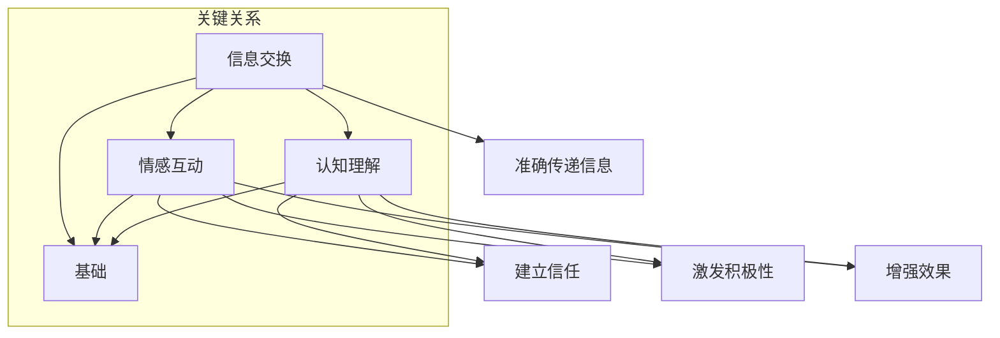
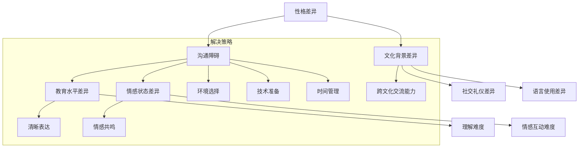
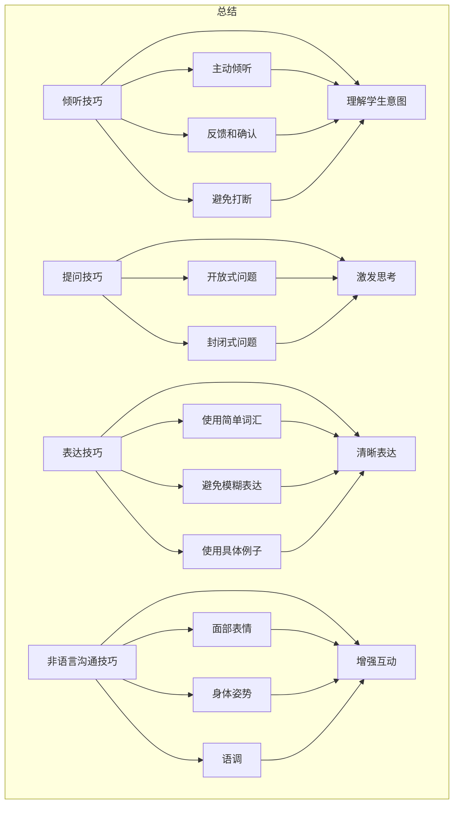
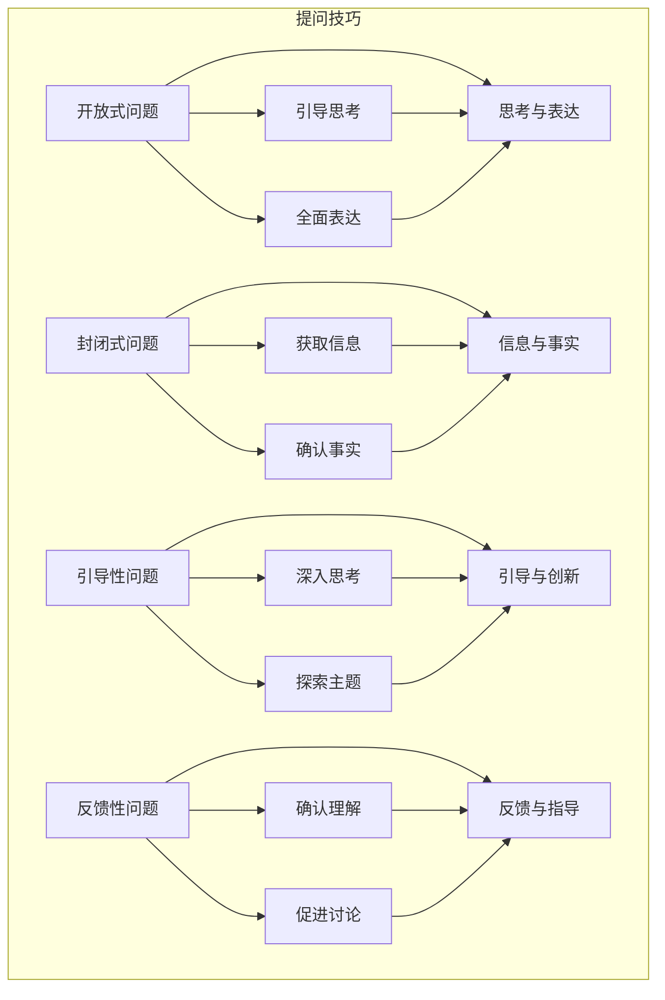
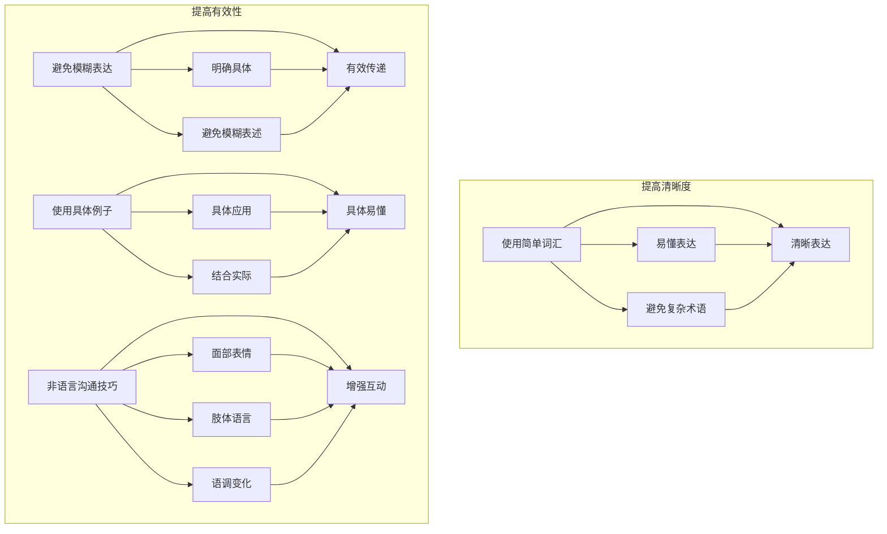
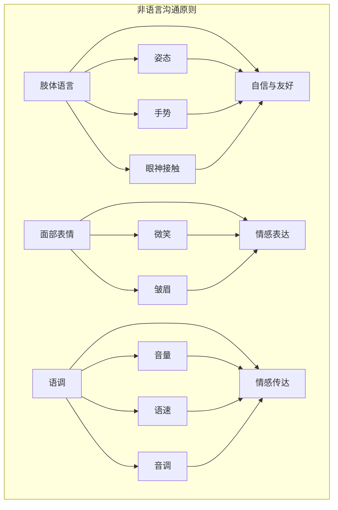
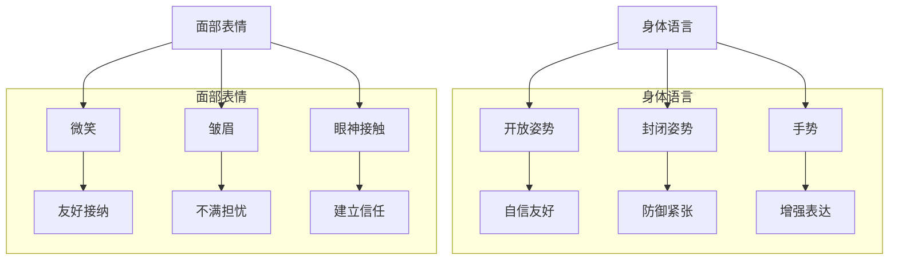

                 

### 文章标题：一对一辅导：提升个人绩效的对话技巧

#### 关键词：一对一辅导、个人绩效、对话技巧、沟通心理学、教学策略、实践案例

#### 摘要：
本文旨在探讨一对一辅导中的关键对话技巧，以提升个人绩效。通过对对话心理学的深入理解，本书将介绍一系列基本对话技巧，包括倾听、提问和表达技巧。此外，文章还将探讨非语言沟通的重要性，并特别关注一对一辅导中的特定挑战，如激发学生动机和处理学生负面情绪。通过实际案例分析和最佳实践，本文将为教育工作者和职业人士提供实用的沟通工具和策略。

### 引言

在当今快速变化的工作和学习环境中，有效的沟通技能已成为成功的关键因素。特别是在一对一辅导中，辅导者和学生之间的互动质量直接影响到学习成果和个人绩效。成功的对话不仅能够促进知识的传递，还能够建立信任、增强动机和解决潜在问题。然而，许多人在面对一对一辅导时感到挑战重重，因为这种情境要求高度的个人专注和灵活的沟通策略。

本文将深入探讨一对一辅导中的关键对话技巧，帮助读者提升个人绩效。首先，我们将了解对话心理学的基础，包括核心概念、个体差异和沟通障碍。接着，我们将详细介绍对话技巧的基本要素，包括倾听、提问和表达技巧。随后，文章将探讨非语言沟通的重要性，并提供实用的策略来提升沟通效果。在后续章节中，我们将专注于一对一辅导中的特定挑战，如激发学生动机和处理负面情绪。最后，通过实际案例分析和最佳实践，文章将总结如何在实际情境中应用这些技巧，以提升个人绩效。

### 第1章：理解对话心理学

#### 1.1 对话心理学的核心概念

对话心理学是研究人际沟通和心理过程相互作用的学科。其核心概念包括信息交换、情感互动和认知理解。在对话过程中，参与者不仅传递信息，还表达情感和态度，同时也在心理上互相影响。理解这些核心概念有助于我们更有效地进行一对一辅导。

首先，信息交换是对话的基础。有效的信息交换需要清晰、准确和及时的沟通。为了实现这一点，辅导者需要使用明确的语言，避免使用含糊或误导性的信息。其次，情感互动是增强对话效果的重要因素。情感互动不仅有助于建立信任，还能够激发学生的积极性和参与度。辅导者可以通过表达同情和理解来建立情感连接。最后，认知理解是确保对话双方能够准确理解和回应对方信息的关键。辅导者需要具备敏锐的观察力和分析能力，以理解学生的心理状态和需求。

#### 1.2 个体差异与沟通障碍

个体差异是沟通中不可避免的因素。每个人的性格、文化背景、教育水平和情感状态都不同，这些差异会对对话产生影响。了解个体差异有助于我们更好地适应不同的沟通情境。

首先，性格差异是导致沟通障碍的主要原因之一。例如，内向的人可能更倾向于倾听而非主动发言，而外向的人则可能过于支配对话。了解学生的性格特点有助于辅导者调整沟通策略，使其更符合学生的需求。其次，文化背景也会影响沟通。不同文化对语言、非语言行为和社交礼仪有不同的理解和期望。辅导者需要具备跨文化交流能力，以便在多元文化环境中有效沟通。

沟通障碍不仅源于个体差异，还可能由外部因素引起。例如，环境噪音、技术问题或时间压力都可能影响对话的质量。为了克服这些障碍，辅导者可以采取一些策略，如选择安静的环境、提前测试技术设备和合理安排时间。

#### 1.3 建立有效沟通的基础

建立有效沟通的基础需要辅导者具备一系列技能和知识。首先，倾听技巧是关键。有效的倾听不仅仅是听学生说话，更重要的是理解其背后的意图和情感。为了提高倾听技巧，辅导者可以采用主动倾听策略，如重复和总结学生的观点，以确认理解和建立信任。

其次，提问技巧也是建立有效沟通的重要组成部分。开放式问题有助于激发学生的思考，而封闭式问题则适用于确认信息或获取具体细节。辅导者可以根据对话的情境和学生的需求灵活运用这两种提问方式。

最后，表达清晰和有效的技巧同样重要。辅导者需要使用简单明了的语言，避免使用专业术语或复杂句式，以免造成理解上的障碍。此外，辅导者还应该注意自己的非语言沟通，如面部表情、身体姿势和语调，这些都会影响学生的理解和反应。

通过理解对话心理学的核心概念、个体差异和沟通障碍，并掌握建立有效沟通的基础技巧，辅导者可以显著提升一对一辅导的效果，从而提升个人绩效。

#### 1.1 对话心理学的核心概念

对话心理学是研究人际沟通和心理过程相互作用的学科。其核心概念包括信息交换、情感互动和认知理解。在对话过程中，参与者不仅传递信息，还表达情感和态度，同时也在心理上互相影响。理解这些核心概念有助于我们更有效地进行一对一辅导。

首先，信息交换是对话的基础。有效的信息交换需要清晰、准确和及时的沟通。为了实现这一点，辅导者需要使用明确的语言，避免使用含糊或误导性的信息。一个简单的例子是，辅导者可以采用“告知-反馈”循环，即先提供信息，然后询问学生是否理解，以确保信息的准确传递。

其次，情感互动是增强对话效果的重要因素。情感互动不仅有助于建立信任，还能够激发学生的积极性和参与度。辅导者可以通过表达同情和理解来建立情感连接。例如，当学生遇到困难时，辅导者可以表达出对学生的关心，并提供支持和鼓励。这种情感互动可以增强学生的自信心，从而更好地参与学习过程。

最后，认知理解是确保对话双方能够准确理解和回应对方信息的关键。辅导者需要具备敏锐的观察力和分析能力，以理解学生的心理状态和需求。为了提高认知理解能力，辅导者可以采用多种策略，如总结学生的观点、提出相关问题以促进思考，或者使用比喻和类比来解释复杂的概念。

为了更清晰地展示对话心理学的核心概念之间的关系，我们可以使用以下Mermaid流程图：

在这个流程图中，信息交换、情感互动和认知理解是三个核心概念，它们相互关联并共同作用于对话过程。信息交换是基础，确保对话内容的准确性和有效性；情感互动则增强了对话的效果，建立了信任和积极的互动氛围；认知理解则确保了对话双方能够准确理解和回应对方的信息。这三个核心概念共同构成了对话心理学的核心框架，为有效的沟通提供了理论基础。

#### 1.2 个体差异与沟通障碍

个体差异是沟通中不可避免的因素。每个人的性格、文化背景、教育水平和情感状态都不同，这些差异会对对话产生影响。了解个体差异有助于我们更好地适应不同的沟通情境。

首先，性格差异是导致沟通障碍的主要原因之一。例如，内向的人可能更倾向于倾听而非主动发言，而外向的人则可能过于支配对话。性格差异会影响沟通的方式和频率，进而影响对话的效果。为了克服这种障碍，辅导者可以采取以下策略：对于内向的学生，辅导者可以创造一个安静、支持性的环境，鼓励他们表达自己的观点；对于外向的学生，辅导者可以设置明确的沟通规则，确保每个学生都有发言的机会。

其次，文化背景也会影响沟通。不同文化对语言、非语言行为和社交礼仪有不同的理解和期望。例如，某些文化中，直接表达观点可能被视为不礼貌，而在其他文化中则被视为必要的沟通方式。文化差异可能导致误解和冲突，影响对话的顺利进行。为了克服文化障碍，辅导者需要具备跨文化交流能力，了解不同文化的沟通习惯和礼仪。例如，在跨文化对话中，辅导者可以采用中立、非争议性的语言，避免使用可能引起误解的词汇和表达方式。

沟通障碍不仅源于个体差异和文化背景，还可能由外部因素引起。例如，环境噪音、技术问题或时间压力都可能影响对话的质量。为了克服这些障碍，辅导者可以采取以下策略：

- **环境选择**：选择一个安静、无干扰的环境进行对话，以确保沟通的顺利进行。
- **技术准备**：在对话前测试所有技术设备，确保视频通话或在线会议的稳定性。
- **时间管理**：合理安排时间，避免对话过程中因时间压力而导致的沟通障碍。

为了更全面地展示个体差异与沟通障碍之间的关系，我们可以使用以下Mermaid流程图：

在这个流程图中，个体差异如性格、文化背景、教育水平和情感状态等都会导致沟通障碍。然而，通过采取适当的解决策略，如环境选择、技术准备、时间管理和跨文化交流能力等，辅导者可以有效地克服这些障碍，从而提升沟通效果。

通过理解个体差异与沟通障碍，辅导者可以更灵活地调整沟通策略，以适应不同的学生和情境，从而实现更有效的辅导过程，提升个人绩效。

#### 1.3 建立有效沟通的基础

建立有效沟通的基础需要辅导者具备一系列技能和知识。首先，倾听技巧是关键。有效的倾听不仅仅是听学生说话，更重要的是理解其背后的意图和情感。为了提高倾听技巧，辅导者可以采用以下策略：

- **主动倾听**：在学生说话时，辅导者要保持专注，避免分心。可以通过点头、眼神接触和适当的肢体动作来表示理解和支持。
- **反馈和确认**：在学生发言后，辅导者可以用简短的句子重复或总结学生的观点，以确保自己正确理解了学生的意思。例如：“你是说……是吗？”
- **避免打断**：在学生表达自己的观点时，辅导者要避免打断，给予学生足够的时间表达完整的思想。

其次，提问技巧也是建立有效沟通的重要组成部分。提问可以分为开放式问题和封闭式问题。开放式问题有助于激发学生的思考，而封闭式问题则适用于确认信息或获取具体细节。以下是两种提问方式的示例：

- **开放式问题**：例如，“你对这个问题的看法是什么？”或“你在这个领域有哪些经验？”
- **封闭式问题**：例如，“这个问题的答案是A吗？”或“你的作业完成得怎么样了？”

最后，表达清晰和有效的技巧同样重要。辅导者需要使用简单明了的语言，避免使用专业术语或复杂句式，以免造成理解上的障碍。以下是一些表达技巧的建议：

- **使用简单词汇**：尽量使用学生容易理解的词汇，避免使用过于复杂或专业的术语。
- **避免模糊表达**：确保自己的表达清晰、具体，避免使用模糊的语句，如“有点难”或“大概”。
- **使用具体的例子**：通过具体的例子来解释抽象的概念，帮助学生更好地理解。

此外，辅导者还应该注意自己的非语言沟通，如面部表情、身体姿势和语调，这些都会影响学生的理解和反应。例如，保持友好和开放的面部表情，使用积极和鼓励的语调，可以增强学生的信心和参与度。

为了更全面地展示这些基础沟通技巧，我们可以使用以下Mermaid流程图：

在这个流程图中，倾听技巧、提问技巧和表达技巧共同构成了建立有效沟通的基础。通过这些技巧，辅导者可以更好地理解学生的意图，激发学生的思考，并确保信息传达的清晰性和有效性。非语言沟通技巧则进一步增强了互动和沟通效果。通过掌握这些基础沟通技巧，辅导者可以显著提升一对一辅导的效果，从而提升个人绩效。

### 第2章：对话技巧的基本要素

#### 2.1 沟通的目的与类型

在对话过程中，明确沟通的目的是至关重要的。沟通的目的可以分为信息传递、情感交流和问题解决等。信息传递是基础，通过清晰、准确的信息交换，辅导者和学生能够理解彼此的需求和意图。情感交流则有助于建立信任和积极的互动氛围，增强学生的参与感和动机。问题解决则是沟通的高级目标，通过对话，辅导者和学生可以共同探讨和解决学习中的困难。

根据沟通的目的，对话可以划分为以下几种类型：

1. **教育性对话**：这类对话的主要目的是传授知识和技能，辅导者通过解释、演示和练习来帮助学生掌握所需的知识。这种对话通常是在一对一辅导中使用的，辅导者可以根据学生的需求和进度进行个性化的教学。

2. **激励性对话**：这类对话的目标是激发学生的内在动机和积极性。辅导者通过鼓励、赞赏和激励性的语言来增强学生的自信心和动力。这种对话不仅关注知识的传授，更注重学生的情感体验和成长。

3. **咨询性对话**：这类对话的目标是帮助学生解决具体问题或困惑。辅导者扮演咨询者的角色，通过倾听、提问和指导来帮助学生找到解决方案。这种对话通常涉及更深入的讨论和思考，有助于学生形成批判性思维和解决问题的能力。

4. **反思性对话**：这类对话的目标是引导学生进行自我反思，以促进他们的自我认识和成长。辅导者通过提问和引导，鼓励学生思考自己的学习过程、行为和态度，从而提高他们的自我意识和自我调节能力。

了解不同类型的对话有助于辅导者根据学生的需求和情境选择合适的沟通方式，从而提高沟通效果。

#### 2.2 倾听技巧

倾听技巧是有效沟通的核心要素之一。它不仅仅是指听到对方说话，更重要的是理解对方的意图和情感。有效的倾听能够建立信任，增强学生的参与感和动机，从而提高辅导的效果。

首先，**主动倾听**是关键。这意味着在学生讲话时，辅导者要保持专注，避免分心。可以通过以下方式来实践主动倾听：

- **保持眼神接触**：展示出你对学生的关注和理解，可以通过眼神交流来传达你的兴趣。
- **点头和肢体动作**：通过点头和肢体动作来表示你在倾听，这些非语言信号可以增强学生的信心。
- **避免打断**：在学生讲话时，不要急于打断，给予他们足够的时间表达完整的思想。

其次，**反馈和确认**是提高倾听效果的重要策略。辅导者可以在学生发言后，用简短的句子重复或总结学生的观点，以确认自己正确理解了学生的意思。例如：“你是说……是吗？”这样的反馈不仅有助于确认理解，还可以鼓励学生继续表达。

此外，**情感倾听**也是必不可少的。情感倾听要求辅导者不仅要理解学生的言语内容，还要关注其情感状态。可以通过以下方式来实现情感倾听：

- **表达同情和理解**：通过使用鼓励性的语言和姿态，表达对学生的同情和理解。例如，当学生遇到困难时，可以说：“我了解你的感受，遇到这样的情况确实很难。”
- **避免评判和批评**：在倾听时，避免对学生的观点进行评判或批评，以免造成学生的防御心理。相反，要尊重学生的观点，即使你不完全同意。

最后，**倾听反馈**也是一种有效的技巧。辅导者可以在对话结束时，总结学生提出的主要观点和问题，并确认自己对这些问题的理解。例如：“我们刚才讨论了你的作业进度和遇到的困难，你认为我们需要如何解决这些问题？”这样的反馈不仅有助于学生了解自己的问题，还可以促进进一步的讨论和解决方案的制定。

通过掌握这些倾听技巧，辅导者可以更好地理解学生的需求和意图，从而提高沟通效果和辅导质量。

#### 2.3 提问技巧

提问技巧在有效沟通中起着至关重要的作用。正确的问题可以引导对话的方向，激发学生的思考，从而提高学习效果。以下是几种常用的提问技巧：

首先，**开放式问题**是一种非常有效的提问方式。开放式问题通常以“如何”、“为什么”、“你认为”等词语开头，鼓励学生进行深入的思考和表达。例如：“你如何看待这个问题？”或“你能告诉我你的想法吗？”这种问题可以帮助学生展开思路，更全面地表达自己的观点。

其次，**封闭式问题**则适用于获取具体的信息或确认事实。封闭式问题通常以“是不是”、“哪个选项”、“什么时候”等词语开头。例如：“这个问题的答案是A吗？”或“你的作业完成得怎么样了？”封闭式问题可以帮助辅导者快速了解学生的理解程度，并进行针对性的辅导。

此外，**引导性问题**也是一种重要的提问技巧。引导性问题旨在引导学生进一步思考或探索某一主题。这类问题通常以“除此之外”、“还有其他方法吗？”等词语开头。例如：“除了这种方法，你认为还有其他途径吗？”这样的问题可以激发学生的创造性思维，帮助他们从不同角度看待问题。

最后，**反馈性问题**用于确认辅导者对学生的理解程度，并促进进一步的讨论。例如：“我理解你的观点是……是这样吗？”或“你觉得这个解决方案如何？”这样的问题可以帮助辅导者了解学生的真实想法，并进行有效的反馈和指导。

为了更好地展示这些提问技巧，我们可以使用以下Mermaid流程图：

在这个流程图中，开放式问题、封闭式问题、引导性问题和反馈性问题各自有其独特的功能，但共同作用，帮助辅导者更有效地进行沟通。开放式问题激发思考和全面表达，封闭式问题获取具体信息，引导性问题促进深入思考和探索，而反馈性问题则确保沟通的有效性和指导的精准性。

通过掌握这些提问技巧，辅导者可以更好地引导学生进行思考和表达，从而提升一对一辅导的效果。

#### 2.4 表达清晰与有效的技巧

表达清晰与有效是确保信息准确传递的关键。以下是一些提高表达清晰度和有效性的技巧：

首先，使用**简单词汇**是提高表达清晰度的重要策略。避免使用复杂或专业的术语，尤其是当你的目标受众不是专业人士时。使用简单、易懂的语言可以帮助学生更好地理解你的观点和意图。例如，如果需要解释一个复杂的概念，可以用一个简单的比喻或例子来替代。

其次，避免**模糊表达**。使用明确、具体的词汇和句子来表达你的意思，避免使用模糊的表述，如“有点难”或“大概”。这样的表达可能导致学生产生误解。例如，当说明一个步骤时，应该明确指出“首先做这个，然后做那个”，而不是模糊地说“大致按照这个顺序来做”。

**具体例子**也是提高表达清晰度的有效方法。通过具体的例子，可以帮助学生更好地理解抽象的概念。例如，在解释一个算法时，可以提供一个实际的应用案例，展示算法是如何工作的。这不仅使内容更加具体，还能帮助学生将理论知识与实际应用相结合。

为了提高表达的有效性，还可以使用**非语言沟通**技巧，如面部表情、肢体语言和语调。例如，保持友好的表情和开放的姿态可以传达出你的热情和鼓励，而适度的手势和语调变化则可以增强表达的生动性。

为了更直观地展示这些技巧，我们可以使用以下Mermaid流程图：

在这个流程图中，使用简单词汇、避免模糊表达和使用具体例子是提高表达清晰度的关键策略，而非语言沟通技巧如面部表情、肢体语言和语调变化则有助于提高表达的有效性。通过这些技巧，辅导者可以确保信息准确、清晰地传递，从而提升一对一辅导的效果。

### 第3章：非语言沟通的技巧

#### 3.1 非语言沟通的基本原则

非语言沟通是人际交流的重要组成部分，它通过肢体语言、面部表情和语调等非言语方式传达信息。与语言沟通相比，非语言沟通更加直观、生动，往往能够更有效地传达情感和态度。以下是几个非语言沟通的基本原则：

首先，肢体语言是非语言沟通的核心。肢体语言包括姿态、手势、眼神接触和身体动作等。通过这些非言语方式，我们可以传达出自信、兴趣、紧张或不满等情感。例如，一个坚定的姿态和自信的眼神可以传达出你的信任和决心，而频繁的摆弄物品或避免眼神接触则可能表明你的不确定或紧张。

其次，面部表情也是非语言沟通的关键要素。面部表情可以传达出喜悦、愤怒、悲伤或惊讶等情感。一个微笑可以表达友好和欢迎，而一个皱眉则可能表示不满或担忧。面部表情是非语言沟通中最为直观的部分，往往能够迅速传达情感信息。

第三，语调也是非语言沟通的重要组成部分。语调包括音量、语速、音调和语气等。通过调整语调，我们可以表达出不同的情感和态度。例如，高音量的语调可能传达出兴奋或愤怒，而慢语速则可能传达出平静和冷静。语调的变化可以增强语言的层次感和表达效果。

了解这些非语言沟通的基本原则有助于我们更有效地进行人际交流。以下是一些具体的策略，可以帮助我们更好地运用非语言沟通：

- **保持眼神接触**：眼神接触可以传达出你的关注和尊重。在与学生交流时，保持适当的眼神接触，但避免长时间盯着对方，以免造成对方的不适。
- **使用开放的身体姿势**：开放的姿势，如展开双臂或保持直立的姿态，可以传达出自信和友好。相反，封闭的姿势，如交叉双臂或低头，可能传达出防御或不满。
- **适度运用手势**：适度的手势可以增强表达的效果，但要注意避免过多或过于夸张的手势，以免分散对方的注意力。
- **注意语调的变化**：通过适当地调整语调，可以表达出不同的情感和态度。例如，使用抑扬顿挫的语调可以增强叙述的生动性，而平稳的语调则可以传达出冷静和专注。

为了更直观地展示非语言沟通的基本原则，我们可以使用以下Mermaid流程图：

在这个流程图中，肢体语言、面部表情和语调是非语言沟通的三大要素，它们共同作用，帮助我们更有效地传达情感和态度。通过掌握这些基本原则和策略，我们可以提升自己的沟通技巧，从而在辅导过程中取得更好的效果。

### 3.2 身体语言与面部表情

身体语言与面部表情在非语言沟通中扮演着至关重要的角色，它们能够传递出丰富的情感和态度，对沟通效果产生深远的影响。以下是一些关于身体语言和面部表情的详细说明以及具体示例。

#### 身体语言

身体语言是指通过姿态、手势和身体动作来传达信息的行为。以下是几种常见的身体语言及其作用：

1. **开放的身体姿势**：保持双臂展开、双脚平放等开放姿势可以传达出自信和友好。这种姿态有助于建立良好的第一印象，使对方感到舒适和放松。例如，在辅导学生时，辅导者可以坐在学生对面，身体稍微前倾，以展示出对学生的关注和尊重。

2. **封闭的身体姿势**：交叉双臂、低头或避免眼神接触等封闭姿势可能传达出防御、不满或紧张的情绪。这种姿态可能会阻碍沟通的顺利进行，使对方感到不舒服。为了避免这种情况，辅导者应尽量保持开放的姿态，避免显得过于防御或冷漠。

3. **手势**：适度的手势可以增强表达的效果，但要注意避免过度使用或过于夸张。手势可以用于强调关键信息或表达情感。例如，在解释复杂的概念时，辅导者可以使用手势来帮助解释，如用手势示意算法的流程或用手指指明重要的细节。

#### 面部表情

面部表情是通过面部肌肉的运动来传达情感和态度的。以下是几种常见的面部表情及其作用：

1. **微笑**：微笑是最常见的面部表情之一，它可以传达出友好、快乐和接纳。在辅导过程中，适当的微笑可以缓解学生的紧张情绪，增强互动的友好氛围。例如，当学生回答问题时，辅导者可以微笑着点头，表示鼓励和认可。

2. **皱眉**：皱眉通常表示不满、担忧或困惑。如果辅导者经常皱眉，可能会让学生感到紧张或不安。为了避免这种情况，辅导者可以在表达担忧或不满时，尽量保持冷静，使用积极的语气和面部表情来缓解紧张情绪。

3. **眼神接触**：眼神接触是建立信任和沟通的重要方式。适当的目光交流可以传达出关注和理解。例如，当学生回答问题时，辅导者可以保持适当的眼神接触，以表示自己在认真倾听，并鼓励学生继续表达。

为了更直观地展示身体语言和面部表情的作用，我们可以使用以下Mermaid流程图：

在这个流程图中，身体语言和面部表情分别展示了其具体的作用和影响。通过掌握这些非语言沟通的技巧，辅导者可以更好地理解和传达情感，从而提高沟通效果。

### 3.3 声音的变化与控制

声音的变化与控制在非语言沟通中同样扮演着重要的角色。声音不仅传递了语言信息，还能传达出情感、态度和意图。以下是一些关于声音变化与控制的关键点和具体策略：

#### 音量

音量是指声音的强度。适当地调整音量可以帮助我们传达出不同的情感和态度。以下是一些关于音量的关键点：

- **适中音量**：使用适中的音量进行交流是基本的沟通技巧。适中的音量可以确保对方能够清晰地听到你的话语，同时不会显得过于大声或过于轻柔。
- **强调重点**：在表达重要信息时，可以适当地提高音量，以引起对方的注意。例如，当解释一个关键概念时，可以稍微提高音量，以强调其重要性。
- **避免过度提高音量**：过度提高音量可能会显得过于激动或不耐烦，甚至可能让对方感到不适。在紧张或激动的情况下，需要特别注意控制音量，以免影响沟通效果。

#### 语速

语速是指说话的速度。适当地调整语速可以帮助我们更好地传达信息，并确保对方能够理解。以下是一些关于语速的关键点：

- **适中的语速**：使用适中的语速进行交流是保持沟通效果的关键。适中的语速可以确保对方有足够的时间理解你的话语，同时不会显得过于缓慢或过于急促。
- **放慢语速**：在解释复杂的概念或讨论重要问题时，可以适当放慢语速，以帮助对方更好地理解和吸收信息。放慢语速还可以减少紧张情绪，使交流更加平静和有效。
- **避免过快语速**：过快的语速可能会让对方感到困惑或跟不上你的思路。为了避免这种情况，辅导者可以练习放慢语速，并在必要时暂停，给予学生思考和回应的时间。

#### 音调

音调是指声音的高低。音调的变化可以传达出不同的情感和态度。以下是一些关于音调的关键点：

- **平稳的音调**：使用平稳的音调可以传达出自信和专注。平稳的音调有助于建立信任，使对方感到舒适和安心。
- **变化音调**：适当地变化音调可以增加语言的生动性和吸引力。例如，使用抑扬顿挫的语调可以传达出故事的情节和情感，使交流更加生动有趣。
- **避免单一音调**：持续使用单一音调可能会让对方感到单调乏味，甚至可能引起疲劳。为了保持交流的吸引力，可以适当地变化音调，增加语言的层次感。

#### 控制声音的策略

以下是一些控制声音的具体策略，可以帮助我们更好地运用声音变化与控制技巧：

- **深呼吸**：在交流前进行深呼吸可以帮助放松身体和声音，从而更好地控制声音的音量和音调。
- **录音练习**：通过录音自己的讲话，可以更好地听到自己的声音，从而识别和改进声音的变化与控制。
- **模仿优秀演讲者**：观察和学习优秀演讲者的声音控制技巧，可以帮助我们提高自己的声音表达能力。
- **注意反馈**：在交流过程中，注意观察对方的反应，并根据反馈调整自己的声音变化与控制，以更好地传达信息。

通过掌握声音的变化与控制技巧，辅导者可以更有效地传达信息，增强学生的理解和参与度，从而提升一对一辅导的效果。

### 第4章：激发学生的学习动机

#### 4.1 了解学生的学习风格

激发学生的学习动机首先需要了解他们的学习风格。学习风格是指个体在学习过程中所采用的方法和偏好。常见的几种学习风格包括视觉学习、听觉学习和动觉学习。以下是对这些学习风格的详细解释和如何根据这些风格调整教学策略的建议：

1. **视觉学习**：视觉学习者偏好通过图像、图表和颜色来获取和处理信息。他们喜欢阅读书籍、观看演示和观看视频。为了适应视觉学习者的需求，辅导者可以采取以下策略：
   - 使用图表、流程图和视觉辅助工具来解释复杂的概念。
   - 提供具有视觉元素的笔记和资料，如使用不同的颜色标记重点。
   - 利用在线资源和教育应用程序，这些工具通常提供丰富的视觉内容。

2. **听觉学习**：听觉学习者偏好通过听觉渠道获取和处理信息。他们喜欢听讲座、讨论和解释。为了适应听觉学习者的需求，辅导者可以采取以下策略：
   - 举办讨论会或小组讨论，鼓励学生表达自己的观点。
   - 使用口头解释和口头练习，如口头问答和讲解。
   - 提供音频和视频讲座，这些资源可以帮助学生重复听讲内容，加深理解。

3. **动觉学习**：动觉学习者偏好通过身体活动和实践来获取和处理信息。他们喜欢做实验、动手操作和参与实地活动。为了适应动觉学习者的需求，辅导者可以采取以下策略：
   - 提供实际操作的机会，如实验室工作或模拟练习。
   - 设计角色扮演或情景模拟，让学生在实践中学习。
   - 利用游戏化学习，通过游戏和挑战来激发学生的兴趣和参与度。

通过了解学生的学习风格，辅导者可以更好地设计个性化的教学策略，以满足不同学生的需求，从而提高学习动机和效果。

#### 4.2 建立积极的师生关系

建立积极的师生关系是激发学生学习动机的重要一环。良好的师生关系可以增强学生的信任感和归属感，从而提高他们的学习积极性。以下是一些建立积极师生关系的策略：

1. **建立信任**：信任是师生关系的基础。辅导者可以通过以下方式建立信任：
   - 倾听学生的意见和需求，表现出对他们观点的尊重。
   - 保持一致性，遵守承诺，确保学生在与辅导者的互动中感到可靠。
   - 尊重学生的隐私，保护他们的个人信息。

2. **展示关怀**：表现出对学生的关怀和理解可以增强他们的积极情感。以下是一些展示关怀的策略：
   - 定期与学生交流，了解他们的进展和挑战。
   - 在学生遇到困难时，提供支持和鼓励。
   - 通过鼓励性语言和积极的反馈来认可学生的努力和成就。

3. **设定明确的期望**：明确的期望可以帮助学生了解辅导者的期望和要求，从而更好地规划自己的学习路径。以下是一些设定明确期望的策略：
   - 在课程开始时明确介绍课程目标和学习成果。
   - 与学生讨论评估标准和期望的学习成果。
   - 提供具体的反馈和指导，帮助学生了解自己的进步和改进方向。

4. **鼓励参与**：鼓励学生的参与可以增强他们的学习动机和归属感。以下是一些鼓励参与的策略：
   - 设计互动性强的教学活动，如小组讨论、案例分析和角色扮演。
   - 鼓励学生提出问题和分享观点，促进课堂互动。
   - 利用在线讨论板和学习社区，让学生在课外继续参与学习。

通过建立积极的师生关系，辅导者可以为学生创造一个支持性和激励性的学习环境，从而提高他们的学习动机和绩效。

#### 4.3 使用激励性语言

使用激励性语言是激发学生学习动机的有效手段。激励性语言不仅能够传达出鼓励和支持，还可以激发学生的内在动力，使他们更积极地投入学习。以下是一些使用激励性语言的策略：

1. **正面肯定**：正面肯定可以增强学生的自信心和积极性。以下是一些正面肯定的例子：
   - “你的努力真的很棒，我看到了你的进步。”
   - “你的想法很有创意，我期待看到你的成果。”

2. **具体反馈**：具体的反馈能够帮助学生明确自己的优势和需要改进的地方，从而更好地规划自己的学习路径。以下是一些具体反馈的例子：
   - “你的图表设计很清晰，但如果能添加一些颜色标注，效果会更好。”
   - “你对于这个问题的解释很深入，但可以考虑从不同的角度进行讨论。”

3. **目标设定**：设定明确的学习目标可以帮助学生有针对性地进行学习，同时增强他们的成就感和动力。以下是一些目标设定的例子：
   - “我们设定一个目标，这个星期完成这个项目的初步设计。”
   - “你的目标是掌握这个算法的三个主要应用场景，我们可以每周进行一次回顾。”

4. **鼓励尝试**：鼓励学生尝试新方法和挑战自己的舒适区可以激发他们的学习兴趣和主动性。以下是一些鼓励尝试的例子：
   - “不要害怕失败，每次尝试都是一次学习和成长的机会。”
   - “我们可以一起探讨这个难题的不同解决方案，看看哪种方法最有效。”

通过使用这些激励性语言策略，辅导者可以有效地激发学生的学习动机，帮助他们建立积极的学习态度，从而提高学习效果。

### 第5章：设计有效的辅导对话

#### 5.1 确定辅导目标

设计有效的辅导对话的第一步是明确辅导目标。辅导目标是指辅导过程中希望实现的具体学习成果和预期效果。确定辅导目标有助于确保辅导活动有针对性地进行，从而提高学生的学习效果和辅导效率。

首先，辅导目标应具有明确性和可衡量性。具体来说，目标应该清晰、具体，可以量化或描述。以下是一些制定明确辅导目标的步骤：

1. **确定学习成果**：明确学生通过辅导应掌握的知识和技能。例如，学生应能够独立完成某项任务，理解某个概念或掌握某种技术。

2. **设置时间范围**：为辅导目标设定一个具体的时间范围，确保目标在合理的时间内实现。例如，在两周内掌握特定编程语言的基本语法。

3. **量化目标**：使用具体的数字或标准来衡量目标实现的程度。例如，学生需要完成五个编程作业，每个作业达到90%的正确率。

4. **分阶段设置目标**：将大目标分解为多个小目标，每个小目标在特定时间内完成。例如，首先掌握基本语法，然后是高级特性，最后是实际应用。

其次，辅导目标应与学生的需求和兴趣相结合。了解学生的个人目标和兴趣有助于设计更有吸引力和实用性的辅导内容。以下是一些确保辅导目标与学生需求相符的策略：

1. **进行需求分析**：通过问卷调查、访谈或观察了解学生的学习需求和兴趣。例如，了解学生最喜欢的学习方式、擅长的领域和未来职业规划。

2. **个性化目标设置**：根据学生的需求和兴趣调整辅导目标。例如，如果学生有志于从事数据科学，可以设定相关的数据分析技能为目标。

3. **定期评估与调整**：在辅导过程中定期评估学生的进展和目标实现情况，根据实际情况进行调整。例如，如果学生在一个目标上遇到困难，可以重新设定目标，并提供额外的支持。

通过明确和个性化的辅导目标，辅导者可以更好地引导学生进行学习，提高辅导的有效性。

#### 5.2 制定辅导计划

在明确了辅导目标之后，制定一个详细的辅导计划是确保辅导活动有序进行的关键步骤。辅导计划应包括具体的辅导内容、时间安排和资源分配，以确保每个目标都能有效达成。

首先，**详细规划辅导内容**。辅导计划应涵盖所有必要的知识点和技能，以确保学生在辅导结束时能够达到预期的学习成果。以下是一些规划辅导内容的关键点：

- **知识点梳理**：根据辅导目标，梳理出需要讲解的主要知识点，并确定每个知识点的讲解顺序和深度。
- **技能训练**：针对每个知识点，设计相应的技能训练活动，如练习题、项目任务或模拟操作。
- **理论与实践结合**：确保辅导内容既有理论讲解，又有实践操作，以帮助学生更好地理解和应用所学知识。

其次，**合理安排时间安排**。辅导计划的时间安排应考虑到学生的实际情况，如学习时间、作业量和个人生活。以下是一些合理安排时间的关键点：

- **分阶段安排**：将辅导内容分为多个阶段，每个阶段设定一个明确的时间范围，以确保任务能在合理时间内完成。
- **预留复习时间**：在每个辅导阶段结束后，预留一定的时间进行复习和总结，以巩固所学知识。
- **灵活调整**：根据学生的反馈和实际进展，灵活调整时间安排，确保每个学生都能按计划进行学习。

最后，**合理分配资源**。辅导计划的成功实施依赖于适当的资源支持，包括教材、工具和辅助材料。以下是一些资源分配的关键点：

- **教材选择**：选择适合学生水平的教材，确保内容既具有挑战性，又易于理解。
- **工具使用**：根据辅导内容，准备相应的工具和软件，如编程环境、学习平台等。
- **辅助材料**：准备额外的学习资源，如教程、参考书籍和在线课程，以帮助学生进行自主学习和深入探讨。

通过制定详细的辅导计划，辅导者可以更好地组织辅导活动，确保学生在每个阶段都能有明确的任务和目标，从而提高辅导效果和学生的学习成果。

#### 5.3 调整辅导策略

在辅导过程中，不断调整辅导策略是非常重要的。这种调整不仅有助于满足学生的个性化需求，还能提高辅导的灵活性和有效性。以下是一些常见的辅导策略以及如何根据学生的反馈和实际情况进行调整：

首先，根据学生的**学习进度**进行调整。每个学生的学习速度和掌握知识的能力不同，因此辅导者需要根据学生的进度来调整教学节奏。以下是一些具体策略：

- **个性化教学**：针对学生的不同进度，制定个性化的教学计划。例如，对于进度较快的同学，可以增加挑战性的任务和项目；对于进度较慢的同学，可以适当放慢教学速度，提供更多的练习和辅导。
- **动态调整**：在辅导过程中，根据学生的反馈和实际表现，及时调整教学计划。例如，如果发现学生在一个知识点上理解困难，可以增加相关内容的讲解时间，或者提供额外的练习题。

其次，根据学生的**学习风格**进行调整。不同的学生有不同的学习偏好和习惯，因此辅导策略也应因人而异。以下是一些具体策略：

- **多样化教学方式**：结合不同的教学方式，如视觉、听觉和动觉学习，以满足不同学生的需求。例如，对于视觉学习者，可以提供更多的图表和图像；对于听觉学习者，可以增加讨论和口头解释的机会。
- **互动性增强**：鼓励学生参与教学活动，如小组讨论、角色扮演和互动式练习，以增强他们的学习兴趣和参与度。

最后，根据学生的**需求与兴趣**进行调整。了解学生的个人目标和兴趣，可以帮助辅导者提供更有针对性和实用性的辅导内容。以下是一些具体策略：

- **定制化内容**：根据学生的职业规划或兴趣领域，调整辅导内容，使其更具实用性和相关性。例如，如果学生未来打算从事数据科学，可以增加相关领域的知识和技能培训。
- **提供额外资源**：为不同需求的学生提供额外的学习资源，如在线课程、专业书籍和实战项目，以帮助他们更深入地学习和探索。

通过不断调整辅导策略，辅导者可以更好地满足学生的个性化需求，提高辅导效果和学生的学习动力。

### 第6章：处理辅导中的常见问题

#### 6.1 应对学生的负面情绪

在辅导过程中，学生可能会出现各种负面情绪，如焦虑、沮丧和挫败感。这些情绪不仅会影响学生的学习效果，还可能对辅导关系产生负面影响。以下是一些应对学生负面情绪的策略：

首先，建立**信任和安全感**是关键。通过积极的倾听和表达关心，辅导者可以帮助学生感到被理解和支持。以下是一些具体策略：

- **倾听和理解**：在学生表达负面情绪时，辅导者应给予充分的时间，耐心倾听他们的困扰和担忧。例如，当学生感到焦虑时，可以说：“我了解你现在的感受，面对这种情况确实很难。”
- **表达同情和支持**：通过表达同情和支持，辅导者可以帮助学生感到被接纳和理解。例如，当学生感到沮丧时，可以安慰他们：“你已经做得很好了，我相信你可以克服这个困难。”

其次，提供**具体的解决方案**也是应对负面情绪的有效策略。以下是一些具体策略：

- **分解问题**：将复杂的问题分解为小部分，帮助学生逐步解决。例如，当学生因作业困难而感到挫败时，可以建议他们先从简单的部分开始，逐步完成整个作业。
- **提供资源和指导**：为学生提供必要的资源和指导，帮助他们克服困难。例如，当学生因不熟悉某种编程语言而感到焦虑时，可以推荐相关的学习资源或提供一对一的辅导。

最后，**鼓励积极思维**是应对负面情绪的重要策略。以下是一些具体策略：

- **正向反馈**：通过正向反馈，鼓励学生关注自己的进步和成就。例如，当学生完成一项任务时，可以称赞他们的努力和取得的进步：“你真的做得很好，我看到了你的进步。”
- **鼓励自我反思**：引导学生进行自我反思，以发现自己的优点和潜力。例如，当学生遇到挫折时，可以鼓励他们回顾自己已经取得的成就，并思考如何改进。

通过这些策略，辅导者可以有效地帮助学生应对负面情绪，提高他们的学习动力和效果。

#### 6.2 处理学生的拖延与抗拒

在辅导过程中，学生可能会出现拖延和抗拒的行为，这可能会影响辅导效果和学习进度。以下是一些处理学生拖延与抗拒的策略：

首先，了解拖延与抗拒的原因是关键。以下是一些可能导致学生拖延和抗拒的原因：

- **焦虑和压力**：学生可能因为担心无法完成任务或害怕失败而产生焦虑和压力，从而导致拖延。
- **动机不足**：学生可能对学习任务缺乏兴趣或认为任务难度过高，从而缺乏完成任务的动机。
- **时间管理问题**：学生可能没有合理规划时间，导致任务堆积和拖延。

针对这些原因，可以采取以下策略：

- **建立明确的目标与计划**：帮助学生设定具体、可衡量的目标，并制定详细的行动计划。例如，将一个大项目分解为若干个小任务，并为每个任务设定明确的截止日期。
- **提供激励和奖励**：通过设置奖励机制，鼓励学生完成任务。例如，可以奖励学生完成任务后的休息时间或额外的学习资源。
- **提高学习动机**：通过讲解任务的重要性、实际应用价值或未来收益，提高学生的学习动机。例如，解释某项技能在实际工作中的应用，以及掌握该技能对职业发展的好处。

其次，**建立良好的沟通与信任**也是处理拖延与抗拒的重要策略。以下是一些具体策略：

- **倾听和理解**：耐心倾听学生的困扰和担忧，帮助他们理解自己的情绪和需求。例如，当学生因焦虑而拖延时，可以询问他们的担忧，并提供支持和建议。
- **共同解决问题**：与学生在平等、开放的氛围中共同探讨问题，并找到合适的解决方案。例如，与学生一起讨论时间管理策略，并制定可行的计划。

最后，**提供持续的反馈与支持**也是处理拖延与抗拒的关键。以下是一些具体策略：

- **定期检查进度**：与学生定期检查任务进度，了解他们的进展和遇到的困难，并提供必要的支持和指导。
- **积极反馈与鼓励**：及时给予学生积极的反馈和鼓励，以增强他们的自信心和动力。例如，当学生按时完成任务时，可以表扬他们的努力和成就。
- **跟进与监督**：在辅导过程中，持续跟进学生的任务完成情况，并提供必要的监督和支持。例如，通过定期沟通，了解学生是否按照计划进行学习，并提供及时的帮助。

通过这些策略，辅导者可以有效地帮助学生克服拖延和抗拒，提高他们的学习效果和积极性。

#### 6.3 维护辅导过程中的纪律

在辅导过程中，维持良好的纪律是确保学习效果的关键。以下是一些维护辅导过程纪律的策略：

首先，建立明确的规则和期望。规则和期望应明确、具体，并与学生的目标和需求相符。以下是一些具体策略：

- **制定规则**：在辅导开始时，与学生学习共同制定一些基本的规则，如按时开始和结束辅导、保持专注和尊重对方等。例如，可以规定每次辅导开始前学生需准备好相关材料，确保辅导过程高效进行。
- **明确期望**：向学生明确说明辅导的目标和要求，确保他们了解自己的职责和任务。例如，可以说明每个任务的重要性、完成的期限以及预期的成果。

其次，建立积极的学习氛围。一个积极、支持性的学习氛围可以增强学生的参与感和责任感。以下是一些具体策略：

- **鼓励互动**：通过讨论、提问和小组活动，鼓励学生积极参与，增强他们的学习兴趣。例如，可以组织小组讨论，让学生分享自己的观点和想法。
- **提供反馈**：及时给予学生具体的反馈，鼓励他们改进和学习。例如，在辅导结束后，可以与学生讨论他们的表现，并提供改进的建议。

最后，持续监督和跟进。通过持续的监督和跟进，确保学生遵守规则和完成任务。以下是一些具体策略：

- **定期检查**：定期检查学生的进度和任务完成情况，确保他们按计划进行学习。例如，可以每周与学生进行一次进度检查，了解他们的进展和遇到的困难。
- **及时干预**：在发现学生违反规则或出现问题时，及时进行干预和指导。例如，如果学生频繁迟到，可以与他们讨论原因，并提供解决方案。

通过这些策略，辅导者可以有效地维护辅导过程中的纪律，提高学生的参与度和学习效果。

### 第7章：个性化辅导的案例分析

#### 7.1 案例一：如何提升学生的自信心

提升学生的自信心是辅导过程中一个重要的目标，因为自信能够显著提高学习效果和问题解决能力。以下是一个具体的案例分析，展示如何通过个性化辅导提升学生的自信心。

**背景**：小王是一名大学生，主修计算机科学。他在编程课程中遇到了一些困难，导致他对自己的能力产生了怀疑，自信心受到了严重打击。他的学习成绩开始下滑，甚至出现了逃避编程作业的现象。

**辅导策略**：

1. **建立信任关系**：首先，辅导者与小王建立了信任关系。通过倾听和关心，辅导者帮助小王放松，使他感到被理解和支持。辅导者使用积极的语言，如“我相信你可以克服这个困难”和“你的努力值得肯定”。

2. **逐步挑战**：辅导者根据小王的实际情况，设计了一系列逐步增加难度的编程练习。这些练习从简单的任务开始，逐步引入更复杂的概念。每次成功完成后，辅导者都会给予积极的反馈和奖励，如额外的休息时间或小奖励。

3. **鼓励自主探索**：辅导者鼓励小王自主探索编程知识，并允许他尝试不同的解决方案。当小王遇到困难时，辅导者提供指导，但不会直接给出答案。这种鼓励自主探索的方法帮助小王逐渐建立起解决问题的能力。

4. **具体目标设定**：辅导者与小王一起设定了具体的学习目标，如每周完成一定数量的编程练习，并在课程结束时完成一个小项目。这些目标明确且可衡量，有助于小王保持动力。

**结果**：经过一段时间的辅导，小王的自信心显著提升。他开始主动完成编程作业，并且在课堂讨论中积极发言。他的编程技能也得到了显著提高，最终在期末考试中取得了优异的成绩。

#### 7.2 案例二：如何帮助学生克服拖延

拖延是学生在学习和辅导过程中常见的问题，以下是一个具体的案例分析，展示如何通过个性化辅导帮助学生克服拖延。

**背景**：小张是一名高中生，他在准备高考时经常拖延，导致学习效率低下。他的考试成绩不稳定，对即将到来的高考感到焦虑和不安。

**辅导策略**：

1. **了解拖延原因**：首先，辅导者与小张进行了深入的交流，了解他拖延的原因。通过倾听和提问，辅导者发现小张的主要原因是时间管理不当和对考试的恐惧。

2. **时间管理培训**：辅导者提供了时间管理培训，帮助小张制定详细的学习计划和时间表。这些计划包括了每天的学习任务和休息时间，以及每周的复习计划。辅导者还教授了一些时间管理技巧，如“番茄工作法”和“优先级排序法”。

3. **建立奖励机制**：为了激励小张完成学习任务，辅导者建立了奖励机制。每当他按时完成学习任务，就可以获得一些小奖励，如额外的休息时间或喜欢的零食。这种奖励机制帮助小张保持动力。

4. **逐步建立信心**：辅导者通过逐步增加任务的难度，帮助小张建立自信心。每次成功完成后，辅导者都会给予积极的反馈，如“你做得很好，我相信你可以完成更复杂的任务”。

5. **家长参与**：辅导者与小张的家长进行了沟通，让家长了解辅导计划并给予支持。家长可以在家庭中提供额外的激励，如监督学习进度并提供必要的帮助。

**结果**：经过一段时间的辅导，小张的拖延问题得到了显著改善。他的学习效率提高了，考试成绩也开始稳定。他的自信心逐渐增强，对高考的焦虑感也减少了。

#### 7.3 案例三：如何处理学生的情绪波动

情绪波动是学生在学习和辅导过程中常见的现象，以下是一个具体的案例分析，展示如何通过个性化辅导处理学生的情绪波动。

**背景**：小李是一名初中生，他在学习过程中经常出现情绪波动，如焦虑、沮丧和愤怒。这些情绪波动影响了他的学习效果和与同学的关系。

**辅导策略**：

1. **情绪识别与理解**：首先，辅导者与小李进行了深入的交流，帮助他识别和表达自己的情绪。辅导者使用情绪词汇，如“焦虑”、“沮丧”和“愤怒”，帮助小李理解自己的情绪状态。

2. **情绪管理技巧**：辅导者教授小李一些情绪管理技巧，如深呼吸、放松训练和正念冥想。这些技巧帮助小李在情绪激动时保持冷静，从而更好地处理情绪。

3. **问题解决训练**：辅导者与小李一起探讨情绪波动的原因，并制定解决方案。例如，如果小李因为作业压力大而感到焦虑，辅导者会帮助他分解任务，设定合理的目标和时间表。

4. **自我反思练习**：辅导者鼓励小李定期进行自我反思，了解自己的情绪波动模式，并思考如何改进。例如，可以记录每天的情绪变化，并分析原因和解决方案。

5. **支持系统建立**：辅导者帮助小李建立支持系统，如与家人和朋友保持联系，寻求他们的支持和理解。这些支持系统可以在小李情绪低落时提供帮助。

**结果**：经过一段时间的辅导，小李的情绪波动得到了显著改善。他的学习效果提高了，与同学的关系也变得更加和谐。他的情绪管理技巧得到了加强，能够更好地应对学习中的挑战。

### 第8章：对话技巧在职场中的应用

#### 8.1 职场对话的特点与要求

在职场环境中，对话技巧尤为重要，因为它直接影响到工作效率、团队合作和职业发展。了解职场对话的特点和基本要求是掌握这些技巧的第一步。

首先，职场对话通常具有以下特点：

- **目的性明确**：职场对话往往是为了完成具体任务、解决问题或推进项目进展。因此，对话内容需要具有明确的目的和目标。
- **专业性强**：职场对话涉及到专业知识和技能的交流，要求参与者具备较高的专业素养和语言表达能力。
- **正式性**：与日常交流相比，职场对话更加正式，要求使用规范的语言和礼貌的沟通方式。
- **时间敏感性**：职场对话往往需要在有限的时间内完成，因此要求快速、高效地传达信息。

其次，职场对话的基本要求包括：

- **清晰表达**：确保自己的观点和意见表达清晰、准确，避免使用模糊或歧义的词汇。
- **有效倾听**：不仅要听懂对方的观点，还要理解其背后的意图和情感，以便做出适当的回应。
- **逻辑性**：对话内容应具备逻辑性，确保观点之间的关联和论证合理。
- **尊重与礼貌**：在职场对话中，应保持尊重和礼貌，避免使用攻击性或侮辱性的语言。

通过了解职场对话的特点和要求，我们可以更有针对性地提升自己的对话技巧，从而在职场中获得更好的沟通效果。

#### 8.2 提升职场沟通的有效性

在职场中，提升沟通的有效性是确保团队协作和项目成功的关键。以下是一些实用的策略，可以帮助我们提升职场沟通的有效性：

首先，**明确沟通目标**是提升有效性的第一步。在每一次沟通前，明确自己的目标和预期的成果，这有助于确保对话围绕关键议题进行。以下是一些具体策略：

- **制定沟通计划**：在会议或讨论前，制定详细的沟通计划，包括讨论议题、时间分配和预期成果。这可以帮助参与者提前准备，提高会议效率。
- **设定清晰的目标**：在沟通开始时，明确说明沟通的目标和期望，确保所有参与者都了解会议的目的和议程。

其次，**有效倾听**是提升沟通有效性的核心要素。倾听不仅仅是听对方说话，更重要的是理解对方的意图和情感。以下是一些具体策略：

- **保持专注**：在对方讲话时，保持专注，避免分心和打断。通过点头、眼神接触和肢体动作表示你在倾听。
- **使用反馈技巧**：在对方发言后，通过重复或总结对方的观点，确认自己的理解是否准确。例如：“你是说……对吗？”这样的反馈可以增强沟通的准确性。

第三，**清晰表达**是确保信息准确传达的关键。以下是一些提升表达清晰性的策略：

- **使用简单词汇**：避免使用复杂或专业术语，尤其是当你的目标受众不是专业人士时。使用简单、易懂的语言可以帮助对方更好地理解你的观点。
- **避免模糊表达**：使用明确、具体的词汇和句子来表达你的意思，避免使用模糊的表述，如“有点难”或“大概”。
- **提供具体的例子**：通过具体的例子来解释抽象的概念，可以帮助对方更好地理解你的观点。

最后，**适当使用非语言沟通**技巧，如面部表情、身体姿势和语调，可以增强沟通效果。以下是一些具体策略：

- **保持开放的姿态**：使用开放的姿态，如展开双臂和保持直立的姿态，可以传达出自信和友好。
- **使用积极的语调**：通过适当地调整语调，可以传达出不同的情感和态度。例如，使用抑扬顿挫的语调可以增加表达的生动性。

通过这些策略，我们可以提升职场沟通的有效性，从而提高团队协作和项目成功的几率。

### 8.3 跨部门沟通与合作

在职场中，跨部门沟通与合作是确保项目顺利推进和组织高效运作的关键。有效的跨部门沟通不仅能促进不同部门之间的理解和合作，还能提高整体工作效率和创新能力。以下是一些提升跨部门沟通与合作效率的策略：

首先，**建立清晰的沟通渠道**是跨部门合作的基础。以下是一些具体策略：

- **明确沟通需求**：在项目启动时，明确各方的沟通需求和期望。通过制定详细的沟通计划，确保每个部门都了解自己的角色和责任。
- **使用统一的沟通工具**：选择适合跨部门沟通的统一平台和工具，如企业微信、Slack或电子邮件，确保信息传递的及时性和准确性。
- **定期沟通会议**：定期举行跨部门沟通会议，讨论项目的进展、问题和解决方案。通过这些会议，可以及时发现并解决潜在冲突，确保项目的顺利进行。

其次，**提升跨文化沟通能力**是跨部门合作的重要一环。以下是一些具体策略：

- **文化敏感性培训**：为员工提供跨文化沟通培训，帮助他们了解不同文化的沟通习惯、礼仪和价值观。
- **尊重差异**：在跨部门沟通中，尊重每个部门的差异，避免使用可能导致误解的语言和行为。例如，避免使用可能被视为冒犯或无礼的词汇或表达方式。
- **使用中立语言**：在跨部门沟通中，使用中立、非争议性的语言，以减少误解和冲突。

第三，**建立共同的目标和价值观**是跨部门合作的重要基础。以下是一些具体策略：

- **共同制定目标**：在项目启动时，与各部门共同制定项目的目标和预期成果。这有助于确保所有部门都明确项目的目标和各自的贡献。
- **共享成功与失败**：建立开放和透明的沟通文化，鼓励各部门分享成功经验和失败教训。通过这种方式，可以促进团队间的学习和协作。

最后，**建立有效的协作机制**是提升跨部门合作效率的关键。以下是一些具体策略：

- **分工明确**：在项目启动时，明确各部门的职责和任务，确保每个部门都清楚自己的角色和责任。
- **跨部门协作会议**：定期举行跨部门协作会议，讨论项目进展、问题和解决方案。这些会议可以帮助各部门及时沟通，确保项目按计划进行。
- **协作工具的使用**：使用协作工具，如项目管理软件、即时通讯工具和在线文档共享平台，提高跨部门协作的效率。

通过这些策略，我们可以有效提升跨部门沟通与合作效率，从而促进项目的顺利进行和组织的高效运作。

### 第9章：持续提升对话技巧的方法

#### 9.1 培训与自我反思

持续提升对话技巧需要系统的培训和个人反思。以下是一些有效的策略和方法：

首先，参加**专门的培训课程**是提升对话技巧的重要途径。这些课程通常由专业的沟通培训师设计，涵盖了从基本的沟通技巧到高级的谈判策略。以下是一些具体的建议：

- **选择适合的培训课程**：根据个人的需求和职业目标，选择合适的培训课程。例如，如果是在职场中，可以选择专注于职场沟通技巧的课程；如果是在教育领域，可以选择专注于教学沟通技巧的课程。
- **积极参与互动**：在培训课程中，积极参与互动和讨论，与同行分享经验和观点。这不仅可以帮助你从不同角度理解沟通技巧，还可以获得宝贵的实践机会。
- **实践和应用**：将培训中学到的技巧应用到实际工作中，通过不断实践来提高技能。例如，在会议中使用新的倾听技巧，或者在团队讨论中尝试新的提问策略。

其次，**自我反思**是提升对话技巧的关键。以下是一些具体的自我反思方法：

- **记录沟通经历**：在每次沟通后，记录下重要的细节，包括沟通内容、对话技巧的使用和结果。这些记录可以帮助你分析自己的沟通行为，发现需要改进的地方。
- **定期回顾**：定期回顾自己的沟通记录，分析自己的优点和不足。例如，每周或每月回顾一次，总结过去的沟通经历，并制定改进计划。
- **寻求反馈**：向同事、朋友或导师寻求反馈，了解他们对你沟通行为的看法。这些反馈可以帮助你从外部视角了解自己的沟通表现，并提供改进建议。

通过培训与自我反思，你可以不断学习和提升自己的对话技巧，从而在职场和生活中取得更好的沟通效果。

#### 9.2 模拟练习与角色扮演

模拟练习与角色扮演是提升对话技巧的重要方法，它们提供了一个安全的环境，让练习者可以在实际对话中实践和反思自己的沟通策略。以下是一些具体的策略：

首先，**设计模拟练习**。模拟练习可以模拟各种常见的沟通情境，如面试、会议和团队讨论。以下是一些步骤：

- **确定练习目标**：明确每次模拟练习的目标，例如提高倾听技巧、改善非语言沟通或增强谈判能力。
- **选择适当的场景**：根据练习目标，选择一个或多个合适的沟通场景。例如，如果目标是提高面试技巧，可以模拟一个面试场景。
- **准备脚本和角色**：为模拟练习准备脚本，包括对话内容和可能的反应。确保每个参与者都有明确的角色和任务。
- **执行练习**：按照脚本进行模拟对话，参与者根据角色的要求进行互动。

其次，**进行角色扮演**。角色扮演可以让你在不同情境中练习对话技巧，以下是一些具体步骤：

- **选择练习伙伴**：选择一个或多个练习伙伴，他们可以是你信任的同事、朋友或专业沟通教练。
- **分配角色**：为每个参与者分配不同的角色，确保每个角色都有特定的沟通任务和目标。
- **设定时间限制**：为每次角色扮演设定一个时间限制，这有助于保持练习的紧张感和真实性。
- **进行反馈与评估**：在角色扮演结束后，进行反馈与评估。参与者可以分享自己的感受和观察，提供改进建议。

通过模拟练习与角色扮演，你可以将理论知识应用于实际情境，从而不断改进和提高自己的对话技巧。

#### 9.3 持续学习的路径与资源

持续学习是实现长期对话技巧提升的关键。以下是一些有效的持续学习路径和资源，可以帮助你不断提升沟通能力：

首先，**定期阅读相关书籍和文章**。以下是几本经典的沟通书籍，它们涵盖了沟通技巧、心理学和人际关系的各个方面：

- 《沟通的艺术》（The Art of Communication）
- 《非暴力沟通》（Nonviolent Communication）
- 《对话的力量》（The Power of Dialogue）

其次，**参加在线课程和研讨会**。在线平台如Coursera、edX和Udemy提供了许多高质量的沟通课程，包括基础技巧、高级谈判策略和跨文化沟通等。以下是一些推荐的在线课程：

- **“沟通心理学：理论与实践”**（Communication Psychology: Theory and Practice）
- **“职场沟通技巧”**（Business Communication Skills）
- **“跨文化沟通”**（Intercultural Communication）

第三，**加入专业组织和社区**。加入专业组织和在线社区可以让你与同行交流经验、获取最新研究和实践建议。以下是一些值得加入的专业组织和社区：

- **国际沟通协会**（International Communication Association，ICA）
- **LinkedIn上的沟通专业群组**（Communication Professionals Group on LinkedIn）
- **专业社交媒体平台如Twitter和Reddit上的相关讨论组**。

最后，**利用实践机会**。实际操作是提升沟通技巧的最佳途径。以下是一些实践机会：

- **参与志愿活动**：在志愿活动中，你将面临各种沟通挑战，如团队协作、公众演讲和谈判等。
- **加入辩论队或演讲俱乐部**：这些活动可以提供大量的实践机会，帮助你提升表达和说服力。
- **参与项目工作**：在项目中，你可以实践沟通技巧，如项目汇报、团队讨论和决策制定。

通过这些持续学习路径和资源，你可以不断提升自己的沟通能力，从而在职场和生活中取得更好的成果。

### 附录A：常用对话技巧总结

#### 1.倾听技巧

- **主动倾听**：保持专注，避免分心，通过眼神接触、肢体动作和反馈表示理解。
- **重复与总结**：在对方发言后，用简短的句子重复或总结对方的观点，确认自己的理解。
- **避免打断**：在对方讲话时，避免打断，给予足够的时间表达完整的思想。

#### 2.提问技巧

- **开放式问题**：鼓励对方进行深入思考和表达，如“你认为……？”
- **封闭式问题**：用于获取具体信息或确认事实，如“这个问题的答案是A吗？”
- **引导性问题**：引导对方进一步思考或探索某一主题，如“除此之外，还有其他方法吗？”
- **反馈性问题**：确认对方的理解程度，如“我理解你的观点是……对吗？”

#### 3.表达技巧

- **使用简单词汇**：避免使用复杂或专业术语，确保对方容易理解。
- **避免模糊表达**：使用明确、具体的词汇和句子，避免使用模糊的表述。
- **使用具体例子**：通过具体的例子解释抽象的概念，增强对方的理解。
- **非语言沟通**：使用面部表情、肢体语言和语调变化，增强表达效果。

#### 4.非语言沟通技巧

- **保持眼神接触**：展示关注和尊重，但避免长时间盯着对方。
- **使用开放的身体姿势**：展示自信和友好，避免封闭的姿态。
- **适度运用手势**：增强表达效果，避免过多或过于夸张的手势。
- **注意语调的变化**：使用抑扬顿挫的语调，增加表达的层次感。

### 附录B：对话技巧练习题

#### 1.理解对话心理学的练习

- **练习1**：描述一次有效的沟通经历，分析其中的核心概念（信息交换、情感互动和认知理解）。
- **练习2**：分析一个沟通失败的场景，探讨个体差异（性格、文化背景等）可能导致的沟通障碍。

#### 2.对话技巧的实践练习

- **练习1**：模拟一个面试场景，练习倾听、提问和表达技巧。
- **练习2**：与朋友或同事进行角色扮演，练习解决冲突和谈判技巧。
- **练习3**：在小组讨论中，尝试使用不同的提问技巧，引导对话方向。

#### 3.职场对话模拟练习

- **练习1**：模拟一个项目会议，练习如何清晰表达、有效倾听和积极反馈。
- **练习2**：模拟一个跨部门沟通场景，练习如何在多元文化环境中进行有效沟通。

通过这些练习题，读者可以巩固所学知识，并在实际情境中应用对话技巧，从而不断提升自己的沟通能力。

### 总结与展望

在本文中，我们详细探讨了在一对一辅导中提升个人绩效的对话技巧。从理解对话心理学的基础概念，到掌握基本的倾听、提问和表达技巧，再到运用非语言沟通策略，我们逐步构建了一个全面的沟通技巧框架。此外，我们还深入探讨了如何激发学生的学习动机，设计有效的辅导对话，处理辅导中的常见问题，以及如何将对话技巧应用于职场和跨部门沟通。

通过这些学习和实践，读者可以显著提升自己的沟通能力，从而在教育和职场环境中取得更好的成果。未来的研究和实践应继续关注个性化辅导的有效性，以及如何在动态和多变的情境中灵活应用这些技巧。

我们鼓励读者在阅读本文后，结合自己的实际经验和需求，制定个性化的学习计划，并积极实践所学的对话技巧。通过持续的学习和反思，相信每位读者都能在沟通方面取得长足的进步，从而在个人和职业生活中获得更大的成功。

### 作者信息

作者：AI天才研究院/AI Genius Institute & 禅与计算机程序设计艺术 /Zen And The Art of Computer Programming

AI天才研究院致力于推动人工智能领域的前沿研究和应用，培养具有创新精神和实践能力的人工智能专家。同时，作者也是《禅与计算机程序设计艺术》的资深作家，以其深入浅出的技术分析和独到的见解，为全球读者提供了丰富的知识资源。通过本文，我们希望帮助读者提升对话技巧，从而在教育和职场中取得更好的成绩。感谢您的阅读！

