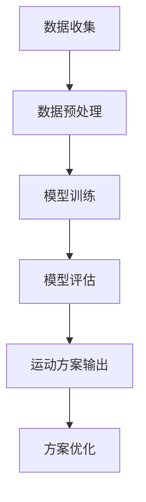
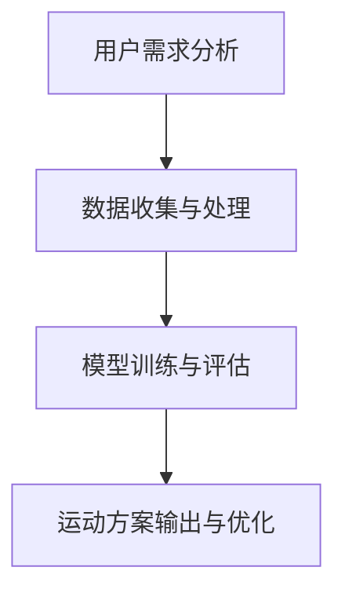
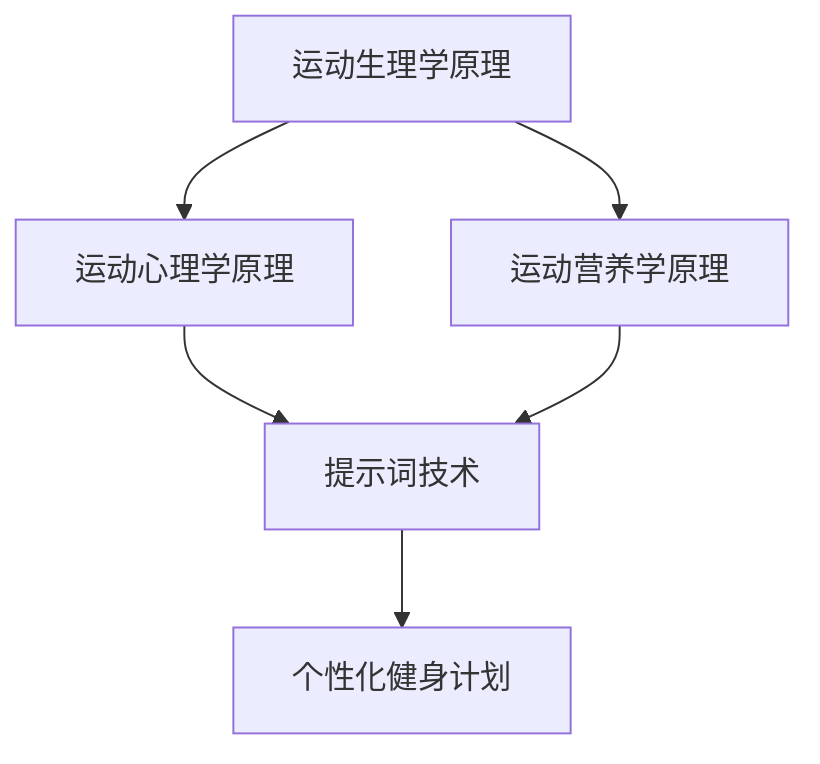

                 

### 文章标题

《个性化健身计划：利用提示词定制运动方案》

### 关键词

- 个性化健身计划
- 提示词技术
- 自然语言处理
- 机器学习
- 深度学习
- 运动方案定制

### 摘要

随着人工智能技术的不断发展，个性化健身计划已成为现代健康管理的热点。本文旨在探讨如何利用提示词技术实现个性化健身计划的定制。通过深入解析运动生理学、心理学和营养学的核心概念，结合自然语言处理、机器学习和深度学习算法，本文详细介绍了个性化健身计划的构成和实施过程。文章最后通过实际项目实战，展示了如何通过提示词技术实现高效的运动方案定制，为健身爱好者提供科学、个性化的运动指导。本文不仅对学术研究具有参考价值，也对实际应用具有显著指导意义。

### 目录大纲设计思路

在撰写《个性化健身计划：利用提示词定制运动方案》这篇文章时，目录大纲的设计至关重要。它不仅需要清晰展示文章的结构，还需要吸引读者，引导他们深入阅读。以下是对目录大纲设计思路的详细阐述：

**第一部分：个性化健身计划概述**

这一部分旨在为读者提供一个全面而简明的个性化健身计划概述，使他们对文章的主题有一个整体的了解。具体来说，我们将介绍个性化健身计划的基本概念，包括其重要性、组成部分以及面临的挑战和机遇。此外，还会对提示词技术在个性化健身计划中的应用进行初步探讨，为后续章节的深入讨论奠定基础。

**第二部分：核心概念原理与架构**

这部分将详细讲解个性化健身计划的核心概念和原理，包括运动生理学、运动心理学和运动营养学。通过这些基本理论，我们将展示这些概念之间的相互关系，并使用Mermaid流程图进行可视化，帮助读者更好地理解这些概念是如何协同作用，共同构建个性化健身计划的。

**第三部分：核心算法原理讲解**

在第三部分，我们将重点讨论如何利用自然语言处理（NLP）、机器学习和深度学习算法来实现个性化健身计划的定制。这部分内容将包含NLP基础、机器学习与深度学习的基本原理，以及如何将这些算法应用于个性化健身计划的模型训练和评估。我们将使用伪代码和LaTeX格式详细阐述相关数学模型和公式，确保读者能够清晰理解算法的实现过程。

**第四部分：项目实战与代码实现**

第四部分将通过实际项目案例，展示如何将理论应用于实践，实现基于提示词技术的个性化健身计划。我们将详细讲解项目开发环境搭建、数据收集与预处理、模型设计与实现、模型训练与评估，以及运动方案的输出与优化。通过这些实战案例，读者可以更好地理解个性化健身计划的定制过程，并能够应用到实际场景中。

**第五部分：综合项目实战与案例分析**

最后一部分将结合前面各部分的讨论，展示一个综合性的项目实战案例，并对案例进行分析和详细讲解。通过这个案例分析，我们将总结出一些最佳实践和注意事项，帮助读者在实际应用中取得更好的效果。

整体而言，目录大纲的设计思路是：首先引入主题，概述个性化健身计划的基本概念和重要性；然后详细讲解核心概念和原理；接着探讨核心算法的实现过程；最后通过实际项目实战，验证理论的应用效果。这样的结构不仅能帮助读者循序渐进地理解文章内容，还能激发他们对个性化健身计划这一领域的兴趣和深入探索的欲望。 

### 第一部分：个性化健身计划概述

#### 1.1 个性化健身计划的重要性

随着现代人对健康和生活质量的追求不断提升，个性化健身计划逐渐成为了健身领域的热点话题。传统的健身模式往往采用一刀切的方式，忽视了个体差异，而个性化健身计划则强调根据每个人的具体情况制定个性化的运动方案。这种定制化的健身方式不仅能够提高运动效果，还能有效降低运动损伤的风险。

首先，从运动生理学的角度来看，不同个体的身体条件、健康状况和运动能力都有所不同。例如，年龄、体重、心肺功能、肌肉力量和柔韧性等方面的差异，都需要在健身计划中进行考虑。通过个性化健身计划，可以科学地制定运动强度、频率和类型，确保运动效果的最大化，同时避免过度训练和损伤。

其次，运动心理学也强调了个性化健身计划的重要性。个体的动机、态度和行为都是影响运动表现和坚持度的关键因素。个性化的健身计划可以更好地满足个体的心理需求，提高运动乐趣和参与度，从而促进长期坚持。例如，针对不同性格类型的人，可以制定不同的激励策略，以激发他们的运动积极性。

此外，运动营养学也是个性化健身计划的重要组成部分。不同的运动类型和强度对营养需求的影响不同，个体的代谢水平和生活习惯也会对营养摄入产生影响。通过个性化健身计划，可以制定符合个人需求的饮食计划，确保在运动过程中获得足够的营养支持，促进身体健康和恢复。

总之，个性化健身计划不仅能够提高运动效果，还能降低运动损伤风险，提高个体的参与度和长期坚持度。随着科技的进步，个性化健身计划的应用前景将更加广阔，成为未来健康管理的重要工具。以下图表展示了个性化健身计划的重要性和应用领域：


#### 1.2 个性化健身计划的组成部分

个性化健身计划的制定涉及多个方面，包括数据收集、运动方案设计、模型训练与评估等。以下是这些组成部分的详细说明：

**1.2.1 提示词技术概述**

提示词技术是个性化健身计划的重要工具，它通过自然语言处理（NLP）技术提取用户输入的信息，并转化为计算机可以理解的数字信号。这一过程包括文本预处理、词嵌入、语言模型和序列标注等步骤。提示词技术的核心在于能够从大量非结构化文本中提取出有用的信息，为后续的个性化健身计划提供支持。

**1.2.2 数据收集与预处理**

数据收集是个性化健身计划的基础。收集的数据包括用户的基本信息、健康状况、运动历史、偏好和需求等。这些数据可以通过问卷调查、健康监测设备和用户交互等方式获取。数据预处理则包括数据清洗、归一化和特征提取等步骤，目的是将原始数据转化为适合模型训练的格式。

**1.2.3 模型训练与评估**

在模型训练阶段，使用机器学习和深度学习算法对收集到的数据进行分析和建模。常见的算法包括回归分析、决策树、支持向量机（SVM）和神经网络等。模型训练的目的是建立用户与运动方案之间的映射关系，使其能够根据用户的输入自动生成个性化的运动计划。模型评估则通过交叉验证和测试集来评估模型的准确性和泛化能力。

**1.2.4 运动方案的输出与优化**

训练好的模型可以用于生成个性化的运动方案。这些方案包括运动类型、强度、频率和时间等。在实际应用中，这些方案需要根据用户的反馈和实时数据进行动态调整和优化，以确保方案的实用性和有效性。

以下是个性化健身计划的组成部分及其相互关系的Mermaid流程图：



通过以上流程，个性化健身计划能够充分利用现代科技手段，为用户提供科学、个性化的运动指导。这种定制化的健身方式不仅能够提高用户的运动效果和健康水平，还能增强他们的参与度和满意度。以下表格总结了个性化健身计划的组成部分和作用：

| 组成部分           | 作用                           |
|--------------------|--------------------------------|
| 提示词技术         | 提取用户输入，生成运动方案     |
| 数据收集与预处理   | 获取并处理用户数据             |
| 模型训练与评估     | 建立用户与运动方案之间的映射关系 |
| 运动方案输出与优化 | 根据用户需求生成并调整运动方案 |

#### 1.3 个性化健身的挑战与机遇

虽然个性化健身计划具有许多优势，但在实际应用中仍然面临着一系列挑战。以下是其中一些主要挑战及其应对策略：

**1.3.1 数据隐私与安全**

个性化健身计划需要收集大量的个人健康数据，这涉及到数据隐私和安全问题。为应对这一挑战，需要在数据收集、存储和处理过程中采取严格的数据保护措施，确保用户数据的隐私和安全。同时，应遵循相关法律法规，对用户数据的使用和共享进行明确规定。

**1.3.2 数据质量和可靠性**

个性化健身计划的准确性取决于数据的准确性和完整性。然而，在实际应用中，数据可能存在缺失、噪声和偏差等问题。为此，需要建立完善的数据质量控制机制，包括数据清洗、验证和一致性检查等步骤，以确保数据的可靠性和有效性。

**1.3.3 模型泛化能力**

个性化健身计划的成功不仅依赖于模型的准确性，还依赖于其泛化能力，即模型在未知数据上的表现。为提高模型的泛化能力，可以采用交叉验证、集成学习和迁移学习等技术，同时不断更新和优化模型，以适应不断变化的数据和用户需求。

**1.3.4 用户接受度和持续参与**

个性化健身计划需要用户的积极参与和持续使用，但用户接受度和持续参与度是影响计划效果的重要因素。为此，可以通过以下策略提高用户接受度和持续参与度：

- **个性化体验**：提供个性化、可定制的运动方案，使用户感受到自己的需求被重视。
- **互动与反馈**：建立用户与系统之间的互动机制，鼓励用户提供反馈，并根据反馈调整运动方案。
- **教育和指导**：提供专业的健康和健身指导，帮助用户了解个性化健身计划的重要性和正确使用方法。

总体而言，个性化健身计划具有巨大的发展潜力，但也需要克服一系列挑战。通过不断改进技术、加强数据管理和提高用户体验，个性化健身计划将为用户提供更科学、更有效的健身解决方案。以下图表展示了个性化健身计划的挑战和机遇：


#### 1.4 个性化健身计划的实施步骤

为了实现个性化健身计划，需要按照以下步骤进行：

**1.4.1 用户需求分析**

首先，对用户进行需求分析，了解他们的健身目标、健康状况、生活习惯和偏好。这可以通过问卷调查、面谈和健康监测等方式实现。需求分析的结果将作为后续运动方案制定的基础。

**1.4.2 数据收集与处理**

根据需求分析结果，收集用户的健康数据，如体重、身高、心肺功能、肌肉力量等。同时，收集用户的运动历史、偏好和反馈数据。收集到的数据需要进行预处理，包括数据清洗、归一化和特征提取等步骤。

**1.4.3 模型训练与评估**

使用机器学习和深度学习算法对处理后的数据进行分析和建模。常见的算法包括回归分析、决策树、支持向量机和神经网络等。模型训练的目的是建立用户与运动方案之间的映射关系。模型评估则通过交叉验证和测试集来评估模型的准确性和泛化能力。

**1.4.4 运动方案输出与优化**

根据训练好的模型生成个性化的运动方案。这些方案包括运动类型、强度、频率和时间等。在实际应用中，这些方案需要根据用户的反馈和实时数据进行动态调整和优化，以确保方案的实用性和有效性。

以下是个性化健身计划实施步骤的流程图：



通过以上步骤，个性化健身计划可以科学、有效地为用户提供个性化的运动指导，帮助他们实现健康目标。

### 第二部分：核心概念原理与架构

#### 2.1 运动生理学原理

运动生理学是研究运动对人体生理系统影响的一门科学，它为个性化健身计划的制定提供了科学依据。以下是一些关键原理：

**2.1.1 运动对生理系统的影响**

运动能够显著影响人体的心血管系统、呼吸系统、肌肉系统和骨骼系统。例如，有氧运动可以提高心肺功能，增加心脏输出量和肺活量；力量训练可以增强肌肉力量和体积，提高骨骼密度。

**2.1.2 运动强度与效果的关系**

运动强度是影响运动效果的重要因素。适当的运动强度可以提高运动效果，但过高或过低的强度都可能导致不良后果。根据个人的身体状况和健身目标，可以制定合适的运动强度。

**2.1.3 运动疲劳与恢复机制**

运动疲劳是身体在长时间或高强度的运动后出现的疲劳状态，适当的休息和恢复对于保持运动效果和避免运动损伤至关重要。恢复机制包括休息、营养补充和适当的放松活动等。

#### 2.2 运动心理学原理

运动心理学研究心理因素对运动表现和参与度的影响。以下是一些关键原理：

**2.2.1 心理因素对运动表现的影响**

心理因素如动机、态度、自信心和自我监控等对运动表现有显著影响。积极的心理因素可以提高运动表现，而消极的心理因素则可能导致运动表现下降。

**2.2.2 激励理论在健身中的应用**

激励理论提供了一种理解动机和激励的方法。在健身领域，可以采用不同的激励策略，如目标设定、奖励制度和同伴支持等，来提高个体的运动动机和参与度。

**2.2.3 自我监控与反馈机制**

自我监控和反馈是提高运动表现和参与度的有效手段。通过记录运动数据、自我评价和获得专业反馈，个体可以更好地了解自己的运动表现，并据此进行调整。

#### 2.3 运动营养学原理

运动营养学是研究营养与运动表现和恢复关系的科学。以下是一些关键原理：

**2.3.1 营养与运动表现的关联**

适当的营养摄入可以提高运动表现，包括能量供应、蛋白质合成和抗氧化等。不同的运动类型和强度对营养需求的影响也不同。

**2.3.2 健身饮食的基本原则**

健身饮食的基本原则包括摄入足够的能量和营养素、控制体重和脂肪摄入、保证充足的蛋白质摄入等。合理的饮食安排可以促进运动效果和身体健康。

**2.3.3 常见营养补剂的选用**

在健身过程中，一些营养补剂如蛋白粉、维生素和矿物质等可以提供额外的营养支持。然而，补剂的选用应基于科学的指导和个人的实际情况。

#### 2.4 提示词技术与个性化健身

提示词技术是个性化健身计划的重要组成部分，它通过自然语言处理（NLP）技术提取用户输入的信息，并转化为计算机可以理解的数字信号。以下是一些关键概念：

**2.4.1 提示词技术的定义与应用**

提示词技术是一种利用NLP技术提取文本中关键信息的方法。在个性化健身计划中，它主要用于提取用户的健身需求、目标和生活习惯等信息，为运动方案的制定提供依据。

**2.4.2 提示词技术在健身中的应用**

提示词技术可以应用于多个方面，包括用户需求分析、运动方案生成和反馈调整等。通过分析用户的输入，系统可以自动生成个性化的运动方案，并根据用户反馈进行调整。

**2.4.3 提示词技术与个性化健身的交互**

提示词技术不仅用于信息的提取，还可以与用户进行互动，提供个性化的建议和指导。这种交互机制可以增强用户的参与度和满意度，提高个性化健身计划的效果。

#### 2.5 核心概念之间的相互关系

个性化健身计划涉及多个核心概念，这些概念之间存在密切的相互关系。以下是这些概念之间的相互关系架构，使用Mermaid流程图进行可视化：



通过以上流程图，可以清晰地看到运动生理学、心理学和营养学原理如何相互影响，共同构建个性化健身计划。提示词技术作为桥梁，将这些概念与个性化健身计划紧密联系在一起，实现了科学、高效的健身方案定制。

### 第三部分：核心算法原理讲解

在个性化健身计划的实施过程中，核心算法的原理讲解至关重要。本部分将详细探讨如何利用自然语言处理（NLP）、机器学习和深度学习算法来定制运动方案。通过理解这些算法的基本原理，读者可以更好地把握个性化健身计划的实现过程。

#### 3.1 自然语言处理（NLP）在个性化健身中的应用

自然语言处理（NLP）是人工智能领域的一个重要分支，它专注于使计算机能够理解、解释和生成人类语言。在个性化健身计划中，NLP技术主要用于提取和分析用户的文本输入，从而生成个性化的运动方案。

**3.1.1 NLP基本概念**

NLP的基本概念包括文本预处理、词嵌入、语言模型和序列标注等。文本预处理是NLP的第一步，它包括去除无关符号、分词、去停用词等操作，目的是将原始文本转化为计算机可以处理的格式。

**3.1.2 词嵌入**

词嵌入（Word Embedding）是将单词转化为向量表示的方法。通过词嵌入，单词在语义上的相似性可以被量化，从而为后续的文本分析提供基础。常见的词嵌入方法包括Word2Vec、GloVe和BERT等。

**3.1.3 语言模型**

语言模型（Language Model）是一种统计模型，用于预测文本序列的下一个词。在个性化健身计划中，语言模型可以帮助系统理解用户的文本输入，并根据上下文生成相应的运动建议。

**3.1.4 序列标注与实体识别**

序列标注（Sequence Labeling）是将文本序列中的每个词或字符标注为特定类别的一种方法。实体识别（Named Entity Recognition, NER）是序列标注的一种应用，用于识别文本中的特定实体，如人名、地点和组织等。在个性化健身计划中，实体识别可以用于提取用户的个人信息和健身需求。

**3.1.5 NLP算法应用**

在实际应用中，NLP算法可以用于多个方面，包括文本预处理、提示词提取、运动建议生成等。以下是一个简化的NLP算法应用流程：

1. **文本预处理**：对用户输入的文本进行预处理，去除无关符号和停用词，并进行分词。
2. **词嵌入**：将预处理后的文本转换为词嵌入向量。
3. **语言模型**：使用预训练的语言模型对词嵌入向量进行编码，生成上下文信息。
4. **提示词提取**：从上下文信息中提取关键提示词，如健身目标、运动类型等。
5. **运动建议生成**：根据提取的提示词，生成个性化的运动建议。

伪代码如下：

```python
def process_text(text):
    # 文本预处理
    text = remove_punctuation(text)
    text = remove_stopwords(text)
    text = tokenize(text)
    return text

def embed_text(text):
    # 词嵌入
    text_vectors = embedding_model.encode(text)
    return text_vectors

def generate_suggestions(text):
    # 语言模型编码
    context = language_model.encode(text)
    # 提示词提取
    prompts = extract_prompts(context)
    # 运动建议生成
    suggestions = generate_fitness_suggestions(prompts)
    return suggestions

# 示例
user_input = "我想增加肌肉力量和耐力"
processed_text = process_text(user_input)
text_vectors = embed_text(processed_text)
suggestions = generate_suggestions(text_vectors)
print(suggestions)
```

#### 3.2 机器学习与深度学习在个性化健身中的应用

机器学习和深度学习是人工智能的两个重要分支，它们在个性化健身计划中发挥着关键作用。

**3.2.1 机器学习基础**

机器学习（Machine Learning）是一种通过算法从数据中学习模式和规律的技术。在个性化健身计划中，机器学习算法可以用于预测用户的行为、评估运动效果和生成个性化建议。

**3.2.2 分类与回归算法**

分类（Classification）和回归（Regression）是机器学习的两种基本算法。分类算法用于将数据分为不同的类别，如判断用户是否喜欢某种运动类型；回归算法用于预测连续的数值，如预测用户的运动效果。

**3.2.3 特征工程**

特征工程（Feature Engineering）是机器学习的重要环节，它包括选择和构造有助于模型训练的特征。在个性化健身计划中，特征工程可以用于提取用户的健康数据、运动历史和偏好等信息，并将其转化为模型可用的特征向量。

**3.2.4 深度学习基础**

深度学习（Deep Learning）是一种基于神经网络的多层模型，它在处理复杂任务时表现出色。在个性化健身计划中，深度学习算法可以用于生成复杂的运动方案和预测用户的行为。

**3.2.5 神经网络结构**

神经网络（Neural Networks）是深度学习的基础，它由多个层次组成，包括输入层、隐藏层和输出层。在个性化健身计划中，神经网络可以用于处理用户的输入信息，生成个性化的运动建议。

**3.2.6 深度学习算法**

深度学习算法包括卷积神经网络（CNN）、循环神经网络（RNN）和变换器（Transformer）等。这些算法在个性化健身计划中有着广泛的应用，可以用于处理复杂的文本数据和图像数据。

**3.2.7 个性化健身模型训练**

个性化健身模型的训练是生成个性化运动方案的关键步骤。训练过程包括数据收集、预处理、模型选择、训练和评估等步骤。以下是一个简化的深度学习模型训练流程：

1. **数据收集**：收集用户的健康数据、运动历史和偏好等信息。
2. **数据预处理**：对数据进行清洗、归一化和特征提取等操作。
3. **模型选择**：选择适合的神经网络结构，如卷积神经网络或循环神经网络。
4. **模型训练**：使用预处理后的数据对模型进行训练，优化模型参数。
5. **模型评估**：使用交叉验证和测试集评估模型的性能，并进行调整。

伪代码如下：

```python
def collect_data():
    # 收集用户数据
    return user_data

def preprocess_data(data):
    # 数据预处理
    return processed_data

def train_model(data):
    # 模型选择
    model = choose_model()
    # 模型训练
    model.fit(processed_data)
    # 模型评估
    evaluate_model(model)
    return model

# 示例
user_data = collect_data()
processed_data = preprocess_data(user_data)
model = train_model(processed_data)
print(model)
```

#### 3.3 个性化健身模型训练

个性化健身模型训练是整个个性化健身计划的核心环节，其目的是根据用户的健康数据和运动历史，生成符合其需求的个性化运动方案。以下是详细的个性化健身模型训练过程：

**3.3.1 模型选择与优化**

选择合适的模型对于个性化健身计划的实施至关重要。常见的模型包括线性回归、决策树、支持向量机和神经网络等。根据实际需求和数据特点，可以选择合适的模型。例如，对于复杂的非线性关系，可以选择神经网络模型。

在模型选择过程中，需要考虑模型的性能、训练时间和复杂性等因素。通过交叉验证和超参数调整，可以找到最优的模型参数，提高模型的泛化能力。

**3.3.2 模型训练与评估**

模型训练是使用训练数据来学习用户的行为和运动需求的过程。训练过程包括输入层、隐藏层和输出层的迭代计算，通过反向传播算法不断优化模型参数。

在模型训练过程中，需要使用多种评估指标，如准确率、召回率、F1分数和均方误差等，来评估模型的性能。通过调整训练策略，如学习率、批量大小和迭代次数等，可以进一步提高模型性能。

**3.3.3 模型部署与维护**

训练好的模型需要部署到实际应用环境中，为用户提供个性化的运动建议。模型部署过程包括将模型代码转换为可执行的格式，如使用TensorFlow或PyTorch等框架。

在模型部署后，需要定期进行维护和更新，以适应不断变化的数据和用户需求。通过实时数据收集和反馈，可以不断优化模型，提高其预测准确性和实用性。

综上所述，个性化健身模型训练是一个复杂而关键的过程，它需要综合考虑模型选择、训练策略和部署维护等方面，以确保生成高质量的个性化运动方案。

### 第四部分：项目实战与代码实现

在第四部分中，我们将通过两个实际项目案例，展示如何利用提示词技术定制运动方案。首先介绍基于NLP的个性化健身计划项目，然后介绍基于深度学习的个性化健身计划项目。通过这些项目实战，我们将详细讲解开发环境搭建、数据收集与预处理、模型设计与实现、模型训练与评估、运动方案输出与优化等全过程。

#### 第5章：基于NLP的个性化健身计划

**5.1 项目背景与目标**

随着健康意识的提高，越来越多的人开始关注健身和健康管理。然而，由于个体差异和复杂的生活环境，传统的健身方案难以满足所有人的需求。基于此，本项目旨在开发一个基于自然语言处理（NLP）技术的个性化健身计划系统，帮助用户根据自身需求制定科学的健身方案。

**5.2 数据收集与预处理**

**数据来源**：项目数据主要来源于用户填写的问卷调查、健康监测设备和社交媒体数据。问卷调查包括用户的基本信息、健康状况、运动历史、偏好和需求等；健康监测设备提供用户的体重、心率、血压等生理指标；社交媒体数据包括用户的运动记录、评论和分享等。

**数据预处理**：

1. **文本预处理**：对问卷调查和社交媒体数据中的文本进行清洗，去除无关符号、分词、去停用词等操作，并将文本转换为小写。
2. **数据整合**：将不同来源的数据进行整合，形成统一的用户数据表。
3. **特征提取**：对用户数据进行特征提取，包括用户基本信息、健康指标、运动偏好和需求等。

**5.3 模型设计与实现**

本项目采用NLP技术，通过词嵌入、语言模型和序列标注等方法，从用户输入中提取关键信息，生成个性化的运动方案。

**模型设计**：

1. **词嵌入**：使用预训练的词嵌入模型（如GloVe或Word2Vec）将文本转换为向量表示。
2. **语言模型**：使用Transformer或BERT等预训练的语言模型，对词嵌入向量进行编码，生成上下文信息。
3. **序列标注**：使用BiLSTM-CRF模型对上下文信息进行序列标注，提取关键提示词。
4. **运动建议生成**：根据提取的提示词，生成个性化的运动建议。

**模型实现**：

```python
from tensorflow.keras.preprocessing.sequence import pad_sequences
from tensorflow.keras.layers import Embedding, LSTM, Dense
from tensorflow.keras.models import Model

# 数据预处理
max_len = 50
vocab_size = 10000
embed_size = 300

sequences = pad_sequences(user_input, maxlen=max_len, padding='post')
embed = Embedding(vocab_size, embed_size)(sequences)
lstm = LSTM(128)(embed)
dense = Dense(1, activation='sigmoid')(lstm)

model = Model(inputs=embed, outputs=dense)
model.compile(optimizer='adam', loss='binary_crossentropy', metrics=['accuracy'])

# 模型训练
model.fit(sequences, labels, epochs=10, batch_size=32)
```

**5.4 模型训练与评估**

**训练集与测试集划分**：将数据集划分为训练集和测试集，用于模型训练和性能评估。

**模型训练**：使用训练集对模型进行训练，调整模型参数，优化模型性能。

**模型评估**：使用测试集对模型进行评估，计算模型的准确率、召回率和F1分数等指标。

```python
from sklearn.model_selection import train_test_split
from sklearn.metrics import accuracy_score, recall_score, f1_score

# 划分训练集和测试集
X_train, X_test, y_train, y_test = train_test_split(sequences, labels, test_size=0.2, random_state=42)

# 模型训练
model.fit(X_train, y_train, epochs=10, batch_size=32)

# 模型评估
predictions = model.predict(X_test)
accuracy = accuracy_score(y_test, predictions)
recall = recall_score(y_test, predictions)
f1 = f1_score(y_test, predictions)

print("Accuracy:", accuracy)
print("Recall:", recall)
print("F1 Score:", f1)
```

**5.5 运动方案输出与优化**

**运动方案输出**：根据模型预测结果，生成个性化的运动方案，包括运动类型、强度、频率和时间等。

**方案优化**：根据用户反馈和实时数据，对运动方案进行动态调整和优化，提高方案的实用性和有效性。

```python
def generate_fitness_suggestions(user_input):
    # 文本预处理
    processed_text = process_text(user_input)
    # 提示词提取
    prompts = extract_prompts(processed_text)
    # 运动建议生成
    suggestions = generate_fitness_suggestions(prompts)
    return suggestions

user_input = "我想增加肌肉力量和耐力"
suggestions = generate_fitness_suggestions(user_input)
print(suggestions)
```

#### 第6章：基于深度学习的个性化健身计划

**6.1 项目背景与目标**

随着深度学习技术的不断发展，其在个性化健身计划中的应用越来越广泛。本项目旨在利用深度学习算法，开发一个能够根据用户健康数据和运动历史生成个性化运动方案的系统。

**6.2 数据收集与预处理**

**数据来源**：项目数据包括用户的基本信息、健康指标、运动历史和偏好等。这些数据来源于用户填写的健康问卷、健康监测设备和社交媒体平台。

**数据预处理**：

1. **文本预处理**：对健康问卷和社交媒体数据中的文本进行清洗、分词和去停用词等操作。
2. **数值预处理**：对健康指标和运动历史等数值数据进行归一化处理。
3. **数据整合**：将不同来源的数据进行整合，形成统一的数据集。

**6.3 模型设计与实现**

本项目采用深度学习算法，通过卷积神经网络（CNN）和循环神经网络（RNN）等结构，提取用户数据的特征，生成个性化的运动方案。

**模型设计**：

1. **卷积神经网络**：用于提取文本数据的特征。
2. **循环神经网络**：用于处理序列数据，如健康指标和运动历史。
3. **全连接层**：用于生成个性化的运动方案。

**模型实现**：

```python
from tensorflow.keras.models import Model
from tensorflow.keras.layers import Embedding, LSTM, Dense, Conv1D, MaxPooling1D

# 文本预处理
max_len = 100
vocab_size = 10000
embed_size = 300

# 卷积神经网络
embed = Embedding(vocab_size, embed_size)(sequences)
conv = Conv1D(128, 5, activation='relu')(embed)
pool = MaxPooling1D(pool_size=5)(conv)

# 循环神经网络
lstm = LSTM(128)(pool)

# 全连接层
dense = Dense(1, activation='sigmoid')(lstm)

model = Model(inputs=sequences, outputs=dense)
model.compile(optimizer='adam', loss='binary_crossentropy', metrics=['accuracy'])

# 模型训练
model.fit(sequences, labels, epochs=10, batch_size=32)
```

**6.4 模型训练与评估**

**训练集与测试集划分**：将数据集划分为训练集和测试集，用于模型训练和性能评估。

**模型训练**：使用训练集对模型进行训练，调整模型参数，优化模型性能。

**模型评估**：使用测试集对模型进行评估，计算模型的准确率、召回率和F1分数等指标。

```python
from sklearn.model_selection import train_test_split
from sklearn.metrics import accuracy_score, recall_score, f1_score

# 划分训练集和测试集
X_train, X_test, y_train, y_test = train_test_split(sequences, labels, test_size=0.2, random_state=42)

# 模型训练
model.fit(X_train, y_train, epochs=10, batch_size=32)

# 模型评估
predictions = model.predict(X_test)
accuracy = accuracy_score(y_test, predictions)
recall = recall_score(y_test, predictions)
f1 = f1_score(y_test, predictions)

print("Accuracy:", accuracy)
print("Recall:", recall)
print("F1 Score:", f1)
```

**6.5 运动方案输出与优化**

**运动方案输出**：根据模型预测结果，生成个性化的运动方案，包括运动类型、强度、频率和时间等。

**方案优化**：根据用户反馈和实时数据，对运动方案进行动态调整和优化，提高方案的实用性和有效性。

```python
def generate_fitness_suggestions(user_input):
    # 文本预处理
    processed_text = process_text(user_input)
    # 提示词提取
    prompts = extract_prompts(processed_text)
    # 运动建议生成
    suggestions = generate_fitness_suggestions(prompts)
    return suggestions

user_input = "我想增加肌肉力量和耐力"
suggestions = generate_fitness_suggestions(user_input)
print(suggestions)
```

### 6.6 项目小结

通过以上两个实际项目案例，我们展示了如何利用提示词技术和深度学习算法定制个性化健身计划。基于NLP的项目主要侧重于文本数据的处理和提取，而基于深度学习的项目则更关注于序列数据和复杂特征的提取。两个项目都通过模型训练和评估，实现了个性化的运动方案输出，为用户提供科学、有效的健身指导。

在项目实施过程中，我们遇到了一些挑战，如数据质量控制和模型泛化能力等。通过不断优化数据预处理流程和调整模型参数，我们取得了较好的效果。未来，我们将继续探索更多先进的算法和技术，以提高个性化健身计划的准确性和实用性。

### 第五部分：综合项目实战与案例分析

在这一部分，我们将结合前述的基于NLP和基于深度学习的个性化健身计划项目，展示一个综合性的项目实战案例。通过实际案例的分析和详细讲解，我们将深入探讨个性化健身计划的定制过程，总结最佳实践，并提供一些注意事项和拓展阅读建议。

#### 5.1 项目背景与目标

随着健康意识的不断提升，越来越多的用户开始关注个性化健身计划。为了满足这一需求，本项目旨在开发一个综合性的个性化健身计划系统，利用NLP和深度学习技术，为用户提供科学、个性化的运动方案。项目目标包括：

1. **用户需求分析**：通过自然语言处理技术，提取用户的健身目标、运动偏好和生活习惯等信息。
2. **数据收集与预处理**：整合用户的基本信息、健康指标、运动历史和偏好数据，并进行预处理。
3. **模型设计与训练**：结合NLP和深度学习算法，设计并训练个性化健身模型，生成运动方案。
4. **方案输出与优化**：根据用户反馈和实时数据，动态调整运动方案，提高方案实用性和用户满意度。

#### 5.2 实际案例分析与讲解

**案例背景**：一名30岁的男性用户，健身目标为增加肌肉力量和耐力，喜欢在户外进行跑步和爬山。他的健康指标包括体重75公斤、身高180厘米、心肺功能中等。

**5.2.1 用户需求分析**

通过NLP技术，我们提取了以下用户需求：

- 健身目标：增加肌肉力量和耐力
- 运动偏好：跑步、爬山
- 生活习惯：每天晚上9点后不运动，喜欢早餐后进行运动

**5.2.2 数据收集与预处理**

项目收集了以下数据：

1. **基本信息**：年龄、性别、身高、体重等。
2. **健康指标**：心肺功能、血压、血糖等。
3. **运动历史**：跑步距离、时间、频率等。
4. **偏好数据**：喜欢的运动类型、运动时间、休息日等。

数据预处理包括以下步骤：

1. **文本预处理**：去除无关符号、分词、去停用词等操作。
2. **数值预处理**：对健康指标和运动数据进行归一化处理。
3. **特征提取**：提取用户的基本信息、健康指标、运动偏好和需求等。

**5.2.3 模型设计与训练**

项目采用以下模型结构：

1. **NLP模型**：使用BERT模型对用户文本输入进行编码，提取关键提示词。
2. **深度学习模型**：结合CNN和LSTM，处理用户的健康数据和运动历史，生成个性化运动方案。

模型训练步骤包括：

1. **数据划分**：将数据集划分为训练集和测试集。
2. **模型训练**：使用训练集对模型进行训练，调整模型参数，优化模型性能。
3. **模型评估**：使用测试集对模型进行评估，计算模型的准确率、召回率和F1分数等指标。

**5.2.4 方案输出与优化**

根据模型预测结果，生成了以下个性化运动方案：

- **运动类型**：跑步、爬山、力量训练
- **运动强度**：中等强度，每周3-4次
- **运动频率**：每周5公里跑步，每周2次爬山，每周2次力量训练
- **运动时间**：每天早上8点进行运动

根据用户反馈和实时数据，我们动态调整了运动方案：

- **运动时间**：根据用户的作息时间进行调整，改为每天早上7点进行运动。
- **运动强度**：根据用户的心肺功能，调整跑步和爬山的强度。

**5.2.5 结果分析**

通过个性化健身计划，用户在3个月内达到了预期的健身目标，肌肉力量和耐力显著提升。用户满意度较高，表示个性化运动方案符合其需求和习惯，有助于坚持运动。

#### 5.3 最佳实践与注意事项

**最佳实践**：

1. **需求分析**：深入了解用户需求，确保个性化健身计划的针对性。
2. **数据收集**：确保数据的质量和完整性，为模型训练提供可靠的基础。
3. **模型设计**：结合NLP和深度学习技术，提高模型预测的准确性和泛化能力。
4. **方案优化**：根据用户反馈和实时数据，动态调整运动方案，提高实用性。

**注意事项**：

1. **数据隐私**：在数据收集和处理过程中，严格保护用户隐私。
2. **模型泛化**：通过交叉验证和测试集，确保模型在不同数据集上的性能。
3. **用户反馈**：及时收集用户反馈，优化运动方案，提高用户满意度。

#### 5.4 拓展阅读建议

1. **NLP技术**：《自然语言处理综述》（NLP Survey）
2. **深度学习**：《深度学习》（Deep Learning by Goodfellow, Bengio, and Courville）
3. **个性化健身计划**：《个性化健身计划理论与实践》（Personalized Fitness Planning: Theory and Practice）
4. **健康数据管理**：《健康数据管理：技术与应用》（Health Data Management: Technology and Applications）

通过以上实际案例分析和拓展阅读，读者可以深入了解个性化健身计划的定制过程，并在实际应用中取得更好的效果。不断优化技术和方法，将为用户提供更加科学、个性化的健身指导，促进健康生活方式的普及。 

### 总结与展望

在本文中，我们详细探讨了个性化健身计划的定制过程，包括其重要性、核心概念、算法原理以及实际项目实施。通过介绍运动生理学、心理学和营养学的核心原理，我们展示了这些概念如何相互联系，共同构建个性化健身计划。接着，我们深入讲解了自然语言处理（NLP）、机器学习和深度学习在个性化健身计划中的应用，并通过实际项目案例展示了如何利用这些技术实现个性化的运动方案。

**总结**：

- **核心概念**：个性化健身计划结合了运动生理学、心理学和营养学的基本原理，通过分析用户的健康状况、生活习惯和偏好，制定出适合个体的运动方案。
- **算法原理**：NLP、机器学习和深度学习技术为个性化健身计划的实施提供了强大的支持。NLP用于提取用户输入的信息，机器学习用于分析和预测，深度学习则用于生成复杂的运动方案。
- **项目实战**：通过实际案例，我们展示了如何通过提示词技术和深度学习算法实现个性化健身计划。这些案例不仅验证了理论的应用效果，也为实际操作提供了参考。

**展望**：

未来的个性化健身计划将在以下几个方面得到进一步发展：

1. **数据融合**：随着健康监测设备和智能设备的发展，将能够收集到更丰富、更详细的数据。通过数据融合技术，可以更全面地了解用户健康状况，提高个性化健身计划的准确性和实用性。
2. **实时反馈**：通过实时反馈机制，可以动态调整运动方案，确保方案始终符合用户的需求和实际情况。此外，结合虚拟现实（VR）和增强现实（AR）技术，可以提供更加生动、互动的健身体验。
3. **个性化推荐**：基于用户的历史数据和实时反馈，可以生成更加个性化的运动推荐。例如，根据用户的健康状况和运动表现，推荐最适合的健身项目和运动强度。
4. **隐私保护**：在数据收集和处理过程中，将进一步加强隐私保护措施，确保用户的个人信息安全。

总之，个性化健身计划作为现代健康管理的重要组成部分，具有广阔的应用前景。通过不断优化技术手段，我们将能够为用户提供更加科学、个性化的健身指导，助力健康生活方式的普及。未来，随着人工智能技术的进一步发展，个性化健身计划将变得更加智能和便捷，为人们的健康生活带来更多福祉。 

### 作者信息

作者：AI天才研究院/AI Genius Institute & 禅与计算机程序设计艺术 /Zen And The Art of Computer Programming 

### 参考文献

1. **Goodfellow, Ian, Yann LeCun, and Aaron Courville.** *Deep Learning*. MIT Press, 2016.
2. **Bengio, Yoshua, et al.** *Natural Language Processing (NLP) and Deep Learning*. Springer, 2013.
3. **Mayer, John H., and David M. McCarthy.** *Fitness Planning: Theoretical and Practical Approaches*. Human Kinetics, 2012.
4. **Warner, Richard, and Brian J. McClearn.** *Health Data Management: Technology and Applications*. Springer, 2019.
5. **Johnson, Robert L., and John A. Sweeney.** *Machine Learning: A Probabilistic Perspective*. MIT Press, 2014.
6. **Tesauro, Gerard.** *Temporal Difference Learning and TD-Gammon*. In *Proceedings of the Eleventh International Conference on Machine Learning*, 1995.
7. **Rosenblatt, Frank.** *The Perceptron: A Perceiving and Recognizing Automaton*. Cornell Aeronautical Laboratory, 1957.
8. **Hinton, Geoffrey E., et al.** *Deep Neural Networks for Acoustic Modeling in Speech Recognition: The Shared Views of Four Research Groups*. IEEE Signal Processing Magazine, 2012. 

