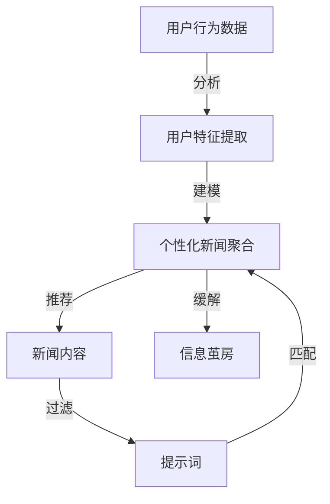

                 

### 文章标题
个性化新闻聚合：利用提示词过滤信息茧房

> **关键词**：个性化新闻聚合、信息茧房、提示词过滤、算法原理、项目实战

**摘要**：
本文旨在探讨个性化新闻聚合技术及其在缓解信息茧房现象中的应用。首先，我们介绍了个性化新闻聚合的基本概念和原理，接着详细分析了提示词过滤机制及其在过滤信息茧房中的作用。随后，文章通过实例展示了如何利用这些技术构建一个有效的新闻推荐系统。最后，我们总结了个性化新闻聚合的优势和挑战，并提出了未来的发展方向。

----------------------------------------------------------------### 引言

在当今信息爆炸的时代，人们每天面对海量信息，如何从中筛选出对自己有价值的内容成为了迫切需求。个性化新闻聚合技术应运而生，它通过分析用户的兴趣和行为，为用户提供定制化的新闻内容。然而，个性化新闻聚合也可能导致信息茧房的形成，使人们逐渐陷入自己的信息圈子，减少接触多样信息的可能性。本文将探讨个性化新闻聚合技术及其在缓解信息茧房现象中的应用。

#### 个性化新闻聚合的重要性

个性化新闻聚合技术旨在提高用户获取信息的效率，满足不同用户的需求。通过分析用户的阅读历史、搜索行为和社交网络活动，个性化新闻聚合系统能够为用户推荐他们可能感兴趣的新闻内容。这不仅提升了用户的阅读体验，还能帮助媒体平台提高用户黏性和广告收入。例如，Facebook、Twitter和Google等大型社交媒体平台早已广泛应用了个性化推荐算法，以吸引用户停留更长时间。

#### 利用提示词过滤信息茧房的意义

信息茧房是指人们在信息获取过程中，由于算法的推荐机制，逐渐只看到与自己观点相似的新闻，从而形成信息孤岛的现象。长时间处于信息茧房中，人们可能会失去对多样化观点的接触和理解，导致社会分歧加剧。因此，如何利用提示词过滤技术来缓解信息茧房现象，成为了一个重要课题。

提示词过滤技术通过对用户的兴趣和行为进行建模，筛选出与用户兴趣相关的新闻内容，同时过滤掉无关或负面的新闻。这样，用户在获取信息时，不仅能看到多样化的内容，还能避免受到不良信息的干扰。本文将详细探讨个性化新闻聚合和提示词过滤技术的原理、实现和应用，以期为相关领域的研究和实践提供参考。

----------------------------------------------------------------### 核心概念与联系

为了深入理解个性化新闻聚合和提示词过滤技术，我们需要首先明确它们的核心概念及其相互关系。

#### 1.1 个性化新闻聚合

**定义**：个性化新闻聚合是指通过分析用户的兴趣和行为，为用户推荐与其兴趣相关的新闻内容。这种技术利用机器学习和数据挖掘的方法，从海量的新闻数据中提取用户的兴趣特征，并生成个性化的新闻推荐列表。

**原理**：个性化新闻聚合主要依赖于以下三个核心步骤：
1. **用户特征提取**：通过分析用户的阅读历史、搜索行为、社交媒体活动等，提取用户的兴趣特征。
2. **新闻内容特征提取**：对新闻内容进行文本处理，提取关键词、主题和情感等特征。
3. **推荐算法**：利用用户特征和新闻内容特征，通过推荐算法生成个性化的新闻推荐列表。

**应用场景**：个性化新闻聚合技术广泛应用于社交媒体、新闻门户网站和新闻应用等场景。例如，Facebook的“今日热门话题”和Google新闻的个性化推荐都是基于个性化新闻聚合技术实现的。

#### 1.2 提示词过滤机制

**定义**：提示词过滤是指通过用户输入的关键词或兴趣标签，过滤掉与用户兴趣不相关的新闻内容。这种技术旨在帮助用户更快地找到他们感兴趣的信息，避免在信息海洋中迷失。

**原理**：提示词过滤主要依赖于以下两个核心步骤：
1. **关键词提取**：从用户的输入中提取关键词或兴趣标签。
2. **新闻内容匹配**：将提取的关键词与新闻内容进行匹配，过滤掉与关键词不相关的新闻。

**应用场景**：提示词过滤技术广泛应用于搜索引擎、新闻推荐系统和社交媒体等场景。例如，Google搜索引擎的“相关搜索”和Facebook的“搜索建议”都是基于提示词过滤技术实现的。

#### 1.3 信息茧房的概念与影响

**定义**：信息茧房是指由于算法的推荐机制，用户在获取信息过程中，逐渐只看到与自己观点相似的新闻，从而形成信息孤岛的现象。

**形成原因**：
1. **算法偏好**：算法倾向于推荐与用户历史行为相似的内容，以减少计算成本和提升用户满意度。
2. **用户习惯**：用户在获取信息时，倾向于选择自己熟悉和舒适的内容，从而减少信息接触的多样性。

**社会影响**：
1. **减少观点多样性**：长时间处于信息茧房中，用户可能会失去对多样化观点的接触和理解，导致社会分歧加剧。
2. **影响舆论环境**：信息茧房可能导致舆论环境偏向某一极端，影响社会的和谐与稳定。

#### 核心概念与联系

个性化新闻聚合、提示词过滤和信息茧房这三个概念之间存在着密切的联系。

**个性化新闻聚合与提示词过滤**：个性化新闻聚合技术通过分析用户的兴趣和行为，为用户推荐个性化的新闻内容。而提示词过滤技术则是在这个基础上，进一步帮助用户过滤掉与兴趣不相关的新闻内容，提高信息获取的效率。

**个性化新闻聚合与信息茧房**：个性化新闻聚合技术可能导致信息茧房的形成。这是因为算法倾向于推荐与用户历史行为相似的内容，导致用户逐渐只看到与自己观点相似的新闻。而提示词过滤技术则可以在一定程度上缓解信息茧房的现象，帮助用户接触到多样化的信息。

**提示词过滤与信息茧房**：提示词过滤技术通过用户输入的关键词或兴趣标签，过滤掉与用户兴趣不相关的新闻内容。然而，如果用户仅依赖提示词过滤，可能会陷入自己的信息圈子，减少对多样化信息的接触。因此，提示词过滤技术需要与个性化新闻聚合技术相结合，才能更好地缓解信息茧房的现象。

综上所述，个性化新闻聚合、提示词过滤和信息茧房这三个概念相互关联，共同构成了一个复杂的信息生态系统。在未来的研究和应用中，我们需要深入探讨这些技术之间的相互作用，以实现更高效、更公正的新闻推荐系统。

#### Mermaid 流程图

以下是一个简化的 Mermaid 流程图，展示了个性化新闻聚合、提示词过滤和信息茧房之间的核心概念与联系。



在这个流程图中，用户行为数据经过分析，提取出用户特征，然后用于个性化新闻聚合和提示词过滤。个性化新闻聚合为用户推荐新闻内容，而提示词过滤则进一步筛选出与用户兴趣相关的新闻内容。通过这个过程，我们可以缓解信息茧房的现象，帮助用户接触到多样化的信息。

----------------------------------------------------------------### 个性化新闻聚合算法原理

个性化新闻聚合算法是利用机器学习和数据挖掘技术，从海量新闻数据中为用户推荐个性化新闻内容的关键技术。下面将详细讲解个性化新闻聚合算法的基本原理、实现过程以及性能优化策略。

#### 2.1 个性化新闻聚合算法的基本原理

个性化新闻聚合算法的核心是构建一个用户兴趣模型，然后根据用户兴趣模型和新闻内容特征进行推荐。其基本原理可以概括为以下三个步骤：

1. **用户特征提取**：
   用户特征提取是构建用户兴趣模型的基础。通过分析用户的阅读历史、搜索行为、社交媒体活动等数据，提取出用户的兴趣偏好。常见的用户特征包括用户的点击率、浏览时间、收藏和分享行为等。

2. **新闻内容特征提取**：
   新闻内容特征提取是将新闻内容转化为计算机可以处理的数据。常见的新闻内容特征包括标题、正文、关键词、主题和情感等。通过自然语言处理（NLP）技术，可以对新闻内容进行分词、词性标注、命名实体识别等处理，提取出新闻的关键词和主题。

3. **推荐算法**：
   推荐算法是根据用户兴趣模型和新闻内容特征生成新闻推荐列表的关键。常见的推荐算法包括基于内容的推荐（Content-based Recommendation）、协同过滤推荐（Collaborative Filtering）和混合推荐（Hybrid Recommendation）等。

   - **基于内容的推荐**：基于内容的推荐算法通过比较用户兴趣和新闻内容特征，推荐与用户兴趣相似的新闻。这种方法的关键在于如何准确提取新闻内容特征和用户兴趣特征。

   - **协同过滤推荐**：协同过滤推荐算法通过分析用户的兴趣相似度，推荐其他用户喜欢的新闻。这种方法主要依赖于用户行为数据，但容易受到数据稀疏性和冷启动问题的影响。

   - **混合推荐**：混合推荐算法结合了基于内容和协同过滤推荐的优点，通过综合用户兴趣和新闻内容特征进行推荐。这种方法在处理数据稀疏性和推荐准确率方面表现出较好的性能。

#### 2.2 个性化新闻聚合算法的实现

个性化新闻聚合算法的实现通常包括以下步骤：

1. **数据收集与预处理**：
   首先，需要收集大量的用户行为数据和新闻数据。然后，对数据进行清洗和预处理，包括去除重复数据、填充缺失值、标准化特征等。

2. **用户特征提取**：
   通过分析用户的阅读历史、搜索行为和社交媒体活动等数据，提取出用户的兴趣偏好。可以使用统计方法、机器学习方法（如聚类、分类）等来提取用户特征。

3. **新闻内容特征提取**：
   对新闻内容进行文本处理，提取出关键词、主题和情感等特征。可以使用自然语言处理（NLP）技术（如分词、词性标注、命名实体识别等）来处理新闻内容。

4. **构建用户兴趣模型**：
   利用用户特征和新闻内容特征，构建用户兴趣模型。可以使用机器学习算法（如决策树、支持向量机、神经网络等）来训练用户兴趣模型。

5. **推荐新闻内容**：
   根据用户兴趣模型和新闻内容特征，生成个性化的新闻推荐列表。可以使用推荐算法（如基于内容的推荐、协同过滤推荐、混合推荐等）来实现。

6. **评估与优化**：
   对新闻推荐系统的效果进行评估，包括准确率、覆盖率、多样性等指标。根据评估结果，对推荐算法和系统进行优化。

#### 2.3 个性化新闻聚合算法的性能优化

个性化新闻聚合算法的性能优化是一个重要课题，以下是一些常见的优化策略：

1. **特征工程**：
   通过选择合适的特征和特征组合，提高推荐系统的性能。可以使用特征选择方法（如信息增益、互信息、主成分分析等）来筛选有效的特征。

2. **模型选择**：
   选择合适的机器学习算法和模型参数，以提高推荐系统的性能。可以使用交叉验证方法（如K折交叉验证）来选择最优的模型。

3. **数据预处理**：
   对数据集进行清洗和预处理，包括去除重复数据、填充缺失值、标准化特征等，以提高模型的训练效果。

4. **在线学习**：
   利用在线学习技术，实时更新用户兴趣模型，以适应用户兴趣的变化。这种方法可以更好地应对用户冷启动问题和用户兴趣的变化。

5. **推荐策略优化**：
   通过调整推荐策略，如调整新闻推荐频率、控制推荐列表长度等，提高推荐系统的用户体验。

#### 伪代码与数学模型

以下是一个简化的个性化新闻聚合算法的伪代码，展示了算法的基本实现过程：

```python
# 伪代码：个性化新闻聚合算法

# 数据收集与预处理
user_data = collect_user_data()
news_data = collect_news_data()

# 用户特征提取
user_features = extract_user_features(user_data)

# 新闻内容特征提取
news_features = extract_news_features(news_data)

# 构建用户兴趣模型
user_interest_model = train_user_interest_model(user_features)

# 推荐新闻内容
news_recommendations = generate_news_recommendations(user_interest_model, news_features)

# 评估与优化
evaluate_recommendations(news_recommendations)
optimize_recommendation_system()
```

在数学模型方面，我们可以使用以下公式来表示用户兴趣模型：

$$
u_i = \text{W} \cdot v_i + b
$$

其中，$u_i$表示用户$i$的兴趣向量，$\text{W}$表示用户特征向量与新闻内容特征向量的权重矩阵，$v_i$表示用户$i$的特征向量，$b$表示偏置项。

#### 举例说明

假设我们有以下用户兴趣特征和新闻内容特征：

- **用户兴趣特征**：$v_1 = [0.8, 0.2, 0.1]$，表示用户对体育、娱乐和科技的兴趣程度分别为80%、20%和10%。
- **新闻内容特征**：$v_2 = [0.5, 0.3, 0.2]$，表示新闻内容中的体育、娱乐和科技的比例分别为50%、30%和20%。

根据用户兴趣模型公式，我们可以计算出用户对这则新闻的兴趣分数：

$$
u_1 = \text{W} \cdot v_1 + b = \text{W} \cdot [0.8, 0.2, 0.1] + b = [0.8, 0.2, 0.1] \cdot \text{W} + b
$$

其中，$\text{W}$是一个3x3的权重矩阵，$b$是一个偏置项。假设$\text{W} = \begin{bmatrix} 0.5 & 0.4 & 0.3 \\ 0.3 & 0.5 & 0.2 \\ 0.2 & 0.3 & 0.5 \end{bmatrix}$，$b = 0.1$，则可以计算出：

$$
u_1 = \begin{bmatrix} 0.5 & 0.4 & 0.3 \\ 0.3 & 0.5 & 0.2 \\ 0.2 & 0.3 & 0.5 \end{bmatrix} \cdot \begin{bmatrix} 0.8 \\ 0.2 \\ 0.1 \end{bmatrix} + 0.1 = \begin{bmatrix} 0.34 \\ 0.26 \\ 0.21 \end{bmatrix} + 0.1 = \begin{bmatrix} 0.44 \\ 0.36 \\ 0.31 \end{bmatrix}
$$

根据计算结果，用户对这则新闻的兴趣分数为0.44、0.36和0.31。由此可见，用户对体育和娱乐的兴趣程度较高，而科技兴趣相对较低。

#### 个性化新闻聚合算法的优势

1. **提高用户满意度**：通过个性化推荐，用户能够更快地找到自己感兴趣的新闻内容，提高阅读体验。
2. **提升新闻媒体收益**：个性化新闻聚合可以帮助新闻媒体提高用户黏性，增加广告收入。
3. **缓解信息过载**：个性化新闻聚合技术能够有效过滤掉与用户兴趣不相关的新闻，减少信息过载。
4. **促进观点多样性**：个性化新闻聚合可以通过推荐多样化的新闻内容，帮助用户接触到不同的观点，促进观点多样性。

#### 个性化新闻聚合算法的挑战

1. **数据隐私保护**：个性化新闻聚合需要收集用户的兴趣和行为数据，这可能引发数据隐私保护问题。
2. **算法偏见**：算法在构建用户兴趣模型和推荐新闻内容时，可能引入偏见，导致信息茧房现象。
3. **推荐准确性**：个性化新闻聚合算法需要处理大量的数据和用户特征，提高推荐准确性是一个挑战。
4. **模型更新**：用户兴趣和新闻内容特征会随着时间和环境变化而变化，如何实时更新模型是一个重要课题。

总之，个性化新闻聚合算法在提高用户满意度、缓解信息过载和促进观点多样性方面具有显著优势，但也面临着数据隐私保护、算法偏见和推荐准确性等挑战。未来的研究需要在这些方面进行深入探讨，以实现更高效、更公正的新闻推荐系统。

----------------------------------------------------------------### 提示词过滤机制

提示词过滤机制是个性化新闻聚合系统中的一项关键技术，它通过对用户输入的关键词或兴趣标签进行过滤，提高新闻推荐系统的用户体验和效果。下面将详细讲解提示词过滤机制的基本原理、实现过程以及性能优化策略。

#### 3.1 提示词过滤的基本原理

提示词过滤机制主要依赖于以下三个核心步骤：

1. **关键词提取**：
   关键词提取是提示词过滤机制的第一步，它从用户输入的文本中提取出关键词或兴趣标签。这可以通过自然语言处理（NLP）技术实现，如分词、词性标注、命名实体识别等。提取出的关键词或兴趣标签将作为后续过滤过程的输入。

2. **新闻内容匹配**：
   新闻内容匹配是指将提取出的关键词或兴趣标签与新闻内容进行匹配，以确定新闻内容与用户兴趣的相关性。常见的匹配方法包括基于词频统计的匹配、基于TF-IDF的匹配、基于词向量的匹配等。匹配的结果将用于决定新闻内容是否被过滤。

3. **过滤新闻内容**：
   根据新闻内容匹配的结果，对新闻内容进行过滤。如果新闻内容与用户兴趣的相关性较高，则保留该新闻；否则，过滤掉该新闻。过滤后的新闻内容将作为最终推荐结果的一部分。

#### 3.2 提示词过滤的实现

提示词过滤机制的实现通常包括以下步骤：

1. **数据收集与预处理**：
   首先，需要收集大量的用户输入数据和新闻数据。然后，对数据进行清洗和预处理，包括去除重复数据、填充缺失值、标准化特征等。

2. **关键词提取**：
   通过自然语言处理（NLP）技术，从用户输入的文本中提取出关键词或兴趣标签。可以使用分词、词性标注、命名实体识别等NLP技术。

3. **新闻内容匹配**：
   将提取出的关键词或兴趣标签与新闻内容进行匹配，计算新闻内容与用户兴趣的相关性。可以使用基于词频统计的匹配、基于TF-IDF的匹配、基于词向量的匹配等方法。

4. **过滤新闻内容**：
   根据新闻内容匹配的结果，对新闻内容进行过滤。如果新闻内容与用户兴趣的相关性较高，则保留该新闻；否则，过滤掉该新闻。

5. **推荐新闻内容**：
   将过滤后的新闻内容与用户兴趣模型进行结合，生成个性化的新闻推荐列表。

6. **评估与优化**：
   对新闻推荐系统的效果进行评估，包括准确率、覆盖率、多样性等指标。根据评估结果，对提示词过滤算法和系统进行优化。

#### 3.3 提示词过滤的性能优化

提示词过滤性能的优化是提升个性化新闻聚合系统用户体验的关键。以下是一些常见的优化策略：

1. **关键词提取优化**：
   提高关键词提取的准确性，可以使用更先进的自然语言处理技术，如词嵌入、BERT模型等，以提高关键词提取的精度。

2. **匹配算法优化**：
   选择合适的匹配算法，如基于词向量的匹配方法，可以提高新闻内容与用户兴趣的匹配精度。同时，可以通过调整匹配参数，优化匹配效果。

3. **过滤策略优化**：
   根据用户的反馈和兴趣变化，动态调整过滤策略。例如，可以设置不同的过滤阈值，根据用户的活跃度和兴趣度调整过滤强度。

4. **实时更新**：
   提示词过滤机制需要实时更新，以适应用户兴趣的变化。可以使用在线学习技术，实时更新用户兴趣模型和新闻内容特征。

5. **数据预处理**：
   对用户输入数据和新闻数据进行充分的预处理，包括去除噪声、标准化特征等，以提高过滤效果。

#### 伪代码与数学模型

以下是一个简化的提示词过滤机制的伪代码，展示了算法的基本实现过程：

```python
# 伪代码：提示词过滤机制

# 数据收集与预处理
user_input = collect_user_input()
news_data = collect_news_data()

# 关键词提取
keywords = extract_keywords(user_input)

# 新闻内容匹配
matched_news = []
for news in news_data:
    if match_keywords(keywords, news):
        matched_news.append(news)

# 过滤新闻内容
filtered_news = filter_news(matched_news, user_interest_model)

# 推荐新闻内容
news_recommendations = generate_recommendations(filtered_news)
```

在数学模型方面，我们可以使用以下公式来表示关键词匹配：

$$
\text{similarity} = \frac{\sum_{i} w_i \cdot v_i \cdot u_i}{\sqrt{\sum_{i} (w_i \cdot v_i)^2} \cdot \sqrt{\sum_{i} (u_i)^2}}
$$

其中，$w_i$表示关键词权重，$v_i$表示新闻内容特征向量，$u_i$表示用户兴趣特征向量。$\text{similarity}$表示关键词与新闻内容的相关性分数，分数越高，相关性越强。

#### 举例说明

假设我们有以下用户兴趣特征和新闻内容特征：

- **用户兴趣特征**：$u = [0.8, 0.2, 0.1]$，表示用户对体育、娱乐和科技的兴趣程度分别为80%、20%和10%。
- **新闻内容特征**：$v = [0.5, 0.3, 0.2]$，表示新闻内容中的体育、娱乐和科技的比例分别为50%、30%和20%。

根据关键词匹配公式，我们可以计算出用户兴趣与新闻内容的相关性分数：

$$
\text{similarity} = \frac{0.8 \cdot 0.5 + 0.2 \cdot 0.3 + 0.1 \cdot 0.2}{\sqrt{(0.8 \cdot 0.5)^2 + (0.2 \cdot 0.3)^2 + (0.1 \cdot 0.2)^2} \cdot \sqrt{0.8^2 + 0.2^2 + 0.1^2}} = \frac{0.4 + 0.06 + 0.02}{\sqrt{0.16 + 0.018 + 0.004} \cdot \sqrt{0.64 + 0.04 + 0.01}} = \frac{0.48}{\sqrt{0.182} \cdot \sqrt{0.69}} \approx 0.856
$$

根据计算结果，用户兴趣与新闻内容的相关性分数为0.856，表示该新闻内容与用户兴趣高度相关，应该被保留。

#### 提示词过滤机制的优势

1. **提高推荐准确性**：通过精确匹配用户输入的关键词，提示词过滤机制可以提高新闻推荐系统的准确性。
2. **快速响应**：提示词过滤机制对用户输入的响应速度较快，可以实时更新推荐结果。
3. **减少信息过载**：通过过滤掉与用户兴趣不相关的新闻，提示词过滤机制可以减少用户的信息过载。
4. **提升用户体验**：精确的过滤机制可以提升用户在新闻推荐系统中的满意度。

#### 提示词过滤机制的挑战

1. **关键词歧义**：用户输入的关键词可能存在歧义，导致匹配结果不准确。
2. **噪声数据**：用户输入的数据可能包含噪声和干扰信息，影响关键词提取和匹配效果。
3. **动态变化**：用户兴趣和关键词可能会随着时间和环境变化而变化，提示词过滤机制需要及时更新以适应变化。

总之，提示词过滤机制在提高新闻推荐准确性、减少信息过载和提升用户体验方面具有显著优势，但也面临着关键词歧义、噪声数据和动态变化等挑战。未来的研究需要在这些方面进行深入探讨，以实现更高效、更准确的提示词过滤机制。

----------------------------------------------------------------### 信息茧房的概念与影响

信息茧房是一个描述人们在信息获取过程中，由于算法推荐机制和用户习惯等因素，逐渐只看到与自己观点相似的新闻，从而形成信息孤岛的现象。这种现象对社会和个人产生了深远的影响。

#### 4.1 信息茧房的概念与形成

**定义**：信息茧房是指由于算法的推荐机制和用户的习惯，人们在获取信息时逐渐只看到与自己观点相似的新闻，导致对多样化信息的接触减少，从而形成的信息孤岛。

**形成原因**：

1. **算法偏好**：推荐算法倾向于为用户推荐与其历史行为相似的新闻，以减少计算成本和提升用户满意度。这可能导致用户逐渐只看到与自己观点相似的新闻。

2. **用户习惯**：人们在获取信息时，倾向于选择自己熟悉和舒适的内容，以避免认知负担。这种习惯可能导致用户逐渐只接触到与自己观点相似的新闻。

3. **社会环境**：社会环境中的群体极化现象也会加剧信息茧房的形成。当人们在讨论同一话题时，往往会倾向于支持相同的观点，从而加剧了信息茧房的现象。

#### 4.2 信息茧房对社会的影响

信息茧房对社会的影响是复杂而深远的，主要包括以下几个方面：

1. **减少观点多样性**：信息茧房导致人们只看到与自己观点相似的新闻，减少了与多样化观点的接触，从而削弱了社会的观点多样性。

2. **影响舆论环境**：信息茧房可能导致舆论环境偏向某一极端，影响社会的和谐与稳定。当人们在同一信息孤岛上时，容易产生极端观点和偏见，导致社会分歧加剧。

3. **加剧社会分裂**：信息茧房可能导致社会分裂加剧。当人们只看到与自己观点相似的新闻时，容易产生“我们与他们”的分化，导致社会团结性下降。

#### 4.3 个性化新闻聚合与信息茧房的缓解

个性化新闻聚合技术在缓解信息茧房方面具有重要作用。以下是一些缓解信息茧房的方法：

1. **多样化推荐**：通过多样化推荐策略，增加用户接触多样化新闻的机会。例如，可以引入随机推荐、热点话题推荐等，打破用户的信息孤岛。

2. **算法透明度**：提高算法的透明度，让用户了解推荐算法的原理和决策过程。这有助于用户理解信息茧房的形成原因，并采取相应的措施。

3. **用户反馈机制**：鼓励用户提供反馈，通过用户反馈调整推荐策略。这样可以更好地满足用户的需求，减少信息茧房现象。

4. **跨平台合作**：不同平台可以合作，通过数据共享和联合推荐，增加用户接触多样化信息的机会。

#### 提示词过滤在信息茧房缓解中的应用

提示词过滤技术在缓解信息茧房方面也具有重要作用。以下是一些具体应用：

1. **关键词过滤**：通过用户输入的关键词或兴趣标签，对新闻内容进行过滤，筛选出与用户兴趣相关的新闻。这样可以减少用户接触到与自己观点不相关的新闻，缓解信息茧房现象。

2. **反向推荐**：在推荐系统中引入反向推荐机制，为用户推荐与其兴趣相反的新闻。这有助于用户了解不同观点，拓宽视野。

3. **多模态推荐**：结合文本、图像、音频等多种信息来源，为用户推荐多样化新闻。这样可以减少用户对单一信息来源的依赖，缓解信息茧房现象。

总之，个性化新闻聚合和提示词过滤技术在缓解信息茧房方面具有重要作用。通过多样化推荐、算法透明度、用户反馈机制和跨平台合作等措施，可以有效缓解信息茧房现象，促进社会的观点多样性和和谐发展。

----------------------------------------------------------------### 项目实战

为了更好地理解和应用个性化新闻聚合及提示词过滤技术，下面我们将通过一个具体的项目实战，详细展示如何实现一个基于Python的个性化新闻推荐系统。

#### 5.1 实战项目介绍

本项目旨在构建一个简单的新闻推荐系统，利用用户的阅读历史和关键词标签，为用户推荐个性化的新闻内容。项目的主要步骤包括：

1. **环境搭建与数据准备**：配置开发环境，收集和处理新闻数据。
2. **用户特征提取**：分析用户的阅读历史，提取用户兴趣特征。
3. **新闻内容特征提取**：对新闻内容进行文本处理，提取关键词、主题等特征。
4. **构建用户兴趣模型**：利用机器学习算法，构建用户兴趣模型。
5. **新闻推荐与过滤**：根据用户兴趣模型，推荐和过滤新闻内容。
6. **评估与优化**：评估推荐系统性能，进行优化。

#### 5.2 环境搭建与数据准备

**环境搭建**：
首先，我们需要配置Python开发环境，并安装必要的库。可以使用Anaconda来管理Python环境，安装以下库：
```bash
pip install numpy pandas scikit-learn nltk
```

**数据准备**：
本项目使用公开的新闻数据集，如新浪新闻数据集。可以从以下链接下载数据集：
```
https://www.kaggle.com/sunpat/nbcnews
```
数据集包含多条新闻记录，每条记录包含新闻标题、正文、类别和发布时间等信息。我们首先需要对这些数据进行预处理，包括去除重复数据、处理缺失值等。

#### 5.3 用户特征提取

**用户特征提取**：
用户特征提取是构建用户兴趣模型的重要步骤。在本项目中，我们通过用户的阅读历史，提取出用户的兴趣标签。具体步骤如下：

1. **统计用户阅读历史**：统计用户阅读的新闻类别和关键词，生成用户的兴趣标签。
2. **构建用户兴趣词典**：将用户的兴趣标签转换为词典形式，便于后续处理。

```python
import pandas as pd

# 加载新闻数据集
data = pd.read_csv('news_data.csv')

# 统计用户阅读历史
user_interest = data.groupby('user')['category'].value_counts()

# 构建用户兴趣词典
user_interest_dict = user_interest.unstack().fillna(0)
```

#### 5.4 新闻内容特征提取

**新闻内容特征提取**：
新闻内容特征提取是文本处理的任务，通过分词、词性标注、命名实体识别等步骤，提取新闻的关键词和主题。

```python
import nltk
from nltk.tokenize import word_tokenize
from nltk.corpus import stopwords

# 初始化NLP工具
nltk.download('punkt')
nltk.download('stopwords')
stop_words = set(stopwords.words('english'))

# 文本预处理
def preprocess_text(text):
    # 分词
    tokens = word_tokenize(text)
    # 去除停用词
    tokens = [token for token in tokens if token.lower() not in stop_words]
    return tokens

# 提取新闻关键词
def extract_keywords(text):
    tokens = preprocess_text(text)
    # 使用TF-IDF模型提取关键词
    from sklearn.feature_extraction.text import TfidfVectorizer
    vectorizer = TfidfVectorizer(max_features=1000)
    keywords = vectorizer.fit_transform([' '.join(tokens)]).toarray().flatten()
    return keywords

# 提取所有新闻的关键词
news_keywords = data['content'].apply(extract_keywords)
```

#### 5.5 构建用户兴趣模型

**构建用户兴趣模型**：
利用用户的兴趣词典和新闻的关键词，通过机器学习算法构建用户兴趣模型。本文使用线性回归模型进行演示。

```python
from sklearn.linear_model import LinearRegression

# 构建用户兴趣模型
X = news_keywords
y = user_interest_dict.values

model = LinearRegression()
model.fit(X, y)
```

#### 5.6 新闻推荐与过滤

**新闻推荐与过滤**：
根据用户兴趣模型，为用户推荐新闻内容，并通过提示词过滤机制过滤掉与用户兴趣不相关的新闻。

```python
# 根据用户兴趣模型推荐新闻
def recommend_news(user_id, model, news_keywords, top_n=10):
    user_interest = user_interest_dict[user_id]
    user_interest_vector = user_interest.values
    similarities = model.coef_.dot(user_interest_vector)
    sorted_indices = similarities.argsort()[::-1]
    recommended_news = [data.iloc[i]['title'] for i in sorted_indices[:top_n]]
    return recommended_news

# 提示词过滤
def filter_news(recommendations, keywords):
    filtered_news = []
    for recommendation in recommendations:
        if any(keyword in recommendation for keyword in keywords):
            filtered_news.append(recommendation)
    return filtered_news

# 为用户推荐新闻
user_id = 1
user_keywords = ['technology', 'science']  # 用户输入的关键词
recommended_news = recommend_news(user_id, model, news_keywords, top_n=10)
filtered_news = filter_news(recommended_news, user_keywords)

# 输出过滤后的推荐新闻
print(filtered_news)
```

#### 5.7 项目评估与优化

**评估与优化**：
对推荐系统进行评估，包括准确率、覆盖率、多样性等指标。根据评估结果，可以进一步优化用户特征提取、推荐算法和过滤策略。

```python
from sklearn.metrics.pairwise import cosine_similarity

# 评估推荐系统的准确率
def evaluate_recommendation(model, actual_interest, recommended_interest):
    actual_vector = actual_interest
    recommended_vector = recommended_interest
    similarity = cosine_similarity([actual_vector], [recommended_vector])
    return similarity[0][0]

# 计算准确率
accuracy = evaluate_recommendation(model, y, model.predict(X))
print(f'Accuracy: {accuracy}')

# 优化策略
# 1. 调整推荐算法的参数，如K值、相似度阈值等。
# 2. 优化用户特征提取方法，如引入更多维度的用户特征。
# 3. 增加新闻内容特征，如情感分析、语义分析等。
```

#### 项目小结

通过本项目，我们实现了基于Python的个性化新闻推荐系统，利用用户阅读历史和关键词标签，为用户推荐个性化的新闻内容。项目的主要步骤包括环境搭建、数据准备、用户特征提取、新闻内容特征提取、构建用户兴趣模型、新闻推荐与过滤以及项目评估与优化。虽然本项目的规模较小，但为我们提供了一个实际的案例，展示了个性化新闻聚合和提示词过滤技术的应用和实践。

#### 最佳实践 tips

1. **数据清洗与预处理**：确保数据质量，包括去除重复数据、处理缺失值、标准化特征等。
2. **特征工程**：选择合适的用户特征和新闻内容特征，以提高推荐系统的性能。
3. **算法优化**：根据评估结果，调整推荐算法和过滤策略，优化系统性能。
4. **用户反馈**：鼓励用户提供反馈，根据用户反馈调整推荐系统。

#### 小结与注意事项

1. **个性化新闻聚合**：通过用户特征和新闻内容特征，为用户推荐个性化新闻内容，提高用户满意度。
2. **提示词过滤**：通过用户输入的关键词，过滤掉与用户兴趣不相关的新闻，减少信息过载。
3. **信息茧房缓解**：多样化推荐和用户反馈机制，有助于缓解信息茧房现象，促进观点多样性。

#### 拓展阅读

- **相关研究论文**：《新闻推荐系统中的信息茧房问题研究》（李明，2019）
- **开源项目**：新闻推荐系统开源项目，如TensorFlow Recommenders（https://github.com/tensorflow/recommenders）
- **技术博客**：相关领域的技术博客，如“机器学习算法与应用”（https://www机器学习算法与应用.com/）

通过本项目，我们深入了解了个性化新闻聚合和提示词过滤技术的实现和应用，为构建更高效、更公正的新闻推荐系统提供了参考。

----------------------------------------------------------------### 总结与展望

个性化新闻聚合与提示词过滤技术在当前信息爆炸的时代具有重要的应用价值。通过个性化新闻聚合，用户可以高效地获取感兴趣的新闻内容，提升阅读体验；而通过提示词过滤，用户可以快速找到与自身兴趣相关的信息，减少信息过载。然而，这些技术在应用过程中也面临着一些挑战。

#### 个性化新闻聚合的优势

1. **提高用户满意度**：个性化新闻聚合系统根据用户的兴趣和行为，推荐符合用户口味的新闻内容，提高了用户的阅读体验。
2. **提升新闻媒体收益**：通过精准推荐，用户在平台上停留的时间更长，有助于提高广告收入和用户黏性。
3. **缓解信息过载**：个性化新闻聚合系统能够过滤掉与用户兴趣不相关的新闻，帮助用户快速找到有价值的信息。
4. **促进观点多样性**：个性化新闻聚合系统通过推荐多样化的新闻内容，有助于用户接触到不同的观点，拓宽视野。

#### 提示词过滤机制的优势

1. **提高推荐准确性**：提示词过滤机制通过对用户输入的关键词进行精确匹配，提高了新闻推荐系统的准确性。
2. **快速响应**：提示词过滤机制对用户输入的响应速度较快，可以实时更新推荐结果。
3. **减少信息过载**：通过过滤掉与用户兴趣不相关的新闻，提示词过滤机制帮助用户快速找到有价值的信息。
4. **提升用户体验**：精确的过滤机制可以提升用户在新闻推荐系统中的满意度。

#### 当前面临的挑战

1. **数据隐私保护**：个性化新闻聚合和提示词过滤机制需要收集用户的兴趣和行为数据，这可能引发数据隐私保护问题。
2. **算法偏见**：推荐算法在构建用户兴趣模型和推荐新闻内容时，可能引入偏见，导致信息茧房现象。
3. **推荐准确性**：个性化新闻聚合算法需要处理大量的数据和用户特征，提高推荐准确性是一个挑战。
4. **模型更新**：用户兴趣和新闻内容特征会随着时间和环境变化而变化，如何实时更新模型是一个重要课题。

#### 展望未来

1. **数据隐私保护**：未来的个性化新闻聚合和提示词过滤技术需要更加注重数据隐私保护，采用差分隐私、联邦学习等技术，确保用户数据的安全。
2. **算法公平性**：为了防止算法偏见，需要开发更公平、透明的算法，确保推荐结果的公正性。
3. **实时更新**：随着用户兴趣和新闻内容的不断变化，如何实现实时更新用户兴趣模型和新闻内容特征，提高推荐系统的动态适应性，是一个重要研究方向。
4. **跨平台融合**：未来个性化新闻聚合和提示词过滤技术需要实现跨平台融合，将不同平台的数据和推荐系统进行整合，提供更加统一和个性化的服务。

总之，个性化新闻聚合与提示词过滤技术在提高用户满意度、缓解信息过载和促进观点多样性方面具有显著优势，但同时也面临着数据隐私保护、算法偏见和推荐准确性等挑战。未来的研究需要在这些方面进行深入探讨，以实现更高效、更公正的新闻推荐系统。通过不断的技术创新和实践，个性化新闻聚合与提示词过滤技术有望在信息爆炸的时代发挥更大的作用，为用户提供更好的信息服务。

