                 

### 1. Introduction to Artificial Intelligence Security

#### What is AI Security?

Artificial Intelligence (AI) Security refers to a set of measures and practices designed to protect AI systems from various threats, attacks, and vulnerabilities. As AI becomes increasingly integrated into our daily lives and critical infrastructure, ensuring its security has become paramount. AI Security aims to safeguard the confidentiality, integrity, and availability of AI systems, which are vital for their reliable and secure operation.

AI Security encompasses several aspects, including data security, system security, and privacy protection. Data security involves protecting the data used by AI systems from unauthorized access, tampering, and breaches. System security ensures that the underlying infrastructure and software components of AI systems are protected against attacks, vulnerabilities, and unauthorized access. Privacy protection focuses on ensuring that personal and sensitive information processed by AI systems is handled in a manner that respects individuals' privacy rights and adheres to applicable data protection regulations.

#### Definition and Importance of AI Security

AI Security can be defined as the practice of implementing safeguards and countermeasures to protect AI systems from potential threats and attacks. These threats can originate from various sources, including malicious insiders, external attackers, and even adversarial actors with specific intent to disrupt or manipulate AI systems. The importance of AI Security lies in its ability to ensure the following:

1. **Trust and Reliability**: Secure AI systems inspire confidence and trust among users, stakeholders, and society at large. Trust is crucial for the widespread adoption and deployment of AI technologies in critical domains such as healthcare, finance, and transportation.
2. **Data Privacy and Compliance**: AI systems often process sensitive and personal data. Ensuring the privacy and security of this data is essential to comply with data protection regulations and maintain the trust of individuals.
3. **Prevention of Unauthorized Access and Use**: By implementing robust security measures, AI systems can prevent unauthorized access and use, which could lead to misuse of sensitive information or disruptions in service.
4. **Mitigation of AI Risks**: AI Security helps identify and mitigate potential risks associated with AI systems, including vulnerabilities in algorithms, data breaches, and adversarial attacks.
5. **Resilience to Attacks**: Secure AI systems are designed to detect and respond to attacks, ensuring that they can continue to operate effectively even in the face of adversarial activities.

#### AI Security Challenges and Risks

Despite its importance, AI Security faces several challenges and risks that must be addressed:

1. **Complexity and Interdisciplinarity**: AI Security involves a wide range of disciplines, including computer science, cybersecurity, data privacy, and ethics. This complexity makes it challenging to develop comprehensive security measures that address all potential vulnerabilities.
2. **Adversarial Attacks**: AI systems are vulnerable to adversarial attacks, where attackers manipulate input data to cause the AI system to produce incorrect outputs or behaviors. These attacks can be difficult to detect and prevent.
3. **Data Privacy Concerns**: The collection, storage, and processing of large amounts of data by AI systems raise significant privacy concerns. Ensuring data privacy while maintaining the effectiveness of AI systems is a formidable challenge.
4. **Lack of Standardization**: There is a lack of standardized frameworks and practices for AI Security, making it difficult to establish a consistent and effective approach to securing AI systems.
5. **Skill Shortage**: The rapid advancement of AI technologies has created a shortage of skilled professionals with the expertise to develop and implement AI Security measures. This shortage hampers the adoption of effective security practices.

#### AI Security vs. Traditional IT Security

AI Security differs from traditional IT Security in several key ways:

1. **Focus on Machine Learning and AI**: AI Security focuses specifically on the unique challenges posed by machine learning and AI systems, such as adversarial attacks and data privacy concerns.
2. **Interdisciplinarity**: AI Security requires expertise from multiple disciplines, including computer science, cybersecurity, data privacy, and ethics, whereas traditional IT Security often focuses on a narrower set of areas.
3. **Data Dependency**: AI systems heavily rely on data for their training and operation, making data security a critical component of AI Security.
4. **Algorithmic Transparency and Explainability**: Traditional IT Security often emphasizes transparency and explainability, whereas AI Security requires addressing the inherent opacity of machine learning models and algorithms.

In conclusion, AI Security is a critical aspect of ensuring the reliability, trustworthiness, and ethical use of AI systems. It encompasses various measures to protect AI systems from threats and vulnerabilities while addressing data privacy concerns and promoting responsible AI practices. As AI continues to advance and become more pervasive, the importance of AI Security will only grow, making it an essential area of focus for organizations, researchers, and policymakers alike.

### 1.2 AI Security Fundamentals

#### Core AI Technologies and Security Implications

Artificial Intelligence (AI) encompasses a wide range of technologies, each with its own set of security implications. Understanding these technologies and their security concerns is crucial for developing effective AI Security measures. Some of the core AI technologies include:

1. **Machine Learning (ML)**: Machine Learning is a subset of AI that involves training models to learn from data and make predictions or decisions. ML models are prone to adversarial attacks, where small, carefully crafted perturbations in input data can lead to significant changes in model behavior. Ensuring the robustness of ML models against such attacks is a critical security concern.

2. **Deep Learning (DL)**: Deep Learning is a specialized form of ML that employs neural networks with multiple layers to extract hierarchical representations from data. DL models are particularly vulnerable to adversarial attacks and require careful design and validation to ensure their security.

3. **Natural Language Processing (NLP)**: NLP focuses on enabling computers to understand, interpret, and generate human language. NLP systems often rely on large amounts of training data and are susceptible to attacks such as language model poisoning, where malicious actors manipulate the training data to change the behavior of the NLP model.

4. **Computer Vision (CV)**: Computer Vision involves enabling machines to interpret and understand visual data from images or videos. CV systems are vulnerable to adversarial attacks, where visual perturbations can be used to mislead the system into making incorrect classifications or decisions.

5. **Reinforcement Learning (RL)**: Reinforcement Learning is a type of ML where an agent learns to make decisions by interacting with an environment and receiving feedback in the form of rewards or penalties. RL systems can be targeted by adversarial attacks that manipulate the environment to cause the agent to make undesirable decisions.

#### AI Security Categories: Data Security, System Security, and Privacy Protection

AI Security can be broadly categorized into three main areas: data security, system security, and privacy protection. Each of these categories addresses specific aspects of AI Security and requires tailored approaches to ensure comprehensive protection.

1. **Data Security**:
   - **Data Protection**: Ensuring that data used by AI systems is protected from unauthorized access, tampering, and breaches. This includes implementing access controls, encryption, and secure data storage and transmission mechanisms.
   - **Data Privacy**: Protecting the privacy of individuals whose data is used by AI systems, ensuring compliance with data protection regulations such as GDPR and CCPA. This involves anonymizing data, implementing privacy-preserving techniques, and ensuring transparency in data usage.
   - **Data Integrity**: Ensuring the accuracy, completeness, and consistency of data used by AI systems. Data integrity measures help prevent data corruption, tampering, and unauthorized modifications.

2. **System Security**:
   - **Secure Design**: Building AI systems with security in mind from the ground up. This involves incorporating security controls into the development process, implementing secure coding practices, and designing systems that are resilient to attacks.
   - **Defense in Depth**: Employing multiple layers of security controls to protect AI systems. This includes network security, endpoint security, application security, and data security measures.
   - **Threat Detection and Response**: Implementing mechanisms to detect and respond to security threats and incidents. This includes intrusion detection systems, security information and event management (SIEM) tools, and incident response plans.

3. **Privacy Protection**:
   - **Data Minimization**: Collecting and processing only the minimum amount of data necessary to achieve the desired AI goals. This reduces the risk of privacy breaches and the potential impact of data misuse.
   - **Anonymization and Pseudonymization**: Techniques to remove or alter personal identifiers from data, making it more difficult for attackers to link data to specific individuals.
   - **Privacy-Preserving Techniques**: Implementing techniques such as differential privacy, secure multi-party computation, and homomorphic encryption to enable AI processing on encrypted data, minimizing the risk of privacy breaches.

#### The Evolution of AI Security

AI Security has evolved in response to the growing prevalence and complexity of AI technologies. Initially, AI Security focused on protecting the underlying infrastructure and data used by AI systems. As AI technologies advanced and became more integrated into critical applications, the scope of AI Security expanded to include aspects such as data privacy and adversarial attacks.

Key milestones in the evolution of AI Security include:

- **Early AI Security Focus**: Initially, AI Security focused on protecting data and infrastructure, with a strong emphasis on access controls and secure data storage.
- **Adversarial Attack Awareness**: As researchers and practitioners became aware of adversarial attacks, there was a growing focus on developing techniques to detect and mitigate such attacks.
- **Privacy Protection Integration**: Recognizing the importance of privacy in AI systems, researchers and practitioners began exploring privacy-preserving techniques and integrating them into AI Security frameworks.
- **AI Security Standards and Guidelines**: The development of AI Security standards and guidelines, such as the NIST AI Risk Management Framework, has helped establish a common baseline for securing AI systems.

In conclusion, AI Security is a critical component of ensuring the trustworthiness, reliability, and ethical use of AI systems. By addressing core AI technologies, categorizing security measures into data security, system security, and privacy protection, and understanding the evolution of AI Security, we can develop effective strategies to safeguard AI systems from various threats and vulnerabilities.

### 1.3 Core Concepts and Principles of AI Security

#### AI Security Metrics and Indicators

In order to effectively assess and manage the security of AI systems, it is essential to establish a set of metrics and indicators that can quantify and monitor the security posture. These metrics and indicators help organizations identify potential vulnerabilities, measure the effectiveness of security measures, and make informed decisions to improve their AI Security.

1. **Vulnerability Metrics**:
   - **Vulnerability Count**: The number of known vulnerabilities in AI systems and their components.
   - **Vulnerability Age**: The age of vulnerabilities, indicating how long they have been present in the system.
   - **Vulnerability Severity**: The severity level of vulnerabilities, categorized as low, medium, or high based on the potential impact on the system.

2. **Threat Metrics**:
   - **Threat Count**: The number of known threats targeted at AI systems and their components.
   - **Threat Type**: The type of threats, such as malware, phishing, or adversarial attacks.
   - **Threat Activity**: The frequency and intensity of threat activity, indicating the level of risk.

3. **Incident Metrics**:
   - **Incident Count**: The number of security incidents affecting AI systems.
   - **Incident Type**: The type of incidents, such as data breaches, system compromises, or unauthorized access.
   - **Incident Impact**: The impact of incidents on the AI system, including financial loss, reputational damage, and operational disruptions.

4. **Maturity Metrics**:
   - **AI Security Maturity Level**: An assessment of the organization's maturity in implementing AI Security practices, categorized as initial, developing, mature, or advanced.
   - **Compliance Metrics**: The level of compliance with AI Security regulations and standards, indicating the organization's adherence to legal and regulatory requirements.

5. **Performance Metrics**:
   - **Detection Rate**: The rate at which security measures detect and respond to security threats.
   - **Response Time**: The time taken to detect and respond to security incidents.
   - **Mean Time to Repair (MTTR)**: The average time required to recover from a security incident.

#### Security by Design in AI Systems

Security by Design is a fundamental principle in AI Security that emphasizes integrating security considerations into the development and design of AI systems from the outset. This approach ensures that security is not an afterthought but a core component of the system's architecture and functionality.

1. **Secure Development Lifecycle (SDLC)**:
   - **Planning**: Identifying and addressing security requirements during the planning phase of the AI system's development.
   - **Design**: Incorporating security controls and mechanisms into the system design to protect against potential threats and vulnerabilities.
   - **Implementation**: Implementing secure coding practices and applying security measures to the system components.
   - **Testing**: Conducting thorough security testing to identify and mitigate vulnerabilities and ensure the system's security posture.
   - **Deployment**: Ensuring that the deployed system adheres to established security policies and practices.

2. **Threat Modeling**:
   - **Identifying Threats**: Identifying potential threats and vulnerabilities that could impact the AI system.
   - **Analyzing Vulnerabilities**: Assessing the potential impact of identified threats and vulnerabilities.
   - **Mitigation Strategies**: Developing and implementing strategies to mitigate or eliminate identified threats and vulnerabilities.

3. **Secure Coding Practices**:
   - **Input Validation**: Validating and sanitizing user inputs to prevent injection attacks.
   - **Secure Configuration**: Configuring AI systems securely, minimizing exposure to potential vulnerabilities.
   - **Least Privilege**: Implementing the principle of least privilege, granting users and components only the permissions necessary to perform their tasks.
   - **Error Handling**: Handling errors and exceptions securely to prevent information leakage and unauthorized access.

#### AI Explainability, Fairness, and Accountability

Explainability, fairness, and accountability are critical aspects of AI Security that ensure the AI system's decisions and behaviors are transparent, unbiased, and responsible.

1. **Explainability**:
   - **Model Interpretability**: Developing techniques to interpret and understand the behavior of AI models, making it easier to explain their decisions and predictions.
   - **Explainability Metrics**: Quantifying the level of explainability in AI models, such as model complexity, transparency, and interpretability.
   - **Explainable AI (XAI)**: Implementing XAI techniques to enhance the transparency and interpretability of AI models, facilitating trust and understanding among users and stakeholders.

2. **Fairness**:
   - **Fairness Metrics**: Evaluating the fairness of AI systems by measuring bias and discrimination against various protected attributes, such as race, gender, or age.
   - **Algorithmic Fairness**: Designing AI algorithms that minimize bias and ensure equitable treatment of all individuals and groups.
   - **Bias Detection and Mitigation**: Developing techniques to detect and mitigate bias in AI systems, including data preprocessing, algorithmic adjustments, and post-processing techniques.

3. **Accountability**:
   - **Auditability**: Ensuring that AI systems are auditable, allowing for the tracing of decisions and actions back to their sources.
   - **Responsibility Assignment**: Assigning responsibility for AI system actions to individuals or entities, establishing accountability and transparency.
   - **Liability Management**: Addressing legal and regulatory aspects of AI system responsibilities and liabilities, ensuring appropriate measures are in place to handle potential disputes and claims.

In conclusion, the core concepts and principles of AI Security encompass a wide range of metrics and indicators, secure design practices, and considerations of explainability, fairness, and accountability. By incorporating these principles into the development and deployment of AI systems, organizations can ensure the security, trustworthiness, and ethical use of AI technologies.

### 1.4 AI Security Architecture and Frameworks

#### Security-Layered Design in AI Systems

A security-layered design is a fundamental principle in AI Security that involves organizing the system architecture into multiple layers, each with specific security controls and responsibilities. This design approach enables effective protection against various threats by compartmentalizing security concerns and implementing security measures at each layer. The key layers in an AI security architecture include:

1. **Data Layer**:
   - **Data Protection**: Ensuring the confidentiality, integrity, and availability of data used by AI systems. This involves implementing data encryption, access controls, and secure data storage mechanisms.
   - **Data Privacy**: Protecting the privacy of individuals whose data is collected, processed, and stored by AI systems. This includes implementing data anonymization and pseudonymization techniques, as well as complying with data protection regulations.

2. **Application Layer**:
   - **Application Security**: Protecting the AI application components, including algorithms, models, and interfaces, from attacks such as injection, cross-site scripting (XSS), and SQL injection.
   - **API Security**: Ensuring secure communication between AI systems and external entities, protecting against unauthorized access and data breaches.

3. **Network Layer**:
   - **Network Security**: Implementing measures to protect the network infrastructure supporting AI systems, including firewalls, intrusion detection systems (IDS), and intrusion prevention systems (IPS).
   - **Data Transmission Security**: Ensuring secure transmission of data between AI systems and external entities, using techniques such as virtual private networks (VPNs) and secure socket layer (SSL) encryption.

4. **Infrastructure Layer**:
   - **System Security**: Protecting the underlying hardware and software infrastructure supporting AI systems, including servers, databases, and operating systems.
   - **Physical Security**: Ensuring the physical security of infrastructure components, such as data centers and servers, through measures like access controls, surveillance, and environmental controls.

#### Defense in Depth Strategies

Defense in Depth (DiD) is a strategic approach to AI Security that involves implementing multiple layers of security controls to protect against various threats and attacks. This approach ensures that even if one layer is compromised, additional layers can provide additional protection and prevent the attacker from achieving their objectives. The key components of a Defense in Depth strategy include:

1. **Physical Security**:
   - **Access Controls**: Implementing access controls to restrict physical access to critical infrastructure components.
   - **Surveillance**: Deploying surveillance systems to monitor and detect unauthorized access or tampering.

2. **Network Security**:
   - **Firewalls**: Implementing firewalls to control and monitor incoming and outgoing network traffic.
   - **Intrusion Detection and Prevention Systems (IDS/IPS)**: Deploying IDS/IPS to detect and prevent malicious activities on the network.

3. **Application Security**:
   - **Web Application Firewalls (WAF)**: Implementing WAFs to protect web applications from attacks such as XSS, SQL injection, and CSRF.
   - **Code Analysis Tools**: Using static and dynamic code analysis tools to identify and remediate security vulnerabilities in AI applications.

4. **Data Security**:
   - **Data Encryption**: Encrypting sensitive data to protect it from unauthorized access and tampering.
   - **Access Controls**: Implementing access controls to restrict access to sensitive data based on user roles and permissions.

5. **Incident Response**:
   - **Incident Detection and Monitoring**: Implementing monitoring tools to detect and respond to security incidents in real-time.
   - **Incident Response Plan**: Developing and maintaining an incident response plan to ensure a coordinated and effective response to security incidents.

#### AI Security Best Practices

To ensure effective AI Security, organizations should adopt a set of best practices that address various aspects of the AI system's lifecycle. Some key best practices include:

1. **Threat Modeling**:
   - **Identifying Threats**: Conducting threat modeling to identify potential threats and vulnerabilities specific to the AI system.
   - **Analyzing Vulnerabilities**: Assessing the potential impact of identified threats and vulnerabilities.
   - **Mitigation Strategies**: Developing and implementing strategies to mitigate or eliminate identified threats and vulnerabilities.

2. **Secure Development Lifecycle (SDLC)**:
   - **Secure Planning**: Incorporating security considerations into the planning phase of the AI system's development.
   - **Secure Design**: Incorporating security controls into the system design to protect against potential threats and vulnerabilities.
   - **Secure Implementation**: Implementing secure coding practices and applying security measures to the system components.
   - **Secure Testing**: Conducting thorough security testing to identify and mitigate vulnerabilities and ensure the system's security posture.
   - **Secure Deployment**: Ensuring that the deployed system adheres to established security policies and practices.

3. **Continuous Monitoring and Improvement**:
   - **Monitoring Tools**: Implementing monitoring tools to detect and respond to security incidents in real-time.
   - **Incident Response**: Developing and maintaining an incident response plan to ensure a coordinated and effective response to security incidents.
   - **Regular Audits**: Conducting regular audits and assessments to identify and address potential security gaps and vulnerabilities.

4. **Data Privacy and Protection**:
   - **Data Minimization**: Collecting and processing only the minimum amount of data necessary to achieve the desired AI goals.
   - **Data Anonymization**: Removing or altering personal identifiers from data to protect the privacy of individuals.
   - **Data Encryption**: Encrypting sensitive data to protect it from unauthorized access and tampering.
   - **Compliance with Regulations**: Ensuring compliance with data protection regulations, such as GDPR and CCPA.

5. **Employee Training and Awareness**:
   - **Security Awareness Programs**: Implementing security awareness programs to educate employees about AI Security best practices and potential threats.
   - **Regular Training**: Conducting regular training sessions to keep employees informed about the latest AI Security trends and best practices.

In conclusion, a security-layered design, Defense in Depth strategies, and AI Security best practices are essential components of a comprehensive AI Security architecture. By implementing these measures, organizations can protect their AI systems from various threats and vulnerabilities, ensuring their reliability, trustworthiness, and ethical use.

### 2. AI Security Architecture and Frameworks

#### ISO/IEC 27001 for AI Security

ISO/IEC 27001 is an international standard that provides a systematic approach to managing information security within an organization. While it is primarily focused on traditional IT systems, its principles can be extended to AI Security. To apply ISO/IEC 27001 to AI systems, organizations should:

1. **Establish a Security Policy**: Define a comprehensive security policy that outlines the organization's commitment to AI Security and the framework for managing it.
2. **Risk Assessment**: Conduct a thorough risk assessment to identify potential threats and vulnerabilities specific to AI systems and their components.
3. **Security Controls**: Implement appropriate security controls based on the identified risks, including access controls, encryption, and monitoring.
4. **Incident Response**: Develop and maintain an incident response plan to ensure a coordinated and effective response to security incidents.
5. **Continuous Improvement**: Regularly review and update AI Security measures to address emerging threats and vulnerabilities.

#### NIST Framework for AI Security

The NIST AI Risk Management Framework is a comprehensive guide designed to help organizations manage AI risks and ensure the security, resilience, and ethical use of AI systems. Key components of the NIST Framework include:

1. **AI Risk Management**: Establishing a systematic approach to identifying, assessing, and managing AI risks across the AI system's lifecycle.
2. **Cybersecurity for AI**: Developing and implementing cybersecurity measures to protect AI systems from adversarial attacks, data breaches, and other threats.
3. **Transparency and Explainability**: Ensuring that AI systems are transparent and explainable, allowing stakeholders to understand and trust the system's decisions and outputs.
4. **Fairness and Accountability**: Addressing potential biases and ensuring that AI systems treat all individuals fairly and are accountable for their actions.
5. **Security Governance**: Establishing governance structures and processes to ensure that AI systems are developed, deployed, and maintained in accordance with organizational policies and regulatory requirements.

#### AI Security Ecosystem and Industry Collaboration

AI Security cannot be effectively addressed in isolation. Collaboration and knowledge sharing among industry stakeholders, including technology vendors, researchers, and policymakers, are crucial for developing robust AI Security solutions. Some key aspects of AI Security ecosystems include:

1. **Standards and Guidelines**: Developing and adopting common standards and guidelines for AI Security to ensure consistency and interoperability across different systems and organizations.
2. **Research and Innovation**: Encouraging research and innovation in AI Security to develop new techniques and technologies to address emerging threats and vulnerabilities.
3. **Public-Private Partnerships**: Establishing partnerships between government agencies, industry organizations, and technology companies to collaborate on AI Security initiatives and share best practices.
4. **Education and Training**: Providing education and training programs to develop a skilled workforce capable of developing and implementing effective AI Security measures.
5. **Policy and Regulation**: Developing and implementing policies and regulations to ensure the responsible and ethical use of AI, including data privacy and security requirements.

In conclusion, applying established frameworks such as ISO/IEC 27001 and the NIST AI Risk Management Framework, fostering collaboration within the AI Security ecosystem, and promoting standards and guidelines are essential steps for ensuring the security and privacy of AI systems. By adopting these measures, organizations can mitigate AI risks, protect sensitive information, and build trust in AI technologies.

### 2.5 Mermaid Flowchart: AI Security Architecture

To visualize the components and relationships within an AI Security Architecture, we can create a Mermaid flowchart. This flowchart will illustrate the various layers and components involved in securing an AI system, helping to clarify the interdependencies and interactions between them.

#### Mermaid Flowchart Syntax

```mermaid
graph TD
    A[Data Layer] --> B[Application Layer]
    A --> C[Network Layer]
    A --> D[Infrastructure Layer]
    B --> E[API Security]
    B --> F[Algorithm Security]
    C --> G[Firewall]
    C --> H[IDPS]
    D --> I[System Security]
    D --> J[Physical Security]
    B --> K[Explainability]
    B --> L[Fairness]
    B --> M[Accountability]
    B --> N[Threat Modeling]
    B --> O[Secure Coding]
    B --> P[Incident Response]
    G --> Q[Inbound Traffic]
    G --> R[Outbound Traffic]
    H --> S[Intrusion Detection]
    H --> T[Intrusion Prevention]
    I --> U[Server Security]
    I --> V[OS Security]
    I --> W[Backup and Recovery]
    K --> X[Model Interpretability]
    K --> Y[Explainable AI]
    L --> Z[Bias Detection]
    L --> AA[Algorithmic Fairness]
    M --> AB[Auditability]
    M --> AC[Responsibility Assignment]
    N --> AD[Threat Identification]
    N --> AE[Vulnerability Assessment]
    N --> AF[Mitigation Strategies]
    P --> AG[Incident Detection]
    P --> AH[Incident Response Plan]
    P --> AI[Containment and Eradication]
    P --> AJ[Recovery and Lessons Learned]
    subgraph Security Controls
        B
        C
        D
        G
        H
        I
        K
        L
        M
        N
        P
    end
    subgraph Security Layers
        A
        B
        C
        D
    end
```

#### Flowchart Explanation

1. **Data Layer (A)**: Represents the foundational layer, which includes data protection, privacy, and integrity measures.
2. **Application Layer (B)**: Involves the core components of the AI system, such as algorithms, models, and interfaces. It includes security controls for API security, algorithm security, explainability, fairness, accountability, threat modeling, secure coding, and incident response.
3. **Network Layer (C)**: Manages network security controls, including firewalls, IDS/IPS, and secure data transmission mechanisms.
4. **Infrastructure Layer (D)**: Consists of the underlying hardware and software infrastructure, including system security and physical security measures.
5. **API Security (E)**: Ensures secure communication between AI systems and external entities.
6. **Algorithm Security (F)**: Focuses on protecting the integrity and confidentiality of AI algorithms.
7. **Firewall (G)**: Filters and controls inbound and outbound network traffic.
8. **IDPS (H)**: Detects and prevents intrusion attempts on the network.
9. **System Security (I)**: Protects the server and operating systems.
10. **Physical Security (J)**: Ensures the physical safety of the infrastructure.
11. **Explainability (K)**: Involves making AI models transparent and understandable.
12. **Fairness (L)**: Addresses biases and ensures equitable treatment.
13. **Accountability (M)**: Ensures that AI systems are responsible for their actions.
14. **Threat Modeling (N)**: Identifies and assesses potential threats and vulnerabilities.
15. **Secure Coding (O)**: Implements secure coding practices to prevent vulnerabilities.
16. **Incident Response (P)**: Manages security incidents, including detection, containment, eradication, and recovery.
17. **Model Interpretability (X)**: Enhances the transparency of AI models.
18. **Explainable AI (Y)**: Implements techniques to make AI systems understandable.
19. **Bias Detection (Z)**: Identifies biases in AI models.
20. **Algorithmic Fairness (AA)**: Ensures fairness in AI algorithms.
21. **Auditability (AB)**: Ensures that AI systems can be audited.
22. **Responsibility Assignment (AC)**: Assigns accountability for AI system actions.
23. **Threat Identification (AD)**: Identifies potential threats.
24. **Vulnerability Assessment (AE)**: Assesses vulnerabilities.
25. **Mitigation Strategies (AF)**: Develops strategies to mitigate threats and vulnerabilities.
26. **Incident Detection (AG)**: Detects security incidents.
27. **Incident Response Plan (AH)**: Defines the steps to respond to security incidents.
28. **Containment and Eradication (AI)**: Contains and removes the impact of security incidents.
29. **Recovery and Lessons Learned (AJ)**: Restores normal operations and learns from incidents.

This Mermaid flowchart provides a comprehensive visualization of the AI Security Architecture, illustrating the interconnections between various layers and components. It can serve as a valuable reference for organizations looking to design and implement effective AI Security measures.

### 2.6 Case Studies and Practical Projects

#### AI Security in Healthcare

One prominent case study in AI Security is the integration of AI in healthcare systems. Healthcare organizations increasingly rely on AI algorithms for tasks such as patient diagnosis, treatment recommendation, and predictive analytics. However, this reliance introduces significant security and privacy concerns.

**Project Background**:
A major healthcare provider adopted an AI-driven patient diagnosis system to improve accuracy and efficiency. The system used large amounts of patient data, including medical records and genetic information, to make informed diagnoses.

**Security Challenges**:
- **Data Privacy**: The system processed sensitive patient data, raising concerns about data privacy and compliance with regulations such as HIPAA.
- **Data Integrity**: Ensuring the integrity of patient data was crucial to prevent unauthorized modifications or tampering.
- **Adversarial Attacks**: The system was vulnerable to adversarial attacks, where attackers could manipulate input data to cause the AI system to provide incorrect diagnoses.

**Solution and Implementation**:
1. **Data Anonymization**: The project team implemented data anonymization techniques to protect patient privacy. This involved removing or altering personal identifiers from the data used to train and deploy the AI system.
2. **Encryption**: Sensitive data was encrypted both at rest and in transit to protect it from unauthorized access and tampering.
3. **Multi-Factor Authentication (MFA)**: Access to the AI system was restricted through MFA, ensuring that only authorized personnel could access sensitive data and system functionalities.
4. **Adversarial Robustness**: Techniques such as adversarial training and defense mechanisms were employed to make the AI system more resilient to adversarial attacks.
5. **Continuous Monitoring**: The system was continuously monitored for security incidents and anomalies, with real-time alerts and automated responses to potential threats.

**Results and Impact**:
The implementation of these security measures significantly enhanced the privacy and security of the AI-driven patient diagnosis system. The project demonstrated that with proper security measures in place, AI technologies could be effectively integrated into critical healthcare applications while ensuring data privacy and system integrity.

#### AI Security in Autonomous Vehicles

Another compelling case study is the deployment of AI in autonomous vehicles. Autonomous vehicles rely heavily on AI algorithms for navigation, decision-making, and sensor interpretation. Ensuring the security of these systems is crucial to prevent accidents and protect user privacy.

**Project Background**:
An automotive company developed an autonomous vehicle system to enhance transportation efficiency and safety. The system utilized AI algorithms to interpret data from various sensors and make real-time decisions to control the vehicle.

**Security Challenges**:
- **Data Privacy**: The system collected extensive data from sensors and external sources, including location, speed, and vehicle status, raising privacy concerns.
- **System Integrity**: Ensuring the integrity of the AI system was essential to prevent unauthorized access and tampering, which could lead to dangerous situations.
- **Adversarial Attacks**: The system was vulnerable to adversarial attacks, where attackers could manipulate sensor data to cause the vehicle to misinterpret its environment and take incorrect actions.

**Solution and Implementation**:
1. **Encryption and Anonymization**: Data collected by the autonomous vehicle system was encrypted and anonymized to protect user privacy and prevent unauthorized access.
2. **Secure Communication**: Secure communication protocols were implemented to ensure secure data transmission between the vehicle's sensors, AI system, and external entities.
3. **Authentication and Authorization**: Access to the AI system and critical functionalities was restricted through robust authentication and authorization mechanisms.
4. **Adversarial Defense**: Techniques such as adversarial training and defense mechanisms were employed to make the AI system more resilient to adversarial attacks.
5. **Continuous Monitoring**: The system was continuously monitored for security incidents and anomalies, with real-time alerts and automated responses to potential threats.

**Results and Impact**:
The implementation of these security measures significantly enhanced the privacy and security of the autonomous vehicle system. The project demonstrated that with proper security measures in place, AI technologies could be effectively integrated into autonomous vehicles, ensuring data privacy, system integrity, and safety.

#### AI Security in Financial Services

AI is widely used in financial services for tasks such as fraud detection, risk assessment, and algorithmic trading. Ensuring the security of AI systems in this domain is crucial to protect sensitive financial data and prevent fraud.

**Project Background**:
A financial institution deployed an AI-based fraud detection system to identify and prevent fraudulent transactions. The system analyzed large volumes of transaction data to detect patterns indicative of fraud.

**Security Challenges**:
- **Data Security**: Ensuring the confidentiality and integrity of transaction data was critical to prevent unauthorized access and tampering.
- **Algorithmic Bias**: Ensuring the fairness and transparency of AI algorithms was essential to prevent biased decision-making and discriminatory practices.
- **Adversarial Attacks**: The system was vulnerable to adversarial attacks, where attackers could manipulate transaction data to bypass fraud detection measures.

**Solution and Implementation**:
1. **Encryption and Access Controls**: Transaction data was encrypted both at rest and in transit, and access to the AI system was restricted through strong access controls and multi-factor authentication.
2. **Bias Detection and Mitigation**: Techniques such as bias detection algorithms and bias mitigation strategies were employed to address potential biases in AI algorithms.
3. **Adversarial Defense**: Adversarial training and defense mechanisms were implemented to make the AI system more resilient to adversarial attacks.
4. **Continuous Monitoring**: The system was continuously monitored for security incidents and anomalies, with real-time alerts and automated responses to potential threats.

**Results and Impact**:
The implementation of these security measures significantly enhanced the security and fairness of the AI-based fraud detection system. The project demonstrated that with proper security measures in place, AI technologies could be effectively integrated into financial services, ensuring data security, algorithmic fairness, and robustness against adversarial attacks.

In conclusion, these case studies illustrate the importance of AI Security in various domains and the practical implementation of security measures to address specific challenges. By adopting a comprehensive approach to AI Security, organizations can protect their AI systems, ensure data privacy, and build trust in AI technologies.

### 3. Future Directions and Challenges in AI Security

As AI continues to evolve and permeate various aspects of society, the field of AI Security faces numerous future directions and challenges. Addressing these challenges is crucial for ensuring the secure, reliable, and ethical use of AI technologies. Below, we discuss some of the key areas where AI Security is likely to advance and the challenges that need to be overcome.

#### Emerging Technologies and Their Security Implications

1. **Quantum Computing**: Quantum computing has the potential to revolutionize AI by enabling significantly faster computations and solving problems that are currently intractable. However, quantum computers could also pose a threat to traditional encryption methods, potentially undermining AI Security. Developing quantum-resistant cryptographic algorithms and securing AI systems against quantum attacks will be critical.

2. **Edge Computing**: Edge computing involves processing data and running AI models at the edge of the network, closer to the data source. This approach reduces latency and bandwidth requirements but introduces new security challenges, such as securing data in transit and protecting edge devices from attacks. Ensuring the security of edge AI systems will require innovative solutions to address these challenges.

3. **Adaptive AI**: Adaptive AI systems continuously learn and evolve based on new data and experiences. While this can enhance their performance and flexibility, it also raises security concerns, particularly around the potential for malicious adaptation. Developing mechanisms to monitor and control the learning processes of adaptive AI systems will be essential.

#### Addressing AI-specific Security Challenges

1. **Adversarial Attacks**: Adversarial attacks, where small, carefully crafted perturbations in input data can lead to significant changes in AI model behavior, pose a significant threat to AI Security. Developing robust defenses against adversarial attacks, such as adversarial training and defense mechanisms, is an ongoing challenge that requires ongoing research and innovation.

2. **Algorithmic Bias and Fairness**: AI systems can exhibit biases in their decisions, leading to unfair treatment of certain individuals or groups. Ensuring fairness and addressing algorithmic bias is a critical challenge in AI Security. This requires developing techniques to detect and mitigate biases and designing AI systems that are transparent and explainable.

3. **Data Privacy and Security**: The collection, processing, and storage of large amounts of sensitive data by AI systems raise significant privacy and security concerns. Protecting data privacy and ensuring data security will require innovative approaches, such as privacy-preserving techniques and secure multi-party computation.

#### Bridging the Gap Between Research and Practice

1. **Standardization and Best Practices**: There is a lack of standardized frameworks and best practices for AI Security, making it challenging to establish a consistent and effective approach to securing AI systems. Developing and adopting common standards and best practices is crucial for bridging the gap between research and practice.

2. **Skills and Talent**: The rapid advancement of AI technologies has created a shortage of skilled professionals with the expertise to develop and implement AI Security measures. Addressing this skills gap is essential for ensuring the widespread adoption of effective AI Security practices. This requires investment in education and training programs to develop a skilled workforce.

3. **Collaboration and Cooperation**: AI Security is a complex and evolving field that requires collaboration and cooperation among researchers, industry professionals, and policymakers. Establishing partnerships and sharing knowledge and resources will be crucial for addressing the challenges and advancing the field of AI Security.

#### Future Research Directions

1. **Advanced Defense Mechanisms**: Developing advanced defense mechanisms to protect AI systems against adversarial attacks, such as adversarial training, defense mechanisms, and robustness evaluation techniques, will be a key area of future research.

2. **Explainability and Transparency**: Enhancing the explainability and transparency of AI systems is essential for building trust and ensuring ethical use. Future research should focus on developing techniques to make AI models more interpretable and understandable.

3. **Privacy-Preserving AI**: Research into privacy-preserving AI techniques, such as differential privacy, secure multi-party computation, and homomorphic encryption, will be crucial for addressing data privacy concerns and enabling secure AI processing on encrypted data.

4. **Quantum AI Security**: As quantum computing advances, developing quantum AI security solutions, such as quantum-resistant cryptographic algorithms and quantum-safe AI models, will be essential for protecting AI systems against quantum attacks.

In conclusion, the field of AI Security faces numerous future directions and challenges. Addressing these challenges will require ongoing research, innovation, and collaboration across various disciplines. By investing in advanced defense mechanisms, explainability, privacy-preserving techniques, and quantum AI security, we can ensure the secure, reliable, and ethical use of AI technologies in the future.

### Conclusion

In summary, the field of AI Security is a critical and rapidly evolving domain that addresses the security and privacy challenges posed by AI systems. From understanding the core concepts and principles of AI Security to implementing robust architectures and frameworks, each aspect plays a vital role in ensuring the secure and ethical deployment of AI technologies.

Throughout this article, we have explored the importance of AI Security, the challenges it faces, and the various measures and practices that can be employed to protect AI systems. We discussed key concepts such as data security, system security, and privacy protection, highlighting the need for a comprehensive approach that encompasses multiple layers of security controls.

By following best practices, adopting standardized frameworks, and fostering collaboration across different disciplines, organizations can effectively secure their AI systems and build trust with their users. The case studies presented demonstrated practical applications of AI Security in healthcare, autonomous vehicles, and financial services, showcasing the tangible benefits of implementing robust security measures.

Looking ahead, the future of AI Security will be shaped by emerging technologies, such as quantum computing and edge computing, as well as the ongoing challenges of adversarial attacks, algorithmic bias, and data privacy. Continued research and innovation in these areas will be essential for developing advanced defense mechanisms, explainability, and privacy-preserving techniques.

As AI continues to integrate into various aspects of our lives, it is imperative that we prioritize AI Security to ensure the reliable, secure, and ethical use of these transformative technologies. By doing so, we can harness the full potential of AI while safeguarding against potential risks and vulnerabilities.

### References

1. **ISO/IEC 27001**. (2013). **Information security management**. International Organization for Standardization.
2. **NIST Special Publication 500-343**. (2019). **A Framework for Managing the Risks of Artificial Intelligence Systems**. National Institute of Standards and Technology.
3. **Goodfellow, I., Shlens, J., & Szegedy, C.**. (2014). **Explaining and Harnessing Adversarial Examples**. arXiv:1412.6572 [cs.LG].
4. **Dwork, C.**. (2008). **Differential Privacy: A Survey of Results**. International Conference on Theory and Applications of Cryptographic Techniques.
5. **Machanavajjhala, A., Kifer, D., Gehrke, J., & Venkitasubramaniam, M.**. (2007). **l-diversity: Privacy Beyond k-Anonymity**. ACM SIGKDD International Conference on Knowledge Discovery and Data Mining.
6. **Yan, L., Hu, X., & Wu, X.**. (2017). **Secure Multi-party Computation for Privacy-Preserving Machine Learning**. IEEE Transactions on Knowledge and Data Engineering.
7. **Zhang, Z., Gong, X., Chen, Y., & Ye, Q.**. (2020). **Adversarial Examples: Methods and Applications**. Journal of Machine Learning Research.
8. **Russell, S., & Norvig, P.**. (2020). **Artificial Intelligence: A Modern Approach**. Prentice Hall.
9. **Kearns, M., & Roth, A.**. (2019). **The Ethical Algorithm: The Science of Socially Aware Algorithm Design**. Oxford University Press.

These references provide a foundation for further exploration of AI Security concepts, methodologies, and emerging technologies. They offer valuable insights into the principles and practices that underpin AI Security and can be used as a starting point for anyone interested in delving deeper into this dynamic field.

