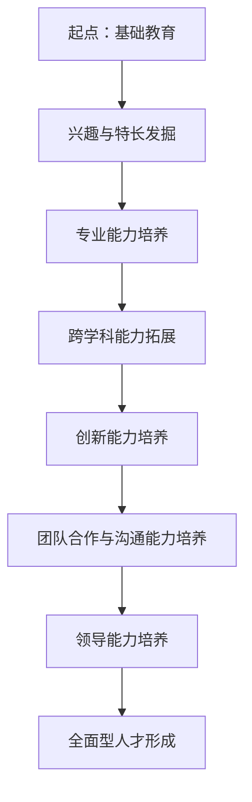

                 

### 文章标题

# 人才发展：培养全面型人才

### 文章关键词

- 人才发展
- 全面型人才
- 培养策略
- 教育体系
- 企业实践

### 文章摘要

本文旨在探讨如何培养全面型人才，以应对当前社会和企业的多元化需求。通过对人才发展的背景、核心概念、培养策略、教育体系、企业实践以及未来趋势的深入分析，本文为读者提供了全面型人才培养的理论基础和实践指南。文章以逻辑清晰、结构紧凑、简单易懂的专业技术语言，引导读者逐步了解和掌握培养全面型人才的方法和技巧。

---

### 引言：人才发展的重要性与挑战

在全球化、信息化和智能化的时代背景下，人才发展已成为各国和各企业关注的焦点。随着技术的不断进步和社会结构的深刻变革，传统的人才培养模式已无法满足现代社会的需求。培养全面型人才，不仅是个人职业发展的需要，更是社会和企业的可持续发展所需。因此，探讨人才发展的核心问题和挑战，具有重要的现实意义。

#### 1.1 人才发展的时代背景

当今世界正经历着一场前所未有的变革，以信息技术和人工智能为代表的科技革命正在深刻改变人类社会的发展模式和路径。人工智能、大数据、物联网等新兴技术的崛起，不仅改变了人们的生活方式，也改变了企业的运作模式。在这种背景下，人才的素质和能力结构发生了巨大的变化。现代企业不仅需要具备专业知识和技能的人才，更需要具备跨学科、跨领域的综合能力的人才。

#### 1.2 人才发展的核心挑战

1. **知识更新速度快**：随着科技的发展，知识的更新速度越来越快，传统教育的学习周期无法满足快速变化的知识需求。
2. **能力结构多元化**：现代企业需要的人才不仅仅是专业领域的专家，更需要具备创新思维、团队协作、跨文化沟通等多方面的能力。
3. **人才短缺与浪费**：在科技迅猛发展的同时，全球范围内的人才短缺现象日益严重，尤其是高端人才和紧缺人才的短缺，给企业的发展带来了巨大的挑战。
4. **教育体系的不适应性**：现有的教育体系大多是基于工业时代的需求设计的，难以适应现代社会的多元化人才需求。

### 结论

人才发展是一个复杂而长期的过程，涉及到教育、企业、政策等多个方面。只有深入理解人才发展的时代背景和核心挑战，才能制定出有效的人才培养策略，培养出适应现代社会和未来发展的全面型人才。

---

### 第1章：人才发展的核心概念与理论

本章将深入探讨人才发展的核心概念和理论基础，为全面型人才的培养提供理论依据。

#### 1.1 全面型人才的概念解析

全面型人才是指在专业知识和技能的基础上，具备创新思维、团队合作、跨文化沟通、领导能力等多方面素质的人才。与传统的人才相比，全面型人才具有更广泛的知识面和更高的综合素质，能够适应快速变化的社会和市场需求。

##### 1.1.1 全面型人才的特点

1. **跨学科能力**：能够掌握多学科的知识，具备跨领域的思维能力。
2. **创新思维**：具备创新精神和创新能力，能够提出新颖的观点和解决方案。
3. **团队合作**：具备良好的团队协作能力，能够与不同背景的人有效沟通和合作。
4. **跨文化沟通**：具备跨文化沟通能力，能够适应多元文化环境，与国际人才有效交流。
5. **领导能力**：具备一定的领导能力，能够引领团队达成共同目标。

##### 1.1.2 全面型人才的核心能力

1. **专业能力**：扎实的专业知识和技能是全面型人才的基础。
2. **学习能力**：持续的学习能力是适应快速变化的职业环境的关键。
3. **创新能力**：创新能力是推动个人和团队发展的动力。
4. **沟通能力**：有效的沟通能力是团队合作和跨文化沟通的基础。
5. **领导能力**：领导能力是引领团队和项目成功的关键。

#### 1.2 人才发展的理论基础

人才发展是一个复杂的过程，涉及多个学科的理论基础。以下简要介绍几个核心的理论：

##### 1.2.1 学习理论

学习理论是人才发展的基础。行为主义学习理论强调通过外部刺激和强化来培养能力；认知主义学习理论则强调通过内在的认知结构和思维过程来学习；人本主义学习理论则强调个体的自我实现和自我成长。

##### 1.2.2 成长理论

成长理论认为，个体的成长是一个连续的过程，包括认知成长、情感成长和社交成长。Vygotsky的社会文化理论强调，个体的成长是在社会和文化环境中进行的，通过社会互动和合作来学习。

##### 1.2.3 情境理论

情境理论认为，个体的行为和能力受到情境的影响。个体在不同的情境中，可能会表现出不同的行为和能力。因此，培养全面型人才需要考虑个体所处的具体情境，提供适合的培训和发展环境。

#### 1.3 Mermaid流程图：全面型人才发展的路径

以下是全面型人才发展的Mermaid流程图，展示了全面型人才发展的主要路径和关键环节：

#### 1.4 核心概念与联系

通过以上分析，我们可以看到，全面型人才的发展是一个多维度、多层次的过程，涉及到专业能力、跨学科能力、创新能力、团队合作与沟通能力、领导能力等多个方面。这些能力之间相互关联、相互促进，共同构成了全面型人才的核心素质。

#### 1.5 结论

本章通过对全面型人才的概念、特点、核心能力以及人才发展理论基础的深入探讨，为全面型人才的培养提供了理论依据。下一章将介绍全面型人才素质培养的具体策略，帮助读者更好地理解和实施全面型人才培养计划。

---

### 第2章：全面人才素质培养策略

全面型人才素质的培养是现代教育的重要目标，也是企业人力资源管理的关键环节。本章将详细探讨全面型人才素质培养的具体策略，包括情商培养、创新能力培养、专业知识和技能培养等方面。

#### 2.1 情商培养策略

情商（Emotional Intelligence，EQ）是指个体识别、理解、管理自己情绪的能力，以及识别、理解和影响他人情绪的能力。情商在职场中的重要性日益凸显，因为它不仅影响个人的心理健康，还影响团队合作、沟通效果和领导能力。

##### 2.1.1 情商的基本概念

情商包括以下几个核心要素：

1. **自我意识**：了解自己的情绪，认识到情绪对行为的影响。
2. **自我管理**：有效地调节情绪，保持情绪稳定。
3. **社交意识**：理解他人的情绪，善于识别和解读他人的情绪状态。
4. **关系管理**：建立和维持良好的人际关系，有效地处理人际关系冲突。

##### 2.1.2 情商培养的方法与技巧

1. **自我反思**：定期进行自我反思，了解自己的情绪变化和原因。
2. **情绪调节**：通过深呼吸、冥想、运动等方式，调节情绪，保持心理平衡。
3. **情感教育**：在学校和职场中开展情感教育，提高个体对情绪的认知和管理能力。
4. **社交技能培训**：通过角色扮演、情景模拟等方式，提高个体的社交技能。
5. **团队活动**：组织团队建设活动，增强团队成员之间的情感交流和协作。

#### 2.2 创新能力培养策略

创新能力是全面型人才的重要素质，它决定了个体在快速变化的环境中的适应能力和竞争力。培养创新能力，需要从多个方面入手。

##### 2.2.1 创新的本质

创新是指通过创造性的思维和方法，提出新的观点、方法或产品，解决实际问题或创造新的价值。创新的本质包括：

1. **思维开放**：保持开放的思维，接受新的想法和观点。
2. **问题意识**：具备敏锐的问题意识，发现和解决问题。
3. **知识整合**：将不同领域的知识整合，形成新的思维模式。
4. **实践探索**：通过实践，验证和修正创新想法。

##### 2.2.2 创新能力的培养路径

1. **教育体系**：在学校和大学中，引入创新教育课程，培养学生的创新思维和创新能力。
2. **企业内部**：建立创新文化和机制，鼓励员工提出创新想法，并提供实践机会。
3. **跨学科交流**：组织跨学科研讨会和工作坊，促进知识的交叉融合。
4. **项目实践**：通过实际项目，让学生或员工在解决真实问题中培养创新能力。
5. **激励制度**：建立合理的激励机制，奖励创新行为，激发员工的创新热情。

#### 2.3 专业知识与技能培养

专业知识与技能是全面型人才的基础，它决定了个体在特定领域的专业能力和竞争力。培养专业知识与技能，需要从以下几个方面入手。

##### 2.3.1 专业知识的获取途径

1. **学术研究**：通过学术研究，获取最新的专业知识和理论。
2. **实践经验**：通过实际工作，积累实践经验，提升专业技能。
3. **在线学习**：利用在线教育资源，自主学习新的知识和技能。
4. **行业交流**：参加行业会议、研讨会等活动，了解行业动态和最新技术。

##### 2.3.2 技能培养的策略与实践

1. **案例学习**：通过案例分析，学习解决问题的方法和技巧。
2. **技能竞赛**：参加技能竞赛，提升专业技能和团队协作能力。
3. **导师制度**：建立导师制度，由经验丰富的专业人士指导学习和实践。
4. **职业规划**：制定个人职业规划，明确学习目标和方向。
5. **持续学习**：树立终身学习的理念，不断提升自己的专业水平和技能。

#### 2.4 总结

全面型人才素质的培养是一个复杂而长期的过程，涉及到情商、创新能力、专业知识和技能等多个方面。通过制定科学的培养策略，结合教育体系和企业实践，可以有效地培养出适应现代社会和未来发展的全面型人才。

---

### 第3章：教育体系与人才发展

教育体系是人才培养的重要基础，其改革与发展直接影响着人才的数量和质量。本章将探讨现代教育体系的特点、改革方向以及其对人才发展的影响。

#### 3.1 现代教育体系概述

现代教育体系与传统教育体系相比，具有以下几个显著特点：

1. **终身教育**：强调教育不仅仅是学校教育的责任，而是贯穿人的一生。随着知识更新速度的加快，终身学习成为现代教育的重要组成部分。
2. **个性化和差异化教育**：尊重学生的个性差异，根据学生的兴趣、能力和需求，提供个性化的教育方案。
3. **跨学科和综合能力培养**：注重培养学生的跨学科能力和综合素质，而不仅仅是专业知识。
4. **技术辅助教育**：利用信息技术，如互联网、大数据、人工智能等，提高教育质量和效率。
5. **国际化**：鼓励学生参与国际交流，提高跨文化沟通能力和国际视野。

#### 3.2 教育体系改革与人才发展

随着社会和科技的快速发展，现代教育体系面临着巨大的挑战和改革需求。以下是一些关键改革方向：

1. **课程体系改革**：调整课程设置，增加跨学科课程，提高实践性课程的比例，培养学生的创新能力和实际操作能力。
2. **教育模式改革**：从传统的教师主导模式转向学生主导模式，鼓励学生自主学习，培养学生的批判性思维和解决问题的能力。
3. **教育资源均衡**：优化教育资源分配，缩小城乡、区域间的教育差距，确保每个学生都能获得优质教育。
4. **教育评价体系改革**：建立多元化的评价体系，不仅关注学生的学术成绩，还关注其综合素质、创新能力和社会责任感。
5. **师资队伍建设**：提高教师的专业素质和教学能力，建立教师培训和发展的长效机制。

#### 3.3 教育体系改革对人才发展的影响

教育体系的改革对人才发展具有深远的影响：

1. **提升人才培养质量**：通过改革，提高教育的质量和效率，培养出更具创新精神和实践能力的人才。
2. **适应社会需求**：教育体系的改革能够更好地适应社会和市场的需求，培养出符合时代发展要求的人才。
3. **促进终身学习**：教育体系的改革鼓励学生持续学习，培养终身学习的习惯和能力。
4. **促进社会公平**：教育体系的改革有助于缩小社会不平等，为更多学生提供公平的教育机会。
5. **推动教育国际化**：教育体系的改革促进国际交流，提升学生的全球视野和跨文化沟通能力。

#### 3.4 结论

教育体系与人才发展密切相关。通过改革教育体系，培养出适应现代社会和未来发展的全面型人才，是推动社会进步和经济发展的重要途径。本章分析了现代教育体系的特点、改革方向及其对人才发展的深远影响，为教育体系的改革提供了理论依据和实践指导。

---

### 第4章：企业人才发展实践

企业是人才发展的主要阵地，通过科学的人才发展实践，可以提升企业的核心竞争力。本章将探讨企业人才发展的策略、成功实践以及面临的挑战。

#### 4.1 企业人才发展策略

企业人才发展的策略包括以下几个方面：

1. **明确人才战略**：企业应制定明确的人才战略，包括人才选拔、培养、使用和激励等方面，确保人才战略与企业的整体战略相一致。
2. **全面人才评估**：建立科学的人才评估体系，通过定量和定性的方法，全面评估员工的能力、潜力和贡献。
3. **持续人才培养**：企业应投入资源，持续培养员工的职业技能和领导能力，提供培训、轮岗和进修等机会。
4. **建立激励机制**：通过绩效激励、晋升激励、股权激励等多种方式，激发员工的积极性和创造力。
5. **文化塑造**：营造积极向上、开放包容的企业文化，鼓励员工勇于创新、敢于担当。

#### 4.2 案例分析：企业全面人才发展的成功实践

以下是一个企业全面人才发展的成功实践案例：

**案例一：公司A的人才培养计划**

公司A是一家高科技企业，通过一系列措施，成功培养了大批全面型人才。具体措施如下：

1. **定制化培训**：公司根据员工的不同岗位和职业发展需求，提供定制化的培训课程，涵盖技术、管理、创新思维等多个方面。
2. **导师制度**：公司建立导师制度，由经验丰富的资深员工指导新员工，帮助其快速融入团队和提升能力。
3. **项目制工作**：公司鼓励员工参与项目制工作，通过实际项目锻炼员工的团队协作、问题解决和创新能力。
4. **国际交流**：公司支持员工参加国际会议、交流项目，提升员工的全球视野和跨文化沟通能力。
5. **绩效与激励**：公司建立科学的绩效评估体系，对表现优秀的员工给予奖励，激励员工持续提升自我。

**案例二：公司B的创新人才培养模式**

公司B是一家创新型企业，通过独特的创新人才培养模式，成功培育了一批创新型人才。具体措施如下：

1. **创新实验室**：公司建立创新实验室，提供实验设备和资源，鼓励员工进行创新研究和技术开发。
2. **创新激励机制**：公司设立创新基金，支持员工的创新项目，对成功实现商业化的创新项目给予高额奖励。
3. **内部创业**：公司鼓励员工内部创业，提供创业指导、资源支持和股权激励，激发员工的创新潜能。
4. **跨部门协作**：公司打破部门壁垒，促进跨部门协作，通过团队协作和创新合作，推动创新项目的实施。
5. **开放共享**：公司鼓励员工分享创新经验和成果，通过内部论坛、技术交流等方式，营造开放共享的创新氛围。

#### 4.3 案例分析：企业人才发展的挑战与对策

尽管企业人才发展的成功实践众多，但在实际操作中，企业仍面临一些挑战：

1. **人才流失**：随着市场竞争的加剧，企业面临着人才流失的风险。对策是提高员工的薪酬福利、提供职业发展机会，建立良好的工作环境和文化。
2. **创新能力不足**：企业在创新过程中可能面临创新能力不足的问题。对策是加强研发投入，引进外部创新资源，鼓励员工参与创新活动。
3. **培训效果不佳**：企业的培训项目可能存在效果不佳的问题。对策是制定科学的培训计划，选择合适的培训方式，确保培训内容与员工实际需求相匹配。
4. **领导力不足**：企业在人才发展过程中可能面临领导力不足的问题。对策是加强领导力培养，提高管理者的领导能力和团队管理能力。

#### 4.4 结论

企业人才发展是提升企业核心竞争力的重要手段。通过制定明确的人才战略、实施科学的人才培养措施、建立有效的激励机制，企业可以培养出适应未来发展需要的全面型人才。案例分析和挑战与对策的讨论为企业人才发展提供了实践指导和思考方向。

---

### 第5章：人才发展的法律法规与政策环境

人才发展的法律法规与政策环境是推动人才发展的重要保障，对人才的培养、使用和流动具有深远影响。本章将探讨人才发展的法律法规、政策环境以及相关政策的支持与限制。

#### 5.1 人才发展法律法规概述

人才发展的法律法规主要包括国内外的相关法律、法规和政策措施。以下是国内和海外典型的人才发展法律法规：

1. **国内人才发展法律法规**：
   - 《中华人民共和国教育法》：明确教育的目的、任务和原则，保障教育的公平和质量。
   - 《中华人民共和国高等教育法》：规范高等教育的组织和运行，保障高等教育的质量和公平。
   - 《中华人民共和国劳动合同法》：规范劳动合同关系，保障劳动者的合法权益。
   - 《中华人民共和国人才市场管理规定》：规范人才市场运作，促进人才合理流动。

2. **海外人才发展法律法规**：
   - 《美国移民法》：规定移民政策，吸引全球高层次人才。
   - 《英国创新法案》：推动创新和发展，为人才提供政策支持。
   - 《德国高技能人才引进法》：鼓励外国高技能人才在德工作，促进经济和技术发展。

#### 5.2 人才发展政策环境分析

人才发展的政策环境主要包括政府政策、行业政策和企业政策等方面。以下是对政府政策、行业政策和企业政策的分析：

1. **政府政策**：
   - **税收优惠**：政府通过减免税收、提供税收抵扣等方式，鼓励企业引进和使用高层次人才。
   - **科研经费支持**：政府加大科研经费投入，支持企业和科研机构进行创新研究，提高人才的创新能力。
   - **人才引进政策**：政府通过人才签证、居留许可等政策，吸引海外高层次人才来华工作。

2. **行业政策**：
   - **行业规划**：行业主管部门制定行业发展规划，明确行业人才发展的方向和重点。
   - **行业标准**：制定行业人才标准和职业资格认证制度，规范行业人才的管理和培养。
   - **行业合作**：促进行业内部和企业之间的合作，通过资源共享和人才流动，提升行业整体人才水平。

3. **企业政策**：
   - **人才招聘**：企业通过优化招聘流程、提高薪酬福利等措施，吸引高素质人才。
   - **人才培养**：企业制定人才培养计划，提供培训、进修和职业发展机会，提升员工的专业能力和综合素质。
   - **人才激励**：企业通过绩效激励、股权激励等手段，激发人才的积极性和创造力。

#### 5.3 政策对人才发展的支持与限制

政策在推动人才发展的过程中，既提供了支持，也带来了一定的限制：

1. **支持措施**：
   - **财政支持**：政府通过财政拨款、税收优惠等手段，为企业提供资金支持，减轻企业培养和引进人才的负担。
   - **人才激励**：政府通过设立人才奖励基金、提供住房补贴等，激励人才积极投身科研和创新创业。
   - **科研支持**：政府加大科研经费投入，支持企业和科研机构进行创新研究，提升人才的创新能力。

2. **限制因素**：
   - **人才流动性**：严格的户籍制度和签证政策可能限制人才的自由流动，影响人才的引进和流动。
   - **市场竞争**：行业内部竞争激烈可能导致企业过度重视短期利益，忽视长期的人才培养和储备。
   - **政策变动**：政策的不稳定性和不确定性可能影响企业的人才战略，导致人才政策执行困难。

#### 5.4 结论

人才发展的法律法规与政策环境对人才的发展具有重要意义。通过分析国内外的法律法规和政策环境，可以更好地理解政策对人才发展的支持与限制，为政府和企业制定更加科学和有效的人才政策提供参考。同时，加强法律法规的制定和完善，优化政策环境，有助于推动人才发展的持续进步。

---

### 第6章：人才发展的未来趋势

随着科技的不断进步和社会结构的深刻变革，人才发展的趋势也在不断演变。本章将探讨科技创新、全球化趋势以及未来人才发展的一些关键方向。

#### 6.1 科技创新与人才发展

科技创新是推动人才发展的重要动力，新技术、新产业、新业态的不断涌现，对人才的需求和能力结构提出了新的要求。

##### 6.1.1 人工智能与人才发展

人工智能（AI）技术的快速发展，正在深刻改变各行各业。未来，人工智能将成为推动人才发展的关键因素。以下是一些关键点：

1. **AI技能需求**：随着AI技术的普及，企业和个人对AI相关技能的需求将持续增长，如机器学习、深度学习、自然语言处理等。
2. **跨学科融合**：人工智能技术需要跨学科的知识体系，未来的人才培养将更加注重跨学科融合，培养具备多领域知识的复合型人才。
3. **数据素养**：数据是人工智能的基石，培养数据素养成为人才发展的核心任务，包括数据分析、数据管理和数据应用等方面的能力。

##### 6.1.2 数据科学与人才发展

数据科学是人工智能的重要支撑，随着大数据技术的广泛应用，数据科学将成为未来人才发展的热点领域。以下是一些关键点：

1. **数据思维**：培养数据科学思维，提高人才对数据的敏感度和数据分析能力。
2. **数据治理**：数据治理是数据科学的重要环节，涉及数据安全、隐私保护、数据质量管理等方面，未来的人才培养将更加注重数据治理能力的培养。
3. **应用导向**：数据科学的应用领域广泛，未来的人才发展将更加注重应用导向，培养能够将数据科学应用于实际问题的专业人才。

#### 6.2 人才发展的全球化趋势

全球化进程的加速，使得人才流动更加频繁，国际竞争更加激烈。未来，人才发展的全球化趋势将表现为以下几个方面：

1. **全球人才竞争**：各国纷纷加大吸引全球高层次人才的力度，争夺全球创新资源。
2. **跨文化沟通**：全球化要求人才具备跨文化沟通能力，能够适应多元文化环境，与国际人才有效交流。
3. **国际化教育**：国际化教育将成为人才培养的重要途径，通过国际交流、合作研究、海外留学等方式，提高人才的全球视野和跨文化能力。

##### 6.2.1 全球人才竞争态势

全球人才竞争态势表现为以下几个特点：

1. **人才流动自由**：随着全球化进程的加快，人才流动的障碍逐渐减少，人才在全球范围内的流动更加自由。
2. **人才吸引力**：全球主要经济体纷纷出台人才吸引政策，提供优越的工作和生活环境，吸引全球高层次人才。
3. **人才短缺**：全球范围内，高端人才和紧缺人才短缺现象日益严重，成为各国和各企业共同面临的挑战。

##### 6.2.2 企业全球化背景下的人才发展策略

在全球化背景下，企业需要制定相应的人才发展策略，以应对国际竞争和人才短缺的挑战。以下是一些关键点：

1. **全球化人才培养**：通过海外培训、国际交流、跨国项目等方式，培养具有全球化视野和跨文化沟通能力的人才。
2. **本地化人才引进**：在海外市场，引进具有本地化知识和经验的本地人才，提高企业的本地化运营能力。
3. **国际化团队建设**：建立多元文化背景的国际化团队，通过团队协作和知识共享，提升企业的整体竞争力。

#### 6.3 人才发展的未来展望

未来，人才发展将呈现以下趋势：

1. **终身学习**：随着知识更新速度的加快，终身学习将成为人才发展的主流，人才需要具备持续学习的能力。
2. **个性化发展**：随着技术的进步，个性化教育和培训将成为可能，人才的发展将更加注重个体的个性化需求。
3. **创新能力**：创新能力将成为人才的核心竞争力，企业和社会将更加重视创新人才的培养和激励。
4. **全球视野**：全球化背景下，人才需要具备全球视野和跨文化沟通能力，以适应国际化的工作环境。

#### 6.4 结论

人才发展的未来趋势表明，科技创新和全球化将深刻影响人才发展的方向和模式。企业和社会需要适应这些变化，制定科学的人才发展策略，培养具备创新能力和全球化视野的全面型人才，以应对未来发展的挑战。

---

### 第7章：总结与展望

#### 7.1 人才发展的重要性总结

人才发展是推动社会进步和经济发展的重要动力。通过培养全面型人才，可以提升国家的综合竞争力，促进企业的创新和持续发展。本章从多个角度探讨了人才发展的核心概念、培养策略、教育体系、企业实践以及未来趋势，总结了以下几点重要性：

1. **适应时代需求**：全面型人才具备跨学科、创新思维、团队合作、领导能力等多方面素质，能够适应快速变化的社会和市场需求。
2. **提升核心竞争力**：企业通过科学的人才发展战略和实践，可以培养出具备创新能力和实际操作能力的人才，提升企业的核心竞争力。
3. **促进终身学习**：终身学习成为人才发展的主流，人才需要具备持续学习的能力，以应对知识更新速度的加快。
4. **全球化视野**：全球化趋势要求人才具备全球视野和跨文化沟通能力，能够适应国际化的工作环境。

#### 7.2 人才发展的未来展望

未来，人才发展将面临更多机遇和挑战。以下是对人才发展的几点展望：

1. **科技创新推动**：随着人工智能、大数据、物联网等新兴技术的发展，人才的能力结构和素质要求将发生重大变化，科技创新将成为人才发展的核心推动力。
2. **教育体系改革**：教育体系的改革将更加注重个性化和差异化教育，提高教育的质量和效率，为培养全面型人才提供坚实基础。
3. **国际化人才流动**：全球化进程的加速，将促进人才的跨国流动和交流，培养出具有全球视野和跨文化沟通能力的国际化人才。
4. **多元能力培养**：未来的人才培养将更加注重多元化能力的培养，包括专业能力、创新能力、沟通能力、领导能力等，以应对复杂多变的职业环境。

#### 7.3 结论

人才发展是一个复杂而长期的过程，涉及到教育、企业、政策等多个方面。只有深入理解人才发展的核心问题和未来趋势，才能制定出科学的人才培养策略，培养出适应未来发展的全面型人才。让我们共同努力，推动人才发展的持续进步，为社会的繁荣和进步贡献力量。

---

### 作者信息

作者：AI天才研究院/AI Genius Institute & 禅与计算机程序设计艺术 /Zen And The Art of Computer Programming

