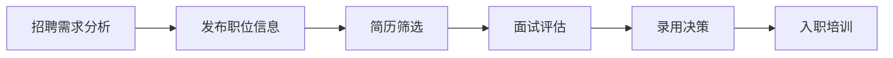

                 

# 人才招聘与培养：打造精英团队

## 关键词
- 人才招聘
- 培养与发展
- 精英团队
- 原理与实践
- 人才测评
- 培训体系

## 摘要
本文将探讨人才招聘与培养的重要性，以及如何通过科学的招聘方法和系统的培养体系，打造一支高效、协作的精英团队。文章将分章节详细阐述人才招聘的原则与方法、员工发展与培训、绩效评价体系、团队建设策略、未来趋势与挑战，以及实战案例分析，旨在为IT领域的经理人和人力资源从业者提供实用的指导和参考。

## 目录

### 第一部分：人才招聘

#### 第一章：人才招聘概述
- 背景介绍
- 人才招聘的意义
- 人才招聘的核心概念与联系

#### 第二章：招聘原则与方法
- 招聘流程设计
- 招聘渠道选择
- 招聘策略制定

#### 第三章：核心算法原理讲解
- 数据驱动的招聘策略
- 人才匹配算法
- 薪酬福利设计

#### 第四章：人才测评
- 人才测评的重要性
- 测评工具与方法
- 测评结果应用

### 第二部分：员工发展与培训

#### 第五章：员工发展
- 员工成长路径
- 职业规划与导师制度
- 继续教育与培训

#### 第六章：培训体系
- 培训计划制定
- 培训内容设计
- 培训效果评估

#### 第七章：案例实战
- 培训项目实施
- 培训成果展示
- 项目小结

### 第三部分：绩效评价

#### 第八章：绩效评价体系
- 绩效评价的重要性
- 绩效评价模型
- 绩效反馈机制

#### 第九章：绩效评估方法
- 定量评估方法
- 定性评估方法
- 绩效改进计划

#### 第十章：案例分析
- 企业绩效评价实践
- 绩效管理案例剖析
- 绩效管理改进策略

### 第四部分：团队建设

#### 第十一章：团队建设策略
- 团队建设理论
- 团队领导力
- 团队文化建设

#### 第十二章：团队动态与沟通
- 团队成员角色与职责
- 团队沟通技巧
- 团队冲突管理

#### 第十三章：精英团队打造
- 精英团队的特质
- 精英团队建设步骤
- 精英团队案例分析

### 第五部分：未来趋势与挑战

#### 第十四章：未来趋势分析
- 数字化招聘趋势
- 智能化评估与培养
- 全球化视野下的团队建设

#### 第十五章：挑战与应对
- 劳动力市场的变化
- 技术发展的挑战
- 企业文化的适应与变革

### 第六部分：实战案例分析

#### 第十六章：企业招聘与培养实践
- 招聘流程优化
- 员工培养体系
- 绩效管理与团队建设

#### 第十七章：行业标杆案例分析
- 先进企业的招聘与培养经验
- 行业最佳实践分享
- 案例总结与启示

### 第七部分：总结与展望

#### 第十八章：最佳实践与启示
- 招聘与培养的最佳实践
- 团队建设的成功要素
- 人才培养的未来方向

#### 第十九章：小结与展望
- 文章总结
- 未来趋势展望
- 读者反馈与建议征集

### 后记

#### 第二十章：拓展阅读
- 相关书籍推荐
- 学术研究动态
- 行业报告与资讯

## 文章正文

### 第一部分：人才招聘

#### 第一章：人才招聘概述

##### 背景介绍
在当今竞争激烈的市场环境中，企业之间的竞争已经从产品和服务层面逐渐转向人才的竞争。优秀的人才不仅仅能提高企业的核心竞争力，还能推动企业的创新与发展。因此，人才招聘成为企业管理中至关重要的一环。

##### 人才招聘的意义
人才招聘不仅关系到企业当前的业务需求，更是企业长远发展的基石。通过科学的招聘，企业能够吸引到具有专业技能和潜力的人才，为企业的持续发展注入活力。

##### 核心概念与联系
在人才招聘中，有几个核心概念需要了解：

1. **招聘需求分析**：了解企业内部的人才缺口，明确招聘的目标和标准。
2. **招聘渠道**：选择合适的招聘渠道，如线上招聘平台、社交媒体、猎头服务等。
3. **招聘流程**：包括职位发布、简历筛选、面试、录用等环节。
4. **人才匹配**：通过评估候选人是否符合职位要求，实现人才与职位的最佳匹配。

下面是一个Mermaid流程图，展示了人才招聘的核心流程：



#### 第二章：招聘原则与方法

##### 招聘流程设计
一个高效的招聘流程是企业成功招聘的关键。招聘流程的设计应该包括以下几个环节：

1. **职位需求分析**：明确招聘的职位类型、职责和要求。
2. **职位发布**：选择合适的渠道发布职位信息，确保信息的准确性和吸引力。
3. **简历筛选**：通过筛选简历，初步筛选出符合要求的候选人。
4. **面试评估**：通过面试，深入了解候选人的能力与潜力。
5. **录用决策**：根据面试结果，做出录用决定。
6. **入职培训**：为新人提供必要的培训，使其尽快融入企业。

##### 招聘渠道选择
选择合适的招聘渠道可以提高招聘效率。常见的招聘渠道包括：

1. **线上招聘平台**：如智联招聘、前程无忧等。
2. **社交媒体**：如LinkedIn、微博、微信公众号等。
3. **猎头服务**：通过专业的猎头公司寻找高层次人才。
4. **内部推荐**：鼓励员工推荐优秀的人才，建立人才库。

##### 招聘策略制定
招聘策略的制定需要根据企业的实际情况和需求来设计。以下是一些常见的招聘策略：

1. **品牌建设**：提升企业品牌形象，吸引优秀人才的关注。
2. **精准招聘**：通过数据分析，精确匹配候选人与职位要求。
3. **弹性福利**：提供有竞争力的薪酬和福利，吸引和留住人才。
4. **多元化招聘**：鼓励多元化背景的人才加入，提升团队创新能力。

#### 第三章：核心算法原理讲解

##### 数据驱动的招聘策略
数据驱动的招聘策略是基于大数据分析和人工智能技术，通过分析历史招聘数据、市场趋势和候选人的行为数据，来优化招聘流程和决策。以下是一些核心算法和流程：

1. **数据收集**：收集招聘相关数据，如职位发布时间、候选人简历、面试反馈等。
2. **数据预处理**：清洗和整理数据，使其符合分析要求。
3. **特征工程**：提取和构建有助于招聘决策的特征，如技能、经验、学历等。
4. **模型训练**：使用机器学习算法，如分类、聚类、推荐等，训练模型。
5. **模型评估**：评估模型的效果，如准确率、召回率等。
6. **模型应用**：将模型应用于招聘流程，如简历筛选、面试评估等。

以下是一个简化的数据驱动的招聘流程伪代码：

```python
# 数据驱动的招聘流程
def data_driven_recruitment(data):
    # 数据预处理
    preprocessed_data = preprocess_data(data)
    
    # 特征工程
    features = feature_engineering(preprocessed_data)
    
    # 模型训练
    model = train_model(features)
    
    # 模型评估
    evaluate_model(model)
    
    # 模型应用
    candidates = apply_model(model, data)
    
    return candidates
```

##### 人才匹配算法
人才匹配算法是招聘过程中用于评估候选人与职位匹配程度的方法。常见的人才匹配算法包括：

1. **基于关键词的匹配**：通过比较候选人简历中的关键词与职位要求的匹配度。
2. **基于矩阵分解的匹配**：通过矩阵分解技术，计算候选人与职位的高维匹配度。
3. **基于深度学习的匹配**：使用深度学习模型，如卷积神经网络（CNN）和循环神经网络（RNN），进行匹配预测。

以下是一个基于矩阵分解的人才匹配算法的伪代码：

```python
# 基于矩阵分解的人才匹配算法
def matrix_factorization_matching(user_profile, job_profile):
    # 矩阵分解模型
    model = MatrixFactorization()
    
    # 训练模型
    model.fit(user_profile, job_profile)
    
    # 预测匹配度
    match_score = model.predict(user_profile, job_profile)
    
    return match_score
```

##### 薪酬福利设计
薪酬福利是吸引和留住人才的重要因素。薪酬福利设计需要考虑以下几个方面：

1. **市场竞争力**：确保薪酬水平在市场上具有竞争力。
2. **内部公平性**：保证企业内部不同岗位的薪酬差异合理。
3. **激励机制**：通过绩效奖金、股权激励等手段激发员工积极性。
4. **弹性福利**：提供灵活的福利选择，如健康保险、带薪休假等。

#### 第四章：人才测评

##### 人才测评的重要性
人才测评是招聘过程中评估候选人能力与潜力的重要环节。通过科学的测评，企业可以更准确地了解候选人的实际能力，减少招聘风险。

##### 测评工具与方法
常见的测评工具和方法包括：

1. **面试**：通过面试了解候选人的沟通能力、专业知识和团队合作精神。
2. **心理测试**：评估候选人的性格、动机和职业兴趣。
3. **技能测试**：通过在线测试、编程挑战等评估候选人的专业技能。
4. **情景模拟**：模拟实际工作场景，观察候选人在特定情境下的表现。

以下是一个简单的面试流程伪代码：

```python
# 面试流程
def interview_candidate(candidate):
    # 面试准备
    prepare_interview()
    
    # 面试开始
    start_interview(candidate)
    
    # 面试评估
    interview評価 = assess_interview(candidate)
    
    # 面试反馈
    provide_interview_feedback(candidate, interview評価)
    
    return interview評価
```

##### 测评结果应用
测评结果需要得到有效的应用，以指导招聘决策和员工培养。以下是一些应用方法：

1. **招聘决策**：根据测评结果，选择最适合职位的候选人。
2. **人才储备**：为关键职位储备合适的人才。
3. **员工发展**：根据测评结果，制定个性化的员工发展计划。
4. **绩效评估**：结合测评结果，进行绩效评估和薪酬调整。

#### 第二部分：员工发展与培训

##### 员工发展
员工发展是提升员工能力和竞争力的重要途径。员工发展包括以下几个方面：

1. **职业规划**：帮助员工制定职业发展目标，明确职业路径。
2. **培训机会**：提供各类培训机会，包括专业技能培训、管理技能培训等。
3. **晋升机制**：建立清晰的晋升机制，激励员工不断提升自己。

以下是一个员工发展计划的伪代码：

```python
# 员工发展计划
def employee_development_plan(employee):
    # 职业规划
    career_plan = define_career_plan(employee)
    
    # 培训机会
    training_opportunities = provide_training_opportunities(employee)
    
    # 晋升机制
    promotion_mechanism = establish_promotion_mechanism(employee)
    
    return career_plan, training_opportunities, promotion_mechanism
```

##### 培训体系
培训体系是员工发展的核心，包括以下几个方面：

1. **培训计划制定**：根据企业战略和员工需求，制定系统的培训计划。
2. **培训内容设计**：设计涵盖专业技能、管理能力、沟通技巧等各个方面的培训课程。
3. **培训效果评估**：评估培训效果，确保培训目标的实现。

以下是一个培训体系流程伪代码：

```python
# 培训体系流程
def training_program(employee):
    # 培训计划制定
    training_plan = define_training_plan(employee)
    
    # 培训内容设计
    training_content = design_training_content(training_plan)
    
    # 培训实施
    implement_training(training_content)
    
    # 培训效果评估
    evaluate_training_effectiveness(training_content)
    
    return training_plan, training_content, evaluate_training_effectiveness
```

##### 案例实战
为了更好地理解员工发展的重要性，我们可以来看一个实际案例。

**案例背景**：某互联网公司，员工普遍缺乏项目管理经验，导致项目进度和质量难以保障。

**解决方案**：
1. **职业规划**：为员工提供职业规划指导，明确项目管理方向。
2. **培训机会**：组织项目管理专业培训，提升员工的项目管理能力。
3. **导师制度**：建立导师制度，让有经验的员工指导新员工。

**实施效果**：通过职业规划和培训，员工的项目管理能力显著提升，项目进度和质量得到了保障。

#### 第三部分：绩效评价

##### 绩效评价体系
绩效评价体系是企业管理和员工发展的重要工具，它包括以下几个方面：

1. **绩效目标设定**：明确员工的绩效目标，使其与企业的战略目标保持一致。
2. **绩效指标设计**：设计科学的绩效指标，包括定量和定性指标。
3. **绩效评估流程**：建立规范的绩效评估流程，包括评估周期、评估方法和评估结果应用。
4. **绩效反馈机制**：提供及时的绩效反馈，帮助员工了解自己的表现，制定改进计划。

以下是一个简单的绩效评价体系流程伪代码：

```python
# 绩效评价体系
def performance_evaluation(employee):
    # 绩效目标设定
    performance_goals = set_performance_goals(employee)
    
    # 绩效指标设计
    performance_metrics = design_performance_metrics(performance_goals)
    
    # 绩效评估
    performance评估 = evaluate_performance(employee, performance_metrics)
    
    # 绩效反馈
    provide_performance_feedback(employee, performance评估)
    
    return performance_goals, performance_metrics, performance评估
```

##### 绩效评估方法
绩效评估方法包括定量评估方法和定性评估方法。以下是一些常见的评估方法：

1. **KPI（关键绩效指标）**：通过设定具体的绩效指标，量化员工的工作表现。
2. **360度评估**：收集员工自评、上级评估、同事评估和下属评估，全面了解员工的表现。
3. **行为锚定评价法（BARS）**：将绩效指标细化成具体的行为描述，评估员工的行为表现。
4. **目标管理法（MBO）**：通过设定明确的绩效目标，与员工共同制定和实现目标。

以下是一个基于KPI的绩效评估方法的伪代码：

```python
# 基于KPI的绩效评估方法
def kpi_based_evaluation(employee):
    # 设定绩效指标
    kpis = set_kpis(employee)
    
    # 收集绩效数据
    performance_data = collect_performance_data(employee, kpis)
    
    # 计算绩效得分
    performance_score = calculate_performance_score(performance_data)
    
    # 提供绩效反馈
    provide_performance_feedback(employee, performance_score)
    
    return performance_score
```

##### 绩效反馈机制
绩效反馈机制是绩效评价体系的重要组成部分，它包括以下几个方面：

1. **及时反馈**：在绩效周期结束后，及时向员工提供绩效反馈。
2. **个性化反馈**：根据员工的表现和需求，提供有针对性的反馈。
3. **改进计划**：与员工一起制定改进计划，帮助其提升绩效。
4. **激励措施**：通过奖励和晋升等激励措施，激励员工持续改进。

以下是一个绩效反馈机制的伪代码：

```python
# 绩效反馈机制
def performance_feedback Mechanism(employee, performance评估):
    # 提供及时反馈
    provide_real-time_feedback(employee, performance评估)
    
    # 个性化反馈
    personalized_feedback(employee, performance评估)
    
    # 改进计划
    develop_improvement_plan(employee, performance评估)
    
    # 激励措施
    apply_incentives(employee, performance评估)
    
    return feedback_report
```

#### 第四部分：团队建设

##### 团队建设策略
团队建设是打造高效团队的关键。团队建设策略包括以下几个方面：

1. **团队目标设定**：明确团队的目标，确保团队成员的共同愿景。
2. **团队角色分工**：明确团队成员的角色和职责，确保团队运作高效。
3. **团队沟通机制**：建立有效的沟通机制，促进团队成员之间的信息交流。
4. **团队文化建设**：塑造积极向上的团队文化，增强团队凝聚力。

以下是一个团队建设策略的伪代码：

```python
# 团队建设策略
def team_building_strategy(team):
    # 设定团队目标
    team_goals = set_team_goals(team)
    
    # 角色分工
    role_assignments = assign_roles(team)
    
    # 沟通机制
    communication_mechanism = establish_communication_mechanism(team)
    
    # 团队文化建设
    team_culture = build_team_culture(team)
    
    return team_goals, role_assignments, communication_mechanism, team_culture
```

##### 团队动态与沟通
团队动态和沟通是团队建设的重要方面。良好的团队动态和沟通能够提升团队的协作效率，减少冲突。以下是一些团队动态和沟通的关键点：

1. **透明度**：保持信息的透明度，让团队成员了解团队的运作和进展。
2. **积极倾听**：鼓励团队成员积极倾听，理解和尊重他人的意见。
3. **开放讨论**：鼓励团队成员开放讨论，分享想法和见解。
4. **冲突管理**：建立有效的冲突管理机制，及时解决团队内部的冲突。

以下是一个团队沟通机制的伪代码：

```python
# 团队沟通机制
def team_communication_mechanism(team):
    # 透明度
    maintain_transparency(team)
    
    # 积极倾听
    encourage_active_listening(team)
    
    # 开放讨论
    promote_open_discussion(team)
    
    # 冲突管理
    manage_conflicts(team)
    
    return effective_communication
```

##### 精英团队打造
打造精英团队是企业成功的关键。精英团队具有以下特点：

1. **高绩效**：团队整体绩效远高于普通团队。
2. **创新能力**：团队具备强大的创新能力和解决问题的能力。
3. **团队凝聚力**：团队成员之间高度信任，具有强烈的归属感。

以下是一个精英团队打造的伪代码：

```python
# 精英团队打造
def build_elite_team(team):
    # 设定高绩效目标
    set_high_performance_goals(team)
    
    # 培养创新能力
    cultivate_innovation_ability(team)
    
    # 增强团队凝聚力
    enhance_team_cohesion(team)
    
    return elite_team
```

#### 第五部分：未来趋势与挑战

##### 未来趋势分析
未来人才招聘与培养将面临以下趋势：

1. **数字化招聘**：利用大数据、人工智能等技术，实现精准招聘和个性化推荐。
2. **智能化评估**：通过人工智能技术，实现自动化的面试评估和人才测评。
3. **多元化招聘**：重视多元化背景的人才，提升团队的多样性和创新能力。

以下是一个数字化招聘流程的伪代码：

```python
# 数字化招聘流程
def digital_recruitment流程：
    # 数据收集
    collect_data()

    # 数据分析
    analyze_data()

    # 人才推荐
    recommend_candidates()

    # 面试安排
    schedule_interviews()

    # 录用决策
    make_recruitment_decision()
```

##### 挑战与应对
未来人才招聘与培养将面临以下挑战：

1. **劳动力市场变化**：劳动力市场的供需关系将发生变化，企业需要适应新的市场环境。
2. **技术发展**：新技术的发展将对人才需求产生重大影响，企业需要不断提升员工的技能水平。
3. **企业文化**：企业文化是吸引和留住人才的关键，企业需要持续优化企业文化，提升员工的归属感。

以下是一个应对劳动力市场变化的策略伪代码：

```python
# 应对劳动力市场变化
def adapt_to_labor_market_changes():
    # 人才储备
    build_talent_reservoir()

    # 培训计划
    develop_training_programs()

    # 薪酬福利
    optimize_compensation_and_benefits()

    # 招聘策略
    adjust_recruitment_strategy()
```

#### 第六部分：实战案例分析

##### 企业招聘与培养实践
以下是一个企业招聘与培养的实战案例：

**案例背景**：某知名互联网公司，面临快速扩张和市场竞争压力，需要通过有效的招聘与培养策略，提升团队整体能力。

**解决方案**：
1. **精准招聘**：利用大数据和人工智能技术，实现精准招聘和候选人匹配。
2. **员工培养**：建立系统的培训体系，包括专业技能培训、管理技能培训和跨部门交流项目。
3. **绩效管理**：通过科学绩效评估，激励员工不断提升自己，同时为企业的发展提供有力支持。

**实施效果**：通过精准招聘和系统培养，公司成功吸引了大量优秀人才，团队整体能力显著提升，企业竞争力得到了有效增强。

##### 行业标杆案例分析
以下是一个行业标杆企业的案例分析：

**案例背景**：某国际知名IT公司，以其卓越的招聘与培养体系，成为业内的标杆。

**最佳实践**：
1. **多元化招聘**：重视多元化背景的人才，建立多元化团队，提升企业的创新能力。
2. **个性化培训**：根据员工的职业发展和兴趣，提供个性化的培训计划，满足员工的成长需求。
3. **持续反馈**：建立持续的反馈机制，通过定期的绩效评估和员工反馈，不断提升企业的管理水平。

**案例总结**：该公司的招聘与培养体系，不仅吸引了大量优秀人才，还提升了员工的满意度和忠诚度，为企业的持续发展提供了强大支持。

#### 第七部分：总结与展望

##### 最佳实践与启示
通过本文的讨论，我们可以得出以下最佳实践和启示：

1. **精准招聘**：利用大数据和人工智能技术，实现精准招聘和候选人匹配。
2. **系统培养**：建立系统的培训体系，提升员工的技能和综合素质。
3. **绩效管理**：通过科学绩效评估，激励员工不断提升自己，同时为企业的发展提供有力支持。
4. **团队建设**：重视团队建设，提升团队的协作效率和创新能力。

##### 未来趋势展望
未来人才招聘与培养将呈现以下趋势：

1. **数字化与智能化**：数字化和智能化技术将在招聘与培养中发挥更大作用。
2. **多元化与个性化**：多元化招聘和个性化培养将成为主流。
3. **持续反馈与改进**：持续的反馈和改进机制将提升企业的管理水平。

##### 读者反馈与建议征集
欢迎读者在评论区分享您的意见和建议，我们将在后续文章中继续探讨和优化人才招聘与培养的策略和实践。

### 后记

#### 第二十章：拓展阅读
为了帮助读者更深入地了解人才招聘与培养的相关知识，我们推荐以下书籍和报告：

1. **《招聘与选拔》**：详细介绍了招聘与选拔的理论和方法，适合人力资源从业者阅读。
2. **《人才发展报告》**：分析人才发展的趋势和挑战，为企业和个人提供发展指导。
3. **《数字化转型》**：探讨数字化转型对人才招聘与培养的影响，适合关注数字化发展的读者。

同时，我们也欢迎读者关注我们的微信公众号和官方网站，获取更多行业动态和精彩内容。

### 作者信息
本文作者：AI天才研究院/AI Genius Institute & 禅与计算机程序设计艺术 /Zen And The Art of Computer Programming

感谢您的阅读，期待与您在后续文章中继续探讨人才招聘与培养的话题。如果您有任何问题或建议，欢迎在评论区留言，我们将在第一时间回复您。再次感谢您的支持！

