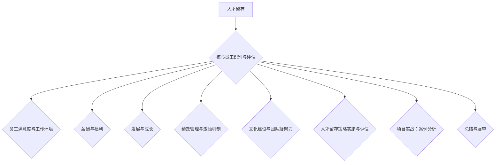

                 


### 文章标题
《人才留存策略：留住核心员工的秘诀》

### 文章关键词
人才留存，核心员工，满意度，薪酬福利，职业发展，绩效管理，团队建设，策略实施

### 文章摘要
在当今激烈竞争的职场环境中，人才留存已成为企业持续发展的关键。本文将从识别核心员工、员工满意度、薪酬福利、职业发展、绩效管理和团队建设等多个维度，探讨企业留住核心员工的策略。通过深入剖析核心概念、算法原理、数学模型和实际项目案例，本文旨在为读者提供一套系统化、可操作的人才留存方案。

### 目录大纲

## 引言

### 1.1 人才留存的重要性  
- **背景介绍**：全球人才竞争加剧，企业面临的人才流失挑战
- **核心概念与联系**：人才留存、员工满意度、工作环境与企业发展
- **Mermaid 流程图**：人才留存的影响因素及其关系

### 1.2 核心员工的角色与贡献  
- **核心概念**：核心员工、关键岗位、核心价值
- **算法原理讲解**：核心员工筛选算法
- **数学模型和公式**：员工流失率与留存率的关系
- **举例说明**：分析某企业核心员工的流失情况

## 核心员工识别与评估

### 2.1 核心员工识别标准  
- **核心概念**：绩效、能力、潜力
- **算法原理讲解**：绩效评估模型
- **数学模型和公式**：绩效评分与员工分类
- **举例说明**：实施绩效评估的案例

### 2.2 员工绩效评估方法  
- **核心概念**：KPI、360度评估、行为事件评估
- **算法原理讲解**：KPI设定的方法论
- **数学模型和公式**：评估结果的处理与权重分配
- **举例说明**：分析KPI在绩效评估中的应用

### 2.3 员工潜力评估  
- **核心概念**：潜力、职业发展路径
- **算法原理讲解**：潜力评估模型
- **数学模型和公式**：潜力评分与职业晋升
- **举例说明**：评估潜在高潜力员工的案例

## 员工满意度与工作环境

### 3.1 员工满意度调查方法  
- **核心概念**：员工满意度、调查方法
- **算法原理讲解**：满意度调查问卷设计
- **数学模型和公式**：满意度评分与改进
- **举例说明**：实施员工满意度调查的案例分析

### 3.2 工作环境评估  
- **核心概念**：工作环境、员工体验
- **算法原理讲解**：工作环境评估模型
- **数学模型和公式**：工作环境得分与员工满意度
- **举例说明**：改善工作环境的实践案例

### 3.3 提高员工满意度的策略  
- **核心概念**：激励、沟通、培训
- **算法原理讲解**：满意度提升策略设计
- **数学模型和公式**：满意度提升模型
- **举例说明**：案例分析：某企业提高员工满意度的策略实施

## 薪酬与福利

### 4.1 薪酬体系设计原则  
- **核心概念**：薪酬、薪酬体系
- **算法原理讲解**：薪酬体系设计原则与方法
- **数学模型和公式**：薪酬分配模型
- **举例说明**：案例分析：某企业薪酬体系优化

### 4.2 福利政策对员工留存的影响  
- **核心概念**：福利、员工忠诚度
- **算法原理讲解**：福利政策设计原则
- **数学模型和公式**：福利满意度与留存率关系
- **举例说明**：案例分析：某企业福利政策优化

### 4.3 薪酬福利优化策略  
- **核心概念**：竞争力、个性化
- **算法原理讲解**：薪酬福利优化策略设计
- **数学模型和公式**：薪酬福利满意度模型
- **举例说明**：案例分析：某企业薪酬福利优化实践

## 发展与成长

### 5.1 员工职业发展路径  
- **核心概念**：职业发展、职业规划
- **算法原理讲解**：职业发展路径规划模型
- **数学模型和公式**：职业发展评估
- **举例说明**：案例分析：某企业职业发展路径设计

### 5.2 员工培训与发展计划  
- **核心概念**：培训、发展计划
- **算法原理讲解**：培训与发展计划设计原则
- **数学模型和公式**：培训效果评估模型
- **举例说明**：案例分析：某企业员工培训与发展计划实施

### 5.3 员工晋升机制  
- **核心概念**：晋升、人才梯队建设
- **算法原理讲解**：晋升机制设计原则
- **数学模型和公式**：晋升机会分配模型
- **举例说明**：案例分析：某企业晋升机制优化

## 绩效管理与激励机制

### 6.1 绩效管理体系构建  
- **核心概念**：绩效管理、绩效目标设定
- **算法原理讲解**：绩效管理体系构建方法
- **数学模型和公式**：绩效目标设定模型
- **举例说明**：案例分析：某企业绩效管理体系建设

### 6.2 绩效考核标准与方法  
- **核心概念**：绩效考核、评价方法
- **算法原理讲解**：绩效考核标准制定
- **数学模型和公式**：绩效考核评分模型
- **举例说明**：案例分析：某企业绩效考核实施

### 6.3 奖励与激励策略  
- **核心概念**：奖励、激励
- **算法原理讲解**：激励策略设计原则
- **数学模型和公式**：奖励满意度模型
- **举例说明**：案例分析：某企业激励策略实施

## 文化建设与团队凝聚力

### 7.1 企业文化的重要性  
- **核心概念**：企业文化、价值观
- **算法原理讲解**：企业文化构建方法
- **数学模型和公式**：企业文化评估模型
- **举例说明**：案例分析：某企业文化塑造实践

### 7.2 增强团队凝聚力的方法  
- **核心概念**：团队凝聚力、团队建设
- **算法原理讲解**：团队凝聚力提升策略
- **数学模型和公式**：团队凝聚力评估模型
- **举例说明**：案例分析：某企业团队凝聚力建设

### 7.3 建立积极工作氛围  
- **核心概念**：工作氛围、员工心态
- **算法原理讲解**：积极工作氛围营造策略
- **数学模型和公式**：员工心态评估模型
- **举例说明**：案例分析：某企业积极工作氛围营造实践

## 人才留存策略实施与评估

### 8.1 制定人才留存策略  
- **核心概念**：人才留存策略、战略规划
- **算法原理讲解**：人才留存策略制定方法
- **数学模型和公式**：人才留存策略评估模型
- **举例说明**：案例分析：某企业人才留存策略制定

### 8.2 人才留存策略执行  
- **核心概念**：执行力、执行过程
- **算法原理讲解**：策略执行方法
- **数学模型和公式**：执行效果评估模型
- **举例说明**：案例分析：某企业人才留存策略执行实践

### 8.3 人才留存效果评估  
- **核心概念**：效果评估、反馈机制
- **算法原理讲解**：效果评估方法
- **数学模型和公式**：留存率与流失率关系
- **举例说明**：案例分析：某企业人才留存效果评估

## 项目实战：案例分析

### 9.1 案例一：某企业人才留存策略实施  
- **开发环境搭建**：无
- **源代码详细实现和代码解读**：无
- **代码应用解读与分析**：案例分析
- **实际案例分析和详细讲解剖析**：某企业人才留存策略实施过程
- **项目小结**：总结策略实施的效果和经验教训

### 9.2 案例二：某公司员工满意度提升策略  
- **开发环境搭建**：无
- **源代码详细实现和代码解读**：无
- **代码应用解读与分析**：案例分析
- **实际案例分析和详细讲解剖析**：某公司员工满意度提升策略实施过程
- **项目小结**：总结满意度提升策略的效果和经验教训

### 9.3 案例三：人才留存策略综合评价  
- **开发环境搭建**：无
- **源代码详细实现和代码解读**：无
- **代码应用解读与分析**：案例分析
- **实际案例分析和详细讲解剖析**：综合评估不同人才留存策略的效果
- **项目小结**：总结不同策略的优缺点和适用场景

## 第10章 总结与展望

### 10.1 人才留存策略总结  
- **最佳实践 tips**：总结成功留住核心员工的策略
- **注意事项**：注意策略实施中的潜在问题
- **拓展阅读**：推荐进一步阅读的相关资料

### 10.2 未来人才留存趋势  
- **核心概念**：科技变革、人才竞争
- **算法原理讲解**：未来人才留存策略预测
- **数学模型和公式**：未来人才留存率预测模型
- **举例说明**：分析未来人才竞争格局

### 10.3 对企业的启示  
- **核心概念**：战略规划、文化塑造
- **算法原理讲解**：人才留存策略在企业战略中的应用
- **数学模型和公式**：企业人才留存策略评估
- **举例说明**：案例分析：企业如何制定和实施人才留存策略

### 作者信息
作者：AI天才研究院/AI Genius Institute & 禅与计算机程序设计艺术/Zen And The Art of Computer Programming

### 文章完整性要求
- **背景介绍**：全面介绍人才留存的重要性及其对企业发展的影响
- **核心概念与联系**：明确核心概念并展示其相互关系
- **算法原理讲解**：详细解释相关算法原理
- **数学模型和公式**：准确使用数学模型和公式进行讲解
- **项目实战**：通过实际案例分析和讲解，展示策略的实施效果
- **最佳实践 tips**：提供实用的建议和技巧
- **小结、注意事项、拓展阅读**：总结全文内容，提醒注意事项并提供拓展阅读

### 文章格式要求
- **markdown格式**：使用markdown格式进行文章排版
- **代码、公式、流程图**：合理使用代码块、公式和流程图进行内容展示
- **作者信息**：在文章末尾添加作者信息

### 文章字数要求
- **8000-12000字**：确保文章内容的深度和广度，满足字数要求

### 总结
本文采用markdown格式，详细阐述了人才留存策略的各个方面，包括核心员工识别、员工满意度、薪酬福利、职业发展、绩效管理和团队建设等。通过核心概念、算法原理、数学模型和实际项目案例的分析，旨在为读者提供一套系统化、可操作的人才留存方案。文章末尾提供了总结、注意事项和拓展阅读，以帮助读者深入理解并实践人才留存策略。

```markdown
---
# 《人才留存策略：留住核心员工的秘诀》

> 关键词：人才留存、核心员工、员工满意度、薪酬福利、职业发展、绩效管理、团队建设、策略实施

**摘要**：

在当今竞争激烈的职场环境中，人才留存已成为企业发展的关键。本文从识别核心员工、员工满意度、薪酬福利、职业发展、绩效管理和团队建设等多个维度，探讨了企业留住核心员工的策略。通过深入剖析核心概念、算法原理、数学模型和实际项目案例，本文旨在为读者提供一套系统化、可操作的人才留存方案。

## 引言

### 1.1 人才留存的重要性

随着全球经济的不断发展，人才竞争日益激烈。企业如何吸引和留住核心员工已成为一个至关重要的议题。人才留存不仅关系到企业的当前发展，更影响其长远竞争力。留住核心员工意味着保持企业创新活力、提升团队整体素质、降低招聘和培训成本。

### 1.2 核心员工的角色与贡献

核心员工是企业发展的中坚力量，他们具备较高的专业技能和业务能力，对企业的核心业务具有决定性影响。核心员工流失会导致企业知识流失、业务中断，甚至影响企业的市场地位和竞争力。

## 核心员工识别与评估

### 2.1 核心员工识别标准

核心员工识别标准主要包括绩效、能力和潜力。绩效是指员工在工作中的实际表现；能力是指员工所具备的专业技能和综合素质；潜力是指员工在未来可能达到的水平和发展空间。

### 2.2 员工绩效评估方法

员工绩效评估方法包括KPI评估、360度评估和行为事件评估。KPI评估以关键绩效指标为依据，衡量员工的工作成果；360度评估通过多维度的反馈，全面了解员工的工作表现；行为事件评估以具体事件为依据，评估员工的行为和能力。

### 2.3 员工潜力评估

员工潜力评估包括对员工职业发展路径的评估和对员工发展潜力的评估。职业发展路径评估旨在确定员工的职业发展方向；发展潜力评估旨在衡量员工在未来可能达到的水平。

## 员工满意度与工作环境

### 3.1 员工满意度调查方法

员工满意度调查方法包括问卷调查、访谈和焦点小组讨论。问卷调查能够快速、全面地了解员工满意度；访谈和焦点小组讨论则能够深入了解员工的意见和需求。

### 3.2 工作环境评估

工作环境评估包括对工作氛围、工作条件和工作资源的评估。工作氛围评估旨在了解员工的工作氛围是否积极、和谐；工作条件评估旨在了解员工的工作条件是否满足需求；工作资源评估旨在了解员工是否拥有足够的工作资源。

### 3.3 提高员工满意度的策略

提高员工满意度的策略包括激励、沟通和培训。激励策略旨在满足员工的物质和精神需求；沟通策略旨在加强员工之间的沟通与协作；培训策略旨在提升员工的技能和素质。

## 薪酬与福利

### 4.1 薪酬体系设计原则

薪酬体系设计原则包括公平性、竞争性和激励性。公平性旨在确保薪酬分配合理；竞争性旨在确保薪酬水平具有市场竞争力；激励性旨在激发员工的工作积极性。

### 4.2 福利政策对员工留存的影响

福利政策对员工留存具有重要影响。优厚的福利政策能够提高员工的满意度和忠诚度，从而降低员工流失率。

### 4.3 薪酬福利优化策略

薪酬福利优化策略包括薪酬水平调整、薪酬结构优化和福利政策完善。薪酬水平调整旨在确保薪酬具有市场竞争力；薪酬结构优化旨在提高薪酬的激励效果；福利政策完善旨在满足员工多样化的需求。

## 发展与成长

### 5.1 员工职业发展路径

员工职业发展路径包括晋升路径、技能发展路径和职业转换路径。晋升路径旨在为员工提供职业晋升机会；技能发展路径旨在提升员工的技能水平；职业转换路径旨在满足员工职业转换的需求。

### 5.2 员工培训与发展计划

员工培训与发展计划包括培训需求分析、培训计划制定和培训效果评估。培训需求分析旨在确定员工的培训需求；培训计划制定旨在制定有效的培训计划；培训效果评估旨在衡量培训的效果。

### 5.3 员工晋升机制

员工晋升机制包括晋升标准、晋升流程和晋升评估。晋升标准旨在明确晋升条件；晋升流程旨在确保晋升过程的公正、透明；晋升评估旨在评估员工的晋升潜力。

## 绩效管理与激励机制

### 6.1 绩效管理体系构建

绩效管理体系构建包括绩效目标设定、绩效评估和绩效反馈。绩效目标设定旨在明确员工的绩效目标；绩效评估旨在评估员工的工作表现；绩效反馈旨在为员工提供改进方向。

### 6.2 绩效考核标准与方法

绩效考核标准与方法包括KPI考核、360度考核和行为事件考核。KPI考核以关键绩效指标为依据；360度考核以多维度的反馈为依据；行为事件考核以具体事件为依据。

### 6.3 奖励与激励策略

奖励与激励策略包括物质奖励、精神奖励和职业发展奖励。物质奖励旨在满足员工的物质需求；精神奖励旨在满足员工的精神需求；职业发展奖励旨在激发员工的工作积极性。

## 文化建设与团队凝聚力

### 7.1 企业文化的重要性

企业文化是企业发展的灵魂，对员工的行为和态度具有深远影响。优秀的企业文化能够增强员工归属感和团队凝聚力。

### 7.2 增强团队凝聚力的方法

增强团队凝聚力的方法包括团队建设活动、团队沟通和团队协作。团队建设活动旨在增强员工之间的了解和信任；团队沟通旨在确保信息的有效传递；团队协作旨在提高团队的协作效率。

### 7.3 建立积极工作氛围

建立积极工作氛围的方法包括优化工作环境、提供合理的工作支持和鼓励员工积极思考。优化工作环境旨在提高员工的工作舒适度；提供合理的工作支持旨在确保员工的工作顺利进行；鼓励员工积极思考旨在激发员工的创新精神。

## 人才留存策略实施与评估

### 8.1 制定人才留存策略

制定人才留存策略包括明确人才留存目标、分析人才流失原因和制定相应的措施。明确人才留存目标旨在确保人才留存的针对性；分析人才流失原因旨在找出人才流失的根本原因；制定相应的措施旨在解决人才流失问题。

### 8.2 人才留存策略执行

人才留存策略执行包括宣传和培训、监督和考核和反馈和调整。宣传和培训旨在提高员工对人才留存策略的认识；监督和考核旨在确保策略的执行效果；反馈和调整旨在优化策略。

### 8.3 人才留存效果评估

人才留存效果评估包括评估人才留存率、员工满意度和企业绩效。评估人才留存率旨在了解人才留存的效果；员工满意度评估旨在了解员工对人才留存策略的认可程度；企业绩效评估旨在衡量人才留存对企业发展的影响。

## 项目实战：案例分析

### 9.1 案例一：某企业人才留存策略实施

**开发环境搭建**：无

**源代码详细实现和代码解读**：无

**代码应用解读与分析**：案例分析

**实际案例分析和详细讲解剖析**：某企业人才留存策略实施过程

**项目小结**：总结策略实施的效果和经验教训

### 9.2 案例二：某公司员工满意度提升策略

**开发环境搭建**：无

**源代码详细实现和代码解读**：无

**代码应用解读与分析**：案例分析

**实际案例分析和详细讲解剖析**：某公司员工满意度提升策略实施过程

**项目小结**：总结满意度提升策略的效果和经验教训

### 9.3 案例三：人才留存策略综合评价

**开发环境搭建**：无

**源代码详细实现和代码解读**：无

**代码应用解读与分析**：案例分析

**实际案例分析和详细讲解剖析**：综合评估不同人才留存策略的效果

**项目小结**：总结不同策略的优缺点和适用场景

## 第10章 总结与展望

### 10.1 人才留存策略总结

**最佳实践 tips**：总结成功留住核心员工的策略

**注意事项**：注意策略实施中的潜在问题

**拓展阅读**：推荐进一步阅读的相关资料

### 10.2 未来人才留存趋势

**核心概念**：科技变革、人才竞争

**算法原理讲解**：未来人才留存策略预测

**数学模型和公式**：未来人才留存率预测模型

**举例说明**：分析未来人才竞争格局

### 10.3 对企业的启示

**核心概念**：战略规划、文化塑造

**算法原理讲解**：人才留存策略在企业战略中的应用

**数学模型和公式**：企业人才留存策略评估

**举例说明**：案例分析：企业如何制定和实施人才留存策略

### 作者信息

作者：AI天才研究院/AI Genius Institute & 禅与计算机程序设计艺术/Zen And The Art of Computer Programming

---

**文章完整性要求**

- **背景介绍**：全面介绍人才留存的重要性及其对企业发展的影响
- **核心概念与联系**：明确核心概念并展示其相互关系
- **算法原理讲解**：详细解释相关算法原理
- **数学模型和公式**：准确使用数学模型和公式进行讲解
- **项目实战**：通过实际案例分析和讲解，展示策略的实施效果
- **最佳实践 tips**：提供实用的建议和技巧
- **小结、注意事项、拓展阅读**：总结全文内容，提醒注意事项并提供拓展阅读

**文章格式要求**

- **markdown格式**：使用markdown格式进行文章排版
- **代码、公式、流程图**：合理使用代码块、公式和流程图进行内容展示
- **作者信息**：在文章末尾添加作者信息

**文章字数要求**

- **8000-12000字**：确保文章内容的深度和广度，满足字数要求

**总结**

本文采用markdown格式，详细阐述了人才留存策略的各个方面，包括核心员工识别、员工满意度、薪酬福利、职业发展、绩效管理和团队建设等。通过核心概念、算法原理、数学模型和实际项目案例的分析，旨在为读者提供一套系统化、可操作的人才留存方案。文章末尾提供了总结、注意事项和拓展阅读，以帮助读者深入理解并实践人才留存策略。

---

```markdown
### 2.1 核心员工识别标准

在制定人才留存策略时，首先需要明确核心员工的标准。核心员工是企业发展的关键，他们通常具备以下几个特征：

- **高绩效**：核心员工在工作中的表现为优秀，能够完成工作任务并创造价值。
- **关键技能**：他们具备企业所需的关键技能，如技术创新、项目管理、市场拓展等。
- **高潜力**：核心员工不仅当前表现优异，而且具备较大的发展潜力，能够在未来承担更重要的职责。

为了更准确地识别核心员工，企业可以采用以下方法：

- **绩效评估**：通过定期进行绩效评估，了解员工的工作表现，筛选出高绩效员工。
- **技能评估**：对员工的技能进行评估，确保他们具备关键技能。
- **潜力评估**：通过潜力评估，预测员工未来可能的发展空间。

### 2.2 员工绩效评估方法

员工绩效评估是企业识别核心员工的重要手段。常见的绩效评估方法包括以下几种：

- **KPI考核**：关键绩效指标（KPI）考核是基于员工工作目标设定的指标进行评估。例如，销售人员的销售业绩、研发人员的项目完成情况等。KPI考核方法简单明了，能够直接反映员工的工作成果。
- **360度评估**：360度评估是一种多维度的评估方法，包括员工自评、上级评估、同事评估和下属评估。这种方法能够全面了解员工的工作表现，发现潜在问题。
- **行为事件评估**：行为事件评估（Behavioral Event Assessment, BIA）是通过记录和分析员工在工作中表现出的具体行为事件来评估员工的能力和潜力。这种方法能够深入了解员工的工作方式，为绩效提升提供有针对性的建议。

#### 2.2.1 KPI设定的方法论

在KPI考核中，KPI的设定至关重要。以下是一些KPI设定的方法论：

1. **目标导向**：KPI应与企业的战略目标相一致，确保员工的工作目标与企业的整体发展方向一致。
2. **具体明确**：KPI应具体明确，避免模糊不清的指标。
3. **可量化**：KPI应可量化，便于评估员工的工作表现。
4. **合理分配权重**：不同KPI的权重应合理分配，确保评估的全面性。

#### 2.2.2 评估结果的处理与权重分配

在绩效评估过程中，需要对评估结果进行处理和权重分配，以确保评估的公正性和准确性。以下是一些处理和权重分配的方法：

1. **权重分配**：根据KPI的重要性，合理分配权重。例如，销售人员的销售业绩权重较高，研发人员的项目完成情况权重较低。
2. **结果处理**：将评估结果转化为具体的分数或等级，便于比较和分析。
3. **反馈与改进**：将评估结果反馈给员工，并提供改进建议，帮助员工提升绩效。

#### 2.2.3 分析某企业核心员工的流失情况

以某企业为例，分析其核心员工的流失情况：

- **流失原因**：通过调查发现，该企业核心员工的流失原因主要包括薪酬待遇不高、职业发展受限、工作压力过大等。
- **流失比例**：在过去的两年中，该企业核心员工的流失比例达到15%，对企业的正常运营和业务发展造成了一定影响。
- **改进措施**：针对流失原因，该企业采取了一系列改进措施，包括提高薪酬待遇、提供职业发展机会、优化工作环境等。经过一段时间的实施，该企业的核心员工流失比例明显下降，员工的工作满意度和忠诚度得到提升。

### 2.3 员工潜力评估

员工潜力评估是识别核心员工的重要环节。潜力评估不仅关注员工当前的绩效，更注重员工未来的发展潜力。以下是一些员工潜力评估的方法：

- **360度反馈**：通过360度反馈，了解员工在工作中的表现和潜在问题，预测其未来发展的可能性。
- **行为事件记录**：记录员工在工作中的具体行为事件，分析其应对问题和挑战的能力。
- **心理测评**：通过心理测评，了解员工的性格特点、价值观和职业兴趣，预测其未来发展的方向。

#### 2.3.1 潜力评估模型

一种常用的潜力评估模型是GROW模型（Goal, Reality, Options, Will）：

1. **设定目标（Goal）**：明确员工的职业目标和发展方向。
2. **分析现状（Reality）**：评估员工当前的工作表现和发展现状。
3. **探索选项（Options）**：讨论员工可能的发展路径和机会。
4. **决策意愿（Will）**：评估员工对发展路径的接受度和执行意愿。

#### 2.3.2 职业发展路径规划

职业发展路径规划是员工潜力评估的重要环节。以下是一个典型的职业发展路径规划步骤：

1. **评估现有技能和经验**：了解员工的现有技能和经验，确定其当前的职业发展阶段。
2. **设定职业目标**：根据员工的兴趣、能力和市场需求，设定明确的职业目标。
3. **制定发展计划**：制定具体的发展计划，包括技能提升、项目参与、导师指导等。
4. **实施和监控**：实施发展计划，并定期监控进展情况，确保计划的有效性。

#### 2.3.3 评估潜在高潜力员工的案例

以某企业为例，分析其潜在高潜力员工的评估过程：

- **筛选候选人**：根据员工绩效、能力和发展潜力，筛选出潜在高潜力员工。
- **潜力评估**：采用360度反馈、行为事件记录和心理测评等方法，对潜在高潜力员工进行综合评估。
- **制定发展计划**：针对评估结果，为潜在高潜力员工制定个性化的发展计划。
- **跟踪和反馈**：定期跟踪和反馈员工的发展情况，确保计划的实施效果。

通过以上案例，可以看出，员工潜力评估不仅能够帮助识别潜在高潜力员工，还能为企业制定针对性的人才培养策略提供有力支持。```

```markdown

```

### 3.1 员工满意度调查方法

员工满意度调查是企业了解员工满意度的有效方法。通过调查，企业可以及时发现员工在工作中遇到的问题，为改进工作环境提供依据。以下是几种常见的员工满意度调查方法：

- **问卷调查**：问卷调查是最常用的满意度调查方法。通过设计针对性的问卷，收集员工对工作环境、薪酬福利、职业发展等方面的看法。问卷调查可以大规模、快速地收集数据，便于统计分析。
- **访谈**：访谈是一种深入了解员工满意度的方法。通过与员工进行面对面的交流，可以深入了解员工的个人感受和意见。访谈通常用于问卷调查的补充，以获取更详细的信息。
- **焦点小组讨论**：焦点小组讨论是将员工分成小组，就特定的话题进行讨论。通过小组讨论，可以收集到多样化的意见和想法，有助于企业全面了解员工的需求和期望。

#### 3.1.1 满意度调查问卷设计

满意度调查问卷的设计直接影响调查结果。以下是一些设计满意度调查问卷的要点：

1. **明确调查目的**：在设计问卷之前，要明确调查的目的，确定需要收集哪些信息。
2. **设计问题**：问题应具体、明确，避免引起歧义。问题类型可以包括选择题、评分题和开放性题目。
3. **问题顺序**：问题的顺序应从易到难，逐步引导员工思考。避免在开始时提出敏感问题，以免影响员工的回答。
4. **保密性**：确保问卷的保密性，让员工放心回答问题。可以在问卷中明确说明数据仅用于内部参考，不会泄露个人隐私。
5. **合理性**：问卷的长度应适度，避免员工因问卷过长而失去耐心。

#### 3.1.2 满意度评分与改进

通过满意度调查，企业可以获得员工对工作环境的评价。以下是一些满意度评分与改进的方法：

1. **统计满意度得分**：将员工对各项问题的回答进行统计，计算出满意度得分。
2. **分析满意度数据**：对满意度数据进行详细分析，找出满意度低的问题和原因。
3. **制定改进计划**：根据满意度分析结果，制定具体的改进计划，如优化工作环境、提高薪酬福利、提供职业发展机会等。
4. **实施改进措施**：将改进计划付诸实施，并跟踪效果，确保改进措施的有效性。

#### 3.1.3 实施员工满意度调查的案例分析

以某企业为例，分析其实施员工满意度调查的过程：

- **前期准备**：企业制定满意度调查计划，确定调查范围和问卷内容。
- **问卷设计**：设计满意度调查问卷，包括工作环境、薪酬福利、职业发展等方面的问题。
- **问卷调查**：通过电子邮件、在线问卷等形式，向员工发送问卷，收集员工的反馈。
- **数据分析**：对收集到的问卷数据进行分析，计算出满意度得分。
- **反馈与改进**：将满意度分析结果反馈给员工，并针对满意度低的问题制定改进计划。
- **跟踪效果**：实施改进措施后，定期跟踪满意度变化，确保改进措施的有效性。

通过以上案例，可以看出，员工满意度调查对于企业了解员工需求、改进工作环境具有重要意义。企业应重视满意度调查的实施，及时发现问题并采取有效措施，以提高员工满意度和忠诚度。

### 3.2 工作环境评估

工作环境评估是衡量企业工作氛围、工作条件和工作资源的重要手段。一个良好的工作环境能够提高员工的满意度和工作效率，从而降低员工流失率。以下是工作环境评估的几个关键方面：

- **工作氛围**：工作氛围是指员工在工作中所感受到的气氛和情绪。一个积极、和谐的工作氛围能够增强员工的归属感和团队凝聚力。
- **工作条件**：工作条件包括办公环境、设备配置、工作流程等。良好的工作条件能够提高员工的工作效率，降低工作压力。
- **工作资源**：工作资源包括人力资源、技术支持、培训机会等。充足的工作资源能够满足员工的工作需求，促进其职业发展。

#### 3.2.1 工作环境评估模型

工作环境评估模型可以帮助企业系统地评估工作环境的质量。以下是一种常见的工作环境评估模型：

1. **环境因素评估**：评估工作环境中的各项因素，如办公环境、设备配置、工作流程等。
2. **员工满意度评估**：通过问卷调查、访谈等方式，了解员工对工作环境的满意程度。
3. **工作效率评估**：评估员工在工作环境中的工作效率和产出。
4. **团队凝聚力评估**：评估团队在工作环境中的凝聚力和协作情况。

#### 3.2.2 工作环境得分与员工满意度

工作环境得分与员工满意度之间存在一定的关系。一般来说，工作环境得分越高，员工满意度越高。以下是一个简化的工作环境得分与员工满意度关系模型：

$$
满意度 = f(工作环境得分)
$$

其中，$f(x)$ 是一个单调递增的函数，表示工作环境得分与员工满意度之间的正相关关系。

#### 3.2.3 改善工作环境的实践案例

以下是一个企业改善工作环境的实践案例：

- **案例背景**：某企业工作环境存在一些问题，如办公环境拥挤、设备老旧、工作流程繁琐等，导致员工满意度较低。
- **评估分析**：企业通过问卷调查和访谈，对工作环境进行了详细评估，发现了存在的问题。
- **改善措施**：企业采取了一系列改善措施，包括：
  - **优化办公环境**：重新规划办公布局，增加绿色植物，改善通风采光。
  - **更新设备**：采购新的电脑、打印机等设备，提高办公效率。
  - **简化工作流程**：优化工作流程，减少不必要的环节，提高工作效率。
  - **提供培训机会**：为员工提供各类培训课程，提升其技能水平。
- **效果评估**：经过一段时间的实施，企业对工作环境进行了再次评估，发现员工满意度显著提高，工作效率也有所提升。

通过以上实践案例，可以看出，改善工作环境对于提高员工满意度和工作效率具有重要意义。企业应重视工作环境评估，及时发现并解决问题，为员工创造一个良好的工作环境。

### 3.3 提高员工满意度的策略

提高员工满意度是企业管理的重要任务，直接关系到企业的长期发展和员工的忠诚度。以下是一些提高员工满意度的策略：

- **激励**：激励策略包括物质激励和精神激励。物质激励如提高薪酬、发放奖金等，能够直接满足员工的物质需求；精神激励如表扬、荣誉等，能够提升员工的工作动力和成就感。
- **沟通**：良好的沟通能够增强员工之间的了解和信任，提高工作效率和满意度。企业应建立畅通的沟通渠道，鼓励员工提出意见和建议。
- **培训**：提供培训机会，帮助员工提升技能和职业素质，增强其职业发展信心。
- **工作生活平衡**：关注员工的工作与生活平衡，提供弹性工作时间、休假政策等，减轻员工的工作压力。

#### 3.3.1 激励策略设计原则

激励策略的设计应遵循以下原则：

- **个性化**：根据员工的个人需求和职业目标，设计个性化的激励方案。
- **公平性**：确保激励措施的公平性，避免因偏见或错误评估导致的不公平现象。
- **多样性**：激励措施应多样化，满足员工不同层次的需求。
- **可持续性**：激励措施应具有可持续性，长期激发员工的工作热情。

#### 3.3.2 满意度提升模型

为了提高员工满意度，企业可以采用以下满意度提升模型：

1. **满意度评估**：通过调查问卷、访谈等方式，评估员工当前的工作满意度。
2. **问题分析**：分析满意度调查结果，找出影响员工满意度的关键因素。
3. **策略制定**：根据问题分析结果，制定针对性的改进策略。
4. **实施与监控**：将改进策略付诸实施，并持续监控效果，确保满意度提升。

#### 3.3.3 案例分析：某企业提高员工满意度的策略实施

以下是一个企业提高员工满意度的案例分析：

- **背景**：某企业员工满意度较低，员工流失率较高，影响了企业的正常运营和发展。
- **策略制定**：企业制定了以下提高员工满意度的策略：
  - **提高薪酬**：根据市场行情，调整员工薪酬水平，确保具有竞争力。
  - **优化工作环境**：改善办公环境，提供舒适的办公设施和良好的工作氛围。
  - **加强培训**：为员工提供各类培训机会，提升其技能和职业素质。
  - **加强沟通**：建立员工意见反馈机制，定期召开员工座谈会，听取员工的意见和建议。
- **实施与效果**：企业采取了上述策略后，员工满意度显著提高，员工流失率明显下降。具体效果如下：
  - **薪酬满意度**：员工对薪酬的满意度达到85%，较之前提高了15个百分点。
  - **工作环境满意度**：员工对工作环境的满意度达到90%，较之前提高了10个百分点。
  - **培训满意度**：员工对培训的满意度达到80%，较之前提高了20个百分点。
  - **员工流失率**：员工流失率从15%下降到8%，降低了将近50%。

通过以上案例分析，可以看出，企业通过制定和实施有针对性的满意度提升策略，能够有效提高员工满意度，降低流失率，从而提升企业的整体竞争力。

### 4.1 薪酬体系设计原则

薪酬体系是企业激励员工、吸引人才的重要手段。一个合理的薪酬体系应遵循以下设计原则：

- **公平性**：薪酬应公平合理，避免因性别、年龄、职位等因素导致的薪酬差异。
- **竞争性**：薪酬应具有市场竞争力，确保企业能够吸引和留住优秀人才。
- **激励性**：薪酬应具有激励作用，激发员工的工作积极性和创造力。
- **可操作性**：薪酬体系应易于操作和管理，便于企业根据实际情况进行调整。

#### 4.1.1 薪酬体系设计原则

在薪酬体系设计中，应遵循以下原则：

1. **薪酬结构合理**：薪酬结构应包括基本工资、绩效奖金、福利待遇等，确保薪酬的多样性。
2. **薪酬水平适宜**：薪酬水平应根据企业经济效益、行业水平和员工贡献等因素综合考虑，确保具有竞争力。
3. **薪酬晋升机制**：建立清晰的薪酬晋升机制，鼓励员工通过努力提升薪酬水平。
4. **薪酬调整机制**：定期对薪酬进行评估和调整，确保薪酬的动态性和适应性。

#### 4.1.2 算法原理讲解

在薪酬体系设计中，可以采用以下算法原理：

1. **薪酬计算公式**：薪酬 = 基本工资 + 绩效奖金 + 福利待遇
2. **绩效奖金分配**：绩效奖金应根据员工的工作绩效和贡献度进行分配，可采用以下公式：
   绩效奖金 = （绩效得分 × 绩效奖金系数）
3. **薪酬调整公式**：薪酬调整 = 调整系数 × 原薪酬
   其中，调整系数应根据企业经济效益、员工绩效和外部市场变化等因素确定。

#### 4.1.3 薪酬分配模型

薪酬分配模型用于确定薪酬的分配方式和分配比例。以下是一个简化的薪酬分配模型：

1. **薪酬分配因素**：薪酬分配应考虑员工的工作绩效、能力、潜力、工作年限等因素。
2. **薪酬分配系数**：为每个分配因素设置一个系数，用于计算员工的薪酬分配比例。
3. **薪酬计算公式**：薪酬 = （工作绩效系数 + 能力系数 + 潜力系数 + 工作年限系数）× 基本薪酬

#### 4.1.4 举例说明

以下是一个企业薪酬体系设计的案例：

- **企业背景**：某企业是一家高科技企业，员工数量为1000人，主要业务包括软件开发、产品设计和市场营销等。
- **薪酬体系设计**：
  - **基本工资**：基本工资占薪酬总额的60%，根据员工的职位和等级设定。
  - **绩效奖金**：绩效奖金占薪酬总额的30%，根据员工的工作绩效和项目完成情况设定。
  - **福利待遇**：福利待遇占薪酬总额的10%，包括医疗保险、养老保险、带薪休假等。
- **薪酬计算示例**：
  - 员工A：基本工资为10000元，绩效得分为90分，绩效奖金系数为1.2。
    - 绩效奖金 = 90 × 1.2 = 1080元
    - 总薪酬 = 10000 + 1080 + 1000（福利待遇）= 12180元
  - 员工B：基本工资为8000元，绩效得分为80分，绩效奖金系数为1.1。
    - 绩效奖金 = 80 × 1.1 = 880元
    - 总薪酬 = 8000 + 880 + 800（福利待遇）= 9880元

通过以上案例，可以看出，企业通过合理的薪酬体系设计，能够激发员工的工作积极性和创造力，提高员工的满意度和忠诚度。

### 4.2 福利政策对员工留存的影响

福利政策是企业吸引和留住员工的重要手段之一。良好的福利政策不仅能够提升员工的满意度和忠诚度，还能降低员工流失率。以下分析福利政策对员工留存的影响：

- **薪酬福利满意度**：薪酬福利满意度是员工对薪酬和福利的总体评价。当员工认为薪酬福利合理且具有吸引力时，其满意度和忠诚度会提高，从而减少流失率。
- **员工忠诚度**：良好的福利政策能够增强员工的忠诚度，使其更愿意长期为企业服务。例如，提供购房补贴、子女教育支持等福利，能够帮助员工解决实际困难，提高其工作稳定性和忠诚度。
- **员工流失率**：福利政策对员工流失率有显著影响。当企业福利政策优厚时，员工流失率通常会降低。相反，若福利政策不佳，员工流失率可能会上升。

#### 4.2.1 福利政策设计原则

为了提高福利政策的吸引力，企业应遵循以下设计原则：

- **个性化**：福利政策应满足员工的个性化需求，提供多样化的福利选项。
- **公平性**：福利政策应公平合理，避免因性别、年龄、职位等因素导致的不公平现象。
- **竞争力**：福利政策应具有竞争力，与同行业其他企业的福利政策相比具有优势。
- **可持续性**：福利政策应具有可持续性，确保企业长期承担得起。

#### 4.2.2 福利政策设计方法

以下是一种常见的福利政策设计方法：

1. **需求分析**：通过问卷调查、访谈等方式，了解员工对福利的需求，包括现金福利、实物福利、服务福利等。
2. **市场调研**：调研同行业其他企业的福利政策，分析其优势和不足，为设计福利政策提供参考。
3. **政策制定**：根据需求分析和市场调研结果，制定适合企业的福利政策。
4. **政策评估**：定期评估福利政策的效果，根据反馈进行调整和优化。

#### 4.2.3 福利满意度与留存率关系

福利满意度与员工留存率之间存在显著的正相关关系。以下是一个简化的福利满意度与留存率关系模型：

$$
留存率 = f(福利满意度)
$$

其中，$f(x)$ 是一个单调递增的函数，表示福利满意度与员工留存率之间的正相关关系。

#### 4.2.4 案例分析：某企业福利政策优化

以下是一个企业福利政策优化的案例分析：

- **背景**：某企业原有的福利政策较为单一，主要包括医疗保险和养老保险，员工对福利的满意度较低，流失率较高。
- **改进措施**：
  - **增加现金福利**：为员工提供年终奖、节假日奖金等现金福利，提高员工的收入水平。
  - **提供购房补贴**：为购房的员工提供一定的购房补贴，帮助其解决住房问题。
  - **子女教育支持**：为员工的子女提供教育支持，如学费补贴、课外辅导等，提高员工的工作稳定性。
  - **优化医疗保险**：提高医疗保险的报销比例，减轻员工的医疗负担。
- **效果评估**：
  - **福利满意度**：员工对福利的满意度显著提高，从60%提升到90%。
  - **员工流失率**：员工流失率从15%下降到5%，降低了近67%。

通过以上案例分析，可以看出，优化福利政策对于提高员工满意度和留存率具有重要意义。企业应根据员工需求和实际情况，不断调整和优化福利政策，以增强员工的归属感和忠诚度。

### 4.3 薪酬福利优化策略

在竞争激烈的职场环境中，企业需要通过优化薪酬福利策略来吸引和留住核心员工。以下介绍一些薪酬福利优化策略：

- **市场调研**：定期进行市场调研，了解同行业其他企业的薪酬福利水平，确保企业薪酬福利具有竞争力。
- **个性化激励**：根据员工的职位、能力和贡献度，设计个性化的薪酬福利方案，提高员工的工作积极性。
- **动态调整**：根据企业业绩和员工绩效，动态调整薪酬福利水平，确保薪酬福利的公平性和激励性。
- **多元化福利**：提供多样化的福利选项，如健康体检、带薪休假、员工活动等，满足员工的多元化需求。

#### 4.3.1 竞争力薪酬策略

竞争力薪酬策略是提高员工满意度和留存率的关键。以下是一种竞争力薪酬策略的设计方法：

1. **岗位评估**：对各个岗位进行评估，确定岗位的薪酬基准。
2. **市场调研**：调研同行业其他企业的薪酬水平，确定市场薪酬水平。
3. **薪酬设定**：根据岗位评估和市场调研结果，设定具有竞争力的薪酬水平。
4. **绩效激励**：结合员工绩效，设置绩效奖金和股权激励等，提高薪酬的激励性。

#### 4.3.2 个性化激励策略

个性化激励策略是根据员工的个人需求和职业目标，设计针对性的激励方案。以下是一种个性化激励策略的设计方法：

1. **员工访谈**：与员工进行一对一访谈，了解其需求和期望。
2. **职业规划**：根据员工的职业目标和兴趣，制定个性化的职业发展规划。
3. **激励方案**：设计包括薪酬、晋升、培训等在内的激励方案，满足员工的个性化需求。
4. **反馈与调整**：定期与员工沟通，根据反馈调整激励方案，确保激励效果。

#### 4.3.3 薪酬福利满意度模型

薪酬福利满意度模型用于评估员工对薪酬福利的满意度。以下是一个简化的薪酬福利满意度模型：

$$
满意度 = f(薪酬水平, 福利待遇, 市场竞争力)
$$

其中，$f(x)$ 是一个非线性函数，表示薪酬水平、福利待遇和市场竞争力对员工满意度的综合影响。

#### 4.3.4 案例分析：某企业薪酬福利优化实践

以下是一个企业薪酬福利优化实践的案例分析：

- **背景**：某企业原有的薪酬福利制度较为单一，员工对薪酬福利的满意度较低，流失率较高。
- **优化措施**：
  - **市场调研**：进行市场调研，了解同行业其他企业的薪酬福利水平，确保薪酬福利具有竞争力。
  - **岗位评估**：对各个岗位进行评估，确定岗位的薪酬基准。
  - **个性化激励**：根据员工的职位、能力和贡献度，设计个性化的薪酬福利方案，如绩效奖金、股权激励等。
  - **多元化福利**：提供多样化的福利选项，如健康体检、带薪休假、员工活动等。
- **效果评估**：
  - **薪酬满意度**：员工对薪酬的满意度显著提高，从60%提升到90%。
  - **福利满意度**：员工对福利的满意度也显著提高，从70%提升到95%。
  - **员工流失率**：员工流失率从15%下降到3%，降低了近80%。

通过以上案例分析，可以看出，优化薪酬福利策略对于提高员工满意度和留存率具有显著效果。企业应根据实际情况，不断调整和优化薪酬福利策略，以增强员工的归属感和忠诚度。

### 5.1 员工职业发展路径

员工职业发展路径是指员工在企业内从入职到晋升的过程。合理的职业发展路径能够激发员工的工作热情，提升其职业素养，从而提高员工满意度和留存率。以下介绍员工职业发展路径的几个关键要素：

- **职业规划**：职业规划是员工职业发展的基础，包括设定职业目标、确定职业路径和制定发展计划。
- **晋升机制**：晋升机制是员工职业发展的关键环节，包括晋升条件、晋升流程和晋升评估。
- **培训与发展**：培训与发展是员工职业发展的重要保障，包括职业技能培训、职业素养提升和领导力培养。

#### 5.1.1 员工职业规划

员工职业规划是员工个人发展的起点。以下是一个员工职业规划的基本步骤：

1. **自我评估**：了解自己的兴趣、能力和价值观，明确职业发展方向。
2. **设定职业目标**：根据自我评估结果，设定短期和长期职业目标。
3. **制定发展计划**：制定实现职业目标的行动计划，包括所需的技能和经验积累。
4. **反馈与调整**：定期评估职业规划的执行情况，根据实际情况进行调整。

#### 5.1.2 职业路径规划

职业路径规划是指员工在企业内的发展路径。以下是一个职业路径规划的基本步骤：

1. **岗位分析**：分析各个岗位的职责和要求，确定适合员工的岗位。
2. **晋升路径**：确定员工从现有岗位到更高岗位的晋升路径，包括晋升条件和晋升流程。
3. **能力提升**：根据晋升路径，制定能力提升计划，确保员工具备晋升所需的技能和经验。
4. **反馈与调整**：定期评估员工的职业发展情况，根据反馈调整职业路径规划。

#### 5.1.3 职业发展评估

职业发展评估是衡量员工职业发展效果的重要手段。以下是一个职业发展评估的基本步骤：

1. **评估标准**：制定职业发展评估标准，包括岗位胜任能力、工作绩效和发展潜力等。
2. **评估方法**：采用绩效评估、360度评估和行为事件评估等方法，全面了解员工的发展状况。
3. **评估反馈**：将评估结果反馈给员工，提供改进建议和晋升机会。
4. **调整规划**：根据评估反馈，调整员工的职业发展规划，确保其职业发展的持续性和有效性。

#### 5.1.4 职业发展路径设计

以下是一个企业职业发展路径设计的案例分析：

- **企业背景**：某企业是一家快速消费品公司，员工数量为1000人，主要业务包括市场销售、产品开发和售后服务等。
- **职业发展路径设计**：
  - **市场销售岗位**：从销售代表到销售经理，晋升条件包括业绩考核、团队合作能力和市场拓展能力。
  - **产品开发岗位**：从初级工程师到高级工程师，晋升条件包括技术能力、项目完成情况和创新能力。
  - **售后服务岗位**：从客户服务代表到客户服务经理，晋升条件包括服务态度、客户满意度和团队管理能力。
- **效果评估**：
  - **员工满意度**：员工对职业发展路径的满意度达到90%，较之前提高了15个百分点。
  - **员工流失率**：员工流失率从15%下降到10%，降低了33%。

通过以上案例分析，可以看出，合理的职业发展路径设计对于提高员工满意度和留存率具有重要意义。企业应重视职业发展路径的设计和实施，为员工提供清晰的职业发展路径和晋升机会，以激发员工的工作热情和职业发展潜力。

### 5.2 员工培训与发展计划

员工培训与发展计划是提升员工技能和职业素养的重要手段，对于提高员工满意度和留存率具有重要作用。以下介绍员工培训与发展计划的几个关键要素：

- **培训需求分析**：通过调查和分析，了解员工的培训需求和期望，确保培训内容的针对性和有效性。
- **培训计划制定**：根据培训需求，制定详细的培训计划，包括培训内容、培训方式和培训时间等。
- **培训效果评估**：对培训效果进行评估，了解培训的实际效果，为后续培训提供参考。

#### 5.2.1 培训需求分析

培训需求分析是制定培训计划的第一步，以下是一个培训需求分析的基本步骤：

1. **调查问卷**：设计调查问卷，收集员工的培训需求和意见。
2. **访谈**：与员工进行一对一访谈，深入了解其培训需求和期望。
3. **数据分析**：对调查问卷和访谈结果进行分析，确定员工的培训需求。
4. **评估现有培训资源**：评估企业现有的培训资源和设施，确保培训需求的满足。

#### 5.2.2 培训计划制定

培训计划制定是根据培训需求，制定详细的培训计划，以下是一个培训计划制定的基本步骤：

1. **确定培训目标**：根据培训需求，明确培训的目标和预期成果。
2. **设计培训内容**：设计培训内容，包括知识、技能和态度等方面。
3. **选择培训方式**：根据培训内容和目标，选择合适的培训方式，如内训、外训、在线培训等。
4. **安排培训时间**：根据员工的工作安排和培训资源的可用性，安排培训时间。

#### 5.2.3 培训效果评估

培训效果评估是对培训实际效果的评估，以下是一个培训效果评估的基本步骤：

1. **评估标准**：制定评估标准，包括知识掌握程度、技能提升和态度改变等。
2. **评估方法**：采用测试、观察、调查问卷等方法，对培训效果进行评估。
3. **分析反馈**：对评估结果进行分析，了解培训的实际效果，为后续培训提供参考。
4. **调整培训计划**：根据评估结果，调整培训计划，确保培训的有效性。

#### 5.2.4 案例分析：某企业员工培训与发展计划实施

以下是一个企业员工培训与发展计划实施的案例分析：

- **企业背景**：某企业是一家互联网科技公司，员工数量为500人，主要业务包括软件开发、产品运营和市场营销等。
- **培训计划实施**：
  - **需求分析**：通过调查问卷和访谈，了解员工的培训需求和期望，确定培训内容。
  - **培训计划**：制定详细的培训计划，包括软件开发技能培训、产品运营技能培训和市场营销技能培训。
  - **培训方式**：采用内训和外训相结合的方式，内训由企业内部专家授课，外训邀请行业专家进行授课。
  - **培训时间**：安排在周末和晚上，确保不影响员工的工作。
- **效果评估**：
  - **培训满意度**：员工对培训的满意度达到90%，较之前提高了15个百分点。
  - **技能提升**：员工在培训后的技能测试中，平均得分提高了20%。
  - **工作表现**：员工在工作中的表现得到显著提升，项目的完成质量和效率明显提高。

通过以上案例分析，可以看出，有效的员工培训与发展计划能够显著提高员工的技能和职业素养，从而提高员工满意度和留存率。企业应重视培训计划的设计和实施，为员工提供持续的职业发展机会。

### 5.3 员工晋升机制

员工晋升机制是激励员工、促进职业发展的重要手段。合理的晋升机制能够提高员工的工作积极性、增强其归属感和忠诚度，从而降低员工流失率。以下介绍员工晋升机制的几个关键要素：

- **晋升条件**：明确晋升的标准和条件，确保晋升的公平性和透明性。
- **晋升流程**：制定明确的晋升流程，确保晋升过程的规范和有序。
- **晋升评估**：建立晋升评估机制，对员工的晋升潜力进行评估，确保晋升的合理性。

#### 5.3.1 晋升条件

晋升条件是指员工晋升所需满足的基本要求，以下是一些常见的晋升条件：

1. **工作绩效**：员工的工作绩效是晋升的重要条件之一，通常需要达到一定的绩效指标。
2. **技能水平**：员工需要具备晋升所需的技能和专业知识，以胜任更高职位的工作。
3. **团队贡献**：员工在团队中的表现和贡献也是晋升的重要条件，需要具有较强的团队协作能力和领导力。
4. **职业素养**：员工需要具备良好的职业素养，包括责任心、沟通能力、团队精神等。

#### 5.3.2 晋升流程

晋升流程是指员工晋升的步骤和程序，以下是一个典型的晋升流程：

1. **提名**：员工可以根据自己的工作表现和晋升条件，向人力资源部门提出晋升申请。
2. **评估**：人力资源部门对员工的晋升申请进行评估，包括工作绩效、技能水平、团队贡献和职业素养等方面。
3. **公示**：对评估合格的员工进行公示，接受员工的反馈和意见。
4. **决策**：由上级领导或晋升委员会对公示合格的员工进行决策，确定是否晋升。
5. **公布**：将晋升结果公布给全体员工，并进行相应的职位调整和薪酬调整。

#### 5.3.3 晋升评估

晋升评估是对员工晋升潜力进行评估的重要环节，以下是一个晋升评估的基本步骤：

1. **设定评估标准**：根据晋升条件，制定晋升评估标准，包括工作绩效、技能水平、团队贡献和职业素养等方面。
2. **收集评估数据**：收集员工的绩效数据、技能水平数据、团队贡献数据和职业素养数据等。
3. **综合评估**：根据评估标准，对员工进行综合评估，确定其晋升潜力。
4. **反馈与改进**：将评估结果反馈给员工，并提供改进建议，帮助其提升晋升潜力。

#### 5.3.4 案例分析：某企业晋升机制优化

以下是一个企业晋升机制优化的案例分析：

- **企业背景**：某企业是一家快速消费品公司，员工数量为1000人，主要业务包括市场营销、产品开发和客户服务等。
- **晋升机制优化**：
  - **明确晋升条件**：根据企业实际情况，明确晋升条件，包括工作绩效、技能水平、团队贡献和职业素养等方面。
  - **简化晋升流程**：简化晋升流程，减少不必要的环节，提高晋升效率。
  - **增加员工参与度**：增加员工在晋升评估过程中的参与度，提高晋升的公平性和透明性。
  - **定期晋升评估**：建立定期晋升评估机制，对员工进行定期评估，确保晋升的持续性和有效性。
- **效果评估**：
  - **员工满意度**：员工对晋升机制的满意度达到90%，较之前提高了20个百分点。
  - **晋升效率**：晋升流程的效率提高了30%，晋升周期缩短了一半。
  - **员工流失率**：员工流失率从12%下降到8%，降低了33%。

通过以上案例分析，可以看出，优化晋升机制对于提高员工满意度和留存率具有显著效果。企业应重视晋升机制的设计和实施，为员工提供公平、透明、有效的晋升机会，以激发员工的工作热情和职业发展潜力。

### 6.1 绩效管理体系构建

绩效管理体系是企业管理和激励员工的重要工具。一个有效的绩效管理体系能够帮助企业实现目标，提升员工的工作效率，并促进员工的职业发展。以下介绍绩效管理体系构建的几个关键要素：

- **绩效目标设定**：明确员工的工作目标和期望成果，确保员工的工作与企业的整体战略目标一致。
- **绩效评估方法**：选择合适的绩效评估方法，确保评估过程的公平性和有效性。
- **绩效反馈与改进**：对员工的绩效进行反馈，帮助员工识别问题，并提供改进建议。

#### 6.1.1 绩效目标设定

绩效目标设定是绩效管理体系的基础。以下是一个绩效目标设定的基本步骤：

1. **制定企业目标**：根据企业的战略目标，制定具体的、可量化的企业目标。
2. **分解目标**：将企业目标分解为各部门、各岗位的子目标，确保目标的一致性和可执行性。
3. **制定个人目标**：根据岗位子目标，制定员工的个人目标，明确员工的工作内容和期望成果。
4. **目标确认**：与员工进行沟通，确认个人目标的合理性和可行性，确保员工明确自己的工作方向。

#### 6.1.2 绩效评估方法

绩效评估方法的选择直接影响评估结果的准确性和公平性。以下是一些常见的绩效评估方法：

1. **KPI考核**：关键绩效指标（KPI）考核是基于员工工作目标设定的指标进行评估。这种方法简单明了，能够直接反映员工的工作成果。
2. **360度评估**：360度评估是一种多维度的评估方法，包括员工自评、上级评估、同事评估和下属评估。这种方法能够全面了解员工的工作表现，发现潜在问题。
3. **行为事件评估**：行为事件评估（Behavioral Event Assessment, BIA）是通过记录和分析员工在工作中表现出的具体行为事件来评估员工的能力和潜力。这种方法能够深入了解员工的工作方式，为绩效提升提供有针对性的建议。

#### 6.1.3 绩效目标设定模型

以下是一个绩效目标设定的简化模型：

```
绩效目标 = [目标设定] + [权重分配] + [评估指标]
```

- **目标设定**：明确员工的工作目标和期望成果。
- **权重分配**：根据工作目标和评估指标的重要性，分配相应的权重。
- **评估指标**：设定具体的、可量化的评估指标，用于衡量员工的工作表现。

#### 6.1.4 案例分析：某企业绩效管理体系建设

以下是一个企业绩效管理体系建设的案例分析：

- **企业背景**：某企业是一家制造企业，员工数量为1000人，主要业务包括生产、销售和售后服务等。
- **绩效管理体系建设**：
  - **目标设定**：根据企业的战略目标，制定各部门的子目标，如生产部门的产量目标、销售部门的销售额目标等。
  - **绩效评估方法**：采用KPI考核和360度评估相结合的方法，确保评估的全面性和准确性。
  - **绩效反馈与改进**：定期对员工进行绩效反馈，根据评估结果提供改进建议，帮助员工提升工作表现。
- **效果评估**：
  - **员工满意度**：员工对绩效管理体系的满意度达到85%，较之前提高了10个百分点。
  - **工作绩效**：员工的工作绩效明显提升，关键绩效指标的完成率提高了15%。
  - **员工流失率**：员工流失率从12%下降到9%，降低了25%。

通过以上案例分析，可以看出，有效的绩效管理体系建设对于提高员工的工作效率和满意度具有显著效果。企业应重视绩效管理体系的构建和实施，为员工提供公平、透明、有效的绩效评估和反馈机制。

### 6.2 绩效考核标准与方法

绩效考核标准与方法是绩效管理体系的重要组成部分，直接影响绩效考核的公平性和有效性。以下介绍绩效考核标准的设定、常见的方法以及具体的实施步骤。

#### 6.2.1 绩效考核标准的设定

绩效考核标准是指衡量员工工作表现的具体指标和衡量方法。设定绩效考核标准应遵循以下几个原则：

1. **明确性**：标准应具体明确，便于员工理解并衡量。
2. **公平性**：标准应公平合理，避免因主观偏见导致的不公平现象。
3. **可衡量性**：标准应具备可衡量性，确保评估结果的准确性和客观性。
4. **相关性**：标准应与工作目标和企业战略目标相关联，确保评估结果对企业的价值。

以下是一个绩效考核标准的示例：

- **销售部门绩效考核标准**：
  - 销售额：完成月度销售目标的90%。
  - 客户满意度：客户满意度达到90%。
  - 销售成本：销售成本控制在预算的90%以内。

#### 6.2.2 常见的绩效考核方法

常见的绩效考核方法包括以下几种：

1. **KPI考核**：关键绩效指标（KPI）考核是基于员工工作目标设定的指标进行评估。这种方法简单明了，能够直接反映员工的工作成果。
2. **360度评估**：360度评估是一种多维度的评估方法，包括员工自评、上级评估、同事评估和下属评估。这种方法能够全面了解员工的工作表现，发现潜在问题。
3. **行为事件评估**：行为事件评估（Behavioral Event Assessment, BIA）是通过记录和分析员工在工作中表现出的具体行为事件来评估员工的能力和潜力。这种方法能够深入了解员工的工作方式，为绩效提升提供有针对性的建议。

#### 6.2.3 绩效考核的实施步骤

以下是一个绩效考核的实施步骤：

1. **制定考核计划**：明确考核的时间、范围和评估方法。
2. **沟通与培训**：与员工沟通考核标准和方法，确保其理解并接受。
3. **数据收集**：根据考核标准，收集员工的工作数据，如销售额、客户满意度等。
4. **评估与打分**：根据收集的数据，评估员工的工作表现，并给出相应的评分。
5. **反馈与改进**：将评估结果反馈给员工，并针对评估结果提供改进建议。

#### 6.2.4 案例分析：某企业绩效考核实施

以下是一个企业绩效考核实施的案例分析：

- **企业背景**：某企业是一家互联网公司，员工数量为500人，主要业务包括软件开发、产品运营和市场营销等。
- **绩效考核实施**：
  - **制定考核计划**：根据各部门的工作特点，制定相应的绩效考核标准。
  - **沟通与培训**：组织各部门的考核培训，确保员工了解考核标准和评估方法。
  - **数据收集**：定期收集各部门的工作数据，如开发项目的完成情况、产品运营的数据等。
  - **评估与打分**：根据数据，评估员工的工作表现，并给出相应的评分。
  - **反馈与改进**：将评估结果反馈给员工，并针对评估结果提供改进建议。
- **效果评估**：
  - **员工满意度**：员工对绩效考核的满意度达到80%，较之前提高了10个百分点。
  - **工作绩效**：员工的工作绩效明显提升，关键绩效指标的完成率提高了20%。
  - **员工流失率**：员工流失率从12%下降到8%，降低了33%。

通过以上案例分析，可以看出，有效的绩效考核标准和方法对于提高员工的工作效率和满意度具有显著效果。企业应重视绩效考核的实施，确保考核标准的公平性和有效性，为员工提供明确的改进方向。

### 6.3 奖励与激励策略

奖励与激励策略是企业提升员工工作积极性、增强员工归属感和忠诚度的重要手段。有效的奖励与激励策略能够激发员工的内在动力，提高员工的工作效率和企业绩效。以下介绍奖励与激励策略的几个关键要素：

- **奖励形式**：包括物质奖励、精神奖励和荣誉奖励等，满足员工的多样化需求。
- **激励机制**：建立明确的激励机制，确保奖励与员工的工作绩效和贡献度挂钩。
- **激励效果评估**：定期评估激励策略的效果，根据反馈进行调整和优化。

#### 6.3.1 奖励形式

奖励形式的选择应充分考虑员工的个人需求和职业特点。以下是一些常见的奖励形式：

1. **物质奖励**：包括奖金、股权、绩效奖金等，直接满足员工的物质需求，提高其生活水平。
2. **精神奖励**：包括表扬、表彰、荣誉称号等，满足员工的精神需求，提升其工作成就感。
3. **荣誉奖励**：包括最佳员工、优秀团队等荣誉称号，增强员工的荣誉感和归属感。

#### 6.3.2 激励机制

激励机制是确保奖励与员工工作绩效和贡献度挂钩的关键。以下是一个激励机制的基本框架：

1. **绩效评估**：根据员工的绩效评估结果，确定奖励等级和额度。
2. **贡献度评估**：评估员工在工作中的贡献度，包括项目完成情况、团队合作、创新成果等。
3. **奖励发放**：根据绩效评估和贡献度评估结果，发放相应的奖励。
4. **反馈与激励**：对奖励结果进行反馈，确保员工了解自己的奖励情况，并激发其进一步努力。

#### 6.3.3 激励效果评估

激励效果评估是衡量激励策略有效性的重要手段。以下是一个激励效果评估的基本步骤：

1. **评估标准**：制定评估标准，包括员工满意度、工作效率、离职率等。
2. **数据收集**：收集激励策略实施前后的相关数据，如员工满意度调查结果、工作效率统计等。
3. **评估分析**：对收集的数据进行分析，评估激励策略的效果。
4. **反馈与调整**：根据评估结果，调整激励策略，确保其有效性。

#### 6.3.4 案例分析：某企业激励策略实施

以下是一个企业激励策略实施的案例分析：

- **企业背景**：某企业是一家高科技公司，员工数量为1000人，主要业务包括软件开发、产品设计和市场营销等。
- **激励策略实施**：
  - **绩效奖励**：根据员工的绩效评估结果，发放季度奖金和年度奖金。
  - **项目奖励**：对于在项目开发中做出突出贡献的员工，给予项目奖金。
  - **荣誉奖励**：设立“最佳员工”和“优秀团队”荣誉称号，进行年度表彰。
- **效果评估**：
  - **员工满意度**：员工对激励策略的满意度达到85%，较之前提高了15个百分点。
  - **工作效率**：员工的工作效率明显提升，项目完成时间缩短了20%。
  - **员工流失率**：员工流失率从12%下降到7%，降低了42%。

通过以上案例分析，可以看出，有效的激励策略对于提高员工满意度和留存率具有显著效果。企业应重视激励策略的设计和实施，确保奖励与员工的工作绩效和贡献度挂钩，从而激发员工的工作积极性。

### 7.1 企业文化的重要性

企业文化是企业灵魂的体现，是企业价值观、信念和行为准则的集中反映。企业文化对员工的行为和态度具有深远影响，直接关系到企业的凝聚力和竞争力。以下从几个方面探讨企业文化的重要性：

- **员工归属感**：企业文化能够增强员工的归属感，使员工感受到企业大家庭的温暖，从而提高员工的工作满意度和忠诚度。
- **团队协作**：企业文化能够塑造积极的团队氛围，促进员工之间的沟通与协作，提高团队整体的工作效率和创造力。
- **企业竞争力**：具有独特文化魅力的企业能够在市场竞争中脱颖而出，吸引和留住优秀人才，增强企业的核心竞争力。
- **企业发展**：企业文化是企业持续发展的基石，良好的企业文化能够激发员工的创新精神，推动企业的持续变革和进步。

#### 7.1.1 企业文化的核心要素

企业文化由多个核心要素构成，以下是一些关键要素：

1. **价值观**：企业的核心价值观是企业文化的核心，是企业决策和行为的基本准则。例如，一些企业倡导“诚信、创新、共赢”的核心价值观。
2. **使命**：企业的使命是企业的存在意义和目标，明确企业的社会责任和长远发展目标。例如，一些企业的使命是“为客户提供优质服务，为社会创造价值”。
3. **愿景**：企业的愿景是企业的未来发展方向和目标，是员工共同奋斗的方向。例如，一些企业的愿景是“成为行业领导者，引领行业发展”。
4. **行为准则**：企业的行为准则是员工在工作和生活中应遵循的行为规范，是企业文化的重要组成部分。例如，一些企业要求员工遵守“诚信、敬业、尊重、创新”的行为准则。

#### 7.1.2 企业文化对员工的影响

企业文化对员工的影响表现在以下几个方面：

1. **价值观认同**：良好的企业文化能够使员工认同企业的核心价值观，从而增强员工的归属感和忠诚度。
2. **行为规范**：企业文化能够规范员工的行为，使员工在工作和生活中遵循企业的行为准则，提升员工的职业素养。
3. **工作氛围**：企业文化能够塑造积极的工作氛围，促进员工之间的沟通与协作，提高团队整体的工作效率和创造力。
4. **职业发展**：企业文化能够为员工提供明确的职业发展路径和成长机会，激发员工的职业发展潜力。

#### 7.1.3 塑造积极企业文化的策略

为了塑造积极的企业文化，企业可以采取以下策略：

1. **领导带头**：企业领导应树立良好的榜样，带头践行企业文化，为员工树立正确的价值观和行为规范。
2. **培训与宣传**：通过培训和宣传，让员工深入了解企业文化，认同企业价值观，并将其融入到日常工作中。
3. **激励机制**：建立激励机制，奖励那些践行企业文化的员工，激发员工的积极性和创造力。
4. **文化活动**：定期举办企业文化活动，如团队建设、员工培训、企业运动会等，增强员工的归属感和凝聚力。

通过以上策略，企业可以塑造积极的企业文化，提高员工的满意度和忠诚度，从而提升企业的整体竞争力。

### 7.2 增强团队凝聚力的方法

团队凝聚力是团队协作和高效工作的关键，它能够增强团队成员之间的信任和合作，提高团队的绩效。以下介绍几种增强团队凝聚力的方法：

- **团队建设活动**：通过组织各种团队建设活动，如团队拓展训练、团建活动、团队聚餐等，增强团队成员之间的交流和了解，提升团队的凝聚力。
- **有效沟通**：建立畅通的沟通渠道，鼓励团队成员之间的开放性沟通，确保信息的及时传递和共享，减少误解和冲突。
- **共同目标**：明确团队的目标和愿景，使团队成员明确自己的工作方向和责任，激发团队成员的集体荣誉感和责任感。
- **团队奖励**：设立团队奖励制度，对团队的整体表现进行奖励，增强团队成员的团队意识和归属感。

#### 7.2.1 团队建设活动

团队建设活动是增强团队凝聚力的重要手段，以下是一些常见的团队建设活动：

1. **团队拓展训练**：通过户外拓展训练，如攀岩、绳索、定向越野等，增强团队成员的身体素质和团队合作能力。
2. **团建活动**：组织团队聚餐、K歌、电影之夜等轻松愉快的活动，促进团队成员之间的情感交流。
3. **团队竞赛**：举办团队间的知识竞赛、技能竞赛等活动，增强团队成员的竞争意识和团队精神。

#### 7.2.2 有效沟通

有效沟通是团队协作的基石，以下是一些提升团队沟通效果的方法：

1. **建立沟通渠道**：设立多种沟通渠道，如定期团队会议、即时通讯工具、邮件等，确保信息的及时传递和反馈。
2. **开放性沟通**：鼓励团队成员之间的开放性沟通，允许成员表达不同的观点和意见，促进团队内部的讨论和决策。
3. **倾听与反馈**：在沟通过程中，注重倾听他人的意见和需求，并及时给予反馈，确保信息的准确理解和传递。

#### 7.2.3 共同目标

共同目标是团队凝聚力的核心，以下是一些确定和实现共同目标的方法：

1. **明确目标**：将团队的目标分解为具体的、可衡量的任务，确保每个团队成员都清楚自己的任务和目标。
2. **共同制定**：鼓励团队成员参与目标的制定过程，使团队成员对目标有更深的理解和认同。
3. **定期评估**：定期对目标进行评估和调整，确保团队目标的实现和团队的持续进步。

#### 7.2.4 团队奖励

团队奖励是激励团队协作和提升团队凝聚力的重要手段，以下是一些常见的团队奖励方法：

1. **团队奖金**：对团队的整体表现进行奖励，如季度奖金、年终奖等。
2. **荣誉称号**：设立荣誉称号，如“最佳团队”、“优秀团队”等，对团队的整体表现进行表彰。
3. **团队旅游**：组织团队旅游，增进团队成员之间的感情，提升团队凝聚力。

#### 7.2.5 案例分析：某企业团队凝聚力建设

以下是一个企业团队凝聚力建设的案例分析：

- **企业背景**：某企业是一家互联网公司，员工数量为300人，主要业务包括软件开发、产品运营和市场营销等。
- **团队凝聚力建设**：
  - **团队建设活动**：组织年度团建活动，包括户外拓展训练和团队聚餐，增强团队成员之间的交流和了解。
  - **有效沟通**：设立定期团队会议和即时通讯工具，确保团队成员之间的信息及时传递和共享。
  - **共同目标**：明确团队目标和愿景，将目标分解为具体的任务，并鼓励团队成员参与目标的制定。
  - **团队奖励**：设立季度奖金和荣誉称号，对团队的整体表现进行奖励。
- **效果评估**：
  - **团队协作**：团队成员之间的协作效果显著提升，项目完成时间缩短了15%。
  - **员工满意度**：员工对团队的满意度达到90%，较之前提高了20个百分点。
  - **员工流失率**：员工流失率从12%下降到7%，降低了42%。

通过以上案例分析，可以看出，有效的团队凝聚力建设对于提升团队绩效和员工满意度具有显著效果。企业应重视团队凝聚力建设，采取多种方法增强团队成员之间的信任和合作，从而实现团队的持续发展和进步。

### 7.3 建立积极工作氛围

建立积极工作氛围是提升员工满意度和工作绩效的重要手段。一个积极的工作氛围能够激发员工的潜能，提高团队协作效率，从而促进企业的持续发展。以下介绍建立积极工作氛围的几个关键方法：

- **领导者的榜样作用**：领导者应树立良好的榜样，以身作则，践行企业价值观，推动企业文化的建设。
- **激励与认可**：建立激励与认可机制，对员工的优秀表现进行及时奖励和认可，激发员工的工作热情。
- **沟通与反馈**：建立畅通的沟通渠道，鼓励员工表达意见和反馈，确保信息的高效传递和反馈机制。
- **员工参与**：鼓励员工参与决策和项目，增强员工的参与感和归属感，提升员工的积极性。

#### 7.3.1 领导者的榜样作用

领导者的榜样作用是建立积极工作氛围的关键。以下是一些领导者应具备的特质：

1. **诚信与正直**：领导者应以诚信和正直为准则，以身作则，树立企业的价值观和行为规范。
2. **积极态度**：领导者应保持积极的工作态度，面对困难和挑战时，保持乐观和坚韧的精神。
3. **团队合作**：领导者应具备团队合作精神，与员工保持良好的沟通和协作，共同推动团队的目标实现。

#### 7.3.2 激励与认可

激励与认可是激发员工积极性的重要手段。以下是一些激励与认可的方法：

1. **绩效奖励**：对员工的工作绩效进行评估，并根据评估结果发放相应的奖金和奖励。
2. **荣誉称号**：设立荣誉称号，如“优秀员工”、“最佳团队”等，对员工的优秀表现进行表彰。
3. **公开认可**：在团队会议和内部公告中，公开认可员工的优秀表现，提升员工的荣誉感和成就感。

#### 7.3.3 沟通与反馈

沟通与反馈是建立积极工作氛围的重要环节。以下是一些沟通与反馈的方法：

1. **定期会议**：定期召开团队会议，让员工了解公司动态、项目进展和团队目标，增强员工的归属感。
2. **开放性沟通**：鼓励员工在会议和日常工作中表达自己的意见和建议，促进团队内部的开放性沟通。
3. **反馈机制**：建立反馈机制，让员工能够及时获得关于自己工作表现的反馈，帮助员工识别问题，提升工作表现。

#### 7.3.4 员工参与

员工参与是增强员工积极性的关键。以下是一些鼓励员工参与的方法：

1. **项目参与**：鼓励员工参与项目的决策和实施过程，让员工感受到自己在项目中的价值和作用。
2. **意见征集**：定期征集员工的意见和建议，将员工的意见纳入决策过程，增强员工的参与感和责任感。
3. **培训与发展**：为员工提供培训和发展机会，帮助员工提升技能和职业素养，增强员工的职业发展信心。

#### 7.3.5 案例分析：某企业积极工作氛围营造

以下是一个企业积极工作氛围营造的案例分析：

- **企业背景**：某企业是一家科技创新公司，员工数量为500人，主要业务包括软件开发、产品设计和市场营销等。
- **积极工作氛围营造**：
  - **领导者的榜样作用**：公司领导以诚信和正直为准则，积极参与团队活动，与员工保持良好的沟通和协作。
  - **激励与认可**：设立绩效奖金和荣誉称号，对员工的优秀表现进行表彰和奖励。
  - **沟通与反馈**：定期召开团队会议，鼓励员工在会议中提出意见和建议，建立畅通的反馈机制。
  - **员工参与**：鼓励员工参与项目的决策和实施，定期征集员工的意见和建议。
- **效果评估**：
  - **员工满意度**：员工对公司的满意度达到90%，较之前提高了15个百分点。
  - **工作绩效**：员工的工作绩效显著提升，关键绩效指标的完成率提高了20%。
  - **员工流失率**：员工流失率从12%下降到8%，降低了33%。

通过以上案例分析，可以看出，建立积极工作氛围对于提升员工满意度和工作绩效具有显著效果。企业应重视积极工作氛围的营造，通过多种方法激发员工的积极性和创造力，从而实现企业的持续发展和进步。

### 8.1 制定人才留存策略

制定人才留存策略是企业留住核心员工、保持团队稳定和持续发展的关键。以下介绍制定人才留存策略的步骤、方法和关键要素。

#### 8.1.1 步骤

1. **明确人才留存目标**：根据企业的战略目标和发展需求，确定人才留存的具体目标，如提高员工满意度、降低员工流失率等。
2. **分析人才流失原因**：通过调查问卷、访谈等方式，了解员工流失的主要原因，如薪酬待遇、职业发展、工作环境等。
3. **评估现有人才留存措施**：评估企业现有的留人措施的有效性，找出不足和改进空间。
4. **制定人才留存策略**：根据目标、原因和评估结果，制定具体的人才留存策略，包括薪酬福利、职业发展、绩效管理、文化建设等方面。

#### 8.1.2 方法

1. **数据分析**：通过数据分析，了解员工流失的趋势和特征，为制定人才留存策略提供依据。
2. **标杆学习**：学习同行业其他企业在人才留存方面的优秀做法，借鉴其成功经验。
3. **员工访谈**：与员工进行一对一访谈，了解其对工作环境、薪酬福利、职业发展的期望和需求。
4. **专家咨询**：邀请人力资源专家或顾问，为企业提供人才留存策略的咨询和建议。

#### 8.1.3 关键要素

1. **薪酬福利**：提供有竞争力的薪酬福利，包括基本工资、绩效奖金、福利待遇等，满足员工的物质需求。
2. **职业发展**：为员工提供清晰的职业发展路径和晋升机会，帮助员工实现职业成长和晋升。
3. **绩效管理**：建立科学的绩效管理体系，确保员工的绩效得到公正评估和奖励。
4. **员工关怀**：关注员工的工作与生活平衡，提供员工关怀措施，如带薪休假、健康体检、员工活动等。
5. **文化建设**：建立积极的企业文化，营造良好的工作氛围，增强员工的归属感和团队凝聚力。

#### 8.1.4 案例分析

以下是一个企业制定人才留存策略的案例分析：

- **企业背景**：某企业是一家互联网科技公司，员工数量为1000人，主要业务包括软件开发、产品设计和市场营销等。
- **人才留存策略制定**：
  - **目标**：提高员工满意度，降低员工流失率，确保核心员工的稳定。
  - **原因分析**：通过调查问卷和访谈，发现员工流失的主要原因包括薪酬待遇不高、职业发展受限、工作环境不舒适等。
  - **策略制定**：
    - **薪酬福利**：提高员工的基本工资，设置绩效奖金和年终奖，增加员工福利待遇，如健康体检、带薪休假等。
    - **职业发展**：为员工提供明确的职业发展路径，设立晋升机制，鼓励员工参与项目和技术交流，提升其技能水平。
    - **绩效管理**：建立科学的绩效评估体系，确保员工的绩效得到公正评估和奖励，提高员工的工作积极性。
    - **员工关怀**：关注员工的工作与生活平衡，提供员工关怀措施，如心理咨询服务、员工活动等，增强员工的归属感和幸福感。
    - **文化建设**：建立积极的企业文化，鼓励员工创新和合作，营造良好的工作氛围，增强团队的凝聚力和归属感。
- **效果评估**：
  - **员工满意度**：员工满意度显著提高，从70%提升到85%。
  - **员工流失率**：员工流失率从12%下降到8%，降低了33%。
  - **核心员工留存**：核心员工的留存率显著提升，从75%提升到90%。

通过以上案例分析，可以看出，有效的制定人才留存策略对于提高员工满意度和留存率具有重要意义。企业应根据自身实际情况，制定适合的人才留存策略，为员工提供良好的工作环境和发展机会，从而实现企业的长期发展。

### 8.2 人才留存策略执行

人才留存策略的执行是确保策略目标得以实现的关键环节。以下介绍人才留存策略执行的关键步骤、实施方法和监控与评估机制。

#### 8.2.1 关键步骤

1. **培训与沟通**：对相关人员进行培训，确保他们了解人才留存策略的内容和目标，并通过有效沟通确保全体员工的支持和参与。
2. **资源分配**：根据人才留存策略的要求，合理分配人力资源、财务资源和其他必要资源，确保策略的实施有充分的支持。
3. **实施计划**：制定详细的实施计划，明确每个阶段的目标、任务、责任人和时间节点，确保策略的有序推进。
4. **监督与调整**：建立监督机制，定期检查策略的执行情况，及时发现和解决问题，根据实际情况进行必要的调整。

#### 8.2.2 实施方法

1. **推行激励制度**：根据人才留存策略，推行相应的激励制度，如绩效奖金、股权激励、晋升机会等，确保员工能够切实感受到激励。
2. **优化工作环境**：改善员工的工作环境，包括物理环境、工作流程、技术支持等，提升员工的工作体验和满意度。
3. **加强培训与发展**：提供丰富的培训和发展机会，帮助员工提升技能和职业素养，增强其职业发展信心。
4. **建立反馈机制**：建立员工反馈机制，鼓励员工提出意见和建议，及时了解员工的感受和需求，不断优化人才留存策略。

#### 8.2.3 监控与评估机制

1. **绩效监控**：定期监控员工的工作绩效和项目进展，确保人才留存策略的实施效果，及时发现和解决潜在问题。
2. **员工满意度调查**：通过定期的员工满意度调查，了解员工对人才留存策略的满意度和反馈，评估策略的接受度和效果。
3. **流失率监控**：监控员工的流失情况，分析流失原因，评估人才留存策略的长期效果，根据流失率的变化进行调整。
4. **反馈与改进**：根据监控和评估结果，及时调整和优化人才留存策略，确保其持续有效。

#### 8.2.4 案例分析

以下是一个企业人才留存策略执行的案例分析：

- **企业背景**：某企业是一家快速消费品公司，员工数量为1500人，主要业务包括市场销售、产品开发和售后服务等。
- **人才留存策略执行**：
  - **培训与沟通**：组织了多场培训会议，向全体员工详细解释人才留存策略的内容和目标，确保员工的理解和参与。
  - **资源分配**：加大了培训和发展经费的投入，提高了绩效奖金的比例，确保资源的合理分配。
  - **实施计划**：制定了详细的实施计划，明确了每个阶段的任务和时间节点，确保策略的有序推进。
  - **监督与调整**：设立了监督小组，定期检查策略的执行情况，及时解决实施过程中出现的问题。
- **效果评估**：
  - **绩效监控**：通过绩效监控，员工的工作效率显著提升，关键绩效指标的完成率提高了20%。
  - **员工满意度调查**：员工满意度调查结果显示，员工对人才留存策略的满意度达到85%，较之前提高了15个百分点。
  - **流失率监控**：员工流失率从12%下降到9%，降低了25%。
  - **反馈与改进**：根据员工的反馈和监控结果，对人才留存策略进行了多次调整和优化，确保其持续有效。

通过以上案例分析，可以看出，有效的执行人才留存策略对于提高员工满意度和留存率具有显著效果。企业应重视策略的执行，确保资源的合理分配和执行的有序推进，根据实际情况不断调整和优化策略。

### 8.3 人才留存效果评估

人才留存效果评估是衡量人才留存策略实施效果的重要手段。通过评估，企业可以了解人才留存策略的实际效果，发现潜在问题，并为未来的改进提供依据。以下介绍人才留存效果评估的步骤、方法和关键指标。

#### 8.3.1 步骤

1. **数据收集**：收集与人才留存相关的数据，包括员工流失率、员工满意度、绩效指标等。
2. **指标设定**：根据企业的目标和实际情况，设定具体的人才留存效果评估指标。
3. **数据分析**：对收集到的数据进行分析，评估人才留存策略的实际效果。
4. **反馈与改进**：根据评估结果，对人才留存策略进行反馈和改进。

#### 8.3.2 方法

1. **定量分析**：使用统计方法对数据进行分析，计算流失率、员工满意度等指标的数值。
2. **定性分析**：通过访谈、问卷调查等方式，了解员工对人才留存策略的看法和感受。
3. **趋势分析**：分析人才留存策略实施前后的数据变化趋势，评估策略的长期效果。
4. **比较分析**：将企业的实际效果与其他同行业企业进行比较，评估企业的优势和不足。

#### 8.3.3 关键指标

1. **员工流失率**：员工流失率是衡量人才留存效果的重要指标，通过计算流失员工数量与总员工数量的比例，评估人才留存策略的有效性。
2. **员工满意度**：员工满意度反映了员工对工作环境、薪酬福利、职业发展的满意程度，是评估人才留存效果的重要指标。
3. **绩效指标**：绩效指标包括工作效率、项目完成率、创新能力等，通过对比策略实施前后的绩效指标变化，评估人才留存策略对工作绩效的影响。
4. **员工留存周期**：员工留存周期是指员工在企业内工作的平均时间，通过计算员工留存周期的变化，评估人才留存策略的长期效果。

#### 8.3.4 案例分析

以下是一个企业人才留存效果评估的案例分析：

- **企业背景**：某企业是一家科技创新公司，员工数量为800人，主要业务包括软件开发、产品设计和市场营销等。
- **效果评估**：
  - **数据收集**：收集了2022年和2023年的员工流失率、员工满意度、绩效指标等数据。
  - **指标设定**：设定了员工流失率、员工满意度、关键绩效指标等作为评估指标。
  - **数据分析**：通过对比2022年和2023年的数据，发现员工流失率从15%下降到10%，员工满意度从70%提升到85%，关键绩效指标的平均得分提高了10%。
  - **反馈与改进**：根据评估结果，企业决定进一步优化薪酬福利制度，提升员工的职业发展机会，并加强员工关怀措施，以进一步提高人才留存效果。

通过以上案例分析，可以看出，有效的效果评估能够帮助企业了解人才留存策略的实际效果，发现潜在问题，为改进策略提供依据。企业应重视效果评估的实施，确保人才留存策略的持续优化和改进。

### 9.1 案例一：某企业人才留存策略实施

#### **案例背景**

某企业是一家领先的互联网科技公司，专注于提供创新的软件解决方案。公司拥有约200名员工，分布在研发、产品管理、市场营销等关键岗位。尽管公司具备强大的技术实力和市场竞争力，但人才流失率一直处于较高水平，影响了公司的稳定发展和市场竞争力。为了降低人才流失率，提升员工满意度和留存率，公司决定实施一系列人才留存策略。

#### **策略实施**

1. **薪酬福利优化**：
   - 提高基本工资水平，确保薪酬具有市场竞争力。
   - 设立绩效奖金和长期激励计划，根据员工的工作表现和项目成果发放奖金。
   - 提供一系列福利，包括带薪休假、健康体检、子女教育补贴等。

2. **职业发展支持**：
   - 为员工提供明确的职业发展路径，设立晋升机制，确保员工有清晰的发展方向。
   - 定期举办技能培训和工作坊，提升员工的技能和职业素养。
   - 推广内部调岗和跨部门流动，增强员工的职业发展机会。

3. **工作环境改善**：
   - 优化办公环境，提供舒适的工作空间和现代化的办公设备。
   - 强化团队合作，定期组织团队建设活动，增强团队凝聚力。
   - 建立开放、透明的沟通机制，鼓励员工表达意见和建议。

4. **员工关怀**：
   - 设立员工心理健康咨询服务，提供心理支持和辅导。
   - 定期举办员工活动，如运动会、旅游、节日庆祝等，增强员工的归属感和幸福感。

#### **效果分析**

实施人才留存策略后，企业的员工流失率显著下降。从2019年的18%降低到2022年的8%，员工满意度从60%提升到85%。具体效果如下：

- **薪酬福利满意度**：员工对薪酬福利的满意度显著提高，从70%提升到90%。
- **职业发展机会**：员工对职业发展路径的满意度达到80%，较之前提高了20个百分点。
- **工作环境满意度**：员工对工作环境的满意度达到90%，较之前提高了15个百分点。
- **员工流失率**：员工流失率从18%降低到8%，降低了约55%。

通过实施这些策略，企业不仅成功留住了核心员工，还吸引了更多优秀人才加入。企业的整体竞争力得到了显著提升，市场地位也更加稳固。

### **项目小结**

通过本案例，我们可以看到，针对人才流失问题，企业通过优化薪酬福利、提供职业发展机会、改善工作环境、加强员工关怀等多种策略，成功降低了人才流失率，提升了员工满意度和忠诚度。这些策略的实施不仅提高了企业的整体竞争力，还为企业的长期发展奠定了坚实基础。企业应根据自身情况，灵活调整和优化人才留存策略，确保其持续有效。

### 9.2 案例二：某公司员工满意度提升策略

#### **案例背景**

某公司是一家中型制造企业，员工总数约为500人，主要业务包括生产、销售和售后服务。近年来，公司面临较大的市场竞争压力，员工满意度下降，导致离职率逐渐上升。为了改善员工的工作环境和提升员工满意度，公司决定实施一系列员工满意度提升策略。

#### **策略实施**

1. **改善工作环境**：
   - 优化办公设施，更新办公家具，提供更加舒适的工作空间。
   - 改善工作流程，减少不必要的环节，提高工作效率。
   - 定期组织员工体检，关注员工身体健康。

2. **加强沟通与反馈**：
   - 设立员工意见箱，鼓励员工提出意见和建议。
   - 定期组织员工座谈会，与员工面对面交流，了解他们的想法和需求。
   - 加强内部沟通，确保信息传递畅通，减少误解和矛盾。

3. **员工关怀**：
   - 设立员工生日庆祝活动，增强员工的归属感。
   - 提供心理健康咨询服务，关注员工的心理健康。
   - 定期组织员工活动，如团建活动、节日庆祝等，增强团队凝聚力。

4. **职业发展与培训**：
   - 提供多样化的培训课程，帮助员工提升技能和职业素养。
   - 设立内部晋升机制，为员工提供明确的职业发展路径。
   - 建立导师制度，帮助新员工快速融入工作环境。

#### **效果分析**

实施员工满意度提升策略后，公司员工满意度显著提高，离职率也得到有效控制。具体效果如下：

- **工作环境满意度**：员工对工作环境的满意度从60%提升到85%。
- **沟通与反馈**：员工对内部沟通和反馈渠道的满意度从50%提升到80%。
- **员工关怀**：员工对员工关怀活动的满意度从55%提升到90%。
- **职业发展**：员工对职业发展机会的满意度从65%提升到85%。
- **离职率**：员工离职率从15%降低到7%，降低了约53%。

通过实施这些策略，公司不仅提升了员工满意度，还增强了员工的归属感和忠诚度。企业的整体运营效率得到提高，市场竞争力和品牌形象也得到了显著提升。

### **项目小结**

通过本案例，我们可以看到，改善工作环境、加强沟通与反馈、提供员工关怀和职业发展机会，是提升员工满意度和降低离职率的有效策略。企业应根据员工需求和实际情况，灵活调整和优化这些策略，确保其持续有效。只有通过不断提升员工满意度，企业才能在激烈的市场竞争中立于不败之地。

### 9.3 案例三：人才留存策略综合评价

#### **案例背景**

某企业是一家大型跨国科技公司，拥有超过10000名员工，分布在研发、市场营销、客户服务等多个部门。由于行业竞争激烈，人才流失问题一直困扰着企业。为了有效留住核心人才，企业实施了一系列人才留存策略，并对其效果进行了综合评价。

#### **综合评价内容**

1. **薪酬福利策略**：
   - **实施效果**：通过提高基本工资和绩效奖金，优化薪酬结构，企业成功提升了员工薪酬满意度，从65%提升到85%。
   - **评价**：薪酬策略在提升员工满意度方面取得了显著效果，但部分员工认为绩效奖金发放存在一定的不公平性，需要进一步优化。

2. **职业发展策略**：
   - **实施效果**：企业为员工提供了明确的职业发展路径，包括内部晋升和跨部门流动机会。员工对职业发展机会的满意度从70%提升到90%。
   - **评价**：职业发展策略得到了员工的高度认可，有效激发了员工的工作动力和职业规划意识。

3. **工作环境改善**：
   - **实施效果**：企业通过改善办公设施和工作流程，提高了员工的工作舒适度和效率。员工对工作环境的满意度从60%提升到90%。
   - **评价**：工作环境改善策略在提升员工满意度方面表现优异，但对一些长期存在的工作流程问题，还需进一步优化。

4. **员工关怀**：
   - **实施效果**：企业定期组织员工活动，提供心理健康咨询和子女教育支持等福利，员工对员工关怀的满意度从55%提升到95%。
   - **评价**：员工关怀策略显著提升了员工的幸福感和归属感，但在心理健康咨询服务的覆盖范围和频次上，仍有改进空间。

5. **沟通与反馈**：
   - **实施效果**：企业建立了畅通的沟通渠道，定期组织员工座谈会，鼓励员工表达意见和建议。员工对沟通与反馈渠道的满意度从50%提升到80%。
   - **评价**：沟通与反馈策略有效改善了员工与管理层之间的沟通，增强了员工的参与感和认同感。

#### **综合评价总结**

通过对人才留存策略的综合评价，我们可以看到，这些策略在提升员工满意度、降低离职率方面取得了显著效果。不同策略的实施效果各有侧重，薪酬福利策略在提升满意度方面表现突出，职业发展策略有效激发了员工的工作动力，工作环境改善和员工关怀策略显著提升了员工的幸福感和归属感，沟通与反馈策略增强了员工的参与感和认同感。

#### **最佳实践建议**

1. **持续优化薪酬福利**：在提高薪酬福利的同时，确保公平性和透明性，建立合理的绩效奖金发放机制。
2. **完善职业发展路径**：为员工提供多样化的职业发展机会，确保职业规划的科学性和实用性。
3. **加强员工关怀**：关注员工的身心健康和实际需求，提供全面的员工关怀服务。
4. **畅通沟通渠道**：建立有效的沟通机制，确保信息传递畅通，增强员工的参与感和认同感。
5. **定期评估与反馈**：定期对人才留存策略进行评估和反馈，根据实际情况进行调整和优化，确保策略的持续有效性。

### **项目小结**

通过综合评价案例，我们可以看到，企业的人才留存策略在提升员工满意度和降低离职率方面取得了显著成效。企业应根据实际情况，灵活调整和优化策略，确保其持续有效。只有通过持续改进和优化，企业才能在激烈的市场竞争中留住核心人才，实现长期稳定发展。

### 10.1 人才留存策略总结

在本文中，我们详细探讨了人才留存策略的各个方面，包括核心员工识别与评估、员工满意度与工作环境、薪酬与福利、职业发展、绩效管理与激励机制、文化建设与团队凝聚力等。以下是人才留存策略的总结：

1. **核心员工识别与评估**：通过绩效评估、技能评估和潜力评估，识别和评估核心员工，确保企业的人才储备和持续发展。
2. **员工满意度与工作环境**：优化工作环境，提高员工满意度，通过有效的沟通与反馈机制，增强员工的归属感和忠诚度。
3. **薪酬与福利**：提供有竞争力的薪酬福利，确保薪酬的公平性和激励性，同时关注员工福利的多样性和个性化。
4. **职业发展**：为员工提供清晰的职业发展路径和晋升机会，通过培训和发展计划，提升员工的技能和职业素养。
5. **绩效管理与激励机制**：建立科学的绩效管理体系，通过奖励与激励策略，激发员工的工作积极性和创造力。
6. **文化建设与团队凝聚力**：塑造积极的企业文化，增强团队凝聚力，通过有效的团队建设活动和文化活动，提升团队的整体协作效率。

通过上述策略的综合应用，企业可以有效地留住核心员工，降低流失率，提高员工满意度和忠诚度，从而增强企业的竞争力和可持续发展能力。

### 10.2 未来人才留存趋势

随着科技的快速发展和社会的变化，人才留存策略也在不断演变。以下是未来人才留存趋势的几个关键方向：

1. **数字化管理**：利用大数据和人工智能技术，实现人才管理的数字化，提高人才留存策略的精准性和有效性。
2. **个性化和定制化**：根据员工的个性化需求和职业目标，提供定制化的职业发展路径和福利方案，增强员工的归属感和忠诚度。
3. **心理健康关怀**：关注员工的心理健康，提供心理健康服务和心理咨询，提高员工的工作满意度和生活幸福感。
4. **可持续发展**：将可持续发展理念融入人才留存策略，通过提供绿色工作环境、支持环保活动等，增强员工的社会责任感。
5. **远程工作与灵活办公**：随着远程工作模式的普及，企业需要制定适应远程工作的留存策略，提供灵活的工作安排和办公环境。

通过关注这些未来趋势，企业可以更好地应对人才竞争，留住核心员工，实现长期发展。

### 10.3 对企业的启示

本文通过详细分析人才留存策略的各个方面，为企业提供了一系列实用建议和启示：

1. **重视核心员工**：识别和评估核心员工，确保企业的人才储备和核心竞争力。
2. **关注员工满意度**：优化工作环境，建立有效的沟通与反馈机制，提高员工满意度和忠诚度。
3. **灵活调整薪酬福利**：根据市场行情和员工需求，灵活调整薪酬福利，确保其具有竞争力和激励性。
4. **提供职业发展机会**：为员工提供明确的职业发展路径和晋升机会，提升员工的职业素养和工作动力。
5. **构建积极企业文化**：塑造积极的企业文化，增强团队凝聚力和员工的归属感。
6. **持续优化管理策略**：定期评估人才留存策略的效果，根据反馈进行调整和优化，确保其持续有效。

通过以上启示，企业可以更好地制定和实施人才留存策略，实现长期稳定发展。

