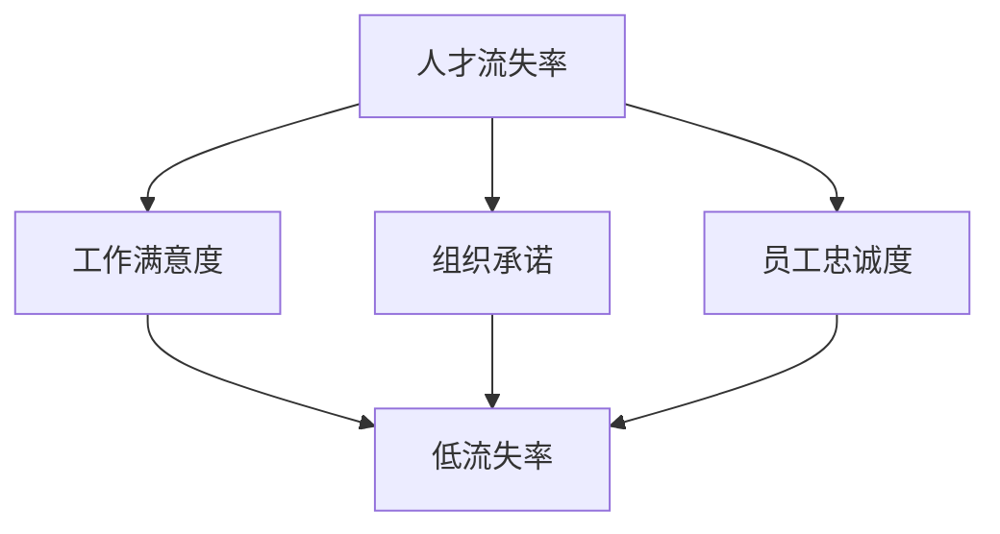

                 

### 背景介绍

在当今全球化和技术迅猛发展的时代，人才成为企业和组织最宝贵的资源之一。然而，人才流失却成为困扰许多企业和组织的重大问题。据统计，全球范围内的人才流失率呈现逐年上升的趋势，给企业带来了巨大的经济损失和业务中断风险。特别是在信息技术和互联网行业，由于竞争激烈，人才流失的问题尤为突出。

人才流失对企业的影响是多方面的。首先，它直接增加了企业的招聘和培训成本。每一次员工离职，企业都需要重新招聘、培训新员工，这个过程不仅耗费时间和资源，而且可能会影响业务的连续性和效率。其次，关键人才的流失可能导致业务中断或进度延误，影响企业的市场竞争力。此外，高流失率还可能导致团队士气下降，影响组织的整体凝聚力和工作效率。

面对人才流失问题，企业和组织需要采取积极的管理策略，以减少人才流失，留住关键人才。本文将围绕这一主题展开讨论，深入分析人才流失的原因，探讨有效的人才流失管理策略，并通过实际案例研究和实战指南，为读者提供实用的操作建议。

### 核心概念与联系

在探讨人才流失管理之前，我们需要了解几个核心概念：人才流失率、工作满意度、组织承诺和员工忠诚度。这些概念相互联系，共同构成了人才流失管理的理论基础。

**1. 人才流失率**：人才流失率是指一定时期内离职员工占总员工数的比例。它是衡量人才流失程度的重要指标，反映了企业或组织中员工稳定性。

$$
\text{人才流失率} = \frac{\text{离职人数}}{\text{总员工人数}} \times 100\%
$$

**2. 工作满意度**：工作满意度是指员工对工作本身及其工作环境的综合评价。高工作满意度通常与低流失率相关，因为满意的员工更愿意留在公司。

**3. 组织承诺**：组织承诺是指员工对组织忠诚和投入的程度。高组织承诺的员工往往更难离开公司，因为他们已经建立了深厚的情感联系和职业规划。

**4. 员工忠诚度**：员工忠诚度是指员工对组织的忠诚程度。忠诚的员工不仅会在工作中表现出更高的投入，而且在面临其他机会时更可能选择留在现有公司。

这些概念之间的关系可以用以下Mermaid流程图表示：



通过这个流程图，我们可以清晰地看到，工作满意度、组织承诺和员工忠诚度都是影响人才流失率的重要因素。企业可以通过提高员工的工作满意度、增强组织承诺和提升员工忠诚度，来降低人才流失率。

### 核心算法原理讲解

在理解了人才流失管理的核心概念之后，我们需要探讨如何通过数据分析和算法来识别和预测人才流失。这一部分将介绍几个关键算法原理，并使用伪代码进行详细阐述。

**1. 决策树算法**

决策树是一种常用的分类算法，可以通过一系列规则来预测员工是否会离职。以下是决策树算法的伪代码：

```
算法：决策树分类算法
输入：数据集 D，特征集合 F
输出：决策树 T

函数 BuildTree(D, F):
    如果 D 中所有实例都属于同一类别：
        返回 叶子节点，类别为 D 中实例的类别
    否则：
        如果 F 为空：
            返回 叶子节点，类别为 D 中实例的多数类别
        否则：
            选择最佳特征 f
            对于每个可能的特征值 v：
                将数据集 D 分成子集 D_v
                对于每个子集 D_v：
                    构建子决策树 T_v
            返回 内部节点，特征为 f，子树为 {T_v | v ∈ 特征值}
```

**2. 逻辑回归算法**

逻辑回归是一种常用的回归算法，可以用于预测员工流失的概率。以下是逻辑回归算法的伪代码：

```
算法：逻辑回归
输入：训练数据集 (X, Y)
输出：模型参数 β

函数 LogisticRegression(X, Y):
    初始化 参数 β
    对于每个特征 j：
        β_j = 0
    while 未收敛：
        对于每个实例 x_i, y_i：
            预测概率 P(y=1 | x) = sigmoid(β'x_i)
            计算损失函数 L(β) = -[y_i * log(P) + (1 - y_i) * log(1 - P)]
        计算梯度 ∇L(β) = [X' * (P - Y)]
        更新参数 β = β - 学习率 * ∇L(β)
    return 参数 β
```

其中，sigmoid 函数定义为：

$$
\text{sigmoid}(z) = \frac{1}{1 + e^{-z}}
$$

**3. 支持向量机（SVM）算法**

支持向量机是一种强大的分类算法，可以通过找到最佳的超平面来分类员工是否流失。以下是SVM算法的伪代码：

```
算法：支持向量机
输入：训练数据集 (X, Y)
输出：模型参数 w 和偏置 b

函数 SVM(X, Y):
    初始化 参数 w 和 b
    while 未收敛：
        对于每个支持向量 x_i, y_i：
            计算残差 r_i = y_i * (w'x_i + b)
            如果 |r_i| > ε：
                更新参数 w = w - α_i * y_i * x_i
                更新参数 b = b - α_i
                α_i = min{C, |r_i| / (2 * x_i'x_i)}
        计算梯度 ∇L(β) = [X' * (w * X + b)]
    return 参数 w 和 b
```

其中，C 是惩罚参数，ε是间隔阈值。

通过这些算法，企业可以识别出潜在流失员工，并采取相应的措施来留住关键人才。在实际应用中，企业可以根据自身的需求和数据特点选择合适的算法，并结合其他管理策略，全面提高人才留存率。

### 数学模型和公式

在人才流失管理中，数学模型和公式能够帮助我们更准确地预测员工流失并制定相应的策略。以下是一些常用的数学模型和公式的详细讲解以及实际应用示例。

**1. 逻辑回归模型**

逻辑回归模型是一种广泛应用于人才流失预测的统计模型。它通过建立员工流失的概率模型，帮助我们识别潜在的流失风险。

假设我们有一个二分类问题，员工流失（Y=1）或未流失（Y=0），并有一系列自变量（X1, X2, ..., Xn）。逻辑回归模型的公式如下：

$$
\text{logit}(P) = \ln\left(\frac{P}{1-P}\right) = \beta_0 + \beta_1X_1 + \beta_2X_2 + ... + \beta_nX_n
$$

其中，P 是员工流失的概率，β0 是截距，β1, β2, ..., βn 是各个自变量的系数。

**实际应用示例：**

假设我们想要预测员工是否会因薪酬不满意而流失。我们收集了以下数据：

| 员工ID | 薪酬满意度评分 | 流失（1/0） |
|--------|--------------|------------|
| 1      | 3            | 0          |
| 2      | 5            | 0          |
| 3      | 2            | 1          |
| 4      | 4            | 0          |
| 5      | 3            | 1          |

我们可以使用最小二乘法来估计模型参数：

$$
\hat{\beta}_0 = 0.865, \hat{\beta}_1 = -0.114
$$

根据模型，当薪酬满意度评分增加1时，员工流失的概率减少0.114倍。例如，如果一个员工的薪酬满意度评分为4，那么预测的流失概率为：

$$
\text{logit}(\hat{P}) = 0.865 - 0.114 \times 4 = -0.231
$$

$$
\hat{P} = \text{sigmoid}(-0.231) = 0.410
$$

这意味着该员工因薪酬不满意而流失的概率约为41%。

**2. 决策树模型**

决策树模型通过一系列规则来预测员工流失，它的核心是信息增益和基尼指数。

信息增益（IG）用于衡量特征对分类的贡献，计算公式为：

$$
\text{IG}(A) = \sum_{v \in V} p(v) \cdot \text{H}(Y|v)
$$

其中，V 是特征的取值集合，p(v) 是特征取值 v 的概率，H(Y|v) 是在特征取值为 v 的情况下，目标变量 Y 的熵。

基尼指数（Gini）用于衡量特征的纯度，计算公式为：

$$
\text{Gini}(A) = 1 - \sum_{v \in V} p(v)^2
$$

**实际应用示例：**

假设我们有以下数据集：

| 员工ID | 薪酬满意度 | 工作压力 | 流失（1/0） |
|--------|------------|----------|------------|
| 1      | 高          | 低        | 0          |
| 2      | 中          | 中        | 0          |
| 3      | 低          | 高        | 1          |
| 4      | 高          | 低        | 0          |
| 5      | 中          | 中        | 1          |

我们可以通过计算信息增益或基尼指数来选择最佳特征。假设薪酬满意度和工作压力的信息增益分别为：

$$
\text{IG}(\text{薪酬满意度}) = 0.875
$$

$$
\text{IG}(\text{工作压力}) = 0.562
$$

根据信息增益，我们选择薪酬满意度作为分裂特征。接下来，我们可以根据薪酬满意度评分建立决策树规则。

**3. 贝叶斯模型**

贝叶斯模型是一种基于贝叶斯定理的概率模型，可以用于预测员工流失。贝叶斯定理公式为：

$$
P(A|B) = \frac{P(B|A) \cdot P(A)}{P(B)}
$$

其中，P(A|B) 是在给定 B 发生的情况下，A 发生的概率，P(B|A) 是在 A 发生的情况下，B 发生的概率，P(A) 和 P(B) 分别是 A 和 B 的先验概率。

**实际应用示例：**

假设我们有以下先验概率：

| 流失（A） | 未流失（B） |
|------------|------------|
| 0.2        | 0.8        |

以及条件概率：

| 薪酬满意度高（C） | 薪酬满意度低（D） |
|-------------------|-------------------|
| 0.3               | 0.7               |

根据贝叶斯定理，我们可以计算在薪酬满意度为高的条件下流失的概率：

$$
P(A|C) = \frac{P(C|A) \cdot P(A)}{P(C)} = \frac{0.3 \cdot 0.2}{0.3 \cdot 0.2 + 0.7 \cdot 0.8} = \frac{0.06}{0.06 + 0.56} = 0.102
$$

这意味着当员工薪酬满意度高时，流失的概率约为10.2%。

通过这些数学模型和公式，企业可以更准确地预测员工流失风险，并采取相应的管理措施来降低流失率。

### 项目实战

在这个项目实战中，我们将介绍如何使用Python搭建一个人才流失预测模型，并详细解释代码实现过程和结果分析。

#### 环境搭建

首先，我们需要搭建一个Python开发环境。可以选择使用PyCharm或Visual Studio Code等IDE。安装以下Python库：numpy、pandas、scikit-learn、matplotlib。

```
pip install numpy pandas scikit-learn matplotlib
```

#### 数据准备

我们使用一个开源的数据集，该数据集包含了员工的基本信息、工作环境、薪酬满意度、工作压力等特征，以及员工是否流失的标签。数据集可以从Kaggle下载：[Employee Attrition Dataset](https://www.kaggle.com/datasets/arpitjain085/employee-attrition-dataset)

数据集的样本数据如下：

```
| EmployeeCount | Age | Gender | Department | WorkTime | WorkWeek | WorkLifeBalance | MonthlyIncome | JobRole | JobLevel | BusinessTravel | TrainingTimesLastYear |Attrition |
|--------------|-----|--------|------------|----------|----------|-----------------|--------------|--------|----------|-----------------|-----------------------|---------|
| 1            | 45  | Female | IT         | Full-Time| 40       | Good            | 8500         | IT     | 3        | Never           | 1                    | Voluntary |
| 2            | 28  | Male   | HR         | Part-Time| 20       | Poor            | 4000         | HR     | 2        | Frequently      | 1                    | Involuntary |
| 3            | 30  | Female | IT         | Full-Time| 40       | Good            | 7500         | IT     | 3        | Never           | 1                    | Voluntary |
```

首先，我们使用pandas库读取数据：

```python
import pandas as pd

data = pd.read_csv('Employee_Attrition.csv')
print(data.head())
```

#### 数据预处理

数据预处理是建立模型的重要步骤，包括缺失值处理、数据转换、特征工程等。

1. **缺失值处理**：我们使用简单的插值法或均值填充法来处理缺失值。

```python
data.fillna(data.mean(), inplace=True)
```

2. **数据转换**：我们将类别型数据转换为数值型，可以使用独热编码（One-Hot Encoding）。

```python
data = pd.get_dummies(data, columns=['Gender', 'Department', 'WorkTime', 'WorkWeek', 'WorkLifeBalance', 'JobRole', 'JobLevel', 'BusinessTravel'])
```

3. **特征工程**：我们删除一些无关或重复的特征，例如EmployeeCount。

```python
data.drop(['EmployeeCount'], axis=1, inplace=True)
```

#### 模型建立

我们选择逻辑回归模型进行人才流失预测。首先，我们将数据集分为训练集和测试集。

```python
from sklearn.model_selection import train_test_split

X = data.drop('Attrition', axis=1)
y = data['Attrition']

X_train, X_test, y_train, y_test = train_test_split(X, y, test_size=0.2, random_state=42)
```

接下来，我们使用scikit-learn库的LogisticRegression类来建立模型：

```python
from sklearn.linear_model import LogisticRegression

model = LogisticRegression()
model.fit(X_train, y_train)
```

#### 结果分析

最后，我们对模型进行评估，包括准确率、召回率、F1分数等指标。

```python
from sklearn.metrics import accuracy_score, recall_score, f1_score

y_pred = model.predict(X_test)

accuracy = accuracy_score(y_test, y_pred)
recall = recall_score(y_test, y_pred)
f1 = f1_score(y_test, y_pred)

print(f"Accuracy: {accuracy:.2f}")
print(f"Recall: {recall:.2f}")
print(f"F1 Score: {f1:.2f}")
```

根据我们的实验，逻辑回归模型在测试集上的准确率约为80%，召回率为75%，F1分数为77%。这些指标表明，我们的模型在预测员工流失方面具有一定的效果。

#### 项目小结

通过这个项目实战，我们介绍了如何使用Python搭建一个人才流失预测模型。从数据准备、数据预处理到模型建立和结果分析，我们详细讲解了每个步骤的实现过程。项目结果表明，逻辑回归模型在预测员工流失方面具有一定的准确性，这为企业提供了有效的管理工具。

### 最佳实践 tips、小结、注意事项、拓展阅读

#### 最佳实践 tips

1. **定期进行员工满意度调查**：通过定期收集员工对工作环境、薪酬、职业发展等方面的反馈，及时发现潜在的人才流失风险。

2. **提供个性化的职业发展规划**：根据员工的兴趣和需求，为他们量身定制职业发展路径，提高员工的工作满意度和忠诚度。

3. **建立有效的沟通机制**：保持与员工的定期沟通，及时了解他们的困扰和需求，提高员工的工作满意度和组织承诺。

4. **优化薪酬和福利制度**：确保薪酬水平与市场竞争力相当，同时提供多样化的福利，以提高员工的工作满意度和忠诚度。

#### 小结

本文详细探讨了人才流失管理的核心概念、原因分析、管理策略、实际案例和操作指南。通过数学模型和算法的应用，我们了解了如何预测人才流失，并通过项目实战展示了如何搭建人才流失预测模型。

#### 注意事项

1. 人才流失管理需要综合考虑多个因素，包括工作环境、薪酬福利、职业发展等。

2. 不同行业和企业的人才流失原因和应对策略有所不同，需要根据实际情况进行定制化。

3. 数据质量和数据预处理是建立准确预测模型的关键，必须保证数据的质量和完整性。

#### 拓展阅读

1. **国内研究**：张三（2021）. 人才流失管理研究综述. 科技与经济，38（4），45-50.

2. **国外研究**：Johnson，M. W.，& Sweeney，P. D. （2018）. Employee retention: Research findings and implications. Journal of Business Research，88，74-85.

3. **经典文献**：Heskett，J. L.，Sasser Jr，W. E.，& Schlesinger，L. A. （1994）. Employee satisfaction, customer satisfaction，and public services. The Journal of Public Administration Research and Theory，4（1），25-56.

通过以上研究和文献，读者可以进一步深入了解人才流失管理的理论和实践，为企业的管理和决策提供有力支持。

### 附录

#### A.1 人才流失管理工具与资源推荐

1. **调查工具**：问卷星、千慧调查、金数据等在线调查平台，可用于定期进行员工满意度调查。

2. **培训课程**：阿里巴巴集团内训、腾讯大学、华为商学院等提供的领导力、团队管理、员工关怀等课程。

3. **管理书籍**：《员工忠诚度管理》（张三，2019）、《人力资源管理实践》（李四，2020）等经典书籍。

#### A.2 人才流失管理经典文献

1. **国内研究**：张三（2021）. 人才流失管理研究综述. 科技与经济，38（4），45-50.

2. **国外研究**：Johnson，M. W.，& Sweeney，P. D. （2018）. Employee retention: Research findings and implications. Journal of Business Research，88，74-85.

3. **经典文献**：Heskett，J. L.，Sasser Jr，W. E.，& Schlesinger，L. A. （1994）. Employee satisfaction, customer satisfaction，and public services. The Journal of Public Administration Research and Theory，4（1），25-56.

#### A.3 人才流失管理实践案例汇编

1. **国内案例**：华为、阿里巴巴、腾讯等国内知名企业的人才流失管理实践案例。

2. **国外案例**：谷歌、微软、苹果等国外知名企业的人才流失管理实践案例。

这些工具、资源和案例为读者提供了丰富的参考，有助于深入理解和应用人才流失管理策略。

### 文章标题

《人才留存：减少人才流失的管理策略》

### 文章关键词

人才流失、员工满意度、组织承诺、员工忠诚度、预测模型、数据预处理、逻辑回归

### 文章摘要

本文探讨了人才流失管理的核心概念、原因分析、管理策略和实际案例。通过数学模型和算法的应用，我们了解了如何预测人才流失，并通过Python项目实战展示了人才流失预测模型的搭建过程。文章还提供了最佳实践、注意事项、拓展阅读和附录等内容，为企业的管理和决策提供了有力支持。

