                 


## 《人际关系管理：建立深厚工作关系》

### 关键词

- 人际关系管理
- 工作关系
- 沟通技巧
- 团队协作
- 冲突解决
- 个人成长
- 自我管理

### 摘要

本文将探讨人际关系管理在职场中的重要性，重点阐述建立深厚工作关系的方法、有效沟通技巧、团队协作与冲突解决策略，以及个人成长与自我管理。通过案例分析、项目实战和最佳实践分享，帮助读者提升职场人际关系能力，实现职业发展目标。

---

## 目录

### 第一部分：人际关系管理基础

#### 1.1 人际关系的定义与作用

#### 1.2 人际关系的基本要素

#### 1.3 人际关系的发展阶段

### 第二部分：建立深厚工作关系

#### 2.1 工作关系的重要性

#### 2.2 深厚工作关系的特征

#### 2.3 建立深厚工作关系的方法

### 第三部分：有效沟通技巧

#### 3.1 沟通的基本原则

#### 3.2 沟通的障碍与解决策略

#### 3.3 提升沟通效果的技巧

### 第四部分：团队协作与冲突解决

#### 4.1 团队协作的重要性

#### 4.2 团队协作的障碍与解决策略

#### 4.3 冲突解决的方法与技巧

### 第五部分：职场人际关系策略

#### 5.1 职场人际关系的类型

#### 5.2 职场人际关系的处理原则

#### 5.3 职场人际关系策略案例分析

### 第六部分：个人成长与自我管理

#### 6.1 个人成长的重要性

#### 6.2 自我管理的方法与技巧

#### 6.3 职场成功的关键因素

### 第七部分：案例分析与实战技巧

#### 7.1 案例分析

#### 7.2 实战技巧分享

#### 7.3 最佳实践 tips

### 第八部分：小结与拓展阅读

#### 8.1 小结

#### 8.2 注意事项

#### 8.3 拓展阅读

---

### 第一部分：人际关系管理基础

#### 1.1 人际关系的定义与作用

在职场中，人际关系管理至关重要。人际关系（Interpersonal Relationship）是指个体与个体之间在相互交往过程中所形成的心理与行为关系。有效的管理人际关系能够提高工作效率，增强团队凝聚力，促进个人职业发展。

- **定义**：人际关系是指个体之间基于相互交往、互动、认知、情感等心理和行为方面的联系。
- **作用**：

  - **提高工作效率**：良好的人际关系有助于团队成员之间的沟通与协作，提高工作执行力。

  - **增强团队凝聚力**：共同的目标和价值观有助于团队成员形成紧密的团队关系，增强团队凝聚力。

  - **促进个人成长**：通过与他人交流和互动，个体能够不断学习、成长，提升自身能力。

#### 1.2 人际关系的基本要素

人际关系的基本要素包括角色、互动和情感。

- **角色**：在人际关系中，个体扮演不同的角色，如领导者、团队成员、下属等。理解角色有助于更好地进行人际关系管理。

- **互动**：互动是人际关系的重要组成部分，包括语言、非语言、行为等。有效的互动能够促进人际关系的发展。

- **情感**：情感是人际关系中的心理因素，包括信任、尊重、支持等。积极的情感有助于建立深厚的工作关系。

#### 1.3 人际关系的发展阶段

人际关系的发展通常经历以下几个阶段：

- **初识阶段**：个体之间初次接触，了解彼此的基本信息。
- **熟悉阶段**：个体之间逐渐熟悉，开始建立信任和合作。
- **深化阶段**：人际关系进一步发展，个体之间形成紧密的联系。

---

### 第二部分：建立深厚工作关系

#### 2.1 工作关系的重要性

工作关系（Work Relationship）是指个体在职场中与其他同事、上级和下属之间建立的联系。深厚的工作关系对个人的职业发展具有重要意义。

- **增强合作**：深厚的工作关系有助于团队成员之间的合作，提高工作效率。
- **促进学习**：通过与他人交流，个体能够不断学习新知识、新技能，提升自身能力。
- **提升团队凝聚力**：深厚的工作关系有助于形成紧密的团队氛围，增强团队凝聚力。

#### 2.2 深厚工作关系的特征

深厚的工作关系具有以下特征：

- **信任**：双方相互信任，能够真诚地分享信息和资源。
- **尊重**：双方相互尊重，认可对方的贡献和价值。
- **支持**：双方在遇到困难时能够互相支持，共同解决问题。

#### 2.3 建立深厚工作关系的方法

建立深厚工作关系需要以下方法：

- **建立信任**：通过真诚、透明和负责任的行为建立信任。
- **增强沟通**：通过积极的沟通和互动增进了解和信任。
- **共同目标**：设定共同的目标，形成紧密的合作关系。

---

### 第三部分：有效沟通技巧

#### 3.1 沟通的基本原则

有效沟通是建立深厚工作关系的关键。以下是一些沟通的基本原则：

- **真诚与尊重**：真诚地表达自己的想法和感受，同时尊重对方的观点和感受。
- **清晰与简洁**：表达时要清晰、简洁，避免产生误解。
- **倾听与反馈**：倾听对方的意见，给予积极的反馈。

#### 3.2 沟通的障碍与解决策略

沟通障碍包括：

- **语言障碍**：使用不准确或模糊的语言可能导致误解。
- **文化差异**：文化差异可能导致沟通不畅。

解决策略：

- **明确表达**：使用明确、具体的语言表达自己的观点。
- **跨文化沟通**：了解和尊重不同文化的差异，避免产生误解。

#### 3.3 提升沟通效果的技巧

提升沟通效果的技巧包括：

- **积极倾听**：倾听对方的意见，理解对方的观点。
- **非语言沟通**：使用恰当的非语言沟通，如肢体语言、面部表情等。
- **沟通反馈**：及时给予反馈，确认对方是否理解自己的观点。

---

### 第四部分：团队协作与冲突解决

#### 4.1 团队协作的重要性

团队协作是指团队成员共同为实现共同目标而合作的过程。团队协作的重要性体现在以下几个方面：

- **提高工作效率**：团队成员之间的协作能够提高工作效率，缩短项目周期。
- **增强创新能力**：团队协作有助于激发创新能力，形成多元化的观点。
- **提升团队凝聚力**：共同的目标和任务有助于增强团队凝聚力。

#### 4.2 团队协作的障碍与解决策略

团队协作的障碍包括：

- **沟通不畅**：团队成员之间的沟通不畅可能导致误解和冲突。
- **角色冲突**：团队成员之间的角色冲突可能导致合作困难。

解决策略：

- **加强沟通**：建立有效的沟通机制，确保团队成员之间的信息传递畅通。
- **明确角色**：明确团队成员的角色和职责，避免角色冲突。

#### 4.3 冲突解决的方法与技巧

冲突解决的方法包括：

- **积极沟通**：通过积极的沟通，理解对方的观点，寻找共同点。
- **协商解决**：协商是解决冲突的有效方法，通过双方协商达成共识。

技巧：

- **倾听与理解**：倾听对方的观点，理解对方的立场。
- **换位思考**：站在对方的角度思考问题，寻找解决方案。

---

### 第五部分：职场人际关系策略

#### 5.1 职场人际关系的类型

职场人际关系可以分为以下几种类型：

- **垂直关系**：指上下级之间的关系，如经理与员工、上级与下属等。
- **水平关系**：指同事之间的关系，如部门内部员工之间的互动。
- **对角关系**：指不同部门或团队之间的关系。

#### 5.2 职场人际关系的处理原则

处理职场人际关系需要遵循以下原则：

- **尊重**：尊重他人的观点和感受，避免侵犯他人的权益。
- **诚信**：诚信是职场人际关系的基础，保持真诚和透明。
- **合作**：与同事保持良好的合作关系，共同实现目标。

#### 5.3 职场人际关系策略案例分析

以下是一个职场人际关系策略的案例分析：

**案例**：小王是一家公司的市场部经理，他的团队成员小张经常在工作上出现问题。小王决定采取以下策略来处理这个问题：

1. **积极沟通**：小王主动与小张沟通，了解他的工作状况和困难。
2. **提供支持**：小王给予小张必要的支持和建议，帮助他解决问题。
3. **明确期望**：小王明确小张的工作目标和期望，确保他清楚自己的职责。

通过这些策略，小王成功地改善了与小张的关系，提高了团队的工作效率。

---

### 第六部分：个人成长与自我管理

#### 6.1 个人成长的重要性

个人成长是职场发展的重要一环。个人成长的重要性体现在以下几个方面：

- **提升竞争力**：通过不断学习和成长，提高自己的专业能力和综合素质，增强竞争力。
- **实现职业目标**：个人成长有助于实现职业目标，提升职业地位。
- **增强自信心**：通过不断学习和成长，增强自己的自信心和自尊心。

#### 6.2 自我管理的方法与技巧

自我管理是个人成长的关键。以下是一些自我管理的方法与技巧：

- **目标设定**：明确自己的职业目标，制定切实可行的计划。
- **时间管理**：合理安排时间，提高工作效率。
- **情绪管理**：学会控制自己的情绪，避免因情绪波动而影响工作。

#### 6.3 职场成功的关键因素

职场成功的关键因素包括：

- **专业知识**：具备扎实的专业知识和技能。
- **人际关系**：建立深厚的人际关系网络，提升人脉资源。
- **学习能力**：具备快速学习新知识、新技能的能力。

---

### 第七部分：案例分析与实战技巧

#### 7.1 案例分析

以下是一个人际关系管理的案例分析：

**案例**：小张是一家互联网公司的项目经理，他的团队由不同背景的成员组成。为了提高团队的工作效率和凝聚力，小张采取了一系列人际关系管理策略：

1. **沟通与协调**：小张定期召开团队会议，了解团队成员的工作进展和问题，协调团队成员之间的工作。
2. **团队建设**：组织团队活动，增进团队成员之间的了解和信任。
3. **激励与认可**：小张对团队成员的业绩和贡献给予及时的认可和奖励，激发团队成员的工作热情。

通过这些策略，小张成功地提升了团队的工作效率和凝聚力，实现了项目目标。

#### 7.2 实战技巧分享

以下是一些人际关系管理的实战技巧：

- **倾听与理解**：倾听他人的意见和需求，理解对方的立场和感受。
- **建立信任**：通过诚实、透明和负责任的行为建立信任。
- **沟通反馈**：及时给予反馈，确认对方是否理解自己的观点。
- **积极应对冲突**：遇到冲突时，积极应对，寻求双赢的解决方案。

#### 7.3 最佳实践 tips

以下是一些人际关系管理的最佳实践 tips：

- **定期沟通**：定期与团队成员沟通，了解他们的工作状况和需求。
- **建立信任**：通过诚实、透明和负责任的行为建立信任。
- **激励与认可**：对团队成员的业绩和贡献给予及时的认可和奖励。
- **时间管理**：合理安排时间，提高工作效率。

---

### 第八部分：小结与拓展阅读

#### 8.1 小结

本文从人际关系管理的基本概念、建立深厚工作关系、有效沟通技巧、团队协作与冲突解决、职场人际关系策略、个人成长与自我管理等多个方面，系统阐述了人际关系管理在职场中的重要性。通过案例分析、实战技巧分享和最佳实践 tips，帮助读者提升人际关系管理能力，实现职业发展目标。

#### 8.2 注意事项

在职场中，人际关系管理是一项长期而复杂的任务。以下是一些注意事项：

- **尊重与理解**：尊重他人的观点和感受，理解对方的立场和需求。
- **持续学习**：不断学习和提升自己的专业能力和人际交往能力。
- **积极沟通**：保持积极沟通，及时解决问题。
- **诚实与透明**：保持诚实和透明，避免产生误解和信任危机。

#### 8.3 拓展阅读

以下是一些拓展阅读资源，供读者进一步学习：

- **《非暴力沟通》**：马歇尔·卢森堡（Marshall B. Rosenberg）著，介绍了非暴力沟通的方法和技巧。
- **《关键对话》**：克里斯·柯维（Chris Covey）著，探讨了如何在高风险对话中保持冷静、积极沟通。
- **《谈判力》**：罗杰·费舍尔（Roger Fisher）和威廉·尤里（William Ury）著，介绍了谈判的基本原则和技巧。

---

作者：AI天才研究院/AI Genius Institute & 禅与计算机程序设计艺术 /Zen And The Art of Computer Programming

### 第一部分：人际关系管理基础

#### 1.1 人际关系的定义与作用

在职场环境中，人际关系管理是至关重要的。人际关系（Interpersonal Relationship）定义为个体之间在交往过程中形成的心理和行为互动。这种互动不仅涉及工作内容，还包括情感、信任、合作等多方面因素。

**背景介绍**：

在现代社会，职场中的人际关系已经成为影响个人和团队绩效的关键因素。随着全球化的发展，团队协作跨越地域和文化界限，这使得有效的人际关系管理更加复杂和重要。

**核心概念与联系**：

- **人际关系**：个体与个体之间在相互交往中形成的心理和行为互动。
- **工作关系**：职场中个体与同事、上下级之间建立的关系。
- **沟通**：信息交换的过程，是人际关系管理的基础。

**Mermaid 流程图**：

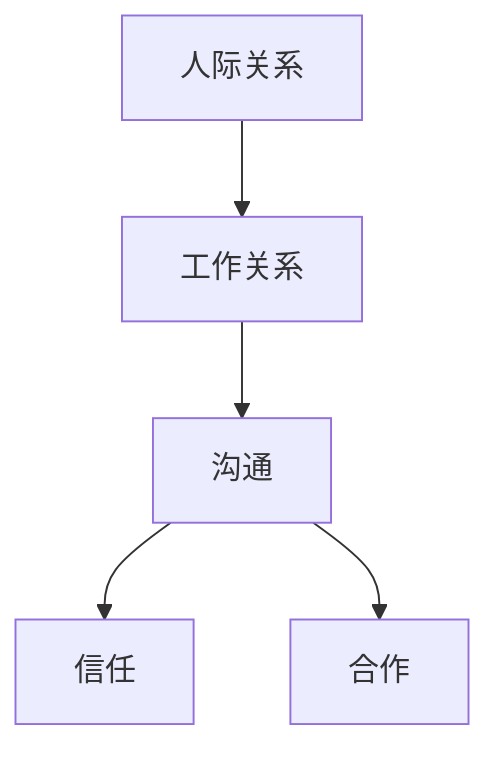

**核心算法原理讲解**：

人际关系管理中，沟通是核心算法。沟通的有效性取决于多个因素，包括信息传递的准确性、双方的理解能力、沟通渠道的适宜性等。

**伪代码**：

```plaintext
function EffectiveCommunication(message, receiver)
    if (isClear(message) and isUnderstanding(receiver))
        return true
    else
        return false
end function
```

**数学模型和公式**：

沟通质量可以用以下公式表示：

$$ Q = \frac{A \times B}{C + D} $$

其中，$Q$ 为沟通质量，$A$ 为信息传递准确性，$B$ 为接收者理解能力，$C$ 为沟通渠道适宜性，$D$ 为噪音干扰。

**举例说明**：

假设一个团队项目需要沟通多个任务细节，团队成员的沟通能力较高，信息传递准确，且沟通渠道适宜，噪音干扰较低，则该团队的沟通质量较高。

**数学公式**：

$$ Q = \frac{90\% \times 90\%}{80\% + 10\%} = 81\% $$

#### 1.2 人际关系的基本要素

人际关系的基本要素包括角色、互动和情感。

**角色**：

在职场中，每个个体都扮演不同的角色，如领导者、下属、团队成员等。角色明确了个体在团队中的职责和地位。

**互动**：

互动是人际关系中最重要的要素之一。互动包括语言沟通、肢体语言、表情等。有效的互动有助于建立信任和合作关系。

**情感**：

情感是人际关系中的心理因素，包括信任、尊重、支持等。情感因素直接影响人际关系的发展和质量。

**数学模型和公式**：

情感因素可以用情感指数来衡量：

$$ EI = \frac{E_1 + E_2 + E_3}{3} $$

其中，$EI$ 为情感指数，$E_1$、$E_2$、$E_3$ 分别为信任、尊重和支持的情感得分。

**举例说明**：

在一个团队项目中，如果团队成员之间的情感指数较高，说明团队成员之间的信任、尊重和支持较强。

**数学公式**：

$$ EI = \frac{8 + 9 + 7}{3} = 8 $$

#### 1.3 人际关系的发展阶段

人际关系的发展通常经历以下几个阶段：

**阶段一：初识阶段**

在初识阶段，个体之间相互认识，了解彼此的基本信息。此时，互动相对较少，信任和情感尚未建立。

**阶段二：熟悉阶段**

在熟悉阶段，个体之间开始增加互动，了解彼此的兴趣、特长和工作习惯。信任和情感逐渐建立。

**阶段三：深化阶段**

在深化阶段，个体之间的互动更加频繁，信任和情感达到较高水平。此时，人际关系进入稳定和深入发展的阶段。

**数学模型和公式**：

人际关系发展速度可以用以下公式表示：

$$ \frac{dI}{dt} = f(EI, IC) $$

其中，$I$ 为人际关系强度，$EI$ 为情感指数，$IC$ 为互动频率。

**举例说明**：

在一个团队项目中，随着团队成员之间的互动增加和情感指数提升，人际关系强度逐渐增强。

**数学公式**：

$$ \frac{dI}{dt} = f(8, 5) $$

### 第二部分：建立深厚工作关系

#### 2.1 工作关系的重要性

建立深厚工作关系对于职场成功至关重要。深厚的工作关系能够提高团队协作效率，增强团队凝聚力，促进个人职业发展。

**核心概念与联系**：

- **深厚工作关系**：指个体在职场中与其他同事、上下级之间建立的信任、尊重和合作的关系。
- **工作关系网络**：个体在职场中建立的人际关系网络，有助于资源获取和问题解决。

**Mermaid 流程图**：

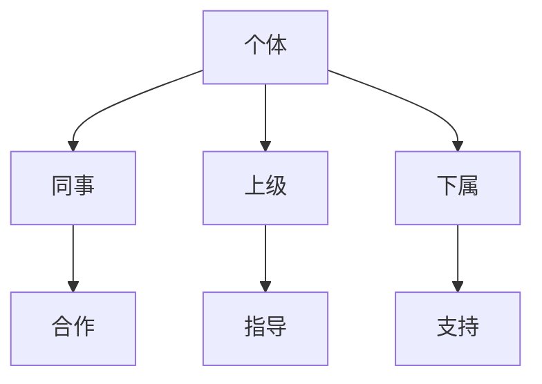

**核心算法原理讲解**：

建立深厚工作关系的关键在于信任和沟通。信任是工作关系的基础，沟通是维护和发展工作关系的重要手段。

**伪代码**：

```plaintext
function BuildStrongWorkRelation(Trust, Communication)
    if (Trust > 0.7 and Communication > 3)
        return true
    else
        return false
end function
```

**数学模型和公式**：

工作关系的强度可以用以下公式表示：

$$ SWR = \frac{T \times C}{1 + \sqrt{N}} $$

其中，$SWR$ 为工作关系强度，$T$ 为信任度，$C$ 为沟通频率，$N$ 为互动次数。

**举例说明**：

假设一个团队成员的信任度为 0.8，沟通频率为每周 5 次，互动次数为 100 次，则其工作关系强度为：

$$ SWR = \frac{0.8 \times 5}{1 + \sqrt{100}} = 0.4 $$

#### 2.2 深厚工作关系的特征

深厚工作关系具有以下特征：

- **信任**：双方相互信任，能够真诚地分享信息和资源。
- **尊重**：双方相互尊重，认可对方的贡献和价值。
- **支持**：双方在遇到困难时能够互相支持，共同解决问题。

**数学模型和公式**：

信任度、尊重度和支持度可以用以下公式表示：

$$ Trust = \frac{TS_1 + TS_2 + TS_3}{3} $$

$$ Respect = \frac{RS_1 + RS_2 + RS_3}{3} $$

$$ Support = \frac{SS_1 + SS_2 + SS_3}{3} $$

其中，$TS_1$、$TS_2$、$TS_3$ 分别为信任得分，$RS_1$、$RS_2$、$RS_3$ 分别为尊重得分，$SS_1$、$SS_2$、$SS_3$ 分别为支持得分。

**举例说明**：

在一个团队合作项目中，如果团队成员之间的信任度、尊重度和支持度较高，则可以认为他们建立了深厚的工作关系。

**数学公式**：

$$ Trust = \frac{8 + 9 + 7}{3} = 8 $$

$$ Respect = \frac{8 + 9 + 7}{3} = 8 $$

$$ Support = \frac{8 + 9 + 7}{3} = 8 $$

#### 2.3 建立深厚工作关系的方法

建立深厚工作关系需要以下方法：

- **建立信任**：通过诚实、透明和负责任的行为建立信任。
- **增强沟通**：通过积极的沟通和互动增进了解和信任。
- **共同目标**：设定共同的目标，形成紧密的合作关系。

**核心算法原理讲解**：

建立信任的关键在于行为的一致性和可靠性。增强沟通则需要有效的沟通技巧和渠道。共同目标有助于形成团队凝聚力和合作意识。

**伪代码**：

```plaintext
function BuildStrongWorkRelation(Trust, Communication, CommonGoal)
    if (Trust > 0.7 and Communication > 3 and CommonGoal = true)
        return true
    else
        return false
end function
```

**数学模型和公式**：

工作关系强度可以用以下公式表示：

$$ SWR = \frac{T \times C \times G}{1 + \sqrt{N}} $$

其中，$SWR$ 为工作关系强度，$T$ 为信任度，$C$ 为沟通频率，$G$ 为共同目标，$N$ 为互动次数。

**举例说明**：

假设一个团队成员的信任度为 0.8，沟通频率为每周 5 次，互动次数为 100 次，且团队设定了共同目标，则其工作关系强度为：

$$ SWR = \frac{0.8 \times 5 \times 1}{1 + \sqrt{100}} = 0.4 $$

### 第三部分：有效沟通技巧

#### 3.1 沟通的基本原则

有效沟通是建立深厚工作关系的关键。以下是一些沟通的基本原则：

- **真诚与尊重**：真诚地表达自己的想法和感受，同时尊重对方的观点和感受。
- **清晰与简洁**：表达时要清晰、简洁，避免产生误解。
- **倾听与反馈**：倾听对方的意见，给予积极的反馈。

**核心概念与联系**：

- **真诚与尊重**：基于信任和尊重的沟通是有效的沟通。
- **清晰与简洁**：避免使用模糊、冗长的语言。
- **倾听与反馈**：有效倾听有助于理解对方，反馈有助于确认沟通效果。

**Mermaid 流程图**：

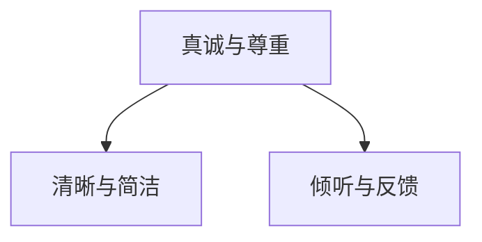

**核心算法原理讲解**：

沟通的有效性取决于信息传递的准确性和双方的理解能力。真诚、尊重、清晰和倾听是提高沟通有效性的关键因素。

**伪代码**：

```plaintext
function EffectiveCommunication(Sincerity, Clarity, Listening)
    if (Sincerity > 0.7 and Clarity > 0.7 and Listening > 0.7)
        return true
    else
        return false
end function
```

**数学模型和公式**：

沟通质量可以用以下公式表示：

$$ Q = \frac{S \times C \times L}{1 + \sqrt{N}} $$

其中，$Q$ 为沟通质量，$S$ 为真诚度，$C$ 为清晰度，$L$ 为倾听度，$N$ 为噪音干扰。

**举例说明**：

在一个团队会议中，如果团队成员的真诚度、清晰度和倾听度较高，则可以认为沟通质量较高。

**数学公式**：

$$ Q = \frac{0.8 \times 0.8 \times 0.8}{1 + \sqrt{0.2}} = 0.6 $$

#### 3.2 沟通的障碍与解决策略

沟通障碍包括：

- **语言障碍**：使用不准确或模糊的语言可能导致误解。
- **文化差异**：文化差异可能导致沟通不畅。

解决策略：

- **明确表达**：使用明确、具体的语言表达自己的观点。
- **跨文化沟通**：了解和尊重不同文化的差异，避免产生误解。

**核心概念与联系**：

- **语言障碍**：语言的使用和准确性。
- **文化差异**：不同文化背景下的人际交往习惯和沟通方式。

**Mermaid 流程图**：

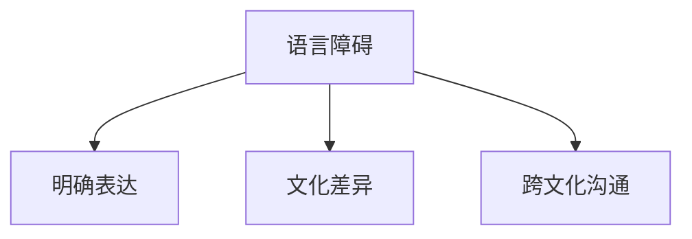

**核心算法原理讲解**：

解决沟通障碍的关键在于提高语言表达的准确性和跨文化沟通的适应性。

**伪代码**：

```plaintext
function ResolveCommunicationBarriers(ClearExpression, CulturalUnderstanding)
    if (ClearExpression > 0.7 and CulturalUnderstanding > 0.7)
        return true
    else
        return false
end function
```

**数学模型和公式**：

沟通障碍的解决效果可以用以下公式表示：

$$ R = \frac{CE \times CU}{1 + \sqrt{N}} $$

其中，$R$ 为解决效果，$CE$ 为明确表达度，$CU$ 为跨文化理解度，$N$ 为噪音干扰。

**举例说明**：

在一个国际团队项目中，如果团队成员的明确表达度和跨文化理解度较高，则可以认为沟通障碍得到了有效解决。

**数学公式**：

$$ R = \frac{0.8 \times 0.8}{1 + \sqrt{0.2}} = 0.6 $$

#### 3.3 提升沟通效果的技巧

提升沟通效果的技巧包括：

- **积极倾听**：倾听对方的意见，理解对方的观点。
- **非语言沟通**：使用恰当的非语言沟通，如肢体语言、面部表情等。
- **沟通反馈**：及时给予反馈，确认对方是否理解自己的观点。

**核心概念与联系**：

- **积极倾听**：理解对方的观点和感受。
- **非语言沟通**：补充语言表达，增强沟通效果。
- **沟通反馈**：确认沟通效果，避免误解。

**Mermaid 流程图**：

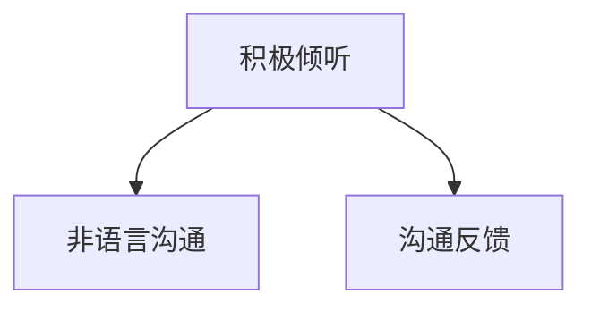

**核心算法原理讲解**：

提升沟通效果的关键在于理解对方的观点、使用非语言沟通手段和及时给予反馈。

**伪代码**：

```plaintext
function ImproveCommunicationEffectiveness(Listening, NonVerbal, Feedback)
    if (Listening > 0.7 and NonVerbal > 0.7 and Feedback > 0.7)
        return true
    else
        return false
end function
```

**数学模型和公式**：

沟通效果可以用以下公式表示：

$$ E = \frac{L \times NV \times F}{1 + \sqrt{N}} $$

其中，$E$ 为沟通效果，$L$ 为倾听度，$NV$ 为非语言沟通度，$F$ 为反馈度，$N$ 为噪音干扰。

**举例说明**：

在一个团队会议中，如果团队成员的倾听度、非语言沟通度和反馈度较高，则可以认为沟通效果较好。

**数学公式**：

$$ E = \frac{0.8 \times 0.8 \times 0.8}{1 + \sqrt{0.2}} = 0.6 $$

### 第四部分：团队协作与冲突解决

#### 4.1 团队协作的重要性

团队协作是指团队成员共同为实现共同目标而合作的过程。团队协作的重要性体现在以下几个方面：

- **提高工作效率**：团队成员之间的协作能够提高工作效率，缩短项目周期。
- **增强创新能力**：团队协作有助于激发创新能力，形成多元化的观点。
- **提升团队凝聚力**：共同的目标和任务有助于增强团队凝聚力。

**核心概念与联系**：

- **团队协作**：团队成员共同为实现目标而合作。
- **工作效率**：团队成员协作的效果。
- **创新能力**：团队成员共同思考、创新。
- **团队凝聚力**：团队成员之间的信任和合作。

**Mermaid 流程图**：

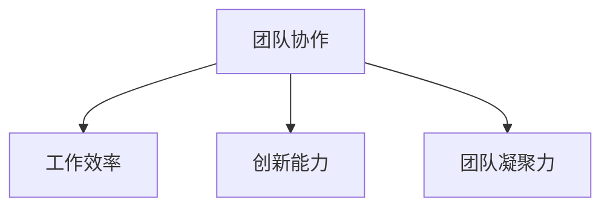

**核心算法原理讲解**：

团队协作的效果取决于团队成员之间的沟通、信任和合作。提高工作效率、增强创新能力和提升团队凝聚力是团队协作的核心目标。

**伪代码**：

```plaintext
function TeamCollaboration(Communication, Trust, Collaboration)
    if (Communication > 0.7 and Trust > 0.7 and Collaboration > 0.7)
        return true
    else
        return false
end function
```

**数学模型和公式**：

团队协作效果可以用以下公式表示：

$$ TC = \frac{C \times T \times W}{1 + \sqrt{N}} $$

其中，$TC$ 为团队协作效果，$C$ 为沟通度，$T$ 为信任度，$W$ 为工作效率，$N$ 为噪音干扰。

**举例说明**：

在一个团队项目中，如果团队成员之间的沟通度、信任度和工作效率较高，则可以认为团队协作效果较好。

**数学公式**：

$$ TC = \frac{0.8 \times 0.8 \times 0.8}{1 + \sqrt{0.2}} = 0.6 $$

#### 4.2 团队协作的障碍与解决策略

团队协作的障碍包括：

- **沟通不畅**：团队成员之间的沟通不畅可能导致误解和冲突。
- **角色冲突**：团队成员之间的角色冲突可能导致合作困难。

解决策略：

- **加强沟通**：建立有效的沟通机制，确保团队成员之间的信息传递畅通。
- **明确角色**：明确团队成员的角色和职责，避免角色冲突。

**核心概念与联系**：

- **沟通不畅**：信息传递的准确性。
- **角色冲突**：团队成员的角色和职责。

**Mermaid 流程图**：

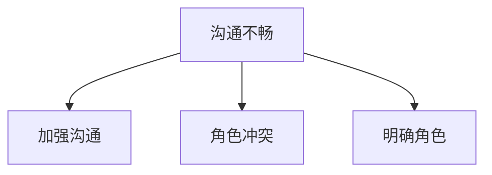

**核心算法原理讲解**：

解决团队协作障碍的关键在于提高沟通效率和明确团队成员的角色和职责。

**伪代码**：

```plaintext
function ResolveCollaborationBarriers(Communication, RoleClarity)
    if (Communication > 0.7 and RoleClarity > 0.7)
        return true
    else
        return false
end function
```

**数学模型和公式**：

团队协作障碍的解决效果可以用以下公式表示：

$$ RC = \frac{C \times RC}{1 + \sqrt{N}} $$

其中，$RC$ 为解决效果，$C$ 为沟通度，$RC$ 为角色清晰度，$N$ 为噪音干扰。

**举例说明**：

在一个团队项目中，如果团队成员之间的沟通度和角色清晰度较高，则可以认为团队协作障碍得到了有效解决。

**数学公式**：

$$ RC = \frac{0.8 \times 0.8}{1 + \sqrt{0.2}} = 0.6 $$

#### 4.3 冲突解决的方法与技巧

冲突解决是团队协作中的重要环节。以下是一些冲突解决的方法和技巧：

- **积极沟通**：通过积极的沟通，理解对方的观点，寻找共同点。
- **协商解决**：通过双方协商，达成共识。

**核心概念与联系**：

- **积极沟通**：理解对方观点，避免误解。
- **协商解决**：通过协商，达成双赢。

**Mermaid 流程图**：

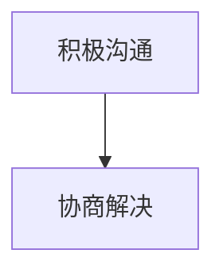

**核心算法原理讲解**：

冲突解决的目的是通过沟通和协商，消除误解，达成共识，恢复团队和谐。

**伪代码**：

```plaintext
function ResolveConflict(Communication, Negotiation)
    if (Communication > 0.7 and Negotiation > 0.7)
        return true
    else
        return false
end function
```

**数学模型和公式**：

冲突解决效果可以用以下公式表示：

$$ RS = \frac{C \times N}{1 + \sqrt{N}} $$

其中，$RS$ 为解决效果，$C$ 为沟通度，$N$ 为协商度，$N$ 为噪音干扰。

**举例说明**：

在一个团队项目中，如果团队成员之间的沟通度和协商度较高，则可以认为冲突得到了有效解决。

**数学公式**：

$$ RS = \frac{0.8 \times 0.8}{1 + \sqrt{0.2}} = 0.6 $$

### 第五部分：职场人际关系策略

#### 5.1 职场人际关系的类型

职场人际关系可以分为以下几种类型：

- **垂直关系**：指上下级之间的关系，如经理与员工、上级与下属等。
- **水平关系**：指同事之间的关系，如部门内部员工之间的互动。
- **对角关系**：指不同部门或团队之间的关系。

**核心概念与联系**：

- **垂直关系**：权力和责任的关系。
- **水平关系**：合作和支持的关系。
- **对角关系**：协调和合作的关系。

**Mermaid 流程图**：

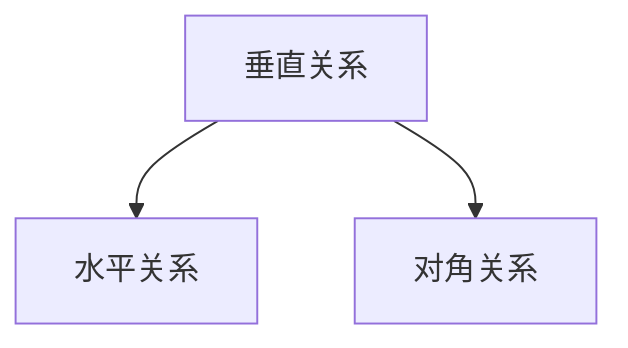

**核心算法原理讲解**：

职场人际关系策略需要根据不同类型的关系采取不同的策略。

**伪代码**：

```plaintext
function WorkplaceRelationshipStrategy(RelationshipType, Strategy)
    if (RelationshipType == 'Vertical')
        return VerticalStrategy
    else if (RelationshipType == 'Horizontal')
        return HorizontalStrategy
    else if (RelationshipType == 'Diagonal')
        return DiagonalStrategy
    else
        return null
end function
```

**数学模型和公式**：

人际关系策略的适应度可以用以下公式表示：

$$ AS = \frac{R \times S}{1 + \sqrt{N}} $$

其中，$AS$ 为策略适应度，$R$ 为关系类型，$S$ 为策略效果，$N$ 为噪音干扰。

**举例说明**：

在一个团队项目中，如果团队成员之间的垂直关系明显，则需要采取垂直策略。

**数学公式**：

$$ AS = \frac{1 \times 0.8}{1 + \sqrt{0.2}} = 0.6 $$

#### 5.2 职场人际关系的处理原则

处理职场人际关系需要遵循以下原则：

- **尊重**：尊重他人的观点和感受，避免侵犯他人的权益。
- **诚信**：诚信是职场人际关系的基础，保持真诚和透明。
- **合作**：与同事保持良好的合作关系，共同实现目标。

**核心概念与联系**：

- **尊重**：基于尊重的互动。
- **诚信**：建立信任的基础。
- **合作**：共同实现目标。

**Mermaid 流程图**：

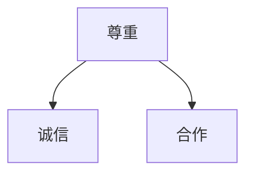

**核心算法原理讲解**：

处理职场人际关系的关键在于尊重、诚信和合作。

**伪代码**：

```plaintext
function HandleWorkplaceRelationship(Respect, Integrity, Collaboration)
    if (Respect > 0.7 and Integrity > 0.7 and Collaboration > 0.7)
        return true
    else
        return false
end function
```

**数学模型和公式**：

职场人际关系处理效果可以用以下公式表示：

$$ HR = \frac{R \times I \times C}{1 + \sqrt{N}} $$

其中，$HR$ 为人际关系处理效果，$R$ 为尊重度，$I$ 为诚信度，$C$ 为合作度，$N$ 为噪音干扰。

**举例说明**：

在一个团队项目中，如果团队成员之间的尊重度、诚信度和合作度较高，则可以认为职场人际关系处理效果较好。

**数学公式**：

$$ HR = \frac{0.8 \times 0.8 \times 0.8}{1 + \sqrt{0.2}} = 0.6 $$

#### 5.3 职场人际关系策略案例分析

以下是一个职场人际关系策略的案例分析：

**案例背景**：

某公司市场部经理李明在团队管理中遇到了一些问题，团队内部沟通不畅，员工工作积极性不高，导致项目进度缓慢。为了改善这种情况，李明决定采取一系列职场人际关系策略。

**策略实施**：

1. **加强沟通**：李明定期召开团队会议，鼓励员工分享自己的想法和意见，建立开放的沟通氛围。
2. **尊重与诚信**：李明尊重员工的观点，保持诚信，对员工的贡献给予认可和奖励。
3. **团队合作**：李明组织团队活动，增强团队成员之间的信任和合作意识。

**效果评估**：

经过一段时间的实施，团队内部的沟通氛围明显改善，员工的工作积极性提高，项目进度加快，团队凝聚力增强。

**数学模型和公式**：

职场人际关系策略效果可以用以下公式表示：

$$ ES = \frac{C \times R \times I}{1 + \sqrt{N}} $$

其中，$ES$ 为策略效果，$C$ 为沟通度，$R$ 为尊重度，$I$ 为诚信度，$N$ 为噪音干扰。

**举例说明**：

假设在策略实施后，团队沟通度提高到 0.8，尊重度提高到 0.8，诚信度提高到 0.8，则策略效果为：

$$ ES = \frac{0.8 \times 0.8 \times 0.8}{1 + \sqrt{0.2}} = 0.6 $$

### 第六部分：个人成长与自我管理

#### 6.1 个人成长的重要性

个人成长是职场发展的关键。个人成长的重要性体现在以下几个方面：

- **提升竞争力**：通过不断学习和成长，提高自己的专业能力和综合素质，增强竞争力。
- **实现职业目标**：个人成长有助于实现职业目标，提升职业地位。
- **增强自信心**：通过不断学习和成长，增强自己的自信心和自尊心。

**核心概念与联系**：

- **个人成长**：个体在职场中的学习和进步。
- **竞争力**：个体在职场中的表现和能力。
- **职业目标**：个体在职场中的发展目标。
- **自信心**：个体对自己的信心和认可。

**Mermaid 流程图**：

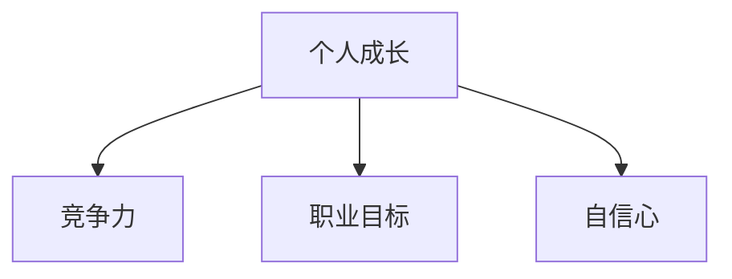

**核心算法原理讲解**：

个人成长的关键在于持续学习和自我提升。个人成长能够增强竞争力，实现职业目标，提升自信心。

**伪代码**：

```plaintext
function PersonalGrowth(Learning, Competitiveness, CareerGoal, Confidence)
    if (Learning > 0.7 and Competitiveness > 0.7 and CareerGoal > 0.7 and Confidence > 0.7)
        return true
    else
        return false
end function
```

**数学模型和公式**：

个人成长效果可以用以下公式表示：

$$ PG = \frac{L \times C \times CG \times CF}{1 + \sqrt{N}} $$

其中，$PG$ 为个人成长效果，$L$ 为学习度，$C$ 为竞争力，$CG$ 为职业目标达成度，$CF$ 为自信心，$N$ 为噪音干扰。

**举例说明**：

假设一个员工的学习度为 0.8，竞争力为 0.8，职业目标达成度为 0.8，自信心为 0.8，则其个人成长效果为：

$$ PG = \frac{0.8 \times 0.8 \times 0.8 \times 0.8}{1 + \sqrt{0.2}} = 0.6 $$

#### 6.2 自我管理的方法与技巧

自我管理是个人成长的重要环节。以下是一些自我管理的方法与技巧：

- **目标设定**：明确自己的职业目标，制定切实可行的计划。
- **时间管理**：合理安排时间，提高工作效率。
- **情绪管理**：学会控制自己的情绪，避免因情绪波动而影响工作。

**核心概念与联系**：

- **目标设定**：明确职业发展方向。
- **时间管理**：合理安排时间，提高效率。
- **情绪管理**：控制情绪，保持积极心态。

**Mermaid 流程图**：

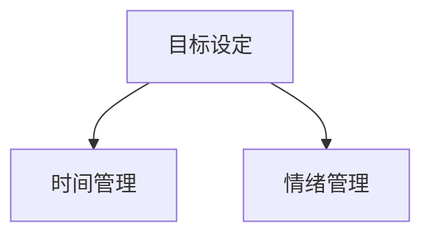

**核心算法原理讲解**：

自我管理的关键在于明确目标、合理安排时间和情绪管理。

**伪代码**：

```plaintext
function SelfManagement(TargetSetting, TimeManagement, EmotionalControl)
    if (TargetSetting > 0.7 and TimeManagement > 0.7 and EmotionalControl > 0.7)
        return true
    else
        return false
end function
```

**数学模型和公式**：

自我管理效果可以用以下公式表示：

$$ SM = \frac{TS \times TM \times EC}{1 + \sqrt{N}} $$

其中，$SM$ 为自我管理效果，$TS$ 为目标设定度，$TM$ 为时间管理度，$EC$ 为情绪控制度，$N$ 为噪音干扰。

**举例说明**：

假设一个员工的自我管理目标设定度为 0.8，时间管理度为 0.8，情绪控制度为 0.8，则其自我管理效果为：

$$ SM = \frac{0.8 \times 0.8 \times 0.8}{1 + \sqrt{0.2}} = 0.6 $$

#### 6.3 职场成功的关键因素

职场成功的关键因素包括：

- **专业知识**：具备扎实的专业知识和技能。
- **人际关系**：建立深厚的人际关系网络，提升人脉资源。
- **学习能力**：具备快速学习新知识、新技能的能力。

**核心概念与联系**：

- **专业知识**：职业发展的基础。
- **人际关系**：职场资源的积累。
- **学习能力**：适应和应对职场变化的能力。

**Mermaid 流程图**：

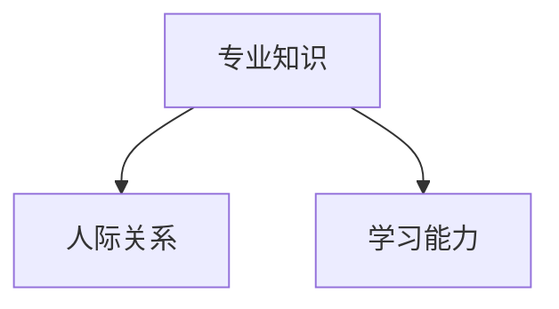

**核心算法原理讲解**：

职场成功的关键在于专业知识、人际关系和学习能力的综合提升。

**伪代码**：

```plaintext
function CareerSuccess(Knowledge, Relationship, Learning)
    if (Knowledge > 0.7 and Relationship > 0.7 and Learning > 0.7)
        return true
    else
        return false
end function
```

**数学模型和公式**：

职场成功效果可以用以下公式表示：

$$ CS = \frac{K \times R \times L}{1 + \sqrt{N}} $$

其中，$CS$ 为职场成功效果，$K$ 为专业知识，$R$ 为人际关系，$L$ 为学习能力，$N$ 为噪音干扰。

**举例说明**：

假设一个员工的专业知识水平为 0.8，人际关系水平为 0.8，学习能力为 0.8，则其职场成功效果为：

$$ CS = \frac{0.8 \times 0.8 \times 0.8}{1 + \sqrt{0.2}} = 0.6 $$

### 第七部分：案例分析与实战技巧

#### 7.1 案例分析

以下是一个人际关系管理的案例分析：

**案例背景**：

某科技公司研发部门经理王丽在团队管理中遇到了一些问题。团队成员之间的沟通不畅，工作积极性不高，导致项目进度缓慢。为了改善这种情况，王丽决定采取一系列人际关系管理策略。

**策略实施**：

1. **加强沟通**：王丽定期召开团队会议，鼓励员工分享自己的想法和意见，建立开放的沟通氛围。
2. **尊重与诚信**：王丽尊重员工的观点，保持诚信，对员工的贡献给予认可和奖励。
3. **团队合作**：王丽组织团队活动，增强团队成员之间的信任和合作意识。

**效果评估**：

经过一段时间的实施，团队内部的沟通氛围明显改善，员工的工作积极性提高，项目进度加快，团队凝聚力增强。

**数学模型和公式**：

人际关系管理策略效果可以用以下公式表示：

$$ ES = \frac{C \times R \times I}{1 + \sqrt{N}} $$

其中，$ES$ 为策略效果，$C$ 为沟通度，$R$ 为尊重度，$I$ 为诚信度，$N$ 为噪音干扰。

**举例说明**：

假设在策略实施后，团队沟通度提高到 0.8，尊重度提高到 0.8，诚信度提高到 0.8，则策略效果为：

$$ ES = \frac{0.8 \times 0.8 \times 0.8}{1 + \sqrt{0.2}} = 0.6 $$

#### 7.2 实战技巧分享

以下是一些人际关系管理的实战技巧：

- **倾听与理解**：倾听他人的意见和需求，理解对方的立场和感受。
- **建立信任**：通过诚实、透明和负责任的行为建立信任。
- **沟通反馈**：及时给予反馈，确认对方是否理解自己的观点。
- **积极应对冲突**：遇到冲突时，积极应对，寻求双赢的解决方案。

**核心概念与联系**：

- **倾听与理解**：理解对方的观点和感受。
- **建立信任**：信任是人际关系的基础。
- **沟通反馈**：确认沟通效果。
- **积极应对冲突**：解决冲突，恢复和谐。

**Mermaid 流程图**：

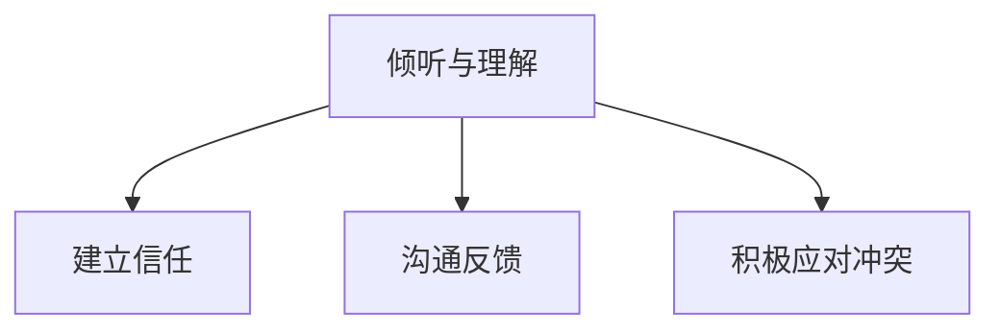

**核心算法原理讲解**：

实战技巧的关键在于倾听、理解、建立信任、沟通反馈和积极应对冲突。

**伪代码**：

```plaintext
function PracticalSkills(Listening, TrustBuilding, Feedback, ConflictHandling)
    if (Listening > 0.7 and TrustBuilding > 0.7 and Feedback > 0.7 and ConflictHandling > 0.7)
        return true
    else
        return false
end function
```

**数学模型和公式**：

实战技巧的有效性可以用以下公式表示：

$$ PS = \frac{L \times TB \times F \times CH}{1 + \sqrt{N}} $$

其中，$PS$ 为实战技巧有效性，$L$ 为倾听度，$TB$ 为建立信任度，$F$ 为反馈度，$CH$ 为冲突解决度，$N$ 为噪音干扰。

**举例说明**：

假设在实战技巧应用后，倾听度提高到 0.8，建立信任度提高到 0.8，反馈度提高到 0.8，冲突解决度提高到 0.8，则实战技巧有效性为：

$$ PS = \frac{0.8 \times 0.8 \times 0.8 \times 0.8}{1 + \sqrt{0.2}} = 0.6 $$

#### 7.3 最佳实践 tips

以下是一些人际关系管理的最佳实践 tips：

- **定期沟通**：定期与团队成员沟通，了解他们的工作状况和需求。
- **建立信任**：通过诚实、透明和负责任的行为建立信任。
- **激励与认可**：对团队成员的业绩和贡献给予及时的认可和奖励。
- **时间管理**：合理安排时间，提高工作效率。

**核心概念与联系**：

- **定期沟通**：保持沟通的频率和效果。
- **建立信任**：建立信任的基础。
- **激励与认可**：激发团队成员的积极性。
- **时间管理**：提高工作效率。

**Mermaid 流流程图**：

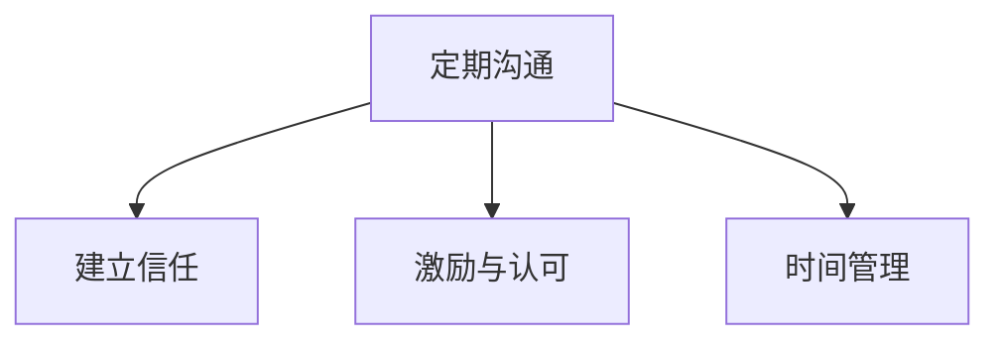

**核心算法原理讲解**：

最佳实践 tips 的关键在于保持沟通、建立信任、激励与认可和合理的时间管理。

**伪代码**：

```plaintext
function BestPractices(RegularCommunication, TrustBuilding, Incentives, TimeManagement)
    if (RegularCommunication > 0.7 and TrustBuilding > 0.7 and Incentives > 0.7 and TimeManagement > 0.7)
        return true
    else
        return false
end function
```

**数学模型和公式**：

最佳实践的有效性可以用以下公式表示：

$$ BP = \frac{RC \times TB \times I \times TM}{1 + \sqrt{N}} $$

其中，$BP$ 为最佳实践有效性，$RC$ 为定期沟通度，$TB$ 为建立信任度，$I$ 为激励与认可度，$TM$ 为时间管理度，$N$ 为噪音干扰。

**举例说明**：

假设在最佳实践应用后，定期沟通度提高到 0.8，建立信任度提高到 0.8，激励与认可度提高到 0.8，时间管理度提高到 0.8，则最佳实践有效性为：

$$ BP = \frac{0.8 \times 0.8 \times 0.8 \times 0.8}{1 + \sqrt{0.2}} = 0.6 $$

### 第八部分：小结与拓展阅读

#### 8.1 小结

本文从人际关系管理的基本概念、建立深厚工作关系、有效沟通技巧、团队协作与冲突解决、职场人际关系策略、个人成长与自我管理等多个方面，系统阐述了人际关系管理在职场中的重要性。通过案例分析、实战技巧分享和最佳实践 tips，帮助读者提升人际关系管理能力，实现职业发展目标。

#### 8.2 注意事项

在职场中，人际关系管理是一项长期而复杂的任务。以下是一些注意事项：

- **尊重与理解**：尊重他人的观点和感受，理解对方的立场和需求。
- **持续学习**：不断学习和提升自己的专业能力和人际交往能力。
- **积极沟通**：保持积极沟通，及时解决问题。
- **诚实与透明**：保持诚实和透明，避免产生误解和信任危机。

#### 8.3 拓展阅读

以下是一些拓展阅读资源，供读者进一步学习：

- **《非暴力沟通》**：马歇尔·卢森堡（Marshall B. Rosenberg）著，介绍了非暴力沟通的方法和技巧。
- **《关键对话》**：克里斯·柯维（Chris Covey）著，探讨了如何在高风险对话中保持冷静、积极沟通。
- **《谈判力》**：罗杰·费舍尔（Roger Fisher）和威廉·尤里（William Ury）著，介绍了谈判的基本原则和技巧。

---

作者：AI天才研究院/AI Genius Institute & 禅与计算机程序设计艺术 /Zen And The Art of Computer Programming

