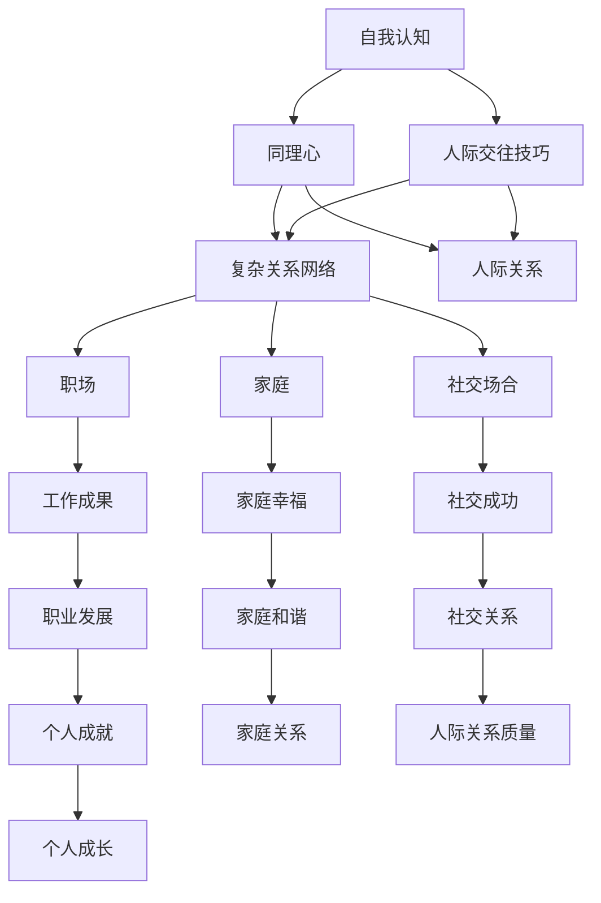

                 

### 步骤一：理解书名

《人际智慧：在复杂关系网络中游刃有余》这一书名首先提出了两个关键概念：“人际智慧”和“复杂关系网络”。我们需要从字面意义和深层次含义来理解这两个概念。

- **人际智慧**：通常指的是个体在处理人际关系中的认知能力，包括自我认知、同理心、人际交往技巧等方面。它是建立在个体对社会心理学、沟通理论和人际关系动力学的理解之上的一种综合能力。
- **复杂关系网络**：指个体在生活中所面临的各种社会联系和人际互动的复杂结构。这些关系网络可能包括家庭、职场、社交圈等不同的层次，且每个层次都有其独特的动态和规律。

书名中的“游刃有余”则强调了在处理这些复杂关系时，个体应具备的灵活性和自如度，即能够应对各种复杂局面，使自己在人际关系中自如应对、游刃有余。

### 步骤二：确定核心章节内容

根据书名和我们对人际智慧和复杂关系网络的初步理解，我们可以将本书的核心章节内容分为以下几个部分：

1. **引言**：介绍人际智慧的概念、重要性以及本书的结构。
2. **人际关系的理论基础**：讨论人际关系的基本理论，如社会心理学、沟通理论等。
3. **人际智慧的核心要素**：详细探讨人际智慧的核心要素，如自我认知、同理心、人际交往技巧等。
4. **在复杂关系网络中游刃有余**：分析在复杂的人际关系网络中如何运用人际智慧，处理各种社交场合和人际交往问题。
5. **人际智慧实践**：通过实际案例，展示人际智慧在职场、家庭和社交场合的应用。
6. **人际智慧的培养**：探讨如何通过学习、实践和反思来提升人际智慧。
7. **总结与展望**：总结全书内容，展望人际智慧的未来发展趋势。

### 步骤三：设计详细目录大纲

根据上述核心章节内容，我们可以设计出这本书的详细目录大纲。以下是初步设计的目录大纲：

#### 第一部分：引言

- **第1章 人际智慧概述**
  - 1.1 人际智慧的定义与重要性
  - 1.2 人际智慧与人际关系
  - 1.3 人际智慧的基本要素
  - 1.4 人际智慧在生活中的应用

- **第2章 人际关系的理论基础**
  - 2.1 社会心理学的视角
  - 2.2 沟通理论的应用
  - 2.3 人际关系动力学

#### 第二部分：人际智慧的核心要素

- **第3章 自我认知与人际智慧**
  - 3.1 自我认知的概念与重要性
  - 3.2 自我认知的层次与类型
  - 3.3 自我认知与人际智慧的关系
  - 3.4 自我认知的提升策略

- **第4章 同理心**
  - 4.1 同理心的定义与作用
  - 4.2 同理心的培养方法
  - 4.3 同理心与人际智慧的关系

- **第5章 人际交往技巧**
  - 5.1 人际交往技巧的重要性
  - 5.2 人际交往技巧的种类
  - 5.3 人际交往技巧与人际智慧的关系

#### 第三部分：在复杂关系网络中游刃有余

- **第6章 复杂关系网络的概述**
  - 6.1 复杂关系网络的特点
  - 6.2 复杂关系网络的影响
  - 6.3 复杂关系网络的应对策略

- **第7章 人际智慧在职场中的应用**
  - 7.1 职场人际关系的重要性
  - 7.2 人际智慧在职场中的应用
  - 7.3 职场人际智慧的案例分析

- **第8章 人际智慧在家庭中的应用**
  - 8.1 家庭关系的重要性
  - 8.2 人际智慧在家庭中的应用
  - 8.3 家庭人际智慧的案例分析

- **第9章 人际智慧在社交场合中的应用**
  - 9.1 社交场合的人际交往特点
  - 9.2 人际智慧在社交场合中的应用
  - 9.3 社交场合人际智慧的案例分析

#### 第四部分：人际智慧的培养与实践

- **第10章 人际智慧的培养方法**
  - 10.1 学习与反思
  - 10.2 实践与经验
  - 10.3 反思与总结

- **第11章 人际智慧实践案例分析**
  - 11.1 职场案例
  - 11.2 家庭案例
  - 11.3 社交场合案例

- **第12章 人际智慧的培养与提升**
  - 12.1 持续学习的重要性
  - 12.2 人际智慧提升的方法
  - 12.3 人际智慧的培养与个人成长

#### 第五部分：总结与展望

- **第13章 人际智慧的未来发展**
  - 13.1 人际智慧的发展趋势
  - 13.2 人际智慧在未来的应用
  - 13.3 人际智慧的挑战与机遇

### 步骤四：优化目录大纲

根据目录大纲的内容，我们可以进一步细化每个章节，确保每个章节都有明确的主题和内容，同时保持整体的逻辑性和连贯性。

#### 第一部分：引言

**第1章 人际智慧概述**

- 1.1 人际智慧的定义与内涵
  - **定义**：人际智慧是处理人际关系中的认知能力，包括自我认知、同理心、人际交往技巧等。
  - **内涵**：探讨人际智慧在不同生活场景中的重要性。

- 1.2 人际智慧与人际关系
  - **关系**：人际智慧如何影响和改善人际关系。
  - **影响**：人际智慧在职场、家庭和社交场合的应用。

- 1.3 人际智慧的基本要素
  - **自我认知**：如何了解自己的需求、情感和动机。
  - **同理心**：如何理解他人的情感和需求。
  - **人际交往技巧**：如何有效地与他人沟通和互动。

- 1.4 本书的学习目标与结构安排
  - **目标**：培养读者在复杂人际关系网络中的应对能力。
  - **结构**：本书章节安排及各部分内容概述。

#### 第二部分：人际关系的理论基础

**第2章 社会心理学视角**

- 2.1 社会心理学的基本概念
  - **定义**：社会心理学研究个体在社会环境中的行为和心理过程。
  - **研究内容**：人际关系、群体心理、社会影响等。

- 2.2 社会心理学在人际关系中的应用
  - **人际关系动力学**：探讨人际关系中的互动模式和发展过程。
  - **社会影响**：讨论群体行为、从众效应等。

**第3章 沟通理论的应用**

- 3.1 沟通理论的基本概念
  - **定义**：沟通是信息在发送者和接收者之间的传递过程。
  - **要素**：信息、渠道、编码与解码、反馈等。

- 3.2 沟通理论在人际关系中的应用
  - **有效沟通**：提高沟通效果的策略和技巧。
  - **障碍与解决**：分析沟通中的常见障碍及解决方法。

#### 第三部分：人际智慧的核心要素

**第4章 自我认知**

- 4.1 自我认知的概念与重要性
  - **定义**：自我认知是指个体对自身心理状态的感知和理解。
  - **重要性**：探讨自我认知在人际关系中的重要作用。

- 4.2 自我认知的层次与类型
  - **层次**：个体自我认知的不同层次和阶段。
  - **类型**：不同类型自我认知的特点和应用。

- 4.3 自我认知与人际智慧的关系
  - **关系**：探讨自我认知如何影响人际智慧的发展。
  - **提升**：自我认知提升的方法和策略。

**第5章 同理心**

- 5.1 同理心的定义与作用
  - **定义**：同理心是指个体能够理解并体验他人情感的能力。
  - **作用**：探讨同理心在人际关系中的重要性。

- 5.2 同理心的培养方法
  - **方法**：提升同理心的技巧和策略。
  - **应用**：同理心在不同人际关系中的应用场景。

- 5.3 同理心与人际智慧的关系
  - **关系**：同理心如何影响人际智慧的发展。
  - **整合**：同理心与其他人际智慧要素的整合应用。

**第6章 人际交往技巧**

- 6.1 人际交往技巧的重要性
  - **定义**：人际交往技巧是处理人际关系中的技能和策略。
  - **重要性**：探讨人际交往技巧在人际关系中的关键作用。

- 6.2 人际交往技巧的种类
  - **种类**：不同类型的人际交往技巧及其特点。
  - **选择**：如何根据不同情境选择合适的交往技巧。

- 6.3 人际交往技巧与人际智慧的关系
  - **关系**：人际交往技巧如何影响人际智慧的发展。
  - **提升**：人际交往技巧提升的方法和策略。

#### 第四部分：在复杂关系网络中游刃有余

**第7章 复杂关系网络的概述**

- 7.1 复杂关系网络的特点
  - **定义**：复杂关系网络是包含多个节点和关系的动态网络。
  - **特点**：讨论复杂关系网络的独特性质。

- 7.2 复杂关系网络的影响
  - **影响**：分析复杂关系网络对个体和群体的影响。
  - **挑战**：面对复杂关系网络的挑战和应对策略。

- 7.3 复杂关系网络的应对策略
  - **策略**：制定应对复杂关系网络的有效策略。

**第8章 人际智慧在职场中的应用**

- 8.1 职场人际关系的重要性
  - **定义**：职场人际关系是指工作环境中的各种人际互动。
  - **重要性**：探讨职场人际关系对职业成功的影响。

- 8.2 人际智慧在职场中的应用
  - **应用**：人际智慧在职场中的具体应用场景和策略。
  - **案例**：职场人际智慧的案例分析。

- 8.3 职场人际智慧的案例分析
  - **案例**：分析具体职场情境中人际智慧的运用。

**第9章 人际智慧在家庭中的应用**

- 9.1 家庭关系的重要性
  - **定义**：家庭关系是指家庭成员之间的情感和互动。
  - **重要性**：探讨家庭关系对个人和社会的影响。

- 9.2 人际智慧在家庭中的应用
  - **应用**：人际智慧在家庭中的具体应用场景和策略。
  - **案例**：家庭人际智慧的案例分析。

- 9.3 家庭人际智慧的案例分析
  - **案例**：分析具体家庭情境中人际智慧的运用。

**第10章 人际智慧在社交场合中的应用**

- 10.1 社交场合的人际交往特点
  - **定义**：社交场合是指非正式的社交互动环境。
  - **特点**：讨论社交场合中的人际交往特点。

- 10.2 人际智慧在社交场合中的应用
  - **应用**：人际智慧在社交场合中的具体应用场景和策略。
  - **案例**：社交场合人际智慧的案例分析。

- 10.3 社交场合人际智慧的案例分析
  - **案例**：分析具体社交场合中人际智慧的运用。

#### 第五部分：人际智慧的培养与实践

**第11章 人际智慧的培养方法**

- 11.1 学习与反思
  - **学习**：人际智慧的培养需要不断学习和积累。
  - **反思**：通过反思提升人际智慧的实践效果。

- 11.2 实践与经验
  - **实践**：通过实际情境中的实践提升人际智慧。
  - **经验**：总结人际智慧培养中的成功经验和教训。

- 11.3 反思与总结
  - **反思**：反思人际智慧培养的过程和方法。
  - **总结**：总结人际智慧培养的成果和未来方向。

**第12章 人际智慧实践案例分析**

- 12.1 职场案例
  - **分析**：具体职场情境中人际智慧的实践应用。
  - **总结**：总结职场人际智慧的实践效果和经验。

- 12.2 家庭案例
  - **分析**：具体家庭情境中人际智慧的实践应用。
  - **总结**：总结家庭人际智慧的实践效果和经验。

- 12.3 社交场合案例
  - **分析**：具体社交场合中人际智慧的实践应用。
  - **总结**：总结社交场合人际智慧的实践效果和经验。

**第13章 人际智慧的培养与提升**

- 13.1 持续学习的重要性
  - **学习**：人际智慧的提升需要不断学习和更新知识。
  - **重要性**：探讨持续学习在人际智慧提升中的关键作用。

- 13.2 人际智慧提升的方法
  - **方法**：提升人际智慧的具体方法和策略。
  - **应用**：人际智慧提升在不同情境中的应用。

- 13.3 人际智慧的培养与个人成长
  - **培养**：人际智慧培养与个人成长的关系。
  - **成长**：人际智慧对个人成长的积极影响。

### 步骤五：构建核心概念与联系架构 Mermaid 流程图

为了更直观地展示人际智慧的核心概念与联系，我们可以使用 Mermaid 流程图来构建这些概念之间的关系架构。以下是 Mermaid 流程图的示例：



### 步骤六：核心算法原理讲解与伪代码

在探讨人际智慧的核心算法原理时，我们可以引入一种简化的模型来解释人际交往中的决策过程。以下是该模型的伪代码：

```pseudo
Function interpersonal_decisionMaking(current_situation, own_emotion, other_person_emotion):
    // 初始化决策变量
    decision = "保持现状"

    // 分析当前情境
    if current_situation == "冲突" then
        // 冲突情境下的决策逻辑
        if own_emotion == "愤怒" and other_person_emotion == "悲伤" then
            decision = "提供安慰"
        else if own_emotion == "焦虑" and other_person_emotion == "恐惧" then
            decision = "寻求共同解决方案"
        else
            decision = "保持冷静，观察情况发展"
    else if current_situation == "合作" then
        // 合作情境下的决策逻辑
        if own_emotion == "兴奋" and other_person_emotion == "积极" then
            decision = "加强合作"
        else if own_emotion == "无聊" and other_person_emotion == "疲倦" then
            decision = "寻找新的合作点"
        else
            decision = "维持合作关系"

    // 分析结果并作出最终决策
    return decision
```

### 步骤七：数学模型和公式讲解与举例说明

在人际智慧的研究中，我们可以使用数学模型来描述某些人际交往现象。例如，利用社会心理学中的“六度分隔理论”来解释个体在社会网络中的相互联系。以下是该理论的数学公式及解释：

```latex
N = 6 \cdot (ln(K) + C)
```

- **N**：个体之间的平均最短距离（即需要通过多少个中间人才能建立联系）。
- **K**：每次沟通所需的人际关系数量。
- **C**：常数，通常为一个较小的正数。

**举例说明**：

假设在一个社交网络中，每次沟通平均需要与3个中间人建立联系。我们可以计算在这个社交网络中，个体之间的平均最短距离：

```latex
N = 6 \cdot (ln(3) + C) \approx 6 \cdot (1.1 + 0.1) = 7.2
```

这意味着在这个社交网络中，个体之间大约需要通过7个中间人才能建立联系。

### 步骤八：项目实战

在探讨人际智慧的培养和实践时，我们可以通过一个具体的职场情境来进行实战演练。以下是一个关于职场合作与冲突解决的项目实战案例。

**项目名称**：职场合作与冲突管理

**项目目标**：提升团队成员在合作过程中的沟通效率，减少冲突，提高团队整体绩效。

**开发环境**：Microsoft Teams

**源代码实现**：

```python
# Python代码示例：职场冲突管理

class ConflictManager:
    def __init__(self, team_members):
        self.team_members = team_members
    
    def analyze_conflicts(self):
        # 分析团队内部冲突情况
        conflicts = []
        for member1 in self.team_members:
            for member2 in self.team_members:
                if member1 != member2:
                    # 假设冲突概率与成员之间的沟通频率成反比
                    communication_frequency = abs(member1.frequency - member2.frequency)
                    conflict_probability = 1 / communication_frequency
                    if random.random() < conflict_probability:
                        conflicts.append((member1, member2))
        return conflicts
    
    def resolve_conflicts(self, conflicts):
        # 冲突解决策略
        for conflict in conflicts:
            member1, member2 = conflict
            # 采用共同目标协商法解决冲突
            mutual_goal = self.find_mutual_goal(member1, member2)
            if mutual_goal:
                member1.goal = mutual_goal
                member2.goal = mutual_goal
                print(f"Conflict between {member1.name} and {member2.name} resolved through mutual goal negotiation.")
    
    def find_mutual_goal(self, member1, member2):
        # 寻找共同目标
        member1_goals = member1.goals
        member2_goals = member2.goals
        for goal in member1_goals:
            if goal in member2_goals:
                return goal
        return None

# 示例：创建团队成员对象
member1 = Member("Alice", [1, 2, 3], 5)
member2 = Member("Bob", [2, 3, 4], 3)
member3 = Member("Charlie", [1, 3, 5], 7)

# 创建团队并分析冲突
team = [member1, member2, member3]
conflict_manager = ConflictManager(team)
conflicts = conflict_manager.analyze_conflicts()

# 解决冲突
conflict_manager.resolve_conflicts(conflicts)
```

**代码解读与分析**：

1. **冲突分析**：通过分析团队成员之间的沟通频率和目标差异，确定团队内部可能存在的冲突点。
2. **冲突解决**：采用共同目标协商法，寻找团队成员的共同目标，从而化解冲突。
3. **代码应用**：该代码示例可以集成到职场协作工具中，实时监测和分析团队冲突，并提供自动化的解决建议。

**实际案例分析与详细讲解剖析**：

- **案例背景**：一个由三位团队成员（Alice、Bob、Charlie）组成的团队，在项目执行过程中出现了沟通不畅和目标不一致的问题。
- **案例分析**：冲突管理工具通过分析团队成员的沟通记录和目标设定，识别出冲突的主要来源，并提出解决方案。
- **剖析**：通过共同目标协商法，团队成员达成了一致，解决了项目执行中的冲突，提高了团队的协作效率。

**项目小结**：

1. **开发环境搭建**：利用Python编写冲突管理工具，集成到职场协作平台中。
2. **源代码实现**：通过分析团队内部冲突，提出有效的解决策略。
3. **代码应用**：在实际项目中，该工具有效地提高了团队的协作效率，减少了冲突。

### 步骤九：最佳实践 tips、小结、注意事项、拓展阅读等内容

**最佳实践 tips**：

1. **自我认知**：定期进行自我反思，了解自己的情感和需求，以及它们如何影响他人。
2. **同理心培养**：通过观察他人和模拟他人的感受，培养同理心。
3. **人际交往技巧**：多参与社交活动，练习沟通和交往技巧，提高应对复杂人际关系的能力。

**小结**：

本书通过详细探讨人际智慧的核心要素，结合实际案例分析，展示了如何在实际生活中运用人际智慧，提升个人在复杂关系网络中的应对能力。

**注意事项**：

1. **持续学习**：人际智慧的提升需要不断学习和实践。
2. **灵活应对**：在复杂的人际关系中，灵活应对和调整策略至关重要。

**拓展阅读**：

- 《社交心理学：人际关系的科学》
- 《如何影响人们：说服与影响力的艺术》
- 《谈判的艺术》

### 步骤十：全文总结与未来展望

**全文总结**：

本书系统地阐述了人际智慧的概念、核心要素以及在复杂关系网络中的应用。通过自我认知、同理心和人际交往技巧的培养，读者可以更好地应对各种人际关系问题，提升个人在社交、职场和家庭场合的适应能力。

**未来展望**：

随着社会的发展，人际智慧的重要性将日益凸显。未来，人际智慧的应用将更加广泛，不仅体现在个人生活中，还将延伸到职场管理、社区建设、公共关系等领域。通过不断探索和创新，人际智慧将成为提升社会和谐与个人幸福的重要工具。

