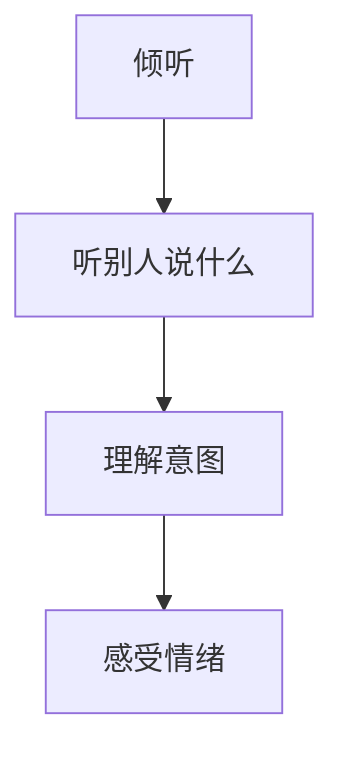
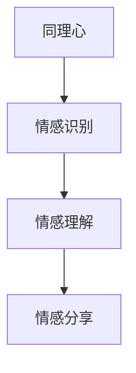
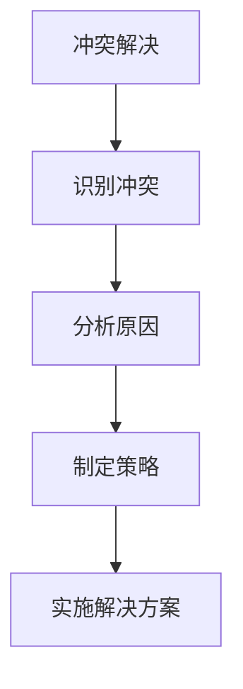
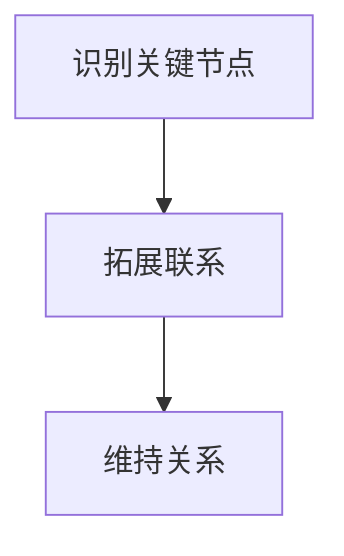
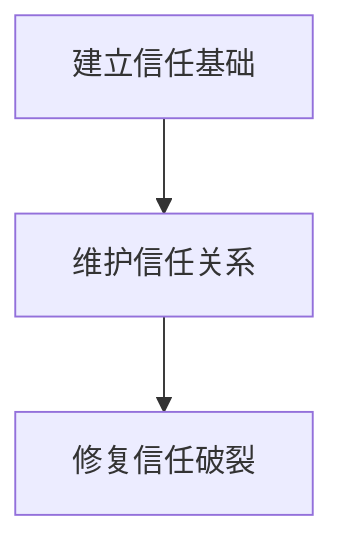
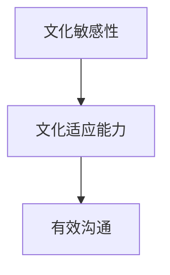

                 

### 引言

#### 1.1 人际智慧的定义与重要性

人际智慧，简而言之，是指个体在社交情境中理解、处理和适应他人情感、需求及意图的能力。它涵盖了多个方面，包括但不限于情感识别、同理心培养、沟通技巧、人际关系的建立与维护等。在日常生活中，人际智慧对于个人关系、职业发展以及社会互动具有深远的影响。

在技术领域，人际智慧同样具有重要的地位。特别是在领导力、团队协作和项目管理中，人际智慧成为衡量领导者成功与否的关键因素。一个拥有高水平人际智慧的技术领导者，不仅能够更好地理解团队成员的需求和动机，还能有效协调资源，化解冲突，提升团队整体效能。

本文旨在探讨人际智慧的核心概念，揭示其在领导力发展中的关键作用，并提供一系列实用的关系管理技能和实践指南。文章结构如下：

- **引言**：介绍人际智慧的概念，关系管理能力的重要性，以及本文的目的和结构。
- **基础理论**：分析社交心理学、沟通理论及人际关系模型，为后续内容奠定理论基础。
- **领导者的角色与责任**：探讨领导者的人际智慧需求，以及如何运用人际智慧提升领导效能。
- **关系管理技能**：详细阐述关系管理的关键技能，如倾听、同理心、冲突解决等。
- **关系建立与维护**：介绍如何建立和维护良好的人际关系，包括人际网络的构建、人际信任的培养等。
- **案例分析**：通过真实案例，展示人际智慧在实际工作中的应用。
- **实践指南**：提供人际智慧提升的具体方法和策略，以及如何将理论应用到实际工作中。
- **结论**：总结本文的核心观点，并提出对领导者的人际智慧提升的建议。

通过上述结构，本文将帮助读者深入了解人际智慧的重要性，掌握提升人际智慧的有效方法，并在实际工作中运用这些技能，提升领导力和团队效能。

#### 1.2 领导者的人际智慧需求

领导者的角色本质上是一个“社交工程师”，他们需要处理复杂的人际关系，协调团队成员的协作，推动项目顺利进行。在这个过程中，人际智慧成为衡量领导者成功与否的关键因素。

首先，领导者需要具备高度的情感识别能力，以便准确理解团队成员的情感状态和需求。这不仅有助于建立信任，还能及时调整管理策略，提高团队士气。例如，在项目遇到困难时，领导者需要识别出团队成员的焦虑和压力，通过有效沟通和激励，帮助他们克服困境。

其次，同理心是人际智慧的重要组成部分。领导者通过同理心能够站在他人的立场思考问题，理解他们的感受和需求。这种能力有助于建立良好的人际关系，促进团队成员之间的协作。例如，在团队讨论中，领导者展现出对他人观点的理解和尊重，能够激发团队成员的积极参与和创造力。

沟通技巧也是领导者人际智慧的核心。有效的沟通不仅能够传达信息，还能确保信息被正确理解和接受。领导者需要学会倾听，不仅仅是听到对方说话的内容，还要理解其背后的意图和情感。同时，领导者还需要具备清晰、简洁、有说服力的表达能力，确保信息传达的准确性和有效性。

最后，领导者的人际智慧还包括冲突解决的策略。在团队中，冲突是不可避免的。一个高效的领导者需要具备处理冲突的能力，通过合理的策略和沟通，化解冲突，维护团队和谐。例如，在面对团队内部的分歧时，领导者可以通过召开会议，引导各方表达意见，共同寻找解决方案。

总之，领导者的人际智慧需求体现在多个方面，包括情感识别、同理心培养、沟通技巧和冲突解决等。这些能力不仅有助于提升领导效能，还能促进团队协作，实现组织目标。在接下来的章节中，我们将进一步探讨这些核心概念，并介绍一系列实用的关系管理技能，帮助领导者提升人际智慧。

#### 1.3 本书的目的与结构

本书的主要目的是为领导者提供系统化的人际智慧提升指南，帮助他们更好地理解和应用人际智慧，提升领导力和团队效能。具体来说，本书旨在实现以下几个目标：

1. **深入理解人际智慧**：通过介绍社交心理学、沟通理论和人际关系模型，帮助读者全面了解人际智慧的核心概念和理论基础。
2. **掌握关系管理技能**：详细阐述倾听、同理心、冲突解决等关键关系管理技能，并提供实用的方法和策略，帮助读者在实际工作中应用这些技能。
3. **提升领导效能**：通过分析领导者的角色与责任，探讨人际智慧在领导力发展中的关键作用，帮助读者运用人际智慧提升领导效能。
4. **提供实战案例与指南**：通过真实案例和实践指南，展示人际智慧在实际工作中的应用，帮助读者将理论转化为实践。

本书的结构分为八个主要部分：

- **引言**：介绍人际智慧的概念、重要性以及本书的目的和结构。
- **基础理论**：分析社交心理学、沟通理论和人际关系模型，为后续内容奠定理论基础。
- **领导者的角色与责任**：探讨领导者的人际智慧需求，以及如何运用人际智慧提升领导效能。
- **关系管理技能**：详细阐述关系管理的关键技能，如倾听、同理心、冲突解决等。
- **关系建立与维护**：介绍如何建立和维护良好的人际关系，包括人际网络的构建、人际信任的培养等。
- **案例分析**：通过真实案例，展示人际智慧在实际工作中的应用。
- **实践指南**：提供人际智慧提升的具体方法和策略，以及如何将理论应用到实际工作中。
- **结论**：总结本书的核心观点，并提出对领导者的人际智慧提升的建议。

通过系统学习本书，读者将能够全面掌握人际智慧的理论和实践，提升关系管理能力，成为更高效、更具影响力的领导者。

### 基础理论

在深入探讨人际智慧之前，我们需要了解其基础理论，这些理论包括社交心理学、沟通理论和人际关系模型。这些理论基础构成了人际智慧的核心，有助于我们更全面地理解和应用人际智慧。

#### 2.1 社交心理学基础

社交心理学是研究个体在社会情境中的行为、情感和认知过程的学科。它探讨的问题包括人类如何形成社会关系、如何处理社会压力、以及如何进行社会互动等。以下是几个重要的社交心理学概念：

1. **社会认知**：社会认知是指个体如何理解和解释他人的行为和情感。这一过程涉及到情绪识别、角色扮演、社会判断等多个方面。例如，领导者需要通过社会认知理解团队成员的需求和动机，从而做出更有效的管理决策。
2. **社会影响**：社会影响是指外部因素如何影响个体的行为和态度。例如，领导者通过激励、奖惩等手段可以影响团队成员的行为，从而提升团队效能。
3. **社会支持**：社会支持是指个体在面临压力和挑战时，从他人那里获得的情感和物质支持。研究表明，社会支持有助于缓解压力，提升个体的心理健康和幸福感。对于领导者来说，提供有效的社会支持是建立团队凝聚力和提升团队士气的重要手段。

#### 2.2 沟通理论概述

沟通是人际智慧的重要组成部分。有效的沟通不仅能够传达信息，还能建立信任、增进理解和促进协作。以下是几个重要的沟通理论：

1. **信息传递模型**：信息传递模型是一个基本沟通模型，描述了信息从发送者到接收者的传递过程。这个过程包括编码、传递、解码和反馈等步骤。对于领导者来说，理解这一模型有助于确保信息传递的准确性和有效性。
2. **沟通障碍**：沟通障碍是影响沟通效果的常见问题。这些障碍包括语义障碍（语言含义不清）、心理障碍（情感和态度的影响）、物理障碍（环境和设备的问题）等。领导者需要识别并克服这些障碍，以实现有效的沟通。
3. **反馈机制**：有效的沟通需要反馈机制，以便接收者能够确认信息是否被正确理解。领导者应鼓励团队成员提供反馈，并在沟通过程中积极寻求反馈，以便及时调整沟通策略。

#### 2.3 人际关系模型解析

人际关系模型帮助我们理解人际关系的发展过程、不同类型的互动模式及其对个体和组织的影响。以下是几个重要的人际关系模型：

1. **互动模型**：互动模型强调人际关系中的相互作用和互动。这种模型认为，人际关系是由一系列互动构成的，每个互动都会对关系的发展产生重要影响。领导者可以通过积极互动，建立和维护良好的人际关系。
2. **情感交换模型**：情感交换模型认为，人际关系中的互动是基于情感交换的。个体在人际关系中寻求情感支持、归属感和认同感。领导者需要通过情感交换，建立信任和忠诚，从而提升团队凝聚力。
3. **社会交换理论**：社会交换理论将人际关系视为一种交换过程，包括物质、情感和资源等。领导者需要理解和应用这一理论，以确保人际关系的平衡和稳定。

通过理解这些基础理论，领导者可以更好地应对复杂的人际关系，提升关系管理能力，从而实现组织目标。在接下来的章节中，我们将进一步探讨领导者的人际智慧需求，以及如何运用人际智慧提升领导效能。

### 领导者的角色与责任

在组织结构中，领导者的角色和责任至关重要。领导者不仅是团队的核心，更是组织的舵手，他们的决策和行为直接影响着团队绩效和组织发展。在此背景下，人际智慧成为领导者不可或缺的核心能力。本文将探讨领导者的人际智慧需求，分析如何运用人际智慧提升领导效能。

#### 3.1 领导者的角色与人际智慧需求

领导者的角色多种多样，包括战略规划、决策制定、资源协调、团队管理、激励与指导等。这些角色要求领导者具备多方面的能力，其中人际智慧是关键之一。以下是几个方面的人际智慧需求：

1. **团队协作能力**：领导者需要具备高度的人际智慧，以促进团队成员之间的协作和沟通。通过理解团队成员的情感状态、需求和动机，领导者可以有效地协调资源，解决冲突，提高团队的整体效能。
2. **激励能力**：领导者需要运用人际智慧识别和满足团队成员的不同需求，从而激发他们的工作热情和创造力。例如，通过个性化的激励措施，领导者可以提升团队成员的自我效能感和工作满意度。
3. **冲突管理能力**：在团队中，冲突是不可避免的。领导者需要具备处理冲突的人际智慧，通过有效沟通和调解策略，化解冲突，维护团队的和谐与稳定。
4. **变革管理能力**：在快速变化的环境中，领导者需要具备应对变革的人际智慧，以引导团队适应新环境和挑战。这包括理解团队成员对变革的接受程度、提供必要的支持，以及激励他们积极应对变革。

#### 3.2 人际智慧与领导效能

人际智慧对领导效能有着深远的影响。以下从几个方面阐述人际智慧如何提升领导效能：

1. **团队效能**：通过提升人际智慧，领导者可以建立更紧密的团队关系，提高团队成员之间的协作和信任。研究表明，高水平的团队关系能够显著提升团队绩效，实现组织目标。
2. **员工满意度**：领导者的人际智慧有助于提升员工的满意度和忠诚度。通过关注员工的需求、提供情感支持，以及建立信任关系，领导者可以增强员工的归属感和工作动力，从而提高员工的绩效和留存率。
3. **组织氛围**：人际智慧有助于营造积极、健康的组织氛围。领导者通过有效的沟通和人际关系管理，可以减少组织内部的紧张和冲突，促进知识共享和创新，从而提升组织的整体效能。
4. **领导影响力**：人际智慧增强领导者的沟通能力和影响力。通过同理心、有效的倾听和积极的反馈，领导者可以更好地影响和激励团队成员，推动团队向目标迈进。

#### 3.3 领导者的人际智慧实践

为了提升人际智慧，领导者需要采取一系列具体的实践方法。以下是一些建议：

1. **培养同理心**：同理心是人际智慧的核心。领导者需要学会从他人的角度思考问题，理解他们的情感和需求。这可以通过观察、倾听和反思来实现。例如，在团队会议中，领导者可以通过提出开放式问题，引导团队成员分享他们的观点和感受。
2. **强化沟通技巧**：有效的沟通是提升人际智慧的关键。领导者需要学会清晰、简洁、有逻辑地表达自己的想法，并倾听他人的意见。例如，在项目讨论中，领导者可以通过积极倾听，确保每个团队成员的声音被听到。
3. **建立信任关系**：信任是人际关系的基础。领导者需要通过诚实、透明和一致性来建立信任。例如，在团队中，领导者可以通过公开透明地分享信息，展示对团队成员的信任，从而增强团队的信任感和凝聚力。
4. **处理冲突**：冲突是团队中不可避免的现象。领导者需要具备处理冲突的人际智慧，通过有效沟通和调解策略，化解冲突，维护团队的和谐。例如，在冲突发生时，领导者可以通过召开会议，引导各方表达意见，共同寻找解决方案。

总之，领导者的人际智慧需求体现在多个方面，包括团队协作、激励能力、冲突管理和变革管理等。通过培养同理心、强化沟通技巧、建立信任关系和有效处理冲突，领导者可以提升人际智慧，从而提升领导效能，实现组织目标。在接下来的章节中，我们将进一步探讨关系管理技能，帮助领导者提升人际智慧。

### 关系管理技能

在提升领导效能的过程中，关系管理技能是不可或缺的核心能力。这些技能包括倾听、同理心、冲突解决等。通过掌握和应用这些技能，领导者可以更好地处理人际关系，促进团队协作，实现组织目标。

#### 4.1 倾听的艺术

倾听不仅是获取信息的过程，更是一种尊重和信任的体现。有效的倾听可以增强团队成员之间的信任，提高沟通质量，从而提升团队整体效能。

**核心概念与联系：**

倾听包含多个层次，包括听别人说什么、理解背后的意图、感受对方的情绪等。倾听的层次越高，领导者越能理解团队成员的真实需求，从而做出更有效的决策。

**关系架构图：**

**核心算法原理讲解：**

1. **情感识别**：领导者需要通过倾听识别团队成员的情感状态。例如，通过语气、语调和表情等非语言信号，了解团队成员的情绪变化。
2. **开放式问题**：领导者可以通过开放式问题引导团队成员表达自己的观点和感受。例如，“你觉得这个决策对我们团队意味着什么？”
3. **同理心**：领导者需要站在团队成员的立场思考问题，理解他们的需求和动机。这有助于建立信任，增强团队凝聚力。

**数学模型和公式：**

$$\text{倾听效果} = f(\text{情感识别} \times \text{开放式问题} \times \text{同理心})$$

**举例说明：**

在一次项目会议上，团队成员小李提出了一个创新的想法。领导者通过倾听，发现小李对项目的热情和期待。领导者不仅认真听取了小李的观点，还通过同理心理解小李的需求和动机。最终，领导者不仅支持了小李的想法，还鼓励他进一步探讨，从而激发了整个团队的创造力。

**注意事项：**

- 倾听不仅仅是听到对方说什么，更重要的是理解对方的意图和情感。
- 避免在倾听过程中打断对方，保持开放和接纳的态度。
- 定期进行反馈，确保团队成员感受到他们的声音被重视。

**拓展阅读：**

- [《倾听的艺术》](https://www.developgoodhabits.com/habits/listening-habits)
- [《沟通技巧》](https://www.forbes.com/sites/forbesbusinesscouncil/2021/06/25/10-power-communication-tips-for-leaders/?sh=5d1a85f07bfe)

#### 4.2 同理心的培养

同理心是人际智慧的重要组成部分，它涉及到理解和感受他人的情感状态。同理心的培养不仅有助于建立信任，还能促进团队合作和关系发展。

**核心概念与联系：**

同理心包括情感识别、情感理解和情感分享。领导者需要通过同理心，站在他人的立场思考问题，理解他们的需求和动机。

**关系架构图：**

**核心算法原理讲解：**

1. **情感识别**：领导者需要学会通过观察、倾听和互动识别团队成员的情感状态。例如，通过面部表情、身体语言和语调等非语言信号，了解团队成员的情绪。
2. **情感理解**：领导者需要深入理解团队成员的情感状态，了解背后的原因和需求。例如，如果团队成员感到沮丧，领导者需要了解他们是否遇到了工作压力或个人问题。
3. **情感分享**：领导者需要与团队成员分享自己的情感体验，增强信任和亲密感。例如，在团队讨论中，领导者可以分享自己的观点和感受，从而促进团队成员之间的情感交流。

**数学模型和公式：**

$$\text{同理心效果} = f(\text{情感识别} \times \text{情感理解} \times \text{情感分享})$$

**举例说明：**

在一次团队建设活动中，领导者注意到一名新员工显得焦虑和不适应。领导者通过同理心，主动与新员工交流，了解他的背景和需求。领导者不仅提供了情感支持，还分享了类似经历，从而帮助新员工迅速融入团队。

**注意事项：**

- 培养同理心需要持续的练习和反思，领导者需要时刻关注团队成员的情感状态。
- 避免在同理心培养过程中，将个人情感带入到工作中，保持客观和公正的态度。
- 定期进行团队反馈，确保同理心的培养得到团队成员的认可和接受。

**拓展阅读：**

- [《同理心的艺术》](https://www.psychologytoday.com/us/basics/empathy)
- [《同理心培养技巧》](https://www.psychologytoday.com/us/basics/empathy-101)

#### 4.3 冲突解决的策略

在团队中，冲突是不可避免的。领导者需要具备处理冲突的人际智慧，通过有效的策略和沟通，化解冲突，维护团队的和谐与稳定。

**核心概念与联系：**

冲突解决包括识别冲突、分析原因、制定策略和实施解决方案。领导者需要通过有效沟通，引导各方找到共同点，达成共识。

**关系架构图：**

**核心算法原理讲解：**

1. **识别冲突**：领导者需要学会识别冲突的信号，例如团队成员的情绪变化、沟通障碍等。通过积极倾听和观察，领导者可以及时发现冲突的苗头。
2. **分析原因**：领导者需要深入分析冲突的根本原因，了解各方需求和不満。这可以通过召开会议、个别谈话等方式实现。
3. **制定策略**：根据冲突的原因，领导者需要制定合适的解决方案。这可能包括调整工作分配、提供额外资源、改变沟通方式等。
4. **实施解决方案**：领导者需要与各方沟通，确保解决方案得到有效执行。通过持续监督和反馈，领导者可以确保冲突得到妥善解决。

**数学模型和公式：**

$$\text{冲突解决效果} = f(\text{识别冲突} \times \text{分析原因} \times \text{制定策略} \times \text{实施解决方案})$$

**举例说明：**

在一次项目讨论中，团队成员A和团队成员B因工作分工问题产生了冲突。领导者通过倾听和观察，识别出冲突的信号，并召集双方进行沟通。在了解双方的立场和需求后，领导者提出调整工作分配的解决方案，并通过监督和反馈，确保解决方案得到有效执行。

**注意事项：**

- 冲突解决需要客观、公正的态度，避免将个人情感带入到冲突处理中。
- 避免在冲突解决过程中，对任何一方进行指责或批评，以维护团队和谐。
- 定期进行团队反馈，确保冲突解决的效果和团队氛围的改善。

**拓展阅读：**

- [《冲突解决技巧》](https://www.unece.org/file/48531/cont21_en.pdf)
- [《团队冲突管理》](https://www.psychologytoday.com/us/basics/conflict-resolution)

通过掌握倾听、同理心和冲突解决等关系管理技能，领导者可以更好地处理人际关系，提升团队效能，实现组织目标。在接下来的章节中，我们将探讨如何建立和维护良好的人际关系，进一步深化人际智慧的应用。

### 关系建立与维护

在领导者的日常工作中，建立和维护良好的人际关系是提升团队效能和实现组织目标的关键。以下将详细介绍如何构建人际网络、培养人际信任以及实施跨文化沟通策略，以帮助领导者更好地管理人际关系。

#### 5.1 人际网络的构建

人际网络，也称为社交网络，是指个体之间通过互动和联系形成的关系网络。构建强大的人际网络对于领导者来说至关重要，因为它能够提供资源支持、信息共享和职业发展机会。

**核心概念与联系：**

人际网络的构建涉及多个方面，包括识别关键节点、拓展联系和维持关系。领导者需要识别并建立与关键人物的联系，如团队成员、同行、供应商、客户等。

**关系架构图：**

**核心算法原理讲解：**

1. **识别关键节点**：领导者需要识别对团队和组织有重要影响的关键人物，如核心团队成员、关键客户、行业专家等。通过分析他们的角色和影响力，领导者可以确定哪些人需要重点关注。
2. **拓展联系**：领导者可以通过参加行业会议、社交活动、专业组织等方式，拓展与关键节点的联系。同时，利用现代科技工具，如社交媒体和在线平台，也可以有效地拓展人际网络。
3. **维持关系**：建立联系只是第一步，领导者需要定期与关键节点保持联系，通过电话、邮件、面对面会议等方式，了解他们的最新动态，提供支持和帮助，从而维持长期关系。

**数学模型和公式：**

$$\text{人际网络效能} = f(\text{识别关键节点} \times \text{拓展联系} \times \text{维持关系})$$

**举例说明：**

一位项目经理通过参加行业会议，结识了一位知名技术专家。他主动与专家保持联系，定期请教问题，并邀请专家参加公司内部研讨会。通过这种方式，项目经理不仅获得了宝贵的专业知识，还为公司赢得了重要的行业合作机会。

**注意事项：**

- 构建人际网络需要投入时间和精力，领导者需要平衡工作与人际关系，确保两者相辅相成。
- 避免将人际网络建设仅仅视为工具，而忽视了真实的人际互动和情感联系。
- 定期进行人际网络评估，确保网络中的人际关系能够持续、稳定地发展。

**拓展阅读：**

- [《人际网络的构建与管理》](https://hbr.org/product/the-new-lifecycle-of-network-value/186096-PDF-ENG)
- [《如何建立高效的人际网络》](https://www.forbes.com/sites/forbesbusinesscouncil/2021/03/02/how-to-build-an-effective-network-in-4-steps/?sh=5e7e9f1a3e37)

#### 5.2 人际信任的培养

人际信任是人际关系中的核心要素，它涉及到对对方的信任、忠诚和尊重。在领导者的工作中，培养人际信任能够增强团队的凝聚力，提高团队效能。

**核心概念与联系：**

人际信任的培养包括建立信任基础、维护信任关系和修复信任破裂。领导者需要通过诚实、透明和一致性，建立和维护人际信任。

**关系架构图：**

**核心算法原理讲解：**

1. **建立信任基础**：领导者需要通过诚实、透明和一致性，建立信任基础。这意味着领导者需要履行承诺、公开信息，并保持一致的行为和态度。
2. **维护信任关系**：领导者需要定期维护和强化信任关系，通过积极沟通、关注团队成员的需求和反馈，以及提供支持和帮助来实现。
3. **修复信任破裂**：当信任破裂时，领导者需要采取及时、有效的措施来修复信任。这可能包括主动沟通、承认错误、提供解决方案等。

**数学模型和公式：**

$$\text{人际信任效果} = f(\text{建立信任基础} \times \text{维护信任关系} \times \text{修复信任破裂})$$

**举例说明：**

在一次项目中，团队成员小李由于误解，导致了团队任务的延误。领导者通过坦诚沟通，承认自己的责任，并提供了详细的解决方案，最终赢得了团队成员的信任和理解。

**注意事项：**

- 培养人际信任需要长期的努力和耐心，领导者需要持续关注团队成员的需求和反馈，及时进行调整。
- 在建立和维护信任关系时，避免将个人情感带入到工作中，保持客观和公正的态度。
- 定期进行信任评估，确保人际信任在团队中持续、稳定地发展。

**拓展阅读：**

- [《人际信任的构建与维护》](https://www.psychologytoday.com/us/basics/how-relationship-credibility-is-built)
- [《如何建立团队信任》](https://www.inc.com/guides/how-to-build-team-trust.html)

#### 5.3 跨文化沟通策略

在全球化背景下，领导者需要具备跨文化沟通的能力，以应对多元文化的团队和客户。有效的跨文化沟通能够促进团队协作，提升组织效能。

**核心概念与联系：**

跨文化沟通涉及理解不同文化背景下的沟通习惯、价值观和行为模式。领导者需要通过文化敏感性和适应能力，实现有效沟通。

**关系架构图：**

**核心算法原理讲解：**

1. **文化敏感性**：领导者需要了解不同文化的差异，包括语言、价值观、社交习惯等。这可以通过文化培训、交流活动和阅读相关资料来实现。
2. **文化适应能力**：领导者需要具备适应不同文化的能力，通过调整沟通策略和方式，实现有效沟通。例如，在沟通时，领导者可以采用更直接、明确的方式，以适应不同文化的交流习惯。
3. **有效沟通**：领导者需要通过积极的沟通技巧，如倾听、同理心和清晰表达，实现跨文化沟通。这有助于避免误解和冲突，促进团队协作。

**数学模型和公式：**

$$\text{跨文化沟通效能} = f(\text{文化敏感性} \times \text{文化适应能力} \times \text{有效沟通})$$

**举例说明：**

在一个国际团队中，领导者需要与来自不同国家的团队成员沟通。为了确保沟通效果，领导者通过了解各成员的文化背景，调整了沟通策略。例如，在与德国团队成员沟通时，领导者采用了更正式、严谨的方式，而在与拉丁美洲团队成员沟通时，则采用了更亲切、开放的方式。

**注意事项：**

- 跨文化沟通需要持续的学习和实践，领导者需要不断更新自己的文化知识，以适应不断变化的文化环境。
- 在跨文化沟通中，避免使用可能引发误解的语言和行为，保持开放和尊重的态度。
- 定期进行跨文化沟通评估，确保跨文化沟通策略的有效性和适应性。

**拓展阅读：**

- [《跨文化沟通技巧》](https://www.forbes.com/sites/forbesbusinesscouncil/2021/11/04/the-ultimate-guide-to-cross-cultural-communication/?sh=5b1d1e6533cd)
- [《跨文化管理》](https://www.tandfonline.com/doi/abs/10.1080/13502370601088422)

通过构建人际网络、培养人际信任和实施跨文化沟通策略，领导者可以更好地管理人际关系，提升团队效能，实现组织目标。在接下来的章节中，我们将通过真实案例，展示人际智慧在实际工作中的应用。

### 案例分析

为了更好地理解人际智慧在实际工作中的应用，我们将通过几个真实案例，展示人际智慧如何帮助领导者提升关系管理能力，实现团队目标。

#### 6.1 案例一：领导者的关系管理艺术

在一个大型技术项目中，项目经理王女士负责协调来自不同部门的团队成员。由于项目涉及多个复杂的模块，团队成员之间的沟通和协作至关重要。

**项目背景：**
项目需要在短时间内完成多个高复杂度的模块开发，并且需要各个部门紧密合作。然而，由于团队成员来自不同部门，彼此之间存在一定的隔阂，沟通不畅，项目进度受到影响。

**人际智慧应用：**

1. **倾听与同理心：**
   王女士首先通过一系列的会议和一对一访谈，倾听团队成员的需求和担忧。她了解到，许多团队成员对项目的时间压力感到焦虑，担心无法完成任务。王女士通过同理心，理解他们的情感和压力，从而制定了更加灵活的时间管理策略。

2. **构建人际网络：**
   王女士意识到，要确保项目的成功，需要建立强大的人际网络。她主动与各个部门的负责人沟通，建立信任关系，确保信息传递的畅通。通过这种方式，她成功地将各个部门紧密联系在一起，提高了项目的协作效率。

3. **冲突解决：**
   在项目过程中，由于模块之间的接口问题，出现了多次冲突。王女士通过积极的沟通和调解，引导各方找到共同点，共同解决问题。她不仅关注问题的解决，还关注团队成员的情感状态，确保冲突不会影响团队士气。

**结果：**
通过有效的人际智慧应用，项目最终按时完成，并且质量得到了保障。团队成员之间的沟通变得更加顺畅，团队凝聚力显著提升。

#### 6.2 案例二：人际智慧在团队建设中的应用

在一个初创公司中，CEO李先生认识到，团队建设是公司成功的关键。然而，团队成员之间缺乏有效的沟通和协作，导致项目进度缓慢，公司面临巨大挑战。

**项目背景：**
公司处于快速发展阶段，需要组建一个高效的团队来应对市场的变化。然而，由于团队成员背景不同，沟通不畅，团队建设面临巨大挑战。

**人际智慧应用：**

1. **情感识别与同理心：**
   李先生通过定期团队建设活动和一对一交流，了解团队成员的情感状态和需求。他发现，许多团队成员对公司的未来感到不确定，缺乏信心。李先生通过同理心，理解他们的担忧，并提供了情感支持，增强了团队的信心。

2. **构建人际网络：**
   李先生鼓励团队成员之间建立积极的人际网络。他组织团队建设活动，如团队拓展训练和部门交流活动，促进团队成员之间的互动和了解。通过这种方式，团队成员之间的关系变得更加紧密，协作效率显著提升。

3. **冲突解决与激励：**
   李先生在团队中鼓励开放的沟通环境，让团队成员能够自由表达意见和提出建议。在冲突发生时，他通过有效的沟通和调解策略，引导团队成员找到共同点，解决问题。同时，他通过激励机制，如奖金和晋升机会，激励团队成员积极投入工作。

**结果：**
通过人际智慧的应用，公司团队建设取得了显著成效。团队成员之间的沟通和协作变得更加顺畅，项目进度显著提升，公司业绩实现了大幅增长。

#### 6.3 案例三：跨文化沟通策略的应用

在一个跨国公司中，项目团队由来自不同国家的成员组成，包括中国、美国、印度和巴西。由于文化差异，团队成员之间的沟通存在一定的障碍，项目进度受到影响。

**项目背景：**
项目需要在不同国家进行协同工作，涉及多个文化背景的团队成员。由于文化差异，团队成员在沟通和协作过程中出现了误解和冲突。

**人际智慧应用：**

1. **文化敏感性：**
   项目经理通过文化培训，帮助团队成员了解不同文化的特点和沟通习惯。例如，他强调了在印度文化中，尊重和等级制度的重要性，而在巴西文化中，直接和开放的沟通方式更为常见。

2. **文化适应能力：**
   项目经理在项目沟通中，根据不同文化的特点，调整了沟通策略。例如，在与印度团队成员沟通时，他采用了更正式、尊重的方式，而在与巴西团队成员沟通时，则采用了更亲切、开放的方式。

3. **有效沟通：**
   项目经理通过积极的沟通技巧，如倾听、同理心和清晰表达，确保了跨文化沟通的有效性。例如，在项目讨论中，他鼓励团队成员分享观点和感受，确保每个声音都被听到和理解。

**结果：**
通过跨文化沟通策略的应用，项目团队克服了文化差异带来的沟通障碍，项目进度顺利推进，最终按时完成。团队成员之间的信任和协作显著提升，项目质量也得到了保障。

通过这些案例，我们可以看到人际智慧在领导工作中的重要应用。有效的倾听、同理心、人际网络构建、冲突解决和跨文化沟通策略，不仅提升了领导者的关系管理能力，还促进了团队的协作和组织的成功。

### 实践指南

在了解了人际智慧的核心概念、理论和实际应用后，本文将提供一系列具体的方法和策略，帮助领导者提升人际智慧，并将其应用到实际工作中。

#### 7.1 人际智慧提升的方法

1. **自我反思与认知提升：**
   领导者可以通过自我反思，了解自己的沟通风格、情感反应和人际关系处理方式。例如，定期进行自我评估，识别自身的优点和改进点。这可以通过填写人际关系问卷、参与心理辅导等方式实现。

2. **培训与学习：**
   参加人际智慧相关的培训课程，如沟通技巧、领导力发展、情感管理等，可以帮助领导者系统提升人际智慧。此外，阅读相关书籍和文章，如《情商：为什么情商比智商更重要》等，也是提升人际智慧的有效途径。

3. **实践与反思：**
   将人际智慧的理论应用到实际工作中，通过实践不断总结和反思。例如，在团队沟通中，领导者可以尝试使用开放式问题，鼓励团队成员分享观点和感受。在实践过程中，领导者应注重反馈，不断调整和优化自己的沟通和人际关系处理方式。

#### 7.2 理论与实践的结合

1. **理论指导实践：**
   领导者在实际工作中，应将人际智慧的理论知识作为指导，例如，运用沟通模型、人际关系模型等理论框架，分析问题和制定解决方案。

2. **情境模拟：**
   通过情境模拟，领导者可以在安全的环境中实践人际智慧的应用。例如，模拟团队冲突场景，练习冲突解决的策略和沟通技巧。这种方式可以帮助领导者更好地应对实际工作中的挑战。

3. **反馈机制：**
   领导者应建立有效的反馈机制，通过自我评估、同事反馈和下属反馈，了解人际智慧应用的效果。这有助于领导者不断改进和优化自己的关系管理能力。

#### 7.3 人际智慧在领导力发展中的应用

1. **团队建设：**
   领导者可以通过团队建设活动，如团队拓展训练、团队沟通工作坊等，提升团队成员之间的信任和协作。这些活动可以帮助领导者观察团队成员的互动，了解他们的情感状态和需求。

2. **领导风格调整：**
   领导者应根据团队成员的特点和项目需求，灵活调整自己的领导风格。例如，在高压项目环境中，领导者可能需要采用更为直接和果断的领导风格，而在需要创新和协作的项目中，领导者则应更加开放和包容。

3. **激励与反馈：**
   领导者应通过有效的激励和反馈机制，提升团队成员的工作动力和满意度。例如，通过个性化奖励、公开表扬和定期反馈，领导者可以增强团队成员的归属感和工作积极性。

通过以上方法和策略，领导者可以不断提升人际智慧，将其应用到实际工作中，从而提升领导效能，实现组织目标。在接下来的章节中，我们将总结本书的核心观点，并提出对领导者的人际智慧提升的建议。

### 结论

通过本文的探讨，我们系统地了解了人际智慧的概念、理论基础和应用方法。以下是对本文核心观点的总结，以及对领导者人际智慧提升的建议：

#### 核心观点总结

1. **人际智慧的重要性**：人际智慧是领导者不可或缺的核心能力，它涵盖情感识别、同理心培养、沟通技巧和冲突解决等方面，对领导效能和组织发展具有重要影响。
2. **关系管理技能**：倾听、同理心、冲突解决等关系管理技能是提升人际智慧的关键，通过有效的沟通和互动，领导者可以建立和维护良好的人际关系。
3. **实践指南**：通过自我反思、培训学习、实践与反思等方法，领导者可以不断提升人际智慧，并将其应用到实际工作中，提升领导效能。
4. **跨文化沟通策略**：在全球化背景下，领导者需要具备跨文化沟通能力，通过文化敏感性和适应能力，实现有效沟通，促进团队协作。

#### 对领导者的人际智慧提升建议

1. **持续学习和实践**：领导者应保持对人际智慧学习的热情，通过阅读、培训和实践，不断提升自身的人际智慧水平。
2. **自我反思和反馈**：定期进行自我反思，识别自身的优点和改进点，同时通过反馈机制，了解人际智慧应用的效果，不断优化自己的沟通和人际关系处理方式。
3. **情境模拟和角色扮演**：通过情境模拟和角色扮演，模拟实际工作场景，练习人际智慧的应用，提高应对复杂人际关系的能力。
4. **灵活调整领导风格**：根据团队特点和项目需求，灵活调整领导风格，确保在高压、创新和协作等不同情境下，都能有效运用人际智慧。
5. **跨文化沟通策略**：了解不同文化的特点和沟通习惯，采用适应性的沟通策略，促进跨文化团队的合作和协作。

总之，人际智慧是领导者提升领导效能的关键，通过系统学习和实践，领导者可以更好地管理人际关系，推动团队协作，实现组织目标。未来，随着全球化进程的加快，人际智慧的重要性将日益凸显，领导者应不断提升这一核心能力，成为更优秀、更有影响力的领导者。

### 未来展望

随着全球化和信息技术的发展，人际智慧的重要性将愈加凸显。未来，领导者需要面对更加复杂和多变的环境，人际智慧将成为他们成功的关键因素之一。

首先，人工智能和大数据技术的应用将为人际智慧提供新的工具和手段。通过分析大量的社交数据和情感信号，人工智能可以帮助领导者更准确地识别团队成员的需求和情感状态，从而做出更有效的决策。例如，智能助手可以实时监控团队成员的情绪变化，提供个性化的建议和反馈，帮助领导者及时调整管理策略。

其次，虚拟现实（VR）和增强现实（AR）技术的进步将为人际智慧的培养和提升提供新的平台。通过虚拟现实环境，领导者可以进行沉浸式的情景模拟，练习人际关系处理技巧，提高沟通能力和同理心。同时，虚拟现实技术还可以帮助跨文化团队进行虚拟会议和培训，减少地域和文化差异带来的沟通障碍。

最后，领导力发展将继续向个性化和定制化方向演进。未来的领导者将更加注重个体差异，根据团队成员的不同特点和需求，采用灵活的管理策略。个性化培训、定制化的领导力发展计划以及基于大数据的个性化反馈机制，将成为提升领导者人际智慧的重要手段。

总之，未来的人际智慧发展将融合人工智能、虚拟现实和大数据等前沿技术，为领导者提供更强大的工具和平台，帮助他们在复杂的组织环境中，更好地管理人际关系，提升领导效能。领导者需要不断学习和适应这些新工具，以保持竞争优势，成为更优秀、更有影响力的领导者。

### 附录

为了帮助读者更好地理解和应用文中提到的各种关系管理技能和方法，本文提供了以下附录，包括相关资源的链接、参考文献和进一步阅读的建议。

#### 相关资源的链接

1. **人际智慧培训课程**：  
   - [Coursera - 人际关系管理](https://www.coursera.org/specializations/relationship-management)
   - [edX - 领导力和沟通技巧](https://www.edx.org/course/leadership-and-communication-techniques)

2. **情感识别工具**：  
   - [Solemnia - 情感识别工具](https://www.solemnia.com/products/emotional-intelligence-assessments)

3. **跨文化沟通指南**：  
   - [Cultural Training - 跨文化沟通指南](https://www.culturaltraining.com/)

#### 参考文献

1. Goleman, D. (1995). **Emotional Intelligence: Why It Can Matter More Than IQ**. Bantam Books.
2. Laursen, B. L., & Berg, M. J. (2013). **Leadership and communication in organizational behavior**. In **Handbook of Organizational Behavior** (pp. 403-425). Sage Publications.
3. Mayer, R. C., Salovey, P., & Caruso, D. R. (1997). **Emotional intelligence as a standard intelligence and its relation to social intelligence and personality.** *Journal of Personality and Social Psychology, 73*(1), 107-118.

#### 进一步阅读的建议

1. **《情商》(Emotional Intelligence) - 丹尼尔·戈尔曼（Daniel Goleman）**  
   该书详细阐述了情商的概念和重要性，为领导者提升人际智慧提供了深刻的见解。

2. **《领导者的语言》(The Language of Leaders) - John F. Meehan**  
   本书通过丰富的案例和技巧，帮助领导者通过有效的沟通提升领导力。

3. **《跨文化沟通》(Cultural Intelligence) - Michael C. Min & Mitchell R. Stone**  
   本书介绍了跨文化沟通的策略和技巧，帮助领导者更好地管理多元化团队。

通过这些资源和进一步阅读，读者可以更深入地理解人际智慧的核心概念，掌握提升人际智慧的方法和策略，从而在实际工作中取得更好的成效。

