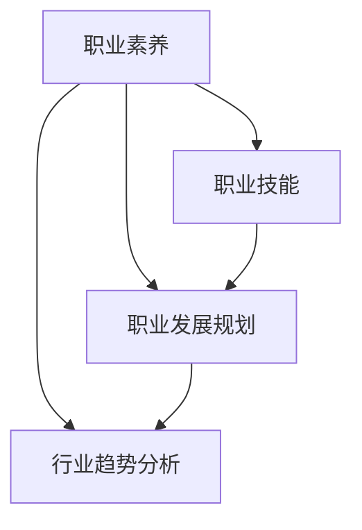

                 


### 文章标题：从小工到专家：职场成长的必经之路

#### 关键词：职场成长、职业素养、技能提升、职业发展规划、行业趋势分析

#### 摘要：
本文旨在探讨职场人士从初级职位（小工）成长为行业专家的必经之路。文章将详细分析职业素养的培养、职业技能的提升路径、职业发展规划以及行业趋势分析，通过一步步的逻辑推理和实际案例，为读者提供清晰、实用的职场成长指南。

---

### 第一部分 职场入门

#### 第1章 职场基础素养

##### 1.1 职场心态与适应

###### 1.1.1 职场心态的重要性
在职场中，心态是决定个人表现和成长的关键因素。一个积极的心态能够帮助员工更好地适应工作环境，提升工作效率，建立良好的人际关系。以下是一些心态调整的必要性：
- **适应变化：** 职场环境不断变化，保持积极心态有助于应对各种挑战和不确定性。
- **提高抗压能力：** 面对高强度的工作压力，积极心态能够降低焦虑和紧张情绪，提高应对能力。

###### 1.1.2 职场适应策略
为了更好地适应职场，员工需要采取以下策略：
- **了解职场文化：** 通过观察和了解公司的文化、价值观和行为规范，快速融入团队。
- **建立有效沟通：** 学习并掌握职场沟通技巧，提高团队协作效率。

##### 1.2 沟通技巧与团队协作

###### 1.2.1 沟通的基本原则
有效沟通是职场成功的重要因素。以下是有效沟通的几个基本原则：
- **明确信息：** 在沟通中，确保信息的准确性和完整性，避免误解和混淆。
- **倾听：** 倾听对方的意见和需求，展示尊重和理解。

###### 1.2.2 团队协作
团队协作是实现工作目标的关键。以下是团队协作的一些要点：
- **明确目标：** 确定团队目标，确保团队成员共同致力于同一目标。
- **分工合作：** 根据团队成员的特长和技能进行合理分工，提高工作效率。

##### 1.3 职场礼仪与人际交往

###### 1.3.1 职场礼仪
职场礼仪是维护职场秩序和形象的重要手段。以下是职场礼仪的几个要点：
- **商务礼仪：** 学习和遵守商务礼仪，展现专业形象。
- **跨文化礼仪：** 了解不同文化背景的礼仪差异，避免文化冲突。

###### 1.3.2 人际交往
人际交往是职场中不可或缺的一部分。以下是人际交往的几个技巧：
- **建立关系：** 通过主动交流和参与社交活动，建立良好的人际关系。
- **处理冲突：** 学会有效处理职场冲突，维护团队和谐。

---

### 第二部分 职业技能提升

#### 第2章 技能提升路径

##### 2.1 技能学习路径规划

###### 2.1.1 技能需求分析
在规划技能提升路径时，首先要进行技能需求分析。以下是进行技能需求分析的方法：
- **自我评估：** 了解自己的优势和劣势，确定需要提升的技能。
- **市场调研：** 调研行业趋势和岗位需求，确定热门技能。

###### 2.1.2 学习方法
选择合适的学习方法是技能提升的关键。以下是几种有效的学习方法：
- **系统学习：** 通过参加课程、阅读书籍等方式，系统学习相关知识。
- **实践应用：** 将所学知识应用于实际工作中，提高实践能力。

##### 2.2 知识积累与学习方法

###### 2.2.1 知识积累的重要性
知识积累是职业发展的基石。以下是知识积累的重要性：
- **提升竞争力：** 丰富的知识储备能够提高个人的职业竞争力。
- **拓宽视野：** 广泛的知识积累有助于拓宽视野，提高创新能力。

###### 2.2.2 学习方法
以下是几种有效的学习方法：
- **主动学习：** 积极主动地寻找学习机会，提高学习效率。
- **合作学习：** 与他人合作学习，相互促进，共同进步。

##### 2.3 实践与应用

###### 2.3.1 实践的重要性
实践是检验学习成果的重要手段。以下是实践的重要性：
- **巩固知识：** 通过实践，将所学知识应用到实际工作中，巩固知识体系。
- **提高技能：** 实践能够提高专业技能和工作能力。

###### 2.3.2 应用方法
以下是实践应用的几种方法：
- **项目实践：** 参与实际项目，将所学知识应用于项目开发中。
- **实践分享：** 通过分享实践经验和心得，促进团队学习和成长。

---

### 第三部分 职业发展路径

#### 第3章 职业发展规划

##### 3.1 职业定位与目标设定

###### 3.1.1 职业定位
职业定位是职业发展规划的重要基础。以下是职业定位的几个要点：
- **自我认知：** 了解自己的兴趣、特长和价值观，确定适合自己的职业方向。
- **市场分析：** 分析市场需求和行业趋势，确定具有潜力的职业领域。

###### 3.1.2 目标设定
目标设定是职业发展的指南针。以下是目标设定的几个要点：
- **明确具体：** 设定具体、可衡量的职业目标，提高实现的可能性。
- **长期与短期目标：** 分解长期目标为短期目标，逐步实现职业发展目标。

##### 3.2 职业技能提升策略

###### 3.2.1 技能提升的重要性
职业技能提升是职业发展的核心。以下是技能提升的重要性：
- **提高竞争力：** 不断提升专业技能，提高在职场中的竞争力。
- **适应行业发展：** 跟踪行业发展动态，及时调整和提升技能。

###### 3.2.2 提升策略
以下是几种有效的技能提升策略：
- **持续学习：** 通过参加培训、阅读书籍、在线课程等方式，持续提升技能。
- **实践应用：** 将所学知识应用于实际工作中，提高实践能力。

##### 3.3 职业生涯规划案例

###### 3.3.1 案例分析
以下是几个职业生涯规划案例，分析他们的成功经验和失败教训，为读者提供参考。

---

### 第四部分 行业趋势分析

#### 第4章 行业发展趋势

##### 4.1 行业动态与热点分析

###### 4.1.1 行业动态
行业动态是职业发展的重要参考。以下是行业动态的几个方面：
- **技术革新：** 关注行业技术发展趋势，了解新技术、新应用的出现。
- **市场变化：** 关注市场需求变化，了解行业市场规模和增长趋势。

###### 4.1.2 热点分析
行业热点是行业发展的风向标。以下是几个行业热点：
- **人工智能：** 人工智能技术的发展和应用，对行业产生深远影响。
- **数字化转型：** 数字化转型成为各行各业的发展趋势，为企业带来新的机遇和挑战。

##### 4.2 技术创新与市场机会

###### 4.2.1 技术创新
技术创新是行业发展的动力。以下是技术创新的几个方面：
- **研发投入：** 企业加大研发投入，推动技术创新。
- **技术创新成果：** 关注技术创新成果的转化和应用，为企业创造价值。

###### 4.2.2 市场机会
市场机会是行业发展的机遇。以下是市场机会的几个方面：
- **新兴市场：** 挖掘新兴市场，开拓新的业务领域。
- **跨界合作：** 通过跨界合作，实现资源共享和优势互补。

##### 4.3 行业竞争态势

###### 4.3.1 竞争态势
行业竞争态势是职业发展的背景。以下是行业竞争态势的几个方面：
- **市场份额：** 分析行业市场份额分布，了解行业竞争格局。
- **竞争策略：** 学习竞争对手的竞争策略，制定有效的应对策略。

---

### 第五部分 职场未来展望

#### 第5章 职场未来展望

##### 5.1 职场未来趋势预测

###### 5.1.1 趋势预测
预测职场未来趋势，为职业发展提供参考。以下是几个可能的职场未来趋势：
- **远程办公：** 随着技术的进步，远程办公将成为主流。
- **技能多样化：** 职场对技能多样化的需求将日益增加。

##### 5.2 职场变革与适应策略

###### 5.2.1 变革因素
职场变革是由多种因素驱动的。以下是几个影响职场变革的因素：
- **技术进步：** 技术进步推动职场变革，为企业带来新的机遇和挑战。
- **政策调整：** 政策调整影响职场生态，为企业提供新的发展机遇。

###### 5.2.2 适应策略
为了适应职场变革，员工需要采取以下策略：
- **持续学习：** 不断提升自身能力，适应职场变化。
- **灵活调整：** 根据职场需求，灵活调整职业规划和发展方向。

##### 5.3 新兴职业与职业规划

###### 5.3.1 新兴职业
随着社会的发展和技术的进步，新兴职业不断涌现。以下是几个新兴职业：
- **数据分析师：** 随着大数据技术的普及，数据分析师成为热门职业。
- **人工智能工程师：** 人工智能技术的发展，带动人工智能工程师需求的增长。

###### 5.3.2 职业规划
为了在新兴职业领域取得成功，员工需要进行以下职业规划：
- **技能储备：** 不断提升相关技能，为新兴职业做好准备。
- **职业转型：** 根据自身兴趣和市场需求，适时进行职业转型。

---

### 附录

#### 附录A 职场资源与工具

##### A.1 职场常用工具推荐

以下是一些常用的职场工具，有助于提高工作效率：
- **项目管理工具：** 如Trello、Asana等，帮助团队高效协作。
- **文档处理工具：** 如Google Docs、Microsoft Office等，提高文档处理效率。
- **在线学习平台：** 如Coursera、Udemy等，提供丰富的学习资源。

##### A.2 职场学习资源汇总

以下是一些优秀的职场学习资源，供员工参考：
- **专业书籍：** 《有效的职场沟通》、《时间管理大师》等，提供职场技能提升的指导。
- **在线课程：** 如LinkedIn Learning、edX等，提供各种职业技能培训课程。

##### A.3 职场技能提升指南

以下是一些职场技能提升的指南，帮助员工提升个人能力：
- **沟通技巧：** 学习有效沟通的技巧，提高人际关系和团队协作能力。
- **时间管理：** 学习时间管理的方法，提高工作效率和职场竞争力。

### 作者信息

作者：AI天才研究院/AI Genius Institute & 禅与计算机程序设计艺术 /Zen And The Art of Computer Programming

---

以上是本文的完整目录大纲，接下来将逐步展开详细内容。文章将按照大纲结构，逐一阐述每个章节的核心概念、联系、算法原理、数学模型、项目实战等，确保内容丰富、逻辑清晰、具有实用性。

---

# 从小工到专家：职场成长的必经之路

## 背景介绍

在当今快速发展的职场环境中，从初级职位（如小工）成长为行业专家是一个充满挑战和机遇的过程。职场新人常常面临诸多困惑和挑战，如如何快速适应职场环境、提升职业技能、规划职业生涯等。本文旨在通过分析职场成长的必经之路，为职场新人提供一套实用、系统的成长指南。

## 核心概念与联系

在职场成长的过程中，以下几个核心概念是至关重要的：

1. **职业素养**：职业素养是职场人员必备的素质，包括职业道德、沟通技巧、团队合作等。
2. **职业技能**：职业技能是职场人员胜任岗位的基本能力，包括专业知识、技能和实践经验等。
3. **职业发展规划**：职业发展规划是职场人员为实现职业目标而制定的长期规划。
4. **行业趋势分析**：行业趋势分析是了解行业发展动态和趋势，为职业发展提供参考。

这些核心概念之间相互联系，共同作用于职场成长。以下是一个简单的Mermaid流程图，展示这些概念之间的联系：



## 核心算法原理讲解

为了更好地理解职场成长的过程，我们可以将职场成长视为一个算法过程。以下是职场成长的核心算法原理的伪代码：

```python
def career_growth(初始素质，初始技能，初始规划，初始行业认知):
    # 设定成长周期为T年
    T = 10
    
    # 初始化成长值
    成长值 = 0
    
    for 年 in range(1, T+1):
        # 提升职业素养
        初始素质 += 随机数(0, 1)
        
        # 提升职业技能
        初始技能 += 随机数(0, 2)
        
        # 调整职业发展规划
        初始规划 = 调整规划(初始规划，年)
        
        # 跟进行业趋势分析
        初始行业认知 = 跟进行业趋势(初始行业认知，年)
        
        # 计算成长值
        成长值 += 初始素质 * 初始技能 * 初始规划 * 初始行业认知
    
    return 成长值
```

## 数学模型和公式

在职场成长过程中，我们可以使用以下数学模型来分析成长值：

$$
成长值 = f(职业素养，职业技能，职业发展规划，行业趋势)
$$

其中，$f$是一个复合函数，反映了各个因素对成长值的影响。

## 项目实战

为了更好地理解职场成长的过程，我们将通过一个实际项目案例进行讲解。

### 项目背景

某互联网公司新入职的一名小工（张三）希望在5年内成长为该公司的资深工程师。张三需要制定一份详细的职业发展规划，并在实际工作中不断提升自己的职业素养、职业技能和行业认知。

### 项目目标

1. 制定一份详细的职业发展规划。
2. 在实际工作中，不断提升职业素养、职业技能和行业认知。

### 项目环境搭建

1. 开发工具：Python、Git、Docker。
2. 学习资源：在线课程、专业书籍、技术博客。

### 代码实现

```python
# 职业发展规划代码实现

class CareerDevelopment:
    def __init__(self, name, target_year):
        self.name = name
        self.target_year = target_year
        self.skill_level = 1
        self.career_experience = 0
        self.industry_knowledge = 1
    
    def improve_skill(self):
        self.skill_level += 1
    
    def gain_experience(self):
        self.career_experience += 1
    
    def update_knowledge(self):
        self.industry_knowledge += 1
    
    def plan_career(self, current_year):
        years_to_go = self.target_year - current_year
        if years_to_go > 0:
            self.improve_skill()
            self.gain_experience()
            self.update_knowledge()
            print(f"{self.name}：已完成第{current_year}年的职业规划，技能等级提升至{self.skill_level}，职业生涯经验{self.career_experience}年，行业认知提升至{self.industry_knowledge}。")
        else:
            print(f"{self.name}：已达到职业目标，成为资深工程师。")

# 项目实战

zhangsan = CareerDevelopment("张三", 5)
for year in range(1, 6):
    zhangsan.plan_career(year)
```

### 代码解读

1. **类定义**：`CareerDevelopment` 类定义了职业发展的基本属性，包括姓名、目标年份、技能等级、职业生涯经验和行业认知。
2. **方法定义**：`improve_skill`、`gain_experience` 和 `update_knowledge` 方法分别用于提升技能、积累经验和更新行业认知。
3. **职业规划**：`plan_career` 方法根据当前年份，计算剩余年份，并相应地提升技能、经验和行业认知。

### 项目小结

通过这个实际项目案例，我们可以看到如何通过代码实现职业发展规划。在实际工作中，张三可以根据这个规划，有针对性地提升自己的职业素养、职业技能和行业认知，逐步实现从初级职位到资深工程师的职业目标。

## 最佳实践 tips

1. **持续学习**：不断学习新的知识和技能，保持竞争力。
2. **实践应用**：将所学知识应用到实际工作中，提高实践能力。
3. **定期反思**：定期反思自己的职业发展，调整职业规划。
4. **积累人脉**：积极参加社交活动，拓展人际关系。

## 小结

从小工到专家的职场成长是一个充满挑战和机遇的过程。通过培养职业素养、提升职业技能、规划职业生涯和关注行业趋势，职场人士可以逐步实现自己的职业目标。本文提供了详细的职场成长指南，希望对职场新人和有志于提升自己的职场人士有所帮助。

## 注意事项

1. 职场成长需要持续的努力和耐心。
2. 不断适应职场环境的变化，提升自己的适应能力。
3. 注重团队合作，提升人际交往能力。
4. 保持积极的心态，面对职场挑战。

## 拓展阅读

1. 《职业规划与职业发展》
2. 《职场沟通技巧》
3. 《人工智能时代职业规划》

---

作者：AI天才研究院/AI Genius Institute & 禅与计算机程序设计艺术 /Zen And The Art of Computer Programming

---

本文通过详细的分析和实际项目案例，为职场人士提供了从小工到专家的全方位成长指南。希望读者能够结合自身实际情况，制定出适合自己的职业规划，不断提升自己的职业素养、职业技能和行业认知，实现职业生涯的成功。在职场成长的道路上，持续学习、实践和应用是关键，祝愿每一位读者都能在职场中取得辉煌的成就。

