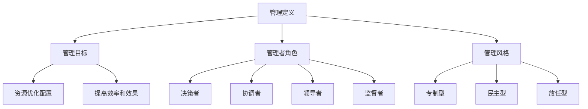
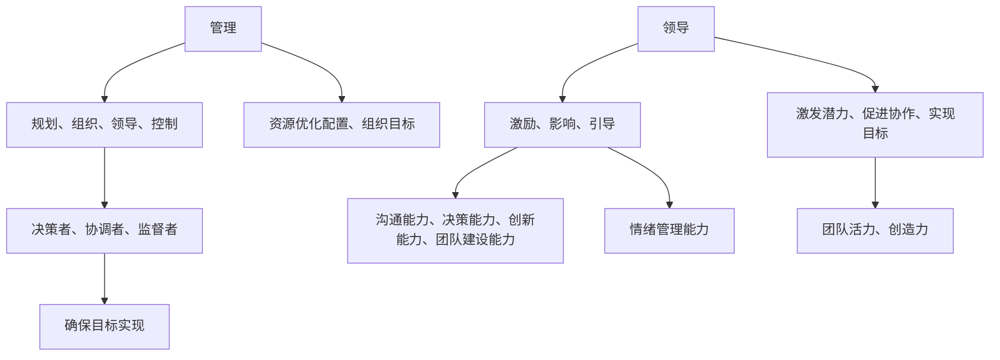

                 

### 准备工作

在撰写这篇技术博客之前，我们需要进行以下准备工作：

#### 1. 明确文章目标
首先，我们需要明确文章的目标和核心内容。文章的目标是帮助读者理解从管理到领导的转变过程，理解管理的本质和领导的重要性，以及如何在实践中提升领导力。核心内容包括管理基础、领导力提升、领导实践和未来趋势。

#### 2. 收集资料
为了撰写这篇博客，我们需要收集相关资料，包括书籍、文章、案例研究等。这些资料将帮助我们构建文章的框架，提供实际案例和理论支持。

#### 3. 设计文章结构
根据收集的资料和文章目标，设计文章的目录结构。确保文章结构清晰，内容有条理。

#### 4. 编写大纲
在完成文章结构设计后，我们需要编写详细的大纲。大纲应该包括每个章节的主题、子主题和要点。

#### 5. 准备辅助材料
为了增强文章的可读性和理解性，我们可以准备一些辅助材料，如流程图、伪代码、数学公式、案例解析等。

### 文章撰写流程

#### 第1步：撰写引言
引言部分需要简要介绍管理的本质和领导的重要性，激发读者的兴趣。可以引用一些经典案例或名言来引起读者的注意。

#### 第2步：撰写概述
在概述部分，简要介绍管理基础、领导力提升、领导实践和未来趋势的主要内容。这将为读者提供一个对全文的初步了解。

#### 第3步：撰写各个章节
根据大纲，逐一撰写每个章节的内容。每个章节都应该包含以下部分：

- 背景介绍：简要介绍章节主题的背景和意义。
- 核心概念与联系：使用Mermaid流程图展示核心概念之间的关系。
- 核心算法原理讲解：使用伪代码详细阐述核心算法原理。
- 数学模型和公式：使用latex格式嵌入文中独立段落的数学公式，并进行详细讲解和举例说明。
- 项目实战：描述实际案例，包括开发环境搭建、源代码实现、代码解读、应用分析等。
- 最佳实践 tips、小结、注意事项、拓展阅读等内容：总结章节内容，提供实用建议和拓展知识。

#### 第4步：撰写结论
在结论部分，总结全文的主要内容，强调从管理到领导转变的重要性和实际应用价值。可以提出一些未来趋势和展望，激发读者进一步思考。

#### 第5步：编辑和校对
完成初稿后，进行编辑和校对。检查文章的逻辑结构、语言表达和格式是否符合要求。可以邀请同事或专业人士进行审阅，提出修改建议。

#### 第6步：发布和推广
将文章发布到技术博客或社交媒体平台，进行推广。可以使用标题、摘要、关键词等来提高文章的可见性。可以与其他技术博客、社区和专业人士进行互动，增加文章的曝光度。

### 文章质量保障

为了确保文章质量，我们需要注意以下几点：

- 内容要准确、权威、有深度。
- 结构要清晰、逻辑性强。
- 语言要简洁、易懂、专业。
- 辅助材料要精炼、实用、符合主题。
- 案例分析和项目实战要有代表性、可操作性强。

通过以上步骤，我们可以撰写一篇高质量的技术博客文章，帮助读者深入理解从管理到领导的转变过程，提升领导力，实现个人和团队的发展。让我们开始吧！### 准备工作

#### 明确文章目标

在撰写这篇技术博客之前，首先需要明确文章的目标。文章的目标是帮助读者理解从管理到领导的转变过程，深入探讨管理的本质和领导的重要性，以及如何在实践中提升领导力。具体来说，文章需要涵盖以下几个核心内容：

1. **管理基础**：介绍管理的定义、目标、角色、管理风格和类型。
2. **领导力提升**：探讨领导力的模型、理论、自我管理和发展路径。
3. **领导实践**：分析领导力在不同领域的应用，如项目管理、团队管理和个人发展。
4. **未来领导力的挑战与趋势**：展望新技术、全球化背景下的领导力发展趋势。

#### 收集资料

为了撰写这篇博客，我们需要收集大量的相关资料。以下是一些关键的资料来源：

1. **书籍和论文**：阅读经典管理书籍，如《管理的实践》、《领导力的五项修炼》等，以及最新的管理论文和研究成果。
2. **案例研究**：收集和分析不同行业、不同组织中的领导力案例，以便在文章中提供实际案例支持。
3. **行业报告**：查阅行业报告，了解当前领导力发展的趋势和挑战。
4. **专家访谈**：采访一些在领导力领域有丰富经验的管理者和专家，获取他们的见解和建议。

#### 设计文章结构

根据收集的资料和文章目标，设计文章的目录结构。文章结构应清晰、条理分明，有助于读者阅读和理解。以下是一个可能的文章结构设计：

1. **引言**：简要介绍管理的本质和领导的重要性，激发读者的兴趣。
2. **概述**：概述管理基础、领导力提升、领导实践和未来趋势的主要内容。
3. **第一部分：管理基础**
   - 第1章：管理的本质与角色
   - 第2章：领导与管理的差异
   - 第3章：团队建设与管理
   - 第4章：沟通艺术
   - 第5章：激励与绩效管理
4. **第二部分：领导力提升**
   - 第6章：领导力模型与理论
   - 第7章：领导者的自我管理
   - 第8章：领导力发展路径
   - 第9章：变革领导
5. **第三部分：领导实践**
   - 第10章：领导力的实践应用
   - 第11章：领导力案例分析
   - 第12章：领导者的社会责任
   - 第13章：未来领导力的挑战与趋势
6. **结论**：总结全文的主要内容，强调从管理到领导转变的重要性和实际应用价值。

#### 编写大纲

在完成文章结构设计后，我们需要编写详细的大纲。大纲应该包括每个章节的主题、子主题和要点。以下是一个详细的章节大纲：

**引言**
- **背景介绍**：当前管理实践面临的挑战和问题。
- **研究目的**：为什么研究从管理到领导的转变。

**概述**
- **管理基础**：管理的定义、目标、角色和管理风格。
- **领导力提升**：领导力的定义、模型和理论。
- **领导实践**：领导力在不同领域的应用和挑战。

**第一部分：管理基础**
- **第1章：管理的本质与角色**
  - **背景介绍**：管理的定义和目标。
  - **核心概念与联系**：使用Mermaid流程图展示管理的核心概念。
  - **管理风格与类型**：不同管理风格的特点和应用。

- **第2章：领导与管理的差异**
  - **背景介绍**：领导与管理的区别。
  - **核心概念与联系**：使用Mermaid流程图展示领导与管理的联系。
  - **领导者的素质与能力**：领导者的必备素质和能力。

- **第3章：团队建设与管理**
  - **背景介绍**：团队建设的重要性。
  - **核心概念与联系**：使用Mermaid流程图展示团队建设的关键概念。
  - **团队冲突的解决与管理**：团队冲突的类型和解决策略。

- **第4章：沟通艺术**
  - **背景介绍**：有效沟通的重要性。
  - **核心概念与联系**：使用Mermaid流程图展示沟通的关键要素。
  - **沟通技巧与实践**：如何提高沟通效果。

- **第5章：激励与绩效管理**
  - **背景介绍**：激励理论和绩效管理的重要性。
  - **核心概念与联系**：使用Mermaid流程图展示激励理论和绩效管理的关系。
  - **绩效评估方法与技巧**：如何评估和提升员工绩效。

**第二部分：领导力提升**
- **第6章：领导力模型与理论**
  - **背景介绍**：领导力模型和理论的发展。
  - **核心概念与联系**：使用Mermaid流程图展示领导力模型和理论的关系。
  - **领导力模型的比较与融合**：不同领导力模型的特点和应用。

- **第7章：领导者的自我管理**
  - **背景介绍**：领导者的自我管理的重要性。
  - **核心概念与联系**：使用Mermaid流程图展示领导者的自我管理概念。
  - **时间管理策略**：如何高效管理时间。

- **第8章：领导力发展路径**
  - **背景介绍**：领导力发展的过程和挑战。
  - **核心概念与联系**：使用Mermaid流程图展示领导力发展路径。
  - **职业规划与目标设定**：如何设定和实现职业目标。

- **第9章：变革领导**
  - **背景介绍**：变革领导的重要性。
  - **核心概念与联系**：使用Mermaid流程图展示变革领导的概念。
  - **变革管理的策略**：如何应对变革挑战。

**第三部分：领导实践**
- **第10章：领导力的实践应用**
  - **背景介绍**：领导力在不同领域的应用。
  - **核心概念与联系**：使用Mermaid流程图展示领导力实践的关键概念。
  - **领导力在项目管理中的应用**：如何提高项目效率。

- **第11章：领导力案例分析**
  - **背景介绍**：领导力案例研究的意义。
  - **核心概念与联系**：使用Mermaid流程图展示领导力案例的分析方法。
  - **经典领导力案例解析**：如何通过案例分析提升领导力。

- **第12章：领导者的社会责任**
  - **背景介绍**：领导者的社会责任的重要性。
  - **核心概念与联系**：使用Mermaid流程图展示领导者的社会责任概念。
  - **领导者的道德伦理**：如何践行社会责任。

- **第13章：未来领导力的挑战与趋势**
  - **背景介绍**：未来领导力的挑战和趋势。
  - **核心概念与联系**：使用Mermaid流程图展示未来领导力的概念。
  - **新技术对领导力的影响**：如何应对新技术挑战。

**结论**
- **总结**：从管理到领导转变的重要性。
- **展望**：未来领导力的发展趋势和挑战。

通过以上详细的章节大纲，我们可以为撰写技术博客提供一个明确的框架，确保文章内容丰富、结构清晰、逻辑性强。接下来，我们将按照大纲逐步撰写每个章节的内容。首先，我们从第一部分：管理基础开始。在下一部分中，我们将详细讨论第1章：管理的本质与角色。

## 第1章：管理的本质与角色

### 管理的定义与目标

管理是通过规划、组织、领导和控制等一系列活动，有效利用资源以实现组织目标的过程。在《管理的实践》一书中，彼得·德鲁克（Peter Drucker）指出，管理是一种艺术和科学，它涉及对人的管理、组织的设计和决策的制定。

管理的目标包括：

1. **资源优化配置**：确保组织内的资源（包括人力、物力、财力）得到最有效的利用。
2. **实现组织目标**：通过制定和执行战略计划，确保组织目标的实现。
3. **提高效率和效果**：通过有效的管理活动，提高组织的效率和效果，从而在竞争中获得优势。

### 管理者的角色与职责

管理者的角色可以分为以下几个方面：

1. **决策者**：管理者负责制定组织战略和决策，确保组织目标的实现。
2. **协调者**：管理者需要协调不同部门、团队和员工的工作，确保他们能够协同合作，实现组织目标。
3. **领导者**：管理者需要激励和引导员工，发挥他们的潜力，实现个人和组织的共同目标。
4. **监督者**：管理者需要监控组织的运营状况，确保工作按照预定计划进行，及时发现和解决问题。

管理者的职责包括：

1. **规划**：制定组织战略和计划，确定组织的目标和实现路径。
2. **组织**：设计组织结构，明确各部门、团队和员工的角色和职责。
3. **领导**：激励和引导员工，提供必要的培训和发展机会，确保员工能够胜任工作。
4. **控制**：监控组织的运营状况，确保工作按照计划进行，及时纠正偏差。

### 管理风格与类型

管理风格是指管理者在管理过程中所采用的方法和手段。常见的管理风格包括：

1. **专制型管理**：管理者在决策过程中具有绝对的权威，员工的参与度较低。
2. **民主型管理**：管理者在决策过程中注重员工的参与，鼓励员工提出意见和建议。
3. **放任型管理**：管理者对员工的工作较少干预，给予员工较大的自由度。

根据管理风格的不同，管理类型也可以分为：

1. **传统管理**：侧重于过程控制和绩效考核，强调纪律和规范。
2. **现代管理**：强调人本管理，关注员工的成长和发展，重视团队合作和创新。
3. **转型管理**：在传统管理和现代管理的基础上，融合了最新的管理理念和工具，如敏捷管理、精益管理等。

### 管理基础的核心概念

为了更好地理解管理基础，我们可以使用Mermaid流程图来展示管理的关键概念之间的关系：

通过这个流程图，我们可以清晰地看到管理的定义、目标、管理者角色和管理风格之间的关系，有助于读者更好地理解管理基础。

### 实际案例

为了更好地理解管理基础的应用，我们可以通过一个实际案例来说明：

**案例**：某公司销售部门的经理李先生，他需要管理一个由10名销售人员组成的团队。他的主要职责包括：

1. **制定销售策略**：根据公司的总体销售目标，制定具体的销售策略和计划。
2. **协调团队工作**：确保每位销售人员了解自己的职责和目标，并能够协同合作，共同完成销售任务。
3. **激励员工**：通过制定激励机制，如奖金、晋升机会等，激励员工提高销售业绩。
4. **监控销售进度**：定期检查销售进度，及时发现问题并采取措施进行调整。

在这个案例中，李先生需要运用管理的各项基本原则和技巧，如制定销售策略、协调团队工作、激励员工和监控销售进度，以确保销售目标的实现。这个案例展示了管理基础在实际工作中的应用。

### 小结

在本章中，我们详细讨论了管理的本质与角色，包括管理的定义、目标、管理者角色和管理风格。通过使用Mermaid流程图展示了管理的关键概念，并通过实际案例说明了管理基础的应用。在下一章中，我们将探讨领导与管理的差异，深入分析领导与管理的区别和联系。

## 第2章：领导与管理的差异

### 领导的定义与目标

领导是通过激励、影响和引导他人来实现共同目标的过程。领导不仅仅是管理的一部分，更是一种激励和影响他人行为和思维的能力。彼得·德鲁克曾说过：“领导力不是一种职位，而是一种能力。”

领导的目标主要包括：

1. **激发团队成员的潜力**：领导需要发现和激发团队成员的潜力，使他们在工作中发挥最大价值。
2. **促进团队协作与创新**：领导需要建立一个协作的环境，鼓励团队成员共同解决问题，实现创新。
3. **实现组织目标**：领导需要引导团队朝着组织目标前进，确保团队工作与组织目标的一致性。

### 管理与领导的关系

管理是领导的一部分，但领导不仅仅是管理。管理侧重于规划、组织、领导和控制，确保组织目标的实现。而领导则侧重于激励和影响他人，使团队充满活力和创造力。

1. **管理的本质**：管理是通过一系列规划、组织、领导和控制活动，确保组织目标的实现。
2. **领导的作用**：领导是在管理基础上，通过激励和影响他人，使团队充满活力和创造力。

管理是“做事正确”，而领导是“做正确的事”。在组织中，管理是必需的，但领导是至关重要的。

### 领导者的素质与能力

领导者的素质和能力是领导成功的关键因素。以下是领导者应具备的几个关键素质和能力：

1. **沟通能力**：领导者需要具备良好的沟通能力，包括倾听、表达和反馈，以确保信息的有效传递。
2. **决策能力**：领导者需要在面对复杂和不确定的情况时，做出明智的决策。
3. **创新能力**：领导者需要鼓励创新，并能够带领团队实现创新。
4. **团队建设能力**：领导者需要能够建立和维护一个高效、协作的团队。
5. **情绪管理能力**：领导者需要具备良好的情绪管理能力，以应对工作压力和挑战。

### 领导与管理的差异

领导与管理的差异主要体现在以下几个方面：

1. **目标**：管理的目标是实现组织目标，而领导的目标是激发团队成员的潜力，促进团队协作与创新。
2. **方法**：管理侧重于规划和控制，而领导侧重于激励和影响。
3. **关注点**：管理关注资源的分配和利用，而领导关注人的发展和团队的整体效能。
4. **结果**：管理的结果是组织目标的实现，而领导的结果是团队的活力和创造力。

为了更直观地理解领导与管理的差异，我们可以使用Mermaid流程图来展示：

通过这个流程图，我们可以清晰地看到领导与管理的不同目标和方法，以及领导者应具备的关键素质和能力。

### 实际案例

为了更好地理解领导与管理的差异，我们可以通过一个实际案例来说明：

**案例**：某公司的研发部门主管王先生，他负责管理一个由10名研发人员组成的团队。他的主要职责包括：

1. **管理**：
   - 制定研发计划，确保项目按时完成。
   - 分配任务，监控项目进度，确保工作按时完成。
   - 监督研发人员的绩效，提供反馈和指导。

2. **领导**：
   - 激励研发人员，鼓励他们提出创新想法。
   - 建立一个开放的沟通环境，鼓励团队成员分享意见和想法。
   - 带领团队解决技术难题，推动项目的创新和改进。

在这个案例中，王先生需要运用管理的原则和方法来确保项目的顺利进行，同时，他还需要运用领导的能力来激发团队的潜力和创造力，实现项目的创新和改进。这个案例展示了领导与管理的实际应用和差异。

### 小结

在本章中，我们详细探讨了领导与管理的差异，包括领导与管理的定义、目标、方法、关注点和结果。通过使用Mermaid流程图和实际案例，我们更好地理解了领导与管理的实际应用和区别。在下一章中，我们将探讨团队建设与管理，探讨如何建立高效、协作的团队。

## 第3章：团队建设与管理

### 团队建设的重要性

团队建设是管理过程中至关重要的一环。一个高效的团队可以带来以下好处：

1. **提高工作效率**：团队成员协同工作，可以更快地完成项目任务，提高工作效率。
2. **促进知识分享**：团队成员之间可以互相学习、交流，促进知识的共享和创新。
3. **增强团队凝聚力**：通过团队建设活动，可以增强团队成员之间的信任和合作，提高团队凝聚力。
4. **提高决策质量**：团队成员共同参与决策，可以提供更多的观点和建议，提高决策的质量。

### 团队角色的认知与协作

在一个团队中，每个成员都有其独特的角色和职责。为了实现团队的高效运作，团队成员需要明确自己的角色，并理解其他成员的角色和职责。以下是一些常见的团队角色：

1. **领导者**：负责指导团队，设定目标和计划，协调团队成员的工作。
2. **执行者**：负责具体任务的执行，按照团队计划完成各项工作。
3. **协调者**：负责协调团队内部和外部资源，确保项目顺利进行。
4. **观察者**：负责观察项目进展，提供反馈和建议，帮助团队改进。
5. **贡献者**：负责提供专业知识和技术支持，帮助团队解决问题。

为了实现高效协作，团队成员需要遵循以下原则：

1. **明确目标**：团队应明确共同的目标和愿景，确保所有成员都朝着同一方向努力。
2. **分工合作**：根据成员的特长和角色，合理分配任务，确保每个人都能发挥最大价值。
3. **有效沟通**：建立开放的沟通机制，鼓励团队成员分享信息和意见，确保信息畅通无阻。
4. **相互信任**：建立信任关系，确保团队成员之间能够相互支持和协作。

### 团队冲突的解决与管理

团队冲突是团队建设中不可避免的一部分。有效的解决和管理团队冲突，有助于保持团队的稳定和高效运作。以下是一些解决团队冲突的策略：

1. **倾听和理解**：倾听冲突双方的立场和观点，理解他们的需求和期望，以便找到解决问题的方法。
2. **沟通与调解**：通过有效的沟通，帮助冲突双方达成共识，找到解决问题的方法。
3. **角色转换**：鼓励团队成员站在对方的角度思考问题，增进相互理解。
4. **建立规则**：制定团队行为规范，明确团队内的沟通方式和处理冲突的流程。
5. **培训与教育**：通过培训和教育活动，提高团队成员的沟通技巧和冲突解决能力。

### 实际案例

为了更好地理解团队建设与管理，我们可以通过一个实际案例来说明：

**案例**：某公司的市场部门需要开发一款新产品。市场部门的负责人小张需要组建一个由市场营销、产品开发、技术支持等不同领域的专家组成的跨职能团队，负责新产品的开发工作。

1. **团队建设**：
   - **明确目标**：小张与团队成员明确新产品的市场目标、开发计划和交付时间。
   - **分工合作**：根据团队成员的特长和角色，分配任务，确保每个人都能发挥最大价值。
   - **有效沟通**：建立定期会议和沟通渠道，确保团队成员之间的信息畅通。

2. **团队冲突的解决**：
   - **倾听和理解**：在团队会议中，小张鼓励团队成员表达自己的观点和担忧，倾听并理解他们的立场。
   - **沟通与调解**：小张通过讨论和协商，帮助团队成员找到解决问题的方法，确保项目顺利进行。

通过这个案例，我们可以看到团队建设与管理在实际工作中的应用。通过明确目标、分工合作、有效沟通和解决冲突，小张成功地推动了新产品的开发工作。

### 小结

在本章中，我们详细探讨了团队建设与管理的重要性，包括团队角色的认知与协作、团队冲突的解决与管理。通过实际案例，我们展示了团队建设与管理在实际工作中的应用。在下一章中，我们将探讨沟通艺术，探讨如何提高沟通效果，建立高效的沟通机制。

## 第4章：沟通艺术

### 有效沟通的要素

有效沟通是实现团队协作、提高工作效率的关键。为了确保沟通的有效性，我们需要关注以下要素：

1. **清晰的信息**：沟通的信息需要明确、具体、简洁，避免模糊和歧义。
2. **适当的渠道**：选择合适的沟通渠道，如面对面交流、电子邮件、电话、即时通讯工具等，以确保信息的及时传递。
3. **正确的时机**：选择适当的时机进行沟通，避免在忙碌或压力大的时候打扰对方。
4. **开放的姿态**：保持开放的心态，倾听对方的意见和反馈，展示尊重和关心。

### 沟通障碍与解决策略

沟通障碍是影响沟通效果的重要因素。以下是一些常见的沟通障碍及其解决策略：

1. **语言障碍**：语言不同可能导致沟通误解。解决策略：使用简单、明确的语言，避免使用过于专业或复杂的术语。
2. **文化差异**：不同文化背景可能导致沟通障碍。解决策略：了解和尊重不同文化的价值观和行为习惯，采取包容和理解的态度。
3. **心理障碍**：心理压力、情绪波动等可能导致沟通障碍。解决策略：培养积极的沟通氛围，鼓励团队成员开放地表达自己的想法和感受。
4. **信息过载**：过多的信息可能导致沟通困难。解决策略：筛选关键信息，使用图表、演示等辅助工具，帮助对方更好地理解和吸收信息。

### 沟通技巧与实践

为了提高沟通效果，我们可以运用以下沟通技巧：

1. **倾听**：积极倾听对方的意见和观点，确保理解对方的意图。
2. **提问**：通过提问，引导对方更深入地表达自己的想法，并了解对方的需求和期望。
3. **反馈**：及时给予对方反馈，表达自己的理解和感受，确保双方对沟通内容的一致性。
4. **非语言沟通**：运用肢体语言、面部表情、语调等非语言手段，增强沟通的效果。

以下是一个实际案例，展示如何运用沟通技巧：

**案例**：在一次团队会议上，项目经理李先生需要向团队成员介绍新的项目计划和目标。为了确保沟通的有效性，他采取了以下措施：

1. **准备充分**：提前准备会议议程和演示材料，确保信息的清晰和简洁。
2. **积极倾听**：在会议开始时，李先生表示愿意倾听团队成员的意见和问题，创造一个开放的沟通氛围。
3. **提问和反馈**：在介绍项目计划时，李先生提问团队成员对计划的看法，并给予及时的反馈，确保团队成员的理解和接受。
4. **非语言沟通**：李先生通过肢体语言和面部表情，展示出对团队成员的尊重和关心，增强沟通的效果。

通过这个案例，我们可以看到如何运用沟通技巧提高沟通效果。

### 实践中的沟通艺术

在实际工作中，沟通艺术的应用至关重要。以下是一些沟通艺术的实践建议：

1. **建立有效的沟通机制**：制定沟通流程和规范，确保信息的及时传递和沟通的效率。
2. **培养良好的沟通习惯**：鼓励团队成员养成主动沟通、积极倾听、及时反馈的习惯。
3. **开展沟通培训**：定期组织沟通技巧培训，提高团队成员的沟通能力。
4. **鼓励反馈**：建立反馈机制，鼓励团队成员提出意见和建议，改进沟通效果。

通过这些实践，我们可以建立起一个高效的沟通环境，提高团队的工作效率和协作水平。

### 小结

在本章中，我们探讨了沟通艺术的重要性，包括有效沟通的要素、沟通障碍与解决策略、沟通技巧与实践。通过实际案例和实践建议，我们展示了如何提高沟通效果，建立高效的沟通机制。在下一章中，我们将探讨激励与绩效管理，探讨如何通过激励措施提高员工绩效。

## 第5章：激励与绩效管理

### 激励理论与应用

激励理论是管理学研究的重要领域，旨在理解如何通过外部和内部因素激发员工的动机和行为。以下是几种主要的激励理论及其应用：

1. **马斯洛需求层次理论**：马斯洛认为，人的需求可以分为五个层次：生理需求、安全需求、社交需求、尊重需求和自我实现需求。管理者可以通过满足员工的这些需求来激励他们。例如，提供合理的薪酬福利、安全保障、团队活动等，满足员工的生理和安全需求；通过表扬和认可，满足员工的尊重需求；通过提供挑战性和发展机会，满足员工的自我实现需求。

2. **赫兹伯格双因素理论**：赫兹伯格将工作激励因素分为两类：保健因素和激励因素。保健因素包括公司的政策、工作条件、薪酬等，这些因素如果不满意会导致员工不满；而激励因素包括成就、认可、责任感等，这些因素能够激发员工的内在动机。管理者应关注激励因素，通过提供有挑战性的工作任务、及时的认可和反馈，提升员工的满意度和绩效。

3. **ERG理论**：ERG理论扩展了马斯洛的需求层次理论，认为人们可以同时追求多种需求，而不是像马斯洛所描述的那样遵循层次结构。ERG理论包括存在需求（如生活保障、安全感）、关系需求（如人际交往、归属感）和成长需求（如自我实现、自我提升）。管理者可以通过满足员工的多方面需求来提高激励效果。

### 绩效评估方法与技巧

绩效评估是管理过程中的一项关键任务，它有助于确定员工的绩效水平，提供反馈和改进建议。以下是一些常用的绩效评估方法和技巧：

1. **关键绩效指标（KPI）**：KPI是衡量员工工作绩效的关键指标，通常基于公司的战略目标和工作职责设定。KPI可以是量化的，如销售额、项目进度等，也可以是质化的，如团队协作、客户满意度等。设定合理的KPI可以帮助员工明确工作目标和绩效标准。

2. **360度评估**：360度评估是一种多角度的绩效评估方法，它收集来自员工上级、同事、下属和客户的反馈，提供全面的绩效评估。这种方法有助于发现员工的优势和不足，并提供改进建议。

3. **行为锚定评估法（BARS）**：BARS是一种基于具体行为的绩效评估方法，它将绩效标准细化为一系列具体的行为指标，员工的工作表现与这些指标进行对比。这种方法有助于提供具体的反馈，帮助员工改进。

4. **绩效改进策略**：在绩效评估过程中，管理者应关注员工的绩效表现，并提供改进策略。例如，对于绩效不佳的员工，可以提供培训和发展机会，帮助他们提升技能；对于表现优秀的员工，可以提供晋升机会和额外的奖励。

### 绩效评估方法与技巧的应用

以下是一个实际案例，展示如何应用绩效评估方法和技巧：

**案例**：某公司销售部门的经理王女士需要评估团队的销售业绩。她采取了以下方法：

1. **设定KPI**：王女士根据公司的销售目标和销售部门的职责，设定了每月的销售额、客户满意度、新客户数量等关键绩效指标。

2. **360度评估**：王女士邀请团队成员的上级、同事和下属，对他们的工作表现进行评估。她收集了多方面的反馈，包括销售业绩、团队合作、客户沟通等方面。

3. **行为锚定评估法**：王女士将销售绩效细化为具体的销售行为，如客户拜访次数、销售策略制定、客户关系维护等。她对每个销售人员的表现进行具体分析，提供改进建议。

4. **绩效改进策略**：针对绩效不佳的员工，王女士提供了销售技巧培训和心理辅导；对于表现优秀的员工，她提供了晋升机会和奖金奖励。

通过这个案例，我们可以看到如何结合不同的绩效评估方法和技巧，对员工进行全面的绩效评估和改进。

### 小结

在本章中，我们探讨了激励理论与应用，以及绩效评估方法与技巧。通过马斯洛需求层次理论、赫兹伯格双因素理论和ERG理论，我们了解了如何通过满足员工的需求来激励他们。通过关键绩效指标（KPI）、360度评估、行为锚定评估法等绩效评估方法，我们学会了如何全面评估员工的绩效，并提供改进策略。在下一章中，我们将探讨领导力模型与理论，深入分析不同领导力模型的特点和应用。

## 第6章：领导力模型与理论

### 领导力的发展与演变

领导力是一门不断发展的学科，随着社会和组织的变革，领导力理论也在不断演变。从传统的领导理论到现代的领导理论，领导力的定义和理念发生了显著的变化。

1. **传统领导理论**：传统领导理论主要关注领导者的权力和权威。泰勒（Frederick Taylor）的科学管理理论和法约尔（Henri Fayol）的管理理论都强调了领导者的角色和职责，如规划、组织、指挥、协调和控制。这些理论认为领导者是组织的核心，通过指挥和控制来实现组织目标。

2. **现代领导理论**：现代领导理论更加关注领导者的行为和风格，以及领导过程和情境因素。行为领导理论（Behavioral Theory of Leadership）强调领导者通过行为和互动来影响员工；领导风格理论（Leadership Style Theory）研究领导者在不同情境下采用的不同风格；情境领导理论（Situational Leadership Theory）则认为领导者的风格应根据不同情境进行灵活调整。

3. **当代领导理论**：随着全球化和数字化的发展，当代领导理论更加关注领导者的创新能力和适应能力。变革型领导理论（Transformational Leadership Theory）强调领导者通过激发员工的潜力，实现组织和个人的共同成长；服务型领导理论（Servant Leadership Theory）强调领导者通过服务他人来实现组织目标；智慧型领导理论（Wisdom-Based Leadership Theory）则认为领导者应具备智慧和洞察力，以应对复杂多变的环境。

### 领导力模型的应用

不同的领导力模型在组织和团队中有着广泛的应用。以下是一些常见的领导力模型及其应用：

1. **变革型领导**：变革型领导强调领导者通过愿景、激励和榜样作用来影响员工，实现组织的变革和发展。变革型领导适用于需要创新和变革的组织环境，如初创公司、转型期企业等。

2. **服务型领导**：服务型领导强调领导者通过服务他人来提升团队和组织效能。服务型领导适用于注重团队协作和员工成长的组织环境，如学校、医院、非营利组织等。

3. **情境领导**：情境领导理论认为领导者的风格应根据不同情境进行灵活调整。情境领导适用于复杂多变的工作环境，如项目管理、跨职能团队等。

4. **变革型与服务型领导结合**：将变革型领导和服务型领导的优点结合，形成一种综合型的领导风格，适用于需要创新、变革和团队协作的组织环境。

### 领导力模型的应用实例

以下是一个实际案例，展示如何应用不同的领导力模型：

**案例**：某科技公司CEO张先生，他需要带领团队实现公司的转型和发展。他采取了以下领导策略：

1. **变革型领导**：张先生提出了公司的愿景和战略目标，通过激励和榜样作用，激发团队成员的潜力和创造力，推动公司创新。

2. **服务型领导**：张先生注重团队协作和员工成长，通过为团队成员提供支持、培训和反馈，提升团队的凝聚力和效能。

3. **情境领导**：张先生根据不同情境灵活调整领导风格。在团队面临挑战时，他采用指导型领导，明确目标和任务，提供具体的指导和支持；在团队需要创新时，他采用支持型领导，鼓励团队成员发挥创造力和主动性。

通过这个案例，我们可以看到如何结合不同的领导力模型，实现组织的转型和发展。

### 领导力理论的比较与融合

不同的领导力理论各有优缺点，但在实际应用中，往往需要结合多种领导力理论，形成一种综合的领导风格。以下是一些领导力理论的比较和融合：

1. **变革型领导与服务型领导的融合**：变革型领导强调领导者的激励和榜样作用，而服务型领导强调领导者的服务和支持。将两者结合，可以形成一种既能够激发员工潜力，又能够提升团队协作的领导风格。

2. **情境领导与变革型领导的融合**：情境领导强调领导风格的灵活调整，而变革型领导强调领导者的愿景和激励。将两者结合，可以在不同情境下，灵活调整领导风格，同时保持领导者的激励作用。

3. **智慧型领导与其他领导力的融合**：智慧型领导强调领导者的洞察力和判断力，可以与其他领导力理论结合，提升领导者的决策能力和领导效能。

通过比较和融合不同的领导力理论，领导者可以形成一种适应多种情境的领导风格，实现组织的目标和员工的成长。

### 小结

在本章中，我们探讨了领导力的发展与演变，介绍了不同的领导力模型和理论。通过比较和融合不同的领导力理论，我们可以形成一种适应多种情境的领导风格，实现组织的创新和变革。在下一章中，我们将探讨领导者的自我管理，分析领导者如何进行时间管理和情绪管理。

## 第7章：领导者的自我管理

### 自我认知与自我提升

自我认知是领导者自我管理的基础。领导者需要深入理解自己的价值观、优势和弱点，以便更好地发挥领导作用。以下是一些自我认知和自我提升的方法：

1. **自我反思**：定期进行自我反思，分析自己的行为和决策，识别自己的优点和不足。通过反思，领导者可以更好地了解自己的领导风格和行为模式。

2. **360度反馈**：邀请同事、下属和上级提供反馈，获取多方面的观点和意见。这种反馈可以帮助领导者更全面地了解自己，发现自己的盲点和改进方向。

3. **领导力发展计划**：制定个人领导力发展计划，设定具体的目标和行动步骤。通过制定计划，领导者可以系统地提升自己的领导能力。

4. **学习与培训**：参加领导力培训课程，阅读领导力相关的书籍和文章，从他人的经验和知识中学习。通过不断学习和实践，领导者可以不断提升自己的领导能力。

### 时间管理策略

时间管理是领导者自我管理的重要组成部分。有效的时间管理可以帮助领导者提高工作效率，更好地平衡工作与生活。以下是一些时间管理策略：

1. **设定优先级**：将任务根据重要性和紧急性进行分类，优先处理重要且紧急的任务。通过设定优先级，领导者可以确保关键任务得到及时处理。

2. **使用时间管理工具**：利用日历、任务管理应用等工具，规划和管理自己的时间。这些工具可以帮助领导者更好地安排时间，避免遗漏重要任务。

3. **分块时间**：将工作时间分成若干个较短的时间段，每个时间段专注于一项任务。通过分块时间，领导者可以减少任务切换的干扰，提高工作效率。

4. **避免拖延**：识别导致拖延的原因，并采取相应措施，如设定明确的目标和截止日期、分解任务等。通过避免拖延，领导者可以更好地控制时间，提高工作效率。

### 情绪管理

情绪管理是领导者自我管理的关键要素。领导者需要学会控制自己的情绪，以积极的心态面对挑战和压力。以下是一些情绪管理策略：

1. **认知重构**：通过认知重构，领导者可以改变对事物和情况的看法，从而调整自己的情绪反应。例如，将负面情况视为挑战和机会，而不是困境。

2. **放松技巧**：学习放松技巧，如深呼吸、冥想、瑜伽等，以缓解压力和焦虑。这些技巧可以帮助领导者保持冷静和专注。

3. **积极心态**：培养积极的心态，关注解决问题的方法，而不是问题本身。通过积极心态，领导者可以更好地应对挑战和困难。

4. **寻求支持**：在情绪低落或面临压力时，寻求家人、朋友或专业人士的支持和帮助。通过寻求支持，领导者可以减轻情绪负担，更好地管理自己的情绪。

### 实际案例

以下是一个实际案例，展示如何进行自我管理和情绪管理：

**案例**：某公司的部门经理李女士，她在自我管理和情绪管理方面取得了显著成果。她采取了以下措施：

1. **自我反思**：每天晚上花时间反思自己的行为和决策，分析自己的优点和不足。通过自我反思，她发现自己在时间管理方面存在不足，并制定了改进计划。

2. **时间管理策略**：她使用日历和任务管理应用来规划时间，设定明确的优先级和截止日期。通过分块时间，她提高了工作效率，减少了任务切换的干扰。

3. **情绪管理**：在面对压力和挑战时，她学会了认知重构和放松技巧。通过改变对问题的看法和采取放松技巧，她保持了冷静和专注，更好地应对了工作中的困难。

通过这个案例，我们可以看到如何通过自我认知和自我提升、时间管理策略和情绪管理策略，实现自我管理的提升。

### 小结

在本章中，我们探讨了领导者的自我管理，包括自我认知与自我提升、时间管理策略和情绪管理。通过自我反思、时间管理工具、认知重构、放松技巧和积极心态等策略，领导者可以提升自我管理能力，更好地应对工作挑战。在下一章中，我们将探讨领导力的发展路径，分析领导者如何实现职业发展，提升领导力。

## 第8章：领导力发展路径

### 领导者的成长过程

领导力的发展是一个长期的过程，涉及多个阶段。了解这些阶段有助于领导者更好地认识自己的发展路径，并采取相应的措施提升领导力。

1. **自我认知阶段**：在这个阶段，领导者开始意识到自己的优势和弱点，认识到领导力的重要性。他们可能通过自我反思、接受反馈和参与培训等方式，提高自我认知。

2. **学习与实践阶段**：在这个阶段，领导者通过学习和实践，积累知识和经验，提升领导能力。他们可能会参加领导力培训课程、阅读相关书籍、参与实际项目等。

3. **角色适应阶段**：在这个阶段，领导者开始适应新的领导角色，学会管理团队、协调资源、制定战略等。他们可能会面临挑战，如处理团队冲突、应对变革等。

4. **成熟阶段**：在这个阶段，领导者的领导力得到了充分的发展，他们能够灵活应对各种情境，具备较强的领导能力和影响力。

### 职业规划与目标设定

职业规划是领导者提升领导力的重要途径。以下是一些职业规划与目标设定的方法：

1. **设定长期和短期目标**：领导者应明确自己的长期职业目标和短期目标，确保目标具有可实现性。例如，长期目标是成为部门经理，短期目标是提升某项关键技能。

2. **制定行动计划**：根据目标，制定具体的行动计划，包括学习、培训、实践等。行动计划应具有可操作性和时间表。

3. **定期评估和调整**：定期评估目标的进展情况，根据实际情况调整行动计划。通过定期评估，领导者可以及时发现问题，并采取相应的措施。

### 职业规划与目标设定的实际案例

以下是一个实际案例，展示如何进行职业规划和目标设定：

**案例**：某公司的项目经理王先生，他计划在未来五年内成为公司的总监。他采取了以下措施：

1. **设定目标**：王先生设定了长期目标（成为公司总监）和短期目标（提升项目管理技能、获得PMP认证）。

2. **制定行动计划**：他制定了具体的行动计划，包括参加项目管理培训、阅读项目管理相关书籍、参与公司的重要项目等。

3. **定期评估和调整**：王先生每月评估自己的进展情况，根据评估结果调整行动计划。例如，如果某项目标的进度不理想，他会增加培训和学习的时间。

通过这个案例，我们可以看到如何通过设定目标、制定行动计划和定期评估，实现职业规划和目标设定。

### 领导力发展的障碍与克服

在领导力发展的过程中，领导者可能会遇到各种障碍。以下是一些常见的障碍及其克服方法：

1. **恐惧失败**：领导者可能害怕失败，导致不敢冒险和创新。克服方法：鼓励领导者接受失败是成长的一部分，学会从失败中吸取教训。

2. **缺乏自信**：领导者可能缺乏自信，导致在决策和领导过程中犹豫不决。克服方法：通过培训和实战经验，提升领导者的自信心。

3. **时间管理不足**：领导者可能面临时间管理不足的问题，导致无法专注于领导力提升。克服方法：学习时间管理技巧，合理安排时间和任务。

4. **缺乏支持**：领导者可能缺乏来自上级、同事和下属的支持，导致领导力发展受阻。克服方法：建立良好的沟通机制，寻求各方支持。

### 领导力发展的实际案例分析

以下是一个实际案例，展示如何克服领导力发展的障碍：

**案例**：某公司的技术总监张先生，他在领导力发展过程中遇到了以下障碍：

1. **恐惧失败**：张先生害怕在重要项目中失败，导致他不敢大胆决策和创新。

2. **缺乏自信**：张先生对自己的技术能力有信心，但在管理能力方面缺乏自信。

3. **时间管理不足**：张先生负责多个项目，时间管理不足，导致工作效率低下。

4. **缺乏支持**：张先生的上级和同事对他的领导力发展关注不足，缺乏必要的支持和指导。

为了克服这些障碍，张先生采取了以下措施：

1. **接受失败是成长的一部分**：张先生开始接受失败是成长的一部分，不再害怕失败。

2. **参加领导力培训**：张先生参加了领导力培训课程，提升了自己的管理能力。

3. **学习时间管理技巧**：张先生学习了时间管理技巧，合理安排时间和任务，提高了工作效率。

4. **寻求支持**：张先生积极与上级和同事沟通，寻求他们的意见和建议。

通过这个案例，我们可以看到如何通过克服障碍，实现领导力的发展。

### 小结

在本章中，我们探讨了领导力的发展路径，包括领导者的成长过程、职业规划与目标设定、领导力发展的障碍与克服。通过了解这些路径和方法，领导者可以更好地认识自己的发展路径，制定明确的职业规划，克服发展过程中的障碍，不断提升领导力。在下一章中，我们将探讨变革领导，分析领导者如何在变革过程中发挥关键作用。

## 第9章：变革领导

### 变革的类型与原因

变革是组织发展过程中不可避免的一部分。变革可以分为以下几种类型：

1. **技术变革**：涉及技术的引入和应用，如信息技术、自动化等。技术变革可以提高组织的效率和质量，降低成本。
2. **流程变革**：涉及工作流程的改进和优化，如业务流程重组（BPR）、精益生产等。流程变革可以提高组织的运作效率，减少浪费。
3. **组织结构变革**：涉及组织结构的调整，如部门合并、分拆、扁平化等。组织结构变革可以改善组织的灵活性和响应速度。
4. **文化变革**：涉及组织文化的重塑，如价值观、行为规范等。文化变革可以增强组织的凝聚力和向心力。

变革的原因多种多样，包括：

1. **外部压力**：如市场竞争加剧、客户需求变化、技术进步等，迫使组织进行变革。
2. **内部需求**：如组织目标调整、战略转型、效率提升等，组织内部需求推动变革。
3. **领导层决策**：领导层的决策和战略调整，如新的领导理念、管理方法等，引导组织进行变革。

### 变革管理的策略

有效的变革管理是确保变革成功的关键。以下是一些变革管理的策略：

1. **明确变革目标**：明确变革的目标和预期效果，确保所有成员都理解变革的目的和意义。
2. **制定详细的计划**：制定详细的变革计划，包括变革的步骤、时间表、责任人等，确保变革有序进行。
3. **沟通与参与**：与员工进行有效沟通，解释变革的原因和好处，鼓励员工积极参与变革过程。
4. **培训与支持**：为员工提供必要的培训和支持，帮助他们适应变革，提高技能和知识。
5. **激励与奖励**：通过激励和奖励机制，鼓励员工支持变革，积极参与变革过程。

### 变革过程中的领导角色

在变革过程中，领导者扮演着关键角色。以下是领导者如何在变革过程中发挥领导作用：

1. **愿景和引导**：领导者需要明确变革的愿景和目标，并引导员工理解和支持变革。
2. **沟通与协调**：领导者需要与员工进行有效沟通，协调各方利益，确保变革的顺利进行。
3. **激励与支持**：领导者需要激励员工，提供必要的支持和资源，帮助员工适应变革。
4. **监督与反馈**：领导者需要监督变革的进展，提供反馈和指导，确保变革目标的实现。

### 变革领导的实际案例分析

以下是一个实际案例，展示如何进行变革领导：

**案例**：某公司决定进行数字化转型，引入新的信息技术和业务流程。公司的CEO李先生负责领导这场变革。他采取了以下措施：

1. **明确变革目标**：李先生明确了数字化转型的目标，即提高组织的效率和质量，降低成本。
2. **制定详细的计划**：李先生制定了详细的变革计划，包括引入新技术、优化业务流程、培训员工等。
3. **沟通与参与**：李先生与员工进行了多次沟通，解释数字化转型的原因和好处，鼓励员工积极参与变革。
4. **培训与支持**：公司为员工提供了全面的培训，帮助员工适应新的技术和流程。
5. **激励与奖励**：公司实施了激励和奖励机制，鼓励员工支持变革，积极参与变革过程。

通过这个案例，我们可以看到如何通过有效的变革领导，推动组织的数字化转型。

### 小结

在本章中，我们探讨了变革的类型与原因，变革管理的策略，以及领导者如何在变革过程中发挥领导作用。通过了解这些内容，领导者可以更好地应对变革挑战，推动组织的持续发展。在下一章中，我们将探讨领导力的实践应用，分析领导力在不同领域的应用和实际案例。

## 第10章：领导力的实践应用

### 领导力在项目管理中的应用

领导力在项目管理中起着至关重要的作用。项目经理需要具备领导力，以有效地管理项目团队，确保项目目标的实现。以下是一些领导力在项目管理中的应用：

1. **愿景与目标设定**：项目经理需要明确项目的愿景和目标，并与团队成员共享。通过设定清晰的目标，项目经理可以激励团队成员朝着共同的目标努力。

2. **团队建设**：项目经理需要建立和维护一个高效的团队，确保团队成员之间的协作和沟通。通过团队建设活动，项目经理可以增强团队凝聚力，提高团队绩效。

3. **沟通与协调**：项目经理需要与团队成员、客户和其他利益相关者保持有效的沟通。通过定期会议、报告和反馈，项目经理可以确保项目进展的透明度和及时性。

4. **冲突管理**：在项目管理过程中，冲突是不可避免的。项目经理需要具备有效的冲突管理能力，以解决团队内部的冲突，确保项目的顺利进行。

5. **决策能力**：项目经理需要具备良好的决策能力，能够在项目过程中做出明智的决策。通过收集和分析信息，项目经理可以确保决策的合理性和可行性。

### 领导力在团队管理中的应用

领导力在团队管理中的应用同样重要。团队领导者需要运用领导力来管理团队成员，提高团队效率和绩效。以下是一些领导力在团队管理中的应用：

1. **激励与认可**：团队领导者需要激励团队成员，鼓励他们发挥潜力，实现个人和团队的目标。通过认可和奖励，团队领导者可以增强团队成员的积极性和忠诚度。

2. **培训与发展**：团队领导者需要关注团队成员的培训和发展，提供必要的培训机会和职业发展路径。通过不断提升团队成员的能力和技能，团队领导者可以确保团队的持续竞争力。

3. **目标设定与绩效管理**：团队领导者需要与团队成员共同设定目标，并制定绩效评估标准。通过绩效管理，团队领导者可以确保团队成员的工作符合团队和公司的目标。

4. **领导风格与团队文化**：团队领导者需要根据团队的特点和需求，选择合适的领导风格，建立积极向上的团队文化。通过建立良好的团队文化，团队领导者可以增强团队的凝聚力和合作精神。

### 领导力在个人发展中的应用

领导力不仅适用于团队和组织管理，也适用于个人发展。个人领导者需要运用领导力来管理自己的职业发展，实现个人目标和价值。以下是一些领导力在个人发展中的应用：

1. **自我认知与目标设定**：个人领导者需要深入了解自己的兴趣、优势和目标，设定明确的职业发展目标。

2. **自我管理与时间管理**：个人领导者需要具备良好的自我管理能力，包括时间管理、情绪管理、压力管理等。通过有效的时间管理和情绪管理，个人领导者可以保持高效的工作状态。

3. **学习与成长**：个人领导者需要持续学习和成长，不断提升自己的知识和技能。通过不断学习和实践，个人领导者可以保持竞争力，实现个人职业发展。

4. **人际沟通与影响力**：个人领导者需要具备良好的人际沟通能力和影响力，以建立和维护良好的人际关系，实现个人和团队的目标。

### 领导力应用的实例

以下是一个实际案例，展示领导力在项目管理、团队管理和个人发展中的应用：

**案例**：某公司的项目经理王先生，他在项目中展现了卓越的领导力：

1. **项目管理**：王先生明确了项目的愿景和目标，并与团队成员分享。他建立了高效的团队，确保团队成员之间的协作和沟通。在项目过程中，他有效地管理了团队冲突，确保项目的顺利进行。

2. **团队管理**：王先生激励团队成员，鼓励他们发挥潜力。他提供了必要的培训机会，帮助团队成员提升技能。他建立了积极向上的团队文化，增强了团队的凝聚力和合作精神。

3. **个人发展**：王先生深入了解自己的兴趣和优势，设定了明确的职业发展目标。他通过自我管理和时间管理，保持了高效的工作状态。他持续学习和成长，不断提升自己的知识和技能。

通过这个案例，我们可以看到如何通过领导力在项目管理、团队管理和个人发展中的应用，实现个人和团队的共同发展。

### 小结

在本章中，我们探讨了领导力在项目管理、团队管理和个人发展中的应用。通过明确愿景和目标、团队建设、沟通与协调、激励与认可、自我认知与目标设定等实践方法，领导者可以有效地运用领导力，实现个人和团队的共同发展。在下一章中，我们将通过案例分析，深入探讨领导力的实际应用和效果。

## 第11章：领导力案例分析

### 案例分析的方法与步骤

案例分析是一种研究和理解领导力的有效方法。通过分析实际案例，我们可以深入了解领导力在不同情境下的应用和效果。以下是一个案例分析的方法与步骤：

1. **确定案例**：选择一个具有代表性的领导力案例，可以是历史上的著名案例，也可以是现代组织中的真实案例。

2. **背景介绍**：简要介绍案例的背景，包括组织、领导者、情境等，为后续分析提供基础。

3. **分析领导行为**：详细分析领导者在案例中的行为和决策，包括领导风格、策略、沟通方式等。

4. **评估效果**：评估领导者的行为和决策对组织和个人产生的影响，分析成功和失败的原因。

5. **总结经验与启示**：总结案例中的经验教训，提炼出可操作的领导力原则和实践方法。

### 经典领导力案例解析

以下是一个经典领导力案例解析：

**案例**：苹果公司的创始人史蒂夫·乔布斯（Steve Jobs）。乔布斯以其独特的领导风格和卓越的领导力，成功引领苹果公司成为全球科技巨头。

**背景介绍**：乔布斯于1976年与斯蒂夫·沃兹尼亚克（Steve Wozniak）共同创立了苹果公司。在苹果公司的发展历程中，乔布斯多次经历领导层的起伏，但始终能够带领公司走出困境，实现创新和突破。

**领导行为分析**：

1. **愿景与目标**：乔布斯始终坚持以用户需求为导向，提出“简单、优雅、极致”的产品理念。他明确了苹果公司的愿景，即打造具有革命性、创新性和高品质的科技产品。

2. **领导风格**：乔布斯采用变革型领导风格，通过激励和榜样作用，激发团队成员的创造力和创新精神。他注重细节，追求卓越，对产品有着极高的要求。

3. **沟通与决策**：乔布斯善于与团队成员沟通，倾听他们的意见和建议。在决策过程中，他能够迅速做出明智的决策，并果断执行。

**评估效果**：

1. **成功**：乔布斯的领导力为苹果公司带来了巨大的成功。他领导推出了多个具有里程碑意义的产品，如iPod、iPhone、iPad等，彻底改变了全球科技产业。

2. **失败**：乔布斯的领导力也存在一些失败，如对产品细节的过分追求导致开发周期过长、对市场变化的反应较慢等。

**总结经验与启示**：

1. **愿景与目标**：领导者需要明确组织的愿景和目标，并与团队成员共同追求。

2. **领导风格**：领导者应根据不同情境选择合适的领导风格，激发团队的创造力和创新精神。

3. **沟通与决策**：领导者需要与团队成员保持有效沟通，倾听他们的意见和建议，做出明智的决策。

### 案例中的领导力应用与启示

通过对乔布斯的领导力案例解析，我们可以得出以下应用与启示：

1. **愿景与目标**：领导者需要明确组织的愿景和目标，并与团队成员共同追求。这有助于统一团队成员的思想和行动，提高组织的凝聚力。

2. **领导风格**：领导者应根据不同情境选择合适的领导风格，激发团队的创造力和创新精神。例如，在创新阶段，领导者可以采用更加开放和包容的领导风格，鼓励团队成员提出新的想法。

3. **沟通与决策**：领导者需要与团队成员保持有效沟通，倾听他们的意见和建议，做出明智的决策。这有助于建立良好的团队关系，提高团队的执行力和创新力。

4. **持续学习与改进**：领导者需要不断学习和改进自己的领导能力，以应对不断变化的环境和挑战。通过学习新的管理理论和实践方法，领导者可以不断提升自己的领导力水平。

### 小结

在本章中，我们通过案例分析的方法与步骤，解析了经典领导力案例，探讨了领导力在实际情况中的应用与效果。通过这些案例，我们得出了许多有益的经验和启示，为领导者提供了实践指导和参考。在下一章中，我们将探讨领导者的社会责任，分析领导者如何承担社会责任，为社会做出贡献。

## 第12章：领导者的社会责任

### 领导者对社会的责任

领导者的社会责任是领导力的重要组成部分。领导者不仅需要关注组织的绩效和员工的福祉，还需要承担对社会的责任，为社会做出贡献。以下是一些领导者对社会的责任：

1. **道德责任**：领导者需要遵守道德规范，诚信经营，确保组织的经营活动符合法律法规和道德标准。例如，不从事非法活动、不侵犯消费者权益等。

2. **环境责任**：领导者需要关注环境保护，推动可持续发展。这包括减少碳排放、节约资源、减少废物等。通过采取环保措施，领导者可以为社会和环境做出贡献。

3. **社会责任**：领导者需要关注社会公益事业，积极参与慈善活动，为弱势群体提供帮助。例如，捐赠资金、物资，参与志愿者活动等。

4. **社区责任**：领导者需要关注所在社区的福祉，为社区的发展做出贡献。例如，参与社区建设、支持社区教育、提供就业机会等。

### 领导者的道德伦理

领导者的道德伦理是领导者行为的基础。以下是一些领导者的道德伦理原则：

1. **诚信**：领导者需要诚信待人，言行一致，树立良好的道德榜样。通过诚信，领导者可以赢得员工的信任和尊重。

2. **公正**：领导者需要公正无私，对待员工和同事一视同仁。通过公正，领导者可以建立公平的竞争环境，激发员工的积极性和创造力。

3. **尊重**：领导者需要尊重员工的权利和尊严，关注员工的需求和感受。通过尊重，领导者可以增强员工的归属感和忠诚度。

4. **责任**：领导者需要对自己的行为和决策负责，勇于承担后果。通过责任，领导者可以树立良好的工作态度，提高组织的执行力。

### 领导者的社会责任实践

以下是一些领导者的社会责任实践：

1. **慈善捐赠**：许多领导者通过捐赠资金、物资，支持公益事业。例如，马云通过公益基金会，致力于教育、环保和健康等领域的公益项目。

2. **企业社会责任（CSR）**：一些领导者积极推动企业社会责任（CSR）项目，关注社会和环境问题。例如，亚马逊公司推出“地球守护者”计划，致力于减少碳排放和推广可再生能源。

3. **社区参与**：一些领导者积极参与社区建设，为社区提供支持和帮助。例如，约翰·戴尔（John Deere）通过“约翰·戴尔社区基金”，支持社区教育和文化活动。

4. **员工福利**：一些领导者关注员工的福利和福祉，提供良好的工作环境和福利待遇。例如，谷歌公司提供免费餐饮、健身房、医疗保健等福利，以提高员工的工作满意度和忠诚度。

### 实际案例分析

以下是一个实际案例分析，展示领导者如何承担社会责任：

**案例**：微软公司前CEO萨提亚·纳德拉（Satya Nadella）。纳德拉在其领导下，积极推动微软的社会责任项目。

1. **慈善捐赠**：纳德拉通过微软公司捐赠了大量的资金和物资，支持全球的公益事业。例如，微软公司捐赠了数百万美元，支持抗击新冠病毒的全球努力。

2. **企业社会责任（CSR）**：纳德拉推动微软的企业社会责任（CSR）项目，关注环境保护、教育和技术普及等议题。例如，微软公司推出了“环保大数据平台”，帮助减少碳排放和推动可持续发展。

3. **员工福利**：纳德拉关注员工的福利和福祉，提供良好的工作环境和福利待遇。例如，微软公司为员工提供灵活的工作安排、远程工作机会和员工健康计划。

通过这个案例，我们可以看到领导者如何通过承担社会责任，为社会和环境做出贡献。

### 小结

在本章中，我们探讨了领导者的社会责任，包括道德责任、环境责任、社会责任和社区责任。通过实际案例，我们展示了领导者如何承担社会责任，为社会和环境做出贡献。领导者通过道德伦理的实践和社会责任的承担，不仅可以提高组织的声誉和形象，还可以促进社会的可持续发展。在下一章中，我们将探讨未来领导力的挑战与趋势，分析未来领导力面临的新挑战和机遇。

## 第13章：未来领导力的挑战与趋势

### 新技术对领导力的影响

随着科技的快速发展，新技术正在深刻地改变领导力的实践和应用。以下是一些新技术对领导力的影响：

1. **人工智能（AI）**：人工智能的兴起使得自动化和智能化成为可能，领导者需要适应这种变化，学会与AI协同工作，提高决策效率和准确性。

2. **大数据**：大数据分析为企业提供了丰富的信息资源，领导者需要具备数据分析和决策能力，以充分利用大数据的优势，做出更明智的决策。

3. **云计算**：云计算提供了强大的计算能力和存储资源，使得远程工作和协作变得更加便捷，领导者需要适应这种新的工作模式，提高远程领导能力。

4. **物联网（IoT）**：物联网技术连接了各种设备和系统，使得实时监控和管理变得更加容易，领导者需要掌握物联网技术，以实现更高效的资源管理和决策。

### 全球化背景下的领导力

全球化带来了新的机遇和挑战，对领导力提出了更高的要求。以下是一些全球化背景下的领导力趋势：

1. **跨文化领导**：全球化使得领导者需要面对多元化的团队和文化，领导者需要具备跨文化沟通和协作能力，以促进团队的凝聚力和效率。

2. **全球协作**：全球化促进了全球协作，领导者需要建立有效的全球协作机制，确保不同地区团队之间的沟通和协调。

3. **全球化战略**：领导者需要具备全球化视野，制定适应全球市场的战略，以实现组织的全球扩张和增长。

### 未来领导力的趋势与展望

未来领导力将面临一系列新的趋势和挑战，以下是一些未来领导力的趋势与展望：

1. **可持续领导**：可持续发展成为全球关注的重要议题，领导者需要关注环境和社会责任，推动可持续发展。

2. **敏捷领导**：敏捷管理方法在全球范围内得到广泛应用，领导者需要具备敏捷思维和敏捷领导能力，以快速应对市场变化和挑战。

3. **数字领导**：数字化转型成为企业发展的关键，领导者需要具备数字思维和数字领导能力，推动企业的数字化转型。

4. **创新领导**：创新是未来企业竞争的关键，领导者需要具备创新思维和创新能力，推动组织创新和持续发展。

### 未来领导力的挑战

未来领导力将面临一系列新的挑战，以下是一些未来领导力的挑战：

1. **技术变革**：技术的快速发展对领导力提出了新的要求，领导者需要不断学习和更新知识，以适应技术变革。

2. **全球竞争**：全球化加剧了全球竞争，领导者需要具备全球视野和跨文化沟通能力，以应对全球竞争的挑战。

3. **人才短缺**：随着人口老龄化和社会变革，人才短缺成为全球性问题，领导者需要具备吸引和保留人才的能力。

4. **社会变化**：社会变革和价值观的多样化对领导力提出了新的挑战，领导者需要关注社会变化，适应多元文化。

### 实际案例分析

以下是一个实际案例分析，展示未来领导力的应用和挑战：

**案例**：特斯拉公司的CEO埃隆·马斯克（Elon Musk）。马斯克在领导特斯拉的过程中，展现了未来领导力的多个方面：

1. **技术创新**：马斯克推动了特斯拉在电动汽车和新能源领域的创新，使特斯拉成为全球新能源汽车的领导者。

2. **全球化战略**：马斯克通过全球扩张，将特斯拉的业务扩展到全球市场，推动了全球化进程。

3. **可持续领导**：马斯克关注环境和社会责任，推动特斯拉实现可持续发展。

4. **敏捷领导**：马斯克采用敏捷管理方法，快速响应市场变化，推动特斯拉的持续创新和增长。

通过这个案例，我们可以看到未来领导力在技术创新、全球化战略、可持续领导和敏捷领导方面的实际应用。

### 小结

在本章中，我们探讨了未来领导力的挑战与趋势，分析了新技术、全球化背景下的领导力以及未来领导力的趋势和展望。通过实际案例分析，我们展示了未来领导力在技术创新、全球化战略、可持续领导和敏捷领导方面的应用。在下一章中，我们将总结全文，强调从管理到领导转变的重要性。

## 结论

### 从管理到领导转变的重要性

本文从管理基础、领导力提升、领导实践和未来趋势四个方面，深入探讨了从管理到领导的转变。管理是确保组织目标实现的过程，而领导则是激发团队成员潜力、推动团队协作和创新的动力。从管理到领导的转变，不仅关系到个人职业发展，更关系到组织的长远成功。

### 管理基础

管理基础是领导力的根基。通过理解管理的定义、目标、角色和风格，领导者可以更好地运用管理原则，提高组织的效率和效果。有效的管理不仅能够确保组织目标的实现，还能为领导力的发展提供坚实的基础。

### 领导力提升

领导力提升是领导者自我发展和团队建设的核心。通过掌握不同的领导力模型和理论，领导者可以灵活应对各种情境，提高领导效能。自我管理、职业规划和目标设定，有助于领导者不断提升自己的领导能力，实现个人和团队的共同发展。

### 领导实践

领导实践是将领导力理论应用于实际工作的过程。在项目管理、团队管理和个人发展中，领导者需要运用领导力，激发团队成员的潜力，实现团队的目标。通过实际案例分析和项目实战，领导者可以更好地理解领导力的应用，提升领导实践能力。

### 未来趋势

未来领导力将面临新技术、全球化背景下的新挑战。领导者需要具备敏捷思维、数字化能力和全球视野，以应对未来市场的变化。同时，可持续领导、创新领导等新趋势，要求领导者关注环境和社会责任，推动组织的可持续发展。

### 实践指南

1. **持续学习**：领导者需要持续学习，掌握最新的管理理论和实践方法，以适应不断变化的环境。
2. **跨文化沟通**：全球化背景下，领导者需要具备跨文化沟通能力，促进团队的协同合作。
3. **创新思维**：领导者需要培养创新思维，推动组织的持续创新，保持竞争力。
4. **社会责任**：领导者需要关注社会责任，推动组织的可持续发展，为社会做出贡献。

### 结语

从管理到领导的转变，不仅是个人职业发展的关键，也是组织长远成功的关键。通过本文的探讨，我们希望读者能够深入理解管理基础、领导力提升、领导实践和未来趋势，掌握从管理到领导转变的核心方法和技巧。在实践中不断提升自己的领导能力，实现个人和组织的共同发展。

### 作者信息

作者：AI天才研究院/AI Genius Institute & 禅与计算机程序设计艺术 /Zen And The Art of Computer Programming

感谢您的阅读，希望本文对您的领导力提升有所帮助。在未来的领导之路中，祝您不断进步，取得更大的成就！### 拓展阅读

**管理类书籍推荐：**
1. 《管理的实践》- 彼得·德鲁克（Peter Drucker）
2. 《卓有成效的管理者》- 彼得·德鲁克（Peter Drucker）
3. 《追求卓越》- 彼得·德鲁克（Peter Drucker）

**领导力类书籍推荐：**
1. 《领导力的五项修炼》- 史蒂芬·柯维（Stephen R. Covey）
2. 《变革之舞》- 约翰·凯利（John Kelly）& 约翰·彼得·罗伯特森（John P. Robertson）
3. 《领导者的素质》- 罗伯特·格林里夫（Robert Greenleaf）

**相关学术论文和报告：**
1. "Leadership and Management: A Literature Review" - 作者：David Dotlich & Peter Cairo
2. "The Influence of Leadership on Organizational Performance" - 作者：John P. Kotter
3. "The Role of Leadership in Innovation" - 作者：Amy Edmondson

**在线课程和资源：**
1. Coursera上的《领导力与团队管理》
2. LinkedIn Learning的《领导力基础》
3. TED演讲：领导力系列

通过阅读这些书籍、论文和报告，以及参与在线课程，您可以更深入地了解管理、领导力和团队建设，进一步提升自己的专业素养。不断学习和实践，是成为卓越领导者的重要途径。希望这些拓展阅读资源能为您的领导力提升之路提供有益的指导。

