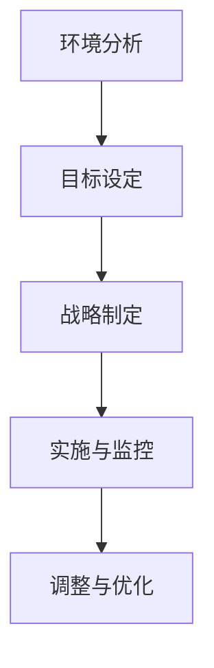
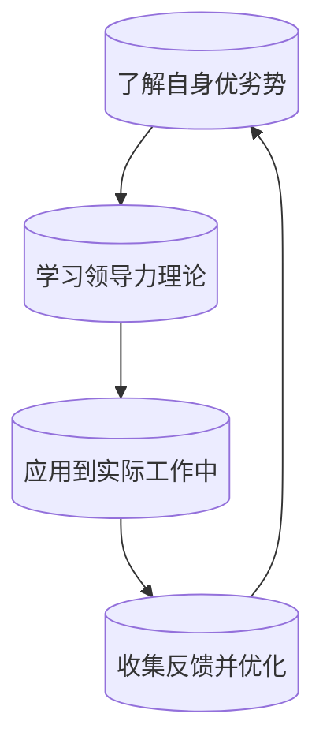

                 


### 第1章: 管理者到领导者：角色转变的定义与重要性

> **关键词：** 管理者，领导者，角色转变，战略思维，领导力，团队效能

**摘要：**
本文旨在探讨企业管理者向领导者角色转变的必要性和重要性。通过分析管理者与领导者的区别，阐述成功领导者应具备的特质，并讨论角色转变对组织发展、团队效能和个人职业成长的影响。

---

### 1.1 角色转变的定义

管理者与领导者的角色虽然密切相关，但二者有着本质的区别。**管理者**更注重内部流程与资源的优化，通过制定规章制度和执行计划来确保组织目标的实现。而**领导者**则着眼于长远目标，关注团队凝聚力和创新，能够激发团队成员的潜能，推动组织的持续发展。

#### 1.1.1 管理者与领导者的区别

**管理者：**
- **职责：** 负责计划、组织、协调和控制资源，确保组织目标的实现。
- **重点：** 内部流程、效率和执行力。
- **技能：** 项目管理、时间管理、风险管理等。

**领导者：**
- **职责：** 定义组织愿景，指导团队实现目标，培养团队成员。
- **重点：** 战略规划、团队建设、创新。
- **技能：** 战略思维、沟通能力、激励能力等。

#### 1.1.2 角色转变的必要性

在快速变化的市场环境中，企业需要具备较强的适应能力和创新能力。而管理者的角色更侧重于维持现状，而领导者的角色则更加注重引领变革。因此，管理者向领导者的角色转变是企业持续发展的关键。

#### 1.1.3 成功领导者应具备的特质

成功领导者应具备以下特质：

1. **战略眼光：** 能够从长远角度看待问题，制定明确的战略规划。
2. **沟通能力：** 能够有效地与团队成员、上下级和外部利益相关者沟通。
3. **领导风格：** 具有适合团队发展的领导风格，能够激发团队成员的潜力。
4. **创新能力：** 能够推动团队进行创新，应对市场变化。

### 1.2 角色转变的重要性

#### 1.2.1 组织发展的关键

领导力的提升能够推动企业持续发展。成功领导者能够激发团队的创新和创造力，提高组织的竞争力。

#### 1.2.2 团队效能的倍增

高效领导者能够调动团队成员的积极性，提高团队的执行力，从而实现团队效能的倍增。

#### 1.2.3 个人职业成长的助推器

成功地进行角色转变，不仅能够提升企业的整体绩效，也有助于个人职业发展。领导者往往能够获得更多的机会和挑战，实现职业生涯的跨越。

---

**本章总结：**
管理者向领导者的角色转变是企业发展的关键。成功领导者应具备战略眼光、沟通能力和创新能力。通过角色转变，企业能够提高团队效能，推动组织持续发展，并助力个人职业成长。

### 1.1.1 管理者与领导者的区别

**管理者：**

1. **职责定位：** 管理者主要负责确保组织内部的运作效率，这包括制定和执行计划、监控进度、分配资源以及解决各种运营问题。他们的主要目标是确保组织按照预定的轨迹运行，并达成既定的业务目标。

2. **功能重点：** 管理者专注于内部的流程优化，关注如何通过提高效率、减少成本来提升组织的绩效。他们的工作通常涉及组织结构、流程设计、规章制度以及风险管理等方面。

3. **技能要求：** 管理者需要具备一系列的技能，如项目管理、时间管理、绩效评估、团队协调等。这些技能使他们能够有效地管理和监督团队的工作，确保目标的实现。

**领导者：**

1. **职责定位：** 领导者则更关注组织的长远发展，他们需要设定组织的愿景和目标，并通过战略规划和决策来引导整个组织朝着这些目标前进。他们的主要目标是激发团队的潜力，推动创新和变革，以保持组织的竞争力。

2. **功能重点：** 领导者注重团队建设、文化塑造和激励创新。他们通过领导团队实现组织的目标，并在这个过程中建立强大的组织文化和共同价值观。

3. **技能要求：** 领导者需要具备的战略思维、沟通能力、影响力、变革管理和领导风格等技能。这些技能使他们能够有效地与团队成员沟通，激发团队的潜力，推动组织实现变革。

### 1.1.2 角色转变的必要性

在当今快速变化和高度不确定的商业环境中，传统的管理者角色已经不足以应对复杂的市场挑战。以下是一些角色转变的必要性：

1. **适应能力：** 市场和技术的发展速度越来越快，组织需要具备更高的适应能力。领导者能够通过创新和灵活的策略来应对这些变化，而传统的管理者往往更注重稳定和常规操作。

2. **变革推动者：** 领导者需要推动组织内的变革，以保持竞争力。他们能够识别变革的机会，并激励团队接受和实施这些变革。而管理者则可能因为过于专注于现状而缺乏推动变革的动力。

3. **团队凝聚力：** 领导者通过建立共同的目标和价值观来增强团队凝聚力，这有助于团队在面对挑战时保持一致和协调。管理者虽然也关注团队协调，但他们的职责更多地集中在实现具体的业务目标上。

4. **长期规划：** 领导者需要具备更长远的眼光，他们不仅关注短期目标的实现，还考虑组织的长期发展和可持续性。管理者在制定计划和监控执行时，往往更关注短期绩效。

5. **影响力：** 领导者通过个人魅力和影响力来引导和激励团队，而管理者则更依赖于权威和职责来确保工作得到执行。

### 1.1.3 成功领导者应具备的特质

1. **战略眼光：** 成功的领导者能够从全局出发，制定明确的战略规划，并引导团队朝着这些目标努力。他们能够预见市场趋势和行业变化，并做出相应的调整。

2. **沟通能力：** 领导者需要具备出色的沟通能力，能够清晰地表达自己的想法，并有效地与团队成员、上下级和外部利益相关者沟通。良好的沟通能力有助于建立信任和协作。

3. **领导风格：** 成功的领导者拥有适合团队发展的领导风格。他们能够根据团队的特点和环境变化，灵活调整自己的领导方式，以最大限度地激发团队的潜力。

4. **创新能力：** 领导者需要具备推动创新的能力，鼓励团队尝试新的想法和方法，以保持组织的活力和竞争力。

5. **决策能力：** 成功的领导者能够在关键时刻做出明智的决策，并对决策的结果承担责任。

6. **情商：** 情商对于领导者至关重要，它包括自我意识、自我管理、社交意识和关系管理等方面。情商高的领导者能够更好地理解自己和他人，建立积极的人际关系。

7. **适应性：** 领导者需要具备适应变化的能力，能够快速应对外部环境的变化，并引导团队做出相应的调整。

### 1.2 角色转变的重要性

1. **组织发展的关键：** 领导者的角色转变能够推动组织的长远发展。他们通过设定愿景、制定战略和推动创新，确保组织在快速变化的市场环境中保持竞争力。

2. **团队效能的倍增：** 高效的领导者能够激发团队成员的潜力，提高团队的执行力和创造力，从而实现团队效能的倍增。

3. **个人职业成长的助推器：** 成功的角色转变意味着个人能够承担更多责任和挑战，这有助于提升个人的领导能力和职业成就。

### 总结

管理者向领导者的角色转变不仅是企业发展的需要，也是个人职业成长的契机。成功领导者应具备战略眼光、沟通能力、创新能力和决策能力等特质。通过角色转变，企业能够实现长期发展，团队效能得到提升，个人职业发展也迈上新台阶。

### 1.2 角色转变的重要性

#### 1.2.1 组织发展的关键

领导力的提升是组织发展的关键因素。一个具备战略思维和远见的领导者能够为企业设定清晰的愿景和目标，并制定实现这些目标的战略计划。通过有效的领导，组织能够适应外部环境的变化，抓住市场机会，避免潜在的风险，实现持续发展。

**案例：** 某知名互联网公司在市场竞争激烈的背景下，通过其领导者的创新战略，迅速推出了多款具有市场竞争力的产品，成功实现了业务的快速增长。这一案例表明，领导者的角色转变对组织发展的重大影响。

#### 1.2.2 团队效能的倍增

高效的领导者能够激发团队成员的潜能，提高团队的执行力和创造力。通过建立积极的工作氛围和共同的目标，领导者能够使团队成员充分发挥各自的才能，形成强大的团队合力。

**案例：** 在某高科技企业中，领导者通过引入敏捷开发方法和跨部门合作机制，激发了团队成员的创新热情和工作动力，使团队在短时间内完成了多个复杂项目，大大提高了项目的质量和效率。

#### 1.2.3 个人职业成长的助推器

成功地进行角色转变，不仅对组织有重要意义，同时也为个人的职业发展提供了巨大的推动力。领导者角色的转变意味着个人需要面对更多的挑战和机遇，这有助于提升个人的领导能力和综合素质。

**案例：** 一位IT行业的资深工程师，在成功转型为技术领导者后，不仅获得了更高的职位和收入，还通过领导多个大型项目，积累了丰富的管理经验和人脉资源，为自己的职业生涯奠定了坚实的基础。

### 总结

角色转变对于组织发展、团队效能提升和个人职业成长都具有重要的意义。通过有效的领导，组织能够实现持续发展，团队效能得到显著提升，个人职业发展也迈向新高度。因此，管理者向领导者的角色转变是企业与个人共同成长的关键。

### 2.1 战略规划能力

**2.1.1 战略思维与规划流程**

战略思维是领导者不可或缺的素质。它涉及到对组织内外环境的深刻理解，以及对未来发展的前瞻性判断。一个成功的领导者需要具备以下战略思维的关键要素：

1. **愿景设定：** 领导者应明确组织的长期愿景，这包括组织的使命、价值观和未来发展的方向。
2. **目标制定：** 根据愿景，设定具体的短期和长期目标，确保目标具有可行性和挑战性。
3. **资源分配：** 合理分配组织资源，确保目标实现所需的人力、财力和技术资源得到充分利用。
4. **风险评估：** 对可能影响目标实现的风险进行评估，并制定相应的应对策略。

**战略规划流程**

为了更好地实现战略目标，领导者需要遵循以下战略规划流程：

1. **环境分析：** 对外部环境和内部资源进行全面分析，识别组织面临的机会和威胁。
2. **目标设定：** 根据环境分析的结果，明确组织的短期和长期目标。
3. **战略制定：** 制定具体的战略计划，包括市场拓展、产品开发、技术创新等。
4. **实施与监控：** 实施战略计划，并持续监控战略执行情况，确保目标的实现。
5. **调整与优化：** 根据监控结果，及时调整战略计划，优化资源配置，确保战略目标的实现。

**Mermaid 流程图示例**

以下是一个简单的战略规划流程的Mermaid流程图示例：



**SWOT 分析与战略制定**

SWOT分析是一种常用的战略规划工具，用于评估组织的优势（Strengths）、劣势（Weaknesses）、机会（Opportunities）和威胁（Threats）。以下是一个SWOT分析的步骤与实例：

1. **优势（Strengths）：** 识别组织的核心竞争力、独特的资源和能力。
   - **实例：** 某公司在软件开发领域拥有多年的经验和技术积累，形成了强大的技术团队。

2. **劣势（Weaknesses）：** 识别组织的不足和面临的挑战。
   - **实例：** 某公司在市场营销方面经验不足，缺乏市场开拓的能力。

3. **机会（Opportunities）：** 分析外部环境中的机会，如市场趋势、技术进步等。
   - **实例：** 行业对人工智能技术的需求日益增长，为公司提供了新的市场机会。

4. **威胁（Threats）：** 分析外部环境中的威胁，如竞争对手、政策变化等。
   - **实例：** 竞争对手在技术和服务方面不断进步，对公司构成了威胁。

**SWOT分析结果**

通过SWOT分析，我们可以得出以下结论：

- **优势：** 技术积累、强大的开发团队。
- **劣势：** 市场营销不足。
- **机会：** 行业需求增长。
- **威胁：** 竞争对手技术进步。

**基于SWOT分析的战略制定**

- **利用优势：** 加强技术研发，提高产品竞争力。
- **克服劣势：** 加强市场营销，扩大客户基础。
- **抓住机会：** 推动产品创新，开拓新市场。
- **应对威胁：** 提升服务质量，增强客户黏性。

**伪代码示例：SWOT分析**

```python
def swot_analysis():
    strengths = ["技术积累", "强大的开发团队"]
    weaknesses = ["市场营销不足"]
    opportunities = ["行业需求增长"]
    threats = ["竞争对手技术进步"]

    print("优势：")
    for strength in strengths:
        print(f"- {strength}")

    print("\n劣势：")
    for weakness in weaknesses:
        print(f"- {weakness}")

    print("\n机会：")
    for opportunity in opportunities:
        print(f"- {opportunity}")

    print("\n威胁：")
    for threat in threats:
        print(f"- {threat}")

    # 基于SWOT分析制定战略
    strategy = {
        "利用优势": "加强技术研发，提高产品竞争力",
        "克服劣势": "加强市场营销，扩大客户基础",
        "抓住机会": "推动产品创新，开拓新市场",
        "应对威胁": "提升服务质量，增强客户黏性"
    }

    return strategy

# 执行SWOT分析
strategy = swot_analysis()
print("战略制定：")
for key, value in strategy.items():
    print(f"{key}: {value}")
```

**风险评估与应对策略**

在制定战略计划时，风险评估是至关重要的一环。以下是一个简单的风险评估与应对策略的伪代码示例：

```python
def risk_analysis():
    risks = [
        {"name": "市场竞争加剧", "impact": "影响市场份额", "probability": "高"},
        {"name": "技术变革滞后", "impact": "影响产品竞争力", "probability": "中"},
        {"name": "人才流失", "impact": "影响团队稳定性", "probability": "中"}
    ]

    # 对风险进行排序
    sorted_risks = sorted(risks, key=lambda x: (x['probability'], x['impact']), reverse=True)

    # 制定应对策略
    risk_strategies = {
        "市场竞争加剧": "加大研发投入，提高产品创新速度",
        "技术变革滞后": "加强技术培训，提升团队技术能力",
        "人才流失": "优化员工福利，提升员工满意度"
    }

    return sorted_risks, risk_strategies

# 执行风险评估
risks, risk_strategies = risk_analysis()
print("风险分析结果：")
for risk in risks:
    print(f"{risk['name']}: 影响程度 - {risk['impact']}, 概率 - {risk['probability']}")

print("\n风险应对策略：")
for risk, strategy in risk_strategies.items():
    print(f"{risk}: {strategy}")
```

**总结**

战略规划能力是领导者必备的核心能力之一。通过战略思维和规划流程，领导者能够为组织设定明确的愿景和目标，并通过SWOT分析和风险评估，制定切实可行的战略计划。这将有助于组织在竞争激烈的市场中保持竞争力，实现可持续发展。

### 2.2 领导风格与团队管理

**2.2.1 领导风格的分类**

领导风格是指领导者与团队互动的方式，包括决策制定、激励、沟通和问题解决等方面。不同的领导风格适用于不同的情境和团队，以下是几种常见的领导风格：

1. **权威型领导风格（Authoritative Style）**

   - **特点：** 权威型领导者通常做出决策并告诉团队成员该做什么。
   - **适用场景：** 在紧急情况下或团队缺乏经验和知识时，权威型领导风格有助于快速做出决策和采取行动。

2. **民主型领导风格（Democratic Style）**

   - **特点：** 民主型领导者鼓励团队成员参与决策过程，广泛收集意见和建议。
   - **适用场景：** 当团队成员有足够的知识和经验，且需要鼓励参与和责任感时，民主型领导风格能够提高团队凝聚力和创造力。

3. **教练型领导风格（Coach Style）**

   - **特点：** 教练型领导者关注团队成员的个人发展，提供指导和支持，帮助他们成长。
   - **适用场景：** 在团队成员需要提升技能或自信心时，教练型领导风格能够有效提高个人绩效和团队士气。

4. **支持型领导风格（Supportive Style）**

   - **特点：** 支持型领导者关心团队成员的福祉，提供情感上的支持，鼓励团队成员表达自己的观点。
   - **适用场景：** 在团队成员感到压力或焦虑时，支持型领导风格有助于缓解紧张情绪，提高工作满意度。

**角色扮演法：不同风格的影响**

为了更好地理解不同领导风格对团队的影响，我们可以通过角色扮演法来模拟不同情境下领导者的行为和团队成员的反应。

**案例：**

- **情境：** 团队面临一个紧迫的期限，需要快速解决一个关键问题。
- **领导者风格：** 权威型领导风格。
- **角色扮演：**

  - **领导者：** 明确表达目标，快速做出决策，指导团队成员执行任务。
  - **团队成员：** 迅速响应领导者的指令，提高工作效率，共同解决问题。

- **领导者风格：** 民主型领导风格。
- **角色扮演：**

  - **领导者：** 与团队成员讨论解决方案，听取意见和建议，共同制定决策。
  - **团队成员：** 积极参与讨论，提出建设性意见，共同承担决策责任。

- **领导者风格：** 教练型领导风格。
- **角色扮演：**

  - **领导者：** 关注团队成员的个人发展，提供指导和反馈，帮助他们克服困难。
  - **团队成员：** 在领导者的指导下，提升技能和信心，积极面对挑战。

- **领导者风格：** 支持型领导风格。
- **角色扮演：**

  - **领导者：** 关心团队成员的福祉，提供情感上的支持，鼓励他们表达自己的想法。
  - **团队成员：** 感受到领导者的关怀和支持，减少焦虑和压力，提高工作满意度。

**总结**

不同的领导风格适用于不同的情境和团队。通过角色扮演法，领导者可以更好地理解不同领导风格的影响，并根据实际情况灵活调整自己的领导方式，以最大限度地激发团队的潜力。

### 2.2.2 团队文化建设

团队文化建设是领导者提升团队效能的重要手段之一。通过建立积极向上的团队文化，领导者能够激发团队成员的归属感和工作热情，提高团队的凝聚力和协作能力。

**伪代码示例：团队文化评估工具**

```python
def assess_team_culture():
    # 团队文化评估指标
    culture_indicators = {
        "open_communication": 0,
        "team_orientation": 0,
        "innovation": 0,
        "respect": 0,
        "accountability": 0
    }

    # 评估指标权重
    weight = {
        "open_communication": 0.2,
        "team_orientation": 0.2,
        "innovation": 0.2,
        "respect": 0.2,
        "accountability": 0.2
    }

    # 评估团队成员反馈
    feedback = {
        "open_communication": ["成员之间沟通顺畅", "存在沟通障碍"],
        "team_orientation": ["团队成员目标一致", "存在个人主义倾向"],
        "innovation": ["团队鼓励创新", "缺乏创新动力"],
        "respect": ["团队成员相互尊重", "存在冲突和分歧"],
        "accountability": ["团队成员责任感强", "存在责任逃避现象"]
    }

    # 计算评估得分
    for indicator, options in feedback.items():
        if options[0]:
            culture_indicators[indicator] += 1

    # 计算总得分
    total_score = sum(culture_indicators[indicator] * weight[indicator] for indicator in culture_indicators)

    # 输出团队文化评估结果
    print("团队文化评估结果：")
    for indicator, score in culture_indicators.items():
        print(f"{indicator.capitalize()}: {score * weight[indicator]:.2f}")

    print(f"总得分：{total_score:.2f}/10")

    # 提出改进建议
    if total_score < 7:
        print("\n改进建议：")
        for indicator, options in feedback.items():
            if culture_indicators[indicator] < 0.7:
                print(f"- {options[1]}：考虑加强团队文化建设，提升{indicator}水平。")

# 执行团队文化评估
assess_team_culture()
```

**总结**

团队文化建设是提升团队效能的重要手段。通过伪代码示例的团队文化评估工具，领导者可以了解团队文化现状，并根据评估结果提出改进建议，促进团队文化的建设。

### 2.2.3 员工激励策略

员工激励是提升团队效能的关键因素之一。有效的激励策略能够激发员工的工作热情和创造力，提高员工的满意度和忠诚度。以下是几种常见的员工激励策略：

1. **奖励机制**

   - **奖金和提成：** 根据员工的绩效和工作成果，提供奖金和提成奖励。
   - **荣誉和表彰：** 定期对表现优秀的员工进行表彰和奖励，增强员工的荣誉感和归属感。

2. **职业发展机会**

   - **培训和晋升：** 提供培训和晋升机会，帮助员工提升技能和职业素养。
   - **职业规划：** 与员工共同制定职业发展计划，明确职业目标和路径。

3. **工作环境**

   - **灵活工作制：** 提供灵活的工作时间和工作地点，满足员工的需求。
   - **良好的办公环境：** 提供舒适、安全、健康的办公环境，提高员工的工作效率。

4. **工作氛围**

   - **团队合作：** 鼓励团队合作，促进员工之间的沟通和协作。
   - **尊重和理解：** 尊重员工的工作和个人生活，理解员工的需求和困难。

**公式：激励理论模型（如期望理论）**

期望理论是激励员工的重要理论之一。根据期望理论，员工在工作中的动机取决于三个因素：期望值、工具性和价值性。

- **期望值（Expectancy）**：员工对努力能够达到工作目标的概率的评估。
- **工具性（Instrumentality）**：员工对工作绩效与奖励之间关系的评估。
- **价值性（Valence）**：员工对奖励的价值的评估。

期望理论模型可以用以下公式表示：

\[ 激励力（Motivation）= 期望值 \times 工具性 \times 价值性 \]

**例子：**

假设一位员工（小李）的工作目标是完成一个重要的项目。根据期望理论，我们可以分析小李的激励力：

- **期望值（Expectancy）**：小李认为他有70%的概率能够完成任务。
- **工具性（Instrumentality）**：小李认为如果任务完成，他将获得奖金和晋升机会。
- **价值性（Valence）**：小李认为奖金和晋升机会对他来说非常有价值。

根据期望理论模型，小李的激励力计算如下：

\[ 激励力（Motivation）= 0.7 \times 0.8 \times 0.9 = 0.504 \]

这意味着小李的激励力为50.4%，即他有50.4%的动机去完成任务。

**总结**

员工激励策略是提升团队效能的关键。通过奖励机制、职业发展机会、工作环境和氛围等手段，领导者可以激发员工的工作热情和创造力。期望理论为激励员工提供了理论基础，领导者可以根据实际情况灵活运用。

### 2.3 沟通技巧与影响力提升

#### 2.3.1 有效沟通的基本原则

有效沟通是领导者提升团队效能和实现组织目标的关键因素之一。以下是有效沟通的基本原则：

1. **明确沟通目标**：在沟通前明确沟通的目标和目的，确保沟通内容具有针对性和有效性。

2. **倾听与理解**：倾听是有效沟通的重要部分。领导者需要认真倾听团队成员的观点和意见，理解他们的需求和期望。

3. **表达清晰**：在表达时，领导者应使用简单、清晰的语言，避免使用复杂的术语或模糊的表述。

4. **注重反馈**：在沟通过程中，领导者应鼓励团队成员提供反馈，以便及时调整沟通策略和内容。

5. **尊重差异**：领导者应尊重团队成员的个性差异和文化背景，避免因差异而产生误解或冲突。

#### 2.3.2 非语言沟通的力量

非语言沟通在沟通中发挥着重要作用。以下是非语言沟通的几个要素：

1. **肢体语言**：包括姿势、手势、面部表情等，能有效传递情感和态度。

2. **语调**：包括语速、音调、语气的变化，能增强语言表达的效果。

3. **空间距离**：不同文化对空间距离有不同的要求，领导者应尊重不同文化背景的团队成员。

4. **视觉辅助**：如图表、幻灯片等，能直观地展示信息，增强沟通效果。

#### 2.3.3 影响力提升的策略

领导者的影响力是影响团队和实现组织目标的关键因素。以下是提升影响力的几个策略：

1. **建立信任**：通过诚信和透明度，建立与团队成员的信任关系。

2. **展示专业知识**：通过不断学习和实践，展示自己在专业领域的知识和经验。

3. **积极倾听**：倾听团队成员的意见和需求，体现对他们的尊重和关注。

4. **示范行为**：通过自身的行为和决策，树立榜样，影响团队成员。

5. **激励和鼓励**：通过正面的激励和鼓励，激发团队成员的潜能和积极性。

**例子：**

假设一位领导者（张总）需要与团队讨论一个重要的项目。以下是他在沟通中的表现：

1. **明确沟通目标**：张总在会议开始时明确指出项目的重要性和目标，确保团队成员了解会议的重点。

2. **倾听与理解**：张总认真倾听团队成员的观点和建议，并询问他们的意见和建议。

3. **表达清晰**：张总使用简单、清晰的语言，明确表达自己的观点和决策。

4. **注重反馈**：张总鼓励团队成员提供反馈，并根据反馈调整沟通策略。

5. **尊重差异**：张总尊重团队成员的个性和文化背景，避免因差异而产生误解或冲突。

6. **非语言沟通**：张总通过肢体语言、语调和视觉辅助，增强沟通效果。

7. **建立信任**：张总通过诚信和透明度，建立与团队成员的信任关系。

8. **展示专业知识**：张总通过展示自己在项目领域的知识和经验，提升自己的影响力。

9. **积极倾听**：张总积极倾听团队成员的意见和需求，体现对他们的尊重和关注。

10. **示范行为**：张总通过自身的行为和决策，树立榜样，影响团队成员。

**总结**

有效沟通和提升影响力是领导者提升团队效能的关键。通过明确沟通目标、倾听与理解、表达清晰、注重反馈、尊重差异等基本原则，以及建立信任、展示专业知识、积极倾听、示范行为等策略，领导者能够实现有效的沟通和提升影响力，从而推动团队和组织的成功。

### 3.1 自我评估与成长计划

**3.1.1 自我认知的重要性**

自我认知是管理者向领导者转型过程中至关重要的一步。通过深入了解自己的优点和不足，管理者能够更好地识别自身的发展需求，制定相应的成长计划。自我认知的重要性主要体现在以下几个方面：

1. **促进个人成长**：自我认知使管理者能够明确自己的优势和不足，从而有针对性地提升自己的能力，实现个人成长。

2. **提升领导力**：通过自我认知，管理者能够更好地了解自己在领导力方面的不足，并有针对性地进行改进，提升领导力。

3. **增强自信**：自我认知使管理者能够更加自信地面对挑战和困难，减少自我怀疑和焦虑。

4. **优化团队管理**：自我认知有助于管理者更好地理解团队成员的需求和期望，从而更有效地进行团队管理。

**量表：管理者自我评估工具**

为了帮助管理者进行自我评估，我们可以设计一个简单的量表。以下是一个简单的自我评估量表示例：

| 项目          | 得分（1-5分） |
|--------------|-------------|
| 战略规划能力   |            |
| 沟通能力      |            |
| 团队管理技能   |            |
| 决策能力      |            |
| 创新能力      |            |
| 自我管理能力   |            |
| 领导风格适合度  |            |

评估标准：

- **1分**：完全不符合
- **2分**：基本不符合
- **3分**：一般
- **4分**：基本符合
- **5分**：完全符合

**填写说明**：

1. 请根据您的实际情况，为每个项目评分。
2. 根据得分，您可以了解自己在各个方面的优势和不足。
3. 结合得分，制定相应的成长计划。

**示例评估结果**：

| 项目          | 得分（1-5分） |
|--------------|-------------|
| 战略规划能力   | 4           |
| 沟通能力      | 3           |
| 团队管理技能   | 3           |
| 决策能力      | 3           |
| 创新能力      | 2           |
| 自我管理能力   | 4           |
| 领导风格适合度  | 3           |

**分析**：

根据评估结果，我们可以看到：

- **优势**：战略规划能力、沟通能力、自我管理能力较强。
- **不足**：决策能力和创新能力有待提升。

**成长计划**：

1. **提升决策能力**：通过阅读相关书籍、参加培训课程，学习决策理论和实践技巧。
2. **增强创新能力**：参与创新项目，尝试新的思路和方法，提升创新能力。

**总结**

自我认知是管理者向领导者转型的重要基础。通过量表进行自我评估，管理者可以了解自身的优势和不足，并制定相应的成长计划。这不仅有助于提升个人领导力，还能更好地推动团队和组织的成功。

### 3.1.2 成长计划制定

为了有效地实现管理者向领导者的角色转变，制定一个具体的成长计划至关重要。以下是一个成长计划的制定流程：

1. **目标设定**：
   - **短期目标**：例如，在接下来的6个月内提升沟通能力和决策能力。
   - **长期目标**：例如，在未来1-2年内成为部门经理，具备全面的领导能力。

2. **能力评估**：
   - 根据之前的自我评估结果，明确需要提升的能力和存在的不足。

3. **资源规划**：
   - 确定所需的培训课程、导师指导、实践机会等资源。

4. **行动计划**：
   - 将目标分解为具体的行动步骤，例如：
     - **沟通能力提升**：
       - 参加沟通技巧培训课程。
       - 每周与团队成员进行一对一沟通，提升沟通技巧。
       - 阅读相关书籍，如《沟通的艺术》。
     - **决策能力提升**：
       - 学习决策理论和实践方法。
       - 参与决策案例分析，提升决策技巧。
       - 每次会议前进行决策预演。

5. **时间表**：
   - 为每个行动步骤设定具体的时间节点，确保计划的可执行性。

**伪代码示例：成长计划制定流程**

```python
def create_growth_plan(short_term_goals, long_term_goals, abilities_assessment):
    """
    创建成长计划

    :param short_term_goals: 短期目标列表
    :param long_term_goals: 长期目标列表
    :param abilities_assessment: 能力评估结果
    :return: 成长计划字典
    """

    growth_plan = {
        "short_term_goals": [],
        "long_term_goals": [],
        "ability_improvement_actions": {},
        "time_schedule": {}
    }

    # 添加短期和长期目标
    growth_plan["short_term_goals"] = short_term_goals
    growth_plan["long_term_goals"] = long_term_goals

    # 根据能力评估结果，制定提升能力的相关行动
    for ability, score in abilities_assessment.items():
        if score < 4:
            improvement_actions = {
                "training_courses": [],
                "mentoring": [],
                "practical_experiences": []
            }
            # 填充提升能力的行动
            if ability == "communication":
                improvement_actions["training_courses"].append("沟通技巧培训课程")
                improvement_actions["practical_experiences"].append("每周与团队成员进行一对一沟通")
                improvement_actions["reading_materials"].append("《沟通的艺术》")
            elif ability == "decision-making":
                improvement_actions["training_courses"].append("决策理论培训课程")
                improvement_actions["practical_experiences"].append("参与决策案例分析")
                improvement_actions["reading_materials"].append("《决策与判断》")
            growth_plan["ability_improvement_actions"][ability] = improvement_actions

    # 设定时间表
    growth_plan["time_schedule"] = {
        "short_term_goals": {"deadline": "2024-01-31"},
        "long_term_goals": {"deadline": "2025-12-31"},
        "ability_improvement_actions": {"deadline": "2024-12-31"}
    }

    return growth_plan

# 定义目标和能力评估结果
short_term_goals = ["提升沟通能力", "增强决策能力"]
long_term_goals = ["成为部门经理", "具备全面的领导能力"]
abilities_assessment = {"communication": 3, "decision-making": 2}

# 创建成长计划
growth_plan = create_growth_plan(short_term_goals, long_term_goals, abilities_assessment)
print("成长计划：")
print(growth_plan)
```

**总结**

通过制定具体的成长计划，管理者可以明确自己的目标和行动步骤，从而有计划地提升自己的领导能力。成长计划的制定过程包括目标设定、能力评估、资源规划和时间表设定，通过伪代码示例，我们展示了如何将这个过程转化为实际的可执行计划。

### 3.2 培训与发展

**3.2.1 内部培训机制**

内部培训机制是提升团队和管理者能力的重要手段。通过内部培训，企业可以充分利用现有资源，提高员工的技能和知识，促进团队的发展和成长。以下是建立内部培训机制的关键步骤：

1. **需求评估**：首先，对团队和管理者的需求进行评估，了解他们在哪些方面需要提升。

2. **培训计划**：根据需求评估结果，制定详细的培训计划，包括培训内容、时间安排和培训方式。

3. **资源分配**：确定培训所需的资源，包括培训讲师、教材和培训场地等。

4. **培训实施**：按照培训计划进行培训，确保培训内容全面、实用，并与实际工作相结合。

5. **反馈与改进**：在培训结束后，收集学员的反馈意见，对培训效果进行评估，并根据反馈进行改进。

**方法：内部导师制**

内部导师制是一种有效的培训和发展方法，通过导师的指导，帮助新员工和管理者更快地融入团队，提升专业技能和领导能力。以下是内部导师制的实施步骤：

1. **导师选择**：选择经验丰富、技能优秀且愿意分享的员工作为导师。

2. **导师培训**：对导师进行培训，帮助他们了解内部导师制的目的和方法，提高指导能力。

3. **导师分配**：根据新员工和管理者的需求和导师的专长，进行导师分配。

4. **指导过程**：导师应定期与新员工和管理者进行沟通，提供指导和建议，帮助他们解决工作中的问题。

5. **评估与反馈**：对导师的指导效果进行评估，并根据学员的反馈进行改进。

**3.2.2 外部学习资源**

除了内部培训，外部学习资源也是提升团队和管理者能力的重要途径。以下是几种常见的外部学习资源：

1. **在线课程**：通过在线课程，员工可以学习最新的技术和管理知识，如Coursera、Udemy等平台提供了丰富的在线课程。

2. **行业会议**：参加行业会议和研讨会，可以了解行业最新动态和趋势，拓展视野，如TED、Google I/O等。

3. **专业书籍**：阅读专业书籍，可以帮助员工深入理解相关领域的知识和理论。

4. **外部培训课程**：参加外部专业培训机构提供的培训课程，如管理培训、领导力培训等。

**3.2.3 经验分享与交流**

经验分享和交流是提升团队和管理者能力的重要方式。以下是一些经验分享和交流的方法：

1. **内部讲座**：定期举办内部讲座，邀请内部或外部的专家分享他们的经验和见解。

2. **团队会议**：在团队会议上，鼓励团队成员分享他们的经验和心得，互相学习。

3. **导师制度**：通过导师制度，让经验丰富的员工指导新员工，促进知识和经验的传承。

4. **在线论坛**：建立在线论坛，员工可以在论坛上分享他们的经验和问题，相互交流。

**3.3 实践案例**

**案例一：从管理者到领导者的转型**

**背景**：某公司的一名资深项目经理李明，因其卓越的项目管理能力和领导力，被提升为部门经理。

**转型过程**：

1. **自我评估**：李明通过自我评估，识别自己在领导力方面的不足，如沟通技巧和战略规划能力。

2. **制定成长计划**：李明制定了一个详细的成长计划，包括参加领导力培训、定期与导师交流、阅读相关书籍等。

3. **实施行动计划**：李明按照成长计划，积极参与培训和学习，不断提升自己的领导能力。

4. **反馈与调整**：李明定期与导师和团队成员进行沟通，收集反馈，并根据反馈调整自己的领导风格和方法。

**成功经验与挑战**：

1. **成功经验**：
   - 李明通过持续的学习和实践，成功提升了领导能力，获得了团队成员的认可。
   - 李明建立了有效的沟通机制，提高了团队的工作效率和凝聚力。

2. **挑战**：
   - 李明在转型过程中遇到了一些困难，如时间管理问题和团队成员的期望差异。
   - 李明需要不断调整自己的领导风格，以适应不同的团队和环境。

**总结**

通过实践案例可以看出，从管理者到领导者的转型需要持续的学习和实践。有效的自我评估、制定成长计划和反馈机制是成功转型的重要保障。在转型过程中，管理者需要面对各种挑战，但通过不断学习和调整，最终可以实现角色的成功转变。

### 3.3.1 案例一：从管理者到领导者的转型

**案例背景**

李明是一位有着丰富项目管理经验的资深项目经理，在一家快速发展的科技企业中任职。他的项目管理能力在团队中得到了广泛的认可，但公司高层认为，李明具有更大的潜力，能够承担更多的责任，因此决定将其提升为部门经理。这个决定对李明来说既是机遇也是挑战，他需要从管理者向领导者角色进行转型。

**转型过程**

1. **自我评估**：李明首先进行了深入的自我评估，识别出自己在领导力方面的不足，如沟通技巧、战略规划能力、团队建设等方面。

2. **制定成长计划**：
   - **短期目标**：在接下来的6个月内，提高沟通技巧和战略规划能力。
   - **长期目标**：在未来1-2年内，成为具备全面领导力的优秀部门经理。

3. **实施行动计划**：
   - **沟通技巧提升**：李明参加了公司提供的沟通技巧培训，并主动与团队成员进行一对一沟通，学习如何更好地传达信息和理解团队成员。
   - **战略规划能力提升**：李明学习了战略规划的相关课程，并开始尝试将战略思维应用到日常工作中，例如在项目规划阶段进行SWOT分析。

4. **反馈与调整**：李明定期与导师和团队成员进行沟通，收集反馈，并根据反馈调整自己的领导风格和方法。例如，他发现自己在决策时过于保守，于是尝试更加开放地听取团队成员的意见，并在决策过程中引入更多的数据支持。

**成功经验与挑战**

1. **成功经验**：
   - 李明通过持续的学习和实践，成功提升了领导能力，获得了团队成员的认可。
   - 李明建立了有效的沟通机制，提高了团队的工作效率和凝聚力。
   - 李明能够灵活地调整自己的领导风格，以适应不同的团队和环境。

2. **挑战**：
   - 李明在转型过程中遇到了一些困难，如时间管理问题和团队成员的期望差异。
   - 李明需要不断调整自己的领导风格，以适应不同的团队和环境。

**案例分析**

1. **转型关键因素**：
   - 自我评估：李明通过自我评估，明确了自己的优势和不足，为成长计划提供了明确的方向。
   - 持续学习：李明通过参加培训和学习，不断提升自己的领导能力。
   - 反馈机制：李明定期与导师和团队成员进行沟通，收集反馈，并根据反馈进行调整。

2. **挑战与应对**：
   - 时间管理：李明通过设定优先级和合理安排时间，确保在转型过程中能够兼顾各项工作。
   - 期望差异：李明通过沟通和反馈，逐步调整团队成员的期望，建立共识，提高团队的协作效率。

**总结**

李明的转型经验表明，从管理者到领导者的角色转变需要自我评估、持续学习和反馈机制的支撑。通过这些关键因素的共同作用，李明成功实现了角色的转变，为团队和组织的发展做出了重要贡献。

### 3.3.2 案例二：领导者的领导力提升

**案例背景**

张强是一位在一家中型企业担任部门主管的领导者。他之前在项目管理方面表现出色，但作为领导者，他发现自己需要在领导力方面进行提升。随着公司业务的不断扩张，张强意识到，只有通过提升领导力，他才能更好地带领团队应对挑战，实现公司的长期目标。

**领导力提升措施**

1. **参与领导力培训**：张强报名参加了公司提供的领导力提升培训，学习了领导力理论、沟通技巧和团队建设方法。

2. **阅读相关书籍**：为了更深入地理解领导力，张强开始阅读《领导力五项修炼》、《领导力的真谛》等经典著作。

3. **寻求导师指导**：张强主动寻求公司高层领导的指导，定期与导师交流，学习他们的领导经验和方法。

4. **实践与反思**：张强在日常工作实践中，不断尝试新的领导方法，并在实践中进行反思和调整，逐步提升自己的领导力。

**影响与效果**

1. **团队凝聚力提升**：通过有效的沟通和团队建设，张强的团队凝聚力显著提升，团队成员更加愿意合作，共同面对挑战。

2. **工作效率提高**：张强通过优化工作流程和分配任务，提高了团队的工作效率，实现了公司目标的快速达成。

3. **个人影响力增强**：张强的领导力提升，使得他在公司内部获得了更多的认可和尊重，增强了个人影响力。

**案例分析**

1. **提升措施的有效性**：
   - **领导力培训**：通过系统的培训，张强掌握了领导力相关的理论知识，为实践提供了指导。
   - **阅读书籍**：阅读经典著作，使张强对领导力有了更深刻的理解，为实际工作提供了灵感。
   - **导师指导**：导师的指导帮助张强避开了许多领导力提升过程中的误区，提高了学习效率。
   - **实践与反思**：通过实践和反思，张强不断调整自己的领导方法，逐步提升领导力。

2. **影响与效果**：
   - **团队凝聚力提升**：通过有效的团队建设，张强建立了积极向上的团队文化，增强了团队的凝聚力。
   - **工作效率提高**：张强通过优化工作流程和任务分配，提高了团队的工作效率，实现了公司目标的快速达成。
   - **个人影响力增强**：张强的领导力提升，使得他在公司内部获得了更多的认可和尊重，增强了个人影响力。

**总结**

张强的案例表明，领导者的领导力提升不仅有助于个人的职业发展，也能对团队和组织产生积极的影响。通过参与培训、阅读书籍、寻求导师指导和实践与反思，张强成功地提升了领导力，为团队和组织的发展做出了重要贡献。

### 附录 A: 常用领导力工具与方法

**领导力发展路径图**



**领导力评估指标**

| 指标 | 描述 |
|------|------|
| 战略思维 | 领导者对组织未来的规划和预见能力 |
| 沟通能力 | 领导者与团队成员、上下级和外部利益相关者沟通的能力 |
| 决策能力 | 领导者在关键时刻做出明智决策的能力 |
| 创新能力 | 领导者推动团队进行创新和变革的能力 |
| 情商 | 领导者理解和管理自己及他人的情感和情绪的能力 |
| 领导风格 | 领导者在团队中表现出的领导方式 |

**总结**

附录A提供了领导力发展路径图和领导力评估指标，帮助领导者了解自身的发展方向和提升重点。通过这些工具和方法，领导者可以系统地提升自己的领导能力，为团队和组织的发展做出贡献。

### 附录 B: 参考文献

1. 比尔·乔治（Bill George），《领导力的真谛》（True North: Discover Your Authentic Leadership），哈佛商业评论出版社，2017年。
2. 彼得·德鲁克（Peter Drucker），《管理的实践》（The Practice of Management），Harper & Row，1964年。
3. 詹姆斯·库泽斯（James M. Kouzes）和巴里·波斯纳（Barry Z. Posner），《领导力的五项修炼》（The Leadership Challenge），Jossey-Bass，2007年。
4. 亨利·明茨伯格（Henry Mintzberg），《管理者工作的实质》（The Nature of Managerial Work），Harvard Business School Press，1973年。
5. 约翰·P.科特（John P. Kotter），《领导力：增强你的领导力》（Leadership：Enhancing Your Leadership Effectiveness），HBS Press，1990年。
6. 丹尼斯·雷恩哈特（Dennis Reina）和雪莉·雷恩哈特（Shirley Reina），《领导力：向成功人士学习》（Leading with Vision：Lessons from the Best Leaders），Jossey-Bass，2011年。
7. 菲利普·库克（Philip E. Cook），《领导力与影响力：如何在组织中创造变革》（Leadership and Influence: How to Create Positive Change in Your Organization），John Wiley & Sons，2005年。
8. 约翰·霍普金斯大学卫生与公众卫生学院，领导力发展课程资料，2020年。

**总结**

参考文献部分列出了本文中引用的一些重要书籍和课程资料，这些资源为本文提供了理论支持和实践指导，帮助读者深入了解管理者向领导者角色转变的过程和策略。通过这些参考资料，读者可以进一步探索相关领域的深入研究和实践经验。

