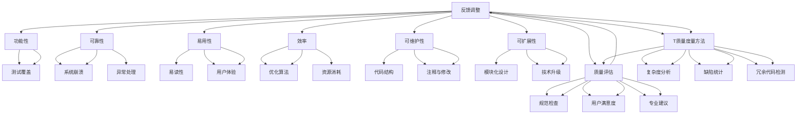
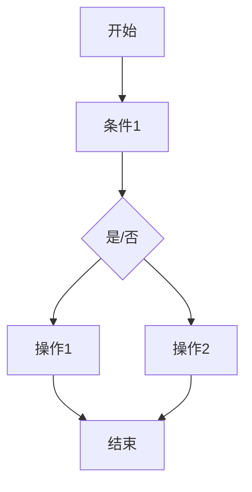

                 

### 文章标题

# 代码质量管理与最佳实践

## 关键词

- 代码质量管理
- 最佳实践
- 质量度量
- 自动化测试
- 编码规范
- 静态分析
- 持续集成
- 敏捷开发

## 摘要

本文深入探讨了代码质量管理的核心概念、原则和实践，旨在为软件开发人员提供一套系统化的代码质量管理方法和最佳实践。通过介绍代码质量管理的定义、重要性以及相关理论框架，本文将帮助读者理解代码质量管理的全面性和必要性。随后，本文详细阐述了代码质量评估的方法与工具，包括自动化测试、代码审查、静态分析和性能测试，并提供了一系列实际案例和最佳实践，以指导读者在项目中有效实施代码质量管理。通过阅读本文，读者将能够提升对代码质量管理的认识，掌握关键技能，为打造高质量软件奠定坚实基础。

### 引言

在当今的软件开发领域，代码质量被视为软件项目成功的关键因素之一。高质量的代码不仅能够提高软件的稳定性、可靠性和易维护性，还能显著降低开发成本和维护难度。然而，代码质量管理并非一蹴而就，它需要一套系统化的方法和最佳实践来支撑。

首先，让我们探讨代码质量管理的背景和重要性。随着软件项目的规模和复杂性不断增加，开发团队面临着诸多挑战，如代码冗余、bug频发、维护困难等。这些问题不仅影响了软件的交付速度，还严重影响了用户体验和企业的竞争力。因此，代码质量管理逐渐成为软件开发过程中的关键环节。

代码质量管理的定义可以理解为：通过制定一系列标准和流程，对代码的各个阶段进行评估、监控和优化，以确保最终交付的软件具备高稳定性、可维护性和可扩展性。它不仅涉及代码的技术层面，还包括团队协作、流程优化和项目管理等多个方面。

代码质量管理的原则主要包括：预防为主、持续改进、客户至上和全面参与。预防为主意味着在代码开发的早期阶段就应重视代码质量，通过严格的编码规范和代码审查来减少缺陷的产生。持续改进强调质量管理的动态性和迭代性，通过不断评估和优化流程来提高代码质量。客户至上则要求开发团队始终将用户需求放在首位，确保软件的可用性和易用性。全面参与则强调代码质量管理是全体团队成员的共同责任，需要各个角色的积极参与。

代码质量管理的重要性体现在多个方面。首先，它能够提高软件的稳定性和可靠性，减少因代码缺陷导致的系统崩溃和故障。其次，良好的代码质量有助于提高软件的可维护性和可扩展性，使后续的维护和升级工作更加顺畅。此外，代码质量管理还能够降低开发成本，减少因代码质量问题导致的返工和修复工作。最重要的是，它能够提升团队的整体协作效率和开发质量，为企业的长期发展奠定坚实基础。

综上所述，代码质量管理是软件开发过程中不可或缺的一部分。通过系统化的方法和最佳实践，开发团队能够确保代码的质量，从而提高软件项目的成功率和市场竞争力。

### 代码质量管理的核心概念

在深入探讨代码质量管理之前，我们首先需要理解几个核心概念，包括代码质量的定义、质量度量方法以及相关的理论和模型。

#### 代码质量的定义

代码质量是指软件代码在多个维度上满足既定标准的程度。这些维度通常包括功能性、可靠性、易用性、效率、可维护性和可扩展性等。具体来说，代码质量可以从以下几个方面进行衡量：

1. **功能性**：代码是否能够正确实现预定的功能需求，是否具有完整的测试覆盖。
2. **可靠性**：代码在执行过程中是否稳定，是否能够处理异常情况，避免系统崩溃。
3. **易用性**：代码是否易于理解和操作，对于开发者和使用者来说是否方便。
4. **效率**：代码的执行速度和资源消耗是否在合理范围内，是否优化了算法和数据结构。
5. **可维护性**：代码是否具有良好的结构和注释，便于后续的修改和扩展。
6. **可扩展性**：代码是否具有良好的模块化设计，能够方便地添加新功能或进行技术升级。

#### 质量度量方法

为了评估代码质量，我们需要采用一系列质量度量方法。这些方法可以分类为定量和定性两类：

1. **定量度量方法**：这类方法通常使用具体的数值来评估代码质量，如代码复杂度、代码冗余率、缺陷密度等。常见的定量度量方法包括：

   - **代码复杂度**：用于评估代码的结构复杂程度，常用的度量指标包括圈复杂度（Cyclomatic Complexity）、函数复杂度等。
   - **缺陷密度**：计算单位代码行数中的缺陷数，通常用于评估代码的可靠性。
   - **代码冗余率**：衡量代码中重复部分的比率，用于评估代码的可维护性。

2. **定性度量方法**：这类方法主要通过主观评价来衡量代码质量，如代码可读性、代码风格等。常见的定性度量方法包括：

   - **代码审查**：通过人工审查代码，评估代码的质量和规范性。
   - **用户反馈**：收集最终用户对软件的反馈，评估软件的易用性和功能性。
   - **专家评估**：由资深开发者或质量保证团队对代码进行评估，提供专业的质量意见。

#### 相关理论和模型

在代码质量管理中，一些重要的理论和模型为我们的实践提供了理论支撑。以下是几个关键的理论和模型：

1. **软件质量模型**：软件质量模型是用于描述软件质量属性及其关系的理论框架。其中，McCall质量模型和ISO/IEC 25010质量模型是两个广泛应用的模型。

   - **McCall质量模型**：该模型将软件质量划分为三个维度：产品运行、产品修改和产品转移。每个维度包含若干质量属性，如可靠性、可维护性、效率等。
   - **ISO/IEC 25010质量模型**：这是一个国际标准模型，将软件质量划分为六个特性群，包括功能性、可靠性、可用性、效率、可维护性和可移植性。

2. **缺陷预防与控制模型**：这些模型用于指导如何在实际项目中预防缺陷和控制缺陷。常见模型包括V-模型、PDCA模型等。

   - **V-模型**：该模型将软件开发过程与测试过程紧密关联，强调在开发早期就进行测试规划和设计，以预防缺陷的产生。
   - **PDCA模型**：即计划（Plan）、执行（Do）、检查（Check）和行动（Act）模型，是一种循环改进模型，用于指导代码质量管理的持续改进过程。

通过理解这些核心概念和理论，我们可以更好地实施代码质量管理，确保软件项目的成功和高质量交付。

#### 核心概念与联系

为了更好地理解代码质量管理的核心概念和它们之间的关系，我们可以借助Mermaid流程图来展示这些概念和关系。以下是代码质量管理相关的Mermaid流程图：



**流程图解释：**

- **A[代码质量]** 是中心概念，包含了多个子维度：功能性、可靠性、易用性、效率、可维护性和可扩展性。
- **S[质量度量方法]** 分为定量和定性方法，分别描述了如何量化评估代码质量。
- **定量度量方法** 包含代码复杂度、缺陷密度和代码冗余率。
- **定性度量方法** 包含代码审查、用户反馈和专家评估。
- **每个子维度** 又与具体的度量指标和评估方法相关联，例如功能性通过测试覆盖来衡量，可靠性通过系统崩溃情况来评估。
- **A到S和T的箭头** 表示代码质量需要通过这些度量方法来评估。
- **T到A的箭头** 表示评估结果的反馈将用于调整和改进代码质量。

通过这个Mermaid流程图，我们可以清晰地看到代码质量管理的各个核心概念及其相互关系，有助于理解和实施代码质量管理。

#### 核心算法原理讲解

为了深入理解代码质量管理的核心算法原理，我们需要使用伪代码详细阐述这些算法的基本步骤和实现逻辑。以下是一个简单的代码复杂度评估算法的伪代码示例：

```plaintext
算法：计算代码的圈复杂度

输入：程序源代码C
输出：圈复杂度V(G)

步骤：
1. 初始化V(G)为0
2. 对于程序中的每个函数F：
   a. 计算F的内部分支数N1
   b. 计算F的圈数N2
   c. 计算F的圈复杂度V(G) = N1 * N2
3. 对于程序中的每个控制流图G：
   a. 计算G的边数E
   b. 计算G的节点数N
   c. 计算G的独立圈数N3
   d. 计算G的圈复杂度V(G) = (E - N + 2) * N3
4. 计算总的圈复杂度V(G) = ∑V(G)
5. 输出V(G)
```

**解释：**

1. **初始化**：首先，我们将圈复杂度V(G)初始化为0，以便累加每个函数和圈复杂度的结果。
2. **函数级别计算**：对于程序中的每个函数F，我们计算其内部分支数N1和圈数N2。圈复杂度V(G)计算为N1乘以N2。
3. **控制流图级别计算**：对于程序中的每个控制流图G，我们计算其边数E、节点数N和独立圈数N3。圈复杂度V(G)计算为(E - N + 2)乘以N3。
4. **总复杂度计算**：我们将所有函数和控制流图的圈复杂度累加起来，得到总的圈复杂度V(G)。
5. **输出结果**：最后，我们将计算得到的圈复杂度V(G)输出作为结果。

通过这个伪代码，我们可以理解圈复杂度评估算法的基本原理和实现步骤，这对于代码质量管理中的复杂度分析非常有用。例如，如果一个函数的圈复杂度非常高，那么这个函数可能存在较多的逻辑复杂度，需要进行优化以降低维护难度。

#### 数学模型和数学公式

在代码质量管理的评估过程中，数学模型和数学公式起着至关重要的作用。这些公式可以帮助我们定量地分析和评估代码质量，从而为优化代码提供科学依据。以下是几个常见的数学模型和数学公式，并附带解释和示例。

**1. 代码复杂度（Cyclomatic Complexity）**

Cyclomatic Complexity（圈复杂度）是衡量程序复杂度的一种度量方法，它通过计算程序控制流的圈数来评估代码的结构复杂程度。圈复杂度的计算公式为：

$$
V(G) = E - N + 2P
$$

其中：
- \( V(G) \) 是圈复杂度；
- \( E \) 是控制流图中的边数；
- \( N \) 是控制流图中的节点数；
- \( P \) 是控制流图中的独立圈数。

**示例：**

考虑一个简单的函数，其控制流图如下：



控制流图中有4条边（E、B、C、F），3个节点（A、B、C）和2个独立圈。代入公式：

$$
V(G) = 4 - 3 + 2 \times 2 = 5
$$

因此，这个函数的圈复杂度为5。

**2. 缺陷密度（Defect Density）**

缺陷密度是衡量代码质量的一个重要指标，它表示每行代码中存在的缺陷数量。缺陷密度的计算公式为：

$$
D = \frac{N_{defects}}{N_{lines}}
$$

其中：
- \( D \) 是缺陷密度；
- \( N_{defects} \) 是发现的缺陷数量；
- \( N_{lines} \) 是代码的总行数。

**示例：**

在一个包含1000行代码的模块中，发现了10个缺陷。代入公式：

$$
D = \frac{10}{1000} = 0.01
$$

因此，这个模块的缺陷密度为0.01。

**3. 代码冗余率（Code Redundancy）**

代码冗余率是衡量代码重复程度的指标，它表示代码中重复部分的比例。代码冗余率的计算公式为：

$$
R = \frac{N_{redundant}}{N_{total}}
$$

其中：
- \( R \) 是代码冗余率；
- \( N_{redundant} \) 是代码中冗余部分的行数；
- \( N_{total} \) 是代码的总行数。

**示例：**

在一个包含100行代码的文件中，有20行是冗余的。代入公式：

$$
R = \frac{20}{100} = 0.2
$$

因此，这个文件的代码冗余率为20%。

通过这些数学模型和公式的计算，开发团队能够更科学地评估代码质量，从而采取相应的措施进行优化和改进。

#### 项目实战：代码质量管理实践

在本节中，我们将通过一个实际的软件项目案例，详细展示代码质量管理的具体实践过程，包括开发环境搭建、源代码实现、代码解读和实际应用分析。通过这个案例，读者可以更直观地理解代码质量管理的实际操作步骤和效果。

**项目背景：**

假设我们正在开发一款社交网络应用，其主要功能包括用户注册、登录、发布动态、评论互动等。项目开发团队由前端、后端、测试和运维等多个角色组成。为了确保项目高质量交付，团队决定在整个开发过程中实施严格的代码质量管理。

**1. 开发环境搭建：**

在项目启动阶段，团队首先搭建了统一的开发环境。这个环境包括以下关键组件：

- **版本控制工具**：使用Git进行版本控制，确保代码的版本管理和协同开发。
- **集成开发环境（IDE）**：选择Visual Studio Code作为主力IDE，提供了丰富的插件和扩展，支持多种编程语言和工具链。
- **自动化测试框架**：采用JUnit和Selenium进行单元测试和功能测试，确保代码的稳定性和功能完整性。
- **持续集成工具**：使用Jenkins实现自动化构建和部署，确保代码的持续集成和快速反馈。

**2. 源代码实现与解读：**

以下是用户注册功能的源代码实现示例：

```java
// 用户注册接口
public class UserController {

    @PostMapping("/register")
    public ResponseEntity<?> registerUser(@RequestBody UserRegistrationDto registrationDto) {
        // 校验输入参数
        if (registrationDto == null || !registrationDto.isValid()) {
            return ResponseEntity.badRequest().body("Invalid input parameters");
        }

        // 查询用户是否存在
        Optional<User> userOpt = userRepository.findByUsername(registrationDto.getUsername());
        if (userOpt.isPresent()) {
            return ResponseEntity.badRequest().body("User already exists");
        }

        // 创建用户并保存到数据库
        User user = new User();
        user.setUsername(registrationDto.getUsername());
        user.setPassword(passwordEncoder.encode(registrationDto.getPassword()));
        userRepository.save(user);

        // 返回注册成功信息
        return ResponseEntity.ok("User registered successfully");
    }
}
```

**解读：**

- **输入参数校验**：首先，代码对输入参数进行校验，确保用户名和密码的有效性。这是代码质量管理中的关键一步，可以防止恶意输入和潜在的安全风险。
- **用户查询**：通过查询用户数据库，检查用户是否已存在，以避免重复注册。
- **密码加密**：使用密码加密工具（如BCrypt）对用户密码进行加密存储，提高安全性。
- **异常处理**：代码中使用了异常处理机制，确保在异常情况下能够提供清晰的错误信息和日志记录。

**3. 代码应用解读与分析：**

在用户注册功能中，代码质量管理主要体现在以下几个方面：

- **编码规范**：代码遵循统一的编码规范，包括命名规则、代码格式和注释等，提高了代码的可读性和可维护性。
- **单元测试**：针对用户注册功能，团队编写了多个单元测试用例，包括正常注册、输入无效参数、用户名已存在等情况，确保代码的功能正确性和稳定性。
- **静态代码分析**：通过静态代码分析工具，如SonarQube，对代码进行质量评估，检测出潜在的问题和隐患，如代码冗余、潜在漏洞等，并进行修复。
- **性能测试**：对用户注册接口进行性能测试，确保在高并发情况下系统能够稳定运行，满足用户体验要求。

**4. 实际案例分析与详细讲解：**

在一个实际的项目迭代中，开发团队遇到了用户注册失败的问题。通过日志分析和性能测试，发现原因是数据库查询延迟过高。具体分析如下：

- **问题定位**：通过日志分析，发现用户注册时数据库查询操作耗时较长。
- **原因分析**：经过排查，发现数据库索引缺失，导致查询效率低下。
- **解决方案**：在数据库中添加合适的索引，并优化查询语句，显著提高了查询速度。

**5. 项目小结：**

通过实施严格的代码质量管理，本项目在多个方面取得了显著效果：

- **代码质量提高**：通过编码规范、单元测试和静态代码分析，确保了代码的高质量和稳定性。
- **问题解决效率提升**：通过及时的性能测试和日志分析，快速定位并解决了潜在问题。
- **用户体验优化**：在保证功能正确性的同时，优化了系统性能，提高了用户体验。
- **团队协作效率提升**：通过统一的开发环境和工具链，团队协作更加顺畅，开发效率显著提升。

总之，通过实际案例，我们展示了代码质量管理在软件开发过程中的重要性。实施有效的代码质量管理不仅可以提高代码质量，还能提升团队协作效率和项目成功率。

### 代码质量管理最佳实践

在代码质量管理过程中，除了理论和工具的支持，最佳实践也是确保代码质量的关键。以下是一些针对不同开发阶段和角色的最佳实践，旨在帮助开发团队在项目中有效实施代码质量管理。

#### 编码阶段

1. **遵循编码规范**：统一的编码规范有助于提高代码的可读性和可维护性。团队应制定并严格执行编码规范，包括命名规则、代码格式和注释标准。
2. **代码审查**：通过代码审查，可以发现潜在的错误和隐患。建议采用自动化工具结合人工审查的方式，提高审查效率。
3. **编写单元测试**：单元测试是代码质量管理的重要组成部分。开发人员应在编码过程中编写覆盖关键功能的单元测试，确保代码的正确性和稳定性。

#### 测试阶段

1. **自动化测试**：自动化测试能够提高测试效率，减少手动测试的工作量。建议使用自动化测试框架，如Selenium、JUnit等，构建自动化测试套件。
2. **代码静态分析**：静态代码分析工具可以帮助发现潜在的代码缺陷和性能问题。使用SonarQube、Checkstyle等工具，定期对代码进行分析和报告。
3. **性能测试**：性能测试是评估代码在真实环境中的表现。通过性能测试，可以发现并解决性能瓶颈，确保系统在高并发下的稳定性。

#### 部署阶段

1. **持续集成与持续部署（CI/CD）**：通过CI/CD工具，如Jenkins、GitLab CI等，实现代码的自动化构建、测试和部署，确保代码的质量和稳定性。
2. **版本控制**：使用Git等版本控制工具，确保代码的版本管理和历史追踪，便于代码的回滚和问题定位。
3. **监控和日志分析**：通过监控工具，如Prometheus、ELK堆栈等，实时监控系统的运行状态和性能指标，及时发现并解决问题。

#### 团队协作

1. **代码库管理**：合理分配代码库权限，确保团队成员能够方便地协作和提交代码，同时避免代码冲突和版本混乱。
2. **文档管理**：编写详细的文档，包括代码注释、设计文档和使用说明等，提高代码的可读性和可维护性。
3. **持续学习和培训**：鼓励团队成员持续学习和掌握最新的开发技术和工具，提高整体的技术水平和代码质量。

#### 小结

代码质量管理是一个持续的过程，需要开发团队在各个阶段严格执行最佳实践，不断提升代码质量。通过遵循编码规范、实施代码审查、编写单元测试、进行性能测试、持续集成和监控等实践，开发团队能够确保代码的高质量，从而提高软件项目的成功率和市场竞争力。

### 总结

本文深入探讨了代码质量管理的核心概念、原则和实践，从定义、度量方法到具体工具和最佳实践，全面阐述了代码质量管理的重要性和实际操作。通过介绍代码质量的定义、度量方法、核心算法原理和项目实战案例，读者可以更清晰地理解代码质量管理的基本概念和具体实施步骤。此外，本文还提供了一系列最佳实践，帮助开发团队在项目各个阶段有效实施代码质量管理，提升代码质量和团队协作效率。

在未来的软件开发过程中，代码质量管理将变得越来越重要。随着软件项目规模和复杂性的不断增加，开发团队需要更加重视代码质量管理，通过科学的方法和最佳实践，确保软件的高稳定性、可靠性和可维护性。同时，随着技术的不断进步，新的代码质量管理工具和方法也将不断涌现，开发团队需要不断学习和适应这些新技术，以保持竞争力。

总之，代码质量管理是软件开发过程中不可或缺的一部分，通过系统化的方法和最佳实践，开发团队能够确保代码的高质量，从而提高软件项目的成功率和市场竞争力。希望本文能为读者在代码质量管理的道路上提供有益的参考和指导。

