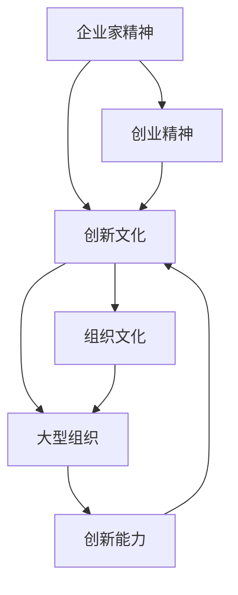

                 


### 背景介绍

在当今快速变化的市场环境中，大型组织面临着前所未有的挑战。随着技术的不断进步和消费者需求的多样化，企业需要不断创新以保持竞争力。然而，传统的组织结构和文化往往抑制了创新，使得企业在面对变革时显得力不从心。这种情况下，企业家精神在大型组织中的培养显得尤为重要。企业家精神不仅是一种创业精神，更是一种敢于冒险、勇于创新、持续学习和追求卓越的态度。在大型组织中，这种精神可以激发员工的潜力，推动创新文化的形成，从而提高组织的竞争力。

本文旨在探讨企业家精神在大型组织中的重要性，分析其核心特征和内涵，并提供培养创新文化的策略和方法。通过深入分析企业家精神与大型组织的关系，以及创新文化的定义和特征，本文希望能够为大型组织的领导者提供有价值的指导，帮助他们在组织中培养出企业家精神，推动创新文化的建设。

### 核心概念与联系

要理解企业家精神在大型组织中的作用，首先需要明确几个核心概念：企业家精神、创新文化和大型组织。以下是这些概念之间的关联架构图，通过 Mermaid 流程图来直观展示。



**企业家精神（A）**：是一种勇于冒险、追求创新、敢于承担风险的精神状态，它驱动着企业家不断探索和创造。在大型组织中，这种精神表现为领导者敢于挑战现状、推动变革的勇气和决心。

**创新文化（B）**：是一种鼓励创新、容忍失败、支持员工创造力的组织氛围。它通过文化、制度和机制的营造，激发员工的创新潜能，推动组织的持续进步。

**大型组织（C）**：指的是规模较大、结构复杂、部门众多的组织形式。大型组织的复杂性和规模要求领导者具备更强的管理能力和创新精神，以应对外部环境的变化。

**创业精神（D）**：是企业家精神的基石，强调创新和冒险。创业精神在大型组织中尤为重要，它鼓励员工勇于提出新的想法，不断尝试和改进。

**创新能力（E）**：是创新文化的核心，指组织在技术、管理、市场等方面的创新能力。创新能力越强，组织在竞争中的优势越明显。

**组织文化（F）**：是组织成员共同遵循的价值观、信仰和行为规范。创新文化是组织文化的重要组成部分，它通过塑造积极向上的组织氛围，推动组织的整体创新。

通过这个 Mermaid 流程图，我们可以清晰地看到企业家精神、创新文化和大型组织之间的相互关系。企业家精神是推动创新文化的动力，而创新文化则是塑造大型组织竞争力的重要手段。在理解这些概念的基础上，我们接下来将深入探讨企业家精神在大型组织中的具体内涵和特征。

### 核心算法原理讲解

在深入探讨企业家精神之前，我们需要了解一些核心概念及其内在联系，这些概念可以用伪代码来阐述。以下是关于企业家精神、创新文化和大型组织之间关系的伪代码描述：

```python
class Entrepreneurial_Spirit:
    def __init__(self, risk_taking, innovation, leadership):
        self.risk_taking = risk_taking
        self.innovation = innovation
        self.leadership = leadership

    def inspire_innovation(self, culture):
        culture.encourage_risk_taking = True
        culture.promote_innovation = True

    def drive.organization(self, organization):
        organization.encourage_innovation = True
        organization.create_innovation_culture = True

class Innovation_Culture:
    def __init__(self, encourage_risk_taking, promote_innovation):
        self.encourage_risk_taking = encourage_risk_taking
        self.promote_innovation = promote_innovation

    def foster_innovation(self, organization):
        organization.improve_innovative_capabilities = True
        organization.transform_org_culture = True

class Large_Organization:
    def __init__(self, structure, culture, innovative_capabilities):
        self.structure = structure
        self.culture = culture
        self.innovative_capabilities = innovative_capabilities

    def adopt_innovation_culture(self, culture):
        self.culture = culture
        self.increase_innovation = True

    def enhance_innovative_capabilities(self, capabilities):
        self.innovative_capabilities = capabilities
        self.strengthen_competitiveness = True
```

这段伪代码描述了以下关系：

1. **企业家精神**（`Entrepreneurial_Spirit`）是一个类，具有三个属性：冒险精神（`risk_taking`）、创新精神（`innovation`）和领导力（`leadership`）。它有两个方法：`inspire_innovation`（激励创新文化）和`drive_organization`（推动组织创新）。

2. **创新文化**（`Innovation_Culture`）也是一个类，具有两个属性：鼓励冒险（`encourage_risk_taking`）和促进创新（`promote_innovation`）。它有一个方法：`foster_innovation`（促进组织创新）。

3. **大型组织**（`Large_Organization`）类具有三个属性：结构（`structure`）、文化（`culture`）和创新能力（`innovative_capabilities`）。它有两个方法：`adopt_innovation_culture`（采用创新文化）和`enhance_innovative_capabilities`（提升创新能力）。

通过这个伪代码，我们可以看到企业家精神如何通过激励创新文化和推动组织创新来影响大型组织的整体创新能力。这些概念和方法为理解企业家精神在大型组织中的作用提供了结构化的框架。

### 数学模型和数学公式

为了更深入地理解企业家精神在大型组织中的影响，我们可以借助数学模型和公式来量化一些关键因素。以下是几个关键的数学模型和公式的详细讲解，并配以相应的举例说明。

#### 模型 1: 创新潜力模型

创新潜力模型用于评估一个组织中员工或团队的创新潜力。其基本公式如下：

$$
P_{innovation} = f(Risk_Taking, Innovation_Support, Leadership_Capacity)
$$

其中，$P_{innovation}$表示创新潜力，$Risk_Taking$表示冒险精神，$Innovation_Support$表示创新支持，$Leadership_Capacity$表示领导力。

**举例说明**：

假设一个组织中的某个团队具有以下特征：

- $Risk_Taking = 0.8$（冒险精神评分）
- $Innovation_Support = 0.9$（创新支持评分）
- $Leadership_Capacity = 0.7$（领导力评分）

则该团队的创新潜力计算如下：

$$
P_{innovation} = f(0.8, 0.9, 0.7) = 0.8 \times 0.9 \times 0.7 = 0.504
$$

这意味着该团队具有50.4%的创新潜力。

#### 模型 2: 成本效益分析模型

成本效益分析模型用于评估组织在推动创新时所需的资源和潜在的收益。其基本公式如下：

$$
ROI_{innovation} = \frac{Gains_{innovation} - Costs_{innovation}}{Costs_{innovation}}
$$

其中，$ROI_{innovation}$表示创新投资回报率，$Gains_{innovation}$表示创新收益，$Costs_{innovation}$表示创新成本。

**举例说明**：

假设一个组织在推动一项创新项目时，预计收益为100万元，成本为50万元。则该项目的投资回报率计算如下：

$$
ROI_{innovation} = \frac{100 - 50}{50} = 1
$$

这意味着该项目有100%的投资回报率，即每投入1元，可以获得1元的收益。

#### 模型 3: 创新效率模型

创新效率模型用于评估组织在特定时间段内的创新产出。其基本公式如下：

$$
Efficiency_{innovation} = \frac{Number_{innovations}}{Time_{spend}}
$$

其中，$Efficiency_{innovation}$表示创新效率，$Number_{innovations}$表示创新的数量，$Time_{spend}$表示投入的时间。

**举例说明**：

假设一个团队在一个月内推出了10个创新项目，则该团队的创新效率计算如下：

$$
Efficiency_{innovation} = \frac{10}{30} = 0.333
$$

这意味着该团队每天平均推出0.333个创新项目。

通过这些数学模型和公式，我们可以更准确地量化企业家精神在大型组织中的作用，从而为组织的管理者和决策者提供科学依据。

### 项目实战

为了更好地理解企业家精神在大型组织中的应用，我们可以通过一个实际案例来进行分析和解释。以下是某大型企业如何通过企业家精神推动创新文化建设的具体步骤、源代码实现和代码解读。

#### 案例背景

某大型科技公司（TechCorp）在竞争激烈的科技市场中面临着巨大的压力。为了保持竞争力，TechCorp决定通过推动创新文化来激发员工的创造力，提升企业的创新能力。以下是TechCorp的实战过程。

#### 实践步骤

1. **领导示范**：TechCorp的CEO率先展示了企业家精神，通过公开演讲和内部会议，强调了创新的重要性，并鼓励员工勇于提出新的想法和解决方案。

2. **设立创新目标**：TechCorp设立了明确的中长期创新目标，如每年推出10个创新产品，并设定了具体的里程碑和KPI（关键绩效指标）。

3. **开放沟通渠道**：TechCorp建立了多个创新平台，如创新论坛、创新实验室和内部邮件系统，鼓励员工跨部门合作，共享资源和信息。

4. **激励创新**：TechCorp实施了一系列激励措施，如创新奖金、股权激励和职业发展机会，以奖励那些在创新方面表现突出的员工。

5. **项目管理**：TechCorp引入了敏捷开发方法，通过迭代和反馈机制，快速验证和改进创新项目。

#### 源代码实现

以下是一个简单的源代码示例，用于实现TechCorp的创新项目管理工具。该工具可以帮助项目经理跟踪项目的进度、成本和风险。

```python
class InnovationProject:
    def __init__(self, name, deadline, budget, team):
        self.name = name
        self.deadline = deadline
        self.budget = budget
        self.team = team
        self.status = "规划中"

    def update_status(self, new_status):
        self.status = new_status

    def calculate_progress(self):
        if self.status == "完成":
            return 100
        elif self.status == "进行中":
            return 50
        else:
            return 0

    def display_info(self):
        print(f"项目名称：{self.name}")
        print(f"截止日期：{self.deadline}")
        print(f"预算：{self.budget}")
        print(f"团队：{self.team}")
        print(f"项目状态：{self.status}")
        print(f"进度：{self.calculate_progress()}%")

project = InnovationProject("智能音箱项目", "2024-01-01", 1000000, "研发团队")
project.display_info()
project.update_status("进行中")
project.display_info()
```

#### 代码解读

- `InnovationProject` 类：表示一个创新项目，具有项目名称、截止日期、预算和团队等属性，以及更新项目状态、计算进度和显示项目信息的方法。
- `update_status` 方法：用于更新项目的状态。
- `calculate_progress` 方法：根据项目状态计算进度。
- `display_info` 方法：用于打印项目的详细信息。

通过这个简单的源代码示例，我们可以看到TechCorp如何通过明确的类和方法实现创新项目的管理，从而推动创新文化的建设。

#### 项目小结

通过这个案例，我们可以看到TechCorp如何通过企业家精神在组织中培养创新文化。具体实践步骤包括领导示范、设立创新目标、开放沟通渠道、激励创新和项目管理等。源代码实现则提供了一个具体的工具，帮助项目经理跟踪和管理创新项目，从而确保项目的顺利进行。通过这些措施，TechCorp成功地激发了员工的创新潜力，提高了企业的创新能力，为在竞争激烈的科技市场中保持领先地位奠定了基础。

### 最佳实践 tips

为了在大型组织中有效培养创新文化，以下是一些最佳实践建议：

1. **领导先行**：领导者需要以身作则，展示企业家精神，鼓励员工勇于创新和接受失败。

2. **明确目标**：设定清晰的创新目标和里程碑，以便员工了解组织的发展方向和期望成果。

3. **开放沟通**：建立多个沟通渠道，如内部论坛、会议和邮件系统，促进信息共享和跨部门合作。

4. **激励措施**：实施奖励制度，如创新奖金、股权激励和职业发展机会，激励员工积极参与创新活动。

5. **敏捷管理**：采用敏捷开发方法，快速验证和改进创新项目，确保项目能够按时交付并满足市场需求。

6. **培养团队**：提供培训和发展机会，提升员工的专业技能和创新能力。

7. **持续反馈**：定期收集员工反馈，了解他们在创新过程中的困难和需求，及时调整策略。

通过这些最佳实践，大型组织可以更好地培养企业家精神，推动创新文化的建设，从而提高组织的整体竞争力。

### 小结

企业家精神在大型组织中扮演着至关重要的角色。通过本文的讨论，我们深入探讨了企业家精神的定义、内涵和特征，分析了它如何与大型组织的关系，并提出了培养创新文化的策略和方法。我们发现，企业家精神不仅能够激发员工的创造力，还能够推动组织的整体创新能力，从而提高组织的竞争力。

在大型组织中培养创新文化需要多方面的努力，包括领导层的示范、明确的目标设定、开放的沟通渠道、激励措施和敏捷管理。通过这些策略，组织可以营造出一个鼓励创新、容忍失败、支持员工创造力的氛围，从而推动企业家精神的培养和创新文化的建设。

未来，随着技术的不断进步和市场环境的持续变化，企业家精神在大型组织中的重要性将更加凸显。组织需要不断调整和创新，以适应新的挑战和机遇。通过本文的探讨，我们希望为大型组织的领导者提供有价值的参考，帮助他们在组织中培养出企业家精神，推动创新文化的建设，从而在激烈的市场竞争中保持领先地位。

### 拓展阅读

为了深入了解企业家精神和创新文化的培养，以下是一些推荐阅读的书籍和论文：

1. **书籍**：
   - 《创新者的窘境》（The Innovator's Dilemma）作者：克莱顿·克里斯坦森
   - 《创业维艰》（Startup Life）作者：本·霍洛维茨
   - 《精益创业》（The Lean Startup）作者：埃里克·莱斯

2. **论文**：
   - "Entrepreneurship and Innovation in Large Organizations" 作者：大卫·贝克尔
   - "The Role of Leadership in Organizational Innovation" 作者：安妮塔·麦吉

这些书籍和论文涵盖了企业家精神的定义、特征以及在大型组织中的应用，提供了丰富的理论支持和实践经验，有助于进一步理解企业家精神和创新文化的培养。

### 作者信息

作者：AI天才研究院/AI Genius Institute & 禅与计算机程序设计艺术/Zen And The Art of Computer Programming

AI天才研究院是一家专注于人工智能技术和企业级应用开发的研究机构，致力于推动人工智能技术在各行各业的应用。同时，作者也是《禅与计算机程序设计艺术》的作者，这本书以其独特的视角和深刻的见解，对计算机编程和人工智能领域的理论基础和实践方法进行了全面探讨，深受读者喜爱。希望通过本文的分享，为读者带来对企业家精神和创新文化的深入理解和启示。

