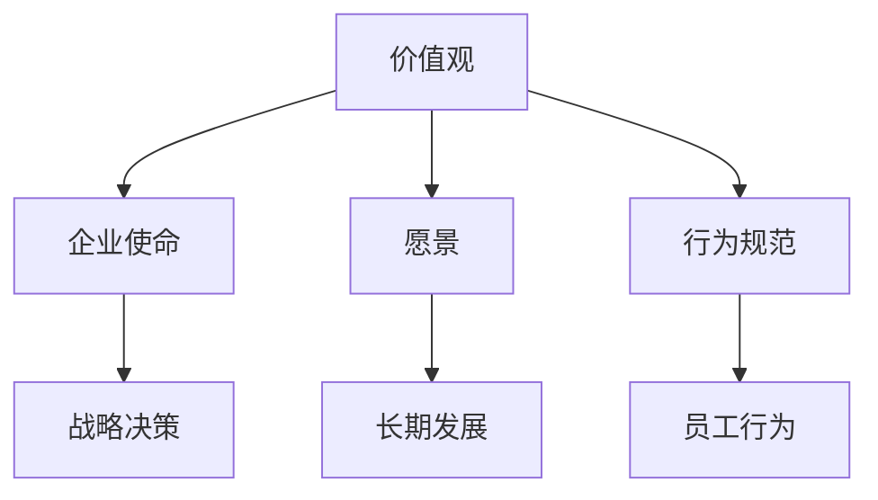

                 

### 文章标题

# 企业文化工程：塑造独特组织氛围的策略

## 关键词

- 企业文化
- 组织氛围
- 构建策略
- 案例分析
- 持续改进

## 摘要

本文旨在探讨企业文化工程的重要性及其在塑造独特组织氛围中的作用。通过详细解析企业文化的基本概念、核心要素、构建策略以及案例分析，本文将提供一套系统化的方法，帮助企业和组织构建和维护具有竞争力的企业文化。文章还将探讨企业文化工程中的最佳实践，并提出注意事项和拓展阅读，以促进企业和组织的持续发展。

---

### 引言

在当今快速变化的市场环境中，企业文化已经成为企业核心竞争力的重要组成部分。企业文化不仅仅是企业的价值观和使命的表述，更是员工行为的指南，影响企业的战略决策、组织结构和员工士气。正如《企业文化工程：塑造独特组织氛围的策略》所强调的，企业文化工程是企业持续成功的关键。

企业文化的核心概念包括价值观、企业使命和愿景，以及行为规范。这些概念相互联系，共同构成了企业文化的整体架构。价值观是企业文化的基石，它决定了企业的行为准则和决策方式；企业使命和愿景则为企业指明了未来的发展方向；行为规范则规范了员工在日常工作和互动中的行为。

企业文化工程的目标是构建一个积极、健康、具有竞争力的组织氛围，使员工能够在其中充分发挥潜力，实现个人与组织的共同成长。为了实现这一目标，企业需要采取一系列策略，包括战略规划、组织沟通、团队建设和文化传承等。

### 企业文化的定义与核心要素

#### 企业文化的定义

企业文化是企业内部共享的价值观、信仰、态度和行为模式的总和。它是企业精神的核心，是企业内部成员共同遵循的指导原则和行为规范。企业文化不仅仅体现在企业的语言和行为中，还渗透到企业的日常运营和决策过程中。

#### 企业文化的核心要素

1. **价值观**

   价值观是企业文化的核心，它决定了企业的行为准则和决策方式。企业的价值观通常包括诚信、创新、团队合作、客户至上等。这些价值观不仅体现在企业的宣传语中，更体现在企业的日常运营和员工的行为中。

2. **企业使命**

   企业使命是企业存在的根本原因，它回答了企业为什么要存在这个问题。企业使命通常与企业的发展方向、目标市场、服务对象等相关，它为企业的长期发展提供了方向。

3. **愿景**

   愿景是企业未来的理想状态，它描绘了企业希望成为什么样的企业。愿景通常具有激励作用，能够激发员工的积极性和创造力。

4. **行为规范**

   行为规范是企业内部成员在日常工作和互动中应遵循的行为准则。它包括企业的规章制度、职业道德和行为习惯等，旨在维护企业的正常运营和良好的组织氛围。

#### 核心概念之间的关系架构

下面是一个使用Mermaid绘制的企业文化核心概念之间的关系架构图：

### 企业文化构建的策略

#### 战略规划与目标设定

战略规划是企业文化构建的基础。企业需要明确自己的使命和愿景，并将其转化为具体的战略目标和行动计划。战略规划应包括企业的发展方向、市场定位、资源配置和风险管理等。

1. **使命与愿景的设定**

   企业的使命和愿景应具有激励性和前瞻性。使命应明确企业存在的目的，愿景则应描述企业希望实现的未来状态。例如，某科技公司的使命可能是“通过创新科技改善人类生活”，愿景则是“成为全球领先的科技企业”。

2. **战略目标的制定**

   战略目标应具体、可衡量、可实现。企业可以根据使命和愿景，制定长期、中期和短期的战略目标。例如，长期目标是“在五年内实现全球市场份额的翻倍”，中期目标是“在三年内实现产品线的多样化”，短期目标是“在一年内完成新产品的研发”。

#### 组织沟通与共识建设

组织沟通是企业文化构建的关键环节。企业需要建立有效的沟通机制，确保信息在企业内部的有效传递和理解。

1. **沟通机制与渠道**

   企业应建立多层次的沟通机制，包括正式的会议、汇报和正式的书面沟通，以及非正式的交流活动和团队建设活动。

2. **共识建设的方法与技巧**

   企业需要通过多种方法建立共识，包括价值观的传播、共同目标的设定、团队协作的强化等。例如，企业可以通过定期的团队会议、工作坊和培训活动，加强团队成员之间的沟通和理解，建立共同的价值观和目标。

#### 团队建设与激励

团队建设是企业文化构建的核心内容。企业需要通过一系列措施，培养具有共同价值观和目标的团队。

1. **员工招聘与选拔**

   企业在招聘员工时，应注重员工的价值观与企业的契合度。通过面试和评估，了解员工的专业能力和团队合作精神，确保员工能够融入企业文化。

2. **员工培训与发展**

   企业应提供多样化的培训和发展机会，帮助员工提升专业技能和职业素养，同时加强员工对企业文化的认同。

3. **绩效考核与激励**

   企业应建立公正、透明的绩效考核体系，根据员工的绩效表现给予奖励和晋升机会，激发员工的积极性和创造力。

#### 文化传承与创新

文化传承是企业文化构建的重要组成部分。企业需要通过一系列措施，确保企业文化在代际间的传承和发展。

1. **文化传承的方法与手段**

   企业可以通过定期的文化宣传活动、历史回顾和传统仪式等，传递和弘扬企业的核心价值观和行为规范。

2. **文化创新的动力与机制**

   企业应鼓励员工提出创新想法，建立创新激励机制，为员工提供试错和成长的空间。同时，企业应定期评估和调整企业文化，确保其与企业的战略目标和市场环境保持一致。

### 案例分析

#### 案例一：谷歌的企业文化

谷歌以其独特的企业文化而闻名，其核心价值观包括“不作恶”、“快速创新”、“用户至上”等。谷歌通过一系列措施，成功构建了一个开放、创新、多元化的工作环境。

1. **员工招聘与选拔**

   谷歌在招聘员工时，注重候选人的价值观与谷歌文化的契合度。公司通过严格的面试流程，确保新员工能够融入谷歌的企业文化。

2. **员工培训与发展**

   谷歌提供多样化的培训和发展机会，包括内部培训、在线课程、技术研讨会等，帮助员工提升专业技能和职业素养。

3. **绩效考核与激励**

   谷歌采用“员工反馈系统”，通过同事之间的互评和反馈，确保绩效考核的公正性和透明性。同时，公司提供丰厚的薪酬和福利，激励员工为企业的发展做出贡献。

4. **文化传承与创新**

   谷歌定期举办“文化传承日”，通过回顾公司的发展历程和文化传统，加强员工对企业文化的认同。同时，公司鼓励员工提出创新想法，并通过内部创新项目，激发员工的创新潜力。

#### 案例二：微软的企业文化

微软的企业文化强调“创新、协作、客户至上”等价值观。在比尔·盖茨的领导下，微软通过一系列措施，成功构建了一个具有竞争力的企业文化。

1. **员工招聘与选拔**

   微软在招聘员工时，注重候选人的专业技能和团队合作精神。公司通过多轮面试和技术测试，确保新员工能够胜任工作。

2. **员工培训与发展**

   微软提供全面的培训计划，包括专业技能培训、领导力培训和跨部门交流等，帮助员工提升个人能力和职业素养。

3. **绩效考核与激励**

   微软采用“绩效管理系统”，通过定期的绩效评估和反馈，确保员工的工作表现得到公正评价。同时，公司提供具有竞争力的薪酬和福利，激励员工为企业的发展做出贡献。

4. **文化传承与创新**

   微软定期举办“创新日”和“文化传承活动”，鼓励员工提出创新想法，并为企业文化的传承和发展提供支持。同时，公司鼓励员工参与社区服务和公益活动，提升企业的社会形象。

### 企业文化建设中的最佳实践

#### 1. 明确企业价值观

企业应明确自身的价值观，并将其融入到企业的日常运营和员工行为中。通过培训和宣传，确保员工对企业价值观有深刻的理解和认同。

#### 2. 强化组织沟通

企业应建立有效的沟通机制，确保信息在企业内部的有效传递和理解。同时，企业应鼓励员工提出意见和建议，营造开放、包容的工作环境。

#### 3. 培养团队精神

企业应通过团队建设活动，培养员工的团队合作精神。通过共同的目标和任务，增强团队成员之间的凝聚力和协作能力。

#### 4. 激励员工创新

企业应鼓励员工提出创新想法，并提供试错和成长的空间。通过内部创新项目和奖励机制，激发员工的创新潜力。

#### 5. 持续改进

企业应定期评估和调整企业文化，确保其与企业的战略目标和市场环境保持一致。通过持续改进，不断提升企业文化的竞争力。

### 项目实战

#### 开发环境搭建

在搭建企业文化建设项目开发环境时，企业需要考虑以下几个方面：

1. **技术栈选择**

   企业应根据项目的需求和规模，选择合适的技术栈。例如，可以选择Java或Python等编程语言，以及Spring Boot或Django等框架。

2. **数据库选择**

   企业应选择适合企业规模和数据的数据库。例如，可以选择MySQL或PostgreSQL等关系型数据库，或MongoDB等NoSQL数据库。

3. **开发工具**

   企业应提供常用的开发工具，如Visual Studio Code、IntelliJ IDEA等，以提高开发效率。

4. **版本控制**

   企业应使用Git等版本控制系统，确保代码的版本管理和协作开发。

#### 源代码详细实现和代码解读

在企业文化建设项目的源代码实现过程中，企业需要考虑以下几个方面：

1. **模块划分**

   企业应将系统划分为多个模块，如用户管理模块、培训管理模块、绩效考核模块等，以提高代码的可维护性和可扩展性。

2. **数据库设计**

   企业应设计合理的数据库结构，确保数据的完整性和一致性。例如，可以使用ER图来设计数据库表结构。

3. **业务逻辑实现**

   企业应根据业务需求，实现相应的业务逻辑。例如，可以使用伪代码来描述业务流程和数据处理过程。

#### 代码应用解读与分析

在企业文化建设项目的应用过程中，企业需要考虑以下几个方面：

1. **用户界面设计**

   企业应根据用户需求，设计直观、易用的用户界面。例如，可以使用Bootstrap等前端框架来快速搭建界面。

2. **数据交互**

   企业应确保系统与数据库之间的数据交互高效、稳定。例如，可以使用RESTful API或GraphQL等技术来实现数据交互。

3. **性能优化**

   企业应关注系统的性能优化，确保系统在高并发环境下能够稳定运行。例如，可以使用缓存技术、数据库优化等技术来提升系统性能。

#### 实际案例分析和详细讲解剖析

在企业文化建设项目的实际应用中，企业可以参考以下案例进行分析和讲解：

1. **员工培训管理案例**

   企业可以分析员工培训管理的流程，包括培训计划制定、培训课程安排、培训效果评估等。通过案例分析，企业可以了解如何优化培训管理流程，提高培训效果。

2. **绩效考核管理案例**

   企业可以分析绩效考核管理的流程，包括考核指标设定、考核数据收集、考核结果分析等。通过案例分析，企业可以了解如何设计合理的考核指标体系，提高员工的工作积极性和绩效。

#### 项目小结

通过企业文化建设项目的实战，企业可以深入了解企业文化构建的方法和策略，提高企业文化的竞争力。在项目实施过程中，企业应注意以下几点：

1. **明确项目目标**

   企业应明确项目目标，确保项目的方向和进度。

2. **团队协作**

   企业应加强团队协作，确保项目的顺利进行。

3. **持续改进**

   企业应定期评估项目效果，持续改进项目实施过程。

### 最佳实践 Tips、小结、注意事项、拓展阅读

#### 最佳实践 Tips

1. **价值观先行**

   在企业文化建设过程中，价值观的明确和传播至关重要。企业应将价值观融入到日常运营和员工行为中，确保员工对企业价值观有深刻的理解和认同。

2. **沟通机制建设**

   企业应建立有效的沟通机制，确保信息在企业内部的有效传递和理解。同时，企业应鼓励员工提出意见和建议，营造开放、包容的工作环境。

3. **员工参与**

   企业应鼓励员工参与企业文化建设的全过程，从价值观的设定到策略的实施，让员工感受到自己在企业文化中的价值和作用。

#### 小结

企业文化建设是企业长期发展的关键，通过明确价值观、建立沟通机制、培养团队精神、激励员工创新等一系列策略，企业可以构建一个积极、健康、具有竞争力的组织氛围。

#### 注意事项

1. **避免形式主义**

   企业在文化建设过程中，应避免形式主义，确保文化建设的实际效果。

2. **持续关注和调整**

   企业应定期关注企业文化建设的进展和效果，根据实际情况进行调整和优化。

3. **注重员工反馈**

   企业应重视员工的反馈和建议，将员工的意见和需求纳入到企业文化建设的考量中。

#### 拓展阅读

1. **《企业文化构建与实践》**

   作者：李明辉

   内容简介：本书详细介绍了企业文化的定义、核心要素、构建策略和实践案例，有助于企业理解和实践企业文化。

2. **《企业文化建设与管理》**

   作者：张晓红

   内容简介：本书从管理角度出发，探讨了企业文化建设的重要性和方法，为企业提供了一套系统化的文化建设方案。

---

作者：AI天才研究院/AI Genius Institute & 禅与计算机程序设计艺术 /Zen And The Art of Computer Programming

本文通过详细解析企业文化的基本概念、核心要素、构建策略以及案例分析，提供了一套系统化的方法，帮助企业和组织构建和维护具有竞争力的企业文化。文章还探讨了企业文化工程中的最佳实践，并提出了注意事项和拓展阅读，以促进企业和组织的持续发展。在当今快速变化的市场环境中，企业文化已经成为企业核心竞争力的重要组成部分。通过本文的讨论，我们希望读者能够更好地理解和应用企业文化工程，塑造独特而富有竞争力的组织氛围。

