                 


### 文章标题

### 《信任建设：团队凝聚力的核心要素》

### 关键词

- 信任建设
- 团队凝聚力
- 危机应对
- 信任危机
- 团队绩效

### 摘要

本文将深入探讨信任建设在团队凝聚力中的核心作用。从定义、意义、原因、基础、实践到绩效关系，本文通过一系列详细的分析和案例，旨在为IT领域团队提供一套有效的信任建设策略。通过理解信任的基本原理，分析信任危机的原因，探讨建立信任的基础和方法，以及分享实际案例和工具，本文力图为读者提供全面的指导，帮助团队在复杂多变的环境中实现高效的协作和卓越的绩效。

----------------------------------------------------------------

### 《信任建设：团队凝聚力的核心要素》目录大纲

#### 第一部分：信任建设的基本原理

#### 第1章：信任的定义与重要性

#### 第2章：信任危机的原因与应对

#### 第3章：建立信任的基础

#### 第4章：信任建设在团队中的实践

#### 第5章：信任建设与团队绩效的关系

#### 第二部分：信任建设的具体实践

#### 第6章：案例分析

#### 第7章：信任建设的方法与工具

#### 第8章：信任建设中的挑战与应对

----------------------------------------------------------------

#### 第一部分：信任建设的基本原理

### 第1章：信任的定义与重要性

#### 1.1 信任的定义

信任是团队中不可或缺的要素，它是团队成员之间相互依赖和协作的基础。在组织管理中，信任不仅是个人行为准则的体现，更是团队文化的重要组成部分。

**定义：** 信任是指个体对他人的行为和意图的信心和信赖，是建立在相互了解、尊重和承诺的基础上的心理状态。

信任包括以下几个方面：

1. **行为可信性**：个体表现出的行为与承诺的一致性。
2. **意图可信性**：个体意图的真诚和善意。
3. **能力可信性**：个体完成任务的能力和技能水平。

#### 1.2 信任的重要性

在团队管理中，信任具有以下几个重要意义：

1. **提高团队凝聚力**：信任能够加强团队成员之间的联系，使团队更加团结，共同面对挑战。
2. **促进团队协作**：信任减少了团队成员之间的怀疑和防备，使得协作更加顺畅，提高工作效率。
3. **降低管理成本**：信任减少了组织内部的管理层次和流程，降低了沟通成本和协调难度。
4. **增强创新能力**：信任鼓励团队成员分享想法和意见，激发创新思维，推动团队进步。

#### 1.3 信任的三要素

信任的建立和维护是一个复杂的过程，它需要以下几个要素：

1. **透明度**：团队成员之间的信息应该是透明和公开的，避免信息不对称。
2. **共同目标**：团队成员应该有共同的目标和价值观，减少利益冲突。
3. **沟通效率**：高效的沟通可以减少误解和冲突，增强团队之间的信任。

#### 1.4 小结

信任是团队凝聚力的核心要素，它对于组织的长期成功至关重要。通过理解信任的定义和重要性，我们可以更好地认识信任在团队中的作用，并为团队信任的建设奠定基础。

#### Mermaid 流程图

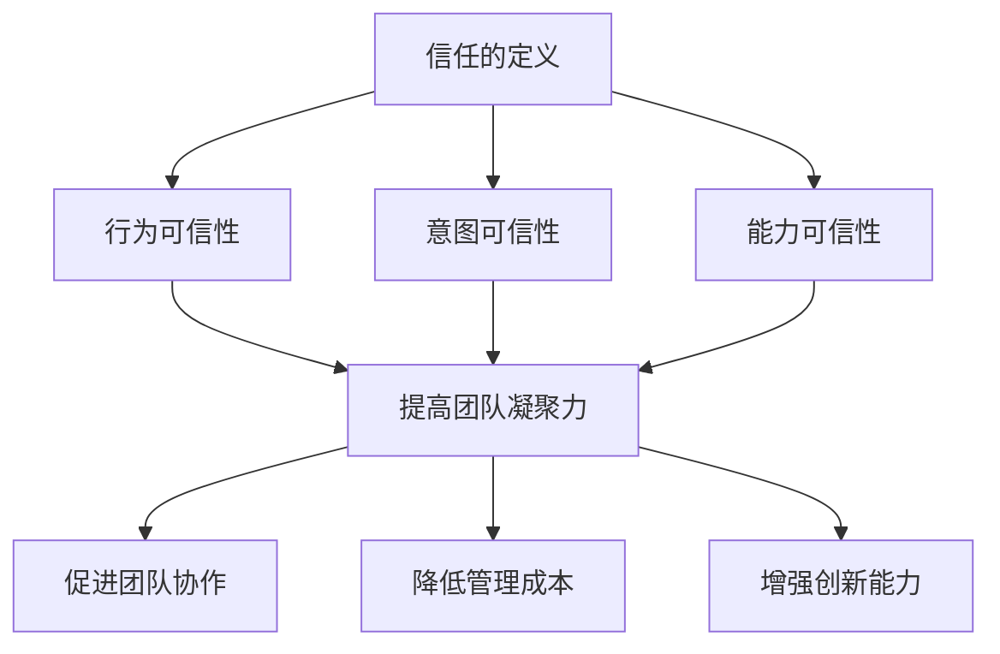

----------------------------------------------------------------

### 第2章：信任危机的原因与应对

#### 2.1 信任危机的原因

在团队管理中，信任危机可能是由多种原因引起的，了解这些原因有助于我们预防和应对信任危机。

#### 2.1.1 信息不对称

信息不对称是信任危机的一个主要原因。当团队成员之间缺乏足够的信息共享时，就会产生误解和猜疑，导致信任的破裂。

**原因：**
- 隐藏信息：某些成员可能出于个人利益隐藏关键信息。
- 信息滞后：信息传递不及时，导致决策滞后。
- 信息不完整：信息传递过程中存在遗漏，导致误解。

**影响：**
- 降低工作效率：团队成员无法做出准确的决策，导致工作效率下降。
- 破坏团队氛围：信息不对称导致团队成员之间的猜疑和冲突。

#### 2.1.2 信任悖论

信任悖论是指团队中的信任关系可能因为过度信任而产生问题。在信任过度的情况下，团队成员可能会放松警惕，导致风险增加。

**原因：**
- 过度依赖：过度信任导致团队成员过度依赖他人，忽视自身能力。
- 缺乏监督：过度信任可能使得管理者放松对成员的监督，导致问题得不到及时发现。

**影响：**
- 增加风险：过度信任可能导致团队成员行为失控，增加组织风险。
- 降低团队效率：过度信任可能导致团队成员工作懈怠，降低团队效率。

#### 2.1.3 利益冲突

利益冲突是信任危机的另一个重要原因。当团队成员的利益发生冲突时，信任关系可能会受到破坏。

**原因：**
- 资源分配不均：团队成员可能因为资源分配不均而产生矛盾。
- 薪酬制度不合理：不合理的薪酬制度可能导致团队成员之间的不公平感。

**影响：**
- 降低团队凝聚力：利益冲突可能导致团队成员之间的团结和合作受到破坏。
- 增加员工流失率：不合理的利益分配可能导致优秀员工流失。

#### 2.2 信任危机的应对策略

为了应对信任危机，我们需要采取一系列有效的策略来预防和解决。

#### 2.2.1 增强透明度

增强透明度是解决信息不对称问题的关键。通过提高信息共享的透明度，可以减少团队成员之间的误解和猜疑。

**策略：**
- 定期会议：定期组织团队会议，分享项目进展和关键信息。
- 开放式沟通：鼓励团队成员之间进行开放式沟通，减少信息壁垒。
- 信息共享平台：建立信息共享平台，方便团队成员获取和共享信息。

#### 2.2.2 建立共同目标

建立共同目标是减少利益冲突的有效途径。通过明确团队的目标和愿景，可以增强团队成员的凝聚力，减少矛盾。

**策略：**
- 明确目标：制定明确的团队目标，确保每个成员都清楚自己的职责和贡献。
- 激励机制：建立合理的激励机制，确保团队成员的利益得到公平分配。
- 团队协作：鼓励团队成员之间的协作，共同完成团队目标。

#### 2.2.3 提高沟通效率

提高沟通效率是减少误解和冲突的重要手段。通过改善沟通方式，可以增强团队成员之间的信任。

**策略：**
- 有效沟通：采用有效的沟通技巧，确保信息的准确传递。
- 反馈机制：建立反馈机制，鼓励团队成员提供建设性的反馈。
- 沟通培训：定期组织沟通培训，提高团队成员的沟通能力。

#### 2.3 小结

信任危机是团队管理中常见的问题，了解其产生的原因并采取有效的应对策略至关重要。通过增强透明度、建立共同目标和提高沟通效率，我们可以预防和解决信任危机，为团队的长期发展奠定坚实基础。

#### Mermaid 流程图

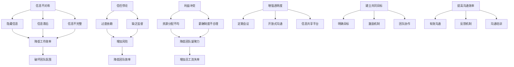

----------------------------------------------------------------

### 第3章：建立信任的基础

#### 3.1 建立信任的原则

建立信任需要遵循一系列基本原则，这些原则为团队中的信任建设提供了指导方向。

**原则一：尊重与信任**

尊重是建立信任的基础，团队成员应该尊重彼此的观点和决策。尊重不仅体现在言语上，更体现在行为上。当团队成员感受到被尊重时，他们会更愿意信任对方。

**原则二：公平与公正**

公平与公正是建立信任的关键要素。团队成员应该感受到组织内部的决策是公平和公正的，这样可以减少不公平感，增强信任。

**原则三：责任与承诺**

责任与承诺是团队成员对团队的承诺和责任感。团队成员应该对自己的行为负责，并履行自己的承诺。这种责任心和承诺感可以增强团队成员之间的信任。

#### 3.2 建立信任的方法

建立信任的方法多种多样，以下是一些常用的方法：

**方法一：提高自身能力**

提高自身能力是建立信任的基础。团队成员应该通过不断学习和提升自己的专业技能，增强自己在团队中的可信度。

**方法二：建立信任关系**

建立信任关系是建立团队信任的关键。团队成员可以通过共同目标和合作来建立信任关系。共同目标和合作可以使团队成员之间产生共鸣，增强信任。

**方法三：培养团队文化**

培养团队文化是建立信任的重要途径。一个健康的团队文化可以促进团队成员之间的信任和合作。团队文化应该强调尊重、公平和责任心。

#### 3.3 培养团队文化

团队文化的培养是一个长期的过程，以下是一些培养团队文化的策略：

**策略一：制定共同价值观**

制定共同价值观是培养团队文化的重要一步。共同价值观可以指导团队成员的行为和决策，增强团队凝聚力。

**策略二：加强团队建设活动**

加强团队建设活动可以促进团队成员之间的交流和合作，增强团队凝聚力。团队建设活动可以包括团队讨论、团队游戏和团队旅行等。

**策略三：表彰优秀团队文化**

表彰优秀团队文化可以鼓励团队成员保持和发扬团队文化的优秀方面，增强团队凝聚力。

#### 3.4 小结

建立信任是团队管理中的核心任务，遵循尊重与信任、公平与公正、责任与承诺的原则，采用提高自身能力、建立信任关系和培养团队文化的方法，可以有效建立和维护团队信任，为团队的长期发展奠定坚实基础。

#### Mermaid 流程图

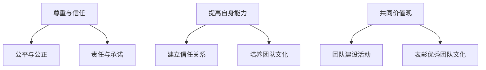

----------------------------------------------------------------

### 第4章：信任建设在团队中的实践

#### 4.1 团队信任建设的方法

在实际团队管理中，信任建设需要通过一系列具体的方法和步骤来实现。以下是一些常用的团队信任建设方法：

**方法一：团队培训**

团队培训是建立信任的重要手段。通过培训，可以提升团队成员的沟通技巧、解决问题的能力和团队合作精神。以下是一个团队培训的伪代码示例：

```
function teamTraining(teamMembers) {
    // 沟通技巧培训
    for (member in teamMembers) {
        member.improveCommunicationSkills();
    }
    // 团队合作培训
    teamMembers.joinTeamBuildingActivities();
    // 问题解决能力培训
    for (member in teamMembers) {
        member.improveProblemSolvingSkills();
    }
}
```

**方法二：团队建设活动**

团队建设活动可以增强团队成员之间的互动和了解，提高团队凝聚力。以下是一个团队建设活动的流程图示例：

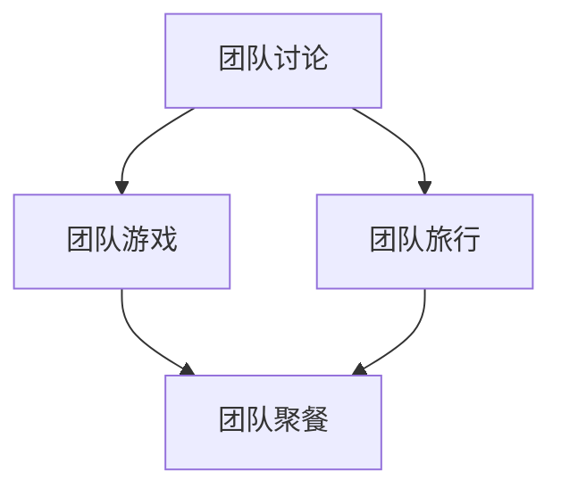

**方法三：信任考核机制**

建立信任考核机制可以确保团队成员在行为和态度上保持诚信和责任心。以下是一个信任考核机制的伪代码示例：

```
function trustEvaluation(teamMembers) {
    for (member in teamMembers) {
        if (member.followsRules()) {
            member.increaseTrustScore();
        } else {
            member.decreaseTrustScore();
        }
    }
}
```

#### 4.2 信任建设在团队管理中的应用

在团队管理中，信任建设的方法需要根据团队的实际情况和需求进行调整。以下是一些具体的应用场景：

**应用一：项目管理中的信任建设**

在项目管理中，信任建设对于项目的成功至关重要。以下是一个项目管理中信任建设的方法：

```
function projectManagementTrustBuilding(projectTeam) {
    // 定期沟通
    projectTeam.holdRegularMeetings();
    // 分享责任
    projectTeam.shareResponsibilities();
    // 提供支持
    projectTeam.provideSupport();
}
```

**应用二：领导力发展中的信任建设**

领导力发展是团队信任建设的重要组成部分。以下是一个领导力发展中信任建设的方法：

```
function leadershipDevelopmentTrustBuilding(leader) {
    // 建立透明度
    leader.improveTransparency();
    // 倾听团队成员
    leader.listenToTeamMembers();
    // 提供反馈
    leader.provideFeedback();
}
```

#### 4.3 小结

在团队管理中，信任建设是一个长期而持续的过程。通过团队培训、团队建设活动和信任考核机制等方法，可以有效地提高团队的信任水平。信任建设不仅需要团队内部的努力，还需要领导者的正确引导和支持。只有在信任的基础上，团队才能实现高效的合作和卓越的绩效。

#### Mermaid 流�程图

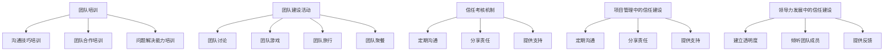

----------------------------------------------------------------

### 第5章：信任建设与团队绩效的关系

#### 5.1 信任建设对团队绩效的影响

信任建设在团队绩效中起着至关重要的作用。以下将从团队凝聚力、团队协作和团队绩效三个方面探讨信任建设对团队绩效的影响。

**团队凝聚力**

信任是团队凝聚力的基础。一个充满信任的团队，其成员之间有着较强的联系和归属感。以下是一个团队凝聚力与信任关系的Mermaid流程图示例：

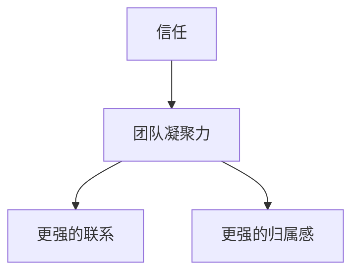

随着信任的增强，团队成员之间的联系和归属感也会增加，从而使团队更加团结。这种团结可以转化为更高的工作效率和更好的团队表现。

**团队协作**

信任建设可以显著提高团队协作效率。在信任的基础上，团队成员更愿意分享信息和资源，共同解决问题。以下是一个团队协作与信任关系的Mermaid流程图示例：

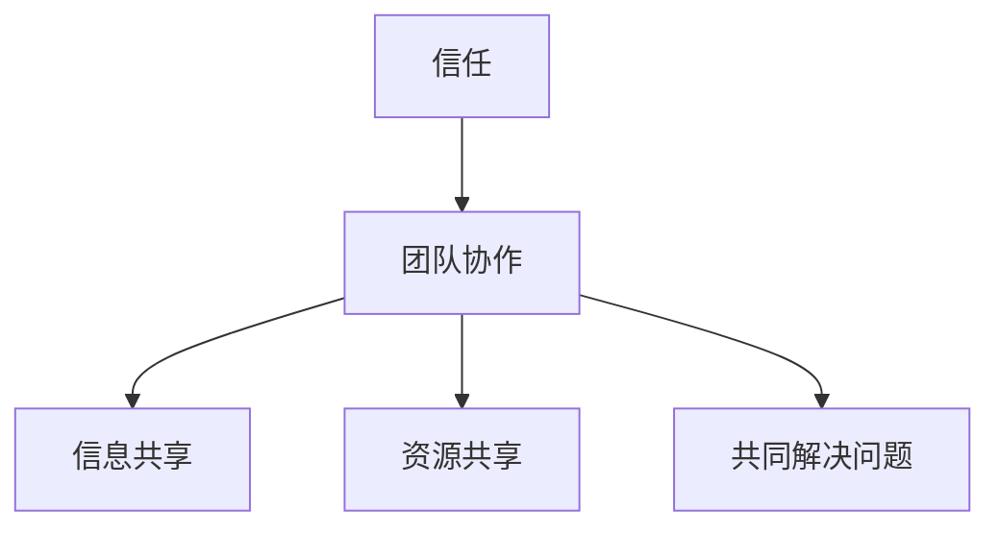

通过信任建设，团队可以减少沟通成本和协调难度，使协作更加顺畅，从而提高工作效率。

**团队绩效**

信任建设对团队绩效有着直接的影响。一个信任水平较高的团队，其成员之间的合作更加紧密，能够更快地达成目标，从而提高整体绩效。以下是一个团队绩效与信任关系的Mermaid流程图示例：

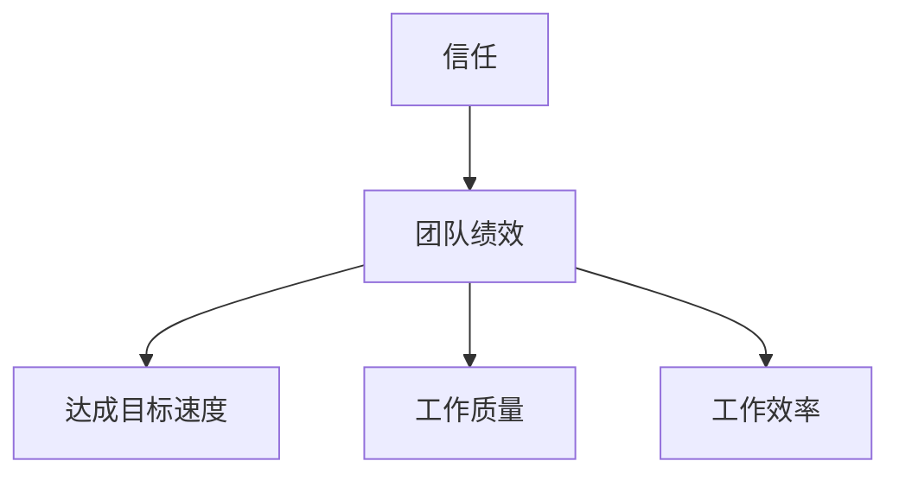

**核心算法原理讲解**

为了更深入地理解信任建设对团队绩效的影响，我们可以使用以下伪代码来描述信任建设对团队绩效的数学模型：

```
function trustEffectOnPerformance(trustLevel, teamPerformance) {
    // 信任水平与团队绩效的关系
    performanceImpact = trustLevel * (1 - (1 / (1 + exp(-0.1 * (trustLevel - 5))))
    // 计算团队绩效的变化
    teamPerformance = teamPerformance + performanceImpact
    return teamPerformance
}
```

在这个模型中，`trustLevel` 表示团队的信任水平，`teamPerformance` 表示团队的绩效。`performanceImpact` 表示信任水平对绩效的影响。通过这个模型，我们可以看到信任水平的增加会对团队绩效产生正面的影响。

**举例说明**

假设一个团队的信任水平为4，其初始绩效为80。根据上述模型，我们可以计算出信任建设对该团队绩效的影响：

```
trustLevel = 4
teamPerformance = 80

performanceImpact = 4 * (1 - (1 / (1 + exp(-0.1 * (4 - 5))))
performanceImpact ≈ 4 * (1 - (1 / (1 + 0.3679)))
performanceImpact ≈ 4 * (1 - 0.6321)
performanceImpact ≈ 4 * 0.3679
performanceImpact ≈ 1.4716

teamPerformance = 80 + 1.4716
teamPerformance ≈ 81.4716

// 结果
// 该团队在增加信任水平后，绩效将提高到约81.4716
```

通过上述计算，我们可以看到，当团队的信任水平从4提高到5时，其绩效将显著提高。

#### 5.2 提高团队绩效的信任建设策略

为了提高团队绩效，我们可以采取以下策略：

**策略一：建立信任氛围**

建立信任氛围是提高团队绩效的基础。管理者可以通过以下措施来营造信任氛围：

- **公开沟通**：定期组织团队会议，分享项目进展和关键信息，确保团队成员之间的信息对称。
- **鼓励反馈**：鼓励团队成员提供建设性反馈，增强团队成员之间的互动和理解。
- **透明决策**：在决策过程中，保持透明度，让团队成员了解决策的原因和影响。

**策略二：提高沟通效率**

提高沟通效率可以减少误解和冲突，提高团队协作效率。以下是一些提高沟通效率的方法：

- **制定沟通计划**：明确沟通的目标、内容和时间，确保沟通的有效性。
- **使用沟通工具**：利用现代化的沟通工具，如即时通讯软件、邮件和项目管理工具，提高沟通效率。
- **培训沟通技巧**：定期组织沟通技巧培训，提高团队成员的沟通能力。

**策略三：创新激励机制**

创新激励机制可以激发团队成员的积极性和创造力，提高团队绩效。以下是一些创新激励机制的方法：

- **绩效奖励**：根据团队成员的绩效表现，给予相应的奖励和认可。
- **晋升机会**：为团队成员提供晋升和发展机会，激发他们的工作动力。
- **团队建设**：定期组织团队建设活动，增强团队成员之间的信任和合作。

#### 5.3 小结

信任建设对团队绩效有着显著的影响。通过建立信任氛围、提高沟通效率和创新激励机制，我们可以提高团队绩效，实现团队的目标。信任建设不仅有助于提升团队的凝聚力，还能促进团队协作，提高工作效率，为团队的长期发展奠定坚实基础。

#### Mermaid 流程图

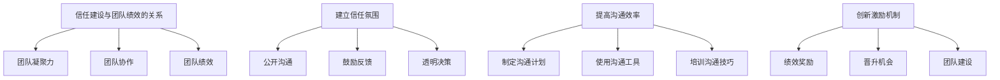

----------------------------------------------------------------

### 第二部分：信任建设的具体实践

#### 第6章：案例分析

在信任建设方面，国内外有许多成功的企业和团队，他们通过一系列的策略和实践，成功建立了高信任度的团队文化，从而提升了团队绩效。以下将介绍几个典型的案例分析。

#### 6.1 国内企业信任建设案例

**案例一：阿里巴巴**

阿里巴巴在信任建设方面有着卓越的表现。通过以下措施，阿里巴巴建立了高度信任的团队文化：

- **公开透明**：阿里巴巴倡导公开透明的工作环境，所有团队成员都可以访问公司的财务报表和业务数据。
- **信任考核**：阿里巴巴建立了一套完善的信任考核机制，对团队成员的诚信和责任心进行评估。
- **员工参与**：阿里巴巴鼓励员工参与公司决策，使员工感受到自己的意见和贡献被重视。

**案例二：华为**

华为在团队信任建设方面也有许多值得借鉴的经验。华为采取了以下策略：

- **共同目标**：华为强调“为客户服务是华为存在的唯一理由”，使所有员工都围绕这一共同目标努力。
- **信任关系**：华为通过一系列团队合作项目和团队建设活动，建立了紧密的信任关系。
- **激励机制**：华为建立了基于绩效的激励机制，激发员工的积极性和创造力。

#### 6.2 国外企业信任建设案例

**案例一：谷歌**

谷歌以其独特的公司文化和员工福利著称，这些因素也促成了谷歌高信任度的团队文化：

- **开放沟通**：谷歌鼓励员工开放沟通，建立了多个内部沟通平台，如谷歌聊天和谷歌邮件，使员工能够随时交流和分享信息。
- **员工自治**：谷歌给予员工较大的自主权，鼓励员工自主管理和决策，这种自主权增强了员工之间的信任。
- **创新氛围**：谷歌营造了浓厚的创新氛围，鼓励员工提出新的想法和解决方案，这种创新文化也增强了员工之间的信任。

**案例二：微软**

微软在信任建设方面也取得了显著成果。微软采取了以下措施：

- **培训与发展**：微软定期组织培训和发展活动，提高员工的专业能力和沟通技巧，增强员工之间的信任。
- **团队合作**：微软鼓励团队合作，通过项目合作和团队建设活动，建立团队成员之间的信任。
- **绩效评估**：微软建立了一套公正透明的绩效评估体系，确保团队成员的绩效得到公正的评价。

#### 6.3 案例分析

**案例背景分析**

以上案例中的企业，无论是阿里巴巴、华为，还是谷歌、微软，它们在信任建设方面都有独特的优势和策略。这些企业通过一系列具体的措施，成功地建立了高信任度的团队文化，从而提升了团队绩效。

**案例实施策略**

在实施信任建设策略时，这些企业采取了以下措施：

- **明确目标**：这些企业首先明确了信任建设的目标，如增强团队凝聚力、提高工作效率、降低管理成本等。
- **培训与教育**：通过定期培训和教育，提高员工的专业能力和沟通技巧，增强员工之间的信任。
- **制度建设**：建立一套公正透明的制度，如信任考核机制、绩效评估体系等，确保信任建设策略得到有效实施。
- **激励与认可**：通过激励机制和认可制度，激发员工的积极性和创造力，增强员工之间的信任。

**案例效果评估**

通过实施信任建设策略，这些企业取得了显著的效果：

- **团队凝聚力提升**：团队成员之间的信任增强，团队凝聚力得到显著提升，使团队在面对挑战时能够更加团结一致。
- **工作效率提高**：团队成员之间的协作更加顺畅，工作效率得到显著提高。
- **管理成本降低**：信任建设减少了组织内部的管理层次和流程，降低了沟通成本和协调难度。
- **绩效提升**：信任建设使团队能够更好地实现目标，从而提升了整体绩效。

#### 6.4 小结

通过分析国内外企业的信任建设案例，我们可以看到，信任建设对于团队绩效的提升具有重要作用。这些企业通过一系列具体的策略和实践，成功建立了高信任度的团队文化，为团队的长期发展奠定了坚实基础。对于其他企业，这些案例提供了宝贵的经验和启示，有助于他们实施有效的信任建设策略。

#### Mermaid 流程图

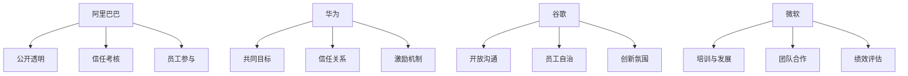

----------------------------------------------------------------

### 第7章：信任建设的方法与工具

#### 7.1 信任建设的方法

在团队信任建设中，方法的选择至关重要。以下介绍几种常用的信任建设方法。

**方法一：增强透明度**

增强透明度是建立信任的基础。以下是一些增强透明度的具体措施：

- **信息公开**：定期公布公司财务状况、业务进展等关键信息，确保信息对称。
- **决策透明**：在决策过程中，确保所有团队成员都能了解决策的背景、原因和影响。

**方法二：提高沟通效率**

提高沟通效率可以减少误解和冲突，以下是一些提高沟通效率的方法：

- **制定沟通计划**：明确沟通的目标、内容和时间，确保沟通的有效性。
- **使用沟通工具**：利用现代化的沟通工具，如即时通讯软件、邮件和项目管理工具，提高沟通效率。
- **培训沟通技巧**：定期组织沟通技巧培训，提高团队成员的沟通能力。

**方法三：建立信任关系**

建立信任关系是信任建设的关键。以下是一些建立信任关系的具体措施：

- **团队合作**：通过共同目标和合作，建立团队成员之间的信任关系。
- **互相信任**：鼓励团队成员之间相互信任，减少怀疑和防备。
- **共同经历**：通过共同的经历和挑战，增强团队成员之间的信任。

**方法四：制定激励机制**

制定激励机制可以激发团队成员的积极性和创造力，以下是一些制定激励机制的具体措施：

- **绩效奖励**：根据团队成员的绩效表现，给予相应的奖励和认可。
- **晋升机会**：为团队成员提供晋升和发展机会，激发他们的工作动力。
- **团队建设**：定期组织团队建设活动，增强团队成员之间的信任和合作。

#### 7.2 信任建设的工具

在信任建设中，工具的应用可以提高效率，以下介绍几种常用的信任建设工具。

**工具一：信任测评工具**

信任测评工具可以帮助团队评估信任水平，以下是一些常见的信任测评工具：

- **信任温度计**：通过问卷形式，评估团队成员之间的信任程度。
- **信任行为评估**：通过观察团队成员的行为，评估他们的信任表现。

**工具二：信任建设软件**

信任建设软件可以帮助团队建立和维护信任关系，以下是一些常见的信任建设软件：

- **Slack**：通过即时通讯功能，促进团队成员之间的沟通和协作。
- **Trello**：通过项目管理工具，提高团队的透明度和沟通效率。

**工具三：信任建设游戏**

信任建设游戏是一种有趣的信任建设方式，以下是一些常见的信任建设游戏：

- **信任秋千**：通过体验游戏，增强团队成员之间的信任感。
- **盲人导航**：通过角色扮演，提高团队成员之间的沟通和理解。

#### 7.3 小结

信任建设的方法和工具多种多样，通过增强透明度、提高沟通效率、建立信任关系和制定激励机制，我们可以有效提高团队的信任水平。同时，信任测评工具、信任建设软件和信任建设游戏等工具的应用，也为信任建设提供了有力的支持。在实施信任建设过程中，需要根据团队的实际情况，灵活选择合适的方法和工具，从而实现团队的高效协作和卓越绩效。

#### Mermaid 流程图

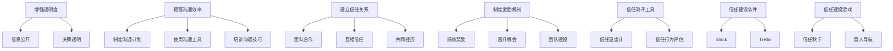

----------------------------------------------------------------

### 第8章：信任建设中的挑战与应对

#### 8.1 信任建设中的挑战

在信任建设过程中，团队可能会面临一系列挑战，这些挑战可能会阻碍信任的建立和发展。以下是一些常见的挑战及应对策略。

**挑战一：组织文化的影响**

组织文化对信任建设有着深远的影响。在一些组织文化中，员工可能习惯了层级分明、沟通不畅的工作方式，这会阻碍信任的建立。应对策略如下：

- **文化转变**：通过领导层的倡导和推动，逐步改变组织文化，使之更加开放和透明。
- **培训与教育**：组织针对信任建设开展培训和教育，提高员工对信任重要性的认识。

**挑战二：个人信任问题**

团队成员的个人信任问题也会影响整体团队的信任建设。一些成员可能因为过去的经历或个人性格原因，对建立信任持怀疑态度。应对策略如下：

- **信任评估**：通过信任评估，了解团队成员的信任水平和问题所在，有针对性地进行干预。
- **个体辅导**：对有信任问题的成员进行个别辅导，帮助他们克服心理障碍，增强信任感。

**挑战三：外部环境的干扰**

外部环境的变化和不确定性可能会对团队信任建设产生负面影响。例如，经济波动、市场变化等都会影响团队的稳定性和信任。应对策略如下：

- **建立抗风险机制**：通过制定应对策略和预案，降低外部环境对团队信任建设的干扰。
- **沟通与协调**：加强与外部环境的沟通，确保团队及时了解外部变化，调整信任建设策略。

**挑战四：资源限制**

信任建设需要一定的时间和资源投入。在某些情况下，团队可能面临资源限制，这会影响信任建设的推进。应对策略如下：

- **优先级调整**：在资源有限的情况下，优先考虑信任建设的关键环节，确保重点突破。
- **外部合作**：寻求外部合作伙伴的支持，共同推进信任建设。

#### 8.2 信任建设中的应对策略

**策略一：强化培训与教育**

强化培训与教育是信任建设的重要手段。以下是一些具体的措施：

- **内部培训**：定期组织内部培训，提高员工对信任建设重要性的认识，增强员工的信任意识。
- **外部学习**：鼓励员工参加外部培训和学习，借鉴其他组织的成功经验。

**策略二：建立信任文化**

建立信任文化是信任建设的关键。以下是一些具体的措施：

- **透明度提升**：通过提高信息透明度，减少团队成员之间的信息不对称，增强信任。
- **沟通渠道建设**：建立多样化的沟通渠道，确保团队成员之间的有效沟通。

**策略三：创新与持续改进**

创新与持续改进是信任建设的动力。以下是一些具体的措施：

- **团队建设活动**：定期组织团队建设活动，增强团队成员之间的信任和凝聚力。
- **反馈机制**：建立反馈机制，鼓励团队成员提供建设性反馈，不断改进信任建设策略。

#### 8.3 小结

信任建设是一个复杂且长期的过程，团队在建设过程中可能会面临多种挑战。通过强化培训与教育、建立信任文化、创新与持续改进等策略，团队可以有效地应对这些挑战，建立和维护高水平的信任，为团队的长期发展和成功奠定坚实基础。

#### Mermaid 流程图

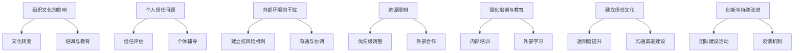

----------------------------------------------------------------

### 文章小结

信任建设是团队管理中的核心任务，它对于团队凝聚力的提升、协作效率的改善以及整体绩效的增强具有至关重要的作用。本文通过深入探讨信任建设的基本原理、原因与应对、建立信任的基础、具体实践和与团队绩效的关系，为IT领域团队提供了一套全面且实用的信任建设策略。

首先，我们明确了信任的定义及其重要性，阐述了信任的三要素：行为可信性、意图可信性和能力可信性。接着，分析了信任危机的原因，如信息不对称、信任悖论和利益冲突，并提出了相应的应对策略，包括增强透明度、建立共同目标和提高沟通效率。

在建立信任的基础上，本文详细介绍了团队信任建设的方法，如团队培训、团队建设活动和信任考核机制，并阐述了这些方法在团队管理中的应用。随后，我们探讨了信任建设对团队绩效的深远影响，并通过伪代码和数学模型进行了详细讲解。

第二部分则通过具体案例分析，分享了国内外成功企业的信任建设经验，提供了实用的策略和工具，如信任测评工具、信任建设软件和信任建设游戏。最后，本文提出了信任建设中的挑战与应对策略，强调持续改进和创新的重要性。

通过本文的阅读，读者可以深刻理解信任建设在团队管理中的关键作用，掌握一系列有效的信任建设方法和工具，为团队的发展提供有力支持。在未来的团队管理实践中，信任建设不仅是团队领导者的重要任务，也是每个团队成员的责任。只有通过共同努力，才能建立高度信任的团队，实现卓越的团队绩效。

#### 作者信息

作者：AI天才研究院/AI Genius Institute & 禅与计算机程序设计艺术 /Zen And The Art of Computer Programming

AI天才研究院致力于推动人工智能技术的发展和应用，为全球IT领域提供前沿的技术研究和解决方案。同时，作者也是《禅与计算机程序设计艺术》一书的作者，该书以独特的视角探讨了计算机科学中的哲学和艺术，深受读者喜爱。

