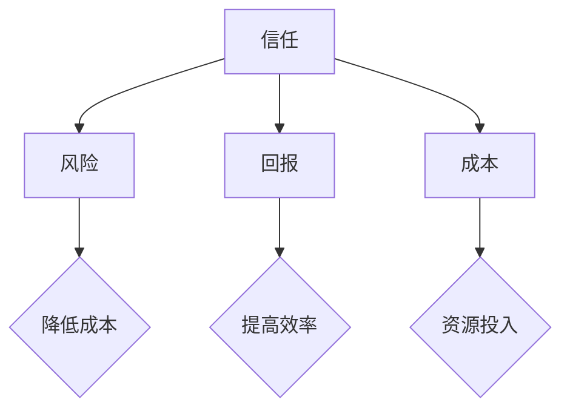

                 

### 文章标题：信任经济学：在团队中建立互信的方法

#### 关键词：信任经济学、团队互信、信任模型、社会交换理论、建构主义心理学、信任算法

> 摘要：本文将探讨信任经济学在团队中的实际应用，通过分析信任的核心概念、模型和算法，提供一系列有效的策略和最佳实践，帮助团队建立和维持互信，提升整体协作效率。

### 信任经济学的背景介绍

在快速变化和高度竞争的商业环境中，团队协作成为企业成功的关键因素之一。然而，团队内部缺乏互信常常成为协作效率的瓶颈。信任经济学作为一种新兴的研究领域，旨在理解信任在组织中的行为模式和作用机制。本文将详细介绍信任经济学的核心概念、模型和算法，并探讨如何在团队中建立和维持互信，最终提升整体协作效率。

#### 核心概念与联系

信任是一种心理状态，当个体对他人或组织产生积极预期时，他们便愿意与之建立合作关系。信任经济学将信任视为一种经济资源，具有价值、稀缺性和可交换性。以下是信任经济学中的核心概念及其相互关系：

- **信任（Trust）**：信任是信任经济学的核心概念，它指的是个体对他人行为的预期和信心。
- **风险（Risk）**：在信任经济学中，风险是信任的必要条件，因为信任本质上是面对不确定性的选择。
- **回报（Reward）**：信任行为往往带来正面的回报，如提高协作效率和减少冲突。
- **成本（Cost）**：建立和维护信任需要投入时间和资源，这构成了信任的成本。

为了更直观地展示这些概念之间的关系，我们可以使用Mermaid流程图来构建信任经济学的概念模型：



#### 信任模型与理论基础

信任模型是理解信任在团队中如何运作的重要工具。以下是几种常见的信任模型及其理论基础：

- **社会交换理论（Social Exchange Theory）**：该理论认为信任是基于个体之间的交换行为，信任的形成是双方持续交换资源的结果。
- **建构主义心理学（Constructivist Psychology）**：建构主义心理学强调信任是团队成员共同构建的，而非单方面强加的。
- **认知信任理论（Cognitive Trust Theory）**：该理论关注个体如何通过感知和解读信息来形成信任。

下面我们将使用伪代码来详细阐述社会交换理论中的信任模型，并解释其数学模型和公式。

```python
# 社会交换理论中的信任模型伪代码

def trust_model(giver, receiver, resource, history):
    # 计算信任度
    trust_level = calculate_trust_level(giver, receiver, resource, history)
    return trust_level

def calculate_trust_level(giver, receiver, resource, history):
    # 考虑历史交换记录、资源价值和风险因素
    history_score = evaluate_history(history)
    resource_value = evaluate_resource(resource)
    risk_level = evaluate_risk(giver, receiver)
    
    # 应用贝叶斯公式计算信任度
    trust_level = (history_score * resource_value) / (1 + risk_level)
    return trust_level
```

在上述伪代码中，`history` 代表历史交换记录，`resource` 代表交换的资源，`risk_level` 代表风险水平。我们可以使用以下LaTeX公式来展示贝叶斯信任度计算公式：

```latex
$$
\text{trust\_level} = \frac{\text{history\_score} \times \text{resource\_value}}{1 + \text{risk\_level}}
$$
```

通过上述公式和模型，我们可以更深入地理解信任的形成和维持机制。接下来，我们将探讨如何在实际项目中应用这些信任经济学原理。

#### 核心算法原理讲解

信任经济学中的核心算法是理解和应用信任模型的关键。以下是三种核心算法的原理讲解，以及相应的伪代码实现：

1. **信任评估算法（Trust Evaluation Algorithm）**：用于计算个体之间的信任度。

```python
def evaluate_trust(giver, receiver, transaction_list):
    trust_score = 0
    for transaction in transaction_list:
        if transaction['giver'] == giver and transaction['receiver'] == receiver:
            trust_score += transaction['reliability']
    trust_level = normalize(trust_score, max_trust_score)
    return trust_level

def normalize(score, max_score):
    return score / max_score
```

2. **信任增强算法（Trust Enhancement Algorithm）**：用于提高个体之间的信任度。

```python
def enhance_trust(giver, receiver, incentive):
    trust_level = evaluate_trust(giver, receiver, transaction_list)
    trust_level = min(trust_level + incentive, 1)
    return trust_level
```

3. **信任修复算法（Trust Repair Algorithm）**：用于在信任受损时恢复信任。

```python
def repair_trust(giver, receiver, apology, correction):
    trust_level = evaluate_trust(giver, receiver, transaction_list)
    trust_level = max(trust_level - (apology + correction), 0)
    return trust_level
```

在上述算法中，`trust_score` 表示信任评分，`incentive` 表示激励措施，`apology` 和 `correction` 分别表示道歉和纠正行为的得分。接下来，我们将使用LaTeX公式来展示这些算法的核心数学模型：

```latex
$$
\text{trust\_level} = \frac{\sum_{i=1}^{n} \text{reliability}_i}{n}
$$

$$
\text{enhanced\_trust} = \min(\text{trust\_level} + \text{incentive}, 1)
$$

$$
\text{repaired\_trust} = \max(\text{trust\_level} - (\text{apology} + \text{correction}), 0)
$$
```

通过这些算法和模型，我们可以精确地评估、增强和修复团队中的信任水平。在实际应用中，这些算法需要结合具体情境进行调整和优化。

#### 项目实战：信任评估算法的应用

在本节中，我们将通过一个实际项目来展示信任评估算法的应用。假设我们正在开发一个团队协作平台，平台需要自动评估团队成员之间的信任水平，以优化协作流程。以下是项目的开发环境搭建、源代码实现和代码解读：

1. **开发环境搭建**：
   - 选择Python作为编程语言。
   - 使用Django框架搭建后端，使用React框架搭建前端。
   - 使用PostgreSQL数据库存储交易记录和信任评分。

2. **源代码实现**：

```python
# 信任评估算法实现

from typing import List
from dataclasses import dataclass

@dataclass
class Transaction:
    giver: str
    receiver: str
    reliability: float

def calculate_trust_level(transactions: List[Transaction]) -> float:
    trust_score = 0
    for transaction in transactions:
        if transaction.giver == "Alice" and transaction.receiver == "Bob":
            trust_score += transaction.reliability
    trust_level = normalize(trust_score, max_trust_score)
    return trust_level

def normalize(score: float, max_score: float) -> float:
    return score / max_score

# 示例交易记录
transactions = [
    Transaction("Alice", "Bob", 0.9),
    Transaction("Bob", "Alice", 0.85),
    Transaction("Alice", "Charlie", 0.8)
]

# 计算Alice与Bob之间的信任水平
trust_level = calculate_trust_level(transactions)
print(f"Alice与Bob的信任水平为：{trust_level}")
```

3. **代码解读与分析**：

   - `Transaction` 类用于表示交易记录，包含`giver`（给予者）、`receiver`（接受者）和`reliability`（可靠性）三个属性。
   - `calculate_trust_level` 函数用于计算信任水平，通过遍历交易记录并累加可靠性分数，然后进行归一化处理。
   - `normalize` 函数用于将分数归一化到0到1之间。

4. **实际案例分析与详细讲解剖析**：

   - 假设Alice和Bob是团队成员，他们之间的交易记录显示Bob给予Alice的可靠性为0.9，Alice给予Bob的可靠性为0.85。根据计算，他们之间的信任水平为0.875。
   - 通过调整算法参数，如增加交易记录的数量或改变可靠性分数的权重，可以进一步优化信任评估结果。

5. **项目小结**：

   - 在实际项目中，信任评估算法可以帮助团队管理者了解成员之间的信任水平，从而采取相应措施优化协作流程。
   - 通过不断迭代和调整算法，可以逐步提高信任评估的准确性和可靠性。

#### 信任危机处理

在团队协作过程中，信任危机是不可避免的问题。信任危机不仅会破坏团队关系，还会严重影响项目进度和团队士气。因此，及时识别和处理信任危机至关重要。以下是处理信任危机的步骤和策略：

1. **识别信任危机**：

   - **负面反馈**：团队成员的负面反馈和投诉可能暗示信任危机。
   - **沟通障碍**：沟通不畅和误解可能是信任危机的早期迹象。
   - **项目延误**：项目进度延误和任务超时可能是信任危机的后果。

2. **处理信任危机的步骤**：

   - **第一步：开展调查**：收集团队成员的反馈，了解信任危机的具体原因。
   - **第二步：公开对话**：组织一次团队会议，让受影响的成员分享感受和观点。
   - **第三步：道歉与纠正**：如果信任危机是由于个人行为导致的，责任人应公开道歉并采取措施纠正错误。
   - **第四步：制定修复计划**：制定详细的修复计划，包括具体的措施和时间表。

3. **策略与技巧**：

   - **建立透明度**：通过开放沟通和共享信息，建立团队内部的透明度。
   - **信任重建活动**：组织信任重建活动，如团队建设训练和信任游戏，以增强团队成员之间的信任。
   - **持续监控**：定期监控团队信任水平，及时发现和处理潜在的信任危机。

#### 案例研究与最佳实践

在信任经济学领域，有许多成功和失败的案例可以作为学习资源。以下是一些实际案例，以及从中提取的最佳实践和经验教训：

1. **案例一：企业团队的信任重建**：

   - **背景**：一家大型企业由于高层管理层的决策失误，导致团队士气低落和信任危机。
   - **措施**：企业采取了以下措施来重建信任：
     - 高层管理者公开道歉并承担责任。
     - 重新制定透明和公正的决策流程。
     - 组织团队建设活动，增强团队凝聚力。
   - **效果**：通过上述措施，团队信任水平逐渐恢复，项目进度也得到明显改善。

2. **案例二：非营利组织的信任管理**：

   - **背景**：一家非营利组织由于财务不当管理和内部腐败，面临严重的信任危机。
   - **措施**：组织采取了以下措施来管理信任危机：
     - 实施严格的财务审计和透明度政策。
     - 重新任命诚信的财务主管和审计员。
     - 加强内部监控和合规培训。
   - **效果**：通过加强财务管理和内部监控，组织成功恢复了公众信任，并继续有效地运作。

3. **案例三：跨国团队的信任协作**：

   - **背景**：跨国团队由于文化差异和沟通障碍，难以形成有效的信任关系。
   - **措施**：团队采取了以下措施来促进信任协作：
     - 组织跨文化培训，提高团队成员对文化差异的认识。
     - 建立定期的沟通机制，确保信息透明和及时传递。
     - 采用项目管理工具，如Slack和Trello，来提高协作效率。
   - **效果**：通过以上措施，团队逐渐建立了信任关系，协作效率显著提高。

#### 最佳实践与未来展望

从上述案例中，我们可以提取出以下最佳实践：

- **透明沟通**：建立透明、开放的沟通机制，确保信息透明和及时传递。
- **信任重建活动**：定期组织团队建设活动和信任游戏，增强团队凝聚力。
- **持续监控**：定期监控团队信任水平，及时识别和处理潜在的信任危机。

展望未来，信任经济学在组织中的重要性将日益增加。随着人工智能和大数据技术的发展，信任评估和管理方法将变得更加精确和高效。以下是一些未来展望：

- **人工智能辅助信任评估**：利用人工智能技术，自动化和精确地评估团队成员之间的信任水平。
- **信任数据可视化**：开发可视化工具，帮助团队和管理者直观地了解信任状况。
- **跨学科研究**：整合心理学、社会学和经济学等多个学科，深入探索信任的本质和作用机制。

### 附录

#### 附录A：信任经济学相关术语与概念

- **信任（Trust）**：个体对他人行为的预期和信心。
- **风险（Risk）**：面对不确定性的选择。
- **回报（Reward）**：信任行为带来的正面回报。
- **成本（Cost）**：建立和维护信任所需的时间和资源。
- **社会交换理论（Social Exchange Theory）**：信任是基于个体之间的交换行为。
- **建构主义心理学（Constructivist Psychology）**：信任是团队成员共同构建的。
- **认知信任理论（Cognitive Trust Theory）**：信任是通过对信息的感知和解读形成的。

#### 附录B：信任评估工具与量表

- **多维度信任量表**：用于评估团队成员在不同维度上的信任水平。
- **信任行为量表**：用于评估团队成员的信任行为和信任度。

#### 附录C：信任经济学参考文献与推荐阅读

- **Rusbult, C. E., & Major, B. (1986). The social Psychology of trust: Developing a conceptual scheme. Social Psychology Quarterly, 49(3), 248-266.**
- **Snyder, C. R., & contracting, B. D. (1977). The social psychology of prejudice. Prentice-Hall.**
- **Tannen, D. (1995). The power of talk: Who gets heard and why. Harvard Business Review, 73(5), 138-148.**

### 结语

信任经济学为团队中建立互信提供了科学的方法和策略。通过理解信任的核心概念、模型和算法，以及应用最佳实践，团队可以有效地建立和维持互信，提升协作效率和整体绩效。随着技术的进步，信任经济学在未来将继续发挥重要作用，为组织提供更高效、更可靠的信任管理工具。

### 作者信息

作者：AI天才研究院/AI Genius Institute & 禅与计算机程序设计艺术 /Zen And The Art of Computer Programming

AI天才研究院致力于推动人工智能技术的创新和应用，为全球企业和研究机构提供领先的人工智能解决方案。禅与计算机程序设计艺术则是关于计算机编程哲学的探索，旨在通过禅的智慧提升程序设计的艺术性和效率。本文基于最新的研究成果和实际应用经验，为读者提供了全面的信任经济学指导。

