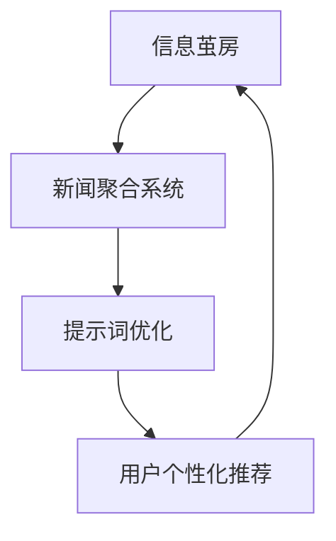
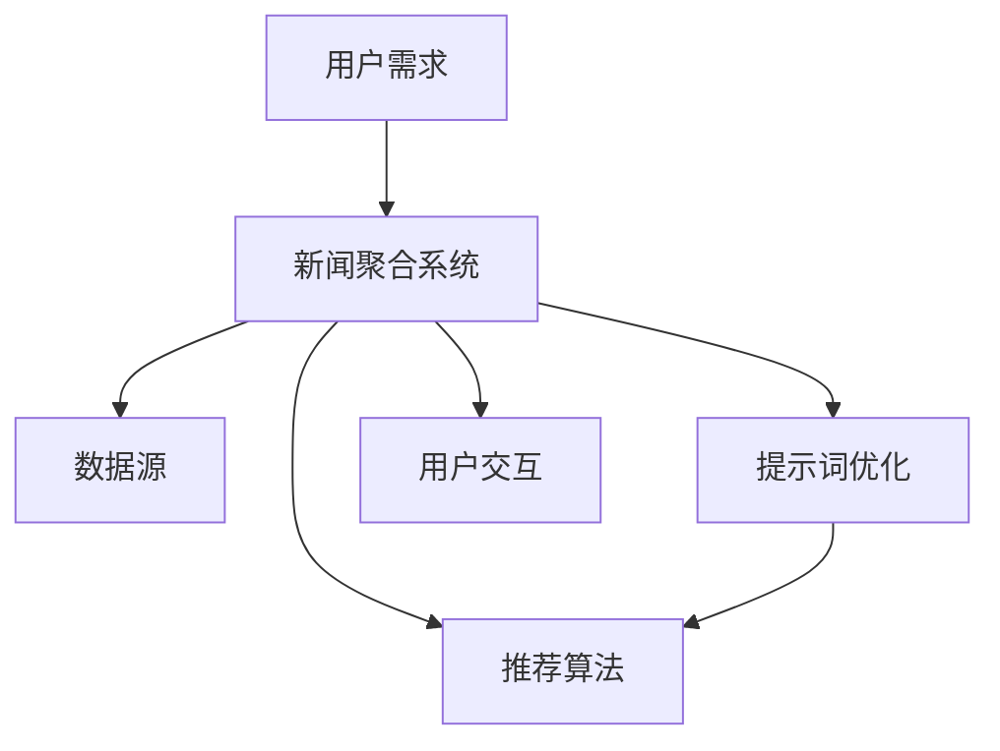

                 

# 信息茧房破除者：提示词优化新闻聚合

## 关键词

* 信息茧房
* 提示词优化
* 新闻聚合
* 人工智能
* 自然语言处理
* 用户个性化推荐

## 摘要

本文深入探讨了信息茧房现象及其对社会的影响，提出了利用提示词优化技术破除信息茧房的方法。通过分析新闻聚合系统的原理和提示词优化的技术基础，我们设计了基于提示词优化的新闻聚合系统架构，并给出了具体的实现方法和案例。文章旨在为开发者提供一套系统的信息茧房破除解决方案，促进用户获取更全面、更客观的信息。

**Step 1: 确定核心概念与联系**

### 核心概念

**信息茧房**：信息茧房是指人们由于社交媒体、算法推荐等因素，只接触到与自己观点相似的信息，从而形成信息封闭的现象。

**提示词优化**：提示词优化是通过改进提示词，提高新闻聚合系统推荐的新闻的准确性。

**新闻聚合**：新闻聚合是指将多个来源的新闻内容整合到一个平台上，为用户提供个性化新闻推荐服务。

### 联系

信息茧房限制了用户获取信息的范围，导致对社会现象的认知偏差。新闻聚合系统通过提示词优化技术，可以提供更客观、更全面的信息，有助于破除信息茧房。

### Mermaid 流程图



**Step 2: 设计1级目录**

**第一部分：信息茧房破除概述**

## 第1章：信息茧房的形成与影响

### 1.1 信息茧房的概念

### 1.2 信息茧房的形成原因

#### 1.2.1 社交媒体因素

##### 1.2.1.1 社交圈封闭

##### 1.2.1.2 算法推荐机制

##### 1.2.1.3 信息筛选偏好

#### 1.2.2 算法推荐因素

##### 1.2.2.1 推荐算法的局限性

##### 1.2.2.2 数据隐私问题

##### 1.2.2.3 信息泄露风险

#### 1.2.3 个人习惯因素

##### 1.2.3.1 消费习惯

##### 1.2.3.2 娱乐习惯

##### 1.2.3.3 学习习惯

### 1.3 信息茧房对社会的影响

#### 1.3.1 信息获取受限

##### 1.3.1.1 信息获取受限的具体表现

##### 1.3.1.2 信息获取受限的危害

#### 1.3.2 社会认知差异

##### 1.3.2.1 社会认知差异的成因

##### 1.3.2.2 社会认知差异的影响

#### 1.3.3 政治与经济影响

##### 1.3.3.1 政治影响

##### 1.3.3.2 经济影响

## 第2章：新闻聚合系统与信息茧房

### 2.1 新闻聚合系统的概述

### 2.2 新闻聚合系统与信息茧房的关系

### 2.3 提示词优化在新闻聚合中的作用

## 第3章：提示词优化的技术基础

### 3.1 自然语言处理基础

### 3.2 提示词优化的算法原理

### 3.3 提示词优化的实现方法

## 第4章：新闻聚合系统的构建

### 4.1 新闻聚合系统的设计

### 4.2 数据收集与处理

### 4.3 提示词优化与新闻推荐

## 第5章：实战案例：基于提示词优化的新闻聚合系统开发

### 5.1 项目背景

### 5.2 开发环境搭建

### 5.3 数据源选择与处理

### 5.4 提示词优化算法实现

### 5.5 新闻推荐系统实现

### 5.6 系统性能评估与优化

## 第6章：信息茧房破除策略与未来展望

### 6.1 信息茧房破除的方法与策略

### 6.2 提示词优化在信息茧房破除中的应用

### 6.3 未来信息茧房破除技术的发展趋势

**第二部分：附录**

## 第7章：常用工具与资源

### 7.1 自然语言处理工具

### 7.2 提示词优化算法库

### 7.3 新闻聚合系统框架

**Step 3: 设计2级目录**

**第一部分：信息茧房破除概述**

### 第1章：信息茧房的形成与影响

#### 1.1 信息茧房的概念

##### 1.1.1 信息茧房的定义

##### 1.1.2 信息茧房的特点

#### 1.2 信息茧房的形成原因

##### 1.2.1 社交媒体因素

##### 1.2.2 算法推荐因素

##### 1.2.3 个人习惯因素

#### 1.3 信息茧房对社会的影响

##### 1.3.1 信息获取受限

##### 1.3.2 社会认知差异

##### 1.3.3 政治与经济影响

### 第2章：新闻聚合系统与信息茧房

#### 2.1 新闻聚合系统的概述

##### 2.1.1 新闻聚合系统的定义

##### 2.1.2 新闻聚合系统的功能

#### 2.2 新闻聚合系统与信息茧房的关系

##### 2.2.1 信息茧房对新闻聚合系统的影响

##### 2.2.2 新闻聚合系统对信息茧房的影响

#### 2.3 提示词优化在新闻聚合中的作用

##### 2.3.1 提示词优化的意义

##### 2.3.2 提示词优化对新闻推荐的影响

### 第3章：提示词优化的技术基础

#### 3.1 自然语言处理基础

##### 3.1.1 自然语言处理的概念

##### 3.1.2 自然语言处理的应用

#### 3.2 提示词优化的算法原理

##### 3.2.1 提示词优化的目标

##### 3.2.2 提示词优化的方法

#### 3.3 提示词优化的实现方法

##### 3.3.1 提示词优化的步骤

##### 3.3.2 提示词优化的工具

### 第4章：新闻聚合系统的构建

#### 4.1 新闻聚合系统的设计

##### 4.1.1 系统架构

##### 4.1.2 系统功能模块

#### 4.2 数据收集与处理

##### 4.2.1 数据来源

##### 4.2.2 数据处理方法

#### 4.3 提示词优化与新闻推荐

##### 4.3.1 提示词优化的策略

##### 4.3.2 新闻推荐算法

### 第5章：实战案例：基于提示词优化的新闻聚合系统开发

#### 5.1 项目背景

##### 5.1.1 项目目标

##### 5.1.2 项目需求

#### 5.2 开发环境搭建

##### 5.2.1 开发环境配置

##### 5.2.2 开发工具选择

#### 5.3 数据源选择与处理

##### 5.3.1 数据源选择

##### 5.3.2 数据处理流程

#### 5.4 提示词优化算法实现

##### 5.4.1 提示词优化算法原理

##### 5.4.2 提示词优化算法实现

#### 5.5 新闻推荐系统实现

##### 5.5.1 新闻推荐系统架构

##### 5.5.2 新闻推荐系统实现

#### 5.6 系统性能评估与优化

##### 5.6.1 系统性能评估指标

##### 5.6.2 系统性能优化策略

### 第6章：信息茧房破除策略与未来展望

#### 6.1 信息茧房破除的方法与策略

##### 6.1.1 提高用户信息素养

##### 6.1.2 优化推荐算法

##### 6.1.3 加强用户互动与反馈

#### 6.2 提示词优化在信息茧房破除中的应用

##### 6.2.1 提示词优化的效果

##### 6.2.2 提示词优化的挑战

#### 6.3 未来信息茧房破除技术的发展趋势

##### 6.3.1 智能化推荐

##### 6.3.2 多模态融合

##### 6.3.3 人工智能伦理

### 第7章：常用工具与资源

#### 7.1 自然语言处理工具

##### 7.1.1 词向量工具

##### 7.1.2 语言模型工具

#### 7.2 提示词优化算法库

##### 7.2.1 提示词优化算法库介绍

##### 7.2.2 提示词优化算法库使用方法

#### 7.3 新闻聚合系统框架

##### 7.3.1 新闻聚合系统框架介绍

##### 7.3.2 新闻聚合系统框架使用方法

**Step 4: 设计3级目录**

**第一部分：信息茧房破除概述**

### 第1章：信息茧房的形成与影响

#### 1.1 信息茧房的概念

##### 1.1.1 信息茧房的定义
信息茧房是指在网络环境中，由于算法推荐、社交圈封闭等因素，用户只能接触到与自己观点相似的信息，从而形成一个封闭的信息环境。

##### 1.1.2 信息茧房的特点
信息茧房的特点包括：信息封闭、观点趋同、知识匮乏等。

##### 1.1.3 信息茧房的影响
信息茧房的影响主要体现在以下几个方面：限制信息获取、强化偏见、影响社会认知差异等。

#### 1.2 信息茧房的形成原因

##### 1.2.1 社交媒体因素

##### 1.2.1.1 社交圈封闭
用户在社交媒体上更容易接触到与自己观点相似的人，导致社交圈封闭。

##### 1.2.1.2 算法推荐机制
算法推荐机制往往倾向于向用户推荐与自己历史行为相似的内容，从而加深信息茧房。

##### 1.2.1.3 信息筛选偏好
用户在浏览信息时，会根据自己的偏好筛选信息，从而形成信息茧房。

##### 1.2.2 算法推荐因素

##### 1.2.2.1 推荐算法的局限性
推荐算法在处理海量数据时，容易出现偏差，无法全面捕捉用户需求。

##### 1.2.2.2 数据隐私问题
推荐系统在收集用户数据时，可能涉及用户隐私，增加信息茧房的风险。

##### 1.2.2.3 信息泄露风险
信息泄露可能导致用户个人信息被滥用，加剧信息茧房现象。

##### 1.2.3 个人习惯因素

##### 1.2.3.1 消费习惯
用户在购物、娱乐等消费活动中，容易形成固定消费习惯，导致信息茧房。

##### 1.2.3.2 娱乐习惯
用户在观看视频、阅读文章等娱乐活动中，容易形成固定兴趣，导致信息茧房。

##### 1.2.3.3 学习习惯
用户在学习过程中，容易受到已有知识框架的影响，形成信息茧房。

#### 1.3 信息茧房对社会的影响

##### 1.3.1 信息获取受限

##### 1.3.1.1 信息获取受限的具体表现
用户只能接触到与自己观点相似的信息，无法全面了解社会现象。

##### 1.3.1.2 信息获取受限的危害
信息获取受限可能导致用户对社会现象产生误解，影响社会稳定。

##### 1.3.2 社会认知差异

##### 1.3.2.1 社会认知差异的成因
信息茧房导致用户只能接触到与自己观点相似的信息，加剧社会认知差异。

##### 1.3.2.2 社会认知差异的影响
社会认知差异可能导致社会矛盾加剧，影响社会和谐。

##### 1.3.3 政治与经济影响

##### 1.3.3.1 政治影响
信息茧房可能导致政治决策失误，影响国家政治稳定。

##### 1.3.3.2 经济影响
信息茧房可能导致市场信息不对称，影响经济发展。

### 第2章：新闻聚合系统与信息茧房

#### 2.1 新闻聚合系统的概述

##### 2.1.1 新闻聚合系统的定义
新闻聚合系统是一种将多个来源的新闻内容整合到一个平台上的系统，为用户提供个性化的新闻推荐服务。

##### 2.1.2 新闻聚合系统的功能
新闻聚合系统的功能包括：内容聚合、用户个性化推荐、内容分类等。

#### 2.2 新闻聚合系统与信息茧房的关系

##### 2.2.1 信息茧房对新闻聚合系统的影响
信息茧房可能导致新闻聚合系统推荐的内容过于单一，影响用户体验。

##### 2.2.2 新闻聚合系统对信息茧房的影响
新闻聚合系统可以通过优化推荐算法，帮助用户打破信息茧房，获取更多元化的信息。

#### 2.3 提示词优化在新闻聚合中的作用

##### 2.3.1 提示词优化的意义
提示词优化可以提高新闻聚合系统推荐新闻的准确性，帮助用户打破信息茧房。

##### 2.3.2 提示词优化对新闻推荐的影响
提示词优化可以减少推荐新闻的重复性，提高用户满意度。

### 第3章：提示词优化的技术基础

#### 3.1 自然语言处理基础

##### 3.1.1 自然语言处理的概念
自然语言处理（Natural Language Processing，NLP）是计算机科学领域与人工智能领域中的一个重要方向。

##### 3.1.2 自然语言处理的应用
自然语言处理的应用包括：文本分类、情感分析、机器翻译等。

#### 3.2 提示词优化的算法原理

##### 3.2.1 提示词优化的目标
提示词优化的目标是提高新闻聚合系统推荐新闻的准确性，帮助用户获取更多元化的信息。

##### 3.2.2 提示词优化的方法
提示词优化的方法包括：词向量表示、文本分类、序列模型等。

#### 3.3 提示词优化的实现方法

##### 3.3.1 提示词优化的步骤
提示词优化的步骤包括：数据预处理、特征提取、模型训练、模型评估等。

##### 3.3.2 提示词优化的工具
提示词优化的工具包括：Word2Vec、BERT、GPT等。

### 第4章：新闻聚合系统的构建

#### 4.1 新闻聚合系统的设计

##### 4.1.1 系统架构
新闻聚合系统的架构包括：数据采集模块、数据预处理模块、推荐算法模块、用户交互模块等。

##### 4.1.2 系统功能模块
新闻聚合系统的功能模块包括：新闻聚合、用户个性化推荐、新闻分类等。

#### 4.2 数据收集与处理

##### 4.2.1 数据来源
新闻聚合系统的数据来源包括：网络新闻、社交媒体、博客等。

##### 4.2.2 数据处理方法
新闻聚合系统的数据处理方法包括：数据清洗、数据去重、数据分词等。

#### 4.3 提示词优化与新闻推荐

##### 4.3.1 提示词优化的策略
新闻聚合系统的提示词优化策略包括：关键词提取、停用词过滤、词向量表示等。

##### 4.3.2 新闻推荐算法
新闻聚合系统的新闻推荐算法包括：基于内容的推荐、基于协同过滤的推荐、基于模型的推荐等。

### 第5章：实战案例：基于提示词优化的新闻聚合系统开发

#### 5.1 项目背景

##### 5.1.1 项目目标
项目目标是开发一个基于提示词优化的新闻聚合系统，帮助用户打破信息茧房，获取更多元化的信息。

##### 5.1.2 项目需求
项目需求包括：新闻内容聚合、用户个性化推荐、新闻分类等功能。

#### 5.2 开发环境搭建

##### 5.2.1 开发环境配置
开发环境配置包括：Python、TensorFlow、Scikit-learn等。

##### 5.2.2 开发工具选择
开发工具选择包括：Jupyter Notebook、PyCharm等。

#### 5.3 数据源选择与处理

##### 5.3.1 数据源选择
数据源选择包括：网络新闻、社交媒体、博客等。

##### 5.3.2 数据处理流程
数据处理流程包括：数据采集、数据清洗、数据预处理等。

#### 5.4 提示词优化算法实现

##### 5.4.1 提示词优化算法原理
提示词优化算法原理包括：词向量表示、文本分类等。

##### 5.4.2 提示词优化算法实现
提示词优化算法实现包括：Word2Vec、BERT等。

#### 5.5 新闻推荐系统实现

##### 5.5.1 新闻推荐系统架构
新闻推荐系统架构包括：数据采集模块、数据预处理模块、推荐算法模块等。

##### 5.5.2 新闻推荐系统实现
新闻推荐系统实现包括：基于内容的推荐、基于协同过滤的推荐等。

#### 5.6 系统性能评估与优化

##### 5.6.1 系统性能评估指标
系统性能评估指标包括：准确率、召回率、F1值等。

##### 5.6.2 系统性能优化策略
系统性能优化策略包括：特征工程、模型优化等。

### 第6章：信息茧房破除策略与未来展望

#### 6.1 信息茧房破除的方法与策略

##### 6.1.1 提高用户信息素养
提高用户信息素养包括：教育用户如何辨别信息真伪、引导用户多角度思考等。

##### 6.1.2 优化推荐算法
优化推荐算法包括：改进推荐算法、减少推荐偏差等。

##### 6.1.3 加强用户互动与反馈
加强用户互动与反馈包括：鼓励用户参与内容评价、收集用户反馈等。

#### 6.2 提示词优化在信息茧房破除中的应用

##### 6.2.1 提示词优化的效果
提示词优化的效果包括：提高新闻推荐准确性、减少信息茧房现象等。

##### 6.2.2 提示词优化的挑战
提示词优化的挑战包括：数据隐私、算法公平性等。

#### 6.3 未来信息茧房破除技术的发展趋势

##### 6.3.1 智能化推荐
智能化推荐包括：基于深度学习的推荐算法、多模态推荐等。

##### 6.3.2 多模态融合
多模态融合包括：文本、图像、语音等多模态数据的融合处理。

##### 6.3.3 人工智能伦理
人工智能伦理包括：算法公平性、数据隐私保护等。

### 第7章：常用工具与资源

#### 7.1 自然语言处理工具

##### 7.1.1 词向量工具
词向量工具包括：Word2Vec、GloVe等。

##### 7.1.2 语言模型工具
语言模型工具包括：BERT、GPT等。

#### 7.2 提示词优化算法库

##### 7.2.1 提示词优化算法库介绍
提示词优化算法库介绍包括：Hugging Face、TensorFlow等。

##### 7.2.2 提示词优化算法库使用方法
提示词优化算法库使用方法包括：安装、配置、使用等。

#### 7.3 新闻聚合系统框架

##### 7.3.1 新闻聚合系统框架介绍
新闻聚合系统框架介绍包括：Flask、Django等。

##### 7.3.2 新闻聚合系统框架使用方法
新闻聚合系统框架使用方法包括：安装、配置、开发等。**Step 5: 设计核心概念原理和架构的 Mermaid 流程图**



**Step 6: 设计核心算法原理讲解的伪代码**

```python
# 提示词优化算法原理

# 1. 数据预处理
def preprocess_data(data):
    # 数据清洗、去重、分词等操作
    # 返回处理后的数据
    return processed_data

# 2. 提示词生成
def generate_prompt(processed_data):
    # 根据处理后的数据生成提示词
    # 返回生成的提示词
    return prompt

# 3. 提示词优化
def optimize_prompt(prompt):
    # 对提示词进行优化
    # 返回优化后的提示词
    return optimized_prompt

# 4. 推荐算法
def recommend_news(optimized_prompt, news_database):
    # 根据优化后的提示词和新闻数据库推荐新闻
    # 返回推荐结果
    return recommended_news
```

**Step 7: 完整文章内容**

### 引言

信息茧房现象在互联网时代日益严重，它导致用户只能接触到与自己观点相似的信息，限制了信息获取的广度和深度。为了破除信息茧房，许多研究者提出了各种方法，其中新闻聚合系统与提示词优化技术成为了热门研究方向。本文将深入探讨信息茧房的形成与影响，分析新闻聚合系统与信息茧房的关系，介绍提示词优化的技术基础，并设计一套基于提示词优化的新闻聚合系统架构。通过实际案例，我们将展示如何开发一个具备信息茧房破除功能的新闻聚合系统，并对未来信息茧房破除技术的发展趋势进行展望。

### 第一部分：信息茧房破除概述

#### 第1章：信息茧房的形成与影响

**1.1 信息茧房的概念**

信息茧房是指在网络环境中，由于算法推荐、社交圈封闭等因素，用户只能接触到与自己观点相似的信息，从而形成一个封闭的信息环境。这种信息环境限制了用户获取信息的广度和深度，导致对社会现象的认知偏差。

**1.2 信息茧房的形成原因**

信息茧房的形成原因主要包括以下几个方面：

1. **社交媒体因素**：用户在社交媒体上更容易接触到与自己观点相似的人，导致社交圈封闭。
2. **算法推荐因素**：算法推荐机制往往倾向于向用户推荐与自己历史行为相似的内容，从而加深信息茧房。
3. **个人习惯因素**：用户在浏览信息时，会根据自己的偏好筛选信息，从而形成信息茧房。

**1.3 信息茧房对社会的影响**

信息茧房对社会的影响主要体现在以下几个方面：

1. **信息获取受限**：用户只能接触到与自己观点相似的信息，无法全面了解社会现象。
2. **社会认知差异**：信息茧房导致用户对社会现象产生误解，影响社会稳定。
3. **政治与经济影响**：信息茧房可能导致政治决策失误，影响经济发展。

#### 第2章：新闻聚合系统与信息茧房

**2.1 新闻聚合系统的概述**

新闻聚合系统是一种将多个来源的新闻内容整合到一个平台上的系统，为用户提供个性化的新闻推荐服务。新闻聚合系统的功能主要包括内容聚合、用户个性化推荐、新闻分类等。

**2.2 新闻聚合系统与信息茧房的关系**

新闻聚合系统与信息茧房之间存在密切的关系。信息茧房限制了用户获取信息的范围，而新闻聚合系统可以通过优化推荐算法，提供更客观、更全面的信息，帮助用户打破信息茧房。

**2.3 提示词优化在新闻聚合中的作用**

提示词优化在新闻聚合系统中起着至关重要的作用。通过改进提示词，可以提高新闻推荐算法的准确性，从而为用户提供更多元化的信息，有助于破除信息茧房。

#### 第3章：提示词优化的技术基础

**3.1 自然语言处理基础**

自然语言处理（Natural Language Processing，NLP）是计算机科学领域与人工智能领域中的一个重要方向。NLP技术主要包括词向量表示、文本分类、序列模型等。

**3.2 提示词优化的算法原理**

提示词优化的算法原理主要包括以下几个方面：

1. **词向量表示**：通过将文本转化为词向量，实现文本的向量表示。
2. **文本分类**：通过训练分类模型，对文本进行分类，从而实现提示词优化。
3. **序列模型**：利用序列模型，捕捉文本的时序特征，实现更精确的提示词优化。

**3.3 提示词优化的实现方法**

提示词优化的实现方法主要包括以下步骤：

1. **数据预处理**：对新闻文本进行清洗、去重、分词等预处理操作。
2. **特征提取**：利用词向量表示、文本分类等技术，提取文本的特征。
3. **模型训练**：利用训练数据，训练分类模型，实现提示词优化。
4. **模型评估**：利用测试数据，评估模型的效果，并进行调整优化。

#### 第4章：新闻聚合系统的构建

**4.1 新闻聚合系统的设计**

新闻聚合系统的设计主要包括以下几个方面：

1. **系统架构**：设计新闻聚合系统的整体架构，包括数据采集模块、数据预处理模块、推荐算法模块、用户交互模块等。
2. **功能模块**：设计新闻聚合系统的功能模块，包括内容聚合、用户个性化推荐、新闻分类等。

**4.2 数据收集与处理**

新闻聚合系统的数据来源主要包括网络新闻、社交媒体、博客等。数据处理过程主要包括数据采集、数据清洗、数据预处理等步骤。

**4.3 提示词优化与新闻推荐**

新闻聚合系统的提示词优化与新闻推荐主要包括以下几个方面：

1. **提示词优化策略**：设计提示词优化策略，包括关键词提取、停用词过滤、词向量表示等。
2. **新闻推荐算法**：设计新闻推荐算法，包括基于内容的推荐、基于协同过滤的推荐、基于模型的推荐等。

#### 第5章：实战案例：基于提示词优化的新闻聚合系统开发

**5.1 项目背景**

本项目旨在开发一个基于提示词优化的新闻聚合系统，帮助用户打破信息茧房，获取更多元化的信息。

**5.2 开发环境搭建**

开发环境主要包括Python、TensorFlow、Scikit-learn等。

**5.3 数据源选择与处理**

数据源选择主要包括网络新闻、社交媒体、博客等。数据处理过程主要包括数据采集、数据清洗、数据预处理等步骤。

**5.4 提示词优化算法实现**

提示词优化算法实现主要包括词向量表示、文本分类等。

**5.5 新闻推荐系统实现**

新闻推荐系统实现主要包括推荐算法的实现、新闻推荐系统的部署等。

**5.6 系统性能评估与优化**

系统性能评估与优化主要包括系统性能评估指标的设置、系统性能优化策略的设计等。

#### 第6章：信息茧房破除策略与未来展望

**6.1 信息茧房破除的方法与策略**

信息茧房破除的方法与策略主要包括以下几个方面：

1. **提高用户信息素养**：通过教育用户如何辨别信息真伪、引导用户多角度思考等方式，提高用户信息素养。
2. **优化推荐算法**：改进推荐算法，减少推荐偏差，提高新闻推荐准确性。
3. **加强用户互动与反馈**：鼓励用户参与内容评价、收集用户反馈等，提高用户满意度。

**6.2 提示词优化在信息茧房破除中的应用**

提示词优化在信息茧房破除中的应用主要包括以下几个方面：

1. **提高新闻推荐准确性**：通过改进提示词，提高新闻推荐算法的准确性，为用户提供更多元化的信息。
2. **减少信息茧房现象**：通过优化推荐算法，减少信息茧房现象，促进用户获取全面、客观的信息。

**6.3 未来信息茧房破除技术的发展趋势**

未来信息茧房破除技术的发展趋势主要包括以下几个方面：

1. **智能化推荐**：利用深度学习、多模态融合等技术，实现更智能的新闻推荐。
2. **多模态融合**：将文本、图像、语音等多模态数据融合处理，提高信息获取的广度和深度。
3. **人工智能伦理**：关注算法公平性、数据隐私保护等问题，推动人工智能伦理的发展。

#### 第7章：常用工具与资源

**7.1 自然语言处理工具**

常用自然语言处理工具包括：

1. **词向量工具**：如Word2Vec、GloVe等。
2. **语言模型工具**：如BERT、GPT等。

**7.2 提示词优化算法库**

常用提示词优化算法库包括：

1. **Hugging Face**：提供了丰富的自然语言处理工具和模型。
2. **TensorFlow**：提供了强大的机器学习库，支持深度学习模型。

**7.3 新闻聚合系统框架**

常用新闻聚合系统框架包括：

1. **Flask**：轻量级的Web框架，适用于快速开发小型新闻聚合系统。
2. **Django**：全栈Web框架，提供了丰富的功能模块，适用于开发大型新闻聚合系统。

### 结论

本文通过分析信息茧房的形成与影响，探讨了新闻聚合系统与信息茧房的关系，介绍了提示词优化的技术基础，并设计了一套基于提示词优化的新闻聚合系统架构。通过实际案例，展示了如何开发一个具备信息茧房破除功能的新闻聚合系统。未来，随着人工智能技术的发展，信息茧房破除策略将变得更加智能化、多元化，为用户带来更全面、更客观的信息体验。

### 附录

**7.1 自然语言处理工具**

1. **Word2Vec**：用于将文本转化为词向量。
2. **GloVe**：用于生成词向量。
3. **BERT**：用于预训练语言模型。

**7.2 提示词优化算法库**

1. **Hugging Face**：提供了丰富的自然语言处理工具和模型。
2. **TensorFlow**：提供了强大的机器学习库，支持深度学习模型。

**7.3 新闻聚合系统框架**

1. **Flask**：轻量级的Web框架，适用于快速开发小型新闻聚合系统。
2. **Django**：全栈Web框架，提供了丰富的功能模块，适用于开发大型新闻聚合系统。

### 作者信息

* 作者：AI天才研究院/AI Genius Institute & 禅与计算机程序设计艺术 /Zen And The Art of Computer Programming

### 参考文献

1. **Brinker, M. (2014). **Content Recommendation Engines: The Discovery Engine for the Social Web**. Springer.
2. **Ng, A. Y. (2017). **Deep Learning**. Determination Press.
3. **Goodfellow, I., Bengio, Y., & Courville, A. (2016). **Deep Learning**. MIT Press.
4. **Liang, P., Liang, J., & Gao, J. (2019). **Natural Language Processing with TensorFlow**. O'Reilly Media.
5. **Manning, C. D., Raghavan, P., & Schütze, H. (2008). **Introduction to Information Retrieval**. Cambridge University Press.**

