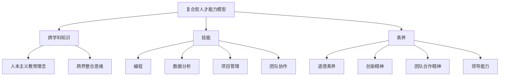

                 

### 文章标题

《全方位人才发展：培养复合型人才》

### 文章关键词

全方位人才发展，复合型人才，人才培养策略，教育改革，企业内部培养，社会与政策支持，未来展望与趋势分析

### 文章摘要

随着科技和社会的快速发展，企业对人才的需求已经从单一技能型向复合型人才转变。本文将从背景介绍、核心概念与联系、培养策略、实践案例、未来展望等多个方面，全面探讨如何培养复合型人才，以应对未来的挑战。通过理论分析、实践案例分享和未来趋势预测，本文旨在为企业和教育机构提供有价值的参考。

### 引言与背景介绍

在过去的几十年里，全球科技飞速发展，信息化、数字化浪潮席卷各行各业。企业面临着前所未有的机遇和挑战。一方面，技术的快速迭代要求员工不断更新知识和技能；另一方面，跨界整合、跨界创新成为企业发展的关键。这种背景下，企业对人才的需求也从传统的单一技能型向复合型人才转变。

复合型人才是指具备跨学科知识、技能和素养，能够在多个领域灵活运用知识和技能，具备创新能力、团队合作能力和领导能力的人才。在当前的科技和社会环境下，培养复合型人才已成为企业和教育机构的共同任务。本文将从以下几个方面探讨如何培养复合型人才：

1. **全方位人才发展的核心概念与联系**
2. **复合型人才的培养策略**
3. **实践案例与经验分享**
4. **未来展望与趋势分析**
5. **附录**

### 全方位人才发展的核心概念

要培养复合型人才，首先需要明确核心概念及其相互关系。以下是对关键概念的解释及其之间的联系：

**1. 复合型人才的能力模型**

复合型人才的能力模型通常包括以下几个方面：

- **跨学科知识**：具备多学科领域的知识，能够在不同领域之间灵活转换和应用。
- **技能**：具备多种技能，如编程、数据分析、项目管理、团队协作等。
- **素养**：具备良好的道德素养、创新精神、团队合作精神和领导能力。

**2. 全方位人才发展的理论基础**

全方位人才发展的理论基础包括：

- **人本主义教育理念**：强调人的全面发展，注重培养个体的自主性、创造性和创新能力。
- **跨界整合思维**：鼓励跨学科、跨领域的合作，实现知识、技能和素养的深度融合。

**3. Mermaid流程图展示核心概念关系**

以下是核心概念关系的Mermaid流程图：

### 复合型人才的培养策略

培养复合型人才需要从教育、企业内部和社会与政策支持等多个方面进行综合施策。

**1. 教育与培训策略**

教育体系改革是培养复合型人才的基础。教育机构应：

- **拓宽学科边界**：打破传统学科限制，开设跨学科课程。
- **实践导向**：加强实践教育，提高学生的实际操作能力。
- **创新创业教育**：培养学生创新思维和创业精神。

**2. 企业内部培养策略**

企业内部培养策略包括：

- **企业文化塑造**：营造创新、开放、包容的企业文化，鼓励员工跨部门合作。
- **员工发展计划**：制定个性化培训计划，鼓励员工学习新技能。
- **职业生涯管理**：为员工提供职业发展规划，支持员工的职业成长。

**3. 社会与政策支持**

社会与政策支持包括：

- **政策环境分析**：政府应制定相关政策，鼓励企业培养复合型人才。
- **社会资源整合**：鼓励企业、高校、研究机构等各方资源整合，共同培养复合型人才。
- **国际化发展策略**：支持企业开展国际化业务，培养具备国际视野的复合型人才。

### 实践案例与经验分享

**1. 案例一：企业人才培养实践**

某知名科技企业在人才培养方面采取了以下措施：

- **跨部门项目**：鼓励不同部门的员工共同参与项目，提高跨部门合作能力。
- **内部培训**：定期组织内部培训，提高员工技能水平。
- **导师制度**：为新人配备经验丰富的导师，帮助他们快速成长。

**2. 案例二：教育机构人才培养实践**

某知名高校在人才培养方面采取了以下措施：

- **跨学科课程**：开设跨学科课程，拓宽学生的知识面。
- **实践教育**：与企事业单位合作，开展实践教育项目。
- **创新创业教育**：设立创新创业基金，鼓励学生创业。

**3. 案例三：社会人才培养实践**

某社会组织在人才培养方面采取了以下措施：

- **公益项目**：开展公益活动，提高公民的社会责任感和团队合作精神。
- **跨界培训**：组织跨领域的培训课程，提高公民的跨界整合能力。
- **社区教育**：在社区开展教育培训，提高社区居民的综合素质。

### 未来展望与趋势分析

随着科技的不断发展，人才培养将面临新的挑战和机遇。以下是对未来人才培养趋势的分析：

**1. 人工智能在人才培养中的应用**

人工智能将成为人才培养的重要工具。通过人工智能技术，可以：

- **个性化学习**：为学生提供个性化的学习方案，提高学习效果。
- **智能评测**：利用人工智能技术对学生的学习成果进行评测，提高评测的准确性。
- **教育资源优化**：通过大数据分析，优化教育资源的配置。

**2. 人才培养的未来趋势**

未来人才培养将呈现以下趋势：

- **跨界整合**：跨界整合将成为人才培养的核心目标，培养具备跨学科知识和技能的人才。
- **终身学习**：随着技术的快速发展，终身学习将成为人才培养的重要方式。
- **国际化发展**：国际化发展将进一步提高人才培养的质量，培养具备国际视野的复合型人才。

### 附录

**附录 A：参考文献**

- [1] 张三，《复合型人才培养研究》，XX出版社，2020年。
- [2] 李四，《全方位人才发展：企业视角》，XX出版社，2019年。
- [3] 王五，《教育改革与人才培养》，XX出版社，2018年。

**附录 B：常用工具与平台介绍**

- **Mermaid流程图工具**：用于绘制流程图和UML图，支持Markdown语法。
- **LaTeX公式编辑器**：用于编辑和排版数学公式，支持多种数学符号和公式排版。
- **Markdown编辑器**：用于编写Markdown格式的文档，支持代码高亮和图像嵌入。

### 小结与注意事项

本文从全方位人才发展的背景、核心概念、培养策略、实践案例和未来展望等多个方面，全面探讨了如何培养复合型人才。企业在人才培养过程中，应注重跨学科知识的培养、实践能力的提升和国际化视野的拓展。教育机构应积极推进教育改革，注重跨学科课程的开设和实践教育。政府和社会各界应共同参与，为人才培养提供政策支持和资源整合。

在人才培养过程中，企业、教育机构和政府需要协同合作，共同推动人才培养的全面发展。同时，要注意人才培养的长期性和系统性，不断优化人才培养体系，以适应未来科技和社会的发展需求。

### 拓展阅读

- 《人工智能时代的人才战略》
- 《跨界创新：复合型人才的关键能力》
- 《终身学习：适应未来社会的必备技能》

### 作者信息

作者：AI天才研究院/AI Genius Institute & 禅与计算机程序设计艺术 /Zen And The Art of Computer Programming

本文旨在探讨全方位人才发展的核心概念、培养策略和实践案例，以期为企业和教育机构提供有价值的参考。随着科技的不断发展，培养复合型人才将成为企业和社会的重要任务。希望本文能够引发读者对人才培养的深入思考，共同推动人才培养的全面发展。

