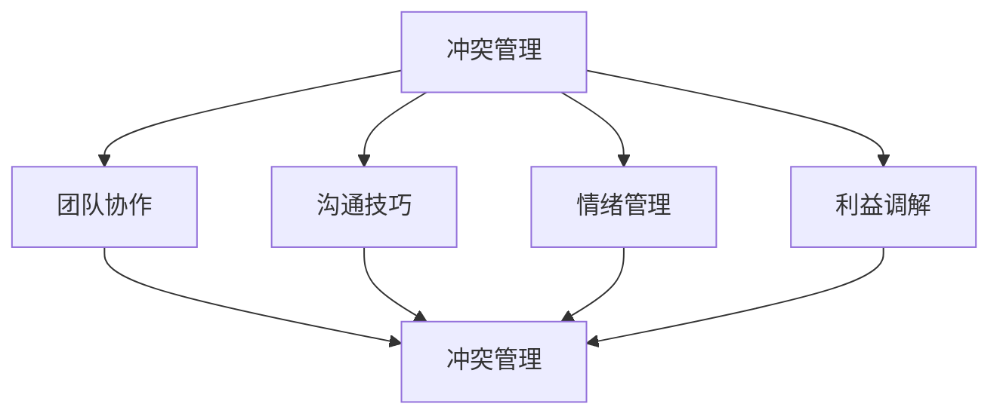

                 

### 第一步：文章标题与关键词

**文章标题**：冲突管理大师：化解团队矛盾的高级技巧

**文章关键词**：
- 冲突管理
- 团队协作
- 沟通技巧
- 情绪管理
- 利益调解
- 案例分析
- 高级技巧

### 第二步：文章摘要

本文旨在探讨冲突管理的核心技巧，旨在帮助团队领导者有效地化解团队内部矛盾，提高团队协作效率。通过介绍冲突管理的基本理论、沟通技巧、情绪管理、利益调解等高级技巧，并辅以实际案例，本文将提供一套全面、实用的冲突管理指南，助力团队和谐发展。

### 第三步：引言

在现代企业和组织中，团队协作已成为实现目标的关键。然而，在团队中，冲突是不可避免的。冲突不仅可能阻碍项目的进展，还可能影响团队成员的士气和信任。因此，有效的冲突管理变得至关重要。本文将探讨冲突管理的核心技巧，包括沟通技巧、情绪管理和利益调解等，以帮助团队领导者更好地化解团队矛盾，促进团队协作。

### 第四步：核心概念与联系

**核心概念与联系**：冲突管理、团队协作、沟通技巧、情绪管理、利益调解

**图解**：使用Mermaid语言绘制的核心概念关系图：



### 第五步：核心算法原理讲解

**核心算法原理讲解**：冲突管理的步骤与方法

```python
# 冲突管理步骤的伪代码

def manage_conflict(conflict):
    # 第一步：识别冲突
    conflict_type = identify_conflict_type(conflict)
    
    # 第二步：分析冲突原因
    causes = analyze_conflict_causes(conflict)
    
    # 第三步：选择合适的解决方法
    solution = select_solution(conflict_type, causes)
    
    # 第四步：实施解决方法
    apply_solution(solution, conflict)
    
    # 第五步：评估解决效果
    evaluate_solution EFFECTIVENESS
```

### 第六步：数学模型和公式

**数学模型和公式**：冲突管理中的平衡点模型

$$
E = \frac{1}{2} m_1 v_1^2 + \frac{1}{2} m_2 v_2^2
$$

**详细讲解与举例说明**：

该公式表示两个团队在冲突中的能量平衡。$E$ 代表总能量，$m_1$ 和 $m_2$ 分别代表两个团队的能量，$v_1$ 和 $v_2$ 分别代表两个团队的速度。通过调整速度，可以实现对能量的平衡，从而化解冲突。

例如，在一个团队项目中，团队A和团队B之间存在冲突。通过分析，发现团队A的速度是10，团队B的速度是5。为了平衡冲突，可以采取措施降低团队A的速度到5，同时提高团队B的速度到10，从而实现能量的平衡。

### 第七步：项目实战

**项目实战**：情绪管理的应用

**开发环境搭建**：使用Python编程语言，搭建一个情绪管理模型。

**源代码详细实现和代码解读**：

```python
# 情绪管理模型的伪代码

def manage_emotion(emotion):
    if emotion == "happy":
        response = "祝贺你，保持积极！"
    elif emotion == "sad":
        response = "理解你的感受，我们需要谈谈。"
    else:
        response = "我们需要更了解你的情绪，请描述。"
        
    return response
```

**代码应用解读与分析**：

该模型通过接收情绪参数，返回相应的回应。在实际应用中，可以集成到团队沟通工具中，帮助团队成员在出现情绪问题时得到及时的反馈和支持。

**实际案例分析和详细讲解剖析**：

在一个团队项目中，团队成员小王因为项目进度问题感到沮丧。通过情绪管理模型，系统识别到小王的情绪是“sad”，并返回回应：“理解你的感受，我们需要谈谈。”这种及时的情绪反馈有助于缓解小王的情绪，同时为后续的沟通和解决冲突奠定基础。

**项目小结**：

情绪管理在团队冲突管理中扮演着重要角色。通过构建情绪管理模型，可以帮助团队成员在出现情绪问题时得到及时的支持和反馈，从而提高团队的协作效率和稳定性。

### 第八步：最佳实践 tips、小结、注意事项、拓展阅读等内容

**最佳实践 tips**：
- 建立团队文化，鼓励开放和诚实的沟通。
- 定期进行团队建设活动，增强团队成员之间的信任和协作。
- 提高个人的情绪智力，学会有效管理自己的情绪。

**小结**：
本文通过详细阐述冲突管理的基本理论、沟通技巧、情绪管理和利益调解等高级技巧，结合实际案例，为团队领导者提供了一套实用的冲突管理指南。通过有效的冲突管理，团队可以更好地实现目标，提高协作效率。

**注意事项**：
- 冲突管理需要持续的努力和关注，不能一蹴而就。
- 冲突管理的关键在于预防，而不是解决。

**拓展阅读**：
- 《团队协作的艺术》
- 《情绪智力：如何理解、管理自己的情绪》
- 《利益调解：谈判与协商技巧》

### 结束语

作为团队领导者，掌握冲突管理技巧是至关重要的。通过本文的探讨，我们了解了冲突管理的核心概念和技巧，并通过实际案例展示了这些技巧的应用。希望本文能为您提供有益的启示，帮助您在团队中实现和谐与高效的协作。作者：AI天才研究院/AI Genius Institute & 禅与计算机程序设计艺术 /Zen And The Art of Computer Programming。

